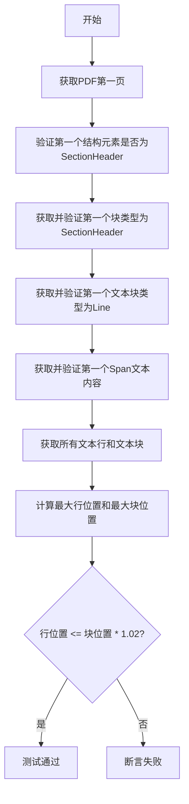
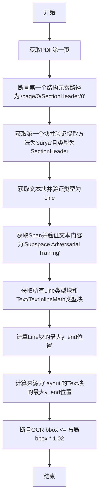
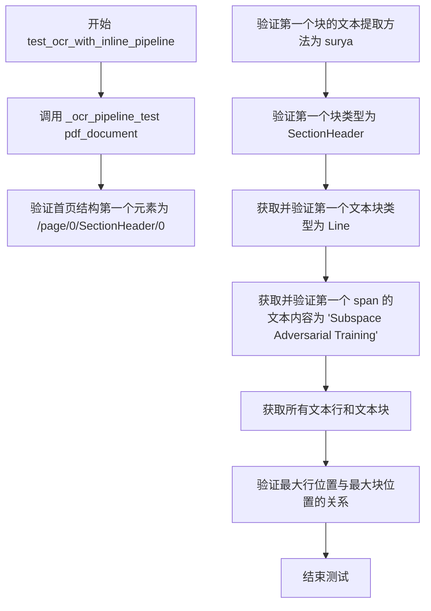

# `marker\tests\builders\test_ocr_pipeline.py` 详细设计文档

这是一个pytest测试文件，用于验证marker库的OCR管道功能，测试PDF文档的结构解析、文本提取方法以及布局框与OCR边界框的比例一致性。

## 整体流程



## 类结构

```
测试模块
├── _ocr_pipeline_test (内部测试函数)
├── test_ocr_pipeline (OCR管道测试)
└── test_ocr_with_inline_pipeline (带LLM的OCR管道测试)
```

## 全局变量及字段


### `pdf_document`
    
PDF文档对象，包含多个页面和文档结构信息

类型：`PDFDocument`
    


### `first_page`
    
PDF文档的第一页对象，包含页面结构和块信息

类型：`Page`
    


### `first_block`
    
第一页的第一个结构块，通常是SectionHeader类型的块

类型：`Block`
    


### `first_text_block`
    
第一个文本块，类型为Line，包含文本行的内容和位置信息

类型：`Line`
    


### `first_span`
    
第一个文本跨距，包含具体的文本内容

类型：`Span`
    


### `text_lines`
    
第一页中所有Line类型的块列表，用于文本行验证

类型：`List[Line]`
    


### `text_blocks`
    
第一页中Text和TextInlineMath类型的块列表

类型：`List[Block]`
    


### `max_line_position`
    
所有文本行的最大y_end坐标位置

类型：`float`
    


### `max_block_position`
    
所有layout源文本块的最大y_end坐标位置

类型：`float`
    


### `BlockTypes.SectionHeader`
    
章节标题块类型枚举值

类型：`BlockType`
    


### `BlockTypes.Line`
    
文本行块类型枚举值

类型：`BlockType`
    


### `BlockTypes.Span`
    
文本跨距块类型枚举值

类型：`BlockType`
    


### `BlockTypes.Text`
    
文本块类型枚举值

类型：`BlockType`
    


### `BlockTypes.TextInlineMath`
    
行内数学公式块类型枚举值

类型：`BlockType`
    


### `Line.block_type`
    
块的类型，标识该块属于哪种内容类型

类型：`BlockType`
    


### `Line.polygon`
    
几何多边形，定义块的边界框坐标

类型：`Polygon`
    


### `Line.structure`
    
结构引用路径，用于构建块的层级关系

类型：`str`
    


### `Line.text_extraction_method`
    
文本提取方法，标识使用的OCR或布局识别方法

类型：`str`
    
    

## 全局函数及方法


### `_ocr_pipeline_test`

该函数是OCR流水线的核心测试函数，验证PDF文档的OCR处理结果是否符合预期。它通过一系列断言检查文档结构、文本提取方法、块类型、文本内容以及OCR边界框与布局边界框的一致性。

参数：

- `pdf_document`：`<class 'pdf_document'>`，PDF文档对象，包含.pages属性用于访问页面

返回值：`None`，该函数不返回任何值，仅通过断言进行验证

#### 流程图



#### 带注释源码

```python
def _ocr_pipeline_test(pdf_document):
    """
    测试OCR流水线的核心功能，验证PDF文档的OCR处理结果
    
    参数:
        pdf_document: PDF文档对象，包含.pages属性用于页面访问
        
    返回:
        None (通过断言进行验证，失败则抛出AssertionError)
    """
    
    # 1. 获取PDF文档的第一页
    first_page = pdf_document.pages[0]
    
    # 2. 验证第一个结构元素的路径符合预期格式
    # 结构路径格式: /page/{页码}/{块类型}/{索引}
    assert first_page.structure[0] == "/page/0/SectionHeader/0"
    
    # 3. 通过结构路径获取第一个块，并验证其属性
    first_block = first_page.get_block(first_page.structure[0])
    assert first_block.text_extraction_method == "surya"  # 验证使用surya进行OCR提取
    assert first_block.block_type == BlockTypes.SectionHeader  # 验证块类型为章节标题
    
    # 4. 获取文本块（Line类型）
    first_text_block: Line = first_page.get_block(first_block.structure[0])
    assert first_text_block.block_type == BlockTypes.Line  # 验证块类型为行
    
    # 5. 获取Span（最小文本单元）并验证文本内容
    first_span = first_page.get_block(first_text_block.structure[0])
    assert first_span.block_type == BlockTypes.Span  # 验证块类型为span
    assert first_span.text.strip() == "Subspace Adversarial Training"  # 验证文本内容
    
    # 6. 获取所有文本行和文本块，用于验证OCR与布局的一致性
    # 确保OCR的边界框与布局框的缩放比例一致
    text_lines = first_page.contained_blocks(pdf_document, (BlockTypes.Line,))
    text_blocks = first_page.contained_blocks(
        pdf_document, (BlockTypes.Text, BlockTypes.TextInlineMath)
    )
    # assert len(text_lines) == 83  # 注释掉的行数验证
    
    # 7. 验证OCR边界框与布局边界框的大小匹配
    # 计算所有文本行的最大y_end位置
    max_line_position = max([line.polygon.y_end for line in text_lines])
    
    # 计算所有布局来源的文本块的最大y_end位置
    max_block_position = max(
        [block.polygon.y_end for block in text_blocks if block.source == "layout"]
    )
    
    # 断言：OCR bbox应该小于等于布局bbox的1.02倍（允许2%的误差）
    assert max_line_position <= (max_block_position * 1.02)
```


### `test_ocr_pipeline`

这是marker库中的一个pytest测试函数，用于验证OCR管道功能的正确性。测试通过加载PDF文档，执行OCR提取，然后验证提取的文本块结构、类型和位置坐标是否与预期一致，确保OCR输出与布局分析结果正确对齐。

参数：

- `pdf_document`：`PDFDocument`，pytest fixture提供的PDF文档对象，用于测试 OCR 管道

返回值：`None`，该函数为 pytest 测试函数，无返回值，仅通过 assert 语句进行断言验证

#### 流程图

```mermaid
flowchart TD
    A[开始测试 test_ocr_pipeline] --> B[调用 _ocr_pipeline_test pdf_document]
    B --> C[获取第一页 pdf_document.pages[0]]
    D[断言验证] --> E[验证第一个结构元素为 /page/0/SectionHeader/0]
    E --> F[获取第一个块并验证文本提取方法为 surya]
    F --> G[验证块类型为 SectionHeader]
    G --> H[获取第一个文本块并验证类型为 Line]
    H --> I[获取第一个 span 并验证文本为 Subspace Adversarial Training]
    I --> J[获取所有文本行和文本块]
    J --> K[计算最大行位置和最大块位置]
    K --> L{验证行位置 <= 块位置 * 1.02}
    L -->|通过| M[测试通过]
    L -->|失败| N[断言错误]
```

#### 带注释源码

```python
import pytest
# 导入 pytest 框架用于编写测试用例

from marker.schema import BlockTypes
# 导入 BlockTypes 枚举，包含文档中各种块类型的定义

from marker.schema.text.line import Line
# 导入 Line 类，表示文本行块


def _ocr_pipeline_test(pdf_document):
    """
    内部测试辅助函数，执行 OCR 管道的主要验证逻辑
    
    参数:
        pdf_document: PDF 文档对象，包含页面和结构信息
    """
    # 获取 PDF 的第一页
    first_page = pdf_document.pages[0]
    
    # 断言：验证第一页的第一个结构元素是 SectionHeader，路径为 /page/0/SectionHeader/0
    assert first_page.structure[0] == "/page/0/SectionHeader/0"

    # 根据结构路径获取第一个块
    first_block = first_page.get_block(first_page.structure[0])
    
    # 断言：验证该块使用 surya 进行文本提取
    assert first_block.text_extraction_method == "surya"
    # 断言：验证该块的类型是 SectionHeader
    assert first_block.block_type == BlockTypes.SectionHeader

    # 获取第一个文本块（Line 类型）
    first_text_block: Line = first_page.get_block(first_block.structure[0])
    # 断言：验证该块的类型是 Line
    assert first_text_block.block_type == BlockTypes.Line

    # 获取第一个 span（最小的文本单元）
    first_span = first_page.get_block(first_text_block.structure[0])
    # 断言：验证该块的类型是 Span
    assert first_span.block_type == BlockTypes.Span
    # 断言：验证提取的文本内容是 "Subspace Adversarial Training"
    assert first_span.text.strip() == "Subspace Adversarial Training"

    # 获取所有文本行块
    text_lines = first_page.contained_blocks(pdf_document, (BlockTypes.Line,))
    # 获取所有文本块（不包括行）
    text_blocks = first_page.contained_blocks(
        pdf_document, (BlockTypes.Text, BlockTypes.TextInlineMath)
    )
    # 注意：注释掉的断言用于验证文本行数量
    # assert len(text_lines) == 83

    # 获取所有文本行的最大 Y 坐标位置
    max_line_position = max([line.polygon.y_end for line in text_lines])
    # 获取所有布局来源文本块的最大 Y 坐标位置
    max_block_position = max(
        [block.polygon.y_end for block in text_blocks if block.source == "layout"]
    )
    
    # 断言：验证 OCR 边界框与布局框的缩放比例一致
    # 允许 2% 的误差范围
    assert max_line_position <= (max_block_position * 1.02)


@pytest.mark.config({"force_ocr": True, "page_range": [0]})
def test_ocr_pipeline(pdf_document):
    """
    测试 OCR 管道功能的主测试函数
    
    使用 force_ocr=True 强制使用 OCR 进行文本提取
    只处理第一页（page_range: [0]）
    
    参数:
        pdf_document: pytest fixture 提供的 PDF 文档对象
    """
    # 调用内部测试函数执行验证
    _ocr_pipeline_test(pdf_document)


@pytest.mark.config({"force_ocr": True, "page_range": [0], "use_llm": True})
def test_ocr_with_inline_pipeline(pdf_document):
    """
    测试 OCR 管道配合 LLM 功能的测试函数
    
    使用 force_ocr=True 强制使用 OCR
    使用 use_llm=True 启用 LLM 进行内联数学公式处理
    只处理第一页
    """
    _ocr_pipeline_test(pdf_document)
```


### `test_ocr_with_inline_pipeline`

这是一个 pytest 测试函数，用于验证在使用 LLM（大型语言模型）时的 OCR pipeline 是否能正确处理内联文本。该测试通过一系列断言检查 PDF 文档的结构、文本提取方法、块类型和边界框的缩放是否正确。

参数：

- `pdf_document`：`PDFDocument`（pytest fixture），提供待测试的 PDF 文档对象

返回值：`None`，无返回值（pytest 测试函数）

#### 流程图



#### 带注释源码

```python
@pytest.mark.config({"force_ocr": True, "page_range": [0], "use_llm": True})
def test_ocr_with_inline_pipeline(pdf_document):
    """
    测试 OCR pipeline 在启用 LLM 时的内联处理能力。
    
    该测试函数使用特定的配置运行：
    - force_ocr: 强制使用 OCR 进行文本提取
    - page_range: 只处理第 0 页
    - use_llm: 启用 LLM 进行内联文本处理
    
    参数:
        pdf_document: pytest fixture，提供 PDF 文档对象
        
    返回值:
        None: pytest 测试函数不返回具体值，通过断言验证
    """
    # 调用内部测试函数执行具体的验证逻辑
    # 该函数会进行多项断言检查，确保 OCR pipeline 正确工作
    _ocr_pipeline_test(pdf_document)
```

## 关键组件


### 测试函数架构

该代码文件是一个pytest测试套件，核心功能是验证OCR文档处理管道的正确性，包括PDF页面结构解析、文本块类型识别、OCR边界框与布局框的坐标缩放对齐等关键逻辑。

### 核心测试函数 _ocr_pipeline_test

负责验证OCR管道的基本功能，包括页面结构解析、文本块类型验证、OCR边界框与布局框的坐标对齐

### 基础OCR管道测试 test_ocr_pipeline

使用force_ocr配置强制启用OCR，验证标准OCR管道功能

### LLM内联OCR管道测试 test_ocr_with_inline_pipeline

在启用OCR的基础上额外启用LLM处理，验证内联文本和数学公式的处理能力

### 块类型枚举 BlockTypes

定义了文档中各种块类型的枚举值，包括SectionHeader、Line、Span、Text、TextInlineMath等

### 文本行类 Line

表示文档中的文本行对象，包含block_type属性和text属性

### 页面结构验证逻辑

验证PDF页面结构树的正确性，确保structure索引与实际块对应

### 边界框缩放验证逻辑

验证OCR识别的文本行边界框与布局解析的文本块边界框在同一坐标系下正确缩放对齐

### 测试配置装饰器

使用pytest.mark.config配置测试参数，包括force_ocr强制OCR、page_range页面范围、use_llm启用LLM


## 问题及建议


### 已知问题

-   存在被注释掉的断言 `# assert len(text_lines) == 83`，这可能是一个重要的验证点但被禁用，导致测试覆盖不完整
-   硬编码的字符串值（路径 `/page/0/SectionHeader/0`、文本 `"Subspace Adversarial Training"`）使测试脆弱，PDF内容变化会导致测试失败
-   魔法数字 `1.02`（容差百分比）和 `83`（预期行数）缺乏解释和文档，可读性差
-   部分变量缺少类型注解（如 `first_block`、`pdf_document`），降低代码可维护性
-   两个测试函数 `_ocr_pipeline_test` 调用前的配置验证逻辑缺失，如果 fixture 不可用，错误信息不明确

### 优化建议

-   恢复或移除被注释的断言 `assert len(text_lines) == 83`，如需保留作为参考可添加 TODO 说明原因
-   将硬编码的路径和文本提取为测试 fixture 或常量，并添加注释说明来源和用途
-   将魔法数字提取为具名常量（如 `POSITION_TOLERANCE = 1.02`、`EXPECTED_TEXT_LINE_COUNT = 83`）并添加文档说明
-   补充缺失的类型注解，使用 `pdf_document: PDFDocument` 等明确类型
-   添加 pytest 标记验证或 fixture 可用性检查，提供更清晰的错误信息

## 其它


### 设计目标与约束

本测试模块旨在验证OCR管道在PDF文档解析中的正确性，确保文本提取、布局分析和块类型识别的一致性。设计约束包括：仅测试第一页（page_range: [0]），强制启用OCR模式（force_ocr: True），并支持两种模式——普通OCR和基于LLM的内联数学公式OCR。

### 错误处理与异常设计

测试采用断言（assert）进行显式验证，任何不符合预期的情况将抛出AssertionError。关键断言包括：结构路径验证、块类型匹配、文本内容精确比对、OCR与布局边界框比例校验（允许2%误差）。测试失败时，pytest会自动展示具体的期望值与实际值差异。

### 数据流与状态机

测试数据流为：PDF文档加载 → 获取首页 → 验证根结构节点 → 逐层遍历子块（SectionHeader → Line → Span） → 提取所有文本行和文本块 → 计算最大Y坐标边界 → 对比OCR与布局框的坐标一致性。状态转换路径：/page/0 → SectionHeader → Line → Span，形成树状层次结构。

### 外部依赖与接口契约

主要外部依赖包括：pytest框架、marker.schema模块（BlockTypes枚举、Line类）、pdf_document fixture。pdf_document fixture需提供：pages属性、structure属性、get_block()方法、contained_blocks()方法。BlockTypes枚举需定义：SectionHeader、Line、Text、TextInlineMath、Span等块类型。

### 性能要求与基准

测试覆盖单个页面（page 0），文本行数量预期约83行。OCR边界框缩放需与布局框保持一致，y_end坐标偏差容忍度为2%以内。测试执行时间受OCR模式影响，use_llm模式因涉及LLM推理可能耗时更长。

### 配置管理

测试使用pytest.mark.config装饰器进行配置管理。两套配置方案：标准OCR模式（force_ocr: True, page_range: [0]）和LLM增强模式（force_ocr: True, page_range: [0], use_llm: True）。配置由pytest fixtures解析，传递给被测系统。

### 测试策略

采用黑盒验证策略，通过公共接口（get_block、contained_blocks）检查输出正确性。测试覆盖路径：单页完整结构遍历、多层级块类型识别、文本内容精确匹配、空间坐标一致性验证。两种配置参数化测试确保OCR管道在不同模式下的兼容性。

### 安全性考虑

测试代码本身无直接安全风险，但需注意：LLM模式（use_llm: True）可能涉及外部API调用，需确保网络隔离和凭证安全；PDF文档解析可能存在恶意文件处理风险，生产环境需增加文件安全校验。

### 版本兼容性

代码依赖marker.schema模块的特定接口：BlockTypes枚举成员、Block.polygon结构（y_end属性）、Block.source属性、text_extraction_method属性。若marker库版本升级，需验证上述接口的向后兼容性。

### 监控与日志

测试执行过程中，pytest自动捕获断言失败信息。OCR处理细节由marker库内部日志记录，可通过配置日志级别（marker.logger.setLevel）获取更详细的处理流程信息，如文本识别置信度、布局分析耗时等。

### 命名规范与代码风格

函数命名遵循snake_case：_ocr_pipeline_test（内部辅助函数）、test_ocr_pipeline（公共测试函数）。测试数据引用采用描述性名称：pdf_document、first_page、first_block、text_lines、text_blocks。类型注解使用Python 3.6+语法（: Line、: BlockTypes）。


    