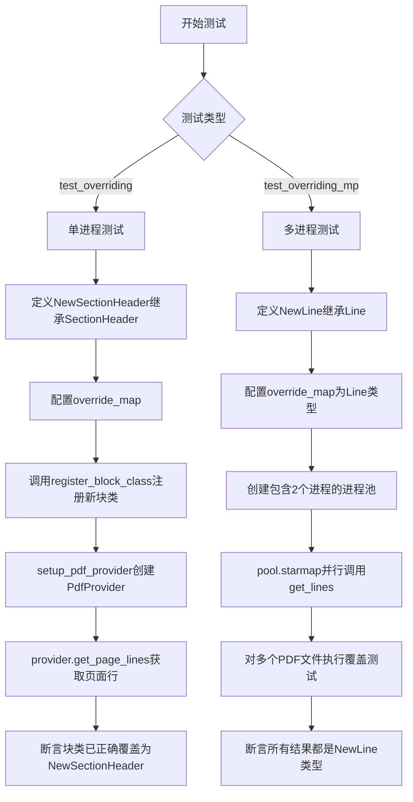
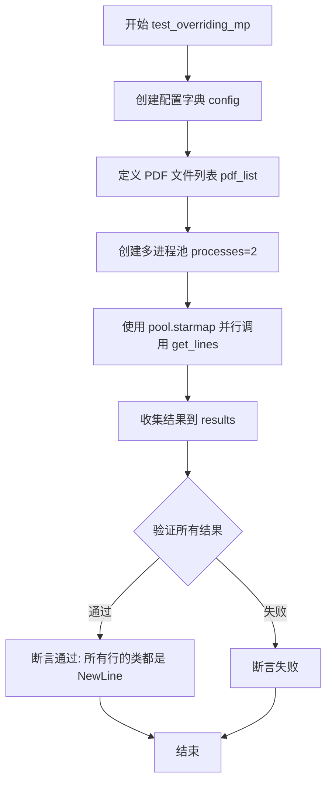
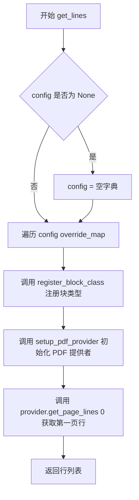

# `marker\tests\builders\test_overriding.py` 详细设计文档

该代码是一个pytest测试文件，用于验证marker库中PDF文档块类（Block Class）的覆盖机制。测试展示了如何在运行时动态替换默认的SectionHeader和Line块类为自定义实现，并确保在单进程和多进程（multiprocessing）环境下都能正常工作。

## 整体流程



## 类结构

```
测试模块 (test_block_override.py)
├── NewSectionHeader (继承自SectionHeader)
└── NewLine (继承自Line)
```

## 全局变量及字段


### `mp`
    
Python多进程模块，用于并行处理多个PDF文件

类型：`module`
    


### `pytest`
    
Python测试框架模块，用于编写和运行单元测试

类型：`module`
    


### `PdfProvider`
    
PDF文档提供者类，负责解析PDF并提取页面内容

类型：`class`
    


### `BlockTypes`
    
PDF块类型枚举，定义了文档中各种块类型的标识

类型：`enum`
    


### `SectionHeader`
    
节标题块类，表示PDF文档中的章节标题结构

类型：`class`
    


### `Document`
    
文档类，表示整个PDF文档的抽象数据结构

类型：`class`
    


### `register_block_class`
    
注册块类函数，用于将自定义块类型映射到对应的块处理类

类型：`function`
    


### `Line`
    
文本行类，表示PDF文档中的一行文本内容

类型：`class`
    


### `setup_pdf_provider`
    
测试工具函数，用于创建配置好的PDF提供者实例

类型：`function`
    


### `pdf_list`
    
待处理的PDF文件名列表，用于多进程测试

类型：`list[str]`
    


### `config`
    
配置字典，包含页面范围和块类型覆盖映射

类型：`dict`
    


### `results`
    
多进程处理结果列表，存储各进程返回的行数据

类型：`list`
    


    

## 全局函数及方法


### `test_overriding`

该测试函数用于验证PDF文档解析器的覆盖机制，通过pytest配置注入自定义的`NewSectionHeader`块类，断言文档第一页的第一个结构块是否成功被替换为自定义块类型。

参数：

- `pdf_document`：`Document`，pytest fixture提供的PDF文档对象，由`setup_pdf_provider` fixture根据配置生成

返回值：`None`，该函数为测试函数，通过assert语句进行断言验证，若失败则抛出`AssertionError`

#### 流程图

```mermaid
flowchart TD
    A[开始测试] --> B[获取pdf_document.pages[0]]
    B --> C[获取structure[0]即第一个块的结构ID]
    C --> D[调用get_block获取第一个块对象]
    D --> E{块对象类型是否为NewSectionHeader}
    E -->|是| F[测试通过]
    E -->|否| G[抛出AssertionError]
    F --> H[结束]
    G --> H
```

#### 带注释源码

```python
@pytest.mark.config({
    "page_range": [0],  # 只处理第0页（第一页）
    "override_map": {BlockTypes.SectionHeader: NewSectionHeader}  # 将SectionHeader块类型映射到自定义的NewSectionHeader类
})
def test_overriding(pdf_document: Document):
    """
    测试块类型覆盖机制是否正常工作
    
    该测试通过pytest.mark.config装饰器配置override_map，
    将BlockTypes.SectionHeader映射到自定义的NewSectionHeader类，
    然后验证文档中的块是否被正确替换
    """
    # 获取文档第一页的第一个块，并断言其类型为NewSectionHeader
    assert pdf_document.pages[0]\
        .get_block(pdf_document.pages[0].structure[0]).__class__ == NewSectionHeader
```


### `test_overriding_mp`

该函数是一个 pytest 测试函数，用于验证在多进程环境下对 PDF 解析器的块类（Block Class）进行覆盖（override）的功能是否正常工作。通过使用 multiprocessing.Pool 并行处理多个 PDF 文件，检查自定义的 NewLine 类是否能够正确替换默认的 Line 类。

参数： 无

返回值：`None`，该函数通过断言验证结果，不返回任何值

#### 流程图



#### 带注释源码

```python
def test_overriding_mp():
    # 定义配置字典，包含页面范围和块类覆盖映射
    config = {
        "page_range": [0],  # 只处理第0页
        "override_map": {BlockTypes.Line: NewLine}  # 用 NewLine 覆盖默认的 Line 类
    }

    # 定义待处理的 PDF 文件列表
    pdf_list = ["adversarial.pdf", "adversarial_rot.pdf"]

    # 使用多进程池并行处理 PDF 文件
    with mp.Pool(processes=2) as pool:
        # 使用 starmap 并行调用 get_lines 函数，传入 (pdf, config) 元组列表
        results = pool.starmap(get_lines, [(pdf, config) for pdf in pdf_list])
        
        # 断言：验证所有结果中的第一行的类都是 NewLine
        # r[0] 获取第一行的第一个结果
        # r[0].line 获取该行的 line 对象
        # r[0].line.__class__ 获取该对象的类
        assert all([r[0].line.__class__ == NewLine for r in results])
```


### `get_lines`

该函数用于从指定的PDF文件中提取第一页的文本行，并支持通过配置参数动态注册自定义的块类型（如自定义的Line或SectionHeader类）来覆盖默认的块解析逻辑。

参数：

- `pdf`：`str`，PDF文件的路径字符串，指定要处理的PDF文档位置
- `config`：`dict`，可选配置字典，用于指定页面范围（page_range）和块类型覆盖映射（override_map），默认为None

返回值：`list`，返回PDF第一页的所有行对象列表，每个行对象包含文本内容和关联的类信息

#### 流程图



#### 带注释源码

```python
def get_lines(pdf: str, config=None):
    """
    从PDF中获取第一页的行，支持动态注册自定义块类型
    
    Args:
        pdf: PDF文件路径
        config: 可选配置，包含override_map用于注册自定义块类
    
    Returns:
        PDF第一页的行对象列表
    """
    # 遍历配置中的override_map，将自定义块类注册到全局注册表中
    # 例如：{BlockTypes.Line: NewLine} 会用NewLine替换默认的Line类
    for block_type, block_cls in config["override_map"].items():
        register_block_class(block_type, block_cls)

    # 使用配置初始化PDF提供者，负责解析PDF文档
    provider: PdfProvider = setup_pdf_provider(pdf, config)
    
    # 获取第一页（索引为0）的所有行并返回
    return provider.get_page_lines(0)
```

## 关键组件


### NewSectionHeader
继承自 SectionHeader 的新类，用于在测试中覆盖默认的 SectionHeader 块类型，以验证块类型覆盖机制。

### NewLine
继承自 Line 的新类，用于在多进程测试中覆盖默认的 Line 块类型，以验证块类型在多进程环境下的覆盖功能。

### test_overriding
单进程测试函数，用于验证在单进程环境下通过配置 override_map 可以成功覆盖 PDF 文档中的 SectionHeader 块类型。

### get_lines
辅助函数，接受 PDF 文件路径和配置字典，配置字典中的 override_map 用于注册新的块类，然后返回指定页面的行数据，用于测试块类型覆盖功能。

### test_overriding_mp
多进程测试函数，使用 multiprocessing.Pool 在两个进程中并行处理不同的 PDF 文件，验证在多进程环境下块类型覆盖机制的正确性。

### config
配置字典，包含 page_range 指定处理的页面索引，以及 override_map 指定要覆盖的块类型及其新的块类，是实现块类型覆盖功能的核心配置。

### pdf_list
包含两个 PDF 文件名的列表，作为多进程测试的输入数据，用于验证覆盖机制在不同 PDF 文件上的适用性。

### register_block_class
来自 marker.schema.registry 的全局函数，用于将新的块类注册到系统中，以替代默认的块类，是实现块类型覆盖的关键步骤。

### setup_pdf_provider
来自 tests.utils 的全局函数，用于初始化 PdfProvider，是获取 PDF 文档内容的辅助函数。


## 问题及建议


### 已知问题

-   **全局注册表在多进程环境下的竞争条件**：`register_block_class` 修改全局注册表，在 `mp.Pool` 的子进程中调用时，每个进程都会独立修改全局状态，无法保证主进程注册的类在子进程中生效，可能导致测试结果不确定。
-   **配置硬编码**：PDF列表和配置在 `test_overriding_mp` 中硬编码，降低了代码复用性，扩展性差。
-   **缺少异常处理**：`setup_pdf_provider` 和 `provider.get_page_lines` 调用缺少异常捕获，若PDF文件不存在或损坏，测试会直接抛出未处理异常。
-   **测试覆盖不足**：仅验证了 `__class__ == NewLine`，未验证原始类型是否被正确替换、覆盖后的实例行为是否正确、以及覆盖失败时的降级逻辑。
-   **进程数硬编码**：`mp.Pool(processes=2)` 硬编码为2，在CPU核心数不足或不同的运行环境下可能产生问题。
-   **资源泄漏风险**：`PdfProvider` 实例未显式关闭，可能导致文件句柄或内存泄漏。

### 优化建议

-   **多进程支持改进**：将 `register_block_class` 的调用移至每个子进程初始化时（使用 `initializer` 参数），或在子进程启动前完成注册，确保全局状态在进程间正确同步。
-   **配置外部化**：将PDF列表和配置提取为测试参数或fixture，支持参数化测试，提高复用性。
-   **添加异常处理**：为文件读取和解析逻辑添加try-except块，捕获 `FileNotFoundError`、`RuntimeError` 等异常，并提供有意义的错误信息。
-   **增强测试断言**：添加对原始类型的检查、覆盖后对象行为的验证、以及边界情况（如无效的 `BlockTypes`）的测试。
-   **动态进程数**：使用 `mp.cpu_count()` 或从配置读取进程数，提高代码的可移植性。
-   **资源管理**：使用 context manager 或显式调用 `provider.close()` 确保资源释放。
-   **添加日志**：在关键步骤添加日志记录，便于调试多进程环境下的执行问题。

## 其它


### 设计目标与约束

本代码的主要设计目标是测试marker库中PDF块类型覆盖机制的功能正确性，包括单进程和多进程场景下的块类替换能力。约束条件包括：必须使用pytest框架，必须通过setup_pdf_provider初始化PdfProvider，必须使用multiprocessing.Pool进行并行测试。

### 错误处理与异常设计

代码中未显式实现错误处理机制，主要依赖pytest的断言进行验证。潜在的异常场景包括：PDF文件不存在或无法读取、配置参数错误、块类型覆盖冲突、多进程环境下的资源竞争等。当前通过pytest的失败来反馈这些错误。

### 数据流与状态机

数据流主要分为两条路径：单进程路径（test_overriding）中，配置加载后直接创建PdfProvider并获取文档块；多进程路径（test_overriding_mp）中，配置通过starmap传递给每个worker进程，每个进程独立执行get_lines函数进行块类注册和PDF处理。状态转换主要体现在：配置初始化 → 块类注册 → Provider创建 → 页面获取 → 块验证。

### 外部依赖与接口契约

主要外部依赖包括：marker.providers.pdf.PdfProvider（PDF提供器）、marker.schema.document.Document（文档对象）、marker.schema.registry.register_block_class（块类注册函数）、tests.utils.setup_pdf_provider（测试辅助函数）。接口契约方面：get_lines函数接收pdf路径字符串和config字典参数，返回页面行数据；register_block_class接收BlockTypes枚举和块类作为参数；setup_pdf_provider返回PdfProvider实例。

### 性能考虑

多进程测试使用固定2个进程处理2个PDF文件，未实现动态进程数调整。块类注册在每个worker进程中独立执行，存在重复注册开销。当前测试规模较小，性能问题不明显，但生产环境中应考虑：块类注册表的缓存机制、进程池的生命周期管理、大批量PDF处理时的资源限制。

### 并发模型

采用multiprocessing.Pool的starmap模式实现并行，每个worker进程独立运行get_lines函数。进程间无共享状态，块类注册通过函数调用完成，不涉及跨进程通信。进程池在with语句中管理，自动处理资源清理。

### 配置管理

配置通过pytest.mark.config装饰器或字典形式传递，包含page_range（页面范围）和override_map（块类型覆盖映射）两个关键配置项。override_map支持多个块类型的并行覆盖，但测试中仅展示了SectionHeader和Line两种类型的覆盖场景。

### 测试覆盖范围

当前测试覆盖了单进程块覆盖、多进程块覆盖两种场景。测试验证了覆盖后的块类类型是否与预期一致。测试覆盖存在盲点：未测试覆盖不存在的BlockType、未测试覆盖后的块功能是否正常、未测试并发场景下的覆盖冲突情况。

### 潜在改进建议

1. 添加错误场景测试：测试覆盖不存在的BlockType、测试无效的config参数
2. 增强多进程测试：验证不同进程间的覆盖互不影响，测试更多并发场景
3. 添加性能基准测试：测量块类注册开销、测量多进程vs单进程性能差异
4. 增加功能验证：不仅验证类类型，还应验证覆盖后的块功能是否正常工作
5. 添加资源清理测试：验证进程池正确释放、验证块类注册表的正确重置

    