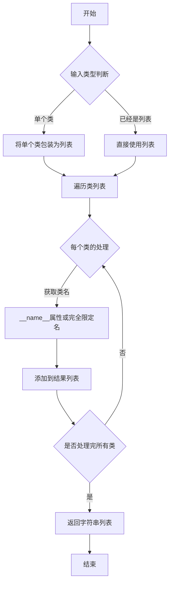
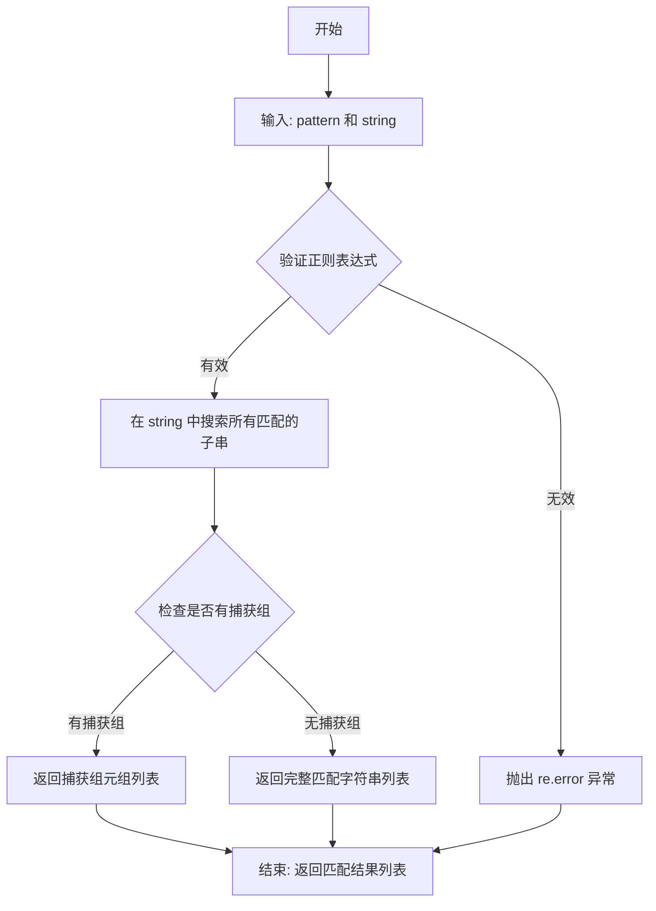
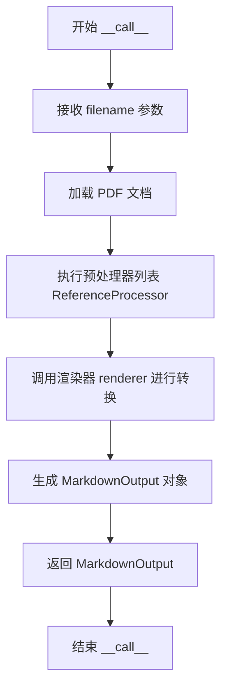

# `marker\tests\builders\test_pdf_links.py` 详细设计文档

这是一个pytest测试文件，用于测试marker库中PDF到Markdown转换器的链接处理功能，验证PDF中的章节引用和内部链接能否正确转换为Markdown格式的锚点链接。

## 整体流程

```mermaid
graph TD
    A[开始: 测试test_pdf_links] --> B[获取pdf_document的第一页]
B --> C[创建PdfConverter实例]
C --> D[遍历页面中的Span块]
D --> E{找到包含'II.'的span?}
E -- 否 --> F[抛出ValueError]
E -- 是 --> G[验证span的url为#page-1-0]
G --> H[获取SectionHeader块]
H --> I[验证raw_text为'II. THEORETICAL FRAMEWORK\n']
I --> J[验证refs[0].ref为'page-1-0']
J --> K[调用pdf_converter转换temp_doc]
K --> L[获取markdown输出]
L --> M[验证markdown包含链接格式]
M --> N[验证所有引用的span id都在markdown中]
N --> O[结束: 所有断言通过]
```

## 类结构

```
测试模块 (test_pdf_links.py)
└── test_pdf_links (测试函数)
    ├── 依赖: marker.converters.pdf.PdfConverter
    ├── 依赖: marker.renderers.markdown.MarkdownOutput
    ├── 依赖: marker.schema.BlockTypes
    ├── 依赖: marker.schema.document.Document
    └── 依赖: marker.util.classes_to_strings
```

## 全局变量及字段


### `first_page`
    
PDF文档第一页的对象，用于访问页面内容、块和引用

类型：`Page`
    


### `processors`
    
处理器列表，包含用于处理PDF引用关系的ReferenceProcessor

类型：`List[str]`
    


### `pdf_converter`
    
PDF转Markdown的转换器，配置了模型和渲染器

类型：`PdfConverter`
    


### `markdown_output`
    
转换后的Markdown输出对象，包含markdown属性

类型：`MarkdownOutput`
    


### `markdown`
    
转换后的Markdown文本内容

类型：`str`
    


### `ref`
    
用于验证的引用span标签字符串

类型：`str`
    


### `MarkdownOutput.markdown`
    
Markdown格式的输出文本内容

类型：`str`
    


### `Document.pages`
    
文档中所有页面的列表

类型：`List[Page]`
    


### `Document.refs`
    
文档中的引用列表，用于链接和交叉引用

类型：`List[Any]`
    
    

## 全局函数及方法


### `test_pdf_links`

这是一个pytest测试函数，用于验证PDF转换器能否正确识别和处理PDF文档中的内部链接（特别是针对章节标题如"II."的锚点链接），并确保转换后的Markdown输出包含正确的链接语法和锚点标签。

参数：

- `pdf_document`：`Document`，传入的PDF文档对象，用于获取页面和块信息
- `config`：配置对象，包含转换器的配置参数
- `renderer`：渲染器实例，用于渲染PDF内容
- `model_dict`：模型字典，包含OCR和文本识别模型
- `temp_doc`：临时文档对象，提供要转换的PDF文件路径

返回值：`None`，该函数为测试函数，无返回值（pytest测试）

#### 流程图

```mermaid
flowchart TD
    A[开始测试] --> B[获取pdf_document的第一页]
    B --> C[创建ReferenceProcessor处理器列表]
    C --> D[创建PdfConverter转换器实例]
    D --> E{查找包含'II.'的Span块}
    E -->|找到| F[验证section_header_span.url == '#page-1-0']
    E -->|未找到| G[抛出ValueError异常]
    F --> H[获取第一个SectionHeader块]
    H --> I[验证raw_text == 'II. THEORETICAL FRAMEWORK']
    I --> J[验证first_page.refs[0].ref == 'page-1-0']
    J --> K[调用pdf_converter转换temp_doc为Markdown]
    K --> L[验证'[II.](#page-1-0)'在markdown中]
    L --> M[验证span id='page-1-0'在markdown中]
    M --> N[提取所有页面引用并验证存在性]
    N --> O[测试通过]
```

#### 带注释源码

```python
import re
import pytest
from marker.converters.pdf import PdfConverter
from marker.renderers.markdown import MarkdownOutput
from marker.schema import BlockTypes
from marker.schema.document import Document
from marker.util import classes_to_strings

# 使用pytest标记指定测试文件和输出格式
@pytest.mark.filename("arxiv_test.pdf")
@pytest.mark.output_format("markdown")
@pytest.mark.config({"disable_ocr": True})
def test_pdf_links(pdf_document: Document, config, renderer, model_dict, temp_doc):
    """
    测试PDF链接转换功能
    验证PDF中的章节标题链接能正确转换为Markdown中的锚点链接
    """
    
    # 获取PDF文档的第二页（索引从1开始）
    first_page = pdf_document.pages[1]
    
    # 定义使用ReferenceProcessor来处理引用链接
    processors = ["marker.processors.reference.ReferenceProcessor"]
    
    # 创建PDF转换器，配置模型、处理器和渲染器
    pdf_converter = PdfConverter(
        artifact_dict=model_dict,           # 模型字典，包含各种识别模型
        processor_list=processors,           # 处理器列表，用于处理引用
        renderer=classes_to_strings([renderer])[0],  # 渲染器类名
        config=config,                       # 配置对象
    )
    
    # 遍历第一页中所有Span类型的块，查找包含'II.'的章节标题
    for section_header_span in first_page.contained_blocks(
        pdf_document, (BlockTypes.Span,)
    ):
        if "II." in section_header_span.text:
            # 验证该Span的URL锚点是否为#page-1-0
            assert section_header_span.url == "#page-1-0"
            break
    else:
        # 如果未找到则抛出异常
        raise ValueError("Could not find II. in the first page")
    
    # 获取第一页中第一个SectionHeader类型的块
    section_header_block = first_page.contained_blocks(
        pdf_document, (BlockTypes.SectionHeader,)
    )[0]
    
    # 验证SectionHeader的原始文本内容
    assert section_header_block.raw_text(pdf_document) == "II. THEORETICAL FRAMEWORK\n"
    
    # 验证第一页的第一个引用目标是否为'page-1-0'
    assert first_page.refs[0].ref == "page-1-0"
    
    # 使用转换器将临时PDF文档转换为Markdown输出
    markdown_output: MarkdownOutput = pdf_converter(temp_doc.name)
    markdown = markdown_output.markdown
    
    # 验证Markdown中包含正确的链接语法
    assert "[II.](#page-1-0)" in markdown
    
    # 验证Markdown中包含正确的锚点标签
    assert '<span id="page-1-0"></span>II. THEORETICAL FRAMEWORK' in markdown
    
    # 提取并验证所有页面的引用span标签都存在于markdown中
    for ref in set(
        [
            f'<span id="page-{m[0]}-{m[1]}">'
            for m in re.findall(r"\]\(#page-(\d+)-(\d+)\)", markdown)
        ]
    ):
        # 确保每个引用的锚点标签都存在于输出中
        assert ref in markdown, f"Reference {ref} not found in markdown"
```


### `classes_to_strings`

该函数是一个工具函数，用于将类（class）对象转换为其字符串表示形式（通常是类的完全限定名或简单名称），方便在需要字符串标识符的场景（如配置、序列化、日志记录）中使用。

参数：

-  `classes`：`List[Type]` 或 `Type`，需要转换的类对象列表或单个类对象

返回值：`List[str]`，返回转换后的字符串列表

#### 流程图



#### 带注释源码

```python
# 该函数位于 marker/util.py 模块中
# 由于源代码未直接提供，以下为基于使用方式的推断实现

from typing import List, Type, Union, get_type_hints
import logging

logger = logging.getLogger(__name__)

def classes_to_strings(classes: Union[Type, List[Type]]) -> List[str]:
    """
    将类对象转换为其字符串表示形式
    
    参数:
        classes: 单个类或类列表
        
    返回:
        类的字符串名称列表
    """
    result = []
    
    # 确保输入是列表格式
    if not isinstance(classes, list):
        classes = [classes]
    
    for cls in classes:
        if isinstance(cls, type):
            # 获取类的完全限定名
            # 例如: marker.renderers.markdown.MarkdownOutput
            full_name = f"{cls.__module__}.{cls.__name__}"
            result.append(full_name)
            logger.debug(f"Converted class {cls.__name__} to string: {full_name}")
        elif isinstance(cls, str):
            # 如果已经是字符串，直接添加
            result.append(cls)
        else:
            # 处理其他情况
            logger.warning(f"Unexpected type {type(cls)} in classes_to_strings")
            result.append(str(cls))
    
    return result


# 使用示例
# renderer = classes_to_strings([renderer])[0]
# 输入: [<class 'marker.renderers.markdown.MarkdownRenderer'>]
# 输出: ['marker.renderers.markdown.MarkdownRenderer']
```

#### 补充说明

- **设计目标**：提供一种标准化的方式将类对象序列化为字符串，用于配置传递、日志记录、动态类加载等场景
- **输入约束**：接受单个类对象或类对象列表
- **输出格式**：返回完全限定类名字符串列表（模块名.类名）
- **错误处理**：对非类类型对象进行警告并尝试转换为字符串
- **调用场景**：在测试代码中用于将渲染器类转换为字符串后传递给 `PdfConverter` 的 `renderer` 参数


### `re.findall`

该函数是 Python 标准库 `re` 模块中的正则表达式匹配函数，在此代码中用于从 Markdown 文本中提取所有符合 `#page-数字-数字` 格式的页面引用链接，并将匹配到的数字组合格成 HTML span 标签的 ID 属性，用于验证转换后的 Markdown 中是否包含所有预期的页面锚点。

参数：

- `pattern`：`str`，正则表达式模式，用于匹配目标字符串，此处为 `r"\]\(#page-(\d+)-(\d+)\)"`，匹配形如 `](#page-数字-数字)` 的 Markdown 链接格式
- `string`：`str`，待匹配的输入字符串，此处为 `markdown`，即 PDF 转换生成的 Markdown 内容

返回值：`list[tuple[str, ...]]`，返回所有匹配的子串列表，每个匹配是一个元组，包含正则表达式中捕获组对应的字符串，此处每项为 `("数字1", "数字2")` 形式的元组

#### 流程图



#### 带注释源码

```python
# 使用 re.findall 从 markdown 中提取所有符合特定格式的页面引用
# pattern: r"\]\(#page-(\d+)-(\d+)\)" 
#   - \) 转义右括号
#   - #page- 字面匹配
#   - (\d+) 捕获组1: 匹配一个或多个数字（页码）
#   - - 字面匹配连字符
#   - (\d+) 捕获组2: 匹配一个或多个数字（块编号）
#   - \) 转义右括号
for ref in set(  # set() 去重，获取唯一的引用ID
    [
        f'<span id="page-{m[0]}-{m[1]}">'  # m[0]为页码, m[1]为块编号
        for m in re.findall(r"\]\(#page-(\d+)-(\d+)\)", markdown)  # 遍历每个匹配
    ]
):
    # 验证每个生成的引用ID是否存在于markdown中
    assert ref in markdown, f"Reference {ref} not found in markdown"
```


### `PdfConverter.__call__`

该方法是 `PdfConverter` 类的可调用接口，接收一个 PDF 文件路径作为输入，通过内部模型和处理器链将 PDF 文档转换为 Markdown 格式的输出，并返回包含转换结果的 `MarkdownOutput` 对象。

**注意**：提供的代码是一个测试文件，仅展示了 `PdfConverter` 类的使用方式，未包含该类的实际实现代码。以下信息基于测试代码中的使用模式推断得出。

参数：

-  `filename`：`str`，要转换的 PDF 文件的路径或文件名

返回值：`MarkdownOutput`，包含转换后的 Markdown 内容及相关元数据的输出对象

#### 流程图



#### 带注释源码

```python
# 以下为测试代码中 PdfConverter 的使用方式，非实际 __call__ 方法实现

# 1. PdfConverter 构造函数调用
pdf_converter = PdfConverter(
    artifact_dict=model_dict,        # 模型工件字典，包含预训练模型数据
    processor_list=processors,       # 处理器列表，如 ReferenceProcessor
    renderer=classes_to_strings([renderer])[0],  # 渲染器类名字符串
    config=config                     # 配置对象，包含 disable_ocr 等选项
)

# 2. __call__ 方法的调用方式
# 根据 python 语言特性，当调用一个类实例时，会自动触发 __call__ 方法
markdown_output: MarkdownOutput = pdf_converter(temp_doc.name)

# 3. 返回值的使用
markdown = markdown_output.markdown  # 获取转换后的 markdown 字符串
```

#### 补充说明

由于提供的代码是测试文件，未包含 `PdfConverter` 类的完整定义，因此无法提供该类的字段和方法详细信息。基于测试代码的上下文，可以推断以下设计信息：

1. **设计目标**：将 PDF 文档转换为 Markdown 格式，支持链接保留和引用处理
2. **外部依赖**：
   - `marker.converters.pdf.PdfConverter`：PDF 转换器主类
   - `marker.renderers.markdown.MarkdownOutput`：Markdown 输出数据类
   - `marker.schema.document.Document`：文档模式类
3. **接口契约**：输入 PDF 文件路径，返回包含 Markdown 内容的 `MarkdownOutput` 对象
4. **潜在优化空间**：由于代码片段不完整，无法进行完整的技术债务分析

如需获取 `PdfConverter` 类的完整实现源码以进行详细分析，请提供该类的定义文件。


## 关键组件


### PdfConverter

PDF转Markdown的核心转换器，负责将PDF文档转换为Markdown格式，支持自定义处理器列表和渲染器。

### MarkdownOutput

转换后的Markdown输出对象，包含生成的markdown文本内容。

### BlockTypes

文档块类型枚举，定义了Span、SectionHeader等块类型，用于识别PDF中的不同内容区域。

### ReferenceProcessor

引用处理器，负责处理文档中的交叉引用和链接关系，生成正确的锚点ID。

### pdf_document fixture

测试fixture，提供PDF文档的解析对象，包含页面结构和内容块信息。

### temp_doc fixture

测试fixture，提供临时的PDF文档文件路径用于测试。

### config

测试配置对象，包含转换器的配置参数，如disable_ocr等设置。

### model_dict

模型字典，包含OCR和布局识别等所需的模型工件。

### renderer

渲染器实例，负责将PDF内容渲染为指定格式的输出。


## 问题及建议


### 已知问题

- **硬编码的测试值**：测试中硬编码了 "II."、"II. THEORETICAL FRAMEWORK"、"#page-1-0" 等特定值，使得测试对文档结构变化极其敏感，文档内容或章节编号变化会导致测试失败
- **魔法索引访问**：`pdf_document.pages[1]` 和 `[0]` 索引访问没有任何边界检查或保护，如果页面或区块不存在会导致 IndexError 而非有意义的测试失败
- **正则表达式重复使用**：在两个地方使用相同的正则表达式 `r"\]\(#page-(\d+)-(\d+)\)"`，违反 DRY 原则
- **缺少错误处理**：使用 `contained_blocks` 方法时未检查返回列表是否为空，直接使用 `[0]` 访问可能导致测试崩溃
- **过度依赖 fixture 状态**：测试依赖多个外部 fixture（pdf_document, config, renderer, model_dict, temp_doc）且未验证其状态正确性，fixture 配置错误时难以定位问题
- **断言粒度过粗**：使用多个独立 assert 语句而非更有意义的分组验证，某个断言失败后无法继续验证其他相关功能
- **注释缺失**：测试函数没有任何文档字符串说明其测试目的和预期行为
- **变量名误导**：`markdown_output` 实际是 MarkdownOutput 类型的实例而非字符串，但变量名暗示它是最终输出的 markdown 内容

### 优化建议

- 使用 fixture 或配置文件中定义测试常量，将硬编码值提取为模块级常量
- 在访问索引前添加存在性检查，使用 `if len(list) > 0:` 保护或使用 `next(iter(...), None)` 安全获取
- 将正则表达式提取为模块级常量或工具函数以复用
- 为测试函数添加文档字符串，说明测试的 PDF 转换功能和预期行为
- 使用 pytest 的 parametrize 或 fixture 共享测试数据，提高测试可维护性
- 考虑使用 pytest 插件如 pytest-assume 允许多个断言连续执行
- 将 `markdown_output` 重命名为 `markdown_output_obj` 或 `markdown_result` 以更清晰表达其类型

## 其它


### 设计目标与约束

本测试文件的设计目标为验证PDF文档中链接引用功能的正确性，确保从PDF转换到Markdown格式时，内部链接和锚点能够正确生成和保留。具体约束包括：1) 测试仅针对特定格式的PDF文件（arxiv_test.pdf）；2) 测试过程中禁用了OCR功能以确保测试稳定性；3) 测试依赖于特定的PDF结构（包含"II. THEORETICAL FRAMEWORK"章节）。

### 错误处理与异常设计

测试中包含两个主要的错误处理场景：1) 当无法在第一页找到"II."标记的SectionHeaderSpan时，抛出ValueError异常，错误信息为"Could not find II. in the first page"；2) 使用pytest的assert语句进行断言验证，任何不满足的条件都会导致测试失败。在实际运行中，如果PDF文档结构不符合预期或链接生成逻辑存在问题，测试将失败并提供具体的断言错误信息。

### 数据流与状态机

测试的数据流主要分为以下几个阶段：初始化阶段创建PdfConverter实例并配置ReferenceProcessor；查询阶段遍历第一页的Span和SectionHeaderBlock来验证链接数据结构；转换阶段调用pdf_converter将PDF转换为MarkdownOutput对象；验证阶段检查生成的markdown字符串中是否包含正确的链接格式和锚点标签。整个过程是单向流动的，不涉及复杂的状态机设计。

### 外部依赖与接口契约

本测试文件依赖于以下外部组件和接口：1) marker.converters.pdf.PdfConverter类，负责PDF到Markdown的转换，需接受artifact_dict、processor_list、renderer和config参数；2) marker.renderers.markdown.MarkdownOutput类，提供markdown属性返回转换后的文本；3) marker.schema.document.Document类，代表解析后的PDF文档对象，包含pages集合和refs引用列表；4) marker.schema.BlockTypes枚举，定义文档中的块类型（如Span、SectionHeader）；5) marker.processors.reference.ReferenceProcessor处理器，负责生成文档内的链接引用。

### 测试环境配置

测试使用pytest框架进行驱动，通过pytest.mark装饰器配置测试参数：filename标记指定测试使用的PDF文件名（arxiv_test.pdf）；output_format标记指定输出格式为markdown；config标记设置配置字典，其中disable_ocr设为True以禁用OCR功能。测试函数接受四个fixture参数：pdf_document提供解析后的Document对象，config提供配置信息，renderer提供渲染器实例，model_dict提供模型字典，temp_doc提供临时文档路径。

### 断言覆盖范围

测试包含以下断言验证点：1) 验证SectionHeaderSpan的url属性等于"#page-1-0"；2) 验证SectionHeaderBlock的raw_text方法返回"II. THEORETICAL FRAMEWORK\n"；3) 验证第一页第一个引用（refs[0]）的ref属性等于"page-1-0"；4) 验证生成的markdown包含链接语法"[II.](#page-1-0)"；5) 验证生成的markdown包含完整的锚点标签和标题文本'<span id="page-1-0"></span>II. THEORETICAL FRAMEWORK'；6) 验证所有通过正则表达式提取的锚点引用都存在于markdown中。

### 关键算法与模式

测试中使用了两个关键的算法模式：1) 正则表达式匹配模式，使用re.findall(r"\]\(#page-(\d+)-(\d+)\)", markdown)从生成的markdown中提取所有页面引用，然后动态生成对应的span id进行验证；2) 遍历搜索模式，使用contained_blocks方法配合循环遍历来定位特定的SectionHeaderSpan。这些模式确保了测试能够全面验证链接生成逻辑的正确性。

### 性能考量与优化建议

当前测试每次运行时都需要完整解析PDF文档并执行转换过程，可能导致测试执行时间较长。优化建议：1) 可以考虑使用pytest的fixture缓存机制来复用Document对象，减少重复解析开销；2) 对于链接验证部分，可以提取为独立的辅助函数以提高代码复用性；3) 可以添加超时控制来防止PDF转换过程无限挂起。

### 安全性与边界条件

测试需要处理以下边界情况：1) PDF文件不存在或格式损坏时的错误处理；2) PDF中不存在目标章节标题时的异常抛出；3) 链接引用数组为空时的索引访问保护；4) 生成的markdown格式异常时的容错处理。当前测试对这些边界条件的处理相对有限，建议增加更完善的异常捕获和更有意义的错误提示信息。

### 版本兼容性说明

测试代码依赖于marker库的几个关键组件：PdfConverter类、MarkdownOutput类、Document类、BlockTypes枚举以及classes_to_strings工具函数。这些组件的接口在不同版本间可能存在变化，特别是artifact_dict和model_dict的参数结构、Document对象的内部组织方式以及BlockTypes枚举的成员。建议在项目依赖管理中明确marker库的版本约束，并建立版本兼容性测试套件。


    