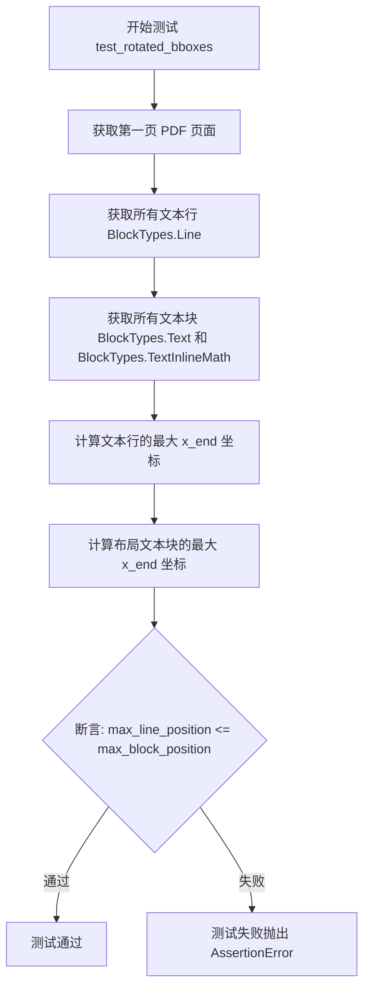
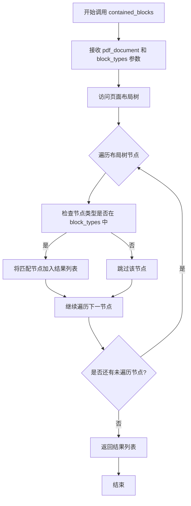
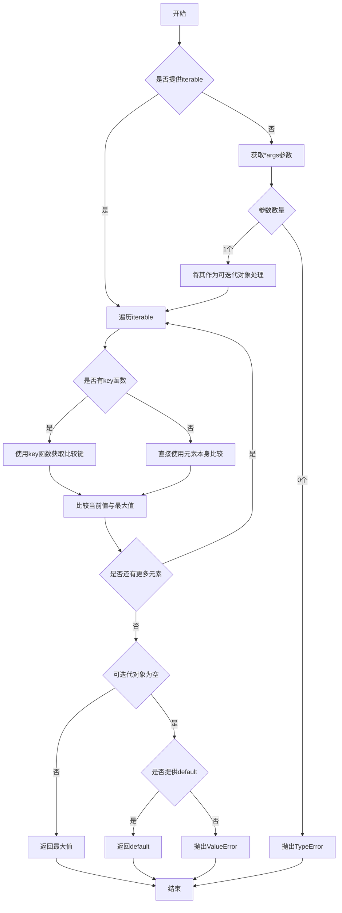

# `marker\tests\builders\test_rotated_bboxes.py` 详细设计文档

这是一个pytest测试用例，用于验证旋转PDF文档中文本行的边界框(bbox)与文本块的边界框是否正确对齐，确保文本行不会超出文本块的边界范围。

## 整体流程

```mermaid
graph TD
    A[开始] --> B[导入依赖模块]
B --> C[配置pytest标记: page_range=[0], filename='adversarial_rot.pdf']
C --> D[调用test_rotated_bboxes函数]
D --> E[获取PDF文档第一页]
E --> F[获取所有文本行BlockTypes.Line]
F --> G[获取所有文本块BlockTypes.Text和BlockTypes.TextInlineMath]
G --> H[计算文本行的最大x_end位置]
H --> I[计算文本块的最大x_end位置]
I --> J{文本行最大位置 <= 文本块最大位置?}
J -- 是 --> K[测试通过]
J -- 否 --> L[测试失败]
```

## 类结构

```
测试模块 (test_rotated_bboxes.py)
└── test_rotated_bboxes 函数
    ├── pdf_document fixture
    └── 验证逻辑
```

## 全局变量及字段


### `first_page`
    
PDF文档第一页对象

类型：`Page object`
    


### `text_lines`
    
PDF页面中所有文本行(Line类型块)的列表

类型：`List[Block]`
    


### `text_blocks`
    
PDF页面中所有文本块(Text和TextInlineMath类型块)的列表

类型：`List[Block]`
    


### `max_line_position`
    
文本行的最大x坐标结束位置

类型：`float`
    


### `max_block_position`
    
文本块(来源为layout)的最大x坐标结束位置

类型：`float`
    


    

## 全局函数及方法


### `test_rotated_bboxes`

这是一个 pytest 测试函数，用于验证旋转后的 PDF 页面中，文本行（Line 类型）的边界框与文本块（Text/TextInlineMath 类型）的边界框是否正确对齐，确保文本行的右边界不超过对应文本块的右边界。

参数：

- `pdf_document`：`PdfDocument`，pytest fixture，提供对 PDF 文档的访问，包含页面和块信息

返回值：`None`，测试函数无返回值，通过 assert 语句进行断言验证

#### 流程图



#### 带注释源码

```python
import pytest

# 从 marker.schema 导入块类型枚举
from marker.schema import BlockTypes


# 使用 pytest 标记配置测试：只处理第 0 页，使用特定文件名
@pytest.mark.config({"page_range": [0]})
@pytest.mark.filename("adversarial_rot.pdf")
def test_rotated_bboxes(pdf_document):
    """
    测试旋转后的 PDF 边界框对齐情况
    
    验证文本行的右边界不超过对应文本块的右边界，
    确保布局解析正确处理了旋转的文本。
    """
    # 获取 PDF 的第一页
    first_page = pdf_document.pages[0]

    # 获取页面上所有的文本行（Line 类型的块）
    text_lines = first_page.contained_blocks(pdf_document, (BlockTypes.Line,))
    
    # 获取页面上所有的文本块（Text 和 TextInlineMath 类型的块）
    text_blocks = first_page.contained_blocks(
        pdf_document, (BlockTypes.Text, BlockTypes.TextInlineMath)
    )
    
    # 注意：已注释的断言，用于验证文本行数量（可选）
    # assert len(text_lines) == 84

    # 计算所有文本行中最大的 x_end 坐标（行的右边界）
    max_line_position = max([line.polygon.x_end for line in text_lines])
    
    # 计算所有布局文本块中最大的 x_end 坐标（块右边界）
    # 只考虑 source='layout' 的文本块，过滤其他来源
    max_block_position = max(
        [block.polygon.x_end for block in text_blocks if block.source == "layout"]
    )
    
    # 核心断言：确保文本行的右边界不超过文本块的右边界
    # 这验证了旋转后的文本框位置解析的正确性
    assert max_line_position <= max_block_position
```


### `Page.contained_blocks`

该方法用于从 PDF 页面的布局树中检索指定类型的块元素，通过传入文档对象和 BlockTypes 元组来过滤并返回匹配的块列表，常用于获取页面中的文本行、文本块或内联数学公式等元素。

参数：

- `pdf_document`：`Document`，PDF 文档对象，用于访问文档的布局树和数据
- `block_types`：元组（Tuple[BlockTypes, ...]），要匹配的块类型集合，如 `(BlockTypes.Line,)` 或 `(BlockTypes.Text, BlockTypes.TextInlineMath)`

返回值：`List[Block]`，返回匹配指定类型的块元素列表，每个元素包含多边形位置和源信息等属性

#### 流程图



#### 带注释源码

```python
# 从 first_page (Page对象) 调用 contained_blocks 方法
# 参数1: pdf_document - 整个PDF文档对象，包含布局树信息
# 参数2: block_types 元组 - 指定要获取的块类型
# 示例1: 获取所有文本行 (Line 类型)
text_lines = first_page.contained_blocks(pdf_document, (BlockTypes.Line,))

# 示例2: 获取文本块和内联数学公式 (Text 和 TextInlineMath 类型)
text_blocks = first_page.contained_blocks(
    pdf_document, (BlockTypes.Text, BlockTypes.TextInlineMath)
)

# 返回结果是 Block 对象列表，每个 Block 包含:
# - polygon: 多边形区域，描述块在页面上的位置
#   - polygon.x_end: 块的右边界 x 坐标
# - source: 块的来源，如 "layout"
# 
# 代码中用于验证:
# 1. 获取所有文本行的右边界最大值
max_line_position = max([line.polygon.x_end for line in text_lines])
# 2. 获取所有布局源文本块的右边界最大值
max_block_position = max(
    [block.polygon.x_end for block in text_blocks if block.source == "layout"]
)
# 3. 断言行的右边界不超过块的右边界（布局正确性验证）
assert max_line_position <= max_block_position
```


### `max`

Python内置函数，用于从可迭代对象中返回最大值，或者比较多个参数后返回最大值。

参数：

- `iterable`：`Iterable`，要比较的可迭代对象（如列表、元组等）
- `*iterables`：`Iterable`，可选，要比较的多个可迭代对象（当使用多个参数时）
- `key`：`Callable`，可选，用于从每个元素中提取比较键的函数，默认为`None`
- `default`：`Any`，可选，当可迭代对象为空时返回的默认值

返回值：`Any`，返回可迭代对象中的最大值，如果没有提供`default`且可迭代对象为空，则抛出`ValueError`异常

#### 流程图



#### 带注释源码

```python
# 示例1：从列表中获取最大值
text_lines = [line1, line2, line3, ...]  # 假设为文本行对象列表
max_line_position = max([line.polygon.x_end for line in text_lines])
# 解释：遍历text_lines中的每个line对象，提取其polygon.x_end属性，
# 找出这些x_end值中的最大值，赋值给max_line_position

# 示例2：带条件过滤的最大值计算
text_blocks = [block1, block2, block3, ...]  # 假设为文本块对象列表
max_block_position = max(
    [block.polygon.x_end for block in text_blocks if block.source == "layout"]
)
# 解释：遍历text_blocks，过滤出source属性为"layout"的块，
# 提取这些块的polygon.x_end属性，找出最大值

# max函数内部逻辑简化：
def max(iterable, *, key=None, default=None):
    """
    返回可迭代对象中的最大值
    
    参数:
        iterable: 可迭代对象
        key: 可选的比较键函数
        default: 可选的默认值（当iterable为空时返回）
    """
    iterator = iter(iterable)
    
    try:
        # 获取第一个元素作为初始最大值
        max_value = next(iterator)
    except StopIteration:
        # 迭代器为空
        if default is not None:
            return default
        raise ValueError("max() arg is an empty sequence")
    
    # 遍历剩余元素
    for value in iterator:
        # 如果提供了key函数，使用key函数进行比较
        if key is None:
            # 直接比较值
            if value > max_value:
                max_value = value
        else:
            # 使用key函数转换后比较
            if key(value) > key(max_value):
                max_value = value
    
    return max_value
```


## 关键组件


### pytest测试框架

这是一个使用pytest框架编写的单元测试，用于验证旋转PDF文档中文本行和文本块的边界框对齐情况。

### pdf_document fixture

pytest测试 fixture，提供PDF文档对象用于测试，通过装饰器配置页面范围为第0页和文件名。

### BlockTypes枚举

定义文档中不同类型的块，包括Line（文本行）、Text（文本块）和TextInlineMath（行内数学公式）。

### Page对象（first_page）

代表PDF文档的第0页，包含contained_blocks方法用于获取指定类型的块集合。

### contained_blocks方法

接收pdf_document参数和块类型元组，返回指定类型的块列表，用于获取文本行或文本块。

### Polygon对象

代表块的边界多边形，包含x_end属性表示x轴终点坐标，用于边界框的宽度计算。

### 断言验证逻辑

验证文本行的最大x_end位置不超过布局文本块的最大x_end位置，确保边界框对齐正确。

### 测试配置装饰器

使用pytest.mark.config和pytest.mark.filename装饰器配置测试参数，指定页面范围和测试用PDF文件名。


## 问题及建议


### 已知问题

- 存在被注释掉的断言 `assert len(text_lines) == 84`，测试逻辑不完整，属于遗留的技术债务
- 使用 `max()` 函数直接处理列表，未考虑空列表情况，可能导致 `ValueError` 运行时异常
- 变量命名 `max_line_position` 和 `max_block_position` 语义不准确，实际存储的是 `x_end` 坐标值，而非位置信息
- 未对 `text_lines` 或 `text_blocks` 为空的情况进行边界检查和异常处理
- 测试配置（`page_range` 和 `filename`）硬编码在装饰器中，缺乏灵活性和可配置性

### 优化建议

- 移除注释掉的断言代码，或明确注释说明为何需要注释，以便后续维护
- 使用 `max(..., default=0)` 语法处理空列表情况，提升代码健壮性
- 重命名变量为 `max_line_x_end` 和 `max_block_x_end`，使语义更清晰
- 在调用 `max()` 前添加空列表检查，或使用 `default` 参数防止异常
- 考虑将测试参数（文件名、页码范围）提取为测试 fixtures 或参数化配置，提高测试可复用性


## 其它


### 设计目标与约束

该测试旨在验证旋转PDF文档中文本行和文本块的边界框（bbox）是否正确对齐。核心约束包括：仅测试第一页（page_range[0]），针对特定文件"adversarial_rot.pdf"，验证x轴方向的边界框位置关系，确保布局分析结果的一致性。

### 错误处理与异常设计

测试使用pytest框架的标准断言机制。max()函数在空列表时会抛出ValueError，但此处text_lines和text_blocks来自contained_blocks方法返回的列表，通常不为空。若断言失败，pytest会显示具体的数值差异，便于调试边界框计算问题。

### 数据流与状态机

测试数据流：pdf_document加载PDF文件 → first_page获取首页 → contained_blocks提取指定类型的块（Line、Text、TextInlineMath） → max()计算最大x_end坐标 → 断言比较两个最大值的大小关系。状态转换：PDF加载状态 → 页面解析状态 → 块提取状态 → 验证完成状态。

### 外部依赖与接口契约

依赖包括：pytest测试框架、marker.schema模块（BlockTypes枚举）、pdf_document fixture（提供PDF文档对象）。接口契约：pdf_document需支持pages属性访问，页面对象需支持contained_blocks方法并返回包含polygon.x_end属性的块对象，BlockTypes需包含Line、Text、TextInlineMath枚举值。

### 性能考量

测试仅处理单页PDF，文件为特定样本，性能开销较小。contained_blocks方法可能涉及布局解析，在大型PDF场景下需考虑缓存和懒加载策略。当前测试注释掉了行数断言（len(text_lines) == 84），表明可能存在性能或稳定性考虑。

### 安全性考虑

测试直接读取指定PDF文件，需确保文件路径安全（通过pytest标记控制）。无用户输入处理，无敏感数据操作，安全性风险较低。

### 测试覆盖率

当前测试聚焦于边界框位置的验证，覆盖场景有限。建议扩展测试覆盖：多页PDF测试、不同旋转角度测试、多种文档布局测试、边界条件测试（空文档、特殊字符文档等）。

### 配置管理

使用pytest.mark.config和pytest.mark.filename进行测试配置。page_range和filename参数化支持不同测试场景。当前硬编码配置值，可考虑外部化配置文件或环境变量以提高测试灵活性。

### 关键假设与前置条件

测试假设pdf_document fixture已正确初始化并加载PDF文件，contained_blocks方法返回的块对象包含有效的polygon属性，且x_end坐标计算基于统一的坐标系统。测试假设PDF文件"adversarial_rot.pdf"存在于测试资源目录中。

### 后续改进建议

1. 解除注释的行数断言并优化以适应不同PDF变体
2. 添加参数化测试支持多种PDF文件
3. 增加更详细的断言消息，包含实际值和期望值
4. 考虑添加边界情况测试（如空页面、纯图像页面）
5. 将测试配置抽象为独立的测试数据类


    