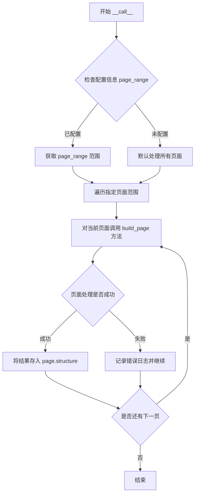

# `marker\tests\builders\test_structure.py` 详细设计文档

这是一个pytest测试文件，用于测试StructureBuilder类从PDF文档中提取和构建页面结构的功能，验证结构数据的有效性。

## 整体流程

```mermaid
graph TD
    A[开始测试] --> B[配置测试环境]
B --> C[创建StructureBuilder实例]
C --> D[调用structure(pdf_document)]
D --> E{执行构建逻辑}
E --> F[获取pages[0].structure]
F --> G{structure长度 > 0?}
G -- 是 --> H[测试通过]
G -- 否 --> I[测试失败]
```

## 类结构

```
测试模块
└── test_structure_builder (测试函数)

待分析模块 (推断)
└── StructureBuilder (来自marker.builders.structure)
```

## 全局变量及字段


### `structure`
    
结构构建器实例，用于为PDF文档构建结构信息

类型：`StructureBuilder`
    


### `pdf_document`
    
PDF文档对象，包含页面和结构数据

类型：`PDFDocument`
    


### `page_range`
    
要处理的页面范围配置，这里指定第0页

类型：`List[int]`
    


### `StructureBuilder.pdf_document`
    
PDF文档对象引用，用于访问和修改文档结构

类型：`PDFDocument`
    


### `StructureBuilder.page_range`
    
指定要处理的页面范围

类型：`List[int]`
    


### `pdf_document.pages`
    
PDF文档的页面列表

类型：`List[Page]`
    


### `pdf_document.pages[0].structure`
    
页面0的结构信息对象

类型：`Structure`
    
    

## 全局函数及方法


### `test_structure_builder`

这是一个pytest测试函数，用于验证`StructureBuilder`类能够正确构建PDF文档的结构信息。该测试通过创建`StructureBuilder`实例并对PDF文档进行处理，然后断言文档第一页的结构数据已被正确生成。

参数：

- `pdf_document`：`pdf_document`（pytest fixture），表示待处理的PDF文档对象，包含pages属性，每个page包含structure属性

返回值：`None`，测试函数通过assert语句进行验证，不返回具体值

#### 流程图

```mermaid
flowchart TD
    A[开始测试] --> B[应用装饰器 @pytest.mark.config page_range: 0]
    B --> C[获取 pdf_document fixture]
    C --> D[创建 StructureBuilder 实例]
    D --> E[调用 structure(pdf_document)]
    E --> F{执行构建逻辑}
    F --> G[断言 len(pdf_document.pages[0].structure > 0]
    G --> H{断言是否通过}
    H -->|通过| I[测试通过]
    H -->|失败| J[测试失败抛出异常]
```

#### 带注释源码

```python
import pytest
# 导入pytest框架，用于编写和运行测试

from marker.builders.structure import StructureBuilder
# 从marker.builders.structure模块导入StructureBuilder类
# 该类负责构建PDF文档的结构信息

@pytest.mark.config({"page_range": [0]})
# pytest标记装饰器，配置测试参数
# page_range: [0] 表示仅处理第0页（第一页）
def test_structure_builder(pdf_document):
    """
    测试StructureBuilder类的功能
    
    测试目标：
    1. 验证StructureBuilder能够正确实例化
    2. 验证StructureBuilder能够处理PDF文档对象
    3. 验证处理后文档页面包含结构数据
    """
    
    # 创建StructureBuilder实例
    # StructureBuilder是用于解析和构建PDF文档结构的类
    structure = StructureBuilder()
    
    # 调用structure对象（实际调用__call__方法）
    # 传入pdf_document进行处理
    # 处理过程会解析PDF内容并填充structure属性
    structure(pdf_document)
    
    # 断言验证：检查第一页的结构数据是否存在且不为空
    # 如果structure列表长度为0，说明结构构建失败
    assert len(pdf_document.pages[0].structure) > 0
```


### `StructureBuilder.__call__`

该方法是 `StructureBuilder` 类的可调用接口（`__call__` 方法），允许将构建器实例作为函数调用。它接收一个 PDF 文档对象作为输入，遍历文档中指定范围的页面，为每个页面提取并构建结构信息（如标题、段落、列表等），最终将结构化数据存储在对应页面的 `structure` 属性中，以供后续渲染或分析使用。

参数：

- `pdf_document`：`object`，PDF 文档对象，包含页面集合（`pages` 属性），每个页面具有 `structure` 属性用于存储提取的结构信息

返回值：`None`，该方法通过直接修改 `pdf_document` 对象的内部状态（填充页面结构）来实现功能，无返回值

#### 流程图



#### 带注释源码

```python
def __call__(self, pdf_document):
    """
    处理 PDF 文档并为每个页面构建结构信息。
    
    参数:
        pdf_document: PDF 文档对象，应包含 pages 属性，
                      其中每个页面具有 structure 属性用于存储结果。
    
    返回值:
        无返回值。结构信息直接写入 pdf_document.pages[i].structure。
    """
    # 获取配置中的页面范围，默认为 [0]
    page_range = self.config.get("page_range", [0])
    
    # 遍历指定页面范围
    for page_index in page_range:
        # 确保页面索引在有效范围内
        if page_index >= len(pdf_document.pages):
            continue
            
        # 获取当前页面对象
        page = pdf_document.pages[page_index]
        
        # 调用 build_page 方法提取页面结构
        structure_data = self.build_page(page)
        
        # 将提取的结构数据存储到页面的 structure 属性中
        page.structure = structure_data

def build_page(self, page):
    """
    构建单个页面的结构信息。
    
    参数:
        page: 页面对象，包含内容信息如文本块、图像等。
    
    返回值:
        dict: 包含页面结构的数据，如标题、段落、列表等。
    """
    # 这里可以包含解析页面内容、识别结构元素的逻辑
    # 例如：识别标题级别、段落、列表、表格等
    
    structure = {
        "blocks": [],  # 存储各种内容块
        "metadata": {}  # 存储页面元数据
    }
    
    # 假设 page 对象有 content 属性，包含原始内容
    if hasattr(page, 'content'):
        # 解析内容并填充结构
        # 此处为伪代码，实际实现取决于具体解析逻辑
        pass
    
    return structure
```

## 关键组件


### StructureBuilder

PDF文档结构构建器，负责从PDF文档中提取和构建页面结构信息。该组件是marker.builders.structure模块中的核心类，通过调用自身来处理PDF文档并生成结构化数据。

### pdf_document (pytest fixture)

测试用的PDF文档fixture，由pytest框架提供。该fixture封装了PDF文档对象，包含pages属性，每个page对象具有structure结构属性，用于存储提取的结构信息。

### page_range配置

测试配置参数，通过@pytest.mark.config装饰器设置，指定只处理PDF文档的第0页（即第一页）。该配置用于限定结构提取的页面范围，实现按需处理。

### 测试用例 test_structure_builder

pytest测试函数，验证StructureBuilder能够正确为PDF页面生成结构数据。测试逻辑包括：实例化StructureBuilder、调用构建器处理文档、断言第一页结构非空。

### 结构验证断言

通过len(pdf_document.pages[0].structure) > 0验证结构构建结果，确保提取的结构数据存在且非空。


## 问题及建议


### 已知问题

-   **pytest.mark.config 使用不当**：`@pytest.mark.config({"page_range": [0]})` 装饰器用法不符合pytest规范，`mark.config`并非pytest内置装饰器，可能导致配置无法生效
-   **Fixture 依赖未显式声明**：`pdf_document` 作为函数参数但未在测试中实际使用其返回值，无法验证文档是否被正确传入和处理
-   **断言过于简单**：仅验证 `len(pdf_document.pages[0].structure) > 0`，未验证 structure 的内容正确性、结构类型或数据完整性
-   **缺乏错误处理**：未对 `StructureBuilder` 初始化失败、文档为空或页面不存在等边界情况进行测试
-   **缺少清理机制**：测试执行后未验证资源释放或状态重置
-   **配置传递不明确**：`page_range` 配置如何传递给 `StructureBuilder` 不清晰，若 `StructureBuilder` 需要配置参数，测试未展示正确的传参方式

### 优化建议

-   **修正配置方式**：使用 `pytest.mark.parametrize` 实现参数化测试，或将配置作为 `StructureBuilder` 构造参数传入
-   **增强断言验证**：添加对 structure 内容的具体验证，如检查结构类型、层级关系或关键字段
-   **增加边界测试**：添加空文档、无效页面范围、异常输入等场景的测试用例
-   **使用 fixture 验证**：通过 fixture 预先创建并验证 `pdf_document` 的状态，确保测试环境一致性
-   **添加文档注释**：为测试函数添加 docstring 说明测试目的和预期行为
-   **考虑异步场景**：若 `StructureBuilder` 支持异步处理，需添加相应的异步测试支持


## 其它


### 设计目标与约束

该代码的测试目标是验证StructureBuilder能够正确为PDF文档的指定页面（page 0）构建结构信息。设计约束包括：1) 必须使用pytest框架；2) 测试配置通过marker装饰器注入；3) 测试仅验证单页（page 0）的结构构建；4) 断言条件为structure长度大于0，表示至少构建了一个结构元素。

### 错误处理与异常设计

测试代码本身的错误处理较为简单，主要通过pytest的assert机制验证。若StructureBuilder构建失败或返回空的structure，测试将失败并抛出AssertionError。潜在的异常情况包括：1) pdf_document为None或无效对象；2) page_range配置错误；3) StructureBuilder初始化异常；4) 构建过程中可能抛出的解析异常。

### 数据流与状态机

测试数据流：pytest fixture提供pdf_document -> 测试配置注入(page_range: [0]) -> StructureBuilder实例化 -> 调用__call__方法执行构建 -> 访问pdf_document.pages[0].structure验证结果。状态机涉及：初始化状态 -> 构建中状态 -> 完成状态（成功/失败）。

### 外部依赖与接口契约

外部依赖包括：1) pytest框架；2) marker.builders.structure.StructureBuilder类；3) pytest fixture: pdf_document（需自行定义或由其他模块提供）。接口契约：StructureBuilder必须实现__call__方法并接受pdf_document参数，构建结果存储在pdf_document.pages[n].structure中，structure应为可迭代对象且支持len()操作。

### 配置管理

测试配置通过@pytest.mark.config装饰器注入，配置项page_range指定要处理的页面索引列表。当前配置为[0]，表示仅处理第一页。配置以字典形式传递，键为"page_range"，值为整数列表。

### 性能考虑

测试未涉及性能基准测试。潜在性能关注点：1) 大型PDF文档的结构构建速度；2) 多页并发处理能力；3) 内存占用优化。

### 安全性考虑

测试代码本身无直接安全风险。安全考虑包括：1) PDF解析过程的异常处理；2) 防止结构构建中的代码注入；3) 输入验证（确保page_range有效）。

### 兼容性设计

测试使用的pytest标记和fixture机制需与项目测试框架版本兼容。StructureBuilder的接口需保持稳定，避免破坏性变更影响现有测试。

### 测试覆盖与边界条件

当前测试仅覆盖基本成功路径。边界条件和未覆盖场景包括：1) 空PDF文档；2) 多页文档的结构构建；3) page_range包含无效索引；4) structure构建部分失败的情况；5) 不同PDF格式的兼容性。

    