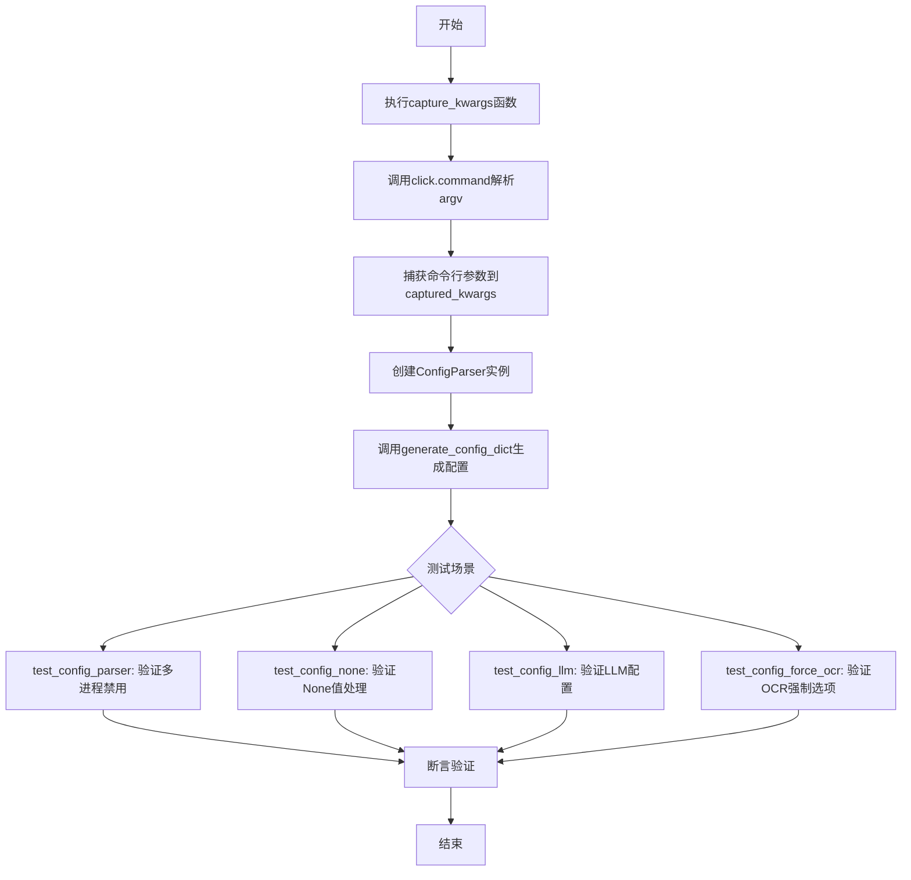
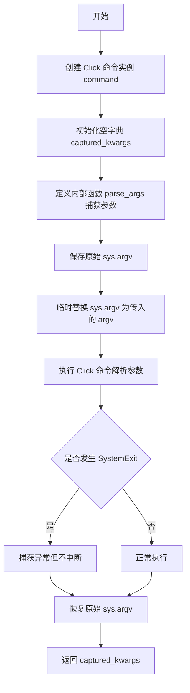
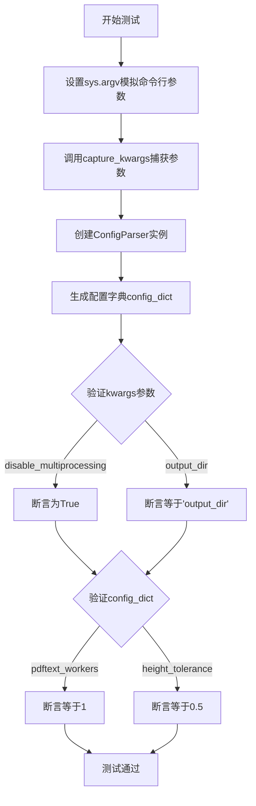

# `marker\tests\config\test_config.py` 详细设计文档

该文件是marker库的配置解析器测试套件，通过capture_kwargs函数捕获命令行参数，并使用ConfigParser生成配置字典，验证不同命令行选项（如--disable_multiprocessing、--use_llm、--force_ocr等）的解析正确性。

## 整体流程



## 类结构

```
测试模块 (test_config.py)
├── capture_kwargs (辅助函数)
├── test_config_parser (测试函数)
├── test_config_none (测试函数)
├── test_config_llm (测试函数)
└── test_config_force_ocr (测试函数)

外部依赖类 (未在此文件中定义)
├── CustomClickPrinter (click命令类)
├── ConfigParser (配置解析器)
└── crawler (爬虫配置对象)
```

## 全局变量及字段


### `captured_kwargs`
    
用于存储通过click命令行解析捕获的参数键值对

类型：`dict`
    


### `original_argv`
    
保存原始的sys.argv列表，以便在函数执行后恢复

类型：`list`
    


### `command`
    
使用CustomClickPrinter类创建的click命令对象，用于解析命令行参数

类型：`click.Command`
    


### `kwargs`
    
在测试函数中存储捕获的命令行参数

类型：`dict`
    


### `parser`
    
配置解析器实例，用于将kwargs转换为配置字典

类型：`ConfigParser`
    


### `config_dict`
    
由ConfigParser生成的配置字典，包含程序运行所需的配置项

类型：`dict`
    


    

## 全局函数及方法


### `capture_kwargs`

该函数用于模拟命令行参数解析，通过临时替换 `sys.argv` 并利用 Click 框架捕获命令行参数，最终返回一个包含所有解析后参数的字典。

参数：

- `argv`：`list`，传入的命令行参数列表，用于临时替换 `sys.argv` 以模拟命令行调用

返回值：`dict`，返回捕获的命令行参数键值对

#### 流程图



#### 带注释源码

```python
def capture_kwargs(argv):
    """
    模拟命令行参数解析并捕获所有参数
    
    参数:
        argv: 模拟的命令行参数列表，如 ['test', '--disable_multiprocessing', '--output_dir', 'output_dir']
    
    返回:
        包含所有捕获参数的字典
    """
    # 创建 Click 命令对象，使用自定义的 CustomClickPrinter
    command = click.command(cls=CustomClickPrinter)
    
    # 初始化用于存储捕获参数的字典
    captured_kwargs = {}

    def parse_args(**kwargs):
        """
        内部回调函数，用于收集所有解析出的参数
        """
        # 将捕获的参数更新到外层的 captured_kwargs 字典中
        captured_kwargs.update(kwargs)
        # 返回原始参数字典以供 Click 框架继续处理
        return kwargs

    # 保存原始的 sys.argv，以便后续恢复
    original_argv = sys.argv
    # 临时替换 sys.argv 为传入的参数列表
    sys.argv = argv
    try:
        # 使用 suppress 捕获 SystemExit 异常，避免程序退出
        with suppress(SystemExit):
            # 执行 Click 命令，传入 ConfigParser.common_options 作为回调
            command(ConfigParser.common_options(parse_args))()
    finally:
        # 在 finally 块中恢复原始的 sys.argv，确保无论如何都恢复环境
        sys.argv = original_argv

    # 返回捕获的所有参数
    return captured_kwargs
```


### `test_config_parser`

该函数是一个单元测试函数，用于验证配置解析器的核心功能，包括命令行参数捕获、ConfigParser 实例化以及配置字典生成的正确性，特别关注禁用多进程和设置高度容差等配置项。

参数：此函数没有参数

返回值：`None`，该函数不返回任何值，仅通过断言进行验证

#### 流程图



#### 带注释源码

```
def test_config_parser():
    # 设置模拟的命令行参数，模拟用户通过CLI传入的配置选项
    sys.argv = [
        "test",                              # 模拟程序名称
        "--disable_multiprocessing",         # 禁用多进程的标志
        "--output_dir",                      # 指定输出目录的参数
        "output_dir",                        # 输出目录的实际值
        "--height_tolerance",                # 高度容差参数
        "0.5",                               # 高度容差的实际值
    ]
    # 调用capture_kwargs函数，捕获解析后的命令行参数到kwargs字典
    kwargs = capture_kwargs(sys.argv)
    # 使用捕获的参数创建ConfigParser实例，用于生成配置字典
    parser = ConfigParser(kwargs)
    # 调用generate_config_dict方法，根据参数生成完整的配置字典
    config_dict = parser.generate_config_dict()

    # 验证kwargs中是否正确捕获了disable_multiprocessing参数
    assert kwargs["disable_multiprocessing"]
    # 验证kwargs中是否正确捕获了output_dir参数及其值
    assert kwargs["output_dir"] == "output_dir"

    # 验证生成的配置字典中pdftext_workers是否为1
    # 禁用多进程会将工作进程数设置为1
    assert config_dict["pdftext_workers"] == 1
    # 验证生成的配置字典中height_tolerance是否为0.5
    assert config_dict["height_tolerance"] == 0.5
```


### `test_config_none`

该函数用于测试当命令行未提供任何配置参数时，`capture_kwargs` 函数能够正确捕获所有配置项为 `None` 的情况。它通过遍历 `crawler.attr_set` 中的所有属性键，验证 kwargs 字典中对应的值均为 `None`。

参数：此函数无参数。

返回值：`None`，无显式返回值。

#### 流程图

```mermaid
flowchart TD
    A([开始 test_config_none]) --> B[调用 capture_kwargs 传入 ['test'] 模拟无参数运行]
    B --> C[获取返回的 kwargs 字典]
    C --> D[遍历 crawler.attr_set 中的每个 key]
    D --> E{还有未遍历的 key?}
    E -->|是| F[获取 kwargs.get(key) 的值]
    F --> G{值 is None?}
    G -->|是| E
    G -->|否| H([断言失败 - 测试异常])
    E -->|否| I([结束 - 所有断言通过])
    
    style H fill:#ff6b6b,stroke:#333,stroke-width:2px
    style I fill:#51cf66,stroke:#333,stroke-width:2px
```

#### 带注释源码

```python
def test_config_none():
    """
    测试配置解析器在未提供任何参数时的行为。
    
    该测试函数验证当命令行不提供任何配置选项时，
    capture_kwargs 函数能够正确处理，并将所有配置项设为 None。
    """
    # 调用 capture_kwargs 函数，传入包含 'test' 的列表
    # 模拟只提供程序名而不提供任何配置参数的情况
    kwargs = capture_kwargs(["test"])
    
    # 遍历 crawler.attr_set 中的所有属性键
    # crawler.attr_set 包含了所有可配置的选项名称
    for key in crawler.attr_set:
        # We force some options to become flags for ease of use on the CLI
        # 设置期望值为 None，因为没有提供任何参数
        value = None
        # 断言 kwargs 字典中该键的值确实为 None
        # 如果任何键的值不为 None，则测试失败
        assert kwargs.get(key) is value
```


### `test_config_llm`

该函数用于测试配置解析器在启用 LLM 选项时的行为，验证命令行参数 `--use_llm` 能否被正确捕获并转换为配置字典中的相应选项。

参数：無（该函数无显式参数，通过内部调用 `capture_kwargs` 捕获命令行参数）

返回值：`None`，该函数无显式返回值，仅通过断言进行验证

#### 流程图

```mermaid
flowchart TD
    A[开始 test_config_llm] --> B[调用 capture_kwargs 传入 ['test', '--use_llm']]
    B --> C[捕获命令行参数到 kwargs 字典]
    C --> D[创建 ConfigParser 实例并传入 kwargs]
    D --> E[调用 parser.generate_config_dict 生成配置字典]
    E --> F{验证 config_dict['use_llm'] 为真}
    F -->|断言通过| G[测试通过]
    F -->|断言失败| H[抛出 AssertionError]
```

#### 带注释源码

```python
def test_config_llm():
    """
    测试配置解析器在启用 --use_llm 选项时的行为
    
    该函数执行以下步骤：
    1. 模拟命令行参数 ['test', '--use_llm']
    2. 通过 capture_kwargs 捕获解析后的参数
    3. 创建 ConfigParser 并生成配置字典
    4. 断言配置中 use_llm 选项已被正确启用
    """
    # 调用 capture_kwargs 模拟命令行参数解析
    # 传入 argv 列表，其中包含测试命令和 --use_llm 标志
    kwargs = capture_kwargs(["test", "--use_llm"])
    
    # 使用捕获的参数创建 ConfigParser 实例
    # ConfigParser 会根据 kwargs 生成完整的配置字典
    parser = ConfigParser(kwargs)
    
    # 生成配置字典，包含所有配置项及其值
    config_dict = parser.generate_config_dict()

    # 验证配置字典中 use_llm 选项是否已被正确设置为 True
    # 如果 --use_llm 参数未被正确处理，断言将失败
    assert config_dict["use_llm"]
```


### `test_config_force_ocr`

该函数用于测试配置解析器对 `--force_ocr` 命令行选项的处理能力，验证当用户传入该选项时，配置解析器能够正确捕获参数并生成相应的配置字典项。

参数： 无

返回值：`None`，该函数不返回任何值，仅通过断言验证配置解析的正确性。

#### 流程图

```mermaid
flowchart TD
    A[开始执行 test_config_force_ocr] --> B[调用 capture_kwargs 传入 ['test', '--force_ocr']]
    B --> C{capture_kwargs 返回捕获的参数}
    C --> D[创建 ConfigParser 实例]
    D --> E[调用 parser.generate_config_dict 生成配置字典]
    E --> F{验证 config_dict['force_ocr'] 为真值}
    F -->|断言通过| G[测试通过]
    F -->|断言失败| H[抛出 AssertionError]
```

#### 带注释源码

```
def test_config_force_ocr():
    """
    测试 --force_ocr 配置选项的功能
    
    测试流程：
    1. 使用 capture_kwargs 捕获命令行参数 ['test', '--force_ocr']
    2. 创建 ConfigParser 实例并传入捕获的参数
    3. 生成配置字典并验证 force_ocr 选项是否正确解析
    """
    # 步骤1: 捕获命令行参数，使用包含 --force_ocr 的参数列表
    # capture_kwargs 会模拟命令行解析，返回解析后的 kwargs 字典
    kwargs = capture_kwargs(["test", "--force_ocr"])
    
    # 步骤2: 创建配置解析器实例，传入捕获的参数
    # ConfigParser 会根据 kwargs 生成完整的配置字典
    parser = ConfigParser(kwargs)
    
    # 步骤3: 生成配置字典
    # generate_config_dict 方法将用户输入的参数转换为完整的配置字典
    config_dict = parser.generate_config_dict()

    # 验证 force_ocr 选项是否被正确设置
    # 断言 config_dict 中 force_ocr 键对应的值为真值（True）
    # 如果为假值或不存在，断言失败并抛出 AssertionError
    assert config_dict["force_ocr"]
```

## 关键组件


### capture_kwargs 函数

用于捕获命令行参数的核心函数，通过自定义Click命令和参数解析器将命令行参数转换为字典格式

### test_config_parser 函数

测试标准配置解析功能，验证多进程禁用、输出目录和高度容差等参数能否正确捕获和转换

### test_config_none 函数

测试None值配置处理，验证配置爬虫属性集中所有键的默认值处理逻辑

### test_config_llm 函数

测试LLM配置选项，验证use_llm标志位能否正确传递到配置字典中

### test_config_force_ocr 函数

测试OCR强制配置选项，验证force_ocr标志位能否正确传递到配置字典中

### CustomClickPrinter 类

自定义Click命令打印机类，用于美化命令行输出和参数解析

### ConfigParser 类

配置解析器核心类，负责将kwargs参数转换为标准化的配置字典，生成各模块需要的配置项

### crawler 对象

配置爬虫对象，包含属性集合(attr_set)，用于遍历和验证所有可用的配置选项


## 问题及建议


### 已知问题

-   **全局状态修改与测试隔离性差**：直接修改`sys.argv`全局状态，`test_config_parser`中未使用`capture_kwargs`而是直接设置`sys.argv`，可能导致测试之间的状态污染，尤其在并行测试时会出现竞态条件
-   **Magic Value与硬编码问题**：测试中存在硬编码的字符串如`"test"`、`"output_dir"`和数值如`1`、`0.5`，缺乏常量定义，修改时需要全局搜索
-   **断言逻辑缺陷**：`test_config_none`中使用`kwargs.get(key) is value`（对象身份比较）而非`==`（值相等性比较），对于非None值会出问题
-   **异常处理不当**：`capture_kwargs`中使用`suppress(SystemExit)`吞掉了系统退出异常，可能隐藏真实的命令行解析错误或配置问题
-   **测试覆盖不完整**：缺少对`ConfigParser`异常情况、边界条件、错误输入的测试；未验证函数返回值，仅检查副作用
-   **类型注解缺失**：所有函数均无类型注解，降低了代码的可读性和可维护性，也无法利用静态分析工具进行错误检测
-   **函数设计问题**：`parse_args`作为内部函数被调用但返回`kwargs`，这种副作用式参数捕获方式不够直观
-   **未使用的导入**：`crawler`模块被导入但仅用于访问`attr_set`属性，暴露了对内部实现的依赖

### 优化建议

-   使用依赖注入或上下文管理器来管理`sys.argv`，避免直接修改全局状态；或使用`unittest.mock.patch`来模拟`sys.argv`
-   定义常量类或配置文件来集中管理magic value，如配置选项名称、默认值等
-   修正`is`为`==`进行值比较，或使用`assertIsNone()`/`assertEqual()`等专用断言方法
-   移除`suppress(SystemExit)`或在捕获后重新抛出有意义的自定义异常，添加详细的日志记录
-   增加边界条件测试（空值、无效值、超出范围的值）和异常场景测试，使用参数化测试减少重复代码
-   为所有函数添加类型注解，使用`typing.Optional`、`typing.Dict`等明确参数和返回值类型
-   考虑重构`capture_kwargs`为更清晰的API设计，接受argv参数而非修改全局状态
-   通过`ConfigParser`的公共接口获取属性集，减少对内部实现的耦合


## 其它


### 设计目标与约束

本模块的设计目标是验证ConfigParser配置解析器的功能正确性，确保命令行参数能够正确捕获并转换为配置字典。约束条件包括：必须使用click框架处理CLI参数，必须支持 multiprocessing 禁用、输出目录设置、容差参数、LLM使用标志和OCR强制标志等配置选项。

### 错误处理与异常设计

代码中使用 `contextlib.suppress(SystemExit)` 来捕获click命令执行后的SystemExit异常，避免测试程序退出。`capture_kwargs` 函数通过 `try-finally` 块确保 `sys.argv` 能够恢复到原始状态，即使发生异常也能保证后续测试的正常执行。

### 数据流与状态机

数据流过程：1) 测试函数设置模拟的 `sys.argv` 参数列表 → 2) `capture_kwargs` 调用click命令解析参数 → 3) `parse_args` 回调函数捕获所有解析后的 kwargs → 4) `ConfigParser` 接收 kwargs 并生成配置字典 → 5) 验证配置值是否符合预期。不涉及复杂状态机，为线性数据流处理。

### 外部依赖与接口契约

主要外部依赖包括：1) `click` 框架 - CLI参数解析；2) `marker.config.printer.CustomClickPrinter` - 自定义点击打印机；3) `marker.config.crawler.crawler` - 爬虫配置属性集；4) `marker.config.parser.ConfigParser` - 配置解析器核心类。接口契约：`capture_kwargs` 接收 argv 列表参数并返回捕获的 kwargs 字典；`ConfigParser` 接收 kwargs 字典并返回配置字典。

### 性能考虑

测试代码本身性能开销较小。`capture_kwargs` 函数中每次调用都会创建新的 click 命令实例，可能存在轻微的重复初始化开销。配置解析过程为同步执行，未使用异步机制。

### 安全性考虑

代码直接操作 `sys.argv` 全局变量，存在一定的副作用风险。虽然通过 `try-finally` 机制恢复了原始值，但在多线程环境下可能出现竞态条件。命令行参数未进行额外的安全校验，假设输入参数已由click框架完成基础验证。

### 测试策略

采用单元测试策略，针对不同配置场景设计独立测试函数：1) `test_config_parser` - 测试基本配置解析和多进程禁用功能；2) `test_config_none` - 测试默认None值处理；3) `test_config_llm` - 测试LLM配置选项；4) `test_config_force_ocr` - 测试OCR强制选项。使用断言验证配置字典的关键字段值是否符合预期。

### 配置管理

配置来源于命令行参数，通过 `ConfigParser.common_options` 定义可用的配置选项。配置值经过解析后生成标准化的配置字典（如 `pdftext_workers`、`height_tolerance`、`use_llm`、`force_ocr` 等）。部分配置存在隐式转换逻辑，例如禁用多进程时 `pdftext_workers` 被设置为1。

### 版本兼容性

代码依赖 Python 标准库和 click 第三方库。未发现明显的版本兼容性限制，但需确保 click 版本支持 `CustomClickPrinter` 自定义命令类的使用。

### 日志与监控

测试代码本身不包含日志输出功能。如需添加监控，可考虑在 `capture_kwargs` 函数中添加参数解析日志，记录捕获的配置项和值，便于调试配置相关问题。


    