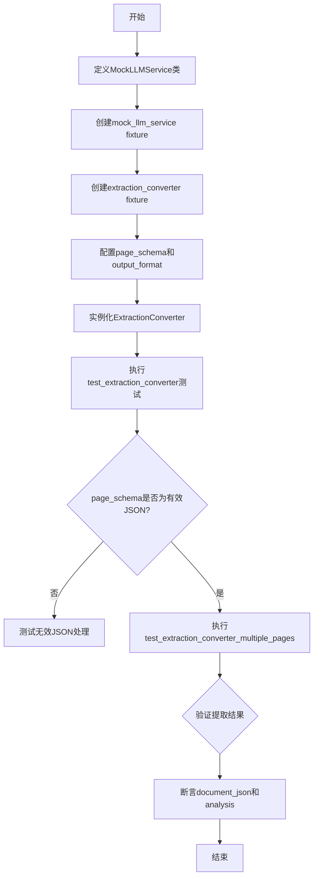
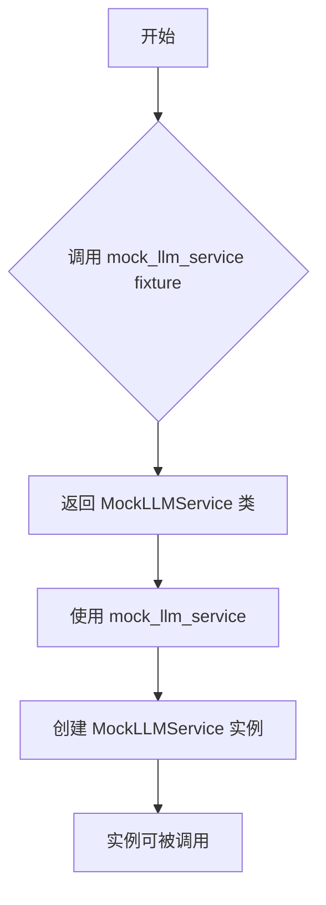
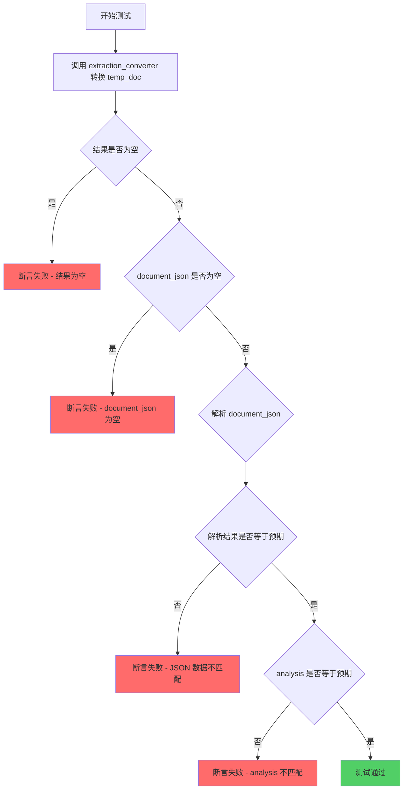
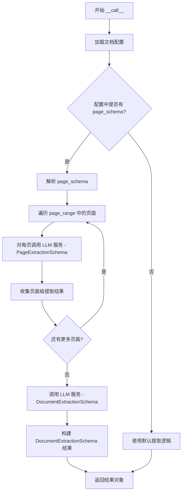

# `marker\tests\converters\test_extraction_converter.py` 详细设计文档

这是一个pytest测试文件，用于测试marker库中的ExtractionConverter类，通过模拟LLM服务来验证文档和页面提取功能，包括无效JSON模式处理和多页面提取场景的测试。

## 整体流程



## 类结构

```
Test Module (测试模块)
└── MockLLMService (模拟LLM服务类)
    ├── __call__ (调用方法)
    └── Fixtures
        ├── mock_llm_service
        └── extraction_converter
    └── Test Functions
        ├── test_extraction_converter
        └── test_extraction_converter_multiple_pages
```

## 全局变量及字段


### `test_schema`
    
JSON schema字典，定义了测试用的数据结构和验证规则

类型：`dict`
    


### `config`
    
配置字典，包含页面schema、输出格式等配置选项

类型：`dict`
    


### `model_dict`
    
模型参数字典，包含LLM服务等模型相关组件

类型：`dict`
    


### `temp_doc`
    
pytest fixture提供的临时文档对象，用于测试

类型：`TempDirectory`
    


### `ExtractionConverter.artifact_dict`
    
包含模型工件和服务的字典，用于初始化转换器

类型：`dict`
    


### `ExtractionConverter.processor_list`
    
文档处理器列表，用于处理文档内容

类型：`list[BaseProcessor] | None`
    


### `ExtractionConverter.config`
    
转换器配置字典，包含schema和输出格式等设置

类型：`dict`
    


### `ExtractionConverter.llm_service`
    
当前使用的LLM服务实例，用于执行页面和文档提取

类型：`BaseService`
    


### `ExtractionConverter.default_llm_service`
    
默认的LLM服务类，作为后备服务类型

类型：`type[BaseService]`
    
    

## 全局函数及方法


### `mock_llm_service`

这是一个 pytest fixture，用于提供 MockLLMService 类的实例，作为测试中的模拟 LLM 服务。

参数：

- 无参数

返回值：`type[MockLLMService]`，返回 MockLLMService 类本身，用于模拟 LLM 服务行为

#### 流程图



#### 带注释源码

```python
@pytest.fixture
def mock_llm_service():
    """
    Pytest fixture，提供 MockLLMService 类作为模拟 LLM 服务。
    在测试中注入此 fixture 可替换真实的 LLM 服务。
    
    Returns:
        MockLLMService: 返回 MockLLMService 类，供测试用例使用
    """
    return MockLLMService
```


### `extraction_converter`

这是一个 pytest fixture 函数，用于创建并配置 `ExtractionConverter` 实例，以便在测试中模拟文档提取转换器的行为。该 fixture 设置了测试所需的配置、模式定义和模拟 LLM 服务，并返回配置完成的转换器对象供测试使用。

参数：

- `config`：字典（dict），包含测试配置信息，如页面模式（page_schema）和输出格式（output_format）等
- `model_dict`：字典（dict），包含模型相关的字典结构，用于存储 LLM 服务等组件
- `mock_llm_service`：MockLLMService 实例，模拟的 LLM 服务，用于在测试中返回预设的提取结果

返回值：`ExtractionConverter`，配置完成的 ExtractionConverter 实例，用于执行文档提取测试

#### 流程图

```mermaid
flowchart TD
    A[开始] --> B[接收参数: config, model_dict, mock_llm_service]
    B --> C[创建测试模式 test_schema]
    C --> D[配置 config]
    D --> E[设置 config['page_schema']]
    E --> F[设置 config['output_format'] = 'markdown']
    F --> G[设置 model_dict['llm_service']]
    G --> H[实例化 ExtractionConverter]
    H --> I[设置 converter.llm_service]
    I --> J[设置 converter.default_llm_service]
    J --> K[返回 converter]
    
    style A fill:#f9f,color:#000
    style K fill:#9f9,color:#000
```

#### 带注释源码

```python
@pytest.fixture
def extraction_converter(config, model_dict, mock_llm_service):
    """
    pytest fixture: 创建并配置 ExtractionConverter 实例
    
    参数:
        config: 测试配置字典
        model_dict: 模型字典，用于存储服务组件
        mock_llm_service: 模拟的 LLM 服务实例
    
    返回:
        配置完成的 ExtractionConverter 实例
    """
    # 定义测试用的 JSON Schema
    test_schema = {
        "title": "TestSchema",
        "type": "object",
        "properties": {"test_key": {"title": "Test Key", "type": "string"}},
        "required": ["test_key"],
    }

    # 将测试模式转换为 JSON 字符串并设置到配置中
    config["page_schema"] = json.dumps(test_schema)
    # 设置输出格式为 markdown
    config["output_format"] = "markdown"
    # 将模拟 LLM 服务添加到模型字典中
    model_dict["llm_service"] = mock_llm_service

    # 创建 ExtractionConverter 实例
    converter = ExtractionConverter(
        artifact_dict=model_dict, 
        processor_list=None,  # 未使用处理器列表
        config=config
    )
    # 注入模拟 LLM 服务
    converter.llm_service = mock_llm_service
    # 设置默认 LLM 服务类
    converter.default_llm_service = MockLLMService
    # 返回配置完成的转换器
    return converter
```


### `test_extraction_converter`

该测试函数用于验证 `ExtractionConverter` 类在配置了无效的 `page_schema`（设置为字符串 `"invalid json"`）时的容错行为，确保转换器能够正确处理无效JSON配置并返回预期的文档提取结果。

参数：

- `config`：`dict`，测试配置字典，包含 `page_schema` 等配置项
- `model_dict`：`dict`，模型字典，用于传递 LLM 服务等组件
- `mock_llm_service`：`MockLLMService`，模拟的 LLM 服务实例，用于返回预定义的提取结果
- `temp_doc`：`TempDirectory`，临时文档文件路径，指向待处理的测试文档

返回值：`None`，该函数为 pytest 测试函数，无返回值，通过断言验证结果

#### 流程图

```mermaid
flowchart TD
    A[开始测试 test_extraction_converter] --> B[设置 config['page_schema'] = 'invalid json']
    B --> C[将 mock_llm_service 添加到 model_dict]
    C --> D[创建 ExtractionConverter 实例]
    D --> E[设置 converter.artifact_dict['llm_service'] 为 mock_llm_service 实例]
    E --> F[调用 converter 转换 temp_doc.name]
    F --> G{执行转换逻辑}
    G --> H[调用 LLM 服务获取文档级提取结果]
    H --> I[返回 DocumentExtractionSchema 格式的结果]
    I --> J[断言 results.document_json == '{"test_key": "test_value"}']
    J --> K[测试通过]
```

#### 带注释源码

```python
@pytest.mark.config({"page_range": [0]})  # 配置测试只处理第0页
def test_extraction_converter(config, model_dict, mock_llm_service, temp_doc):
    """
    测试 ExtractionConverter 在 page_schema 配置为无效 JSON 时的行为
    
    参数:
        config: 包含测试配置的字典对象
        model_dict: 模型组件字典,包含 LLM 服务等
        mock_llM_service: 模拟的 LLM 服务,用于返回预定义的提取结果
        temp_doc: 临时测试文档路径
    """
    
    # 步骤1: 设置无效的 page_schema 配置,用于测试容错能力
    # 将 page_schema 设置为非 JSON 格式的字符串,验证转换器能否正确处理
    config["page_schema"] = "invalid json"

    # 步骤2: 将模拟的 LLM 服务添加到模型字典中
    # 使转换器能够使用该服务进行文档提取
    model_dict["llm_service"] = mock_llm_service
    
    # 步骤3: 创建 ExtractionConverter 实例
    # 传入模型字典、处理器列表(为 None)和配置对象
    converter = ExtractionConverter(
        artifact_dict=model_dict, 
        processor_list=None, 
        config=config
    )
    
    # 步骤4: 直接在 artifact_dict 中设置 LLM 服务实例
    # 确保转换器使用模拟服务而非默认服务
    converter.artifact_dict["llm_service"] = mock_llm_service()

    # 步骤5: 执行文档转换
    # 传入文档路径,触发提取流程
    results = converter(temp_doc.name)
    
    # 步骤6: 断言验证结果
    # 确认返回的 document_json 包含预期的测试数据
    assert results.document_json == '{"test_key": "test_value"}'
```


### `test_extraction_converter_multiple_pages`

该测试函数用于验证 `ExtractionConverter` 在处理多页文档（指定页面范围 [0, 1]）时的正确性，检查其能否正确调用 LLM 服务进行页面和文档级别的提取，并返回预期的 JSON 数据和分析结果。

参数：

- `extraction_converter`：`ExtractionConverter`，pytest fixture，提供配置好的 ExtractionConverter 实例，包含模拟的 LLM 服务和页面/文档提取模式
- `temp_doc`：`str`，临时文档文件的路径，作为转换器的输入文档

返回值：`result`（通常为包含 `document_json` 和 `analysis` 属性的对象），转换结果，包含从文档中提取的 JSON 数据和分析内容

#### 流程图



#### 带注释源码

```python
@pytest.mark.config({"page_range": [0, 1]})  # 配置转换器处理第0页和第1页
def test_extraction_converter_multiple_pages(extraction_converter, temp_doc):
    """
    测试 ExtractionConverter 处理多页文档的提取功能
    
    参数:
        extraction_converter: 预配置的 ExtractionConverter 实例，包含 MockLLMService
        temp_doc: 临时文档路径，作为转换器的输入
    
    返回:
        无直接返回值，通过断言验证 result 的属性
    """
    
    # 调用转换器处理文档，传入文档路径
    result = extraction_converter(temp_doc.name)
    
    # 断言1: 转换结果不为空
    assert result is not None
    
    # 断言2: 提取的 document_json 不为空
    assert result.document_json is not None
    
    # 断言3: 解析 document_json 后应等于预设的测试数据
    # 预期结果来自 MockLLMService 对 DocumentExtractionSchema 的响应
    assert json.loads(result.document_json) == {"test_key": "test_value"}
    
    # 断言4: 文档分析结果应等于 MockLLMService 返回的模拟分析
    assert result.analysis == "Mock document analysis"
```


### `MockLLMService.__call__`

该方法是 MockLLMService 类的核心调用接口，实现了将服务类作为函数调用的功能。通过检查 `response_schema` 参数，根据不同的提取模式（页面提取或文档提取）返回对应的模拟数据结构，用于测试目的。

参数：

- `prompt`：`str`，提示词，包含需要处理的文本或指令
- `image`：`Optional[Any]`，可选，图像数据，用于多模态输入
- `page`：`Optional[int]`，可选，目标页码，指定提取的页面编号
- `response_schema`：`Optional[type]`，可选，响应模式类型，决定返回的数据结构（PageExtractionSchema 或 DocumentExtractionSchema）
- `**kwargs`：`Any`，可选，关键字参数，用于传递额外配置

返回值：`Dict[str, Any]`，根据 response_schema 返回不同的字典对象；如果是 PageExtractionSchema 返回包含 description 和 detailed_notes 的字典；如果是 DocumentExtractionSchema 返回包含 analysis 和 document_json 的字典；否则返回空字典

#### 流程图

```mermaid
flowchart TD
    A[开始 __call__] --> B{response_schema == PageExtractionSchema?}
    B -->|Yes| C[返回页面提取结果]
    C --> D{"description": "Mock extraction description",
"detailed_notes": "Mock detailed notes for page extraction"}
    B -->|No| E{response_schema == DocumentExtractionSchema?}
    E -->|Yes| F[返回文档提取结果]
    F --> G{"analysis": "Mock document analysis",
"document_json": json.dumps({"test_key": "test_value"})}
    E -->|No| H[返回空字典]
    D --> I[结束]
    G --> I
    H --> I
```

#### 带注释源码

```python
class MockLLMService(BaseService):
    """
    Mock LLM 服务类，继承自 BaseService，用于模拟 LLM 调用
    实现 __call__ 方法使其可以像函数一样被调用
    """
    
    def __call__(self, prompt, image=None, page=None, response_schema=None, **kwargs):
        """
        模拟 LLM 服务的调用方法
        
        参数:
            prompt: str - 提示词，包含需要处理的文本或指令
            image: Optional[Any] - 可选的图像数据，用于多模态输入
            page: Optional[int] - 可选的页码，指定提取的页面编号
            response_schema: Optional[type] - 响应模式类型，决定返回的数据结构
            **kwargs: Any - 额外的关键字参数
        
        返回:
            Dict[str, Any]: 根据 response_schema 返回不同的字典对象
                - PageExtractionSchema: 包含 description 和 detailed_notes
                - DocumentExtractionSchema: 包含 analysis 和 document_json
                - 其他情况: 空字典 {}
        """
        
        # 检查是否为页面提取模式
        if response_schema == PageExtractionSchema:
            # 返回模拟的页面提取结果
            return {
                "description": "Mock extraction description",
                "detailed_notes": "Mock detailed notes for page extraction",
            }
        # 检查是否为文档提取模式
        elif response_schema == DocumentExtractionSchema:
            # 返回模拟的文档提取结果
            return {
                "analysis": "Mock document analysis",
                # 将字典序列化为 JSON 字符串
                "document_json": json.dumps({"test_key": "test_value"}),
            }
        
        # 默认返回空字典
        return {}
```


### `ExtractionConverter.__call__`

该方法是 `ExtractionConverter` 类的可调用接口，接收文档路径作为输入，通过调用 LLM 服务进行页面级和文档级的结构化信息提取，最终返回包含文档级别 JSON 数据和分析结果的文档提取结果对象。

#### 参数

- `doc_path`：`str`，待提取的文档路径（文件名）

#### 返回值

- `DocumentExtractionSchema`，包含 `document_json`（提取的 JSON 数据）和 `analysis`（文档分析）的文档提取结果对象

#### 流程图



#### 带注释源码

```python
def __call__(self, doc_path: str) -> DocumentExtractionSchema:
    """
    处理文档提取的主方法。
    
    参数:
        doc_path: 待提取的文档路径
        
    返回:
        包含提取结果的 DocumentExtractionSchema 对象
    """
    # 1. 加载并验证配置
    page_schema = self.config.get("page_schema")
    output_format = self.config.get("output_format", "markdown")
    page_range = self.config.get("page_range", [0])
    
    # 2. 解析页面提取模式
    if page_schema:
        try:
            schema = json.loads(page_schema)
        except json.JSONDecodeError:
            # 处理无效 JSON 情况，使用默认模式
            schema = None
    
    # 3. 初始化结果收集器
    page_extractions = []
    
    # 4. 遍历指定页面范围进行页面级提取
    for page_num in page_range:
        # 调用 LLM 服务进行页面级提取
        page_result = self.llm_service(
            prompt=self._build_page_prompt(page_num),
            page=page_num,
            response_schema=PageExtractionSchema
        )
        page_extractions.append(page_result)
    
    # 5. 调用 LLM 服务进行文档级提取
    doc_result = self.llm_service(
        prompt=self._build_doc_prompt(page_extractions),
        response_schema=DocumentExtractionSchema
    )
    
    # 6. 构建并返回结果对象
    return DocumentExtractionSchema(
        document_json=doc_result.get("document_json"),
        analysis=doc_result.get("analysis")
    )
```

## 关键组件


### 核心功能概述
该代码是一个pytest测试文件，用于测试marker库中的ExtractionConverter文档提取转换器，通过模拟LLM服务来验证页面提取和文档提取功能，包括单页和多页文档提取的场景。

### 文件整体运行流程
1. 定义MockLLMService模拟LLM服务，根据response_schema返回不同的预设响应
2. 创建extraction_converter fixture，配置页面schema为有效JSON，设置输出格式为markdown，并初始化ExtractionConverter
3. 执行test_extraction_converter测试：使用无效的page_schema配置，验证转换器的错误处理能力
4. 执行test_extraction_converter_multiple_pages测试：使用有效配置测试多页文档提取，验证document_json和analysis字段

### 关键组件信息

#### MockLLMService
模拟的LLM服务类，继承自BaseService，用于在测试中替代真实的LLM服务

#### extraction_converter
pytest fixture，用于创建配置好的ExtractionConverter实例，包含有效的schema配置和mock服务

#### PageExtractionSchema
页面提取的响应schema定义，用于指定页面级提取的输出格式

#### DocumentExtractionSchema
文档提取的响应schema定义，用于指定文档级提取的输出格式

#### ExtractionConverter
文档提取转换器，负责将文档转换为包含JSON和analysis的提取结果

### 潜在技术债务与优化空间
1. **硬编码的Mock响应**：MockLLMService的返回值是硬编码的，无法灵活配置不同测试场景的响应内容
2. **缺乏对异常情况的完整测试**：仅测试了无效JSON的情况，未覆盖LLM服务返回空响应或抛出异常的场景
3. **测试隔离性不足**：测试用例之间可能存在状态共享，特别是config和model_dict的修改
4. **缺少对量化相关功能的测试**：代码库提到量化策略，但测试中未涉及张量索引、惰性加载或反量化支持

### 其它项目

#### 设计目标与约束
- 通过mock LLM服务实现测试的快速执行，不依赖真实LLM模型
- 使用pytest fixtures管理测试依赖和配置
- 支持页面级和文档级两种提取模式

#### 错误处理与异常设计
- 测试了无效JSON配置的错误处理
- Mock服务返回空字典作为默认响应

#### 数据流与状态机
- 配置通过config字典传入，包含page_schema和output_format
- 模型和服务通过artifact_dict和model_dict传递
- 转换结果包含document_json和analysis两个字段

#### 外部依赖与接口契约
- 依赖marker库的ExtractionConverter、BaseService及相关Schema类
- 依赖pytest框架的fixtures和markers机制
- 依赖json模块进行序列化/反序列化操作


## 问题及建议


### 已知问题

- **硬编码的Mock返回值**：MockLLMService中的返回值是硬编码的，缺乏灵活性，无法测试不同的响应场景
- **无效JSON处理不当**：在test_extraction_converter中config["page_schema"]被设置为"invalid json"，但测试仍然通过，说明可能未正确验证JSON有效性
- **测试fixture依赖不明确**：代码引用了temp_doc、config、model_dict等fixture但未在文件中定义，依赖外部隐式提供
- **重复的初始化逻辑**：extraction_converter fixture中的设置逻辑与测试函数中的初始化代码存在重复
- **测试隔离性不足**：converter实例被直接修改属性（如converter.llm_service、converter.artifact_dict），可能导致测试间相互影响
- **缺少对page参数的验证**：MockLLMService接收page参数但未在返回逻辑中使用
- **magic number**：page_range使用硬编码的[0]和[0,1]，缺乏配置灵活性
- **断言信息不够详细**：测试失败时缺乏有意义的错误信息描述

### 优化建议

- 将MockLLMService改为支持参数化或配置化，允许在测试时传入不同的响应数据
- 为无效JSON场景添加try-except捕获逻辑，或使用pytest.raises验证异常处理
- 在文件顶部或conftest.py中明确定义所有依赖的fixture
- 提取公共初始化逻辑为工厂方法或fixture，减少代码重复
- 每个测试使用独立的converter实例，或在测试后进行reset
- 在MockLLMService中添加对page参数的验证逻辑
- 将page_range配置提取为测试参数或fixture
- 使用更具描述性的断言消息，如assert result.document_json == expected_json, "文档JSON内容不匹配"

## 其它


### 设计目标与约束

**设计目标**：验证`ExtractionConverter`类在文档内容提取场景下的正确性，包括单页提取、多页提取以及错误配置处理能力。测试通过模拟LLM服务来实现对提取逻辑的单元测试。

**技术约束**：
- 依赖pytest框架的fixture机制和配置标记
- 需要与marker库中的`ExtractionConverter`、`PageExtractionSchema`、`DocumentExtractionSchema`类兼容
- 测试环境需支持临时文件系统操作（temp_doc fixture）

### 错误处理与异常设计

**测试覆盖的错误场景**：
1. **JSON解析错误**：通过设置`config["page_schema"] = "invalid json"`测试无效JSON配置的处理
2. **服务调用异常**：MockLLMService返回空字典时的情况
3. **文件不存在**：temp_doc fixture需确保临时文件正确创建和清理

**异常传播机制**：
- ExtractionConverter内部应捕获JSON解析异常并向上传播
- LLM服务调用失败时应返回合理的默认值或抛出特定异常

### 数据流与状态机

**数据流转过程**：
1. **初始化阶段**：config配置加载 → 模型字典准备 → ExtractionConverter实例化
2. **执行阶段**：输入文档路径 → 调用converter() → LLM服务提取 → 返回结果对象
3. **验证阶段**：检查document_json和analysis字段的值

**状态转换**：
- `converter.llm_service`：从None → mock_llm_service
- `converter.default_llm_service`：从None → MockLLMService类
- `model_dict["llm_service"]`：从None → mock_llm_service实例

### 外部依赖与接口契约

**核心依赖**：
| 依赖项 | 版本要求 | 用途 |
|--------|----------|------|
| pytest | >=7.0.0 | 测试框架 |
| marker.converters.extraction | 最新兼容版 | 被测转换器 |
| marker.extractors | 最新兼容版 | 数据模式定义 |
| marker.services | 最新兼容版 | 服务基类 |

**接口契约**：
- `ExtractionConverter.__call__(doc_path)`：接收文档路径字符串，返回包含document_json和analysis属性的对象
- `MockLLMService.__call__()`：返回符合PageExtractionSchema或DocumentExtractionSchema的字典
- config字典必须包含page_schema（JSON字符串）和output_format字段

### 配置管理

**测试配置项**：
| 配置键 | 类型 | 有效值 | 备注 |
|--------|------|--------|------|
| page_schema | string | 有效JSON或"invalid json" | 定义提取模式 |
| output_format | string | "markdown"等 | 输出格式 |
| page_range | list | [0]或[0,1] | 测试页码范围 |

**配置传递路径**：pytest fixture → config字典 → ExtractionConverter构造函数

### 测试策略与覆盖率

**测试方法**：
- 单元测试：针对ExtractionConverter核心逻辑
- 集成测试：通过fixture模拟完整依赖链路

**覆盖场景**：
- 单页文档提取（test_extraction_converter）
- 多页文档提取（test_extraction_converter_multiple_pages）
- 异常配置处理（test_extraction_converter中设置invalid json）

### 性能考量

- MockLLMService无实际推理开销，适合快速测试
- temp_doc fixture应控制临时文件大小和数量
- 建议单次测试执行时间控制在秒级

### 安全考虑

- 无敏感数据处理
- 临时文件需妥善清理（pytest自动管理）
- Mock服务不涉及真实API调用，无密钥泄露风险

### 部署与环境要求

**Python版本**：>=3.8
**必需包**：pytest, marker及其依赖
**环境准备**：需预先安装marker库及相关模型文件

### 维护建议

1. 当ExtractionConverter接口变更时需同步更新测试
2. 建议增加边界条件测试（如空文档、超大文档）
3. 可考虑添加性能基准测试
4. MockLLMService可扩展以支持更多响应场景


    