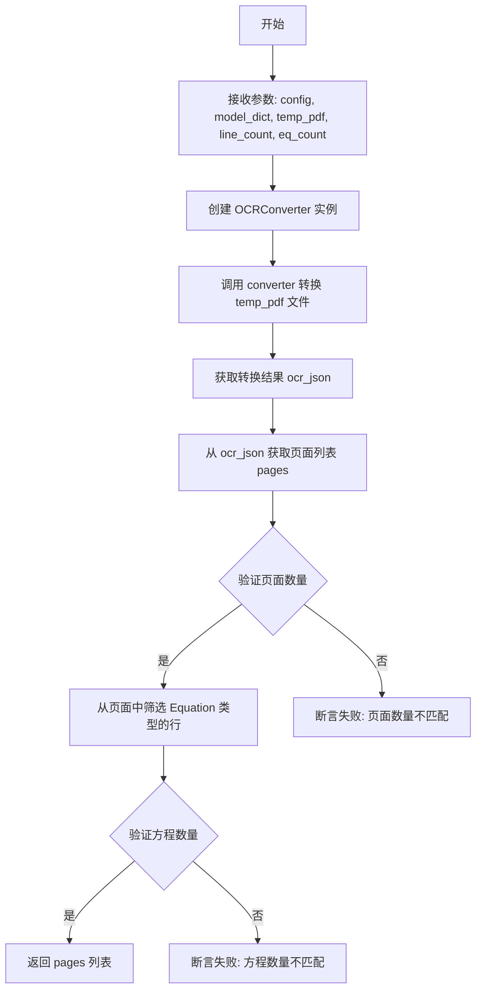
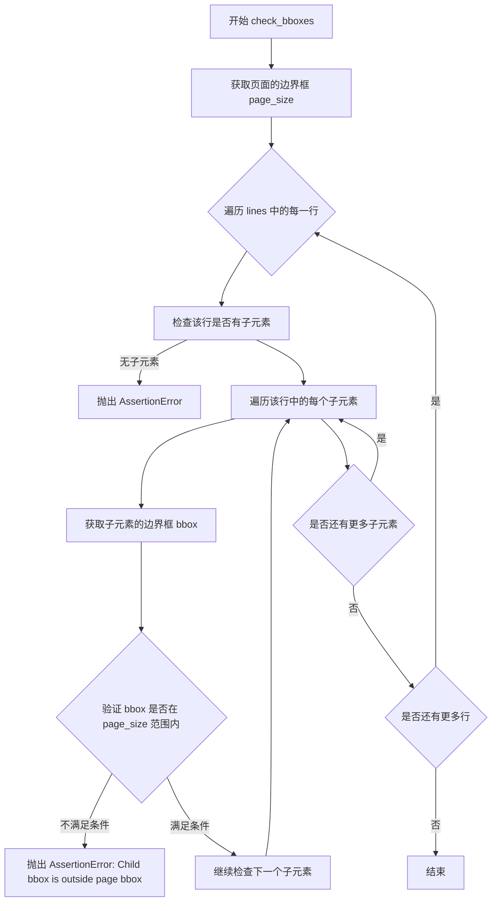
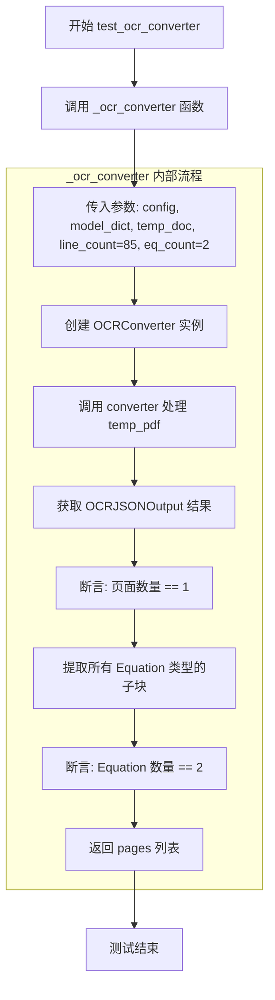
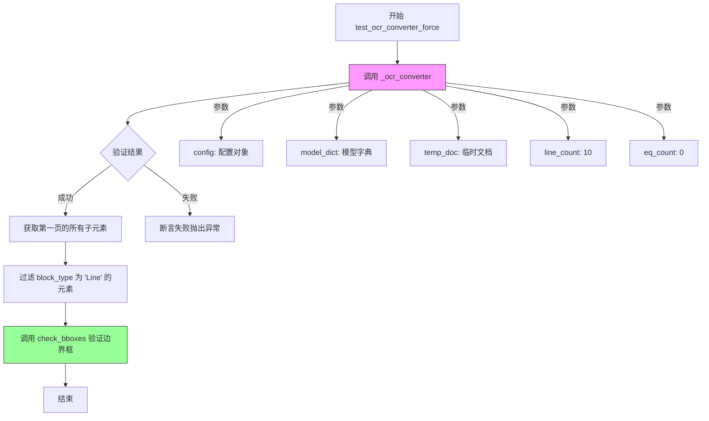

# `marker\tests\converters\test_ocr_converter.py` 详细设计文档

该文件是一个pytest测试套件，用于测试OCRConverter将PDF文档转换为OCR JSON输出的功能，包括验证页面数量、方程数量以及边界框的正确性。

## 整体流程

```mermaid
graph TD
    A[开始] --> B[运行测试函数]
    B --> C{测试类型}
    C -- test_ocr_converter --> D[_ocr_converter(config, model_dict, temp_doc, 85, 2)]
    C -- test_ocr_converter_force --> E[_ocr_converter(config, model_dict, temp_doc, 10, 0) + check_bboxes]
    C -- test_ocr_converter_keep --> F[_ocr_converter(config, model_dict, temp_doc, 10, 0) + check_bboxes]
    D --> G[创建OCRConverter实例]
    G --> H[调用converter转换PDF]
    H --> I[获取OCRJSONOutput]
    I --> J[验证页面数量和方程数量]
    E --> D
    F --> D
    J --> K[结束]
```

## 类结构

```
无本地类定义
导入的类:
├── OCRConverter (来自marker.converters.ocr)
├── OCRJSONOutput (来自marker.renderers.ocr_json)
└── OCRJSONPageOutput (来自marker.renderers.ocr_json)
```

## 全局变量及字段


### `converter`
    
用于将PDF转换为OCR结果的转换器实例

类型：`OCRConverter`
    


### `ocr_json`
    
OCR转换器返回的完整JSON输出对象

类型：`OCRJSONOutput`
    


### `pages`
    
OCRJSONOutput的子元素列表，包含所有页面

类型：`List[OCRJSONPageOutput]`
    


### `eqs`
    
筛选出的所有公式行列表

类型：`List`
    


### `page_size`
    
页面的边界框坐标

类型：`Tuple`
    


### `line`
    
迭代中当前处理的行对象

类型：`OCRJSONPageOutput`
    


### `bbox`
    
子元素的边界框坐标

类型：`Tuple`
    


### `lines`
    
筛选出的所有文本行列表

类型：`List`
    


    

## 全局函数及方法


### `_ocr_converter`

该函数是一个测试辅助函数，用于验证 OCR 转换器的功能。它接收配置、模型字典、临时 PDF 文件以及预期的行数和方程数量，创建 OCRConverter 实例对 PDF 进行转换，并验证转换结果是否符合预期。

参数：

- `config`：配置对象，包含 OCR 转换器的配置参数
- `model_dict`：字典，包含 OCR 模型的人工制品（artifact）
- `temp_pdf`：临时文件对象，指向待转换的 PDF 文件
- `line_count`：`int`，预期返回的行数（用于断言验证）
- `eq_count`：`int`，预期返回的方程数量（用于断言验证）

返回值：`List[OCRJSONPageOutput]`，返回包含 OCR 识别结果的页面列表

#### 流程图



#### 带注释源码

```python
def _ocr_converter(config, model_dict, temp_pdf, line_count: int, eq_count: int):
    """
    测试辅助函数：验证 OCR 转换器的转换功能
    
    参数:
        config: 配置对象，包含转换器配置
        model_dict: 模型字典，包含 OCR 模型
        temp_pdf: 临时 PDF 文件对象
        line_count: 预期行数（用于测试验证）
        eq_count: 预期方程数量（用于测试验证）
    
    返回:
        pages: OCR 转换后的页面列表
    """
    
    # 使用配置和模型字典初始化 OCR 转换器
    converter = OCRConverter(artifact_dict=model_dict, config=config)

    # 调用转换器对 PDF 进行 OCR 识别，返回 OCRJSONOutput 对象
    ocr_json: OCRJSONOutput = converter(temp_pdf.name)
    
    # 获取识别结果中的页面列表
    pages = ocr_json.children

    # 断言：验证只转换了 1 页
    assert len(pages) == 1
    
    # （被注释的断言：原本用于验证行数）
    # assert len(pages[0].children) == line_count
    
    # 从第一页的所有子元素中筛选出 Equation（方程）类型的元素
    eqs = [line for line in pages[0].children if line.block_type == "Equation"]
    
    # 断言：验证方程数量是否符合预期
    assert len(eqs) == eq_count
    
    # 返回识别后的页面列表，供调用者进一步验证
    return pages
```


### `check_bboxes`

该函数用于验证OCR输出中所有子元素的边界框（bbox）是否完全包含在页面边界框内，确保检测到的元素不会超出页面范围。

参数：

- `page`：`OCRJSONPageOutput`，包含页面的边界框信息（page.bbox）
- `lines`：`list`，页面中的行元素列表，每个元素都包含子元素及其边界框

返回值：`None`，该函数通过assert断言进行验证，若边界框验证失败则抛出AssertionError

#### 流程图



#### 带注释源码

```
def check_bboxes(page: OCRJSONPageOutput, lines):
    """
    验证所有子元素的边界框都在页面边界框内
    
    参数:
        page: OCRJSONPageOutput对象,包含页面的边界框信息
        lines: 行对象列表,每个行对象包含子元素及其边界框
    """
    # 获取页面的边界框 [x0, y0, x1, y1]
    page_size = page.bbox
    
    # 遍历页面中的每一行
    for line in lines:
        # 断言:每行必须至少有一个子元素
        assert len(line.children) > 0
        
        # 遍历该行中的每个子元素
        for child in line.children:
            # 获取子元素的边界框 [x0, y0, x1, y1]
            bbox = child.bbox
            
            # 验证边界框是否完全包含在页面边界框内
            # bbox[0]: 子元素左边界 >= 页面左边界
            # bbox[1]: 子元素上边界 >= 页面上边界
            # bbox[2]: 子元素右边界 <= 页面右边界
            # bbox[3]: 子元素下边界 <= 页面下边界
            assert all(
                [
                    bbox[0] >= page_size[0],  # 左边界检查
                    bbox[1] >= page_size[1],  # 上边界检查
                    bbox[2] <= page_size[2],  # 右边界检查
                    bbox[3] <= page_size[3],  # 下边界检查
                ]
            ), "Child bbox is outside page bbox"
```


### `test_ocr_converter`

这是一个pytest测试函数，用于验证OCRConverter在默认配置下将PDF文档转换为OCRJSONOutput的正确性，包括页面数量和公式（Equation）块的识别数量。

参数：

- `config`：配置对象（pytest fixture），包含测试配置信息
- `model_dict`：模型字典（pytest fixture），包含OCR模型数据
- `temp_doc`：临时文档对象（pytest fixture），指向待处理的PDF文件

返回值：`None`，该函数为测试函数，无显式返回值，主要通过内部断言验证功能

#### 流程图



#### 带注释源码

```python
@pytest.mark.config({"page_range": [0]})
def test_ocr_converter(config, model_dict, temp_doc):
    """
    测试OCRConverter在默认配置下的转换功能
    
    参数:
        - config: pytest fixture提供的配置对象
        - model_dict: pytest fixture提供的模型字典
        - temp_doc: pytest fixture提供的临时PDF文档
    """
    # 调用内部函数 _ocr_converter 进行测试
    # 期望结果: 1页, 85行文本, 2个公式块
    _ocr_converter(config, model_dict, temp_doc, 85, 2)
```


### `test_ocr_converter_force`

这是一个OCR转换器的测试函数，用于验证强制OCR模式（force_ocr=True）下PDF文档的转换结果是否符合预期，特别是检查页面中的行元素（Line）及其边界框是否正确。

参数：

- `config`：pytest fixture，配置对象，包含测试所需的配置参数
- `model_dict`：pytest fixture，模型字典，提供OCR转换所需的模型数据
- `temp_doc`：pytest fixture，临时文档，提供待转换的PDF文件路径

返回值：`None`，该函数为测试函数，不返回任何值，仅通过断言验证结果

#### 流程图



#### 带注释源码

```python
@pytest.mark.filename("pres.pdf")  # 标记测试使用的文件名
@pytest.mark.config({
    "page_range": [1],      # 只处理第1页（索引从0开始，所以是第2页）
    "force_ocr": True,      # 强制使用OCR模式，即使有文本也要OCR
    "keep_chars": True      # 保留字符信息
})
def test_ocr_converter_force(config, model_dict, temp_doc):
    """
    测试OCR转换器的强制OCR模式
    
    该测试验证当 force_ocr=True 时，OCR转换器能够正确处理PDF文档，
    并返回预期数量的行元素，且所有子元素的边界框都在页面范围内。
    
    Parameters:
        config: pytest配置fixture，提供转换器配置
        model_dict: pytest模型fixture，提供OCR模型数据
        temp_doc: pytest临时文档fixture，提供PDF文件路径
    """
    # 调用内部OCR转换函数，期望返回10行，0个公式
    pages = _ocr_converter(config, model_dict, temp_doc, 10, 0)
    
    # 从第一页的所有子元素中筛选出 block_type 为 "Line" 的元素
    lines = [line for line in pages[0].children if line.block_type == "Line"]
    
    # 验证所有行的边界框是否在页面边界内
    # 检查每个子元素的bbox是否完全包含在page bbox中
    check_bboxes(pages[0], lines)
```


### `test_ocr_converter_keep`

该函数是一个pytest测试用例，用于验证OCR转换器在启用`keep_chars`配置时能够正确处理PDF文档并保留字符边界框信息。

参数：

- `config`：pytest fixture，提供配置对象
- `model_dict`：pytest fixture，提供模型字典（包含OCR模型）
- `temp_doc`：pytest fixture，提供临时PDF文档文件路径

返回值：`None`，该函数为测试用例，无返回值（通过断言验证结果）

#### 流程图

```mermaid
flowchart TD
    A[开始测试 test_ocr_converter_keep] --> B[调用 _ocr_converter 函数]
    B --> C[获取 OCRJSONOutput 对象]
    C --> D[从 pages[0].children 过滤 block_type 为 Line 的元素]
    D --> E[构建 lines 列表]
    E --> F[调用 check_bboxes 函数验证边界框]
    F --> G{边界框是否合法}
    G -->|是| H[测试通过]
    G -->|否| I[断言失败]
```

#### 带注释源码

```python
@pytest.mark.filename("pres.pdf")  # 指定测试使用的文件名
@pytest.mark.config({"page_range": [1], "keep_chars": True})  # 配置：只处理第1页，启用keep_chars
def test_ocr_converter_keep(config, model_dict, temp_doc):
    """
    测试OCR转换器在keep_chars=True配置下的行为
    
    参数:
        config: pytest配置fixture
        model_dict: 模型字典fixture
        temp_doc: 临时文档fixture
    """
    # 调用_ocr_converter进行OCR转换，期望10行，0个公式
    pages = _ocr_converter(config, model_dict, temp_doc, 10, 0)
    
    # 从第一页的子元素中筛选出block_type为"Line"的元素
    lines = [line for line in pages[0].children if line.block_type == "Line"]
    
    # 验证所有行的边界框都在页面边界内
    check_bboxes(pages[0], lines)
```

## 关键组件


### OCRConverter

将PDF文档转换为OCR JSON输出的核心转换器，支持配置参数如page_range、force_ocr和keep_chars，用于处理不同的OCR场景。

### OCRJSONOutput

表示整个PDF文档的OCR JSON输出结果，包含多个页面的子节点(children)，用于结构化存储OCR识别结果。

### OCRJSONPageOutput

表示单个PDF页面的OCR输出，包含页面边界框(bbox)和该页面内的所有内容块(children)，如行(Line)和公式(Equation)。

### _ocr_converter 辅助函数

创建OCRConverter实例并执行PDF到OCR JSON的转换，验证页面数量和公式块数量，返回页面列表供后续验证使用。

### check_bboxes 验证函数

验证OCR识别出的每个子元素边界框是否在页面边界框范围内，确保坐标逻辑一致性，防止子元素超出页面范围。

### 测试配置与场景

通过pytest标记配置不同的测试场景：标准OCR转换、强制OCR模式(force_ocr)、保留字符模式(keep_chars)，用于验证不同配置下的转换正确性。

### 边界框(BBox)系统

页面和子元素的几何位置表示为[x0, y0, x2, y2]格式的坐标元组，用于定位和验证OCR识别结果在PDF页面中的位置。


## 问题及建议


### 已知问题

-   **硬编码的测试断言值**：line_count (85, 10) 和 eq_count (2, 0) 作为魔法数字出现，缺乏注释说明这些预期值的来源和依据
-   **被注释的断言代码**：`assert len(pages[0].children) == line_count` 被注释但未说明原因，可能导致后续维护者困惑
-   **重复代码**：test_ocr_converter_force 和 test_ocr_converter_keep 中提取 lines 和 check_bboxes 的逻辑完全重复
-   **类型注解不完整**：check_bboxes 函数的 lines 参数缺少具体类型注解（应为 List 类型），temp_pdf 参数也缺少类型注解
-   **缺少模块级文档**：文件开头没有模块级别的文档字符串说明测试目的
-   **测试数据依赖不明确**：依赖外部文件 "pres.pdf" 和 temp_doc fixture，但没有文档说明测试数据的要求和生成方式
-   **错误处理缺失**：OCRConverter 调用和文件操作没有异常处理，可能导致测试失败时难以定位问题

### 优化建议

-   将重复的 lines 提取逻辑重构为共享的辅助函数，如 `def _get_lines_from_pages(pages):`
-   为魔法数字添加常量或配置变量，并增加注释说明其业务含义
-   补充完整的类型注解和文档字符串，特别是 check_bboxes 函数的参数类型
-   考虑使用 pytest fixture 共享通用的测试逻辑，减少重复代码
-   恢复被注释的断言或添加明确说明为何需要注释
-   添加异常处理以提供更清晰的测试失败信息
-   考虑将 bbox 验证逻辑封装为更通用的验证工具类


## 其它


### 设计目标与约束

本测试文件旨在验证OCRConverter在不同配置下将PDF文档转换为OCR JSON输出的正确性。测试覆盖三种场景：默认配置、强制OCR模式、保留字符模式。约束条件包括测试环境依赖pytest框架、marker库的OCRConverter和OCRJSONOutput类、以及测试数据文件（pres.pdf）。

### 错误处理与异常设计

测试中使用的断言包括：页面数量断言（assert len(pages) == 1）、方程块数量断言（assert len(eqs) == eq_count）、行块类型过滤（line.block_type == "Equation"和"Line"）、边界框有效性验证（check_bboxes函数中的bbox范围检查）。异常类型主要是AssertionError，用于验证不通过时抛出。没有显式的异常捕获机制，测试失败时pytest会报告详细的错误信息。

### 数据流与状态机

测试数据流：temp_doc（PDF文件）-> OCRConverter.convert() -> OCRJSONOutput -> pages列表 -> children过滤 -> 验证。状态转换：初始化阶段（converter创建）-> 转换阶段（PDF转OCR JSON）-> 验证阶段（断言检查）-> 完成。check_bboxes函数验证层级结构：page -> lines -> children的bbox包含关系。

### 外部依赖与接口契约

外部依赖：pytest框架、marker.converters.ocr.OCRConverter类、marker.renderers.ocr_json.OCRJSONOutput和OCRJSONPageOutput类、测试数据文件（pres.pdf）。接口契约：OCRConverter接受artifact_dict和config参数，convert方法接受PDF文件路径返回OCRJSONOutput对象；OCRJSONOutput具有children属性返回页面列表；OCRJSONPageOutput具有bbox属性和children属性；每个子元素具有bbox属性和block_type属性。

### 测试覆盖范围

覆盖场景：默认OCR转换（test_ocr_converter）、强制OCR模式（test_ocr_converter_force）、保留字符模式（test_ocr_converter_keep）。验证维度：页面数量、行数量、方程块数量、边界框有效性。配置参数覆盖：page_range、force_ocr、keep_chars。

### 性能考虑

测试使用单个PDF文件（pres.pdf）进行验证，未包含大规模性能测试。OCR转换涉及模型推理，性能取决于模型_dict中的模型数量和配置。测试中未包含性能基准测试或超时设置。

### 安全考虑

测试代码不涉及用户输入处理、文件上传、敏感数据操作。测试数据为预定义的pres.pdf文件。测试环境应为隔离的CI/CD环境。

### 配置管理

测试配置通过pytest.mark.config装饰器传递，配置参数包括page_range（页面范围）、force_ocr（强制OCR标志）、keep_chars（保留字符标志）。model_dict通过fixture注入，包含OCR模型资源。config通过fixture注入，包含全局配置。

    