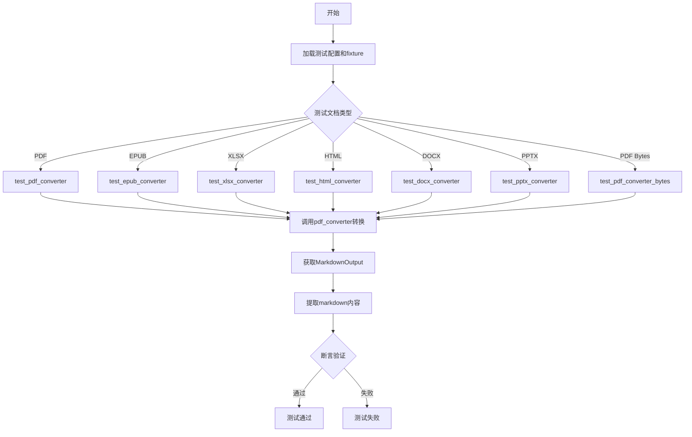
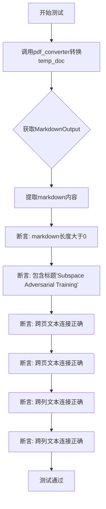
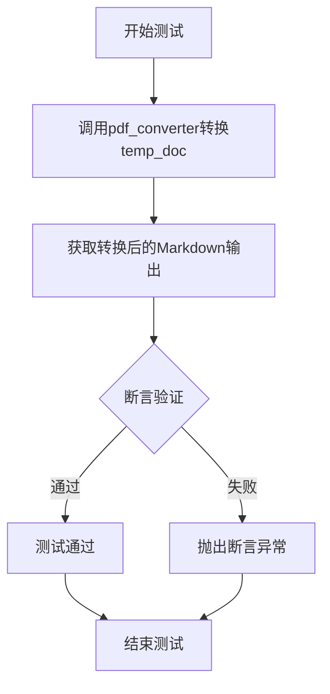
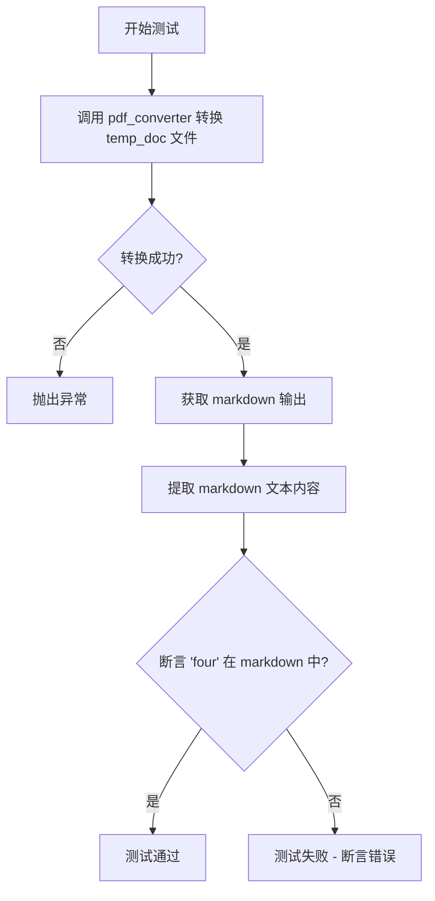
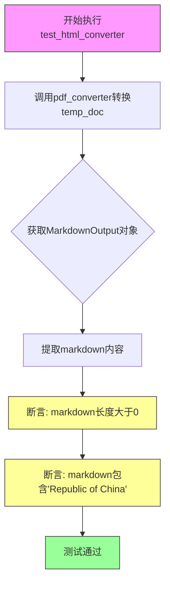
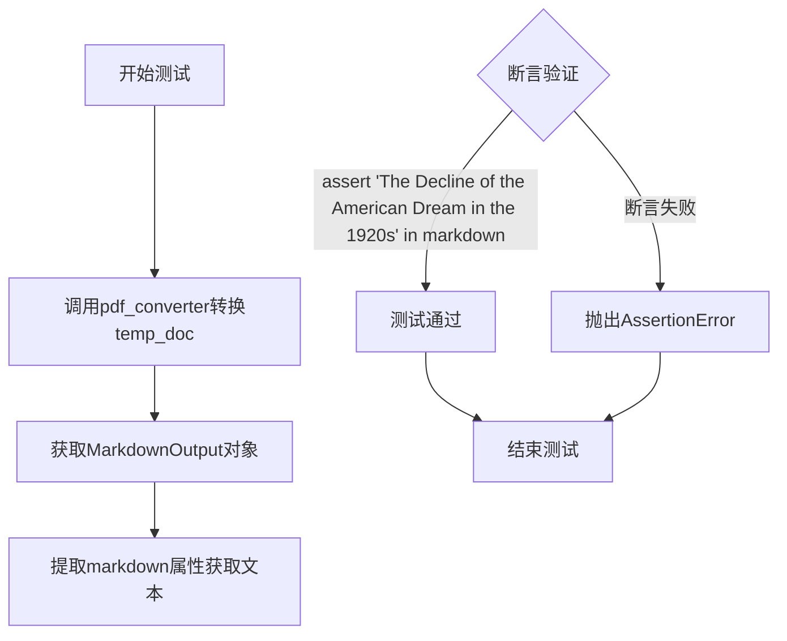
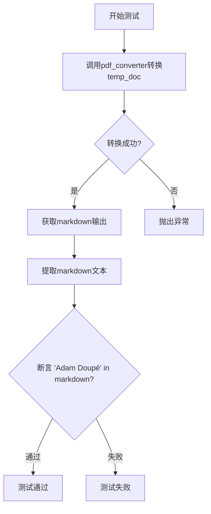
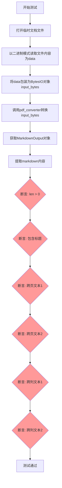
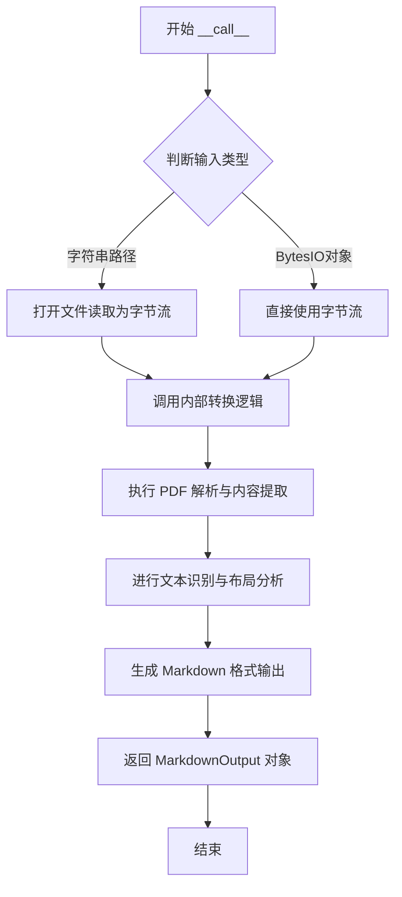

# `marker\tests\converters\test_pdf_converter.py` 详细设计文档

这是一个pytest测试文件，用于测试marker库中的PdfConverter转换器，支持将PDF、EPUB、XLSX、HTML、DOCX、PPTX等多种格式的文档转换为Markdown格式，并验证转换结果的准确性。

## 整体流程



## 类结构

```
测试模块
├── PdfConverter (外部依赖类)
├── MarkdownOutput (外部依赖类)
├── test_pdf_converter
├── test_epub_converter
├── test_xlsx_converter
├── test_html_converter
├── test_docx_converter
├── test_pptx_converter
└── test_pdf_converter_bytes
```

## 全局变量及字段


### `MarkdownOutput.markdown`
    
将PDF等文档转换后得到的Markdown格式文本内容

类型：`str`
    
    

## 全局函数及方法


### `test_pdf_converter`

该测试函数用于验证PDF转换器将PDF文档转换为Markdown格式的正确性，特别关注跨页文本连接和跨列文本的处理能力。

参数：

- `pdf_converter`：`PdfConverter`，PDF转换器实例，负责将PDF文件转换为MarkdownOutput对象
- `temp_doc`：临时文档对象（pytest fixture），提供测试用的PDF文件路径

返回值：`None`，该函数为测试函数，无返回值，通过assert断言验证转换结果

#### 流程图



#### 带注释源码

```python
import io

import pytest
from marker.converters.pdf import PdfConverter
from marker.renderers.markdown import MarkdownOutput


@pytest.mark.output_format("markdown")
@pytest.mark.config({"page_range": [0, 1, 2, 3, 7], "disable_ocr": True})
def test_pdf_converter(pdf_converter: PdfConverter, temp_doc):
    """
    测试PDF转换为Markdown的功能
    
    Args:
        pdf_converter: PdfConverter实例，用于将PDF转换为Markdown
        temp_doc: pytest fixture，提供测试用的临时PDF文档
    
    Returns:
        None (测试函数，通过assert进行验证)
    """
    # 调用转换器，将PDF转换为MarkdownOutput对象
    markdown_output: MarkdownOutput = pdf_converter(temp_doc.name)
    # 从输出对象中提取markdown文本内容
    markdown = markdown_output.markdown

    # 基本断言：验证转换结果非空
    assert len(markdown) > 0
    # 验证文档标题被正确提取
    assert "# Subspace Adversarial Training" in markdown

    # 验证跨页文本连接功能（第1-2页）
    assert (
        "AT solutions. However, these methods highly rely on specifically" in markdown
    )  # pgs: 1-2
    # 验证跨页文本连接功能（第3-4页）
    assert (
        "(with adversarial perturbations), which harms natural accuracy, " in markdown
    )  # pgs: 3-4

    # 验证跨列文本连接功能（第2页）
    assert "remain similar across a wide range of choices." in markdown  # pg: 2
    # 验证跨列文本连接功能（第8页）
    assert "a new scheme for designing more robust and efficient" in markdown  # pg: 8
```


### `test_epub_converter`

该测试函数用于验证 EPUB 格式文件通过 PdfConverter 转换为 Markdown 格式的功能是否正常，通过检查输出内容中是否包含特定字符串"Simple Sabotage Field Manual"来确认转换成功。

参数：

- `pdf_converter`：`PdfConverter`，PDF转换器实例，由测试fixture提供，用于执行文档格式转换
- `temp_doc`：临时文档对象（fixture），提供测试用的EPUB文件路径

返回值：`None`，测试函数无返回值，通过断言验证转换结果

#### 流程图



#### 带注释源码

```python
@pytest.mark.filename("manual.epub")  # 指定测试用的文件名
@pytest.mark.config({"page_range": [0]})  # 配置只转换第0页
def test_epub_converter(pdf_converter: PdfConverter, temp_doc):
    # 使用pdf_converter将temp_doc指定的EPUB文件转换为Markdown格式
    markdown_output: MarkdownOutput = pdf_converter(temp_doc.name)
    # 从输出对象中提取生成的markdown文本
    markdown = markdown_output.markdown

    # 基本断言验证：确认转换后的markdown包含预期内容
    assert "Simple Sabotage Field Manual" in markdown
```


### `test_xlsx_converter`

测试 xlsx（Excel）文件转换为 Markdown 格式的功能，验证转换后的文本内容是否包含预期的字符串 "four"。

参数：

- `pdf_converter`：`PdfConverter`，PDF 转换器实例，用于将各种文档格式转换为 Markdown
- `temp_doc`：临时文档文件对象，表示待转换的 xlsx 文件

返回值：`None`，该函数为测试函数，无显式返回值，通过断言验证功能

#### 流程图



#### 带注释源码

```python
@pytest.mark.filename("single_sheet.xlsx")  # 标记测试使用的文件名
@pytest.mark.config({"page_range": [0]})    # 配置只转换第0页
def test_xlsx_converter(pdf_converter: PdfConverter, temp_doc):
    # 使用 PDF 转换器将 xlsx 文件转换为 Markdown 输出对象
    markdown_output: MarkdownOutput = pdf_converter(temp_doc.name)
    
    # 从输出对象中提取 Markdown 格式的文本内容
    markdown = markdown_output.markdown

    # 基础断言：验证转换后的 Markdown 不为空
    # 并且包含从 xlsx 中提取的关键词 "four"
    assert "four" in markdown
```


### `test_html_converter`

这是一个pytest测试函数，用于验证HTML文件通过`PdfConverter`转换为Markdown的功能，测试文件名为"china.html"，并验证转换后的内容包含"Republic of China"。

参数：

- `pdf_converter`：`PdfConverter`，PDF转换器实例，用于将各种文档格式转换为Markdown
- `temp_doc`：临时文档文件对象，包含待转换的HTML文件路径

返回值：`None`，该函数为测试函数，通过断言验证功能，不返回具体值

#### 流程图



#### 带注释源码

```python
# 使用pytest标记装饰器指定测试文件名
@pytest.mark.filename("china.html")
# 配置测试参数：只处理第10页
@pytest.mark.config({"page_range": [10]})
def test_html_converter(pdf_converter: PdfConverter, temp_doc):
    # 调用pdf_converter的__call__方法，将temp_doc（HTML文件）转换为Markdown
    # temp_doc.name 传入文件路径
    markdown_output: MarkdownOutput = pdf_converter(temp_doc.name)
    
    # 从MarkdownOutput对象中提取转换后的markdown文本
    markdown = markdown_output.markdown

    # 基础断言：验证转换结果非空
    assert len(markdown) > 0
    
    # 核心断言：验证HTML内容"Republic of China"被正确转换到markdown中
    # 这验证了HTML文档解析和内容提取功能的正确性
    assert "Republic of China" in markdown
```


### `test_docx_converter`

该函数是一个 pytest 测试用例，用于验证 DOCX 文件通过 PDF 转换器转换为 Markdown 格式的功能是否正常工作。它使用 fixture 提供的 `PdfConverter` 实例将 DOCX 文件转换为 `MarkdownOutput` 对象，然后通过断言验证转换后的 Markdown 文本中是否包含预期的内容"The Decline of the American Dream in the 1920s"。

参数：

- `pdf_converter`：`PdfConverter`，pytest fixture，提供 PDF 转换器实例，用于将各种文档格式转换为 Markdown
- `temp_doc`：pytest fixture，提供测试用的临时 DOCX 文件对象，包含文件名等属性

返回值：`None`，测试函数无返回值，通过 pytest 断言验证功能正确性

#### 流程图



#### 带注释源码

```python
@pytest.mark.filename("gatsby.docx")  # 指定测试使用的文件名
@pytest.mark.config({"page_range": [0]})  # 配置转换器只处理第0页
def test_docx_converter(pdf_converter: PdfConverter, temp_doc):
    # 使用pdf_converter将temp_doc（DOCX文件）转换为MarkdownOutput对象
    markdown_output: MarkdownOutput = pdf_converter(temp_doc.name)
    
    # 从MarkdownOutput中提取markdown属性获取转换后的文本内容
    markdown = markdown_output.markdown

    # Basic assertions
    # 验证DOCX文件中的标题"The Decline of the American Dream in the 1920s"
    # 是否成功转换为Markdown格式并存在于输出中
    assert "The Decline of the American Dream in the 1920s" in markdown
```


### `test_pptx_converter`

该函数是一个pytest测试用例，用于测试PDF转换器将PPTX（PowerPoint）文件转换为Markdown格式的功能。它通过fixture注入获取PDF转换器实例和临时文档，然后执行转换并验证输出中是否包含特定字符串"Adam Doupé"。

参数：

- `pdf_converter`：`PdfConverter`，由pytest fixture注入的PDF转换器实例，用于执行文档格式转换
- `temp_doc`：临时文档对象（fixture），提供测试用的PPTX文件路径

返回值：`None`，该函数为测试函数，无返回值，通过assert语句进行验证

#### 流程图



#### 带注释源码

```python
@pytest.mark.filename("lambda.pptx")  # 标记测试使用的文件名
@pytest.mark.config({"page_range": [0]})  # 配置只转换第0页
def test_pptx_converter(pdf_converter: PdfConverter, temp_doc):
    """
    测试PDF转换器对PPTX文件的转换能力
    
    Args:
        pdf_converter: PdfConverter实例，由fixture注入
        temp_doc: 临时文档对象，包含PPTX文件路径
    """
    # 调用转换器将PPTX文件转换为Markdown格式
    markdown_output: MarkdownOutput = pdf_converter(temp_doc.name)
    # 从输出对象中提取markdown文本
    markdown = markdown_output.markdown

    # 基本断言：验证转换结果包含预期内容
    assert "Adam Doupé" in markdown
```


### `test_pdf_converter_bytes`

该测试函数验证PDF转换器能够正确处理字节输入（BytesIO格式）并将其转换为Markdown格式，同时检查跨页和跨列的文本连接是否正确。

参数：

- `pdf_converter`：`PdfConverter`，PDF转换器实例，用于将PDF文档转换为Markdown格式
- `temp_doc`：临时文档对象（fixture），提供测试用PDF文件的路径

返回值：`None`，该函数为测试函数，通过断言进行验证，无显式返回值

#### 流程图



#### 带注释源码

```python
import io
import pytest
from marker.converters.pdf import PdfConverter
from marker.renderers.markdown import MarkdownOutput


@pytest.mark.output_format("markdown")
@pytest.mark.config({"page_range": [0, 1, 2, 3, 7], "disable_ocr": True})
def test_pdf_converter_bytes(pdf_converter: PdfConverter, temp_doc):
    """
    测试PDF转换器处理字节输入的能力
    
    参数:
        pdf_converter: PdfConverter实例，用于将PDF转换为Markdown
        temp_doc: 临时文档fixture，提供测试PDF文件路径
    """
    # 打开临时文档文件，以二进制读取模式
    with open(temp_doc.name, "rb") as f:
        data = f.read()

    # 将读取的字节数据包装为BytesIO对象
    # 这是该测试与test_pdf_converter的主要区别：使用字节流而非文件路径
    input_bytes = io.BytesIO(data)
    
    # 调用转换器处理BytesIO输入，获取MarkdownOutput对象
    markdown_output: MarkdownOutput = pdf_converter(input_bytes)
    
    # 从输出对象中提取生成的Markdown文本
    markdown = markdown_output.markdown

    # ===== 基础断言验证 =====
    # 验证转换结果非空
    assert len(markdown) > 0
    
    # 验证文档标题被正确提取
    assert "# Subspace Adversarial Training" in markdown

    # ===== 跨页文本连接验证 =====
    # 验证第1-2页之间的文本连接正确
    assert (
        "AT solutions. However, these methods highly rely on specifically" in markdown
    )  # pgs: 1-2
    
    # 验证第3-4页之间的文本连接正确
    assert (
        "(with adversarial perturbations), which harms natural accuracy, " in markdown
    )  # pgs: 3-4

    # ===== 跨列文本连接验证 =====
    # 验证第2页跨列文本连接
    assert "remain similar across a wide range of choices." in markdown  # pg: 2
    
    # 验证第8页跨列文本连接
    assert "a new scheme for designing more robust and efficient" in markdown  # pg: 8
```


### `PdfConverter.__call__`

将 PDF 文档（通过文件路径或字节流）转换为 Markdown 格式的输出对象。

参数：

- `input_value`：`str` 或 `io.BytesIO`，待转换的 PDF 文件路径或包含 PDF 数据的字节流对象
- `**kwargs`：`Any`，可选的额外关键字参数，用于传递给转换器配置

返回值：`MarkdownOutput`，包含转换后的 Markdown 文本及相关元数据

#### 流程图



#### 带注释源码

*注：以下源码是基于测试代码中的使用方式推断得出的，而非直接源码。PdfConverter 类实际定义在 `marker.converters.pdf` 模块中。*

```python
# 从测试代码中观察到的使用方式推断：
# pdf_converter(temp_doc.name)  # 传入字符串路径
# pdf_converter(input_bytes)   # 传入 BytesIO 对象

# 推断的方法签名和实现逻辑
def __call__(self, input_value: Union[str, io.BytesIO], **kwargs) -> MarkdownOutput:
    """
    将 PDF 文档转换为 Markdown 格式
    
    参数:
        input_value: PDF 文件路径（字符串）或字节流（BytesIO）
        **kwargs: 可选的配置参数，如 page_range, disable_ocr 等
    
    返回:
        MarkdownOutput: 包含 markdown 文本和元数据的输出对象
    """
    
    # 1. 处理输入 - 支持文件路径或字节流
    if isinstance(input_value, str):
        # 如果是字符串路径，打开文件并读取为字节流
        with open(input_value, "rb") as f:
            pdf_bytes = f.read()
        input_stream = io.BytesIO(pdf_bytes)
    else:
        # 如果已经是字节流，直接使用
        input_stream = input_value
    
    # 2. 调用内部转换逻辑（实际实现未知，从测试推断）
    # 可能涉及：PDF解析 -> OCR处理 -> 布局分析 -> 文本提取 -> Markdown渲染
    markdown_output = self._convert_internal(input_stream, **kwargs)
    
    # 3. 返回 MarkdownOutput 对象
    return markdown_output
```

---

### 补充说明

**从测试代码中观察到的关键信息：**

1. **输入格式灵活性**：该方法接受两种输入形式
   - 字符串：代表 PDF 文件的路径
   - `io.BytesIO`：代表 PDF 数据的字节流

2. **配置参数**：通过 `pytest.mark.config` 装饰器传递
   - `page_range`: 指定要转换的页面范围，如 `[0, 1, 2, 3, 7]`
   - `disable_ocr`: 是否禁用 OCR 文字识别

3. **返回值结构**：返回 `MarkdownOutput` 对象
   - 包含 `.markdown` 属性，类型为字符串
   - 包含转换后的 Markdown 格式文本

**设计目标与约束：**
- 支持多种输入格式（文件路径、字节流）
- 支持灵活的页面范围选择
- 支持配置选项如 OCR 开关

**技术债务：**
- 由于未提供 `PdfConverter` 类的直接源码，上述实现细节为基于测试代码的合理推断
- 实际内部转换逻辑（`_convert_internal`）的具体步骤未知

## 关键组件


### 一段话描述

该代码是marker库的集成测试文件，测试了PdfConverter将多种文档格式（PDF、EPUB、XLSX、HTML、DOCX、PPTX）转换为Markdown的功能，验证了跨页文字连接、跨列处理、字节输入支持等核心特性。

### 关键组件信息

### PdfConverter

核心文档转换器类，负责将各种格式的文档（PDF、EPUB、XLSX、HTML、DOCX、PPTX）转换为Markdown格式。支持文件路径和字节流两种输入方式。

### MarkdownOutput

转换输出类，包含转换后的markdown文本内容，通过.markdown属性访问。

### page_range配置

页面范围配置选项，支持指定转换的页面范围（如[0, 1, 2, 3, 7]），用于测试特定页面的转换效果。

### disable_ocr配置

OCR禁用开关配置，当设置为True时禁用光学字符识别功能。

### 跨页文字连接

文档转换的关键特性，能够将跨越多个页面的连续文本内容正确连接在一起。

### 跨列文字连接

文档转换的关键特性，能够处理多栏排版文档中跨越列的文本内容并正确连接。

### 字节输入支持

通过io.BytesIO实现的字节流输入功能，允许直接将字节数据传递给转换器进行转换。

### 多格式测试覆盖

测试用例覆盖了6种不同的文档格式，包括PDF、EPUB、XLSX、HTML、DOCX、PPTX，体现了转换器的多格式支持能力。


## 问题及建议


### 已知问题

-   **测试代码重复**：多个测试函数（如test_pdf_converter和test_pdf_converter_bytes）存在大量重复的断言逻辑和字符串常量，未进行代码复用
-   **硬编码配置和断言**：测试数据（文件名、page_range、断言字符串）全部硬编码，缺乏灵活性和可维护性
-   **缺少错误处理测试**：未覆盖转换失败场景（如损坏文件、无效输入、空文件等）的测试用例
-   **缺少边界条件测试**：未测试超大文件、特殊字符、Unicode编码等边界情况
-   **缺乏文档说明**：测试函数缺少docstring，无法快速理解各测试用例的验证目标
-   **magic number问题**：page_range中的数字（如[0,1,2,3,7]）缺乏语义化说明

### 优化建议

-   **使用pytest参数化**：将重复的断言逻辑提取为通用函数，或使用@pytest.mark.parametrize减少代码冗余
-   **抽取测试数据**：将文件名、配置参数、断言字符串等移至独立的测试数据文件或常量定义
-   **增加负面测试**：添加异常场景测试，如invalid file path、corrupted file、empty input等
-   **补充边界测试**：添加空文档、超大文件、多语言字符（中文、日文、阿拉伯文等）的测试用例
-   **添加文档注释**：为每个测试函数添加docstring，说明测试目的和验证内容
-   **提取公共fixture**：将通用的配置（如output_format="markdown"）提取为共享fixture，减少装饰器重复

## 其它


### 设计目标与约束

本测试套件的设计目标为验证marker库的PdfConverter能够准确将多种文档格式（PDF、EPUB、XLSX、HTML、DOCX、PPTX）转换为Markdown格式。核心约束包括：测试仅验证输出包含特定字符串，未涉及转换质量评分；测试使用固定的页码范围（如page_range: [0, 1, 2, 3, 7]）；所有测试用例均采用markdown输出格式；部分测试禁用了OCR功能以加速测试。

### 错误处理与异常设计

测试代码本身未显式处理异常，依赖pytest框架进行断言验证。潜在异常场景包括：文件路径不存在（temp_doc fixture需正确提供）、不支持的文件格式（仅测试指定格式）、转换超时（大规模PDF处理）、内存不足（大型文件转换）、PDF加密或损坏。MarkdownOutput对象若转换失败应返回空字符串或抛出特定异常，但当前测试未验证错误路径。

### 数据流与状态机

测试数据流为：测试文件（由fixture生成）→ PdfConverter.convert()方法 → MarkdownOutput对象 → 提取markdown属性 → 断言验证。状态机涉及：输入文件加载状态（文件路径或BytesIO流）→ 转换执行状态 → 输出生成状态。测试覆盖两种输入模式：文件路径字符串模式和字节流模式。

### 外部依赖与接口契约

核心依赖包括：marker库（PdfConverter、MarkdownOutput类）、pytest框架、测试夹具（pdf_converter、temp_doc）。PdfConverter接口契约：接受str或BytesIO类型输入，返回MarkdownOutput对象。MarkdownOutput接口契约：包含markdown属性（str类型）、其他元数据属性。temp_doc fixture接口契约：提供name属性（str类型，指向临时文件路径）。

### 配置管理

测试使用@pytest.mark.config装饰器传递配置参数：page_range指定转换页码范围（列表类型）、disable_ocr控制是否禁用OCR（布尔类型）、output_format指定输出格式（字符串类型）。配置通过marker库内部机制传递给PdfConverter。

### 测试覆盖范围

当前测试覆盖6种文档格式转换、跨页文本连接验证（PDF）、跨列文本连接验证（PDF）、字节流输入模式。未覆盖场景包括：转换错误处理、大文件性能、多线程并发、PDF加密、图像提取、表格转换、样式保留度验证、批量转换。

### 性能考量

测试禁用了OCR（disable_ocr: True）以提升性能，仅处理指定页码范围（page_range限制）。未包含性能基准测试或超时设置。实际部署需考虑：大型PDF内存占用、OCR启用后的处理时间、并行转换能力。

### 安全性考虑

测试使用临时文件（temp_doc fixture），不涉及真实敏感文档。潜在安全风险：恶意构造的PDF/EPUB/HTML文件可能导致代码执行漏洞（marker库需负责清理）、测试文件未加密可能泄露测试内容。

### 版本兼容性

测试依赖marker库特定版本API（PdfConverter、MarkdownOutput）。pytest版本需支持标记装饰器（@pytest.mark）。Python版本需支持类型注解（: PdfConverter、: MarkdownOutput）。

### 部署要求

运行测试需要：安装marker库及其依赖（poppler、tesseract等）、安装pytest、准备测试文件（PDF/EPUB/XLSX/HTML/DOCX/PPTX）并放置于测试夹具指定目录、配置环境变量（如MARKER_*配置）。


    