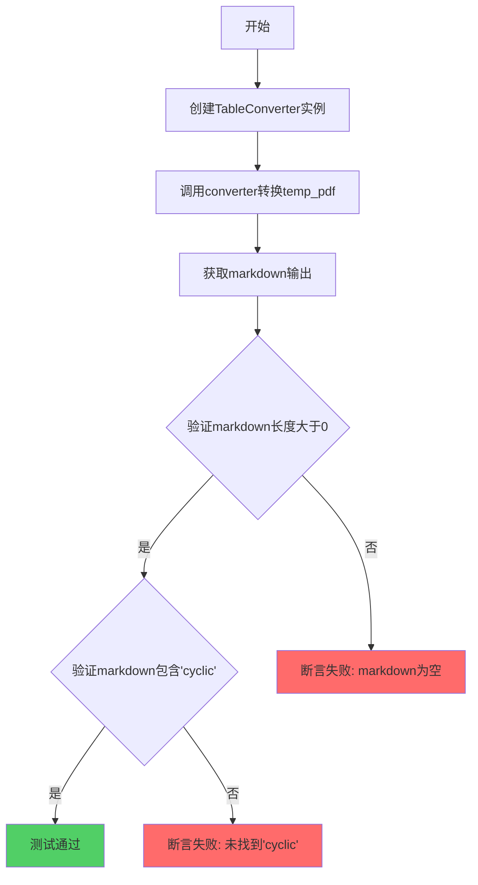
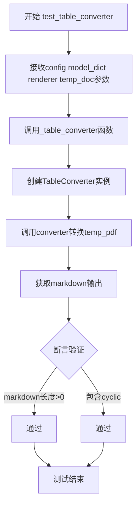
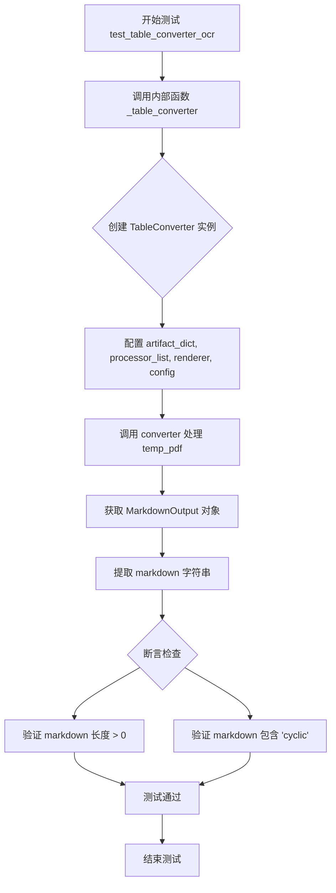

# `marker\tests\converters\test_table_converter.py` 详细设计文档

这是一个marker库的pytest测试文件，用于测试PDF文档中表格到Markdown格式的转换功能，包含基本转换和OCR强制识别两种测试场景。

## 整体流程

```mermaid
graph TD
    A[开始测试] --> B[调用_table_converter函数]
B --> C[创建TableConverter实例]
C --> D[使用converter处理temp_pdf]
D --> E[获取MarkdownOutput输出]
E --> F{测试断言}
F -->|len(markdown) > 0| G[检查markdown非空]
F -->|'cyclic' in markdown| H[检查包含cyclic关键词]
G --> I[测试通过]
H --> I
I --> J[结束]
```

## 类结构

```
测试模块 (无自定义类)
├── _table_converter (内部辅助函数)
├── test_table_converter (基本表格转换测试)
└── test_table_converter_ocr (OCR表格转换测试)
```

## 全局变量及字段


### `pytest`
    
Python测试框架模块

类型：`module`
    


### `TableConverter`
    
PDF表格转换器类，用于将PDF文档中的表格转换为Markdown格式

类型：`class`
    


### `MarkdownOutput`
    
Markdown输出类，包含转换后的Markdown内容和相关元数据

类型：`class`
    


### `classes_to_strings`
    
工具函数，将类对象转换为字符串形式的类名

类型：`function`
    


### `_table_converter`
    
内部测试辅助函数，执行表格转换的核心逻辑并验证输出结果

类型：`function`
    


### `test_table_converter`
    
测试函数，验证TableConverter在标准配置下将PDF第5页表格转换为Markdown的功能

类型：`function`
    


### `test_table_converter_ocr`
    
测试函数，验证TableConverter在启用OCR模式下将PDF第5页表格转换为Markdown的功能

类型：`function`
    


### `config`
    
测试配置参数，包含页面范围等转换设置

类型：`dict`
    


### `model_dict`
    
模型工件字典，包含预训练的表格识别模型数据

类型：`dict`
    


### `renderer`
    
渲染器实例，用于将解析结果渲染为指定格式

类型：`object`
    


### `temp_pdf/temp_doc`
    
临时PDF文件对象，作为转换器的输入文档

类型：`file`
    


    

## 全局函数及方法


### `_table_converter`

该函数是一个测试辅助函数，用于验证表格转换功能。它接收配置、模型字典、渲染器和临时PDF文件作为参数，创建`TableConverter`实例并执行PDF到Markdown的转换，然后通过断言验证转换结果包含预期内容。

参数：

- `config`：配置对象，包含转换配置参数（如页面范围等）
- `model_dict`：字典，模型工件字典，包含预训练模型相关数据
- `renderer`：渲染器对象，用于将OCR结果渲染为指定格式
- `temp_pdf`：临时文件对象，待转换的PDF文件

返回值：无返回值（`None`），该函数通过断言进行验证测试

#### 流程图



#### 带注释源码

```python
def _table_converter(config, model_dict, renderer, temp_pdf):
    """
    测试表格转换功能的辅助函数
    
    参数:
        config: 配置对象，包含转换配置参数
        model_dict: 模型字典，包含预训练模型和相关数据
        renderer: 渲染器对象，用于渲染OCR结果
        temp_pdf: 临时PDF文件对象，待转换的文档
    
    返回:
        无返回值，通过断言验证转换结果
    """
    # 创建TableConverter实例，配置模型和渲染器
    converter = TableConverter(
        artifact_dict=model_dict,       # 模型工件字典
        processor_list=None,             # 处理器列表，None使用默认处理器
        renderer=classes_to_strings([renderer])[0],  # 将渲染器类转换为字符串
        config=config                    # 配置对象
    )

    # 调用converter转换PDF文件，获取Markdown输出
    markdown_output: MarkdownOutput = converter(temp_pdf.name)
    
    # 从输出对象中提取markdown文本
    markdown = markdown_output.markdown

    # 断言验证：转换结果非空
    assert len(markdown) > 0, "转换后的markdown内容不应为空"
    
    # 断言验证：转换结果包含特定关键词'cyclic'
    assert "cyclic" in markdown, "转换后的markdown应包含'cyclic'关键词"
```


### `test_table_converter`

这是一个Pytest测试函数，用于测试Marker库中TableConverter将PDF文档转换为Markdown格式的功能，特别是验证表格转换后包含"cyclic"关键字。

参数：

-  `config`：`pytest fixture`，测试配置对象，包含页面范围等参数
-  `model_dict`：`dict`，模型字典，包含预训练的模型工件
-  `renderer`：`object`，渲染器对象，用于将内容渲染为Markdown格式
-  `temp_doc`：`pytest fixture`，临时PDF文档文件对象

返回值：`None`，该函数为测试函数，无返回值，主要通过断言验证功能

#### 流程图



#### 带注释源码

```python
# 标记该测试使用markdown输出格式
@pytest.mark.output_format("markdown")
# 标记该测试使用的配置：只处理第5页
@pytest.mark.config({"page_range": [5]})
def test_table_converter(config, model_dict, renderer, temp_doc):
    """
    测试TableConverter将PDF转换为Markdown格式的功能
    
    参数:
        config: pytest fixture提供的配置对象
        model_dict: 包含模型工件的字典
        renderer: 渲染器实例
        temp_doc: 临时PDF文档文件
    """
    # 调用内部函数执行实际转换测试
    _table_converter(config, model_dict, renderer, temp_doc)


def _table_converter(config, model_dict, renderer, temp_pdf):
    """
    内部辅助函数，执行表格转换的核心逻辑
    
    参数:
        config: 配置对象
        model_dict: 模型字典
        renderer: 渲染器
        temp_pdf: PDF文件
    """
    # 创建TableConverter转换器实例
    converter = TableConverter(
        artifact_dict=model_dict,      # 模型工件字典
        processor_list=None,           # 处理器列表设为None
        renderer=classes_to_strings([renderer])[0],  # 将渲染器类转换为字符串
        config=config                   # 配置对象
    )

    # 执行PDF到Markdown的转换
    markdown_output: MarkdownOutput = converter(temp_pdf.name)
    # 提取markdown文本
    markdown = markdown_output.markdown

    # 断言：转换结果不为空
    assert len(markdown) > 0
    # 断言：转换结果包含"cyclic"关键字（验证表格内容识别）
    assert "cyclic" in markdown
```


### `test_table_converter_ocr`

这是一个pytest测试函数，用于测试marker库中TableConverter在强制OCR模式下的表格转换功能。该函数通过配置force_ocr=True来验证当启用OCR时，表格转换器能够正确处理PDF文档并输出包含特定内容的Markdown格式结果。

参数：

- `config`：字典（dict），pytest配置对象，包含测试配置参数（如page_range等）
- `model_dict`：字典（dict），模型字典，包含预训练的模型工件（artifact_dict）
- `renderer`：对象（object），渲染器实例，用于将文档渲染为Markdown格式
- `temp_doc`：文件对象（file-like object），临时PDF文档，用于测试表格转换功能

返回值：`无`（None），该函数为测试函数，不返回任何值，主要通过内部的断言语句验证功能正确性

#### 流程图



#### 带注释源码

```python
# 标记该测试的输出格式为markdown
@pytest.mark.output_format("markdown")
# 标记测试配置：只处理第5页，强制启用OCR
@pytest.mark.config({"page_range": [5], "force_ocr": True})
def test_table_converter_ocr(config, model_dict, renderer, temp_doc):
    """
    测试TableConverter在强制OCR模式下的表格转换功能
    
    参数:
        config: 包含测试配置的字典对象
        model_dict: 包含模型工件的字典
        renderer: 渲染器实例
        temp_doc: 临时PDF文档对象
    
    该测试函数通过调用内部辅助函数_table_converter来执行实际的测试逻辑，
    验证当force_ocr=True时，表格转换器能够正确处理PDF并生成包含预期内容的Markdown
    """
    # 调用内部测试辅助函数，传入相同的参数
    _table_converter(config, model_dict, renderer, temp_doc)
```

## 关键组件


### TableConverter

表格转换器核心类，负责将PDF文件转换为Markdown格式，支持表格内容的提取和渲染。

### MarkdownOutput

Markdown输出封装类，包含转换后的markdown文本内容，提供对转换结果的访问接口。

### classes_to_strings

工具函数，将渲染器类列表转换为字符串形式，用于配置转换器的渲染器类型。

### test_table_converter

测试函数，验证表格转换器在标准配置下对PDF第5页的转换能力，检查输出非空且包含"cyclic"关键词。

### test_table_converter_ocr

测试函数，验证表格转换器在强制OCR模式下对PDF第5页的转换能力，用于测试需要OCR辅助的表格识别场景。

### _table_converter

内部辅助函数，封装表格转换的通用逻辑，创建转换器实例、执行转换并验证结果。

### config fixture

测试配置对象，包含转换器配置参数如页面范围、OCR设置等。

### model_dict fixture

模型字典对象，包含表格转换所需的AI模型工件。

### renderer fixture

渲染器对象，指定用于渲染的输出格式（Markdown）。

### temp_doc fixture

临时PDF文档对象，作为转换器的输入文件。


## 问题及建议


### 已知问题

-   **断言过于简单且脆弱**：仅检查 `len(markdown) > 0` 和 `"cyclic" in markdown`，无法验证表格转换的正确性、Markdown 格式是否符合预期、结构是否完整
-   **测试数据强耦合**：依赖 `temp_pdf`/`temp_doc` 文件必须包含 "cyclic" 关键词，否则测试会意外失败，测试数据与测试逻辑耦合度过高
-   **配置硬编码**：`page_range: [5]` 硬编码在测试用例中，降低了测试的可维护性和可配置性
-   **重复代码模式**：两个测试用例结构高度相似，仅 `config` 参数略有不同，可使用 pytest 参数化减少重复
-   **缺乏错误处理**：未对转换过程中可能出现的异常进行处理，失败时错误信息可能不够清晰
-   **类型注解不完整**：参数 `temp_pdf`、`temp_doc`、`model_dict` 等缺少类型注解，影响代码可读性和静态分析
-   **全局函数缺乏文档**：`_table_converter` 函数没有文档字符串说明其用途和预期行为

### 优化建议

-   **增强断言有效性**：添加对表格结构、Markdown 格式、关键内容（如表头、行数等）的具体验证，提高测试覆盖率
-   **提取测试数据 Fixtures**：将测试数据（包含 "cyclic" 的 PDF）封装为独立的 fixture，明确声明其内容和预期输出
-   **使用 `@pytest.mark.parametrize`**：对配置参数进行参数化，避免重复的测试函数定义
-   **添加异常处理**：在 `_table_converter` 中捕获并处理可能的转换异常，提供有意义的错误信息
-   **完善类型注解**：为所有函数参数和返回值添加完整的类型注解，提升代码可维护性
-   **添加文档字符串**：为 `_table_converter` 函数和测试函数添加文档字符串，说明测试目的和预期行为
-   **分离配置与测试逻辑**：将硬编码的配置值提取到 fixture 或配置文件，提高测试的可配置性

## 其它


### 设计目标与约束

该代码旨在验证TableConverter类将PDF文档转换为Markdown格式的功能完整性，确保转换结果包含预期的"cyclic"关键词。测试约束包括：仅处理PDF第5页、强制启用OCR功能（可选）、输出格式必须为Markdown。

### 错误处理与异常设计

测试用例通过pytest的assert语句进行基本的断言验证，未实现显式的异常捕获机制。若TableConverter转换失败或生成空markdown，断言会触发AssertionError。当前设计依赖pytest框架的标准错误报告机制，缺乏自定义异常处理逻辑。

### 数据流与状态机

数据流遵循以下路径：temp_doc(PDF文件) → TableConverter.convert() → MarkdownOutput对象 → 提取markdown属性 → 断言验证。状态机转换包含：初始化 → 转换中 → 输出完成 三个状态，无中间错误状态分支。

### 外部依赖与接口契约

核心依赖包括marker库的TableConverter类、MarkdownOutput类、classes_to_strings工具函数，以及pytest框架。TableConverter需接收artifact_dict、processor_list、renderer和config参数，返回MarkdownOutput对象。config参数支持page_range和force_ocr配置项。

### 性能考虑

当前测试未包含性能基准测试，仅验证功能正确性。建议添加转换耗时监控，确保大文档转换时间在可接受范围内。临时PDF文件的创建和销毁也需要考虑资源清理时效。

### 安全考虑

测试使用临时文件系统存储PDF文件，需确保temp_doc和temp_pdf的路径隔离和访问权限控制。模型字典(model_dict)的传递需验证其完整性和来源可靠性，防止注入恶意 artifact。

### 配置管理

测试配置通过pytest mark实现参数化，包括output_format和config两个维度。config支持字典形式传递page_range和force_ocr参数。当前配置硬编码在测试函数标记中，建议抽取至独立的配置文件以支持多环境切换。

### 测试覆盖范围

测试覆盖了两种场景：基础转换和OCR强制启用场景。覆盖的边界条件包括：单页处理(page_range: [5])、OCR模式切换。缺失覆盖：多页连续范围、多文件批量转换、特殊字符处理、超大文件性能测试。

### 并发与线程安全性

测试按顺序执行，无并发场景。若TableConverter内部使用多线程或异步处理，需确保共享状态（如配置、模型字典）的线程安全性。当前代码未涉及锁或同步机制。

    