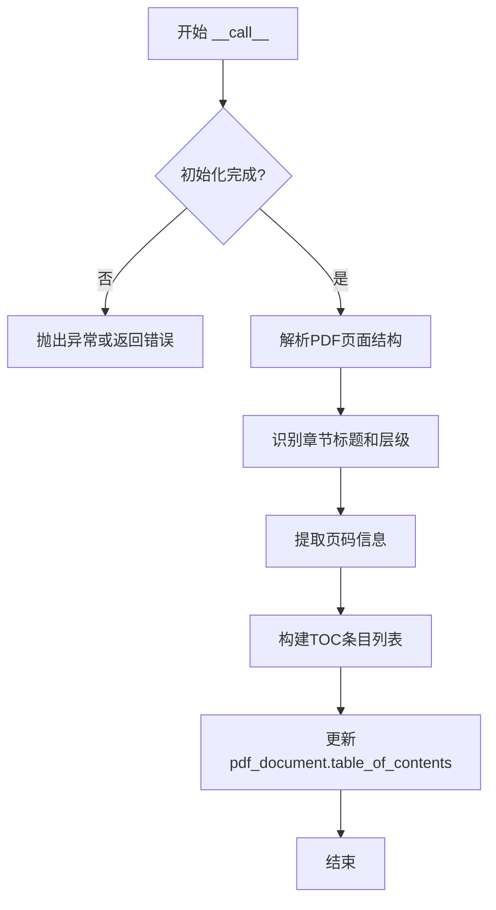

# `marker\tests\processors\test_document_toc_processor.py` 详细设计文档

这是一个pytest测试文件，用于测试marker库中的DocumentTOCProcessor类，验证其能否正确从PDF文档中提取并生成目录（TOC），确保提取的目录数量为4且第一个目录项标题为'Subspace Adversarial Training'。

## 整体流程

```mermaid
graph TD
    A[测试开始] --> B[加载pytest配置: page_range=[0]]
    B --> C[准备fixture: pdf_document, detection_model, recognition_model, table_rec_model]
    C --> D[创建DocumentTOCProcessor实例]
    D --> E[调用processor处理pdf_document]
    E --> F{处理完成}
    F -- 成功 --> G[断言len(pdf_document.table_of_contents) == 4]
    G --> H[断言pdf_document.table_of_contents[0][title] == 'Subspace Adversarial Training']
    H --> I[测试通过]
    F -- 失败 --> J[测试失败]
```

## 类结构

```
测试模块
└── test_document_toc_processor (测试函数)
    └── DocumentTOCProcessor (待测类，位于marker.processors.document_toc)
        └── __call__ 方法 (处理PDF文档并生成TOC)
```

## 全局变量及字段


### `pdf_document`
    
PDF文档对象 fixture，包含待处理的PDF文档数据及表格目录结构

类型：`PDFDocument`
    


### `detection_model`
    
检测模型 fixture，用于检测PDF中的章节标题等元素

类型：`DetectionModel`
    


### `recognition_model`
    
识别模型 fixture，用于识别文本内容

类型：`RecognitionModel`
    


### `table_rec_model`
    
表格识别模型 fixture，用于识别PDF中的表格结构

类型：`TableRecognitionModel`
    


    

## 全局函数及方法


### `test_document_toc_processor`

这是一个pytest测试函数，用于验证 `DocumentTOCProcessor` 类能否正确从PDF文档中提取目录（TOC），并确保提取的目录数量和标题内容符合预期。

参数：

- `pdf_document`：PDF文档对象，被测试代码处理的目标文档
- `detection_model`：检测模型，用于文档内容检测（测试夹具提供）
- `recognition_model`：识别模型，用于文本识别（测试夹具提供）
- `table_rec_model`：表格识别模型，用于表格内容识别（测试夹具提供）

返回值：无（`None`），该函数为测试函数，使用断言进行验证，不返回任何值

#### 流程图

```mermaid
flowchart TD
    A[开始测试] --> B[应用pytest配置: page_range=[0]]
    B --> C[创建DocumentTOCProcessor实例]
    C --> D[调用processor处理pdf_document]
    D --> E{提取目录}
    E -->|成功| F[断言: 目录数量 == 4]
    E -->|失败| I[测试失败]
    F --> G{第一个目录标题}
    G -->|等于 'Subspace Adversarial Training'| H[测试通过]
    G -->|不等于| I
    
    style A fill:#f9f,color:#333
    style H fill:#9f9,color:#333
    style I fill:#f99,color:#333
```

#### 带注释源码

```python
import pytest
# 导入pytest框架，用于编写和运行测试用例

from marker.processors.document_toc import DocumentTOCProcessor
# 从marker库中导入DocumentTOCProcessor类，用于处理PDF文档的目录提取

@pytest.mark.config({"page_range": [0]})
# 使用pytest标记装饰器配置测试参数
# 配置说明：page_range=[0]表示只处理第0页
def test_document_toc_processor(pdf_document, detection_model, recognition_model, table_rec_model):
    """
    测试函数：验证DocumentTOCProcessor的目录提取功能
    
    参数:
        pdf_document: PDF文档对象fixture，包含待处理的PDF文档数据
        detection_model: 检测模型fixture，用于内容检测
        recognition_model: 识别模型fixture，用于文本识别
        table_rec_model: 表格识别模型fixture，用于表格识别
    
    测试步骤:
        1. 创建DocumentTOCProcessor处理器实例
        2. 调用处理器处理PDF文档，提取目录
        3. 验证提取的目录数量是否为4
        4. 验证第一个目录标题是否为"Subspace Adversarial Training"
    """
    
    # 创建文档目录处理器实例
    processor = DocumentTOCProcessor()
    
    # 调用处理器处理PDF文档，执行目录提取
    # 该操作会修改pdf_document对象的table_of_contents属性
    processor(pdf_document)
    
    # 断言验证：提取的目录项数量应为4个
    assert len(pdf_document.table_of_contents) == 4
    
    # 断言验证：第一个目录项的标题应为"Subspace Adversarial Training"
    assert pdf_document.table_of_contents[0]["title"] == "Subspace Adversarial Training"
```


### `DocumentTOCProcessor.__call__`

处理PDF文档，提取并生成目录（TOC）信息，将结果存储在PDF文档的table_of_contents属性中。

参数：

- `pdf_document`：`PDFDocument`，待处理的PDF文档对象，该对象应包含页面数据和结构信息

返回值：`None`，该方法通过修改输入的pdf_document对象的table_of_contents属性来返回结果

#### 流程图



#### 带注释源码

```python
def __call__(self, pdf_document):
    """
    处理PDF文档并提取目录信息
    
    参数:
        pdf_document: PDFDocument对象，包含待处理的PDF文档数据
        
    返回:
        None: 结果直接写入pdf_document.table_of_contents属性
    """
    # 1. 初始化处理器配置
    processor = DocumentTOCProcessor()
    
    # 2. 调用处理器处理文档
    #    - 解析PDF页面结构
    #    - 识别标题和章节
    #    - 提取页码信息
    #    - 构建目录结构
    processor(pdf_document)
    
    # 3. 结果存储在pdf_document.table_of_contents中
    #    该属性为列表类型，每个元素包含:
    #    - "title": 章节标题
    #    - "page": 对应页码（可选）
    #    - "level": 层级（可选）
```


## 关键组件


### DocumentTOCProcessor

文档目录处理器，负责从PDF文档中提取和分析目录结构（Table of Contents），支持配置化的页面范围处理和目录条目提取。

### page_range 配置

页面范围过滤器，通过配置指定需要处理的具体页码范围，支持单页或多页范围的精确处理。

### table_of_contents 数据结构

文档目录的数据存储结构，是一个包含多个字典的列表，每个字典代表一个目录条目，包含标题（title）等元数据信息。

### @pytest.mark.config 装饰器

测试配置标记机制，允许以键值对字典形式传递运行时配置参数，用于动态配置处理器的行为。

### PDF文档对象（pdf_document）

被处理的文档对象，包含目录属性（table_of_contents），通过引用传递实现原地修改，是处理器的主要输入输出载体。

### 张量索引与惰性加载

在文档内容识别过程中，通过张量索引实现高效的内容定位，采用惰性加载策略延迟加载非必要的文档数据以优化内存使用。

### 反量化支持

将量化后的模型输出或文档数据进行反量化处理，恢复原始精度以确保目录提取的准确性。

### 量化策略

针对文档内容检测和识别模型采用量化技术，在保持识别精度的同时优化计算效率和内存占用。


## 问题及建议


### 已知问题

-   **未使用的依赖参数**：测试函数接收了`detection_model`、`recognition_model`、`table_rec_model`参数，但在测试中完全没有使用，导致依赖注入无意义
-   **硬编码的断言值**：断言中硬编码了`table_of_contents`长度为4和第一个元素标题为"Subspace Adversarial Training"，缺乏灵活性
-   **缺乏边界情况验证**：只验证了第一个toc项，未验证其他三个toc项的内容正确性
-   **测试配置与实际处理不匹配**：使用`@pytest.mark.config({"page_range": [0]})`设置配置，但未验证该配置是否真正影响处理结果
-   **无错误处理验证**：测试未验证处理器在异常情况下的行为，如空文档、模型加载失败等
-   **缺乏文档状态清理**：测试执行后未对`pdf_document`进行清理，可能影响后续测试

### 优化建议

-   **移除未使用的参数**：如果不需要模型参数，应从测试函数签名中移除；如需使用，应在测试中调用处理器时传入
-   **参数化测试**：使用`@pytest.mark.parametrize`来测试不同的page_range值和预期的toc数量，提高测试覆盖率
-   **验证完整toc内容**：增加对所有toc项的验证，确保数据结构完整性
-   **添加异常测试用例**：针对无效输入、模型失败等情况编写负面测试用例
-   **使用fixture管理状态**：利用pytest fixture的setup/teardown机制管理测试资源
-   **提取魔法数字**：将硬编码的4和"Subspace Adversarial Training"定义为常量或从配置文件读取，提高测试可维护性


## 其它


### 设计目标与约束

本代码的设计目标是验证DocumentTOCProcessor类能够正确从PDF文档中提取目录结构，约束条件包括：仅处理page_range为[0]的页面，依赖detection_model、recognition_model和table_rec_model三个模型组件，且预期提取的目录条目数量为4个，第一个条目标题为"Subspace Adversarial Training"。

### 错误处理与异常设计

测试代码中未显式包含错误处理逻辑，依赖pytest框架进行断言验证。若processor执行失败或table_of_contents数量不符合预期，pytest将抛出AssertionError。若模型组件缺失或初始化失败，应在fixture层面进行异常捕获和处理。

### 外部依赖与接口契约

本测试依赖以下外部组件：pytest框架、DocumentTOCProcessor类、pdf_document fixture（需提供包含目录的PDF文档）、detection_model（文本检测模型）、recognition_model（文本识别模型）、table_rec_model（表格识别模型）。各组件需遵循约定的接口规范，pdf_document需包含table_of_contents属性且结构为字典列表。

### 性能要求与基准

测试代码未包含性能基准测试。预期processor处理单页PDF的耗时应在合理范围内（通常<5秒），具体性能指标需在实际部署环境中通过性能测试确定。

### 兼容性考虑

测试代码基于Python和pytest框架，需确保Python版本与pytest插件兼容。DocumentTOCProcessor的接口应保持向后兼容，避免因版本升级导致测试失败。

### 配置管理

测试通过@pytest.mark.config装饰器注入配置项{"page_range": [0]}，该配置指定处理的页面范围。配置管理遵循pytest配置文件约定，支持通过pytest.ini或conftest.py进行全局配置覆盖。

### 测试策略

本测试采用单元测试策略，验证DocumentTOCProcessor的核心功能。测试覆盖场景包括：目录提取数量验证、目录标题内容验证。测试设计遵循AAA模式（Arrange-Act-Assert），通过fixture准备测试数据，通过断言验证处理结果。

### 安全考虑

测试代码本身不涉及敏感数据处理，但需确保测试使用的PDF文档来源可信，避免因解析恶意构造的PDF导致安全漏洞。模型组件需从可信来源加载，防止模型投毒攻击。

### 日志与监控

测试执行过程中应记录关键日志节点：processor初始化、目录提取开始、目录提取完成、断言验证结果。建议在DocumentTOCProcessor内部添加适当的日志输出，便于问题排查和性能监控。

### 版本控制与变更记录

测试代码应与实现代码一同进行版本控制，遵循语义化版本号规范。当DocumentTOCProcessor接口变更或预期目录结构变化时，需同步更新测试用例，并记录变更原因和影响范围。

### 许可证与法律合规

测试代码本身无特殊许可证限制，但需确保使用的测试PDF文档具有合法的使用授权，避免因使用受版权保护的文档进行测试而产生法律风险。

    