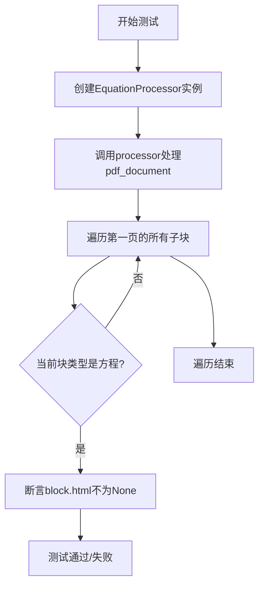
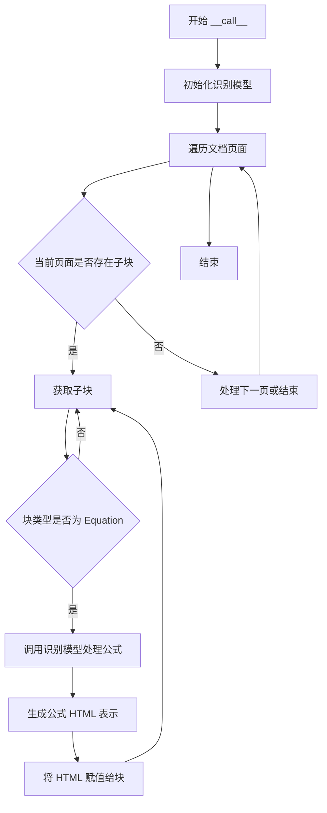

# `marker\tests\processors\test_equation_processor.py` 详细设计文档

这是一个pytest测试文件，用于验证EquationProcessor方程处理器能否正确识别并处理PDF文档中的方程块，确保方程块包含有效的HTML表示。

## 整体流程



## 类结构

```
BlockTypes (枚举类)
└── Equation (方程块类型)

EquationProcessor (方程处理器类)
└── __call__ (处理文档的主方法)
```

## 全局变量及字段


### `pdf_document`
    
PDF文档对象 fixture，提供待处理的PDF文档内容

类型：`PDFDocument`
    


### `recognition_model`
    
识别模型 fixture，用于执行OCR和内容识别任务

类型：`RecognitionModel`
    


### `block`
    
循环变量，表示PDF文档中的单个块元素

类型：`Block`
    


### `BlockTypes.Equation`
    
枚举值，表示块类型为方程块

类型：`BlockType`
    


### `EquationProcessor.recognition_model`
    
识别模型实例，用于处理方程识别任务

类型：`RecognitionModel`
    


### `BlockTypes.Equation`
    
枚举字段，表示方程类型的块

类型：`BlockType`
    
    

## 全局函数及方法


### `test_equation_processor`

该函数是一个pytest测试用例，用于验证`EquationProcessor`类能否正确处理PDF文档中的公式块，并确保公式块的HTML属性被正确填充。

参数：

- `pdf_document`：fixture，提供待处理的PDF文档对象
- `recognition_model`：fixture，提供用于公式识别的模型对象

返回值：`None`，该函数为测试函数，无返回值，通过断言验证处理结果

#### 流程图

```mermaid
flowchart TD
    A[开始测试] --> B[创建EquationProcessor实例]
    B --> C[调用processor处理pdf_document]
    C --> D[遍历pdf_document.pages[0].children]
    D --> E{当前块是否为公式类型?}
    E -->|是| F[断言block.html不为None]
    E -->|否| G[继续下一块]
    F --> G
    G --> H{是否还有更多块?}
    H -->|是| D
    H -->|否| I[测试结束]
```

#### 带注释源码

```python
# 标记测试配置，仅处理第0页
@pytest.mark.config({"page_range": [0]})
def test_equation_processor(pdf_document, recognition_model):
    # 使用recognition_model创建EquationProcessor实例
    processor = EquationProcessor(recognition_model)
    # 调用processor处理PDF文档，提取公式块
    processor(pdf_document)

    # 遍历第一页的所有子块
    for block in pdf_document.pages[0].children:
        # 检查当前块是否为公式类型
        if block.block_type == BlockTypes.Equation:
            # 断言公式块的HTML属性已被正确填充
            assert block.html is not None
```


### `EquationProcessor.__call__`

处理 PDF 文档中的公式块，识别并转换公式内容为 HTML 表示。

参数：

- `pdf_document`：`PDFDocument`，需要处理的 PDF 文档对象，包含页面和块结构

返回值：`None`，该方法直接修改传入的 pdf_document 对象，不返回任何值

#### 流程图



#### 带注释源码

```python
def __call__(self, pdf_document):
    """
    处理 PDF 文档中的公式块
    
    Args:
        pdf_document: PDFDocument 对象，包含待处理的文档内容
        
    Returns:
        None，直接修改 pdf_document 对象的内部状态
    """
    # 遍历文档的所有页面
    for page in pdf_document.pages:
        # 遍历页面中的所有子块
        for block in page.children:
            # 检查块类型是否为公式
            if block.block_type == BlockTypes.Equation:
                # 使用识别模型处理公式内容
                equation_html = self.recognition_model(block)
                # 将识别结果赋值给块的 HTML 属性
                block.html = equation_html
```

#### 备注

从提供的测试代码可以推断出 EquationProcessor 类的以下特征：

1. **构造函数**：接收 `recognition_model` 参数，用于识别公式
2. **调用方法**：`__call__` 方法接收 `pdf_document` 参数
3. **处理逻辑**：遍历文档中的所有块，识别 BlockTypes.Equation 类型的块
4. **输出**：将识别的公式转换为 HTML 并赋值给块的 html 属性

**注意**：由于未提供 EquationProcessor 类的完整实现，上述源码和流程图基于测试代码的行为推测得出。


## 关键组件


### EquationProcessor

方程处理器，负责识别和处理PDF文档中的数学方程块，将识别模型生成的方程内容转换为HTML表示。

### BlockTypes.Equation

方程块类型枚举值，用于标识PDF文档中特定类型的块为数学方程，便于在文档解析时筛选和分类方程内容。

### recognition_model

识别模型，注入的依赖对象，提供OCR和布局分析能力，用于识别PDF页面中的方程元素。

### pdf_document

PDF文档对象，包含待处理的页面数据，方程处理器会修改其内部结构，添加识别后的方程HTML表示。


## 问题及建议


### 已知问题

-   测试范围有限：仅测试 page_range=[0]，未覆盖多页文档场景
-   断言验证不足：仅检查 `block.html is not None`，未验证公式内容的正确性、格式或质量
-   缺少边界条件测试：未测试空文档、无公式页面、公式解析失败等异常场景
-   测试依赖外部状态：依赖 `pdf_document` 和 `recognition_model` fixture，可能存在测试间相互影响的风险
-   缺少测试隔离：未在测试前验证或测试后清理文档状态
-   缺少参数化测试：未测试不同的配置选项组合
-   文档缺失：测试函数缺少 docstring 说明测试目的和预期行为
-   缺少 mock 对象：未对依赖组件进行隔离测试

### 优化建议

-   增加参数化测试，覆盖多页文档、不同配置选项
-   完善断言，验证公式 HTML 内容的有效性（如非空字符串、特定标签结构）
-   添加边界条件测试用例，包括空页面、多公式、无公式等情况
-   为关键测试函数添加详细的 docstring
-   考虑使用 mock 隔离外部依赖，提高测试的确定性和执行速度
-   在 fixture 中实现测试数据的清理或使用独立的测试实例
-   添加异常场景测试，验证 EquationProcessor 在解析失败时的错误处理机制
-   考虑添加性能测试，验证大规模文档处理的效率


## 其它


### 设计目标与约束

本测试文件旨在验证 EquationProcessor 能够正确识别 PDF 文档中的公式/方程块，并确保这些块生成了有效的 HTML 表示。测试约束包括：仅测试第 0 页（首页），仅验证 BlockTypes.Equation 类型的块，不验证方程的数学正确性，仅检查 HTML 字段是否存在且非空。

### 错误处理与异常设计

测试中未显式处理异常，但依赖 pytest 框架的断言机制。当 equation 块的 html 字段为 None 时，assert 语句会抛出 AssertionError，导致测试失败。可能的异常情况包括：模型未正确加载、PDF 文档为空、页面无方程块等。测试设计假设 recognition_model 和 pdf_document fixture 始终提供有效对象。

### 数据流与状态机

测试数据流如下：
1. 初始化阶段：创建 EquationProcessor 实例，传入 recognition_model
2. 处理阶段：调用 processor(pdf_document)，触发 PDF 文档的方程识别流程
3. 验证阶段：遍历 pdf_document.pages[0].children，筛选 BlockTypes.Equation 类型的块
4. 断言阶段：验证每个方程块的 html 属性非空

无复杂状态机，仅为线性处理流程。

### 外部依赖与接口契约

测试依赖以下外部组件：
- pytest：测试框架
- recognition_model：识别模型 fixture，负责方程识别
- pdf_document：PDF 文档 fixture，提供待处理的文档对象
- EquationProcessor：方程处理器类，处理方程识别逻辑
- BlockTypes：枚举类型，定义文档块的类型常量

接口契约：
- EquationProcessor(recognition_model)：构造函数接收识别模型
- processor(pdf_document)：调用运算符，处理文档并填充方程块信息
- block.block_type：返回块的类型标识
- block.html：返回块对应的 HTML 字符串

### 测试覆盖范围与边界条件

当前测试覆盖基本功能路径，边界条件包括：单页文档、无方程块的文档、多方程块情况。测试未覆盖的边界条件：跨页方程、多列布局中的方程、包含特殊数学符号的方程、方程识别失败场景。

### 性能考量

测试未包含性能指标验证。潜在性能关注点：方程识别模型的处理速度、大页面文档的处理时间、内存占用情况。测试使用 page_range=[0] 限制处理范围，体现了对测试执行效率的考虑。

### 集成测试与单元测试定位

此测试文件属于集成测试范畴，验证 EquationProcessor 与 recognition_model、pdf_document 之间的协作是否正常。测试不关注 EquationProcessor 内部实现细节，而是验证端到端的功能正确性。

### 可维护性与扩展性

测试结构清晰，易于扩展。可添加的扩展包括：测试不同 page_range 值、验证方程的 LaTeX 输出、测试多种 PDF 文档格式、添加性能基准测试。当前测试依赖硬编码的页面索引 0，可考虑参数化测试以提高覆盖率。

    