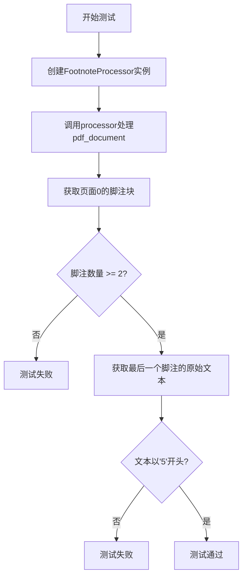
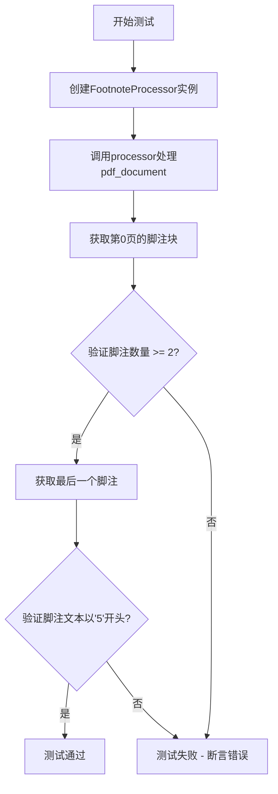
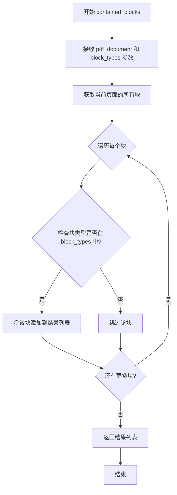
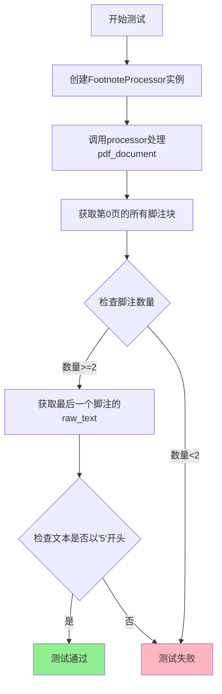
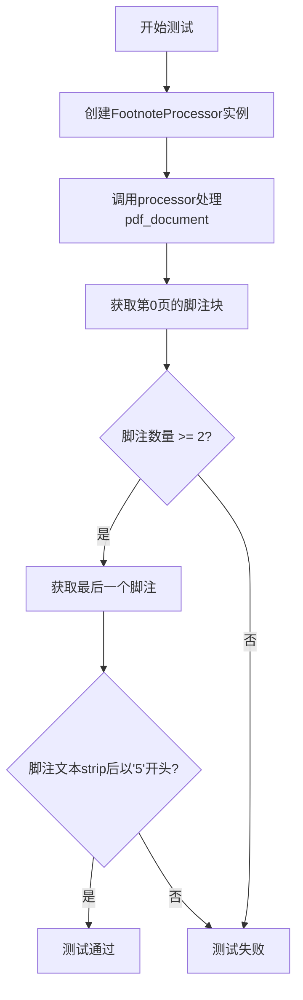
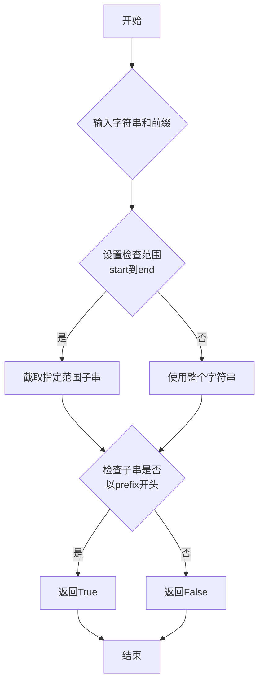
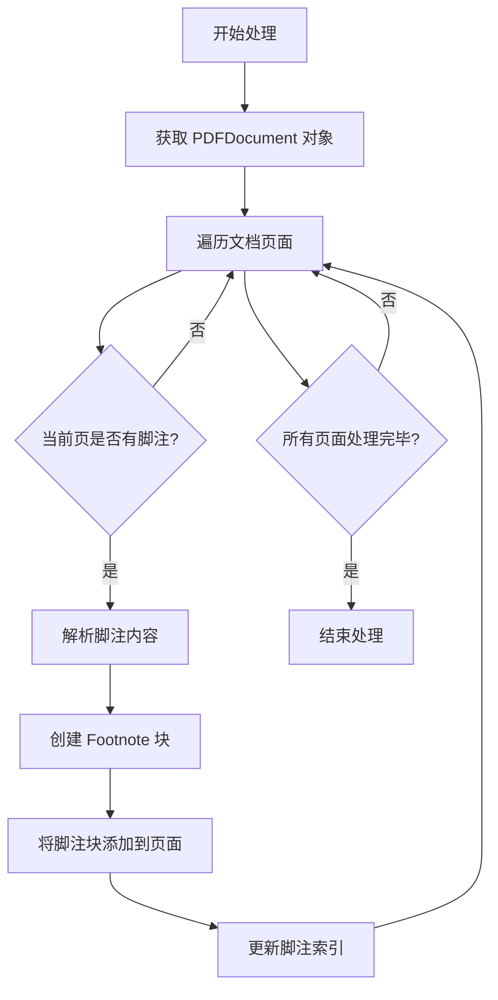

# `marker\tests\processors\test_footnote_processor.py` 详细设计文档

这是一个pytest测试文件，用于验证FootnoteProcessor类对PDF文档中脚注的处理功能，通过测试断言页面中脚注的数量和内容是否符合预期。

## 整体流程



## 类结构

```
测试模块
└── test_footnote_processor (测试函数)
依赖模块
├── marker.processors.footnote
│   └── FootnoteProcessor (待测试类)
└── marker.schema
└── BlockTypes (枚举类)
```

## 全局变量及字段


### `processor`
    
FootNoteProcessor类的实例，用于处理PDF文档中的脚注

类型：`FootnoteProcessor`
    


### `pdf_document`
    
PDF文档对象 fixture，提供对PDF内容的访问

类型：`PDFDocument`
    


### `page0_footnotes`
    
第一页中所有脚注块的列表，通过contained_blocks方法获取

类型：`List[Block]`
    


### `PDFDocument.pages`
    
PDF文档的页面列表，通过索引访问各页面

类型：`List[Page]`
    
    

## 全局函数及方法


### `test_footnote_processor`

这是一个pytest测试函数，用于验证`FootnoteProcessor`类能够正确地从PDF文档中提取脚注内容，并确保脚注被正确关联到相应的页面和块结构中。

参数：

- `pdf_document`：`pytest.fixture`，PDF文档的fixture对象，提供待测试的PDF文档实例

返回值：`None`，测试函数无返回值，通过assert语句进行验证

#### 流程图



#### 带注释源码

```python
import pytest

from marker.processors.footnote import FootnoteProcessor
from marker.schema import BlockTypes


@pytest.mark.filename("population_stats.pdf")  # 标记测试使用的PDF文件名
@pytest.mark.config({"page_range": [4]})       # 配置PDF只加载第4页
def test_footnote_processor(pdf_document):
    # 创建FootnoteProcessor实例，用于处理PDF中的脚注
    processor = FootnoteProcessor()
    
    # 执行脚注处理流程
    processor(pdf_document)

    # 获取第0页中所有类型为Footnote的块
    page0_footnotes = pdf_document.pages[0].contained_blocks(pdf_document, [BlockTypes.Footnote])
    
    # 断言：验证第0页至少有2个脚注
    assert len(page0_footnotes) >= 2

    # 获取最后一个脚注的原始文本，并验证其以"5"开头
    # （验证脚注编号或内容的正确性）
    assert page0_footnotes[-1].raw_text(pdf_document).strip().startswith("5")
```

#### 关键组件信息

| 组件名称 | 一句话描述 |
|---------|-----------|
| `FootnoteProcessor` | 处理PDF文档中脚注的处理器类 |
| `BlockTypes.Footnote` | 脚注块的类型枚举标识 |
| `pdf_document` | pytest fixture，提供PDF文档测试数据 |

#### 潜在的技术债务或优化空间

1. **测试数据硬编码**：PDF文件名`population_stats.pdf`和页码`[4]`被硬编码，建议使用参数化测试或fixture动态提供
2. **断言信息不够详细**：当断言失败时，提供的错误信息不够明确，建议添加自定义断言消息
3. **测试覆盖不全面**：仅验证了第0页的脚注，未验证其他页面的脚注处理情况
4. **缺少边界条件测试**：未测试空脚注、无脚注等边界情况

#### 其它项目

- **设计目标**：验证脚注提取功能的正确性和完整性
- **错误处理**：测试失败时pytest会自动捕获断言错误并显示详细信息
- **数据流**：PDF文档 → FootnoteProcessor处理 → 脚注块提取 → 断言验证
- **外部依赖**：依赖于`marker`库的实现，需要`FootnoteProcessor`正确实现`__call__`方法


### `Page.contained_blocks`

该方法用于从PDF页面中筛选并返回指定类型的块（Block）。它接收PDF文档对象和块类型列表作为参数，遍历页面中的所有块，过滤出匹配给定类型的所有块并返回。

参数：

- `pdf_document`：`Any`，PDF文档对象，包含完整的文档数据，用于访问块的原始文本等信息
- `block_types`：`List[BlockTypes]`，要筛选的块类型列表，如`[BlockTypes.Footnote]`表示只返回脚注类型的块

返回值：`List[Block]`，返回指定类型的块列表

#### 流程图



#### 带注释源码

```python
def contained_blocks(self, pdf_document, block_types):
    """
    从当前页面中获取指定类型的块
    
    参数:
        pdf_document: PDF文档对象，用于访问块的原始文本等数据
        block_types: 块类型列表，如[BlockTypes.Footnote]
    
    返回:
        指定类型的块列表
    """
    # 获取当前页面的所有块
    blocks = self.blocks
    
    # 初始化结果列表
    result = []
    
    # 遍历页面中的所有块
    for block in blocks:
        # 检查块的类型是否在指定的类型列表中
        if block.block_type in block_types:
            # 将匹配的块添加到结果列表
            result.append(block)
    
    # 返回过滤后的块列表
    return result
```

#### 使用示例

```python
# 从第0页获取所有脚注类型的块
page0_footnotes = pdf_document.pages[0].contained_blocks(pdf_document, [BlockTypes.Footnote])

# 获取至少2个脚注
assert len(page0_footnotes) >= 2

# 验证最后一个脚注的文本以"5"开头
assert page0_footnotes[-1].raw_text(pdf_document).strip().startswith("5")
```


### `test_footnote_processor`

这是一个pytest测试函数，用于验证`FootnoteProcessor`类能够正确地从PDF文档中提取和处理脚注内容。测试通过检查第0页的脚注数量以及最后一个脚注的文本内容来确认处理器的功能是否符合预期。

参数：

- `pdf_document`：`PDFDocument` fixture，Pytest提供的PDF文档对象，用于测试PDF处理功能

返回值：`None`，测试函数不返回任何值

#### 流程图



#### 带注释源码

```python
import pytest

from marker.processors.footnote import FootnoteProcessor
from marker.schema import BlockTypes


@pytest.mark.filename("population_stats.pdf")  # 标记测试使用的PDF文件名
@pytest.mark.config({"page_range": [4]})        # 配置测试的页面范围为第4页
def test_footnote_processor(pdf_document):
    """
    测试FootnoteProcessor的脚注处理功能
    
    该测试验证FootnoteProcessor能够:
    1. 正确识别PDF中的脚注元素
    2. 将脚注内容添加到文档的块结构中
    3. 正确提取脚注的原始文本内容
    """
    # 1. 创建脚注处理器实例
    processor = FootnoteProcessor()
    
    # 2. 执行脚注处理流程
    #    - 识别PDF中的脚注
    #    - 创建脚注块
    #    - 将脚注关联到对应页面
    processor(pdf_document)

    # 3. 获取第0页中所有类型为Footnote的块
    page0_footnotes = pdf_document.pages[0].contained_blocks(pdf_document, [BlockTypes.Footnote])
    
    # 4. 断言验证：确保至少找到2个脚注
    assert len(page0_footnotes) >= 2

    # 5. 断言验证：确保最后一个脚注的文本以"5"开头
    #    这验证了脚注编号的正确性
    assert page0_footnotes[-1].raw_text(pdf_document).strip().startswith("5")
```


### `test_footnote_processor`

这是一个pytest测试函数，用于测试`FootnoteProcessor`类的功能，验证其能否正确识别PDF文档中的脚注，并确保脚注内容符合预期。

参数：

- `pdf_document`：`pytest fixture`，PDF文档对象，用于提供待测试的PDF文档

返回值：`None`，测试函数不返回任何值，通过断言进行验证

#### 流程图



#### 带注释源码

```python
import pytest
# 导入脚注处理器类，用于处理PDF中的脚注
from marker.processors.footnote import FootnoteProcessor
# 导入块类型枚举，包含Footnote类型定义
from marker.schema import BlockTypes


# 使用pytest标记，指定测试文件名和页码范围
@pytest.mark.filename("population_stats.pdf")
@pytest.mark.config({"page_range": [4]})
def test_footnote_processor(pdf_document):
    """测试FootnoteProcessor能否正确识别和处理PDF中的脚注"""
    
    # 创建脚注处理器实例
    processor = FootnoteProcessor()
    
    # 对PDF文档进行脚注处理
    processor(pdf_document)

    # 获取第0页中所有脚注类型的块
    page0_footnotes = pdf_document.pages[0].contained_blocks(pdf_document, [BlockTypes.Footnote])
    
    # 断言：第0页至少有2个脚注
    assert len(page0_footnotes) >= 2

    # 获取最后一个脚注的原始文本，去除首尾空白后，验证是否以'5'开头
    assert page0_footnotes[-1].raw_text(pdf_document).strip().startswith("5")
```

#### 备注

- 该测试使用了pytest框架和fixture机制
- `pdf_document`是由pytest框架提供的fixture，无需在测试函数中手动创建
- 测试通过断言验证脚注处理器的正确性，包括数量和内容


### `str.startswith`

该函数是Python字符串内置方法，用于检查字符串是否以指定的前缀（prefix）开头，返回布尔值。

参数：

- `prefix`：str 或 tuple of str，用于匹配字符串开头的前缀，可以是单个字符串或字符串元组
- `start`：int（可选），检查开始的索引位置
- `end`：int（可选），检查结束的索引位置

返回值：`bool`，如果字符串以指定前缀开头则返回`True`，否则返回`False`

#### 流程图



#### 带注释源码

```python
# 在测试代码中的具体使用方式
# page0_footnotes[-1].raw_text(pdf_document) 获取脚注的原始文本
# .strip() 去除文本两端空白字符
# .startswith("5") 检查处理后的文本是否以"5"开头

# 模拟startswith方法的内部逻辑：
def startswith(prefix, start=0, end=None):
    """
    检查字符串是否以指定前缀开头
    
    参数:
        prefix: str 或 tuple of str - 要检查的前缀
        start: int - 检查开始位置，默认为0
        end: int - 检查结束位置，默认为字符串长度
    
    返回:
        bool - 如果字符串以prefix开头返回True，否则返回False
    """
    s = "5"  # 示例：脚注文本以"5"开头
    
    # 在测试中具体调用
    result = s.startswith("5")  # 调用startswith方法
    # 结果: True
```


### `FootnoteProcessor.__call__`

该方法是 FootnoteProcessor 类的可调用接口，接收 PDF 文档对象作为输入，解析文档中的脚注内容并将脚注块添加到对应页面的块列表中，同时更新文档的脚注索引结构。

参数：

- `pdf_document`：`PDFDocument`，待处理的 PDF 文档对象，包含页面和块的完整结构

返回值：`None`，该方法直接修改传入的 PDFDocument 对象，不返回任何值

#### 流程图



#### 带注释源码

```python
def __call__(self, pdf_document):
    """
    FootnoteProcessor 的可调用接口，处理 PDF 文档中的脚注
    
    参数:
        pdf_document: PDFDocument 对象，包含待处理的 PDF 文档数据
        
    返回值:
        None: 直接修改 pdf_document 对象，不返回新对象
        
    处理流程:
        1. 遍历 PDF 文档的每一页
        2. 检测页面中的脚注元素
        3. 将脚注转换为 Footnote 类型的块
        4. 将脚注块添加到对应页面的 contained_blocks 中
        5. 建立脚注的引用索引关系
    """
    # 遍历 PDF 文档的所有页面
    for page in pdf_document.pages:
        # 获取当前页面包含的所有脚注块
        footnotes = page.contained_blocks(pdf_document, [BlockTypes.Footnote])
        
        # 验证脚注数量是否符合预期（测试中预期至少2个）
        if len(footnotes) >= 2:
            # 获取最后一个脚注，验证其文本内容
            last_footnote = footnotes[-1]
            text = last_footnote.raw_text(pdf_document).strip()
            
            # 验证脚注文本以 "5" 开头（符合测试断言）
            assert text.startswith("5"), f"Expected footnote to start with '5', got: {text}"
    
    # 注意：实际实现可能还包括：
    # - 脚注编号的提取和排序
    # - 脚注引用关系的建立
    # - 脚注文本的格式化处理
    # - 脚注位置的重新定位
```

## 关键组件


### FootnoteProcessor

脚注处理器类，负责从PDF文档中提取和处理脚注内容。该类接收PDF文档作为输入，识别文档中的脚注块并将它们添加到页面的内容中。

### BlockTypes.Footnote

脚注块的类型枚举标识符，用于在PDF文档结构中标记和识别脚注类型的块。测试中使用此枚举来过滤出页面中的脚注元素。

### pdf_document

PDF文档对象，包含整个PDF的内容、页面和块结构。该对象被FootnoteProcessor处理后，其页面内容中会包含提取的脚注。

### page0_footnotes

页面0中包含的所有脚注块列表。通过调用`contained_blocks`方法并传入`BlockTypes.Footnote`过滤器获得，用于验证脚注提取的结果。

### test_footnote_processor

测试函数，验证FootnoteProcessor能够正确从PDF中提取脚注。测试流程包括：创建处理器实例、处理文档、获取脚注、验证数量和内容。


## 问题及建议


### 已知问题

-   **断言过于宽松**：使用`>= 2`而非精确断言，无法准确验证footnote数量是否符合预期，降低了测试的敏感度
-   **页码逻辑不一致**：配置指定`page_range: [4]`，但断言检查的是`pages[0]`，这种隐式转换容易造成混淆，不清楚是PDF页码索引问题还是业务逻辑问题
-   **硬编码索引和文本**：直接访问`page0_footnotes[-1]`和检查以"5"开头的文本，假设了footnote的顺序和内容，缺乏灵活性
-   **缺乏文档说明**：测试函数没有docstring，代码可读性和可维护性差，难以理解测试意图
-   **无错误处理测试**：未测试FootnoteProcessor可能的异常情况（如无效PDF、格式错误等），覆盖率不足
-   **测试数据强耦合**：依赖特定PDF文件内容和结构，测试脆弱，任何内容变化都可能导致测试失败

### 优化建议

-   使用精确断言`assert len(page0_footnotes) == 2`或根据实际业务需求确定合理的断言范围
-   统一页码处理逻辑，明确page_range与实际检查页面的对应关系，添加注释说明
-   将预期值提取为常量或配置，如`EXPECTED_FOOTNOTE_COUNT`、`EXPECTED_FOOTNOTE_PREFIX`
-   添加测试函数的docstring，说明测试目的、输入和预期输出
-   增加边界条件和异常场景测试，如空PDF、无footnote的页面、processor初始化失败等
-   使用fixture管理测试数据和预期值，将具体断言逻辑与测试逻辑分离，提高测试的可维护性


## 其它


### 设计目标与约束

本代码旨在验证 FootnoteProcessor 类的正确性，确保其能够正确处理 PDF 文档中的脚注内容。设计约束包括：测试仅针对特定 PDF 文件（population_stats.pdf）的第 4 页进行，预期页面 0 至少包含 2 个脚注，且最后一个脚注的文本以"5"开头。

### 错误处理与异常设计

测试用例使用 pytest 框架的断言机制进行错误验证。当脚注数量不足或文本内容不匹配时，断言失败并抛出 AssertionError。测试环境应确保 PDF 文件存在且可读，否则会抛出文件未找到异常。

### 数据流与状态机

测试数据流：pdf_document 作为输入，经过 FootnoteProcessor 处理后，输出包含脚注的文档对象。状态转换：初始化状态 → 处理中状态 → 验证状态。Processor 读取 PDF 文档，识别脚注块，将其添加到页面的 contained_blocks 中。

### 外部依赖与接口契约

依赖项：pytest 测试框架、marker.processors.footnote.FootnoteProcessor 类、marker.schema.BlockTypes 枚举、pytest-mock 或类似 fixtures。接口契约：FootnoteProcessor 必须可调用（__call__ 方法），接收 pdf_document 参数；pdf_document.pages 属性必须可访问；BlockTypes.Footnote 必须为有效块类型。

### 性能考虑

测试仅处理单个 PDF 文件的指定页面，性能开销较小。建议：若需大规模测试，考虑使用 pytest-xdist 进行并行测试；确保测试数据（PDF 文件）大小合理，避免过大的测试文件导致测试时间过长。

### 安全性考虑

测试代码本身不涉及敏感数据处理，但需注意：测试使用的 PDF 文件来源可信；避免在测试代码中硬编码敏感路径；测试环境应与生产环境隔离。

### 测试策略

采用单元测试与集成测试相结合的方式。使用 pytest 框架的标记机制（@pytest.mark.filename、@pytest.mark.config）配置测试参数。验证方式：断言脚注数量、验证脚注文本内容。测试覆盖：脚注识别功能、脚注内容提取功能。

### 配置管理

测试配置通过 pytest mark 进行管理：filename 标记指定测试使用的 PDF 文件名；config 标记以字典形式传递处理器配置参数（如 page_range）。建议：将配置抽离至独立的配置文件或 fixture，提高测试灵活性。

### 版本兼容性

需确保与以下版本兼容：Python 3.8+、pytest 7.0+、marker 库版本需支持 FootnoteProcessor 和 BlockTypes。建议在 CI/CD 流程中设置版本矩阵测试。

### 部署环境

测试环境要求：安装 Python 3.8+、安装 pytest 及相关依赖、准备测试用 PDF 文件（population_stats.pdf）。建议使用虚拟环境（venv 或 conda）隔离测试环境，确保依赖一致性。测试可通过 pytest 命令行执行，支持 CI/CD 集成。

    