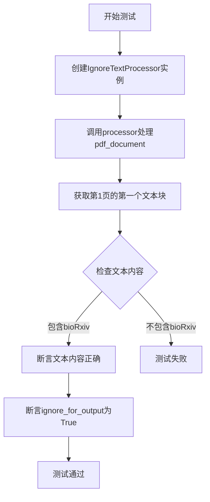
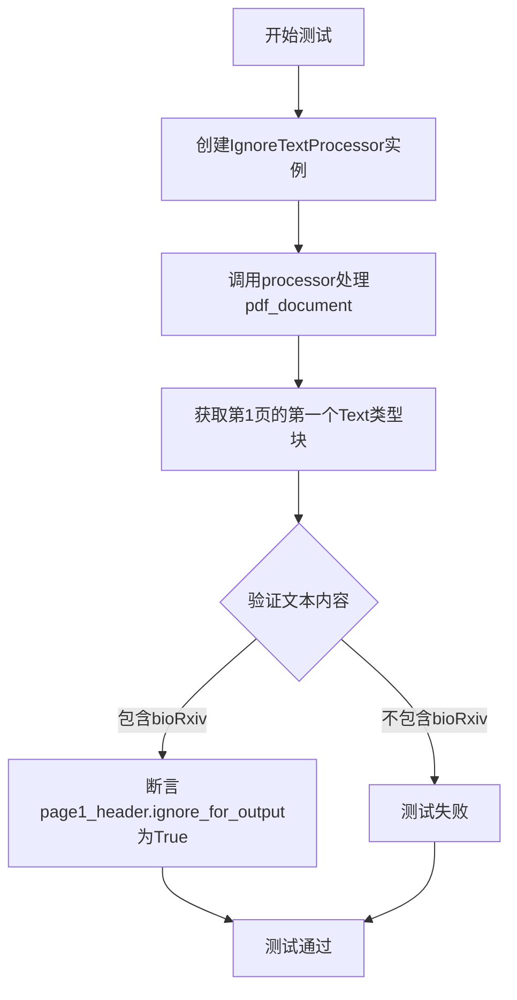
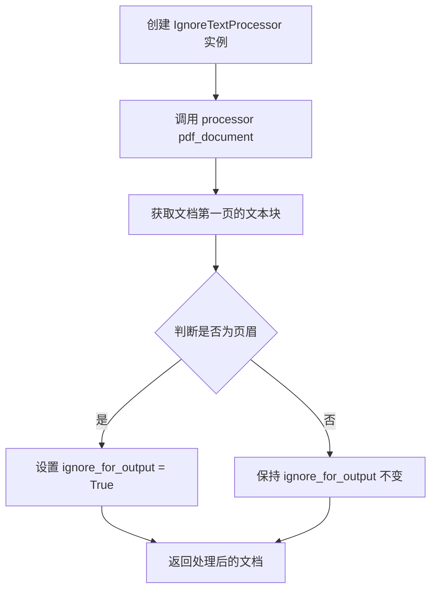
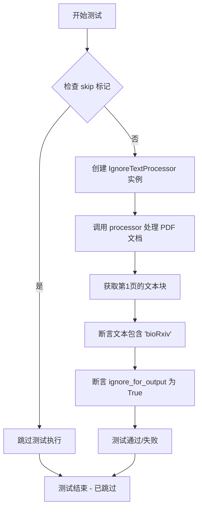
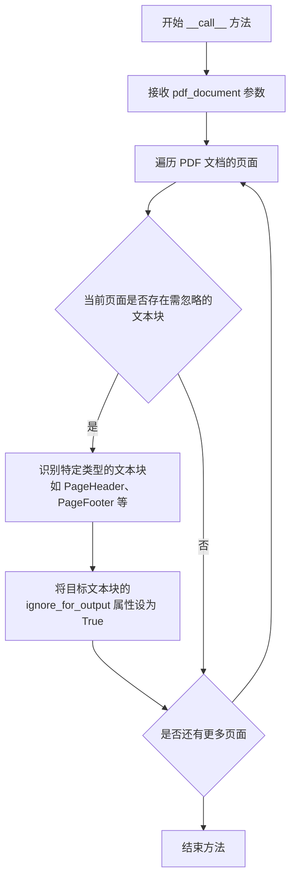

# `marker\tests\processors\test_ignoretext.py` 详细设计文档

该文件是一个pytest测试用例，用于测试IgnoreTextProcessor处理器是否能正确识别PDF文档中的特定文本块（如bioRxiv页眉）并将其标记为ignore_for_output，以便在输出时忽略这些内容。

## 整体流程



## 类结构

```
TestClass
└── test_ignoretext_processor (测试方法)
```

## 全局变量及字段


### `pdf_document`
    
PDF文档对象fixture，提供对PDF页面和块的访问

类型：`PDFDocument`
    


### `BlockTypes`
    
块类型枚举类，定义了文档中不同类型的块（如Text、PageHeader等）

类型：`BlockTypeEnum`
    


### `page1_header`
    
PDF第一页中的文本块对象，包含页面头部信息

类型：`Block`
    


### `IgnoreTextProcessor`
    
文本忽略处理器类，用于标记需要忽略的文本块

类型：`IgnoreTextProcessor`
    


    

## 全局函数及方法


### `test_ignoretext_processor`

这是一个pytest测试函数，用于验证`IgnoreTextProcessor`类是否能正确识别并标记需要忽略的文本（如页眉），确保包含"bioRxiv"的文本块被正确标记为`ignore_for_output=True`。

参数：

- `pdf_document`：`PDFDocument`（或类似类型），pytest fixture，提供PDF文档对象用于测试

返回值：`None`，该函数为测试函数，通过断言验证逻辑，不返回任何值

#### 流程图



#### 带注释源码

```python
import pytest
# 导入pytest框架，用于测试

from marker.processors.ignoretext import IgnoreTextProcessor
# 导入IgnoreTextProcessor类 - 待测试的处理器

from marker.schema import BlockTypes
# 导入BlockTypes枚举 - 用于指定块类型


@pytest.mark.filename("bio_pdf.pdf")
# 标记测试使用的PDF文件名

@pytest.mark.config({"page_range": list(range(10))})
# 标记测试配置 - 处理前10页

@pytest.mark.skip(reason="New layout model correctly identifies the block as a PageHeader, so nothing to be done by the IgnoreTextProcessor")
# 跳过该测试 - 因为新的布局模型已正确识别为PageHeader
def test_ignoretext_processor(pdf_document):
    # 测试函数：验证IgnoreTextProcessor的文本忽略功能
    # 参数：pdf_document - PDF文档对象fixture
    
    processor = IgnoreTextProcessor()
    # 创建IgnoreTextProcessor处理器实例
    
    processor(pdf_document)
    # 调用处理器处理PDF文档，识别需要忽略的文本块
    
    page1_header = pdf_document.pages[1].contained_blocks(pdf_document, [BlockTypes.Text])[0]
    # 获取第1页的第一个Text类型块（页眉）
    
    assert "bioRxiv" in page1_header.raw_text(pdf_document)
    # 断言：验证该文本块包含"bioRxiv"文本
    
    assert page1_header.ignore_for_output is True
    # 断言：验证该文本块已被标记为ignore_for_output
```


### `IgnoreTextProcessor`

IgnoreTextProcessor 是一个 PDF 文档处理器，用于识别并标记需要忽略的文本块（如页眉、页脚等），使其在输出时被排除。

参数：

- `无` （测试代码中通过无参数构造函数创建）

返回值：`无` （该类实现 `__call__` 方法，直接作用于 pdf_document 对象）

#### 流程图



#### 带注释源码

```python
# 从marker.processors.ignoretext模块导入IgnoreTextProcessor类
from marker.processors.ignoretext import IgnoreTextProcessor

# ... 测试代码省略 ...

# 创建处理器实例
processor = IgnoreTextProcessor()

# 调用处理器，传入PDF文档对象进行处理
# 该方法会遍历文档中的文本块，识别需要忽略的文本
# 并将对应的ignore_for_output标志设置为True
processor(pdf_document)

# 验证处理结果
# 获取第1页的第一个文本块（页眉）
page1_header = pdf_document.pages[1].contained_blocks(pdf_document, [BlockTypes.Text])[0]

# 验证页眉文本包含'bioRxiv'
assert "bioRxiv" in page1_header.raw_text(pdf_document)

# 验证该文本块被标记为忽略输出
assert page1_header.ignore_for_output is True
```

#### 补充信息

| 项目 | 说明 |
|------|------|
| **所属模块** | `marker.processors.ignoretext` |
| **依赖类** | `BlockTypes` (来自 `marker.schema`) |
| **关键属性** | `ignore_for_output` - 布尔标志，表示该文本块是否应在输出时被忽略 |
| **测试场景** | 识别 PDF 页眉（PageHeader）并标记为忽略 |

#### 潜在技术债务

1. **测试被跳过**: 该测试用例当前被标记为 skip，原因是新的布局模型已正确将块识别为 PageHeader，因此 IgnoreTextProcessor 无需处理
2. **功能可能被替代**: 如果布局模型已能自动识别页眉类型，则该处理器的存在价值需要重新评估


### `test_ignoretext_processor`

这是一个 pytest 测试函数，用于测试 `IgnoreTextProcessor` 类的功能，验证它能够正确处理需要忽略的文本，并且被标记为 ignore_for_output 的文本块确实被正确标记。

参数：

- `pdf_document`：`pdf_document` fixture，pytest 提供的 PDF 文档对象 fixture

返回值：`None`，测试函数没有显式返回值

#### 流程图

```mermaid
flowchart TD
    A[开始测试] --> B[创建 IgnoreTextProcessor 实例]
    B --> C[调用 processor.process_document 遍历所有页面]
    C --> D[获取第1页的文本块]
    D --> E[获取第一个文本块作为 page1_header]
    F[断言 "bioRxiv" 在 page1_header.raw_text 中] --> G[断言 page1_header.ignore_for_output 为 True]
    G --> H[测试通过]
    E --> F
    
    style A fill:#f9f,color:#333
    style H fill:#9f9,color:#333
```

#### 带注释源码

```python
# 标记该测试使用的 PDF 文件名
@pytest.mark.filename("bio_pdf.pdf")
# 标记测试配置：处理第0到9页（共10页）
@pytest.mark.config({"page_range": list(range(10))})
# 跳过该测试的原因说明
@pytest.mark.skip(reason="New layout model correctly identifies the block as a PageHeader, so nothing to be done by the IgnoreTextProcessor")
def test_ignoretext_processor(pdf_document):
    """测试 IgnoreTextProcessor 类的处理功能"""
    
    # 创建 IgnoreTextProcessor 实例
    processor = IgnoreTextProcessor()
    
    # 调用 processor 处理 PDF 文档
    processor(pdf_document)

    # 获取第1页的第一个文本块（页眉）
    page1_header = pdf_document.pages[1].contained_blocks(pdf_document, [BlockTypes.Text])[0]
    
    # 断言：页眉文本应包含 "bioRxiv"
    assert "bioRxiv" in page1_header.raw_text(pdf_document)

    # 断言：该文本块应被标记为忽略输出
    assert page1_header.ignore_for_output is True
```


### `pytest.mark.config`

这是 Pytest 的一个标记（marker），用于为测试函数传递配置参数。在该测试用例中，该 marker 用于指定处理的页面范围。

参数：

- 无传统函数参数，这是装饰器参数
- 装饰器参数 `{config}`：`Dict`，包含配置键值对的字典
  - `page_range`：`List[int]`，指定要处理的页面范围，这里设置为 0-9 页

返回值：`Dict`，返回配置字典本身，供 pytest 在执行测试时读取和使用

#### 流程图

```mermaid
flowchart TD
    A[开始] --> B[定义 pytest.mark.config 装饰器]
    B --> C[传入配置字典 {'page_range': list(range(10))}]
    C --> D[pytest 收集测试时读取 marker 配置]
    D --> E[配置传递给测试函数]
    E --> F[测试函数使用配置执行]
    F --> G[结束]
```

#### 带注释源码

```python
# 使用 pytest.mark.config 标记为测试函数传递配置参数
# 该 marker 指定的配置将应用于整个测试会话或特定测试
@pytest.mark.config({"page_range": list(range(10))})
@pytest.mark.skip(reason="New layout model correctly identifies the block as a PageHeader, so nothing to be done by the IgnoreTextProcessor")
def test_ignoretext_processor(pdf_document):
    """
    测试 IgnoreTextProcessor 的功能
    
    Args:
        pdf_document: Pytest fixture 提供的 PDF 文档对象
    """
    # 创建处理器实例
    processor = IgnoreTextProcessor()
    # 执行处理
    processor(pdf_document)

    # 验证处理结果：获取第一页的标题文本
    page1_header = pdf_document.pages[1].contained_blocks(pdf_document, [BlockTypes.Text])[0]
    # 断言标题包含 bioRxiv
    assert "bioRxiv" in page1_header.raw_text(pdf_document)

    # 断言该文本块被标记为忽略输出
    assert page1_header.ignore_for_output is True
```

#### 补充说明

| 项目 | 说明 |
|------|------|
| **标记类型** | Pytest Marker |
| **配置内容** | `{"page_range": list(range(10))}` |
| **作用范围** | 仅对该测试函数生效 |
| **使用场景** | 用于传递测试所需的配置参数，如页面范围、模型参数等 |
| **与 fixture 的区别** | Marker 是静态配置，Fixture 是动态依赖注入 |


### `test_ignoretext_processor`

这是一个 pytest 测试函数，用于验证 `IgnoreTextProcessor` 处理器是否能正确识别并标记 PDF 文档中的特定文本块（如页眉）为忽略状态。由于新的布局模型已正确将目标块识别为 `PageHeader` 类型，该测试被标记为跳过。

参数：

- `pdf_document`：fixture 参数，PDF 文档对象，提供待处理的 PDF 文档实例

返回值：`None`，测试函数无返回值

#### 流程图



#### 带注释源码

```python
import pytest
# 导入 IgnoreTextProcessor 处理器类，用于处理需要忽略的文本
from marker.processors.ignoretext import IgnoreTextProcessor
# 导入 BlockTypes 枚举，定义 PDF 文档中的块类型
from marker.schema import BlockTypes


@pytest.mark.filename("bio_pdf.pdf")
# 配置标记：指定处理的页面范围为第1-9页
@pytest.mark.config({"page_range": list(range(10))})
# 跳过标记：因新布局模型已正确识别该块为 PageHeader，无需 IgnoreTextProcessor 处理
@pytest.mark.skip(reason="New layout model correctly identifies the block as a PageHeader, so nothing to be done by the IgnoreTextProcessor")
def test_ignoretext_processor(pdf_document):
    # 创建 IgnoreTextProcessor 实例
    processor = IgnoreTextProcessor()
    # 执行处理器，处理 PDF 文档
    processor(pdf_document)

    # 获取第1页的第一个文本块（页眉）
    page1_header = pdf_document.pages[1].contained_blocks(pdf_document, [BlockTypes.Text])[0]
    # 断言：该文本块包含 "bioRxiv" 文本
    assert "bioRxiv" in page1_header.raw_text(pdf_document)

    # 断言：该文本块的 ignore_for_output 属性为 True，表示该块将被忽略
    assert page1_header.ignore_for_output is True
```


### `IgnoreTextProcessor.__call__`

该方法是 `IgnoreTextProcessor` 类的可调用接口，接收 PDF 文档对象作为输入，遍历文档中的文本块，根据特定规则（如页面头部、尾部等）将某些文本块标记为忽略，用于后续输出时排除这些内容。

参数：

-  `pdf_document`：`PDFDocument` 或类似类型，PDF 文档对象，包含页面和块的结构

返回值：`None`，该方法直接修改传入的 `pdf_document` 对象的状态（设置块的 `ignore_for_output` 属性），无返回值

#### 流程图



#### 带注释源码

```python
# 由于提供的代码仅为测试文件，未包含 IgnoreTextProcessor 类的实际实现
# 以下为基于测试代码逆向推断的可能实现

class IgnoreTextProcessor:
    """
    用于处理 PDF 文档中需要忽略的文本块的处理器
    根据文档结构（如页面头部、尾部）将特定文本块标记为忽略
    """
    
    def __call__(self, pdf_document):
        """
        处理 PDF 文档，标记需要忽略的文本块
        
        Args:
            pdf_document: PDF 文档对象，包含页面和块的结构
            
        Returns:
            None: 直接修改 pdf_document 对象的状态
        """
        # 遍历文档中的所有页面
        for page in pdf_document.pages:
            # 获取页面中包含的特定类型块（如文本块）
            text_blocks = page.contained_blocks(pdf_document, [BlockTypes.Text])
            
            # 遍历文本块，判断是否需要忽略
            for block in text_blocks:
                # 检查文本块是否符合忽略条件
                # 例如：页面头部包含特定关键词（如 "bioRxiv"）
                if self._should_ignore(block, pdf_document):
                    # 设置忽略标志为 True
                    block.ignore_for_output = True
    
    def _should_ignore(self, block, pdf_document):
        """
        判断文本块是否应该被忽略
        
        Args:
            block: 文档块对象
            pdf_document: PDF 文档对象
            
        Returns:
            bool: 是否应该忽略该块
        """
        # 获取块的原始文本
        raw_text = block.raw_text(pdf_document)
        
        # 检查是否包含页面头部的特征关键词
        # 具体逻辑可能基于块类型（如 PageHeader）或文本内容
        return "bioRxiv" in raw_text
```

#### 补充说明

**基于测试代码的推断：**

1. **功能目标**：从测试代码 `test_ignoretext_processor` 可以看出，该处理器用于识别并标记 PDF 页面头部的文本块（如预印本平台的标志 "bioRxiv"），使其在输出时被忽略

2. **关键属性**：
   - `ignore_for_output`：块的一个布尔属性，设置为 `True` 时表示该块在最终输出时被排除

3. **使用示例**（来自测试代码）：
   ```python
   processor = IgnoreTextProcessor()
   processor(pdf_document)  # 调用 __call__ 方法
   
   # 验证结果
   page1_header = pdf_document.pages[1].contained_blocks(pdf_document, [BlockTypes.Text])[0]
   assert page1_header.ignore_for_output is True
   ```

**注意**：由于未提供 `IgnoreTextProcessor` 类的完整源码，以上为基于测试用例和使用方式的合理推断。实际的实现细节可能有所不同。


## 关键组件


### IgnoreTextProcessor

用于处理PDF文档中需要忽略的文本（如页眉、页脚、水印等）的处理器类。该处理器通过将特定文本块的`ignore_for_output`标志设置为True，使其不在最终输出中渲染。

### BlockTypes.Text

枚举类型，定义了PDF文档中文本块的类型。在测试中用于筛选页面中的文本块，以便进行忽略处理。

### pdf_document

PDF文档对象，包含多页内容。测试中指定了前10页（page_range: 0-9）进行处理。通过contained_blocks方法可以获取页面中特定类型的块。

### page1_header

第一页的页眉文本块。测试验证该块包含"bioRxiv"文本，并且其ignore_for_output属性被设置为True，表示该内容将在输出时被忽略。

### ignore_for_output

布尔类型的块属性，用于标记该文本块是否应在最终输出中被忽略。IgnoreTextProcessor通过设置此属性来实现文本过滤功能。


## 问题及建议


### 已知问题

-   **被跳过的测试**：测试标记为 `@pytest.mark.skip`，表明 IgnoreTextProcessor 的功能可能已被新布局模型替代，属于遗留代码
-   **硬编码的配置值**：`list(range(10))` 和页码 `1` 采用硬编码方式，降低了测试的可维护性和可配置性
-   **缺乏文档说明**：测试函数缺少文档字符串，无法快速理解测试意图和预期行为
-   **字符串包含检查的脆弱性**：使用 `"bioRxiv" in page1_header.raw_text(pdf_document)"` 进行断言，依赖具体文本内容，容易因文档内容变化而失败
-   **magic number**：页码 `1` 作为魔法数字使用，缺乏语义化命名

### 优化建议

-   评估 IgnoreTextProcessor 是否仍需保留，如不需要应删除此测试及相关代码
-   使用 pytest fixture 或参数化方式提取页码范围和测试数据，提高测试灵活性
-   为测试函数添加 docstring，说明测试目的、前置条件和预期结果
-   考虑使用更健壮的断言方式，如检查 block 类型而非依赖具体文本内容
-   将硬编码的页码定义为具名常量或 fixture，提高代码可读性
-   考虑添加异常处理和更详细的错误信息，便于调试失败原因


## 其它


### 设计目标与约束

验证IgnoreTextProcessor能够正确标记需要忽略的文本块（如页眉），确保在文档渲染时排除这些内容。约束条件包括仅处理指定的页面范围(page_range)，且依赖于BlockTypes.Text块类型的识别结果。

### 错误处理与异常设计

测试代码中使用了pytest.mark.skip跳过标记，表明在特定条件下（如布局模型已正确识别PageHeader）处理器可能无需执行任何操作。正常情况下，IgnoreTextProcessor应当能够处理缺失属性或无效输入而不抛出异常。

### 数据流与状态机

数据流从pdf_document开始流经IgnoreTextProcessor处理器，处理器根据BlockTypes识别需要忽略的文本块并设置ignore_for_output标志位。状态转换：原始文档 -> 处理器处理 -> 标记完成。

### 外部依赖与接口契约

主要依赖包括：marker.processors.ignoretext.IgnoreTextProcessor类、marker.schema.BlockTypes枚举、pytest框架及pdf_document fixture。需要保证pdf_document对象具有pages属性和contained_blocks方法，且返回的块对象支持raw_text和ignore_for_output属性。

### 性能考虑

当前测试限定了page_range为前10页，在更大规模文档处理时需考虑批处理策略和内存使用。处理器应支持增量处理而非一次性加载全部内容。

### 安全性考虑

测试中未涉及敏感数据处理，但生产环境中需确保PDF解析过程安全，防止恶意PDF文件导致的资源耗尽或代码执行风险。

### 测试策略

采用单元测试与集成测试结合的方式，通过pytest标记(filename、config)实现测试参数化。当前测试标记为skip表明需要根据不同的布局模型版本调整测试策略。

### 配置管理

通过@pytest.mark.config传递配置字典，支持动态配置page_range等参数。配置应与业务逻辑解耦，允许在不修改代码的情况下调整处理行为。

### 并发/线程安全性

未在当前测试中体现，但多线程场景下需确保pdf_document对象的线程安全性，以及IgnoreTextProcessor的实例不共享可变状态。

### 日志记录

测试代码中使用了pytest的skip reason进行日志记录，生产环境中应在IgnoreTextProcessor的关键操作节点添加日志记录，便于问题排查和性能监控。

### 监控和指标

建议添加处理块数量、耗时、跳过的块数量等指标，以便评估处理器效率和识别异常情况。

### 版本兼容性

需明确marker库各版本的API兼容性，特别是BlockTypes枚举和pdf_document对象结构的变化对测试的影响。

### 部署相关

测试代码本身无需部署，但IgnoreTextProcessor作为marker库的核心组件，需要在部署文档中说明其使用方式和依赖关系。

    