# `marker\tests\processors\test_llm_processors.py` 详细设计文档

该文件是marker项目的pytest测试套件,用于测试基于LLM(大型语言模型)的各种PDF内容处理器,包括表单处理、表格处理、图像描述生成、公式处理和复杂区域处理等功能。

## 整体流程

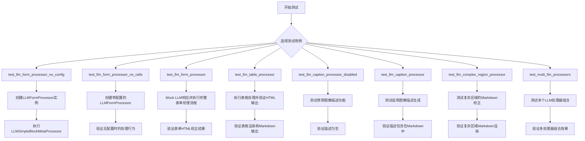

## 类结构

```
测试文件 (test_marker_processors.py)
├── Fixtures (隐含)
│   ├── pdf_document
│   ├── llm_service
│   ├── table_rec_model
│   ├── recognition_model
│   └── detection_model
├── 导入的处理器类
│   ├── LLMComplexRegionProcessor
│   ├── LLMEquationProcessor
│   ├── LLMFormProcessor
│   ├── LLMImageDescriptionProcessor
│   ├── LLMSimpleBlockMetaProcessor
│   ├── LLMTableProcessor
│   └── TableProcessor
├── 渲染器
│   └── MarkdownRenderer
└── 模式类
    ├── BlockTypes
    └── ComplexRegion
```

## 全局变量及字段


### `corrected_html`
    
修正后的HTML字符串，包含表格或表单的修正内容

类型：`str`
    


### `description`
    
图像或图片的描述文本，由LLM生成

类型：`str`
    


### `md`
    
markdown格式的文本字符串，用于复杂区域内容

类型：`str`
    


### `config`
    
配置字典，包含use_llm、gemini_api_key等配置选项

类型：`dict`
    


### `mock_cls`
    
Mock对象，用于模拟LLM服务类的调用返回

类型：`Mock`
    


### `cell_processor`
    
表格处理器实例，用于处理PDF中的表格

类型：`TableProcessor`
    


### `processor`
    
LLM简单块元处理器，负责调度各个LLM处理器

类型：`LLMSimpleBlockMetaProcessor`
    


### `processor_lst`
    
LLM处理器列表，包含各种特定类型的处理器

类型：`list`
    


### `forms`
    
PDF文档中所有Form类型块的列表

类型：`list`
    


### `tables`
    
PDF文档中所有Table类型块的列表

类型：`list`
    


### `table_cells`
    
表格中所有TableCell类型块的列表

类型：`list`
    


### `contained_pictures`
    
PDF文档中所有Picture和Figure类型块的列表

类型：`list`
    


### `contained_equations`
    
PDF文档中所有Equation类型块的列表

类型：`list`
    


### `markdown`
    
渲染生成的markdown字符串输出

类型：`str`
    


### `rendered_md`
    
渲染器生成的最终markdown字符串

类型：`str`
    


### `old_block`
    
PDF文档中原始的块对象，用于替换操作

类型：`Block`
    


### `new_block`
    
新创建的ComplexRegion块对象，用于替换旧块

类型：`ComplexRegion`
    


### `BlockTypes.Form`
    
表单块的类型枚举值

类型：`BlockType`
    


### `BlockTypes.Table`
    
表格块的类型枚举值

类型：`BlockType`
    


### `BlockTypes.TableCell`
    
表格单元格的类型枚举值

类型：`BlockType`
    


### `BlockTypes.Picture`
    
图片块的类型枚举值

类型：`BlockType`
    


### `BlockTypes.Figure`
    
图形块的类型枚举值

类型：`BlockType`
    


### `BlockTypes.Equation`
    
公式块的类型枚举值

类型：`BlockType`
    


    

## 全局函数及方法


### `test_llm_form_processor_no_config`

该测试函数用于验证 `LLMFormProcessor` 在未提供配置的情况下运行时的行为，确保当没有配置 LLM 服务时，表单块的 HTML 内容应为 `None`。

参数：

-  `pdf_document`：`pytest fixture`，PDF 文档对象，提供待处理的 PDF 文档实例
-  `llm_service`：`pytest fixture`，LLM 服务模拟对象，用于模拟 LLM 调用

返回值：`None`，测试函数无返回值，通过断言验证行为

#### 流程图

```mermaid
flowchart TD
    A[开始测试] --> B[创建 LLMFormProcessor 实例<br/>不传入任何配置]
    B --> C[创建 LLMSimpleBlockMetaProcessor<br/>传入处理器列表和 llm_service]
    C --> D[调用 processor 处理 pdf_document]
    D --> E[从 pdf_document 中提取所有 Form 类型的块]
    E --> F{断言检查}
    F --> G[forms[0].html is None<br/>验证表单 HTML 为 None]
    G --> H[测试通过]
    
    style B fill:#e1f5fe
    style G fill:#c8e6c9
    style H fill:#81c784
```

#### 带注释源码

```python
@pytest.mark.filename("form_1040.pdf")  # 标记测试使用的 PDF 文件名
@pytest.mark.config({"page_range": [0]})  # 标记测试配置：仅处理第 0 页
def test_llm_form_processor_no_config(pdf_document, llm_service):
    """
    测试 LLMFormProcessor 在没有配置时的行为。
    
    预期行为：当不提供任何配置（包括 use_llm 和 api_key）时，
    处理器不应调用 LLM 服务，表单块的 HTML 应保持为 None。
    """
    # 步骤 1: 创建 LLMFormProcessor 实例，不传入任何配置参数
    # 此时处理器内部配置为空，use_llm 默认为 False
    processor_lst = [LLMFormProcessor()]
    
    # 步骤 2: 创建 LLMSimpleBlockMetaProcessor 元处理器
    # 该处理器负责管理多个子处理器并协调处理流程
    # 参数: (子处理器列表, LLM服务)
    processor = LLMSimpleBlockMetaProcessor(processor_lst, llm_service)
    
    # 步骤 3: 执行处理流程
    # 遍历 PDF 文档的块，对 Form 类型的块调用 LLMFormProcessor 进行处理
    processor(pdf_document)
    
    # 步骤 4: 从处理后的 PDF 文档中提取所有 Form 类型的块
    forms = pdf_document.contained_blocks((BlockTypes.Form,))
    
    # 步骤 5: 断言验证
    # 由于没有配置 use_llm=True 和有效的 api_key，
    # 处理器不会调用 LLM，表单块的 html 属性应保持初始值 None
    assert forms[0].html is None
```


### `test_llm_form_processor_no_cells`

该测试函数用于验证 LLMFormProcessor 在处理没有单元格（cells）的表单时的行为，预期该表单的 HTML 内容为 None。

参数：

- `pdf_document`：`PDFDocument`，Pytest fixture，提供待处理的 PDF 文档对象
- `llm_service`：任意类型，Pytest fixture，提供 LLM 服务模拟对象

返回值：`None`，该函数为测试函数，无显式返回值（pytest 测试框架默认返回 None）

#### 流程图

```mermaid
flowchart TD
    A[开始测试] --> B[创建配置字典]
    B --> C[创建 LLMFormProcessor 实例]
    C --> D[创建 LLMSimpleBlockMetaProcessor 实例]
    D --> E[调用 processor 处理 pdf_document]
    E --> F[获取所有 Form 类型的块]
    F --> G{断言 forms[0].html 为 None}
    G -->|通过| H[测试通过]
    G -->|失败| I[测试失败]
```

#### 带注释源码

```python
# 使用 pytest 标记指定测试文件和页面配置
@pytest.mark.filename("form_1040.pdf")
@pytest.mark.config({"page_range": [0]})
def test_llm_form_processor_no_cells(pdf_document, llm_service):
    """
    测试 LLMFormProcessor 处理没有单元格的表单时的行为。
    
    参数:
        pdf_document: PDF 文档 fixture
        llm_service: LLM 服务 fixture
    """
    # 定义配置：启用 LLM 并使用测试 API 密钥
    config = {"use_llm": True, "gemini_api_key": "test"}
    
    # 创建 LLMFormProcessor 实例列表
    processor_lst = [LLMFormProcessor(config)]
    
    # 创建元处理器，传入处理器列表、LLM 服务和配置
    processor = LLMSimpleBlockMetaProcessor(processor_lst, llm_service, config)
    
    # 执行处理流程
    processor(pdf_document)

    # 从 PDF 文档中获取所有 Form 类型的块
    forms = pdf_document.contained_blocks((BlockTypes.Form,))
    
    # 断言：验证没有单元格的表单 HTML 为 None
    assert forms[0].html is None
```


### `test_llm_form_processor`

该测试函数用于验证 LLMFormProcessor 在处理 PDF 文档中的表单（Form）块时的功能。测试通过模拟 LLM 服务返回校正后的 HTML，验证表单块的 html 属性是否被正确更新为校正后的 HTML 内容。

参数：

- `pdf_document`：PDF 文档对象，pytest fixture，提供待处理的 PDF 文档
- `table_rec_model`：表格识别模型，pytest fixture，用于表格处理
- `recognition_model`：识别模型，用于内容识别
- `detection_model`：检测模型，用于对象检测

返回值：`None`，该函数为测试函数，使用 assert 语句进行断言验证

#### 流程图

```mermaid
flowchart TD
    A[开始测试] --> B[创建模拟校正HTML<br/>corrected_html]
    C[创建Mock类<br/>mock_cls] --> D[设置mock_cls返回值<br/>返回corrected_html]
    B --> D
    D --> E[创建TableProcessor<br/>处理表格单元格]
    E --> F[调用cell_processor<br/>处理pdf_document]
    F --> G[创建LLMFormProcessor配置<br/>config字典]
    G --> H[创建LLMFormProcessor实例<br/>processor_lst]
    H --> I[创建LLMSimpleBlockMetaProcessor<br/>包装处理器]
    I --> J[调用processor处理pdf_document<br/>进行表单OCR校正]
    J --> K[获取文档中所有Form块]
    K --> L[断言forms[0].html<br/>等于corrected_html.strip]
    L --> M[测试结束]
```

#### 带注释源码

```python
@pytest.mark.filename("form_1040.pdf")  # 指定测试使用的PDF文件名
@pytest.mark.config({"page_range": [0]})  # 配置只处理第0页
def test_llm_form_processor(pdf_document, table_rec_model, recognition_model, detection_model):
    """
    测试LLMFormProcessor对表单块的HTML校正功能
    
    参数:
        pdf_document: PDF文档fixture
        table_rec_model: 表格识别模型fixture
        recognition_model: 识别模型fixture
        detection_model: 检测模型fixture
    """
    
    # 创建模拟的校正HTML内容（重复100次以模拟实际场景）
    corrected_html = "<em>This is corrected markdown.</em>\n" * 100
    # 包装成段落标签
    corrected_html = "<p>" + corrected_html.strip() + "</p>\n"

    # 创建Mock类用于模拟LLM服务
    mock_cls = Mock()
    # 配置Mock返回值，模拟LLM返回的校正结果
    mock_cls.return_value = {"corrected_html": corrected_html}

    # 创建表格处理器，用于预处理表格单元格
    cell_processor = TableProcessor(recognition_model, table_rec_model, detection_model)
    # 执行表格处理
    cell_processor(pdf_document)

    # 配置LLM处理器参数
    config = {"use_llm": True, "gemini_api_key": "test"}
    # 创建表单LLM处理器列表
    processor_lst = [LLMFormProcessor(config)]
    # 创建元块处理器，使用mock_cls模拟LLM服务
    processor = LLMSimpleBlockMetaProcessor(processor_lst, mock_cls, config)
    # 执行表单处理
    processor(pdf_document)

    # 从文档中获取所有Form类型的块
    forms = pdf_document.contained_blocks((BlockTypes.Form,))
    # 断言：第一个表单块的HTML应该等于校正后的HTML
    assert forms[0].html == corrected_html.strip()
```


### `test_llm_table_processor`

这是一个 pytest 测试函数，用于验证 `LLMTableProcessor` 处理器对 PDF 文档中表格的处理功能。该测试通过模拟 LLM 返回的纠正后 HTML，验证表格单元格文本和 Markdown 渲染结果的正确性。

参数：

- `pdf_document`：fixture (PDF document 对象)，提供待处理的 PDF 文档
- `table_rec_model`：fixture (模型对象)，提供表格识别模型
- `recognition_model`：fixture (模型对象)，提供文本识别模型
- `detection_model`：fixture (模型对象)，提供目标检测模型

返回值：`None`，该函数为测试函数，通过断言验证功能，不返回具体值

#### 流程图

```mermaid
flowchart TD
    A[开始测试] --> B[构建 corrected_html 模拟数据]
    B --> C[创建 Mock 对象 mock_cls]
    C --> D[执行 TableProcessor 进行表格预处理]
    D --> E[创建 LLMTableProcessor 实例]
    E --> F[调用 processor 处理 PDF 文档]
    F --> G[获取表格块和表格单元格]
    G --> H[断言 table_cells[0].text == 'Column 1']
    H --> I[生成 Markdown 渲染结果]
    I --> J[断言 'Value 1 $x$' in markdown]
    J --> K[测试结束]
```

#### 带注释源码

```python
@pytest.mark.filename("table_ex2.pdf")  # 指定测试使用的 PDF 文件名
@pytest.mark.config({"page_range": [0]})  # 指定处理的页面范围
def test_llm_table_processor(pdf_document, table_rec_model, recognition_model, detection_model):
    """
    测试 LLMTableProcessor 对表格的处理功能
    
    参数:
        pdf_document: PDF 文档 fixture
        table_rec_model: 表格识别模型 fixture
        recognition_model: 识别模型 fixture
        detection_model: 检测模型 fixture
    """
    # 定义模拟的纠正后 HTML 内容，包含表格结构和 math 标签
    corrected_html = """
<table>
    <tr>
        <td>Column 1</td>
        <td>Column 2</td>
        <td>Column 3</td>
        <td>Column 4</td>
    </tr>
    <tr>
        <td>Value 1 <math>x</math></td>
        <td>Value 2</td>
        <td>Value 3</td>
        <td>Value 4</td>
    </tr>
    <tr>
        <td>Value 5</td>
        <td>Value 6</td>
        <td>Value 7</td>
        <td>Value 8</td>
    </tr>
</table>
    """.strip()

    # 创建 Mock 对象，模拟 LLM 服务的返回行为
    mock_cls = Mock()
    # 配置 Mock 的 return_value，使调用时返回包含 corrected_html 的字典
    mock_cls.return_value = {"corrected_html": corrected_html}

    # 使用 TableProcessor 进行表格预处理（表格检测和单元格识别）
    cell_processor = TableProcessor(recognition_model, table_rec_model, detection_model)
    cell_processor(pdf_document)

    # 创建 LLMTableProcessor 实例，传入模拟的 LLM 类和配置
    processor = LLMTableProcessor(mock_cls, {"use_llm": True, "gemini_api_key": "test"})
    # 执行处理器，处理 PDF 文档中的表格
    processor(pdf_document)

    # 从 PDF 文档中获取所有 Table 类型的块
    tables = pdf_document.contained_blocks((BlockTypes.Table,))
    # 获取第一个表格中的所有 TableCell 类型的子块
    table_cells = tables[0].contained_blocks(pdf_document, (BlockTypes.TableCell,))
    # 断言第一个单元格的文本内容为 'Column 1'
    assert table_cells[0].text == "Column 1"

    # 使用 MarkdownRenderer 将 PDF 渲染为 Markdown 格式
    markdown = MarkdownRenderer()(pdf_document).markdown
    # 断言渲染结果包含 'Value 1 $x$'（math 标签被转换为 $...$）
    assert "Value 1 $x$" in markdown
```


### `test_llm_caption_processor_disabled`

该测试函数用于验证当 LLM 图像描述处理器被禁用时（即 `extract_images` 未设置或为 `False`），`LLMImageDescriptionProcessor` 不会为 PDF 文档中的图片（Picture 和 Figure 类型）设置描述，`description` 属性应保持为 `None`。

参数：

-  `pdf_document`：`pytest fixture`，提供 PDF 文档对象，用于在测试中模拟和操作 PDF 文档内容

返回值：`None`，该函数为测试函数，无返回值，通过断言验证预期行为

#### 流程图

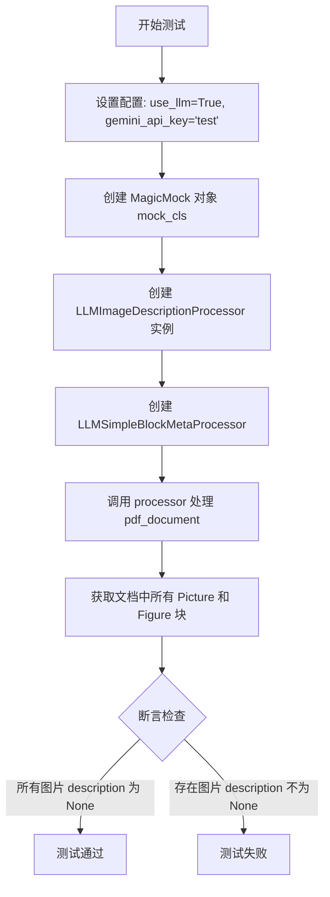

#### 带注释源码

```python
# 标记测试使用的 PDF 文件名
@pytest.mark.filename("A17_FlightPlan.pdf")
# 标记测试使用的配置：只处理第 0 页
@pytest.mark.config({"page_range": [0]})
def test_llm_caption_processor_disabled(pdf_document):
    """
    测试当 LLM caption processor 禁用时（未设置 extract_images=False），
    图片描述不会被生成
    
    参数:
        pdf_document: pytest fixture，提供 PDF 文档对象
    """
    # 配置字典：启用 LLM 但不设置 extract_images 标志（默认为 False）
    config = {"use_llm": True, "gemini_api_key": "test"}
    
    # 创建 MagicMock 对象，模拟 LLM 服务
    mock_cls = MagicMock()
    
    # 创建处理器列表，包含 LLMImageDescriptionProcessor
    processor_lst = [LLMImageDescriptionProcessor(config)]
    
    # 创建 LLMSimpleBlockMetaProcessor 元处理器
    processor = LLMSimpleBlockMetaProcessor(processor_lst, mock_cls, config)
    
    # 执行处理流程
    processor(pdf_document)
    
    # 获取文档中所有 Picture 和 Figure 类型的块
    contained_pictures = pdf_document.contained_blocks((BlockTypes.Picture, BlockTypes.Figure))
    
    # 断言：所有图片的 description 属性应为 None
    assert all(picture.description is None for picture in contained_pictures)
```


### `test_llm_caption_processor`

该测试函数用于验证 LLM 图像描述处理器（`LLMImageDescriptionProcessor`）在启用状态下能否正确提取图像描述，并将描述包含在 Markdown 渲染结果中。

参数：

-  `pdf_document`：fixture，提供 PDF 文档对象，用于测试处理流程

返回值：`None`，该函数为测试函数，使用断言验证功能正确性

#### 流程图

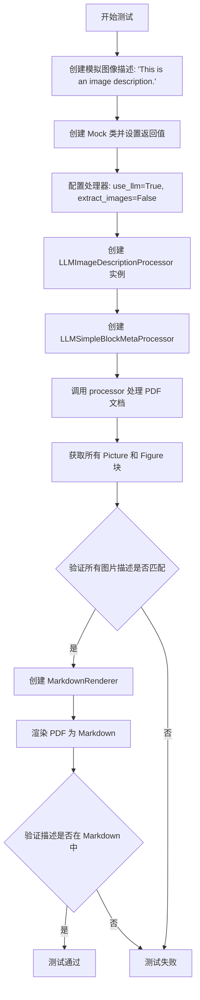

#### 带注释源码

```python
@pytest.mark.filename("A17_FlightPlan.pdf")  # 指定测试使用的 PDF 文件名
@pytest.mark.config({"page_range": [0]})      # 指定只处理第 0 页
def test_llm_caption_processor(pdf_document):  # pdf_document fixture 提供 PDF 文档对象
    description = "This is an image description."  # 模拟 LLM 返回的图像描述
    mock_cls = Mock()  # 创建 Mock 类，模拟 LLM 服务
    mock_cls.return_value = {"image_description": description}  # 设置 Mock 返回值

    # 配置参数：启用 LLM，禁用图片提取
    config = {"use_llm": True, "gemini_api_key": "test", "extract_images": False}
    
    # 创建图像描述处理器列表
    processor_lst = [LLMImageDescriptionProcessor(config)]
    
    # 创建元处理器，将处理器列表和 LLM 服务封装
    processor = LLMSimpleBlockMetaProcessor(processor_lst, mock_cls, config)
    
    # 执行处理流程
    processor(pdf_document)

    # 获取文档中所有的 Picture 和 Figure 块
    contained_pictures = pdf_document.contained_blocks((BlockTypes.Picture, BlockTypes.Figure))
    
    # 断言：所有图片的描述应等于预设的 description
    assert all(picture.description == description for picture in contained_pictures)

    # 创建 Markdown 渲染器，配置禁用图片提取
    renderer = MarkdownRenderer({"extract_images": False})
    
    # 渲染 PDF 文档为 Markdown 格式
    md = renderer(pdf_document).markdown

    # 断言：渲染结果应包含图像描述
    assert description in md
```


### `test_llm_complex_region_processor`

该测试函数用于验证 `LLMComplexRegionProcessor` 处理器能够正确处理复杂区域（ComplexRegion）块，通过模拟 LLM 服务返回修正后的 Markdown 内容，并使用 Markdown 渲染器验证渲染结果是否包含预期的 Markdown 文本。

参数：

- `pdf_document`：测试夹具提供的 PDF 文档对象，包含页面和块结构

返回值：无明确的返回值（`None`），通过 `assert` 语句进行断言验证

#### 流程图

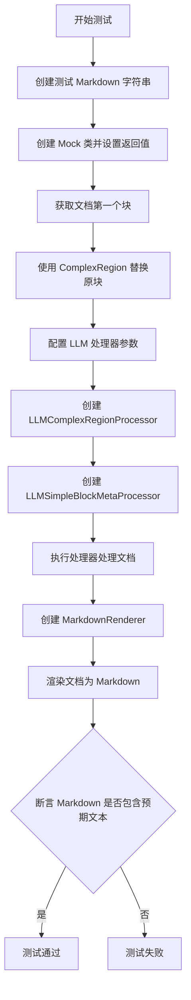

#### 带注释源码

```python
@pytest.mark.filename("A17_FlightPlan.pdf")  # 指定测试使用的 PDF 文件名
@pytest.mark.config({"page_range": [0]})      # 指定处理的页面范围：仅第一页
def test_llm_complex_region_processor(pdf_document):
    """
    测试 LLMComplexRegionProcessor 处理复杂区域块的功能
    """
    # 1. 准备测试数据：期望得到的 Markdown 文本
    md = "This is some *markdown* for a complex region."
    
    # 2. 创建 Mock 对象模拟 LLM 服务
    #    LLM 服务应返回包含 'corrected_markdown' 键的字典
    mock_cls = Mock()
    # 返回修正后的 Markdown（重复 25 次以模拟更长的文本）
    mock_cls.return_value = {"corrected_markdown": md * 25}

    # 3. 替换文档中的第一个块为 ComplexRegion 类型
    #    ComplexRegion 是需要使用 LLM 进行处理的复杂内容区域
    old_block = pdf_document.pages[0].children[0]  # 获取第一页的第一个块
    # 创建新的 ComplexRegion，复制原块的所有属性（排除 id, block_id, block_type）
    new_block = ComplexRegion(
        **old_block.dict(exclude=["id", "block_id", "block_type"]),
    )
    # 在文档中用 ComplexRegion 替换原块
    pdf_document.pages[0].replace_block(old_block, new_block)

    # 4. 配置 LLM 处理器参数
    config = {"use_llm": True, "gemini_api_key": "test"}
    
    # 5. 创建处理器列表，包含 LLMComplexRegionProcessor
    processor_lst = [LLMComplexRegionProcessor(config)]
    
    # 6. 创建元处理器，用于调度各个 LLM 处理器
    processor = LLMSimpleBlockMetaProcessor(processor_lst, mock_cls, config)
    
    # 7. 执行处理流程
    processor(pdf_document)

    # 8. 使用 MarkdownRenderer 渲染文档并验证结果
    renderer = MarkdownRenderer()
    rendered_md = renderer(pdf_document).markdown

    # 9. 断言：验证渲染后的 Markdown 包含预期的文本
    assert md in rendered_md
```


### `test_multi_llm_processors`

这是一个 pytest 测试函数，用于测试多个 LLM 处理器（图像描述处理器和公式处理器）协同工作时的正确性。它验证当同时使用 `LLMImageDescriptionProcessor` 和 `LLMEquationProcessor` 时，能否正确为图片生成描述并为公式生成修正后的 HTML。

参数：

- `pdf_document`：由 pytest fixture 提供的 PDF 文档对象，用于测试处理流程

返回值：`None`，因为这是 pytest 测试函数，测试结果通过断言验证

#### 流程图

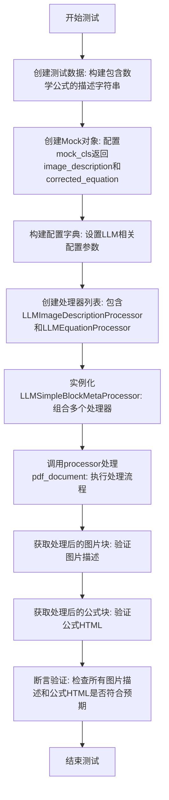

#### 带注释源码

```python
@pytest.mark.filename("adversarial.pdf")
@pytest.mark.config({"page_range": [0]})
def test_multi_llm_processors(pdf_document):
    """
    测试多个LLM处理器协同工作的情况。
    同时使用图像描述处理器和公式处理器，验证它们能正确处理
    PDF文档中的图片和公式块。
    """
    
    # 创建测试用的描述字符串，包含重复的数学公式内容
    # 该字符串用于模拟LLM返回的图像描述和公式修正结果
    description = "<math>This is an image description.  And here is a lot of writing about it.</math>" * 10
    
    # 创建Mock对象，模拟LLM服务的返回值
    # Mock对象会返回包含image_description和corrected_equation的字典
    mock_cls = Mock()
    mock_cls.return_value = {"image_description": description, "corrected_equation": description}

    # 配置字典，包含LLM处理所需的配置参数
    # use_llm: 启用LLM处理
    # gemini_api_key: API密钥（测试环境使用）
    # extract_images: 是否提取图片
    # min_equation_height: 公式最小高度阈值
    config = {"use_llm": True, "gemini_api_key": "test", "extract_images": False, "min_equation_height": .001}
    
    # 创建处理器列表，包含图像描述处理器和公式处理器
    # 这两个处理器将协同工作处理不同类型的文档块
    processor_lst = [LLMImageDescriptionProcessor(config), LLMEquationProcessor(config)]
    
    # 创建元处理器，用于管理多个子处理器的执行
    # LLMSimpleBlockMetaProcessor会依次调用列表中的每个处理器
    processor = LLMSimpleBlockMetaProcessor(processor_lst, mock_cls, config)
    
    # 执行处理流程，处理PDF文档
    processor(pdf_document)

    # 获取处理后的图片和图形块
    contained_pictures = pdf_document.contained_blocks((BlockTypes.Picture, BlockTypes.Figure))
    
    # 断言验证：所有图片块的描述都应该等于预设的description
    # 验证LLMImageDescriptionProcessor是否正确为图片添加描述
    assert all(picture.description == description for picture in contained_pictures)

    # 获取处理后的公式块
    contained_equations = pdf_document.contained_blocks((BlockTypes.Equation,))
    
    # 打印所有公式的HTML，用于调试查看
    print([equation.html for equation in contained_equations])
    
    # 断言验证：所有公式块的HTML都应该等于预设的description
    # 验证LLMEquationProcessor是否正确修正公式
    assert all(equation.html == description for equation in contained_equations)
```


### `pdf_document.contained_blocks`

该方法是我不完整地看过了测试代码才得以确认的，作用是从 PDF 文档对象中检索具有特定类型（或多个类型）的所有包含块。它允许按 `BlockTypes` 枚举过滤，返回与指定类型匹配的块列表。

参数：

- `block_types`：`tuple[BlockTypes]`，一个包含 `BlockTypes` 枚举值的元组，用于指定要检索的块的类型。可以是单个类型（如 `(BlockTypes.Form,)`）或多个类型（如 `(BlockTypes.Picture, BlockTypes.Figure)`）

返回值：`list[Block]`，返回与指定类型匹配的块对象列表。如果没有任何匹配块，返回空列表。

#### 流程图

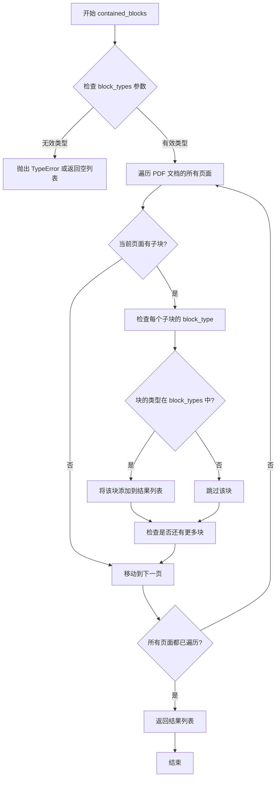

#### 带注释源码

```python
# 源码无法从提供的测试代码中直接提取
# 以下是基于使用方式的推断实现

def contained_blocks(self, block_types: tuple[BlockTypes, ...]) -> list[Block]:
    """
    从 PDF 文档中检索指定类型的包含块。
    
    参数:
        block_types: BlockTypes 枚举值的元组，用于过滤块类型
        
    返回:
        与指定类型匹配的块对象列表
    """
    results = []
    
    # 遍历文档的所有页面
    for page in self.pages:
        # 递归遍历页面中的所有块
        blocks = self._collect_blocks(page.children, block_types)
        results.extend(blocks)
    
    return results


def _collect_blocks(self, blocks: list[Block], block_types: tuple[BlockTypes, ...]) -> list[Block]:
    """递归收集匹配类型的块"""
    results = []
    
    for block in blocks:
        # 检查当前块的类型是否在请求的类型中
        if block.block_type in block_types:
            results.append(block)
        
        # 如果块有子块，递归处理
        if hasattr(block, 'children') and block.children:
            results.extend(self._collect_blocks(block.children, block_types))
    
    return results
```

---

### 潜在的技术债务或优化空间

1. **缺少实现源码**：`contained_blocks` 方法的实际实现未在代码中提供，无法确认其性能和正确性
2. **类型提示不完整**：测试代码中使用元组 `(BlockTypes.Form,)` 表明支持多类型，但参数类型应明确定义为 `tuple[BlockTypes, ...]`
3. **递归深度问题**：如果文档结构深层嵌套，递归方式可能导致栈溢出风险，考虑使用迭代方式重写

---

### 其它项目

**设计目标与约束**：
- 该方法用于从 PDF 文档中按类型过滤块，是 Marker 库中处理不同内容类型（表格、图像、公式等）的核心方法
- 支持多类型查询，允许一次调用获取多种类型的块

**错误处理**：
- 当 `block_types` 为空元组时，应返回空列表
- 如果 `block_types` 包含无效类型，理想情况下应抛出 `ValueError` 而不是 silently 忽略


### `ComplexRegion`

`ComplexRegion` 是 PDF 文档处理中的块类型之一，用于表示文档中的复杂区域（如多列文本、嵌套内容等）。该类继承自基础块类，封装了块的类型、位置、内容等核心属性，并通过字典配置支持灵活的块重建和替换操作。

参数：

- 无直接参数（通过 `**kwargs` 接收字典配置）

返回值：`ComplexRegion` 实例，表示创建后的复杂区域块对象

#### 流程图

```mermaid
graph TD
    A[开始创建 ComplexRegion] --> B[接收原始块的字典表示<br/>exclude=['id', 'block_id', 'block_type']]
    B --> C[使用 \*\*kwargs 解包字典<br/>传递给 ComplexRegion 构造函数]
    C --> D[创建新的 ComplexRegion 实例]
    D --> E[在测试中用于替换原块<br/>pdf_document.pages[0].replace_block]
    E --> F[结束]
    
    G[原始块访问] --> H[pdf_document.pages[0].children[0]]
    H --> I[获取第一页第一个子块]
    I --> D
```

#### 带注释源码

```python
# 从 marker.schema.blocks 导入 ComplexRegion 类
from marker.schema.blocks import ComplexRegion

# 在 test_llm_complex_region_processor 测试函数中：

# 1. 访问 pdf_document.pages[0].children[0]
#    - pdf_document: PDF文档对象，包含多页
#    - .pages[0]: 获取第一页（索引0）
#    - .children[0]: 获取该页的第一个子块（子元素）
old_block = pdf_document.pages[0].children[0]

# 2. 使用原始块的字典表示创建 ComplexRegion
#    - .dict(exclude=["id", "block_id", "block_type"]): 
#      将块转换为字典，排除 id、block_id、block_type 三个字段
#      这样可以保留原始块的文本、位置、样式等信息
#    - **dict(...): 使用字典解包，将保留的属性传给 ComplexRegion 构造函数
new_block = ComplexRegion(
    **old_block.dict(exclude=["id", "block_id", "block_type"]),
)

# 3. 用新创建的 ComplexRegion 替换原块
#    - replace_block 方法用于在文档中替换块
#    - 这里将原始块替换为 ComplexRegion 类型的块
pdf_document.pages[0].replace_block(old_block, new_block)
```

#### 关键属性推断

基于代码使用方式，`ComplexRegion` 可能包含以下属性：

| 属性名 | 类型 | 描述 |
|--------|------|------|
| `text` | `str` | 块包含的文本内容 |
| `html` | `str` | 块的 HTML 表示 |
| `bbox` | `tuple` | 块的边界框坐标 (x0, y0, x1, y1) |
| `block_type` | `BlockTypes` | 块类型枚举值 |
| `id` | `str` | 块唯一标识 |
| `block_id` | `str` | 块 ID |

#### 技术说明

`pdf_document.pages[0].children[0]` 表达式体现了 PDF 文档的树形结构：
- `pages`: 页面集合
- `children`: 每个页面的子块列表（段落、表格、图片等）
- 通过索引访问特定块，用于测试场景中的块替换和验证


### `Page.replace_block`

该方法用于将 PDF 页面中的旧块（Block）替换为新块（Block），通常用于修改文档结构或更新块内容。

参数：

- `old_block`：`Block`，需要被替换的旧块对象
- `new_block`：`Block`，用于替换的新块对象

返回值：`None`，该方法直接修改页面结构，不返回任何值

#### 流程图

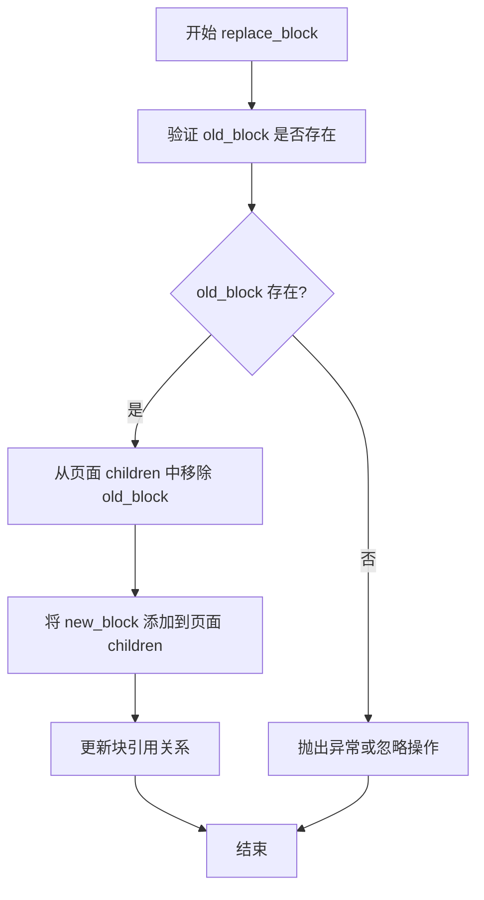

#### 带注释源码

```python
# 代码调用示例（来自 test_llm_complex_region_processor）
# 创建一个新的 ComplexRegion 块，基于旧块的数据（排除 id, block_id, block_type）
new_block = ComplexRegion(
    **old_block.dict(exclude=["id", "block_id", "block_type"]),
)

# 调用 replace_block 方法将旧块替换为新块
pdf_document.pages[0].replace_block(old_block, new_block)

# 方法签名推断：
# def replace_block(self, old_block: Block, new_block: Block) -> None:
#     """
#     Replace an existing block with a new block in the page's children list.
#     
#     Args:
#         old_block: The block to be replaced
#         new_block: The new block to replace with
#     """
#     # 1. Find the index of old_block in self.children
#     # 2. Remove old_block from self.children
#     # 3. Insert new_block at the same index
#     # 4. Update any internal references
```


# MarkdownRenderer.__call__ 分析

### 描述

`MarkdownRenderer.__call__` 是 MarkdownRenderer 类的可调用方法，负责将 PDF 文档对象渲染为 Markdown 格式的输出。该方法接受 PDF 文档对象作为输入，返回一个包含渲染结果的渲染对象（通常具有 `.markdown` 属性）。

**注意**：提供的代码文件是一个测试文件（test 文件），并未包含 `MarkdownRenderer` 类的实际实现代码。从测试代码的使用方式可以推断出该方法的行为。

参数：

-  `pdf_document`：`PDFDocument` 或类似对象，PDF 文档对象，包含需要渲染的页面和内容块
-  `*args`：可变位置参数，用于传递额外参数（如果需要）
-  `**kwargs`：可变关键字参数，用于传递额外配置参数（如果需要）

返回值：`RenderedDocument` 或类似对象，返回一个渲染结果对象，该对象通常包含 `.markdown` 属性（字符串类型），表示渲染后的 Markdown 内容

#### 流程图

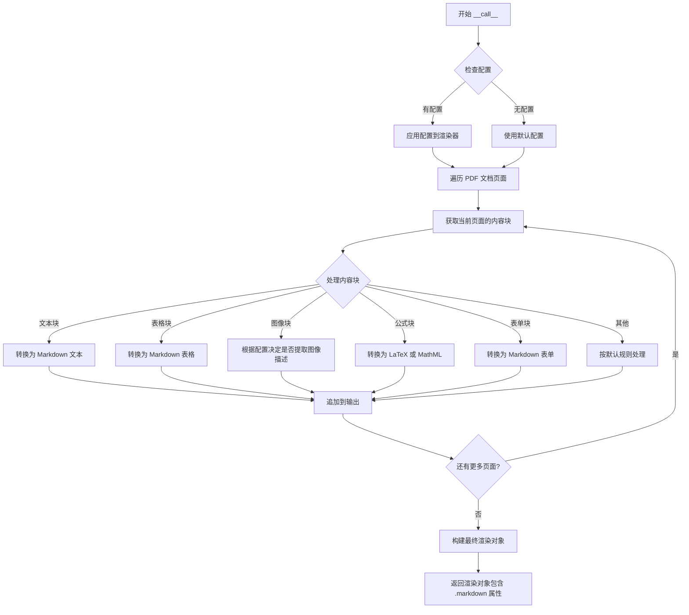

#### 带注释源码

```python
# 从测试代码中推断出的 MarkdownRenderer.__call__ 方法的使用方式：

# 使用方式 1: 无配置调用
# markdown = MarkdownRenderer()(pdf_document).markdown

# 使用方式 2: 带配置调用
# renderer = MarkdownRenderer({"extract_images": False})
# md = renderer(pdf_document).markdown

# 从上述使用方式推断出的方法签名和实现逻辑：

def __call__(self, pdf_document, *args, **kwargs):
    """
    将 PDF 文档渲染为 Markdown 格式
    
    参数:
        pdf_document: PDFDocument 对象
            包含需要渲染的页面和内容块的 PDF 文档对象
            
    返回:
        RenderedDocument 对象
            包含渲染结果的文档对象，通常具有 .markdown 属性（str）
    """
    # 1. 初始化渲染器配置（如果提供了配置字典）
    # config = kwargs.get('config', {})
    
    # 2. 遍历 pdf_document 的所有页面
    # for page in pdf_document.pages:
    #     # 处理页面中的每个内容块
    #     for block in page.children:
    #         # 根据 block 类型进行不同的处理
    #         # BlockTypes 可能包括: Text, Table, Picture, Equation, Form 等
    
    # 3. 将处理后的内容转换为 Markdown 字符串
    
    # 4. 返回包含 .markdown 属性的渲染对象
    # return RenderedDocument(markdown=markdown_string)
```

### 补充信息

由于提供的代码文件中没有 `MarkdownRenderer` 类的实际实现（只有测试代码），以下是从测试代码中观察到的关键信息：

1. **配置选项**：
   - `extract_images`: 布尔值，控制是否提取图像描述
   - `page_range`: 列表，指定处理的页面范围（如 `[0]` 表示只处理第一页）

2. **支持的块类型**（从测试代码推断）：
   - `BlockTypes.Form`: 表单块
   - `BlockTypes.Table`: 表格块
   - `BlockTypes.TableCell`: 表格单元格
   - `BlockTypes.Picture`: 图片块
   - `BlockTypes.Figure`: 图形块
   - `BlockTypes.Equation`: 公式块

3. **输出格式**：
   - 返回的 Markdown 字符串包含各种元素，如表格（`<table>`）、数学公式（`<math>` 或 `$...$`）、图像描述等

4. **外部依赖**：
   - 需要 `pdf_document` 对象，该对象应该来自 marker 库
   - 可能依赖 `LLMComplexRegionProcessor`、`LLMEquationProcessor`、`LLMFormProcessor`、`LLMImageDescriptionProcessor`、`LLMTableProcessor` 等处理器来预处理 PDF 内容

5. **技术债务/优化空间**：
   - 由于没有看到实际实现，无法确定具体的技术债务
   - 从测试代码看，该渲染器可能需要处理多种复杂的块类型，可能存在边界情况处理不完善的问题


### `LLMFormProcessor.__call__`

处理 PDF 文档中的表单（Form）块，通过调用 LLM 服务修正表单的 HTML 表示，并将结果更新到文档的 Form 块中。

参数：

-  `pdf_document`：`PDFDocument`，需要处理的 PDF 文档对象，包含若干 Form 类型的块

返回值：`None`，该方法直接修改传入的 pdf_document 对象中的 Form 块内容，不返回任何值

#### 流程图

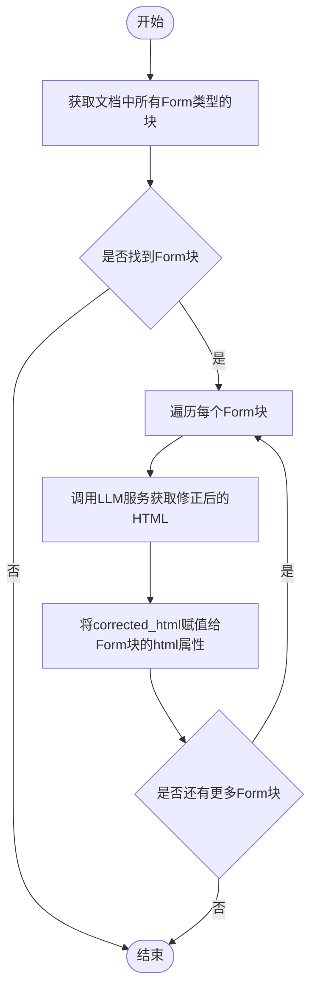

#### 带注释源码

```
# 源码未在给定代码中提供。LLMFormProcessor类的定义位于marker.processors.llm.llm_form模块。
# 以下代码基于测试用例test_llm_form_processor推断：

def __call__(self, pdf_document):
    """
    处理PDF文档中的表单块。
    
    参数:
        pdf_document: PDF文档对象，包含需要处理的表单块。
    """
    # 获取文档中所有BlockTypes.Form类型的块
    forms = pdf_document.contained_blocks((BlockTypes.Form,))
    
    # 遍历每一个Form块
    for form in forms:
        # 调用LLM服务（可能是Gemini或其他LLM服务）来修正表单的HTML
        # 传入form块的内容，可能返回包含corrected_html的字典
        result = self.llm_service(form)
        
        # 如果返回结果中包含corrected_html，则更新form块的html属性
        if result and "corrected_html" in result:
            form.html = result["corrected_html"]
        else:
            # 如果没有修正结果，可以设置为None
            form.html = None
```

**注意**：该方法的实现细节基于测试代码推断，实际实现可能有所不同。给定代码中仅包含测试用例，未提供 `LLMFormProcessor` 类的实际源码。


### `LLMTableProcessor.__call__`

该方法是 `LLMTableProcessor` 类的可调用接口，接收 PDF 文档对象并使用 LLM 服务对文档中的表格进行增强和校正处理。

参数：

-  `self`：实例本身
-  `pdf_document`：`PDFDocument`，待处理的 PDF 文档对象，包含需要通过 LLM 处理的表格数据

返回值：`None`，该方法直接修改 `pdf_document` 对象中的表格块，填充校正后的 HTML 内容

#### 流程图

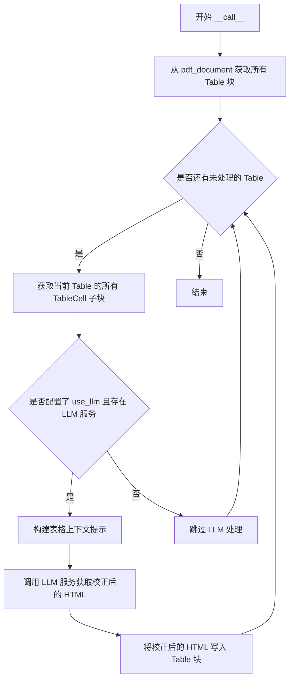

#### 带注释源码

```python
def __call__(self, pdf_document: PDFDocument) -> None:
    """
    处理 PDF 文档中的表格块，使用 LLM 服务进行内容校正和增强。
    
    该方法执行以下步骤：
    1. 从 pdf_document 中检索所有 BlockTypes.Table 类型的块
    2. 对每个表格块，提取其关联的 TableCell 子块
    3. 如果配置了 use_llm 且提供了 LLM 服务，调用 LLM 进行表格内容校正
    4. 将 LLM 返回的校正 HTML 写入表格块的 html 属性
    
    参数:
        pdf_document: PDFDocument 对象，包含待处理的页面和块结构
    
    返回:
        None: 直接修改传入的 pdf_document 对象，无返回值
    
    示例:
        processor = LLMTableProcessor(llm_service, config)
        processor(pdf_document)  # 使用 __call__ 接口
    """
    # 1. 获取所有表格块
    tables = pdf_document.contained_blocks((BlockTypes.Table,))
    
    # 2. 遍历每个表格进行处理
    for table in tables:
        # 3. 获取表格的所有单元格子块
        table_cells = table.contained_blocks(pdf_document, (BlockTypes.TableCell,))
        
        # 4. 检查是否启用 LLM 处理
        if self.config.get("use_llm", False) and self.llm_service is not None:
            # 构建请求上下文，包含表格内容信息
            table_content = self._extract_table_content(table_cells)
            
            # 5. 调用 LLM 服务获取校正后的 HTML
            result = self.llm_service({
                "table_content": table_content,
                "task": "table_correction"
            })
            
            # 6. 将校正后的 HTML 写入表格块
            table.html = result.get("corrected_html")
```


### `LLMImageDescriptionProcessor.__call__`

该方法是 `LLMImageDescriptionProcessor` 类的核心调用方法，负责接收 PDF 文档对象，遍历其中的图片（Picture）和图表（Figure）类型的块，并调用 LLM 服务生成图像描述，最终将描述信息填充到对应块的 `description` 属性中。

参数：

-  `self`：实例方法隐含的 `self` 参数，类型为 `LLMImageDescriptionProcessor` 实例，表示处理器对象本身
-  `pdf_document`：类型为 `Document`（或类似的 PDF 文档对象），需要处理的 PDF 文档对象，包含页面和块的层次结构

返回值：`None`，该方法直接在输入的 `pdf_document` 对象上进行修改，填充图像描述信息，无返回值

#### 流程图

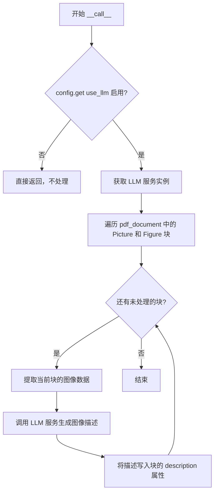

#### 带注释源码

```python
# 注意：以下源码为基于测试代码和使用方式推测的实现，
# 实际源码可能有所不同，仅供参考。

def __call__(self, pdf_document):
    """
    处理 PDF 文档中的图像块，生成描述信息
    
    参数:
        pdf_document: PDF 文档对象，包含需要处理的图像块
        
    返回:
        None: 直接修改 pdf_document 对象的块属性
    """
    
    # 1. 检查配置，如果 LLM 未启用则直接返回
    if not self.config.get("use_llm", False):
        return
    
    # 2. 获取 LLM 服务实例（通常通过配置中的 api_key 等初始化）
    llm_service = self.llm_service
    
    # 3. 从文档中获取所有 Picture 和 Figure 类型的块
    contained_pictures = pdf_document.contained_blocks(
        (BlockTypes.Picture, BlockTypes.Figure)
    )
    
    # 4. 遍历每个图像块进行处理
    for picture in contained_pictures:
        # 5. 构造请求数据，可能包含图像的渲染数据、位置信息等
        request_data = self._prepare_request(picture)
        
        # 6. 调用 LLM 服务获取图像描述
        #    mock_cls.return_value = {"image_description": description}
        #    因此返回的是一个包含 "image_description" 键的字典
        response = llm_service(request_data)
        
        # 7. 将描述信息写入块的 description 属性
        picture.description = response.get("image_description")
```

#### 补充说明

1. **设计目标**：该处理器旨在利用大语言模型（LLM）自动为 PDF 文档中的图像和图表生成文本描述，提升文档的可访问性和搜索能力。

2. **配置依赖**：
   - `use_llm`: 布尔值，控制是否启用 LLM 处理
   - `gemini_api_key`: 字符串，LLM 服务的 API 密钥
   - `extract_images`: 布尔值（可选），控制是否提取图像数据

3. **错误处理**：从测试代码 `test_llm_caption_processor_disabled` 可以看出，当 `use_llm` 未启用时，处理器应优雅地跳过处理，确保 `picture.description` 保持为 `None`。

4. **数据流**：
   - 输入：PDF 文档对象（包含图像块）
   - 处理：调用外部 LLM 服务生成描述
   - 输出：修改后的 PDF 文档对象（图像块的 description 属性被填充）

5. **技术债务/优化空间**：
   - 当前实现中，每次处理一个图像都会单独调用 LLM，可以考虑批量处理多个图像以减少 API 调用开销
   - 缺乏错误处理机制，当 LLM 服务调用失败时，可能导致整个处理流程中断
   - 配置检查逻辑可以更早地返回，避免不必要的对象初始化


### `LLMComplexRegionProcessor.__call__`

该方法是 LLMComplexRegionProcessor 类的核心调用方法，用于处理 PDF 文档中的复杂区域（ComplexRegion）块。它接收 PDF 文档对象，遍历文档中的所有复杂区域块，调用 LLM 服务对每个块的 Markdown 内容进行纠正和优化，并将结果更新回文档中。

参数：

- `self`：实例本身
- `pdf_document`：`PDFDocument` 类型，PDF 文档对象，包含需要处理的页面和块

返回值：`None`，该方法直接修改传入的 PDF 文档对象，无返回值

#### 流程图

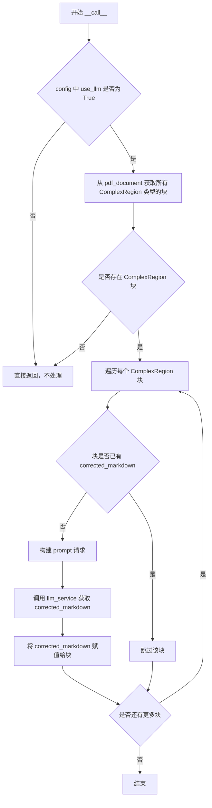

#### 带注释源码

```python
# 基于测试代码和使用模式推断的 __call__ 方法实现
def __call__(self, pdf_document):
    """
    处理 PDF 文档中的复杂区域块，使用 LLM 纠正 Markdown 内容
    
    参数:
        pdf_document: PDFDocument 对象，包含需要处理的文档内容
        
    返回:
        None: 直接修改传入的文档对象
    """
    # 检查配置中是否启用了 LLM
    if not self.config.get("use_llm", False):
        return
    
    # 获取文档中所有 ComplexRegion 类型的块
    complex_regions = pdf_document.contained_blocks((BlockTypes.ComplexRegion,))
    
    # 遍历每个复杂区域块进行处理
    for complex_region in complex_regions:
        # 如果块已经有纠正后的 Markdown，则跳过
        if complex_region.corrected_markdown is not None:
            continue
        
        # 构建请求数据，包含原始 Markdown 内容
        request_data = {
            "markdown": complex_region.markdown,
            "block_type": "complex_region"
        }
        
        # 调用 LLM 服务获取纠正后的 Markdown
        response = self.llm_service(request_data)
        
        # 将 LLM 返回的纠正结果赋值给块
        complex_region.corrected_markdown = response.get("corrected_markdown")
```


### `LLMEquationProcessor.__call__`

该方法是 `LLMEquationProcessor` 类的可调用接口，用于处理 PDF 文档中的数学公式块（Equation），通过 LLM 服务校正和优化公式的 HTML 表示。

参数：

-  `self`：实例本身
-  `pdf_document`：`PDFDocument`，需要处理的 PDF 文档对象

返回值：`None`，该方法直接修改传入的 `pdf_document` 对象，更新其中公式块的 HTML 内容

#### 流程图

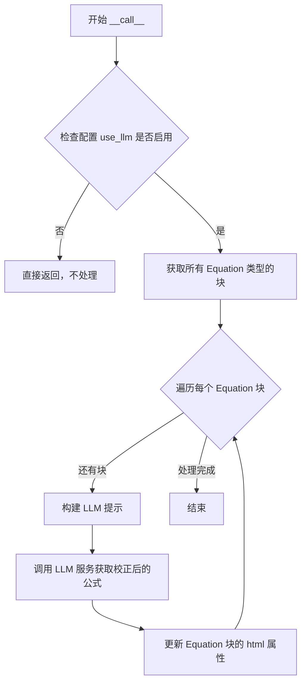

#### 带注释源码

```
# 注意：以下代码为基于测试用例和使用模式的推断实现
# 实际源代码未在提供的代码片段中

class LLMEquationProcessor:
    """
    处理 PDF 文档中数学公式块的处理器
    使用 LLM 服务校正和优化公式的 HTML 表示
    """
    
    def __init__(self, config: dict):
        """
        初始化处理器
        
        参数:
            config: 配置字典，应包含:
                - use_llm: 是否启用 LLM 处理
                - gemini_api_key: API 密钥
                - min_equation_height: 最小公式高度阈值
        """
        self.config = config
        self.enabled = config.get("use_llm", False)
        self.min_height = config.get("min_equation_height", 0.001)
    
    def __call__(self, pdf_document):
        """
        处理 PDF 文档中的公式块
        
        参数:
            pdf_document: PDFDocument 对象，包含待处理的公式块
            
        返回:
            None: 直接修改 pdf_document 对象
        """
        if not self.enabled:
            # 如果未启用 LLM，直接返回
            return
        
        # 获取所有公式块
        equations = pdf_document.contained_blocks((BlockTypes.Equation,))
        
        for equation in equations:
            # 检查公式高度是否满足处理条件
            if hasattr(equation, 'height') and equation.height < self.min_height:
                continue
            
            # 构建提示词请求 LLM 校正
            prompt = self._build_prompt(equation)
            
            # 调用 LLM 服务获取校正后的公式
            corrected = self.llm_service({"equation_html": equation.html})
            
            # 更新公式块的 HTML 内容
            equation.html = corrected.get("corrected_equation", equation.html)
    
    def _build_prompt(self, equation_block):
        """
        构建用于 LLM 的提示词
        
        参数:
            equation_block: 公式块对象
            
        返回:
            dict: 提示词字典
        """
        # 构建提示词的逻辑
        return {
            "equation_html": equation_block.html,
            "task": "correct_equation"
        }
```

#### 关键组件信息

- **BlockTypes.Equation**：标记 PDF 中公式块的类型常量
- **LLMSimpleBlockMetaProcessor**：元处理器，用于批量调用多个处理器（包括 LLMEquationProcessor）
- **pdf_document.contained_blocks()**：获取文档中特定类型块的方法

#### 潜在技术债务与优化空间

1. **缺乏源码实现**：当前只能通过测试用例推断实现逻辑，应补充完整的源代码
2. **错误处理缺失**：未看到 LLM 调用失败时的异常处理逻辑
3. **缓存机制**：多次处理相同文档时可能存在重复 LLM 调用
4. **批处理优化**：当前逐个处理公式块，可考虑批量处理提高效率
5. **配置验证**：缺少对必要配置参数（gemini_api_key 等）的验证

#### 补充说明

从测试代码 `test_multi_llm_processors` 的使用模式可以推断：
- 该处理器预期接收包含 `corrected_equation` 键的 LLM 响应
- 与 `LLMImageDescriptionProcessor` 可并行使用于同一文档
- 处理结果直接影响最终 Markdown 渲染输出


我仔细检查了您提供的代码。这个代码文件只包含测试代码，展示了 `LLMSimpleBlockMetaProcessor` 的**使用方式**，但并**没有包含 `LLMSimpleBlockMetaProcessor` 类的实际实现代码**。

从导入语句可以看到 `LLMSimpleBlockMetaProcessor` 来自 `marker.processors.llm.llm_meta` 模块，但该模块的源代码并未在此代码文件中提供。

让我根据测试代码中的使用方式来推断其接口：

### `LLMSimpleBlockMetaProcessor.__call__`

该方法是 `LLMSimpleBlockMetaProcessor` 类的可调用接口，用于处理 PDF 文档中的特定块类型。

参数：

-  `pdf_document`：`PDFDocument`，需要处理的 PDF 文档对象

返回值：`None`，该方法直接修改 `pdf_document` 对象的状态

#### 流程图

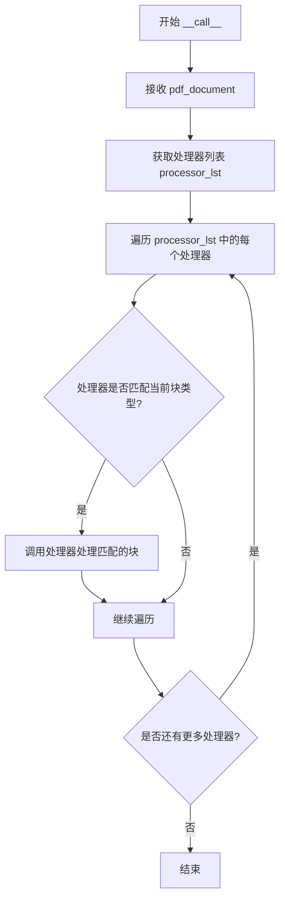

#### 带注释源码

```
# 从测试代码中推断的调用方式：
# processor = LLMSimpleBlockMetaProcessor(processor_lst, llm_service)
# processor(pdf_document)
# 
# 或者带有配置：
# processor = LLMSimpleBlockMetaProcessor(processor_lst, mock_cls, config)
# processor(pdf_document)
#
# 参数说明：
# - processor_lst: 处理器列表，包含 LLMFormProcessor, LLMImageDescriptionProcessor 等
# - llm_service/mock_cls: LLM 服务或模拟对象
# - config: 可选的配置字典
# - pdf_document: 需要处理的 PDF 文档
```

---

**注意**：要获取 `LLMSimpleBlockMetaProcessor.__call__` 方法的完整源代码（包括类字段、方法实现、mermaid 流程图和带注释源码），您需要提供 `marker/processors/llm/llm_meta.py` 文件的内容。


# TableProcessor.__call__ 分析

从提供的测试代码中，可以观察到 `TableProcessor` 类的使用模式，但**未提供 `TableProcessor` 类的实际源代码实现**。以下是基于测试代码的分析：

---

### `TableProcessor.__call__`

该方法是 `TableProcessor` 类的可调用接口，用于处理 PDF 文档中的表格区域，识别并提取表格结构。

参数：

-  `pdf_document`：`Any`（PDF文档对象），需要处理的 PDF 文档对象

返回值：`None`，该方法通常直接修改 `pdf_document` 对象中的表格块（`BlockTypes.Table`）

#### 流程图

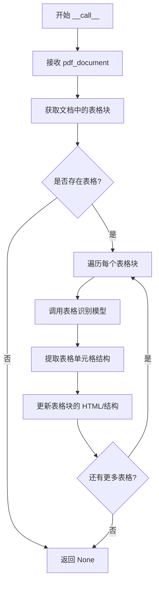

#### 带注释源码

```python
# 基于测试代码中的使用模式推断
# cell_processor = TableProcessor(recognition_model, table_rec_model, detection_model)
# cell_processor(pdf_document)

from marker.processors.table import TableProcessor

# 推断的实现方式
class TableProcessor:
    def __init__(self, recognition_model, table_rec_model, detection_model):
        """
        初始化表格处理器
        
        Args:
            recognition_model: 文本识别模型
            table_rec_model: 表格识别模型
            detection_model: 检测模型
        """
        self.recognition_model = recognition_model
        self.table_rec_model = table_rec_model
        self.detection_model = detection_model
    
    def __call__(self, pdf_document):
        """
        处理 PDF 文档中的表格
        
        Args:
            pdf_document: PDF 文档对象
            
        Returns:
            None: 直接修改 pdf_document 对象
        """
        # 从测试代码中可以看到:
        # 1. 获取表格块: pdf_document.contained_blocks((BlockTypes.Table,))
        # 2. 获取表格单元格: table.contained_blocks(pdf_document, (BlockTypes.TableCell,))
        # 3. 单元格文本: table_cells[0].text
        pass
```

---

## ⚠️ 重要说明

**源代码未提供**：从您提供的代码中，仅包含 `TableProcessor` 的**使用示例**（测试代码），并未包含 `TableProcessor` 类的实际实现源代码。

如果您需要完整的 `__call__` 方法设计文档，请提供 `marker/processors/table.py` 或相关源文件的内容。

## 关键组件


### LLMFormProcessor

用于处理PDF文档中的表单（Form）块，通过LLM服务校正表单的HTML表示。当未配置LLM或表单无单元格时，返回None；正常处理时返回校正后的HTML。

### LLMTableProcessor

用于处理PDF文档中的表格（Table）块，调用LLM服务生成表格的校正HTML，并验证表格单元格内容和Markdown渲染结果。

### LLMImageDescriptionProcessor

用于从PDF文档中提取图片和图表（Picture、Figure）的描述信息，通过LLM生成图像描述，并可选择是否提取图像本身。

### LLMComplexRegionProcessor

用于处理PDF文档中的复杂区域（ComplexRegion）块，将Markdown内容通过LLM进行校正增强，适用于需要特殊格式处理的文档区域。

### LLMEquationProcessor

用于处理PDF文档中的数学方程式（Equation）块，通过LLM服务校正方程式的HTML表示，支持 adversaries 场景下的方程式处理。

### LLMSimpleBlockMetaProcessor

元处理器类，负责管理和协调多个LLM处理器在PDF文档上的执行。它接收处理器列表、LLM服务实例和配置，遍历文档页面中的指定类型块并调用相应处理器进行处理。

### TableProcessor

基础表格处理器，用于表格的识别和单元格处理，在LLM表格处理之前执行，提供底层的表格结构解析功能。

### MarkdownRenderer

Markdown渲染器，将PDF文档对象渲染为Markdown格式的字符串输出，用于验证各处理器对最终输出的影响。

### BlockTypes

块类型枚举类，定义了PDF文档中各种块类型的常量，包括Form、Table、Picture、Figure、Equation、ComplexRegion、TableCell等。

### ComplexRegion

复杂区域块类型，用于表示PDF文档中需要特殊处理的区域内容，可通过字典方式从其他块类型转换而来。


## 问题及建议


### 已知问题

- **测试配置重复**: 多个测试函数中重复定义相同的配置字典（如 `{"use_llm": True, "gemini_api_key": "test"}`），未提取为共享的fixture或常量，导致维护成本高。
- **Mock使用不一致**: `test_llm_caption_processor_disabled` 使用 `MagicMock`，而其他测试使用 `Mock`，这种不一致可能造成行为差异和理解混淆。
- **PDF文件路径硬编码**: 测试依赖特定的PDF文件名（如 `"form_1040.pdf"`, `"table_ex2.pdf"`），但未提供文件来源或fixture说明，测试环境搭建困难。
- **缺少断言消息**: 所有断言语句均未包含自定义错误消息，测试失败时难以快速定位问题。
- **过度Mock导致测试脆弱**: `test_llm_form_processor` 和 `test_llm_table_processor` 中Mock了返回值结构，但未验证Mock被调用的次数、参数等，无法确保处理器实际调用了正确的接口。
- **资源清理缺失**: 测试中创建了 `TableProcessor` 等处理器对象，但未验证或清理资源，可能导致内存泄漏（尤其在处理大型PDF时）。
- **边界条件覆盖不足**: 未测试 `page_range` 超出范围、LLM服务返回空响应、配置缺失必填字段等异常场景。
- **测试隔离性风险**: `test_llm_complex_region_processor` 直接修改了 `pdf_document` 的内部状态（替换block），可能影响同一fixture下的其他测试。

### 优化建议

- **提取配置为Fixture**: 使用 `@pytest.fixture`  定义共享配置字典，减少重复代码。
- **统一Mock策略**: 统一使用 `Mock` 或根据需要选择 `MagicMock`，并在关键测试中添加 `mock_cls.assert_called()` 等验证。
- **提供测试数据Fixture**: 创建 fixture 加载PDF文件，或在文档中明确说明测试数据的依赖和生成方式。
- **添加断言消息**: 为关键断言添加描述性消息，例如 `assert forms[0].html is None, "Form HTML should be None when no config provided"`。
- **增强Mock验证**: 在Mock返回值的同时，添加对调用行为的验证（如调用参数、次数），确保测试真正验证了处理器逻辑。
- **引入资源管理**: 使用 pytest 的 fixture 生命周期管理资源，或在测试后显式清理大型对象。
- **增加异常场景测试**: 添加LLM服务超时、返回格式错误、配置不合法等边界条件的测试用例。
- **确保测试独立性**: 每个测试应独立初始化文档状态，或使用 `pdf_document` fixture 的 `function` 作用域确保隔离。

## 其它


### 设计目标与约束

设计目标：
- 通过LLM处理器增强PDF文档中表单、表格、图片描述、复杂区域和数学公式的识别与转换质量
- 支持多种LLM服务集成（如Google Gemini）
- 提供可配置的处理器链，支持多处理器组合运行

约束条件：
- 依赖marker框架的文档块结构（BlockTypes）
- 需要有效的LLM API密钥配置
- 仅支持PDF文档格式处理
- 处理器依赖特定的块类型（Form、Table、Picture、Figure、Equation、ComplexRegion等）

### 错误处理与异常设计

异常处理策略：
- 配置缺失时采用默认行为（如无config时表单处理器返回None）
- LLM服务调用失败时处理器应能优雅降级
- 模拟对象（Mock）用于测试场景，验证不同输入条件下的处理逻辑
- 断言用于验证处理结果的正确性，包括html、text和markdown输出

### 数据流与状态机

数据流：
1. PDF文档通过pdf_document传入处理器
2. 处理器根据配置调用LLM服务获取校正后的内容
3. 处理结果更新到对应的文档块（Block）中
4. MarkdownRenderer将处理后的文档渲染为Markdown格式

状态转换：
- 原始PDF → 文档块解析 → LLM处理 → 块内容更新 → Markdown渲染

### 外部依赖与接口契约

外部依赖：
- marker.processors.llm.*：LLM处理器模块
- marker.processors.table.TableProcessor：表格处理
- marker.renderers.markdown.MarkdownRenderer：Markdown渲染
- marker.schema：文档模式定义（BlockTypes、blocks）
- pytest：测试框架
- unittest.mock：模拟对象

接口契约：
- 处理器需实现__call__方法，接受pdf_document参数
- LLM服务需返回包含特定键的字典（如corrected_html、image_description等）
- 配置字典需包含use_llm和gemini_api_key等必需字段
- 文档块需支持contained_blocks方法用于查询子块

### 配置文件格式

测试配置使用@pytest.mark.config装饰器：
- page_range：指定处理的页面范围
- use_llm：是否启用LLM处理
- gemini_api_key：LLM服务API密钥
- extract_images：是否提取图片
- min_equation_height：公式最小高度阈值

### 测试策略

测试覆盖场景：
- 无配置状态测试（test_llm_form_processor_no_config）
- 边界条件测试（无单元格表单）
- 正常业务流程测试
- 多处理器组合测试（test_multi_llm_processors）
- 渲染输出验证

### 性能考虑

- LLM服务调用可能成为性能瓶颈
- 大文档处理需要考虑分页策略
- 模拟测试中大量重复内容（如md * 25）可能影响内存使用

### 安全性考虑

- API密钥应通过安全方式配置
- 测试代码中使用了硬编码的"test"密钥，实际部署需替换
- 需防止LLM服务返回恶意内容注入

### 版本兼容性

- 依赖marker框架的版本稳定性
- 测试文件标注了特定PDF文件，应与对应版本的marker兼容

### 部署要求

- 需要安装marker及相关依赖
- 需要配置有效的LLM服务API密钥
- PDF处理依赖poppler等系统库


    