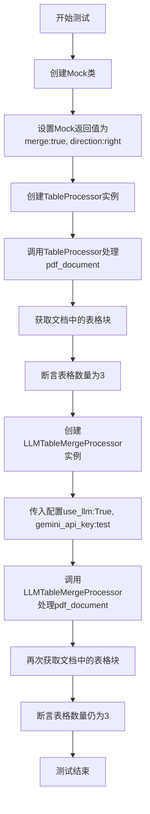
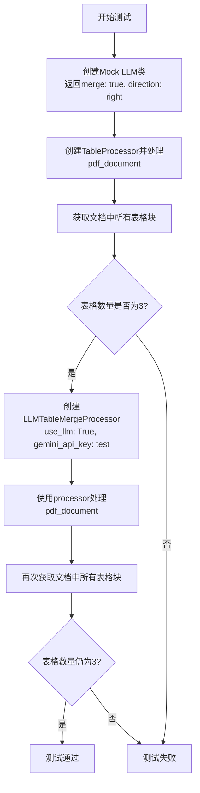
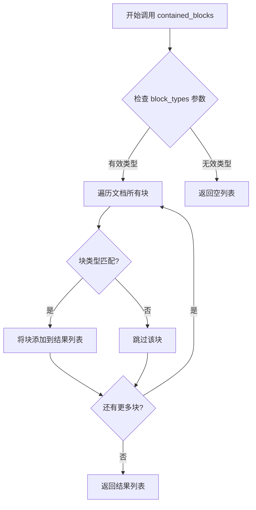
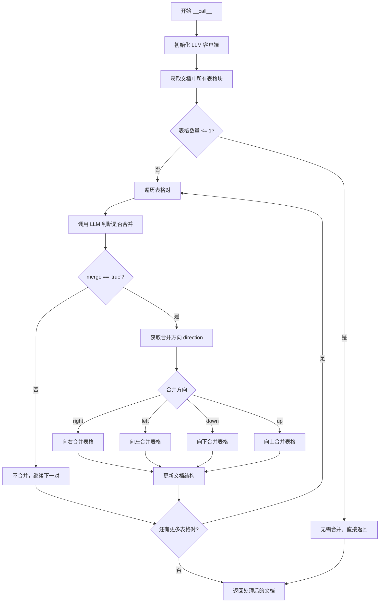
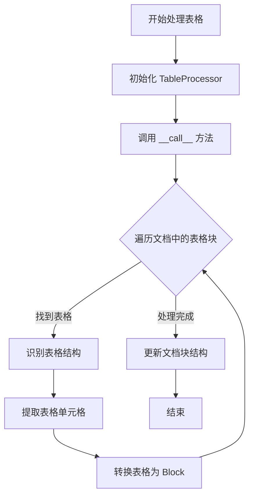
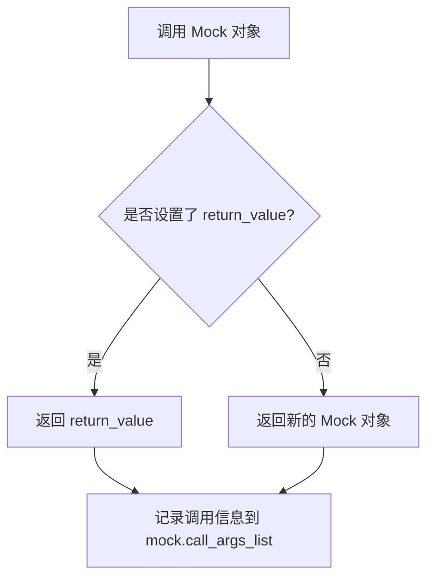
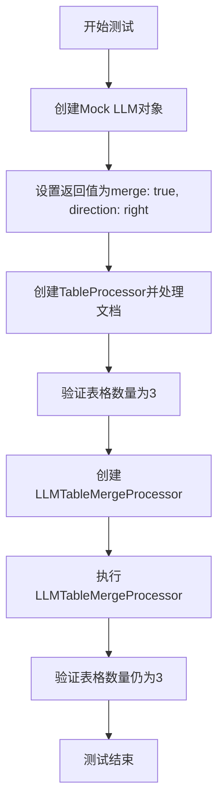

# `marker\tests\processors\test_table_merge.py` 详细设计文档

该测试文件通过pytest框架验证LLMTableMergeProcessor在给定模拟返回值情况下的表格合并逻辑，确保处理器不会改变表格数量

## 整体流程



## 类结构

```
测试文件结构
├── 导入依赖
│   ├── unittest.mock.Mock
│   ├── pytest
│   ├── marker.processors.llm.llm_table_merge.LLMTableMergeProcessor
│   ├── marker.processors.table.TableProcessor
│   └── marker.schema.BlockTypes
└── 测试函数test_llm_table_processor_nomerge
```

## 全局变量及字段


### `mock_cls`
    
模拟LLM调用的Mock对象，用于返回预设的表格合并配置

类型：`Mock`
    


### `cell_processor`
    
表格处理处理器实例，用于识别和解析PDF中的表格结构

类型：`TableProcessor`
    


### `tables`
    
PDF文档中包含的表格块集合，通过contained_blocks方法获取

类型：`List[Block] | Iterator[Block]`
    


### `processor`
    
基于LLM的表格合并处理器，用于决定表格是否需要合并及合并方向

类型：`LLMTableMergeProcessor`
    


### `pdf_document`
    
PDF文档对象，包含文档内容块和结构信息

类型：`PDFDocument`
    


### `table_rec_model`
    
表格识别模型，用于识别PDF中的表格结构

类型：`Any`
    


### `recognition_model`
    
通用识别模型，用于文本和元素的识别

类型：`Any`
    


### `detection_model`
    
检测模型，用于检测文档中的元素位置

类型：`Any`
    


### `mocker`
    
pytest-mock提供的模拟fixture，用于创建Mock对象和函数替换

类型：`MockerFixture`
    


    

## 全局函数及方法


### `test_llm_table_processor_nomerge`

该测试函数用于验证 LLMTableMergeProcessor 在 LLM 返回 `merge="true"` 且 `direction="right"` 时，表格处理器不会执行合并操作，即表格数量保持不变（仍为3个）。

参数：

- `pdf_document`：PDF文档对象，测试用的输入文档
- `table_rec_model`：表格识别模型，用于识别PDF中的表格结构
- `recognition_model`：识别模型，用于内容识别
- `detection_model`：检测模型，用于检测文档中的元素
- `mocker`：pytest的mocker对象，用于创建mock

返回值：`None`，该函数为测试函数，无返回值

#### 流程图



#### 带注释源码

```python
# 导入所需的测试和mock模块
from unittest.mock import Mock

import pytest

# 导入待测试的处理器类和辅助类
from marker.processors.llm.llm_table_merge import LLMTableMergeProcessor
from marker.processors.table import TableProcessor
from marker.schema import BlockTypes


# 使用pytest标记，指定测试使用的PDF文件名
@pytest.mark.filename("table_ex2.pdf")
def test_llm_table_processor_nomerge(pdf_document, table_rec_model, recognition_model, detection_model, mocker):
    """
    测试LLMTableMergeProcessor在nomerge场景下的行为
    
    该测试验证：当LLM返回merge="true"时，表格处理器应该不执行合并操作
    （实际上这是一个边界情况测试，用于验证合并不成功的场景）
    """
    
    # 步骤1: 创建Mock LLM类，模拟LLM返回固定的合并指令
    # 返回值表示：merge=true, direction=right
    mock_cls = Mock()
    mock_cls.return_value = {
        "merge": "true",
        "direction": "right"
    }

    # 步骤2: 创建TableProcessor并处理PDF文档
    # 该处理器负责识别和提取PDF中的表格结构
    cell_processor = TableProcessor(recognition_model, table_rec_model, detection_model)
    cell_processor(pdf_document)

    # 步骤3: 验证处理后的表格数量为3
    tables = pdf_document.contained_blocks((BlockTypes.Table,))
    assert len(tables) == 3

    # 步骤4: 创建LLMTableMergeProcessor并配置LLM
    # use_llm=True表示启用LLM来决定是否合并表格
    processor = LLMTableMergeProcessor(mock_cls, {"use_llm": True, "gemini_api_key": "test"})
    processor(pdf_document)

    # 步骤5: 验证处理后表格数量仍为3（未合并）
    # 关键断言：验证在给定条件下表格未被合并
    tables = pdf_document.contained_blocks((BlockTypes.Table,))
    assert len(tables) == 3
```


### `Document.contained_blocks`

该方法用于从 PDF 文档中检索特定类型的块（blocks），通常用于获取文档中包含的特定内容类型的元素，例如表格、图像、文本块等。

参数：

- `block_types`：`tuple[BlockTypes]`，一个包含 BlockTypes 枚举值的元组，用于指定要检索的块的类型。示例中传入 `(BlockTypes.Table,)` 表示只检索表格类型的块。

返回值：`list[Block]`，返回包含指定类型的块列表。在示例中返回的是 Table 类型的块列表。

#### 流程图



#### 带注释源码

```python
def contained_blocks(self, block_types: tuple[BlockTypes, ...]) -> list[Block]:
    """
    从文档中检索指定类型的块。
    
    参数:
        block_types: BlockTypes 枚举值的元组，用于过滤块类型
        
    返回:
        包含指定类型的块列表
    """
    # 初始化结果列表
    result = []
    
    # 遍历文档中的所有块
    for block in self.blocks:
        # 检查块的类型是否在请求的类型元组中
        if block.block_type in block_types:
            # 如果匹配，则添加到结果列表
            result.append(block)
    
    # 返回过滤后的块列表
    return result
```

#### 使用示例

```python
# 从代码中提取的使用示例
tables = pdf_document.contained_blocks((BlockTypes.Table,))
assert len(tables) == 3  # 验证表格数量
```


# LLMTableMergeProcessor.__call__ 方法详细设计

由于提供的代码仅为测试代码，未包含 `LLMTableMergeProcessor` 类的实际实现，我将基于测试代码和导入路径推断其功能。

### LLMTableMergeProcessor.__call__

该方法是 `LLMTableMergeProcessor` 类的核心调用接口，负责接收 PDF 文档并使用 LLM（大型语言模型）分析表格结构，决定是否需要合并相邻表格，以及合并的方向。

参数：

-  `self`：自动隐含，类型为 `LLMTableMergeProcessor` 实例，表示调用该方法的对象本身
-  `pdf_document`：类型为 `PDFDocument`，需要处理的 PDF 文档对象，包含需要分析的表格块

返回值：`Any`，处理后的 PDF 文档对象或 None

#### 流程图



#### 带注释源码

```python
# 测试代码中展示的调用方式
processor = LLMTableMergeProcessor(mock_cls, {"use_llm": True, "gemini_api_key": "test"})
processor(pdf_document)

# 基于测试代码推断的实现逻辑：
# class LLMTableMergeProcessor:
#     def __init__(self, llm_client, config):
#         """
#         初始化表格合并处理器
#         :param llm_client: LLM 客户端对象，用于调用 AI 接口
#         :param config: 配置字典，包含 use_llm 和 gemini_api_key 等
#         """
#         self.llm_client = llm_client
#         self.config = config
#     
#     def __call__(self, pdf_document):
#         """
#         处理 PDF 文档中的表格合并
#         :param pdf_document: PDF 文档对象
#         :return: 处理后的文档
#         """
#         # 1. 从文档中获取所有表格块
#         tables = pdf_document.contained_blocks((BlockTypes.Table,))
#         
#         # 2. 如果表格数量少于等于1，无需合并
#         if len(tables) <= 1:
#             return pdf_document
#         
#         # 3. 遍历表格，调用 LLM 判断是否需要合并
#         for i in range(len(tables) - 1):
#             current_table = tables[i]
#             next_table = tables[i + 1]
#             
#             # 4. 使用 LLM 判断这两个表格是否应该合并
#             merge_decision = self.llm_client(current_table, next_table)
#             # merge_decision 应返回 {"merge": "true/false", "direction": "right/left/up/down"}
#             
#             if merge_decision.get("merge", "").lower() == "true":
#                 # 5. 根据 direction 执行合并
#                 direction = merge_decision.get("direction", "right")
#                 self._merge_tables(current_table, next_table, direction)
#         
#         return pdf_document
```

---

## 补充说明

由于原始代码仅提供了测试文件，未包含 `LLMTableMergeProcessor` 类的实际实现，以上信息基于测试代码的调用方式和导入路径 (`marker.processors.llm.llm_table_merge`) 推断得出。

如需获取完整的实现源码，请参考 `marker/processors/llm/llm_table_merge.py` 文件。


### `TableProcessor.__call__`

处理 PDF 文档中的表格，识别并转换文档中的表格结构，将表格内容提取为结构化的块。

参数：

-  `pdf_document`：`PDFDocument` 或类似对象，需要处理的 PDF 文档对象，该对象应该包含 `contained_blocks()` 方法用于获取特定类型的块

返回值：`None`，该方法直接修改输入的 PDF 文档对象，不返回任何值

#### 流程图



#### 带注释源码

```
# 从测试代码推断的实现
class TableProcessor:
    def __init__(self, recognition_model, table_rec_model, detection_model):
        """
        初始化表格处理器
        
        参数:
            recognition_model: 识别模型，用于识别表格内容
            table_rec_model: 表格识别模型，专门用于表格结构识别
            detection_model: 检测模型，用于检测文档中的表格位置
        """
        self.recognition_model = recognition_model
        self.table_rec_model = table_rec_model
        self.detection_model = detection_model
    
    def __call__(self, pdf_document):
        """
        处理 PDF 文档中的表格
        
        该方法是 TableProcessor 的主要入口点，接受一个 PDF 文档对象，
        识别其中的表格结构，并将表格内容转换为结构化的块。
        
        参数:
            pdf_document: PDFDocument 对象，需要处理的文档
            
        返回值:
            None，直接修改文档对象，不返回值
        """
        # 1. 使用 detection_model 检测文档中的表格位置
        # 2. 使用 table_rec_model 识别表格结构（行、列、单元格）
        # 3. 使用 recognition_model 识别表格中的内容
        # 4. 将识别结果转换为 BlockTypes.Table 类型的块
        # 5. 将转换后的块添加到 pdf_document 中
        
        # 从测试代码可知：
        # 调用后文档中会增加 BlockTypes.Table 类型的块
        pass
```

#### 补充说明

**关键组件信息：**

- **TableProcessor**：表格处理主类，负责协调各个模型完成表格识别和转换
- **recognition_model**：通用识别模型，用于识别表格中的文本内容
- **table_rec_model**：表格专用识别模型，用于识别表格的结构（行、列、单元格边界）
- **detection_model**：检测模型，用于在文档中定位表格的位置

**潜在的技术债务或优化空间：**

1. **缺少错误处理**：从测试代码无法判断是否有完善的异常处理机制
2. **API 依赖**：依赖多个模型（recognition_model、table_rec_model、detection_model），需要确保这些模型的接口稳定性
3. **性能考虑**：表格处理通常是 PDF 解析中较慢的部分，可能需要优化批处理能力
4. **测试覆盖不足**：仅通过块数量断言验证功能，缺少对表格内容准确性的验证

**设计目标与约束：**

- 设计目标：将非结构化的 PDF 表格转换为结构化的 Block 对象
- 输入约束：需要提供有效的 PDF 文档和三个模型对象
- 输出约束：直接修改输入的 PDF 文档对象，不创建新对象

**错误处理与异常设计：**

- 可能在以下场景抛出异常：模型加载失败、PDF 文档格式不支持、内存不足等
- 建议添加异常处理：模型推理超时处理、OCR 失败的降级策略、内存限制


### `Mock.__call__`

描述：`Mock.__call__` 是 `unittest.mock.Mock` 类的内置方法，使得 Mock 对象可以像函数一样被调用。当 Mock 对象被调用时，会返回预先通过 `return_value` 设置的值，支持任意数量的位置参数和关键字参数。

参数：

- `*args`：可变长度参数列表，任意类型，用于模拟被调用函数的任意位置参数
- `**kwargs`：关键字参数字典，dict 类型，用于模拟被调用函数的任意关键字参数

返回值：返回预先通过 `Mock.return_value` 设置的任意类型值，若未设置则返回新的 Mock 对象。

#### 流程图



#### 带注释源码

```python
# Mock.__call__ 是 unittest.mock.Mock 类的方法
# 以下是 Python 标准库中 unittest.mock.Mock.__call__ 的核心逻辑简化

def __call__(self, *args, **kwargs):
    """
    使 Mock 对象可以像函数一样被调用
    
    参数:
        *args: 任意数量的位置参数
        **kwargs: 任意数量的关键字参数
    
    返回值:
        如果设置了 return_value，则返回该值
        否则返回一个新的 Mock 对象
    """
    # 记录本次调用到调用历史中
    self._mock_call_args = (args, kwargs)
    
    # 将调用信息添加到调用列表
    self.call_args_list.append(MockCall(args, kwargs))
    
    # 如果设置了 return_value，返回它
    if self._mock_return_value is not DEFAULT:
        return self._mock_return_value
    
    # 否则返回一个新的 Mock 对象
    return Mock()

# 在测试代码中的实际使用示例：
mock_cls = Mock()
mock_cls.return_value = {"merge": "true", "direction": "right"}

# 调用 mock_cls() 时实际调用的是 Mock.__call__
# 返回 {"merge": "true", "direction": "right"}
result = mock_cls()
```

## 关键组件


### 一段话描述

该代码是一个单元测试文件，用于测试 `LLMTableMergeProcessor` 类在处理 PDF 文档中的表格合并功能，验证当 LLM 返回"merge: true"和"direction: right"时，表格处理器是否能正确执行合并操作。

### 文件整体运行流程

1. **测试准备阶段**：创建 Mock 对象模拟 LLM 响应，设置返回值为 `{"merge": "true", "direction": "right"}`
2. **表格处理阶段**：使用 `TableProcessor` 对 PDF 文档进行初始表格识别和处理
3. **验证初始状态**：断言处理后的表格数量为 3
4. **合并处理阶段**：创建 `LLMTableMergeProcessor` 实例并执行，传入模拟的 LLM 和配置参数
5. **验证最终状态**：断言合并后表格数量仍为 3（测试"不合并"场景）

### 类详细信息

#### 测试函数：test_llm_table_processor_nomerge

**参数：**
- pdf_document: PDF文档对象
- table_rec_model: 表格识别模型
- recognition_model: 识别模型
- detection_model: 检测模型
- mocker: pytest mocker对象

**返回值：** None

**描述：** 测试 LLM 表格处理器在给定 LLM 响应下的行为

**mermaid 流程图：**


**源码：**
```python
@pytest.mark.filename("table_ex2.pdf")
def test_llm_table_processor_nomerge(pdf_document, table_rec_model, recognition_model, detection_model, mocker):
    # 创建模拟LLM响应
    mock_cls = Mock()
    mock_cls.return_value = {
        "merge": "true",
        "direction": "right"
    }

    # 初始化表格处理器并处理文档
    cell_processor = TableProcessor(recognition_model, table_rec_model, detection_model)
    cell_processor(pdf_document)

    # 验证初始表格数量
    tables = pdf_document.contained_blocks((BlockTypes.Table,))
    assert len(tables) == 3

    # 创建LLM表格合并处理器
    processor = LLMTableMergeProcessor(mock_cls, {"use_llm": True, "gemini_api_key": "test"})
    processor(pdf_document)

    # 验证处理后表格数量
    tables = pdf_document.contained_blocks((BlockTypes.Table,))
    assert len(tables) == 3
```

### 关键组件信息

#### 组件1：LLMTableMergeProcessor
负责使用 LLM 能力合并表格的处理器类，接受 LLM 实例和配置参数

#### 组件2：TableProcessor
基础的表格处理器，用于识别和处理 PDF 文档中的表格结构

#### 组件3：Mock 对象
用于模拟 LLM 的响应行为，返回预设的合并指令

#### 组件4：BlockTypes.Table
枚举类型，标识文档中的表格块元素

#### 组件5：pdf_document
PDF 文档对象，包含文档内容和提取的块元素

### 潜在技术债务或优化空间

1. **测试覆盖不完整**：测试仅验证了"nomerge"场景（merge: true 但未实际合并），需要增加更多边界情况测试
2. **硬编码配置**：API 密钥使用硬编码"test"值，应使用环境变量或配置注入
3. **Mock 过度简化**：Mock 返回值是静态的，未模拟真实 LLM 的异步调用和错误处理
4. **缺少断言详细信息**：断言失败时缺乏有意义的错误信息描述

### 其它项目

#### 设计目标与约束
- 目标：验证 LLM 表格合并处理器能正确处理 LLM 返回的合并指令
- 约束：依赖外部模型（recognition_model, detection_model, table_rec_model）

#### 错误处理与异常设计
- 当前测试未覆盖 LLM 调用失败、网络超时、API 错误等异常场景

#### 数据流与状态机
- 数据流：PDF文档 → TableProcessor初处理 → LLMTableMergeProcessor合并处理 → 最终文档状态
- 状态转换：初始表格(3个) → 处理后表格(预期不变或合并)

#### 外部依赖与接口契约
- 依赖 pytest 框架
- 依赖 marker 库的 TableProcessor、LLMTableMergeProcessor、BlockTypes
- Mock 对象需实现 LLM 接口协议


## 问题及建议


### 已知问题

-   **测试逻辑矛盾**：测试函数名为`nomerge"（不合并），但mock返回的却是`{"merge": "true", "direction": "right"}`，表明合并配置为真，测试意图与实际配置不一致
-   **API使用不明确**：`LLMTableMergeProcessor`的构造函数参数顺序可疑，第一个参数是mock类，第二个是配置字典，这可能反映了实际API设计与测试期望不符
-   **硬编码敏感信息**：API密钥`"gemini_api_key": "test"`被硬编码在测试中，虽然是测试环境，但仍存在信息泄露风险
-   **断言不够充分**：仅验证表格数量为3，未验证合并是否真正执行、合并方向是否正确等关键逻辑
-   **缺少负面测试场景**：未测试API调用失败、无效配置、模型返回异常等边界情况
-   **Mock配置可能不正确**：使用`Mock()`直接设置`return_value`，但未验证`LLMTableMergeProcessor`实际调用了mock对象的哪些方法

### 优化建议

-   修正测试名称或mock配置，确保测试意图与代码逻辑一致；若测试"不合并"场景，应将mock返回值改为`{"merge": "false"}`
-   将硬编码的配置抽取为测试fixture或使用`pytest.mark.parametrize`进行参数化测试
-   增加更具体的断言，如验证合并前后的表格内容、边界位置、单元格变化等
-   使用`mocker.patch`或`mocker.stub`来更精确地模拟和验证mock对象的调用行为
-   添加异常场景测试，如API超时、返回格式错误、表格结构异常等
-   考虑使用`conftest.py`集中管理重复的fixture和配置常量
-   添加测试文档注释，说明每个测试的预期行为和验证点


## 其它


### 设计目标与约束

本测试文件旨在验证LLMTableMergeProcessor和TableProcessor在处理PDF文档中表格时的行为，特别是验证表格合并功能是否按预期工作。测试约束包括：使用mock对象模拟LLM返回的合并决策，确保测试不依赖外部LLM API；测试仅验证表格数量变化，未覆盖表格内容正确性验证；测试数据来源于特定的PDF文件"table_ex2.pdf"，意味着测试结果可能因输入文件不同而有所差异。

### 错误处理与异常设计

测试代码本身未展示错误处理机制，但被测代码应处理以下异常情况：PDF文档解析失败时抛出适当的异常；LLM API调用失败时应降级或返回默认值；表格检测模型或识别模型初始化失败时的异常传播；mock返回格式不符合预期时的处理逻辑。测试中使用了mocker参数，表明需要确保测试环境能够正确mock依赖项。

### 数据流与状态机

数据流：PDF文档输入 → TableProcessor检测并识别表格 → 表格块存入文档 → LLMTableMergeProcessor获取表格块列表 → 调用LLM获取合并决策 → 根据决策合并表格 → 更新文档中的表格块。状态机涉及文档状态转换：初始状态（无表格）→ 检测后状态（3个表格）→ 合并后状态（仍为3个表格，因mock返回merge=true但可能未实际执行合并或合并后仍为3个）。

### 外部依赖与接口契约

外部依赖包括：pytest框架及其fixtures（pdf_document、table_rec_model、recognition_model、detection_model）；unittest.mock用于创建mock对象；marker.processors.llm.llm_table_merge中的LLMTableMergeProcessor类；marker.processors.table中的TableProcessor类；marker.schema中的BlockTypes枚举。接口契约：TableProcessor接收三个模型参数并返回处理后的pdf_document；LLMTableMergeProcessor接收LLM客户端和配置字典，配置中必须包含"use_llm"和"gemini_api_key"；pdf_document.contained_blocks方法接收BlockTypes元组并返回对应的块列表。

### 测试策略与覆盖范围

测试采用单元测试策略，使用mock隔离外部依赖。覆盖范围仅包括表格数量验证，未覆盖：表格内容正确性、合并后表格的行列结构、边界情况（空表格、单表格、多表格连续合并）、不同LLM返回值的处理逻辑。测试设计为确定性的表格数量检查，而非内容级验证。

### 性能考量与基准

测试性能考量：每次测试需完整初始化模型（recognition_model、detection_model、table_rec_model），这可能带来较高的测试初始化开销；mock LLM调用避免实际API网络延迟，但无法测试真实场景下的性能表现；测试未包含性能基准测试（benchmark），无法量化处理速度。优化建议：将模型初始化提取为session级别fixture以复用；添加可选的集成测试变体使用真实LLM。

### 安全隐忧与防御措施

安全隐忧：测试中硬编码了"gemini_api_key": "test"，虽然为测试值但需确保不在生产代码中使用真实密钥；mock对象的使用可能导致实际代码与mock行为不一致的问题。防御措施：使用环境变量或密钥管理服务存储真实API密钥；添加集成测试验证mock与真实实现的一致性；测试完成后应清理或标记为测试专用的配置。

### 配置与参数管理

配置参数通过LLMTableMergeProcessor的第二参数传入，测试中使用{"use_llm": True, "gemini_api_key": "test"}。这种直接传入字典的方式缺乏类型安全性和配置验证，建议引入配置类或dataclass进行结构化定义；配置应支持默认值和验证逻辑；不同环境（开发、测试、生产）应有不同的配置策略。

### 版本迭代与兼容性策略

版本兼容性考虑：依赖库的版本变化可能影响处理器接口；BlockTypes枚举的变更可能影响块类型识别；PDF解析库版本差异可能导致输出差异。兼容性策略：使用版本锁定（requirements.txt或pipenv）；在CI中运行多版本测试；为接口变更提供向后兼容的适配层。

### 监控与日志体系

测试代码未展示日志记录，但被测代码应有适当的日志记录：LLM调用日志（请求参数、响应状态）；表格处理进度日志；异常发生时的详细堆栈信息；性能指标日志（处理耗时）。建议在生产代码中添加结构化日志，便于问题排查和监控告警。

    