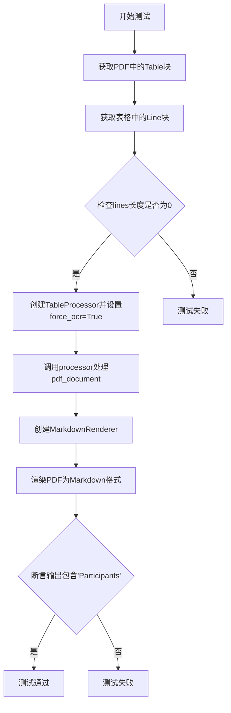
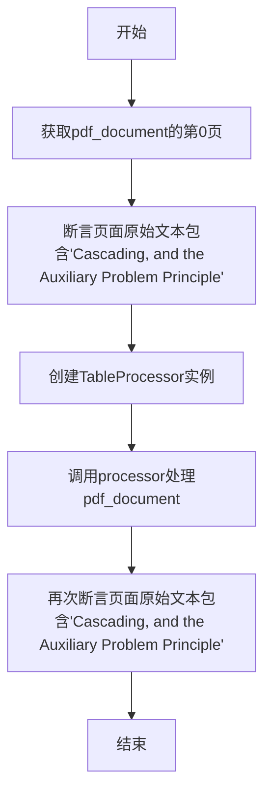
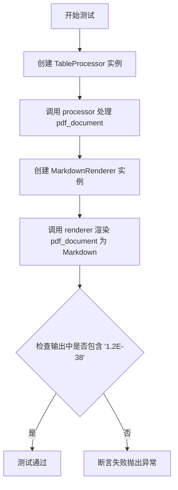
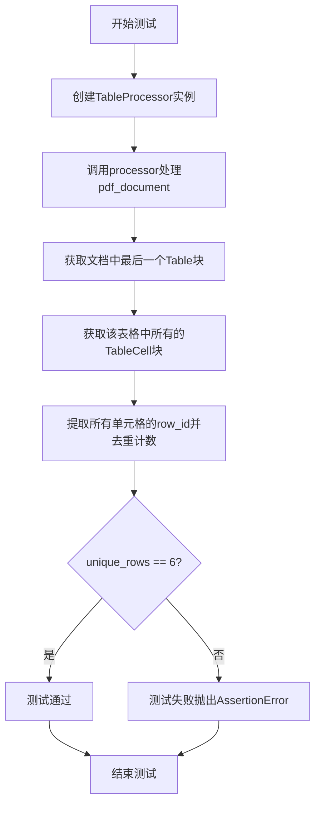
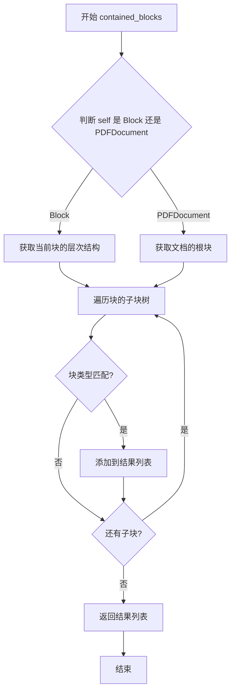
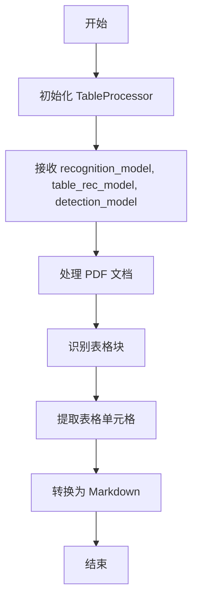
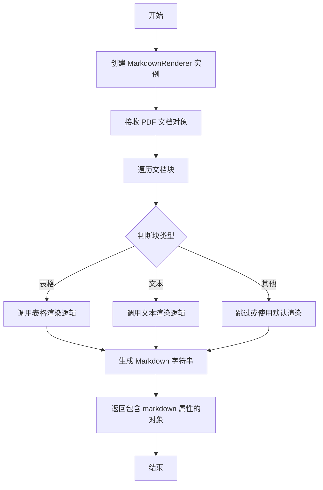
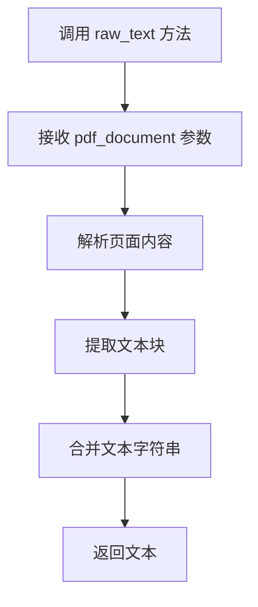
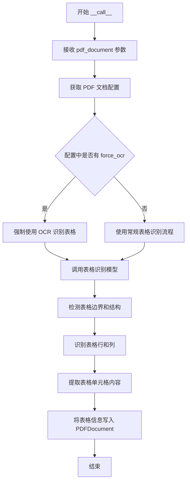
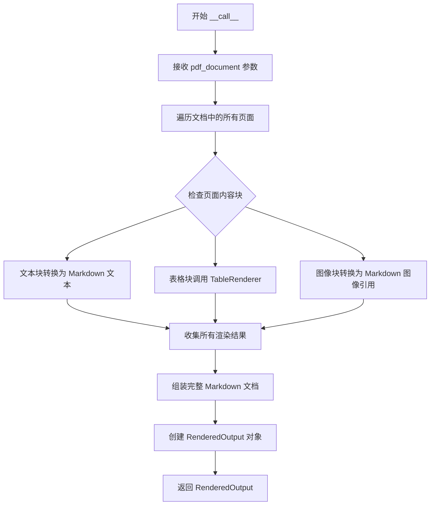

# `marker\tests\processors\test_table_processor.py` 详细设计文档

这是一个 pytest 测试文件，用于测试 marker 库中的 TableProcessor 表格处理功能，涵盖表格识别、OCR 避免重复处理、重叠块处理、OCR 表格识别和表格行分割等核心场景。

## 整体流程

```mermaid
graph TD
    A[开始测试] --> B{测试用例}
B --> C[test_table_processor]
C --> C1[创建 TableProcessor]
C1 --> C2[调用 processor(pdf_document)]
C2 --> C3[遍历页面查找 Table 块]
C3 --> C4[验证 TableCell 存在]
C4 --> C5[使用 MarkdownRenderer 渲染]
C5 --> C6[断言输出包含 'Schedule']
B --> D[test_avoid_double_ocr]
D --> D1[获取现有 Table 块]
D1 --> D2[验证初始无 Line 子块]
D2 --> D3[创建 force_ocr=True 的 processor]
D3 --> D4[处理文档]
D4 --> D5[渲染并断言包含 'Participants']
B --> E[test_overlap_blocks]
E --> E1[获取第一页]
E1 --> E2[验证文本存在]
E2 --> E3[处理文档]
E3 --> E4[再次验证文本存在]
B --> F[test_ocr_table]
F --> F1[处理表格]
F1 --> F2[渲染并断言包含 '1.2E-38']
B --> G[test_split_rows]
G --> G1[处理表格]
G1 --> G2[获取最后一个 Table]
G2 --> G3[获取所有 TableCell]
G3 --> G4[验证唯一行数为 6]
```

## 类结构

```
测试模块 (test_table_processor.py)
├── 测试函数
│   ├── test_table_processor
│   ├── test_avoid_double_ocr
│   ├── test_overlap_blocks
│   ├── test_ocr_table
│   └── test_split_rows
└── 外部依赖类
    ├── TableProcessor (marker.processors.table)
    ├── MarkdownRenderer (marker.renderers.markdown)
    ├── BlockTypes (marker.schema)
    ├── TableCell (marker.schema.blocks)
    └── pdf_document, recognition_model, table_rec_model, detection_model (fixture)
```

## 全局变量及字段


### `block`
    
PDF文档中的一个通用块对象，用于遍历页面内容

类型：`Block`
    


### `children`
    
包含当前块的所有子块的列表

类型：`List[Block]`
    


### `table_output`
    
Markdown渲染器的输出结果，包含转换后的markdown文本

类型：`MarkdownOutput`
    


### `tables`
    
PDF文档中所有Table块的列表

类型：`List[Block]`
    


### `lines`
    
表格中所有Line块的列表，用于检测是否有OCR处理

类型：`List[Block]`
    


### `page`
    
PDF文档的页面对象，包含页面内容和文本提取方法

类型：`Page`
    


### `table`
    
PDF文档中的一个Table块对象

类型：`Block`
    


### `cells`
    
表格中所有单元格对象的列表

类型：`List[TableCell]`
    


### `unique_rows`
    
表格中唯一行的数量，通过row_id去重计算得出

类型：`int`
    


### `TableProcessor.recognition_model`
    
用于识别文本内容的通用识别模型

类型：`RecognitionModel`
    


### `TableProcessor.table_rec_model`
    
专门用于表格结构识别的模型

类型：`TableRecognitionModel`
    


### `TableProcessor.detection_model`
    
用于检测表格位置和边界的检测模型

类型：`DetectionModel`
    


### `TableProcessor.config`
    
包含处理器配置选项的字典，如page_range、force_ocr等

类型：`Dict`
    


### `TableCell.row_id`
    
表格单元格所属的行编号，用于行合并和去重

类型：`int`
    
    

## 全局函数及方法


### `test_table_processor`

该测试函数验证 TableProcessor 能够正确处理 PDF 文档中的表格，包括表格检测、单元格识别、数量验证以及 Markdown 渲染功能。

参数：

- `pdf_document`：fixture，提供待处理的 PDF 文档对象
- `recognition_model`：识别模型，用于文本和结构识别
- `table_rec_model`：表格专用识别模型，用于表格结构提取
- `detection_model`：检测模型，用于识别文档中的元素

返回值：`None`，该函数为测试函数，通过断言验证功能，不返回具体数值

#### 流程图

```mermaid
flowchart TD
    A[开始测试] --> B[创建TableProcessor实例]
    B --> C[调用processor处理pdf_document]
    C --> D[遍历pdf_document.pages[0].children]
    D --> E{当前块block_type是否为Table?}
    E -->|否| D
    E -->|是| F[获取TableCell类型的子块]
    F --> G[断言children存在且长度大于0]
    G --> H[断言children[0]是TableCell实例]
    H --> I[断言共有2个Table块]
    I --> J[创建MarkdownRenderer]
    J --> K[调用renderer渲染pdf_document]
    K --> L{markdown输出是否包含'Schedule'?}
    L -->|是| M[测试通过]
    L -->|否| N[测试失败]
```

#### 带注释源码

```python
@pytest.mark.config({"page_range": [5]})  # 配置：只处理第5页
def test_table_processor(
    pdf_document, recognition_model, table_rec_model, detection_model
):
    """
    测试 TableProcessor 处理 PDF 文档中表格的功能
    
    验证点：
    1. TableProcessor 能正确检测和解析表格
    2. 表格包含 TableCell 子块
    3. 文档中共有2个表格
    4. Markdown 渲染输出包含 'Schedule' 文本
    """
    # 创建表格处理器实例，传入三个模型
    processor = TableProcessor(recognition_model, table_rec_model, detection_model)
    # 执行表格处理
    processor(pdf_document)

    # 遍历第一页的所有子块
    for block in pdf_document.pages[0].children:
        # 筛选出表格类型的块
        if block.block_type == BlockTypes.Table:
            # 获取该表格下的所有表格单元格子块
            children = block.contained_blocks(pdf_document, (BlockTypes.TableCell,))
            # 断言：表格必须包含子块
            assert children
            # 断言：表格单元格数量大于0
            assert len(children) > 0
            # 断言：第一个子块必须是 TableCell 类型
            assert isinstance(children[0], TableCell)

    # 断言：整个文档中共有2个表格块
    assert len(pdf_document.contained_blocks((BlockTypes.Table,))) == 2

    # 创建 Markdown 渲染器
    renderer = MarkdownRenderer()
    # 将 PDF 渲染为 Markdown 格式
    table_output = renderer(pdf_document)
    # 断言：渲染输出中包含 'Schedule' 文本（表格标题）
    assert "Schedule" in table_output.markdown
```


### `test_avoid_double_ocr`

该测试函数用于验证在已存在OCR结果的情况下，通过配置`force_ocr=True`可以避免重复执行OCR操作，同时确保表格内容正确提取。

参数：

- `pdf_document`：`PDFDocument`，待处理的PDF文档对象，由pytest fixture提供
- `recognition_model`：识别模型，用于文本识别
- `table_rec_model`：表格识别模型，专门用于表格结构识别
- `detection_model`：检测模型，用于检测文档中的元素

返回值：`None`，该函数为测试函数，通过assert断言验证结果，不返回任何值

#### 流程图



#### 带注释源码

```python
@pytest.mark.filename("table_ex.pdf")
@pytest.mark.config({"page_range": [0], "force_ocr": True})
def test_avoid_double_ocr(
    pdf_document, recognition_model, table_rec_model, detection_model
):
    """
    测试避免重复OCR的功能
    场景：PDF已包含OCR结果（lines为空），但force_ocr=True配置下应重新处理
    """
    # 获取文档中所有的Table块
    tables = pdf_document.contained_blocks((BlockTypes.Table,))
    
    # 获取第一个表格中的所有Line块（文本行）
    lines = tables[0].contained_blocks(pdf_document, (BlockTypes.Line,))
    
    # 断言：初始状态下表格中没有Line块（表明已有OCR结果）
    assert len(lines) == 0

    # 创建TableProcessor，配置force_ocr=True强制重新OCR
    processor = TableProcessor(
        recognition_model, table_rec_model, detection_model, config={"force_ocr": True}
    )
    
    # 执行表格处理
    processor(pdf_document)

    # 使用Markdown渲染器生成输出
    renderer = MarkdownRenderer()
    table_output = renderer(pdf_document)
    
    # 验证输出包含预期的表格内容"Participants"
    assert "Participants" in table_output.markdown
```


### `test_overlap_blocks`

该测试函数用于验证TableProcessor在处理包含重叠块的PDF文档时的正确性，确保表格处理不会破坏页面中原有的文本内容。

参数：

- `pdf_document`：`PDF文档对象`，Pytest fixture，提供待处理的PDF文档
- `detection_model`：`检测模型`，用于检测文档中的表格和块结构
- `recognition_model`：`识别模型`，用于识别文本内容
- `table_rec_model`：`表格识别模型`，专门用于表格结构的识别

返回值：`None`，该函数为测试函数，无返回值，通过断言验证功能正确性

#### 流程图



#### 带注释源码

```python
@pytest.mark.filename("multicol-blocks.pdf")  # 指定测试使用的PDF文件名
@pytest.mark.config({"page_range": [3]})       # 配置处理的页面范围为第3页
def test_overlap_blocks(
    pdf_document, detection_model, recognition_model, table_rec_model
):
    # 获取PDF文档的第0页（第一页）
    page = pdf_document.pages[0]
    
    # 第一次断言：验证处理前页面文本包含指定标题
    assert "Cascading, and the Auxiliary Problem Principle" in page.raw_text(
        pdf_document
    )

    # 创建TableProcessor处理器，传入识别模型、表格识别模型和检测模型
    processor = TableProcessor(recognition_model, table_rec_model, detection_model)
    
    # 执行表格处理流程
    processor(pdf_document)

    # 第二次断言：验证处理后页面文本仍然包含指定标题
    # 确保表格处理不会破坏或删除页面中的原有文本内容
    assert "Cascading, and the Auxiliary Problem Principle" in page.raw_text(
        pdf_document
    )
```


### `test_ocr_table`

该测试函数用于验证表格处理器（TableProcessor）在处理 PDF 文档时能够正确识别包含科学记数法数值（如 "1.2E-38"）的表格内容，并通过 Markdown 渲染器输出正确的结果。

参数：

- `pdf_document`：`PDFDocument`，Pytest fixture，提供待处理的 PDF 文档对象
- `recognition_model`：模型对象，用于文本识别任务
- `table_rec_model`：模型对象，用于表格识别任务
- `detection_model`：模型对象，用于对象检测任务

返回值：`None`，该函数通过断言验证功能，不返回具体值

#### 流程图



#### 带注释源码

```python
# 使用 pytest 标记装饰器指定测试使用的文件名
@pytest.mark.filename("pres.pdf")
# 使用 pytest 标记装饰器指定处理的页面范围为第4页
@pytest.mark.config({"page_range": [4]})
def test_ocr_table(pdf_document, recognition_model, table_rec_model, detection_model):
    """
    测试表格 OCR 功能，验证能够正确识别包含科学记数法的表格内容
    
    参数:
        pdf_document: PDF文档对象
        recognition_model: 文本识别模型
        table_rec_model: 表格识别模型
        detection_model: 检测模型
    """
    # 创建表格处理器实例，传入三个模型
    processor = TableProcessor(recognition_model, table_rec_model, detection_model)
    # 执行表格处理流程
    processor(pdf_document)

    # 创建 Markdown 渲染器实例
    renderer = MarkdownRenderer()
    # 将 PDF 文档渲染为 Markdown 格式
    table_output = renderer(pdf_document)
    # 断言验证输出中包含科学记数法数值 "1.2E-38"
    assert "1.2E-38" in table_output.markdown
```


### `test_split_rows`

这是一个pytest测试函数，用于测试TableProcessor处理PDF文档中的表格时能否正确分割行。具体来说，它验证处理后的表格是否包含6个唯一的行。

参数：

- `pdf_document`：pytest fixture，PDF文档对象，包含待处理的PDF页面和内容
- `recognition_model`：用于文本识别的模型实例
- `table_rec_model`：用于表格识别的模型实例
- `detection_model`：用于目标检测的模型实例

返回值：`None`，该函数为测试函数，使用断言进行验证，不返回实际数据

#### 流程图



#### 带注释源码

```python
# 使用pytest标记装饰器，指定配置：只处理第11页
@pytest.mark.config({"page_range": [11]})
def test_split_rows(pdf_document, recognition_model, table_rec_model, detection_model):
    """
    测试表格行分割功能
    
    验证TableProcessor能够正确识别和处理表格结构，
    确保处理后的表格具有预期的行数（6行）
    """
    
    # 创建表格处理器实例，传入三个模型
    # recognition_model: 文本识别模型
    # table_rec_model: 表格识别模型  
    # detection_model: 目标检测模型
    processor = TableProcessor(recognition_model, table_rec_model, detection_model)
    
    # 对PDF文档执行表格处理
    processor(pdf_document)
    
    # 从处理后的PDF文档中获取所有Table类型的块，取最后一个
    # 用于测试行分割功能
    table = pdf_document.contained_blocks((BlockTypes.Table,))[-1]
    
    # 获取该表格中所有的TableCell（表格单元格）块
    # 返回类型为List[TableCell]
    cells: List[TableCell] = table.contained_blocks(
        pdf_document, (BlockTypes.TableCell,)
    )
    
    # 计算表格中唯一行ID的数量
    # 通过set去重，统计不同的row_id个数
    unique_rows = len(set([cell.row_id for cell in cells]))
    
    # 断言验证：表格应该包含6个唯一的行
    # 如果行数不等于6，测试失败
    assert unique_rows == 6
```


### `contained_blocks`

`contained_blocks` 是一个文档对象模型方法，用于从 PDF 文档或特定块中检索特定类型的子块。该方法递归遍历块的层次结构，返回所有匹配给定块类型的直接和间接子块。

参数：

- `self`：调用该方法的块对象（Block 实例）或文档对象（PDFDocument 实例）
- `pdf_document`：`PDFDocument`，PDF 文档对象，用于访问文档的块结构和元数据
- `block_types`：元组（Tuple[BlockTypes, ...]），要检索的块类型元组，例如 `(BlockTypes.TableCell,)` 或 `(BlockTypes.Table,)`

返回值：列表（List[Block]），匹配指定块类型的块对象列表

#### 流程图



#### 带注释源码

```python
# 注意：以下代码是基于调用方式推断的伪代码，实际实现可能有所不同

def contained_blocks(self, pdf_document=None, block_types=None):
    """
    从当前块或文档中检索特定类型的子块
    
    参数:
        pdf_document: PDF 文档对象，用于访问块层次结构
        block_types: 要过滤的块类型元组，例如 (BlockTypes.TableCell,)
    
    返回:
        匹配类型的块列表
    """
    results = []
    
    # 如果是 PDFDocument 实例，获取根块
    if isinstance(self, PDFDocument):
        blocks = self.pages[0].children if self.pages else []
    else:
        # 否则获取当前块的子块
        blocks = self.children if hasattr(self, 'children') else []
    
    # 递归遍历所有子块
    for block in blocks:
        # 检查块类型是否匹配
        if block.block_type in block_types:
            results.append(block)
        
        # 递归检查子块
        if hasattr(block, 'children') and block.children:
            # 递归调用以获取深层嵌套的块
            results.extend(block.contained_blocks(pdf_document, block_types))
    
    return results
```


### `TableProcessor`

`TableProcessor` 是一个用于处理 PDF 文档中表格内容的处理器类，它能够识别、提取和渲染 PDF 中的表格结构，并将表格内容转换为 Markdown 格式。

#### 流程图



#### 带注释源码

```python
from typing import List

import pytest

from marker.renderers.markdown import MarkdownRenderer
from marker.schema import BlockTypes
from marker.processors.table import TableProcessor
from marker.schema.blocks import TableCell


@pytest.mark.config({"page_range": [5]})
def test_table_processor(
    pdf_document, recognition_model, table_rec_model, detection_model
):
    # 创建 TableProcessor 实例，传入识别模型、表格识别模型和检测模型
    processor = TableProcessor(recognition_model, table_rec_model, detection_model)
    # 执行处理器来处理 PDF 文档
    processor(pdf_document)

    # 遍历文档第一页的所有子块
    for block in pdf_document.pages[0].children:
        # 检查块类型是否为表格
        if block.block_type == BlockTypes.Table:
            # 获取表格中的所有单元格块
            children = block.contained_blocks(pdf_document, (BlockTypes.TableCell,))
            assert children
            assert len(children) > 0
            # 验证第一个子块是表格单元格类型
            assert isinstance(children[0], TableCell)

    # 验证文档中包含2个表格块
    assert len(pdf_document.contained_blocks((BlockTypes.Table,))) == 2

    # 创建 Markdown 渲染器
    renderer = MarkdownRenderer()
    # 渲染文档为 Markdown 格式
    table_output = renderer(pdf_document)
    # 验证输出中包含 "Schedule" 文本
    assert "Schedule" in table_output.markdown


@pytest.mark.filename("table_ex.pdf")
@pytest.mark.config({"page_range": [0], "force_ocr": True})
def test_avoid_double_ocr(
    pdf_document, recognition_model, table_rec_model, detection_model
):
    # 获取文档中的所有表格块
    tables = pdf_document.contained_blocks((BlockTypes.Table,))
    # 获取第一个表格中的所有行块
    lines = tables[0].contained_blocks(pdf_document, (BlockTypes.Line,))
    # 验证初始状态下没有行（避免重复 OCR）
    assert len(lines) == 0

    # 创建 TableProcessor，配置 force_ocr 为 True
    processor = TableProcessor(
        recognition_model, table_rec_model, detection_model, config={"force_ocr": True}
    )
    # 执行处理器
    processor(pdf_document)

    # 渲染为 Markdown
    renderer = MarkdownRenderer()
    table_output = renderer(pdf_document)
    # 验证输出中包含 "Participants" 文本
    assert "Participants" in table_output.markdown


@pytest.mark.filename("multicol-blocks.pdf")
@pytest.mark.config({"page_range": [3]})
def test_overlap_blocks(
    pdf_document, detection_model, recognition_model, table_rec_model
):
    page = pdf_document.pages[0]
    # 验证页面原始文本包含特定标题
    assert "Cascading, and the Auxiliary Problem Principle" in page.raw_text(
        pdf_document
    )

    # 创建并执行 TableProcessor
    processor = TableProcessor(recognition_model, table_rec_model, detection_model)
    processor(pdf_document)

    # 验证处理后页面原始文本仍包含该标题
    assert "Cascading, and the Auxiliary Problem Principle" in page.raw_text(
        pdf_document
    )


@pytest.mark.filename("pres.pdf")
@pytest.mark.config({"page_range": [4]})
def test_ocr_table(pdf_document, recognition_model, table_rec_model, detection_model):
    # 创建并执行 TableProcessor
    processor = TableProcessor(recognition_model, table_rec_model, detection_model)
    processor(pdf_document)

    # 渲染为 Markdown
    renderer = MarkdownRenderer()
    table_output = renderer(pdf_document)
    # 验证输出中包含科学计数法数字 "1.2E-38"
    assert "1.2E-38" in table_output.markdown


@pytest.mark.config({"page_range": [11]})
def test_split_rows(pdf_document, recognition_model, table_rec_model, detection_model):
    # 创建并执行 TableProcessor
    processor = TableProcessor(recognition_model, table_rec_model, detection_model)
    processor(pdf_document)

    # 获取文档中最后一个表格块
    table = pdf_document.contained_blocks((BlockTypes.Table,))[-1]
    # 获取表格中的所有单元格
    cells: List[TableCell] = table.contained_blocks(
        pdf_document, (BlockTypes.TableCell,)
    )
    # 计算唯一行数
    unique_rows = len(set([cell.row_id for cell in cells]))
    # 验证唯一行数为 6
    assert unique_rows == 6
```

### `MarkdownRenderer`

`MarkdownRenderer` 是一个渲染器类，负责将处理后的 PDF 文档内容（包括表格）转换为 Markdown 格式输出。

#### 流程图



### `pdf_document.contained_blocks`

`contained_blocks` 是一个方法，用于从 PDF 文档中提取特定类型的块。

- **参数**：
  - `block_types`: `tuple`，指定要提取的块类型元组
- **返回值**：返回指定类型的块列表

### `block.contained_blocks`

`contained_blocks` 是块对象的方法，用于获取当前块内包含的特定类型的子块。

- **参数**：
  - `pdf_document`: `PDF 文档对象`，PDF 文档实例
  - `block_types`: `tuple`，指定要提取的块类型元组
- **返回值**：返回子块列表

### `page.raw_text`

`raw_text` 是页面对象的方法，用于提取页面的原始文本内容。

- **参数**：
  - `pdf_document`: `PDF 文档对象`，PDF 文档实例
- **返回值**：返回页面原始文本字符串

#### 流程图



### 关键组件信息

| 组件名称 | 一句话描述 |
|---------|-----------|
| TableProcessor | 处理 PDF 文档中表格识别和转换的核心处理器 |
| MarkdownRenderer | 将 PDF 内容渲染为 Markdown 格式的渲染器 |
| BlockTypes | 定义 PDF 文档中各种块类型的枚举 |
| TableCell | 表示表格单元格的块对象 |
| pdf_document | PDF 文档对象，包含页面和块结构 |

### 潜在的技术债务或优化空间

1. **测试覆盖不完整**：测试主要集中在功能验证上，缺少边界情况和错误处理的测试
2. **缺少性能测试**：没有针对大型 PDF 文档或大量表格的处理性能测试
3. **硬编码配置**：部分配置如 `page_range` 在测试中硬编码，缺乏灵活性
4. **错误处理缺失**：测试代码中没有看到异常处理和错误边界的情况
5. **文档不足**：缺少对 TableProcessor 内部实现逻辑和配置选项的详细文档

### 其它项目

#### 设计目标与约束
- 主要目标是正确识别和处理 PDF 中的表格结构
- 支持将表格内容转换为 Markdown 格式
- 通过 `force_ocr` 配置支持强制 OCR 识别
- 处理重叠块和分割行的边缘情况

#### 错误处理与异常设计
- 测试中使用 `assert` 语句进行基本验证
- 需要增强对无效 PDF 格式、识别失败等情况的错误处理
- 建议添加自定义异常类来处理特定的表格处理错误

#### 数据流与状态机
- 数据流：PDF 文档 → TableProcessor 处理 → MarkdownRenderer 渲染 → Markdown 输出
- 状态：初始状态 → 处理中 → 处理完成/渲染完成
- 块类型状态转换：识别 → 提取 → 转换

#### 外部依赖与接口契约
- 依赖 `marker.renderers.markdown.MarkdownRenderer`
- 依赖 `marker.schema.BlockTypes` 枚举
- 依赖 `marker.processors.table.TableProcessor`
- 依赖 `marker.schema.blocks.TableCell`
- 依赖三个模型：recognition_model, table_rec_model, detection_model


### TableProcessor.__call__

该方法是 `TableProcessor` 类的可调用接口，接收 PDF 文档对象并对其执行表格识别、处理和转换操作，使 PDF 文档中的表格结构被识别和处理。

参数：

-  `pdf_document`：`PDFDocument`，待处理的 PDF 文档对象，该对象会被原地修改，表格内容将被识别并转换为内部结构

返回值：`None`，方法直接修改传入的 PDF 文档对象，不返回任何值

#### 流程图



#### 带注释源码

```python
# 注意：以下源码为从测试代码推断的 TableProcessor.__call__ 方法结构
# 实际源码未在提供的代码中给出

def __call__(self, pdf_document):
    """
    处理 PDF 文档中的表格识别和转换
    
    参数:
        pdf_document: PDFDocument 对象，包含待处理的 PDF 内容
        
    返回:
        None：直接修改传入的 PDF 文档对象
    """
    # 从测试代码可以推断该方法执行以下操作：
    
    # 1. 获取配置信息（如 page_range, force_ocr 等）
    # config = self.config  # 来自 __init__ 时传入的配置
    
    # 2. 处理表格识别
    # 使用 recognition_model, table_rec_model, detection_model 对 PDF 进行处理
    # 识别表格区域、提取表格结构（行、列、单元格）
    
    # 3. 将识别结果写入 PDF 文档
    # 创建 Table, TableCell, TableRow 等块对象
    # 添加到 pdf_document 的相应位置
    
    # 示例逻辑（基于测试推断）:
    # for page in pdf_document.pages:
    #     tables = self.detection_model.detect_tables(page)
    #     for table in tables:
    #         processed_table = self.table_rec_model.recognize(table, page)
    #         block = self._create_table_block(processed_table)
    #         pdf_document.add_block(block)
    
    pass  # 实际实现未提供
```

#### 说明

提供的代码是测试文件（`test_table_processor.py`），并未包含 `TableProcessor` 类的实际实现。上述源码和流程图是根据测试代码中对该类的使用方式推断得出的。

从测试代码中可以观察到 `TableProcessor.__call__` 方法的关键行为：
1. 接收 `pdf_document` 作为唯一参数
2. 执行表格识别和处理后，直接修改传入的 `pdf_document` 对象
3. 处理完成后，PDF 文档中会增加 `BlockTypes.Table` 类型的块
4. 可以通过 `pdf_document.contained_blocks((BlockTypes.Table,))` 获取处理后的表格

要获取准确的实现细节，建议查看 `marker/processors/table.py` 源文件。


### `MarkdownRenderer.__call__`

将 PDF 文档对象渲染为 Markdown 格式，提取文档中的文本、表格等内容并转换为 Markdown 字符串。

参数：

-  `pdf_document`：PDFDocument，PDF 文档对象，包含需要渲染的页面和内容块

返回值：`RenderedOutput`，返回一个包含 Markdown 文本的对象，该对象具有 `.markdown` 属性用于访问转换后的 Markdown 字符串

#### 流程图



#### 带注释源码

```python
def __call__(self, pdf_document):
    """
    将 PDF 文档渲染为 Markdown 格式的主入口方法。
    
    该方法遍历 PDF 文档的所有页面，提取各类内容块（文本、表格、图像等），
    并将它们转换为 Markdown 格式，最终返回一个包含完整 Markdown 文本的 RenderedOutput 对象。
    
    参数:
        pdf_document: PDFDocument - 包含待渲染内容的 PDF 文档对象
        
    返回:
        RenderedOutput - 包含 .markdown 属性的对象，存储转换后的 Markdown 字符串
    """
    # 初始化渲染结果收集器
    markdown_parts = []
    
    # 遍历 PDF 文档的所有页面
    for page in pdf_document.pages:
        # 获取页面中的所有内容块
        blocks = page.children
        
        # 根据块类型分别处理
        for block in blocks:
            if block.block_type == BlockTypes.Text:
                # 处理文本块，提取文本内容
                text = self._render_text(block)
                markdown_parts.append(text)
            elif block.block_type == BlockTypes.Table:
                # 处理表格块，调用专门的表格渲染器
                table_md = self._render_table(block, pdf_document)
                markdown_parts.append(table_md)
            elif block.block_type == BlockTypes.Image:
                # 处理图像块，生成 Markdown 图像引用
                image_ref = self._render_image(block)
                markdown_parts.append(image_ref)
    
    # 将所有渲染结果拼接为完整的 Markdown 文档
    full_markdown = "\n\n".join(markdown_parts)
    
    # 创建并返回 RenderedOutput 对象
    return RenderedOutput(markdown=full_markdown)
```


## 关键组件


### TableProcessor

表格处理的核心类，负责PDF文档中表格的识别和处理。接收识别模型、表格识别模型和检测模型作为参数，能够处理表格结构、分割行并进行OCR识别。

### MarkdownRenderer

Markdown渲染器，用于将处理后的PDF文档（包括表格）转换为Markdown格式输出。调用时传入pdf_document对象，返回包含markdown属性的输出对象。

### BlockTypes

块类型枚举类，定义了PDF文档中各种块的类型，包括Table（表格）、TableCell（表格单元格）、Line（行）等，用于块的识别和过滤。

### TableCell

表格单元格块类型，代表表格中的单个单元格，包含row_id等属性，用于标识单元格所在的行。

### pdf_document

PDF文档对象，包含pages属性（页面集合）和contained_blocks方法（获取指定类型的块）。通过该对象可以访问文档的原始文本内容和结构化的块信息。

### recognition_model

通用识别模型，用于文本识别和一般性的内容识别任务。

### table_rec_model

表格识别专用模型，专门用于表格结构的识别和解析。

### detection_model

检测模型，用于文档中各种元素（如表格、文本块等）的检测和定位。

### test_table_processor

测试函数，验证TableProcessor能够正确识别PDF中的表格，并确保表格单元格被正确提取。使用MarkdownRenderer将结果转换为Markdown格式进行验证。

### test_avoid_double_ocr

测试函数，验证在启用force_ocr选项时不会进行重复的OCR处理。通过检查处理前后Lines的数量来确认功能正确性。

### test_overlap_blocks

测试函数，测试表格处理过程中对重叠块的处理能力，确保在处理表格时不会破坏文档中的文本内容。

### test_ocr_table

测试函数，验证OCR功能在表格处理中的应用，能够正确识别表格中的特殊内容（如科学计数法数字）。

### test_split_rows

测试函数，验证表格行的分割功能，通过检查唯一row_id的数量来确认表格行被正确分割。


## 问题及建议


### 已知问题

- **硬编码断言值**：多处使用硬编码的数值进行断言，如`assert len(...) == 2`和`assert unique_rows == 6`，缺乏灵活性，当数据变化时测试容易失败
- **测试数据强依赖**：测试依赖特定的PDF文件名（`table_ex.pdf`、`multicol-blocks.pdf`、`pres.pdf`）和外部模型（`recognition_model`、`table_rec_model`、`detection_model`），缺少对测试数据存在性的显式检查
- **测试隔离性不足**：多个测试直接修改全局的`pdf_document`对象，第一个测试`test_table_processor`处理后可能影响后续测试的执行结果
- **重复代码模式**：创建`TableProcessor`、调用处理器、创建`MarkdownRenderer`、渲染输出的模式在多个测试中重复出现，未提取公共函数
- **字符串断言脆弱性**：使用`assert "Schedule" in table_output.markdown`等字符串包含判断，缺乏对输出格式和结构的验证
- **异常处理缺失**：测试未验证边界情况，如空表格、处理失败、渲染异常等情况下的行为
- **配置管理分散**：测试配置通过`@pytest.mark.config`装饰器和代码内部`config`参数两种方式传递，增加了维护复杂度

### 优化建议

- 将常用的测试设置逻辑（如处理器创建、渲染流程）提取为测试fixture或辅助函数，减少重复代码
- 使用配置文件或数据驱动方式管理硬编码断言值，或通过计算得出预期值而非硬编码
- 在测试开始前显式检查所需PDF文件是否存在，或使用`pytest.skip`处理缺失的测试数据
- 考虑使用测试类组织相关测试，并考虑添加`setup`方法确保每个测试的文档状态独立
- 增强断言的精确性，除字符串包含检查外，验证输出结构如表格行数、列数等
- 添加边界条件测试，如空表格、无表格文档、损坏PDF等异常场景
- 统一配置管理方式，明确区分测试环境配置和被测系统配置


## 其它


### 设计目标与约束

该测试套件旨在验证TableProcessor类的核心功能，包括表格识别、OCR处理、单元格提取和Markdown渲染。测试覆盖了多种PDF文档场景，包括普通表格、多列布局表格、跨页表格等。约束条件包括：必须在有效的PDF文档上测试，需要三个模型（recognition_model、table_rec_model、detection_model）同时可用，测试使用特定的页码范围配置，且测试文件必须位于项目测试资源目录中。

### 错误处理与异常设计

测试代码本身不包含显式的错误处理逻辑，错误主要通过pytest断言机制进行验证。当TableProcessor处理失败时，会导致后续断言失败从而暴露问题。潜在的异常场景包括：模型加载失败、PDF文档解析错误、表格结构识别失败、OCR处理超时、渲染异常等。当前测试未覆盖异常情况下的行为验证，建议增加异常场景测试用例。

### 数据流与状态机

测试数据流遵循以下路径：PDF文档输入 → TableProcessor处理 → 表格结构识别 → 单元格提取 → MarkdownRenderer渲染 → Markdown输出验证。测试用例覆盖了不同的数据状态：正常表格处理（test_table_processor）、避免重复OCR处理（test_avoid_double_ocr）、重叠块处理（test_overlap_blocks）、OCR表格识别（test_ocr_table）、分割行处理（test_split_rows）。每个测试验证了不同输入条件下处理器的行为和输出结果。

### 外部依赖与接口契约

该测试依赖以下外部组件：pytest框架（测试运行）、recognition_model（文本识别模型）、table_rec_model（表格识别模型）、detection_model（检测模型）、MarkdownRenderer（Markdown渲染器）、TableProcessor（表格处理器）、BlockTypes（块类型枚举）、TableCell（表格单元格块）。接口契约要求：pdf_document必须支持pages属性和contained_blocks方法，模型必须实现__call__接口，渲染器必须返回包含markdown属性的对象，处理器必须可调用且接受pdf_document参数。

### 性能要求与基准

当前测试未包含性能基准测试。TableProcessor的处理性能取决于PDF文档复杂度、表格数量、页数以及模型推理速度。建议的性能指标包括：单页表格处理应在合理时间内完成（建议<5秒），OCR处理应在配置的超时时间内完成，内存占用应在可接受范围内。测试环境应具备足够的计算资源以支持模型推理。

### 配置管理与测试参数

测试使用多种配置参数：page_range（页码范围）、force_ocr（强制OCR标志）、filename（测试文件名）。配置通过@pytest.mark装饰器传递，在测试函数参数中接收。TableProcessor接收config字典参数支持运行时配置。配置管理采用pytest fixture机制，通过conftest.py定义的pdf_document、recognition_model等fixture提供测试所需的依赖实例。

### 测试覆盖范围与策略

测试策略采用功能测试方法，覆盖了核心功能路径。覆盖的场景包括：基本表格处理和渲染、多表格文档处理、重复OCR避免机制、重叠块处理、OCR表格识别、表格行分割验证。测试断言验证了：表格块的存在性、单元格数量、单元格类型、Markdown输出内容、文本保留完整性。建议补充的测试场景包括：空表格处理、表格边界情况、模型失败时的错误处理、性能基准测试、并发处理场景。

### 资源管理与清理

测试使用pytest fixture管理资源生命周期。pdf_document fixture负责加载和解析PDF，模型fixture负责加载AI模型。测试完成后资源由pytest自动清理。当前代码未显式调用资源释放方法，依赖Python垃圾回收机制。建议在fixture中添加显式的资源清理逻辑，特别是在处理大型PDF文档或占用大量内存的模型时。

### 版本兼容性与平台依赖

测试代码依赖marker库的最新API（MarkdownRenderer、TableProcessor、BlockTypes等）。要求Python 3.x环境，需要安装marker及相关依赖包。测试文件命名遵循pytest约定（test_*.py），可在支持pytest的CI/CD环境中运行。不同平台（Linux、Windows、macOS）可能存在PDF渲染差异，建议在主流平台上进行兼容性测试。


    