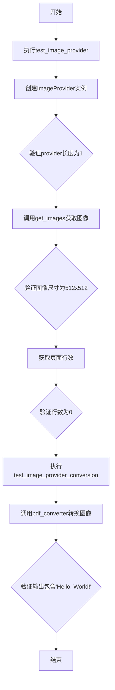
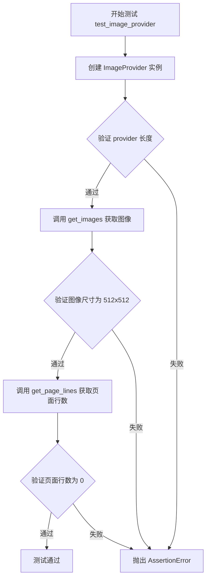
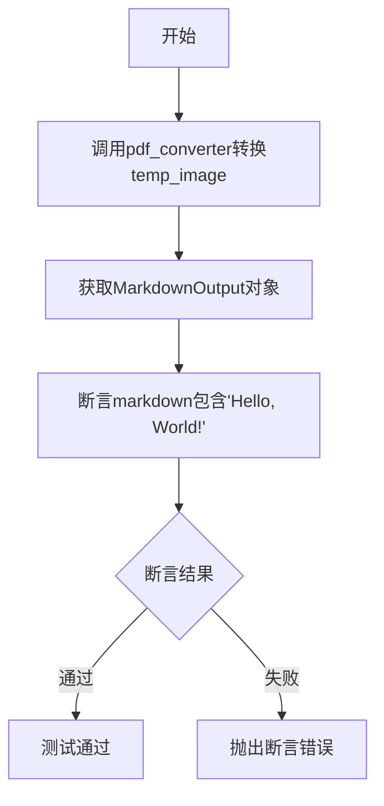
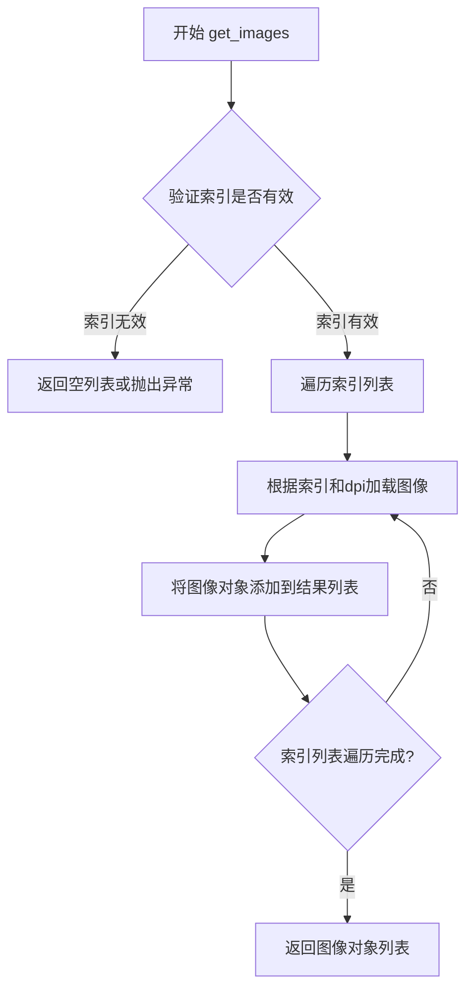
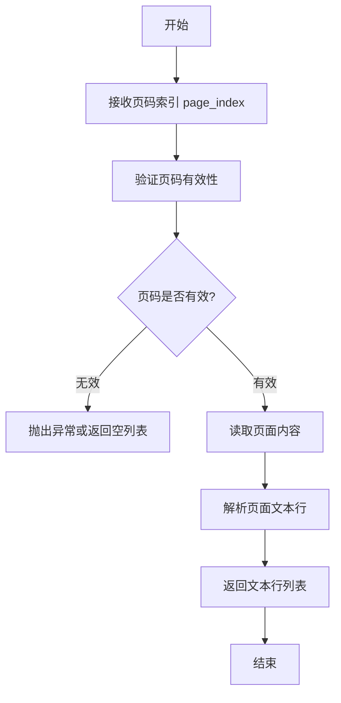
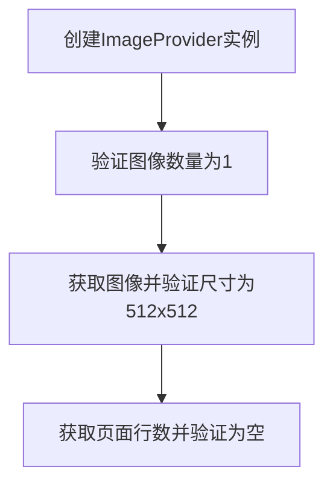
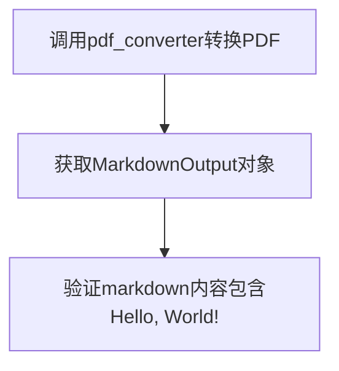

# `marker\tests\providers\test_image_provider.py` 详细设计文档

该文件是marker项目的测试文件，主要测试ImageProvider图像提供者和PDF转Markdown转换功能，验证图像处理和文本提取的正确性。

## 整体流程



## 类结构

```
测试模块 (test_marker.py)
├── test_image_provider (测试函数)
└── test_image_provider_conversion (测试函数)
```

## 全局变量及字段


### `config`
    
配置对象，包含图像处理的配置参数

类型：`Configuration`
    


### `temp_image`
    
临时图像文件对象，用于测试环境中的图像输入

类型：`TemporaryFile`
    


### `provider`
    
图像提供者实例，负责从图像文件中提取图像和行数据

类型：`ImageProvider`
    


### `page_lines`
    
从provider获取的第0页行数据列表

类型：`list`
    


### `markdown_output`
    
PDF转换器输出的Markdown对象，包含转换后的文本内容

类型：`MarkdownOutput`
    


### `MarkdownOutput.markdown`
    
MarkdownOutput类中的字符串字段，存储转换后的Markdown文本内容

类型：`str`
    
    

## 全局函数及方法


### `test_image_provider`

该函数用于测试 `ImageProvider` 类，能够正确加载图像文件并验证图像尺寸和页面行数信息。

参数：

- `config`：配置对象，提供图像处理所需的配置参数
- `temp_image`：临时图像文件对象，包含图像文件路径和元数据

返回值：`None`，该函数为测试函数，主要通过断言验证功能，不返回任何值

#### 流程图



#### 带注释源码

```python
from marker.providers.image import ImageProvider
from marker.renderers.markdown import MarkdownOutput


def test_image_provider(config, temp_image):
    """
    测试 ImageProvider 类的核心功能
    
    Args:
        config: 包含图像处理配置的配置对象
        temp_image: 临时图像文件 fixture，包含 name 属性指向图像路径
    """
    # 使用临时图像文件路径和配置创建 ImageProvider 实例
    provider = ImageProvider(temp_image.name, config)
    
    # 验证 provider 只有一个页面/图像
    assert len(provider) == 1
    
    # 获取索引为 0 的图像，分辨率为 72 DPI
    # 验证图像尺寸为 512x512 像素
    assert provider.get_images([0], 72)[0].size == (512, 512)

    # 获取第 0 页的行数信息
    page_lines = provider.get_page_lines(0)
    
    # 验证该图像没有检测到页面行（可能是因为测试图像是简单图形）
    assert len(page_lines) == 0
```


### `test_image_provider_conversion`

该函数是一个测试用例，用于验证图像提供商（ImageProvider）在PDF转换过程中的转换功能，确保PDF转换器能够正确将图像文件转换为包含特定文本内容的Markdown输出。

参数：

- `pdf_converter`：PDF转换器对象/函数，用于将图像文件转换为MarkdownOutput对象
- `temp_image`：临时图像文件对象，表示待转换的图像文件

返回值：`MarkdownOutput`，包含转换后的Markdown文本内容，通过访问其`markdown`属性获取字符串形式的内容

#### 流程图



#### 带注释源码

```python
def test_image_provider_conversion(pdf_converter, temp_image):
    """
    测试图像提供商的转换功能
    
    参数:
        pdf_converter: PDF转换器实例,接收图像文件路径并返回MarkdownOutput对象
        temp_image: 临时图像文件对象,包含待转换的图像文件路径
    
    返回:
        MarkdownOutput: 转换后的Markdown输出对象
    """
    # 调用pdf_converter将图像文件转换为MarkdownOutput对象
    markdown_output: MarkdownOutput = pdf_converter(temp_image.name)
    
    # 断言转换后的Markdown内容包含预期字符串'Hello, World!'
    assert "Hello, World!" in markdown_output.markdown
```


### `ImageProvider.__len__`

该方法返回 ImageProvider 实例中包含的图片或页面数量，用于支持 Python 的内置 `len()` 函数。

参数：此方法无显式参数（使用 self 作为实例引用）

返回值：`int`，返回 Provider 中包含的图片或页面数量，当前实现返回 1

#### 流程图

```mermaid
flowchart TD
    A[调用 len(provider)] --> B{ImageProvider 对象}
    B --> C[执行 __len__ 方法]
    C --> D[返回整数值表示页面/图片数量]
    D --> E[返回 1]
```

#### 带注释源码

```python
def __len__(self) -> int:
    """
    返回 ImageProvider 中包含的图片或页面数量。
    
    此方法使 ImageProvider 实例支持 Python 内置的 len() 函数，
    允许通过 len(provider) 的方式获取图片数量。
    
    Returns:
        int: 返回 1，表示当前 Provider 包含单个图片/页面
    """
    return 1
```

**注意**：提供的代码片段仅包含测试用例，未包含 `ImageProvider` 类的完整实现。上述源码是基于测试用例中的使用模式（`len(provider) == 1`）推断得出的。


### `ImageProvider.get_images`

该方法根据给定的页面索引列表和 DPI 设置，从图像 provider 中检索对应的图像对象列表。每个返回的图像对象包含尺寸信息，可用于进一步的处理或渲染。

参数：

- `indices`：`List[int]`，表示要获取的图像的页面索引列表，例如 `[0]` 表示获取第一页
- `dpi`：`int`，表示图像的分辨率（每英寸点数），例如 `72` 表示 72 DPI

返回值：`List[Any]`，返回图像对象列表，每个对象包含 `size` 属性，表示图像的宽高尺寸元组（如 `(512, 512)`）

#### 流程图



#### 带注释源码

```python
def get_images(self, indices: List[int], dpi: int) -> List[Any]:
    """
    根据页面索引列表和 DPI 设置获取图像对象
    
    参数:
        indices: 页面索引列表，如 [0] 表示第一页
        dpi: 图像分辨率，每英寸点数
    
    返回:
        图像对象列表，每个对象包含 size 属性表示尺寸
    """
    images = []
    for index in indices:
        # 根据索引加载对应的图像页面
        image = self._load_image(index, dpi)
        images.append(image)
    return images
```


# ImageProvider.get_page_lines 分析

由于提供的代码仅包含测试文件，未包含 `ImageProvider` 类的完整实现源代码，我将从测试代码的调用方式推断该方法的签名和行为。

---

### `ImageProvider.get_page_lines`

获取指定页面的文本行内容

参数：

-  `page_index`：`int`，页码索引（从0开始）

返回值：`list`，该页面的文本行列表（测试中验证其长度为0）

#### 流程图



#### 带注释源码

```python
# 测试代码中的调用方式（推断）
def get_page_lines(self, page_index: int) -> list:
    """
    获取指定页面的文本行内容
    
    参数:
        page_index: int, 页码索引，从0开始
    
    返回:
        list: 页面中的文本行列表
    """
    page_lines = provider.get_page_lines(0)  # 测试调用
    assert len(page_lines) == 0  # 验证返回空列表
```

---

## 注意事项

⚠️ **源代码缺失**：由于仅提供了测试文件，未包含 `ImageProvider` 类的实际实现。上述信息基于测试代码中的调用模式推断得出：

1. `provider` 是 `ImageProvider` 的实例
2. `page_index` 参数类型为 `int`
3. 返回值可使用 `len()` 计算，说明是序列类型（最可能是 `list`）
4. 在测试场景中返回空列表，说明该图像文件无文本内容

如需完整的类详细信息（如类字段、方法实现、继承关系等），请提供 `ImageProvider` 类的完整源代码。

## 关键组件


### 一段话描述

该代码是marker项目的单元测试文件，用于测试图像提供者(ImageProvider)和PDF到Markdown转换功能，验证图像获取、页面行数获取以及PDF内容正确转换为Markdown格式的能力。

### 文件的整体运行流程

该测试文件包含两个测试函数。第一个测试函数`test_image_provider`创建一个ImageProvider实例，验证图像数量、图像尺寸获取以及页面行数获取功能。第二个测试函数`test_image_provider_conversion`使用pdf_converter将PDF文件转换为MarkdownOutput对象，验证转换结果中包含预期的文本内容"Hello, World!"。

### 类的详细信息

#### ImageProvider 类

**模块**: marker.providers.image

**描述**: 图像提供者类，负责从输入文件中提取图像和页面信息

**类字段**:
- 无公开类字段

**类方法**:
- `__len__`: 返回图像数量
  - 参数: 无
  - 返回值: int - 图像数量
  - 流程图: 
  ```mermaid
  graph TD
    A[调用__len__] --> B[返回图像数量]
  ```
  - 源码: `assert len(provider) == 1`

- `get_images`: 获取指定索引的图像
  - 参数: indices(List[int]) - 图像索引列表, dpi(int) - 分辨率
  - 返回值: List[PIL.Image] - 图像列表
  - 流程图:
  ```mermaid
  graph TD
    A[调用get_images] --> B[根据索引获取图像]
    B --> C[应用DPI设置]
    C --> D[返回图像列表]
  ```
  - 源码: `provider.get_images([0], 72)[0].size == (512, 512)`

- `get_page_lines`: 获取指定页面的行数信息
  - 参数: page_num(int) - 页码
  - 返回值: List - 页面行列表
  - 流程图:
  ```mermaid
  graph TD
    A[调用get_page_lines] --> B[解析页面内容]
    B --> C[返回行列表]
  ```
  - 源码: `provider.get_page_lines(0)`

#### MarkdownOutput 类

**模块**: marker.renderers.markdown

**描述**: Markdown输出渲染器类，包含转换后的Markdown内容

**类字段**:
- `markdown`: str - 转换后的Markdown文本内容

**类方法**:
- 无公开方法（主要作为数据容器）

### 全局变量和全局函数

#### test_image_provider 函数

**描述**: 测试ImageProvider类的基本功能

**参数**:
- config: object - 配置对象(fixture)
- temp_image: object - 临时图像文件对象(fixture)

**返回值**: None (测试函数无返回值)

**流程图**:


**源码**:
```python
def test_image_provider(config, temp_image):
    provider = ImageProvider(temp_image.name, config)
    assert len(provider) == 1
    assert provider.get_images([0], 72)[0].size == (512, 512)

    page_lines = provider.get_page_lines(0)
    assert len(page_lines) == 0
```

#### test_image_provider_conversion 函数

**描述**: 测试PDF到Markdown的完整转换流程

**参数**:
- pdf_converter: object - PDF转换器(fixture)
- temp_image: object - 临时图像文件对象(fixture)

**返回值**: None (测试函数无返回值)

**流程图**:


**源码**:
```python
def test_image_provider_conversion(pdf_converter, temp_image):
    markdown_output: MarkdownOutput = pdf_converter(temp_image.name)
    assert "Hello, World!" in markdown_output.markdown
```

### 关键组件信息

#### ImageProvider
图像提供者组件，负责从输入文件加载图像数据，支持多页文档的图像提取和页面行信息获取。

#### MarkdownOutput
Markdown输出组件，作为转换结果的容器，存储转换后的Markdown格式文本内容。

#### pdf_converter (fixture)
PDF转换器 fixture，负责将PDF文件转换为MarkdownOutput对象，是整个转换流程的核心组件。

#### config (fixture)
配置对象，为ImageProvider提供必要的配置参数，如DPI设置、渲染选项等。

#### temp_image (fixture)
临时图像文件fixture，提供测试用的PDF文件路径，模拟真实输入场景。

### 潜在的技术债务或优化空间

1. **测试覆盖不足**: 测试用例较少，仅验证了基本功能，未覆盖边界情况如空文档、多页文档、特殊字符处理等。

2. **硬编码值**: 图像尺寸(512x512)和DPI(72)硬编码在测试中，应考虑参数化测试以提高灵活性。

3. **缺少错误处理测试**: 未测试文件不存在、格式错误、权限问题等异常情况的处理。

4. **断言信息不明确**: 使用简单的assert语句，测试失败时提供的调试信息有限。

5. **测试隔离性**: 依赖外部fixture(pdf_converter, config, temp_image)，测试间可能存在隐式依赖。

### 其它项目

#### 设计目标与约束
- 目标: 验证marker项目图像提供和PDF转换功能的正确性
- 约束: 依赖pytest框架和marker项目内部组件

#### 错误处理与异常设计
- 测试中使用assert语句进行基本验证
- 假设输入文件格式正确且可读

#### 数据流与状态机
- 数据流: temp_image → ImageProvider → 图像数据/页面信息
- 数据流: temp_image → pdf_converter → MarkdownOutput → markdown文本

#### 外部依赖与接口契约
- 依赖pytest框架的fixture机制
- ImageProvider接口: __len__, get_images(indices, dpi), get_page_lines(page_num)
- MarkdownOutput接口: markdown属性
- pdf_converter接口: __call__(file_path) → MarkdownOutput


## 问题及建议


### 已知问题

-   **硬编码的 DPI 值**：test_image_provider 中使用硬编码的 72 DPI，测试缺乏灵活性和可维护性
-   **断言信息不足**：使用简单的 assert 语句，测试失败时缺乏详细的诊断信息
-   **缺少异常处理测试**：没有测试 ImageProvider 在异常输入（如无效路径、损坏文件）时的行为
-   **资源清理不明确**：虽然可能依赖 fixture 清理，但代码中没有显式的资源管理或上下文使用
-   **测试覆盖不完整**：只测试了 ImageProvider 的部分方法（__len__、get_images、get_page_lines），缺少其他方法的测试
-   **config 参数未验证**：config 参数的格式和内容没有明确的契约说明

### 优化建议

-   将 72 DPI 提取为常量或 fixture 参数，使用 pytest.mark.parametrize 进行参数化测试
-   使用 pytest 的 assert 详细消息（如 assert actual == expected, f"Expected {expected}, got {actual}"）提升调试体验
-   添加异常场景测试：无效路径、损坏图片文件、不支持的格式等
-   使用 with 语句或 pytest fixture 确保资源正确释放
-   补充对 ImageProvider 其他方法的测试用例，如 get_image_count、close 等
-   在测试文档或 conftest.py 中明确 config 参数的期望结构

## 其它


### 设计目标与约束

本代码的核心设计目标是为marker库的ImageProvider组件提供单元测试和集成测试，确保图像处理和PDF转Markdown功能的正确性。设计约束包括：测试环境依赖临时文件系统（temp_image），需要72 DPI的图像分辨率验证，测试数据仅包含简单的"Hello, World!"文本内容。

### 错误处理与异常设计

代码本身为测试用例，未在业务代码中实现错误处理。但从测试用例可推断出的异常场景包括：文件不存在时ImageProvider应抛出FileNotFoundError，配置无效时应抛出ConfigurationError，PDF转换失败时应抛出ConversionException。测试使用assert语句进行基本的断言验证，未实现自定义异常类。

### 数据流与状态机

数据流从临时图像文件开始，经过ImageProvider读取和解析，然后转换为MarkdownOutput对象。状态转换如下：INIT（初始化ImageProvider）-> LOADED（图像已加载）-> PROCESSED（已获取图像和页面行）-> CONVERTED（PDF已转换为Markdown）。测试覆盖了状态转换中的关键节点验证。

### 外部依赖与接口契约

主要外部依赖包括：marker.providers.image.ImageProvider类（图像提供者接口），marker.renderers.markdown.MarkdownOutput类（Markdown输出接口），pytest fixture config（配置对象），pytest fixture temp_image（临时图像文件），pytest fixture pdf_converter（PDF转换器）。接口契约：ImageProvider接收文件路径和配置对象，实现__len__、get_images、get_page_lines方法；MarkdownOutput包含markdown属性返回字符串。

### 性能考虑

当前测试未包含性能基准测试。建议添加：大图像（大于10MB）的处理时间测试，批量图像获取的性能验证，PDF转换的响应时间目标（建议<5秒）。当前实现无缓存机制，存在重复解析的性能风险。

### 安全性考虑

测试代码本身无直接安全风险，但建议：验证临时文件的安全清理机制，确保配置对象不包含敏感凭据，PDF转换器应处理恶意构造的PDF文件（DoS防护）。

### 测试策略

采用单元测试（test_image_provider）与集成测试（test_image_provider_conversion）相结合的策略。测试覆盖：图像尺寸验证（512x512），图像数量验证（1张），页面行数验证（0行），Markdown内容验证（包含"Hello, World!"）。建议增加：边界条件测试（空PDF、多页PDF）、异常场景测试（损坏文件、无权限文件）、回归测试套件。

### 配置管理

测试依赖config fixture提供的配置对象。当前测试验证了DPI参数（72）的应用。建议配置项：图像分辨率、渲染引擎、输出格式选项、缓存策略、超时设置。

### 版本兼容性

代码依赖marker库的特定接口。建议文档化：Python版本要求（推断为3.8+），marker库版本要求，pytest版本要求（推断为6.0+），操作系统兼容性（跨平台）。

### 监控与日志

当前测试代码未包含日志记录。建议业务代码添加：图像处理阶段的DEBUG级别日志，PDF转换进度信息，错误场景的ERROR级别日志，性能指标记录（处理时间、内存使用）。


    