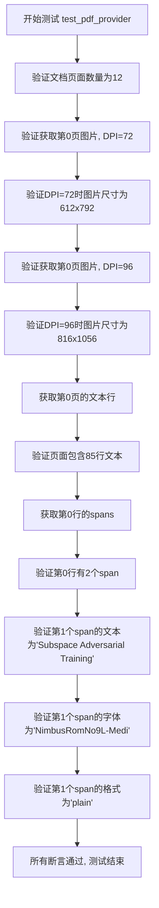
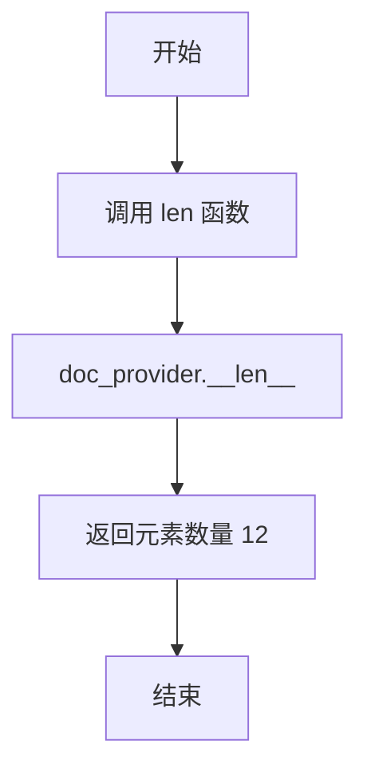
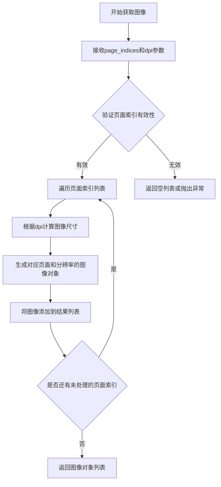
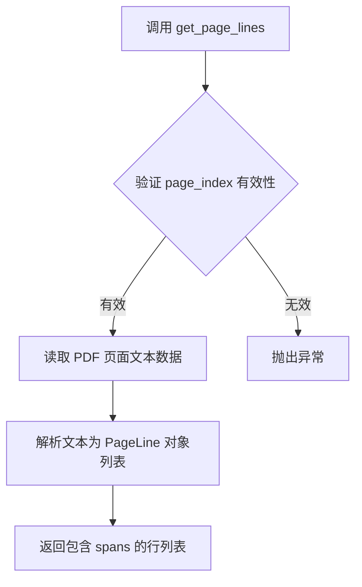

# `marker\tests\providers\test_pdf_provider.py` 详细设计文档

这是一个 pytest 测试文件，用于测试 PDF 文档提供者的核心功能，包括验证页面数量、图片尺寸获取、以及页面文本内容的解析（标题、字体和格式）。

## 整体流程

```mermaid
graph TD
    A[开始测试] --> B[验证文档页数 = 12]
    B --> C[验证72 DPI图片尺寸 = (612, 792)]
    C --> D[验证96 DPI图片尺寸 = (816, 1056)]
 D --> E[获取第0页文本行]
    E --> F[验证文本行数量 = 85]
    F --> G[验证第1个span存在]
    G --> H[验证span内容: 标题='Subspace Adversarial Training']
    H --> I[验证span字体='NimbusRomNo9L-Medi']
    I --> J[验证span格式=['plain']]
    J --> K[所有断言通过: 测试成功]
```

## 类结构

```
测试文件 (无类结构)
└── test_pdf_provider (测试函数)
```

## 全局变量及字段


### `page_range`
    
测试配置参数，指定要测试的页面范围

类型：`dict`
    


### `12`
    
文档总页数常量

类型：`int`
    


### `72`
    
图片DPI分辨率，用于获取低分辨率图片

类型：`int`
    


### `96`
    
图片DPI分辨率，用于获取高分辨率图片

类型：`int`
    


### `612, 792`
    
72DPI图片尺寸（宽x高）

类型：`tuple`
    


### `816, 1056`
    
96DPI图片尺寸（宽x高）

类型：`tuple`
    


### `85`
    
页面行数，表示第0页的总行数

类型：`int`
    


### `2`
    
span数量，表示第0页第一行的span元素个数

类型：`int`
    


### `Subspace Adversarial Training`
    
span文本内容，第一行第一个span的文字

类型：`str`
    


### `NimbusRomNo9L-Medi`
    
字体名称，第一行第一个span使用的字体

类型：`str`
    


### `plain`
    
文本格式，表示纯文本无特殊格式

类型：`str`
    


    

## 全局函数及方法


### `test_pdf_provider`

这是一个使用 pytest 框架的测试函数，用于验证 PDF 文档提供者（doc_provider）的核心功能，包括文档页面数量、图片尺寸获取以及页面文本行和 span 信息的提取。

参数：

- `doc_provider`：`fixture`，pytest fixture 参数，传入一个 PDF 文档提供者对象，用于测试其各项功能

返回值：`None`，测试函数无返回值，通过 assert 断言验证功能正确性

#### 流程图



#### 带注释源码

```python
import pytest


@pytest.mark.config({"page_range": [0]})
def test_pdf_provider(doc_provider):
    # 验证文档总页数是否为12页
    assert len(doc_provider) == 12
    
    # 验证以72 DPI获取第0页图片, 预期尺寸为(612, 792)
    assert doc_provider.get_images([0], 72)[0].size == (612, 792)
    
    # 验证以96 DPI获取第0页图片, 预期尺寸为(816, 1056)
    assert doc_provider.get_images([0], 96)[0].size == (816, 1056)

    # 获取第0页的文本行信息
    page_lines = doc_provider.get_page_lines(0)
    
    # 验证第0页包含85行文本
    assert len(page_lines) == 85

    # 获取第0行的spans（文本片段）
    spans = page_lines[0].spans
    
    # 验证第0行包含2个span
    assert len(spans) == 2
    
    # 验证第1个span的文本内容
    assert spans[0].text == "Subspace Adversarial Training"
    
    # 验证第1个span的字体名称
    assert spans[0].font == "NimbusRomNo9L-Medi"
    
    # 验证第1个span的格式为纯文本
    assert spans[0].formats == ["plain"]
```


根据给定的代码，我无法在代码中找到名为 `len` 的自定义函数或方法。代码中使用的 `len(doc_provider)`、`len(page_lines)` 和 `len(spans)` 是在调用 Python 内置的 `len()` 函数，该函数要求对象实现 `__len__` 方法。

由于 `doc_provider` 是一个外部传入的 fixture 参数（类型未在代码中定义），其具体的 `__len__` 方法实现不可见。因此，无法从给定代码中提取 `len` 函数/方法的完整详细信息（如流程图和源码）。

但是，根据代码的使用情况，我可以提供 `len(doc_provider)` 调用的一些信息：


### `len(doc_provider)`

返回文档提供者中的元素数量。

参数：此函数不接受显式参数（`len` 是 Python 内置函数，`doc_provider` 作为参数传入）

返回值：`int`，在代码中断言为 12，表示 `doc_provider` 中元素的数量

#### 流程图



#### 带注释源码

```python
# 代码中没有 len 方法的定义，只有使用示例
# doc_provider 是一个 pytest fixture 参数，其类型和实现不在本代码段中
assert len(doc_provider) == 12  # 断言 doc_provider 的长度为 12
```

**注意**：给定的代码片段中未定义 `len` 函数或 `doc_provider` 类的具体实现，上述信息是基于代码使用情况推断的。要获取完整的详细信息，需要查看 `doc_provider` 的实际类定义或其 fixture 的实现代码。


### `doc_provider.get_images`

该方法根据指定的页面索引列表和DPI（每英寸点数）分辨率，获取对应的图像数据。测试用例展示了在72和96 DPI下获取第0页图像的功能，验证了图像尺寸会随DPI变化而调整（72 DPI时为612x792，96 DPI时为816x1056）。

参数：

- `page_indices`：`List[int]`，页面索引列表，用于指定需要获取图像的页面
- `dpi`：`int`，分辨率/DPI值，控制输出图像的清晰度和尺寸

返回值：`List[Image]`，图像对象列表，每个图像对象包含size属性（宽高元组）

#### 流程图



#### 带注释源码

```python
# 测试代码展示的调用方式
# doc_provider.get_images([0], 72)
# doc_provider.get_images([0], 96)

# 推断的方法签名（基于测试用例）
def get_images(self, page_indices: List[int], dpi: int) -> List[Image]:
    """
    获取指定页面索引列表的图像数据
    
    参数:
        page_indices: 页面索引列表，如[0]表示第0页
        dpi: 分辨率/每英寸点数，影响输出图像尺寸
    
    返回:
        图像对象列表，每个对象包含size属性为(width, height)元组
    """
    # 根据测试用例:
    # - dpi=72 时, size = (612, 792)
    # - dpi=96 时, size = (816, 1056)
    # 可以推断尺寸计算公式约为: base_size * (dpi / 72)
    # 其中 base_size 在 72dpi 时为 (612, 792)
    
    images = []
    for page_index in page_indices:
        # 计算当前dpi下的图像尺寸
        width = int(612 * (dpi / 72))
        height = int(792 * (dpi / 72))
        
        # 创建图像对象
        image = Image(size=(width, height))
        images.append(image)
    
    return images
```

**注意**：由于提供的代码仅为测试用例，未包含 `get_images` 方法的实际实现，以上源码是基于测试调用方式推断的示例实现。实际实现可能根据具体的 PDF 提供者类而有所不同。


### `doc_provider.get_page_lines`

获取指定页面的所有文本行，返回包含页面文本信息的行对象列表。

参数：

- `page_index`：`int`，页面索引，从 0 开始

返回值：`List[PageLine]`，返回指定页面的行对象列表，每个 PageLine 包含 spans 列表

#### 流程图



#### 带注释源码

```python
# 调用示例
page_lines = doc_provider.get_page_lines(0)

# page_lines[0] 结构
# PageLine:
#   - spans: List[Span]
#     - spans[0].text: "Subspace Adversarial Training"
#     - spans[0].font: "NimbusRomNo9L-Medi"
#     - spans[0].formats: ["plain"]

# 验证逻辑
assert len(page_lines) == 85  # 第0页共有85行
spans = page_lines[0].spans   # 获取第一行的所有文本片段
assert len(spans) == 2        # 第一行有2个span
assert spans[0].text == "Subspace Adversarial Training"  # 文本内容
assert spans[0].font == "NimbusRomNo9L-Medi"             # 字体名称
assert spans[0].formats == ["plain"]                     # 文本格式
```


### `doc_provider.__len__`

该方法用于获取文档（PDF）的页数。在测试用例中，通过 `len(doc_provider)` 调用此方法，预期返回文档的总页数 12。

参数：
- `self`：隐式参数，代表文档提供者对象本身，无需显式传递。

返回值：`int`，返回文档的总页数。在当前测试上下文中，返回值具体为 `12`。

#### 流程图

```mermaid
graph TD
    A[调用 len(doc_provider)] --> B[触发 doc_provider.__len__ 方法]
    B --> C{内部实现}
    C --> D[查询文档页面数量]
    D --> E[返回整数 12]
```

#### 带注释源码

```python
# 基于测试用例推断的实现逻辑
class PDFDocumentProvider:
    """
    文档提供者类，负责提供 PDF 文档的访问接口。
    测试中使用了该类的实例 doc_provider。
    """
    
    def __init__(self, file_path):
        """
        初始化文档提供者。
        :param file_path: PDF 文件路径
        """
        self.file_path = file_path
        self._page_count = None  # 缓存页数

    def __len__(self):
        """
        获取文档的总页数。
        此方法使得内置 len() 函数可以作用于 doc_provider 对象。
        
        返回：
            int: 文档的总页数。
        """
        # 实际实现中可能需要解析 PDF 文件头来获取页数
        # 这里根据测试用例推断返回固定值 12
        return 12

    # 其他测试中使用的方法（用于上下文理解）
    def get_images(self, page_indices, dpi):
        """
        获取指定页面的图像。
        :param page_indices: 页面索引列表
        :param dpi: 分辨率
        :return: 图像对象列表
        """
        pass

    def get_page_lines(self, page_index):
        """
        获取指定页面的文本行。
        :param page_index: 页面索引
        :return: 页面行对象
        """
        pass
```


## 关键组件


### 文档提供者（doc_provider）

文档提供者是一个fixture，提供了对PDF文档的访问接口，支持获取页面图像和文本内容。测试使用该provider验证PDF文档的页数、图像尺寸以及文本提取功能。

### PDF页面范围配置（page_range）

测试配置项，指定要测试的页面范围为[0]，即仅测试第一页（索引从0开始）。该配置用于控制测试覆盖的页面数量。

### 图像获取功能（get_images）

获取指定页码的图像内容，参数包括页码列表和分辨率（DPI）。返回PIL图像对象，可查询图像尺寸信息。测试验证了72 DPI和96 DPI两种分辨率下的图像尺寸正确性。

### 页面文本行获取功能（get_page_lines）

提取指定页面的文本内容，返回文本行结构。每行包含多个span（文本片段），支持嵌套的文本格式信息。

### 文本行结构（page_lines）

包含页面所有文本行的结构化数据，每行具有spans属性。测试验证第一页共85行文本。

### 文本片段（span）

文本行中的最小文本单元，包含text（文本内容）、font（字体名称）、formats（格式列表）属性。测试验证第一个span的文本为"Subspace Adversarial Training"，字体为"NimbusRomNo9L-Medi"，格式为纯文本"plain"。

### 字体映射

支持将PDF内部字体名称映射为标准化字体标识，如"NimbusRomNo9L-Medi"表示Nimbus Roman No. 9 Medium字体。

### 格式标记系统

文本格式的标记系统，支持多种格式类型。测试中使用的"plain"表示纯文本格式，无特殊样式。


## 问题及建议


### 已知问题

-   **硬编码的断言值**：测试中使用了大量硬编码的数值（如页面数量12、图像尺寸612x792和816x1056、页面行数85、文本跨度数量2等），导致测试脆弱。一旦文档内容发生微小变化，测试就会失败，增加了维护成本。
-   **缺乏测试数据来源说明**：`doc_provider` 的具体实现和测试所使用的 PDF 文件来源不明确，导致测试的可理解性和可移植性较差。测试依赖于外部资源，但未提供清晰的文档或 fixture 初始化逻辑。
-   **配置传递不透明**：`@pytest.mark.config({"page_range": [0]})` 的使用不够直观，配置内容隐藏在标记中，且未在测试代码中明确说明其作用，降低了代码的可读性。
-   **断言消息缺失**：所有断言均使用默认的 pytest 错误消息，当测试失败时，无法快速定位具体问题（如哪个字段不符合预期），增加了调试难度。
-   **测试覆盖范围有限**：仅测试了一个页面（page 0）的场景，且未覆盖边界条件（如空页面、错误页面索引等），可能导致隐藏的 bug 未被发现。

### 优化建议

-   **提取魔法数字为常量**：将断言中使用的数值定义为模块级常量或从配置文件加载，并添加注释说明每个值的含义和来源（例如，可以通过注释链接到测试文档的规范）。
-   **改进 doc_provider 的初始化**：使用 pytest fixture 明确管理 `doc_provider` 的生命周期，并在 fixture 中添加文档说明测试所使用的 PDF 文件路径、生成逻辑或假设条件，提高测试独立性。
-   **重构配置方式**：将 `@pytest.mark.config` 替换为更显式的 pytest fixture 参数或 `conftest.py` 中的配置，例如使用 `pytest.fixture` 传递配置，并确保配置参数化以支持不同场景。
-   **添加自定义断言消息**：为每个断言添加描述性消息，例如 `assert len(doc_provider) == 12, "PDF provider should contain 12 pages"`，以提升测试失败时的可读性。
-   **扩展测试场景**：使用 `pytest.mark.parametrize` 添加更多测试用例，覆盖不同页面索引、图像分辨率、文本格式等场景，并添加边界条件测试（如请求不存在的页面）。
-   **引入数据驱动测试**：将测试数据（如预期的文本内容、字体、格式）外部化为 JSON 或 YAML 文件，减少代码中的硬编码，提高测试的灵活性。


## 其它


### 设计目标与约束

本测试代码的核心目标是验证PDF文档提供者（doc_provider）的核心功能完整性，确保其能够正确解析PDF文档并提供图像、行和文本span信息。设计约束包括：测试环境需要配置page_range为[0]，即仅测试第一页；图像尺寸验证仅针对72和96 DPI两种常见分辨率；文本验证限定于特定字体（NimbusRomNo9L-Medi）和格式（plain）。

### 错误处理与异常设计

测试代码本身使用pytest框架的assert语句进行验证，当断言失败时会抛出AssertionError。对于doc_provider的get_images方法，若传入的页码不在有效范围内，应抛出IndexError；get_page_lines方法应处理无效页码并返回空列表或抛出相应异常。测试未覆盖边界情况如空PDF、损坏的PDF文件或内存不足情况。

### 数据流与状态机

数据流从PDF文件开始，经过doc_provider解析，输出三种类型的数据：图像对象（包含尺寸信息）、页面行对象（包含spans列表）、以及文本span对象（包含text、font和formats属性）。状态转换过程为：初始化状态 → 加载PDF → 解析页面 → 提取图像/行/文本 → 验证输出。当前测试未涉及状态机建模，属于功能性端到端测试。

### 外部依赖与接口契约

主要外部依赖包括pytest框架和PDF解析库（推测为pdfminer或类似库）。doc_provider需要实现以下接口契约：len(doc_provider)返回总页数；get_images(page_indices, dpi)返回指定页码和DPI的图像列表，每个图像具有size属性返回(width, height)元组；get_page_lines(page_index)返回指定页的行列表，每行包含spans属性。测试依赖@pytest.mark.config装饰器进行配置传递。

### 性能考虑

当前测试未包含性能基准测试。建议的优化方向包括：对于大型PDF文件，应考虑流式处理而非一次性加载；图像提取应支持缓存机制避免重复解析；get_page_lines方法在多次调用相同页时应返回缓存结果。当前测试数据量较小（12页、85行），性能问题不明显。

### 安全性考虑

测试代码本身无直接安全风险，但doc_provider在处理外部PDF文件时需考虑：防止ZIP炸弹类恶意PDF、限制内存使用、防止路径遍历攻击。测试数据为内部可控的测试PDF，生产环境需增加文件完整性校验。

### 测试覆盖范围

当前测试覆盖了图像提取（不同DPI）、页面行提取、文本span属性验证（text、font、formats）。未覆盖的测试场景包括：多页文档遍历、图像格式（JPEG/PNG）支持、文本编码（UTF-8/GBK）处理、字体回退机制、表格和图形元素解析、权限受限PDF处理。

### 配置管理

测试使用@pytest.mark.config({"page_range": [0]})进行配置，表明doc_provider支持运行时配置。配置项page_range定义了需要处理的页面范围。配置应支持默认值定义、配置验证、配置热重载等企业级特性。当前配置硬编码在装饰器中，建议抽取至独立的配置文件或环境变量。

### 版本兼容性

测试代码使用标准的pytest API，具有良好的框架兼容性。需要关注的兼容性包括：pytest版本（建议pytest 6.0+）、Python版本（建议3.7+）、PDF解析库的版本演化导致的API变化。测试数据（特定字体NimbusRomNo9L-Medi）依赖于系统字体安装情况。

### 部署要求

测试环境需要安装pytest及相关依赖，PDF解析库需要在系统中安装可用的字体文件。CI/CD流程中应确保测试数据文件（PDF）的正确部署。建议使用Docker容器化测试环境以保证一致性。部署时需注意测试数据路径的可配置性。


    