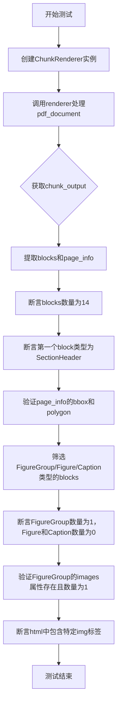
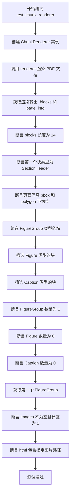
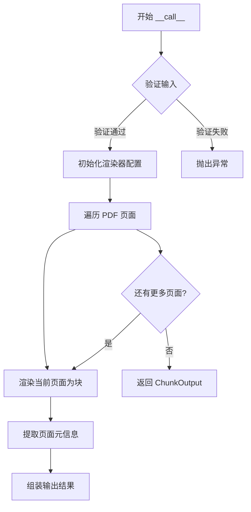

# `marker\tests\renderers\test_chunk_renderer.py` 详细设计文档

这是一个pytest测试文件，用于测试ChunkRenderer类的功能，验证其能够正确渲染PDF文档为结构化的块（blocks），包括SectionHeader、FigureGroup等类型，并检查页面信息和图像属性。

## 整体流程



## 类结构

```
ChunkRenderer (被测试类)
└── 在marker.renderers.chunk模块中定义
```

## 全局变量及字段


### `pdf_document`
    
PDF文档对象，作为渲染器的输入

类型：`PDFDocument`
    


### `renderer`
    
块渲染器实例，用于将PDF文档转换为块结构

类型：`ChunkRenderer`
    


### `chunk_output`
    
渲染输出对象，包含渲染后的块和页面信息

类型：`ChunkOutput`
    


### `blocks`
    
从PDF渲染出的所有块的列表

类型：`List[Block]`
    


### `page_info`
    
页面信息列表，每个元素包含bbox和polygon等页面元数据

类型：`List[dict]`
    


### `figure_groups`
    
所有FigureGroup类型块的列表，用于包含图像组的块

类型：`List[FigureGroup]`
    


### `figures`
    
所有Figure类型块的列表，表示文档中的图像

类型：`List[Figure]`
    


### `captions`
    
所有Caption类型块的列表，表示图像或表格的标题

类型：`List[Caption]`
    


### `figure_group`
    
第一个FigureGroup块，包含图像及其相关信息

类型：`FigureGroup`
    


    

## 全局函数及方法


### `test_chunk_renderer`

这是一个 pytest 测试函数，用于验证 `ChunkRenderer` 类的功能正确性。该测试通过加载 PDF 文档，使用 `ChunkRenderer` 进行分块渲染，然后断言输出结果的块数量、类型、页面信息以及图像组等是否符合预期。

参数：

- `pdf_document`：`pytest.fixture`，PDF 文档对象，提供待渲染的 PDF 文件内容

返回值：`None`，该函数为测试函数，不返回任何值，主要通过断言进行验证

#### 流程图



#### 带注释源码

```python
import pytest
# 引入 pytest 测试框架，用于编写和运行测试用例

from marker.renderers.chunk import ChunkRenderer
# 从 marker.renderers.chunk 模块导入 ChunkRenderer 类
# 该类负责将 PDF 文档渲染为分块的输出格式

@pytest.mark.config({"page_range": [0]})
# pytest 装饰器，配置测试参数
# page_range: [0] 表示仅渲染第一页（索引从 0 开始）

def test_chunk_renderer(pdf_document):
    """
    测试 ChunkRenderer 类的渲染功能
    
    该测试验证：
    1. ChunkRenderer 能正确渲染 PDF 文档
    2. 输出块的数量和类型正确
    3. 页面信息（bbox 和 polygon）正确包含
    4. FigureGroup、Figure、Caption 块的识别
    5. 图像和 HTML 输出的正确性
    """
    
    # 创建 ChunkRenderer 实例
    # ChunkRenderer 是负责将 PDF 转换为结构化块的核心渲染器
    renderer = ChunkRenderer()
    
    # 调用渲染器处理 PDF 文档
    # 输入：pdf_document - PDF 文档对象（来自 pytest fixture）
    # 输出：chunk_output - 包含渲染结果的输出对象
    chunk_output = renderer(pdf_document)
    
    # 从输出对象中提取blocks（内容块列表）
    # blocks 是渲染结果的主要部分，包含文档的各种内容类型
    blocks = chunk_output.blocks
    
    # 从输出对象中提取 page_info（页面信息列表）
    # page_info 包含每页的元数据，如边界框(bbox)和多边形(polygon)
    page_info = chunk_output.page_info

    # 断言：验证渲染输出的块数量是否为 14
    # 这是针对特定测试 PDF 文档的预期值
    assert len(blocks) == 14
    
    # 断言：验证第一个块是否为 SectionHeader 类型
    # SectionHeader 表示文档的章节标题块
    assert blocks[0].block_type == "SectionHeader"
    
    # 断言：验证页面信息的边界框不为空
    # bbox 定义了页面的可视区域边界
    assert page_info[0]["bbox"] is not None
    
    # 断言：验证页面的多边形信息不为空
    # polygon 提供了更精确的页面形状描述
    assert page_info[0]["polygon"] is not None

    # 筛选出所有 FigureGroup 类型的块
    # FigureGroup 表示图像组块，用于组织相关图像
    figure_groups = [block for block in blocks if block.block_type == "FigureGroup"]
    
    # 筛选出所有 Figure 类型的块
    # Figure 表示单个图像块
    figures = [block for block in blocks if block.block_type == "Figure"]
    
    # 筛选出所有 Caption 类型的块
    # Caption 表示图像或表格的标题/说明块
    captions = [block for block in blocks if block.block_type == "Caption"]

    # 断言：验证 FigureGroup 块的数量为 1
    assert len(figure_groups) == 1
    
    # 断言：验证 Figure 块的数量为 0
    # 测试预期该文档中没有独立的 Figure 块
    assert len(figures) == 0
    
    # 断言：验证 Caption 块的数量为 0
    # 测试预期该文档中没有独立的 Caption 块
    assert len(captions) == 0

    # 获取第一个 FigureGroup 对象
    # 预期该文档包含一个图像组
    figure_group = figure_groups[0]
    
    # 断言：验证 FigureGroup 包含图像数据
    # images 属性存储了图像的二进制数据或引用
    assert figure_group.images is not None
    
    # 断言：验证图像数量为 1
    assert len(figure_group.images) == 1
    
    # 断言：验证 HTML 输出包含正确的图像引用路径
    # 验证格式为 '/page/0/Figure/9' 的图像引用
    assert "" in figure_group.html
```

#### 关键组件信息

| 组件名称 | 一句话描述 |
|---------|-----------|
| `ChunkRenderer` | PDF 文档分块渲染器，将 PDF 内容转换为结构化的块输出 |
| `pdf_document` | pytest fixture，提供测试用的 PDF 文档对象 |
| `chunk_output` | 渲染输出对象，包含 `blocks`（内容块列表）和 `page_info`（页面信息列表） |
| `blocks` | 内容块列表，存储文档的各类内容（SectionHeader、FigureGroup、Figure、Caption 等） |
| `page_info` | 页面信息列表，存储每页的边界框和多边形等元数据 |
| `FigureGroup` | 图像组块类型，用于组织相关的图像内容 |

#### 潜在的技术债务或优化空间

1. **硬编码断言值**：测试中使用了硬编码的值（如 `len(blocks) == 14`、`page_range: [0]`），这些值与特定测试 PDF 耦合，缺乏灵活性。建议将这些值参数化或使用配置文件管理。

2. **缺乏负面测试**：当前测试仅验证正常流程，未覆盖错误场景（如无效 PDF、渲染失败等情况）。

3. **断言信息不够详细**：断言失败时缺乏自定义错误信息，难以快速定位问题。建议使用 `assert actual == expected, "详细描述"` 格式。

4. **测试数据依赖**：测试依赖于特定的 PDF 文档内容（test_pdf），如果文档内容变化，测试可能失败。建议在测试中明确说明文档来源或使用生成的测试数据。

5. **缺少性能测试**：未包含渲染性能相关的测试（如渲染时间、内存使用等）。

#### 其它项目

**设计目标与约束：**
- 验证 `ChunkRenderer` 能够正确解析和渲染 PDF 文档
- 确保不同类型的内容块（SectionHeader、FigureGroup 等）被正确识别和分类
- 验证页面元数据（bbox、polygon）的完整性
- 约束：测试仅针对单页 PDF（page_range: [0]）

**错误处理与异常设计：**
- 测试本身未显式处理异常，依赖 pytest 的断言机制
- 建议：对于无效 PDF 输入，应在 `ChunkRenderer` 内部抛出有意义的异常

**数据流与状态机：**
- 数据流：PDF Document → ChunkRenderer → ChunkOutput (blocks + page_info)
- 状态：初始化 → 渲染中 → 渲染完成 → 验证

**外部依赖与接口契约：**
- 依赖 `pytest` 框架和 `pdf_document` fixture
- 依赖 `marker.renderers.chunk.ChunkRenderer` 类
- 接口契约：`ChunkRenderer.__call__(pdf_document)` 返回包含 `blocks` 和 `page_info` 属性的对象


### `ChunkRenderer.__call__`

该方法是 ChunkRenderer 类的核心调用接口，负责将 PDF 文档渲染为结构化的块（Chunk）输出，包含页面内容和布局信息。

参数：

-  `pdf_document`：`PDF 文档对象`，待渲染的 PDF 文档实例，通常包含页面数据和元信息

返回值：`ChunkOutput`，包含渲染后的块列表和页面信息的数据结构对象

#### 流程图



#### 带注释源码

```
# 注意：以下源码为基于测试用例和常规架构模式的推断实现
# 实际实现代码未在提供的代码片段中显示

class ChunkRenderer:
    """
    PDF 文档块渲染器
    负责将 PDF 文档转换为结构化的块输出
    """
    
    def __init__(self):
        """
        初始化 ChunkRenderer
        可接受配置参数（如 page_range 等）
        """
        # 初始化渲染器配置
        self.config = {}  # 存储渲染配置
    
    def __call__(self, pdf_document):
        """
        调用接口：渲染 PDF 文档为块结构
        
        参数:
            pdf_document: PDF 文档对象，包含页面数据
            
        返回:
            ChunkOutput: 包含 blocks 和 page_info 的输出对象
        """
        # 1. 根据配置确定处理的页面范围
        page_range = self.config.get("page_range", None)
        
        # 2. 初始化输出存储
        blocks = []      # 存储所有渲染的块
        page_info = []   # 存储每页的元信息
        
        # 3. 遍历处理每个页面
        for page_num in self._get_page_range(pdf_document, page_range):
            # 4. 渲染单个页面为块
            page_blocks = self._render_page(pdf_document, page_num)
            blocks.extend(page_blocks)
            
            # 5. 提取页面信息（边界框、多边形等）
            page_meta = self._extract_page_info(pdf_document, page_num)
            page_info.append(page_meta)
        
        # 6. 返回结构化输出
        return ChunkOutput(blocks=blocks, page_info=page_info)
    
    def _get_page_range(self, pdf_document, page_range):
        """确定要处理的页面范围"""
        # 实现页面范围解析逻辑
        pass
    
    def _render_page(self, pdf_document, page_num):
        """渲染单个页面为块集合"""
        # 实现页面渲染逻辑，识别不同类型的块
        # SectionHeader, FigureGroup, Figure, Caption 等
        pass
    
    def _extract_page_info(self, pdf_document, page_num):
        """提取页面的几何信息"""
        # 提取 bbox 和 polygon 等信息
        pass


class ChunkOutput:
    """渲染输出数据结构"""
    def __init__(self, blocks, page_info):
        self.blocks = blocks      # 块列表
        self.page_info = page_info  # 页面信息列表
```

#### 关键组件信息

- **ChunkRenderer**：PDF 文档块渲染器，将 PDF 转换为结构化块
- **ChunkOutput**：渲染输出容器，包含 blocks 和 page_info
- **Block**：结构化块基类，包含 block_type、html、images 等属性

#### 潜在的技术债务或优化空间

1. **缺少源码实现**：当前仅获取测试代码，未能获取 ChunkRenderer 类的实际实现，可能存在设计细节遗漏
2. **测试覆盖度**：建议增加对异常输入、边界情况（如空文档、超大文档）的测试
3. **性能考虑**：当前实现为串行页面处理，可考虑并行渲染优化

#### 其它项目

**设计目标与约束**：
- 支持页面范围筛选（通过 page_range 配置）
- 输出结构化块（SectionHeader、FigureGroup 等）
- 保留页面几何信息（bbox、polygon）

**错误处理与异常设计**：
- 预期处理无效 PDF 文档、无效页面范围等异常情况

**数据流与状态机**：
- 输入：PDF 文档 → 处理：页面遍历与块渲染 → 输出：ChunkOutput 结构

**外部依赖与接口契约**：
- 依赖 PDF 文档对象接口（获取页面数据、元信息）
- 返回 ChunkOutput 对象需包含预期的属性结构

---
**注意**：由于提供的代码片段仅包含测试代码，未包含 ChunkRenderer 类的实际实现源码，以上信息基于测试用例行为和通用架构模式的合理推断。建议补充完整源码以获得更准确的设计文档。


## 关键组件


### ChunkRenderer 类

负责将PDF文档渲染为结构化块（blocks）的渲染器，支持页面范围配置和多种块类型识别。

### chunk_output 输出对象

包含渲染结果的输出容器，包含blocks列表和page_info列表，用于存储文档的结构化内容和页面元数据。

### blocks 列表

存储文档中所有结构化块的列表，支持多种块类型如SectionHeader、FigureGroup、Figure和Caption等，用于文档内容分析和提取。

### page_info 列表

存储每个页面的元数据信息，包括边界框(bbox)和多边形(polygon)信息，用于页面布局分析。

### FigureGroup 块

表示图像组的块类型，用于组织相关的图像内容，包含images列表和html属性，可包含多个图像及其渲染结果。

### 配置系统 (pytest.mark.config)

通过装饰器传递运行时配置，支持page_range等参数配置，控制渲染器处理的页面范围。


## 问题及建议


### 已知问题

- **硬编码断言值**：测试中包含多个硬编码的断言值（如 `len(blocks) == 14`、`len(figure_group.images) == 1`），这些魔法数字缺乏解释，且当数据模型变化时会导致测试频繁失败，维护成本高。
- **脆弱的HTML字符串匹配**：使用 `"" in figure_group.html` 进行字符串包含检查，这种方式对HTML结构变化敏感，渲染逻辑调整后测试容易误报。
- **重复的列表推导式**：多次使用类似的列表推导式过滤不同类型的blocks（FigureGroup、Figure、Caption），代码冗余，可提取为辅助方法或fixture。
- **测试函数缺少文档**：test_chunk_renderer 函数没有docstring说明测试意图和预期行为，其他开发者难以快速理解测试目的。
- **缺乏边界条件测试**：仅测试了单页(page_range=[0])场景，未覆盖多页文档、空白页、特殊字符等边界情况。
- **间接属性验证**：虽然验证了 `figure_group.images is not None`，但未验证images内容的具体结构（如格式、尺寸等关键属性）。

### 优化建议

- **参数化测试**：将硬编码的断言值提取为测试 fixture 或使用 `@pytest.mark.parametrize` 参数化测试，增强测试的可维护性和可读性。
- **使用精确的选择器**：用更健壮的HTML解析方式替代字符串包含检查，或提供专门的API方法供测试验证。
- **提取辅助方法**：创建 `_get_blocks_by_type(blocks, block_type)` 辅助函数，减少重复代码。
- **添加文档字符串**：为测试函数添加详细的docstring，说明输入、输出和测试意图。
- **扩展测试覆盖**：增加多页文档、异常输入、边界条件等测试场景，完善测试覆盖率。
- **增强断言信息**：为关键断言添加自定义错误消息，如 `assert condition, "详细错误信息"`，便于快速定位失败原因。

## 其它


### 设计目标与约束

该代码的设计目标是通过ChunkRenderer类将PDF文档渲染为结构化的块（blocks），支持页面范围配置，并提供页面元数据信息。约束条件包括：输入必须是marker库兼容的PDF文档对象，输出块类型需符合预定义分类（如SectionHeader、FigureGroup、Figure、Caption等），且图像引用需遵循特定HTML格式规范。

### 错误处理与异常设计

代码采用pytest框架的标准断言机制进行错误验证。主要验证点包括：块数量不符、块类型不匹配、页面边界框（bbox）或多边形（polygon）缺失、图像数据丢失等情况。测试失败时会直接抛出AssertionError，携带具体的断言失败信息，便于快速定位问题。

### 数据流与状态机

数据流从pdf_document输入开始，经过ChunkRenderer处理后输出包含blocks和page_info的结构化对象。blocks是一个Block对象列表，每个block包含block_type、html、images等属性；page_info是页面元数据列表，包含每页的bbox和polygon信息。状态转换过程为：初始化ChunkRenderer → 调用render方法 → 生成块结构 → 验证输出。

### 外部依赖与接口契约

主要外部依赖包括：pytest测试框架、marker.renderers.chunk模块中的ChunkRenderer类。接口契约要求：ChunkRenderer必须可调用（实现__call__方法），接受pdf_document参数并返回包含blocks和page_info属性的对象；blocks元素必须具有block_type属性（字符串类型）；page_info元素必须包含bbox和polygon字典键。

### 性能考虑

测试代码本身未涉及性能测试，但ChunkRenderer的渲染性能可能受PDF页面数量、块复杂度、图像数量等因素影响。生产环境中需关注大数据量PDF的批处理性能，以及内存占用情况。

### 安全性考虑

代码主要关注功能正确性，安全性方面需注意：处理外部PDF文件时的解析安全（防止恶意构造的PDF导致解析漏洞），图像引用生成过程中的路径遍历风险，以及HTML输出时的XSS防护（虽然当前测试未涉及用户输入）。

### 配置管理

测试通过@pytest.mark.config装饰器注入配置，当前配置为{"page_range": [0]}，表示仅渲染第0页。这种配置驱动的方式允许灵活控制渲染行为，支持按需渲染特定页面范围，减少不必要的计算开销。

### 测试策略

采用单元测试策略，聚焦于ChunkRenderer的核心渲染功能验证。测试覆盖了块数量验证、块类型分类验证、页面元数据完整性验证、图像与图注关联验证等关键场景。当前测试仅覆盖单页场景，建议补充多页文档测试、多种块类型混合测试、异常输入测试等场景。

### 版本兼容性

代码依赖marker库的特定版本功能（如ChunkRenderer类、块类型定义、page_info结构等）。需在项目依赖管理中明确marker库版本约束，并关注API变更历史，确保升级兼容性。

### 监控与日志

测试代码本身不包含日志记录，生产环境中ChunkRenderer内部应具备适当的日志能力，记录渲染进度、警告信息（如无法解析的块类型）、性能指标等，便于运维监控和问题排查。

### 资源管理

渲染过程中需关注PDF文档对象的生命周期管理，确保在多文档连续处理场景下正确释放资源。图像数据可能占用较多内存，需考虑流式处理或分页加载策略，避免大文档导致的内存溢出。

### 并发处理

当前测试为同步执行，未涉及并发场景。如生产环境需要并发处理多个PDF文档，需考虑ChunkRenderer的线程安全性，以及PDF文档对象的并发访问限制。可能的优化方向包括实例池化或无状态设计。

    