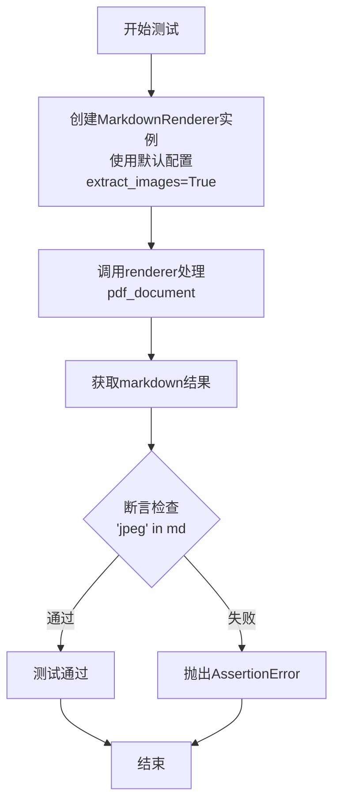
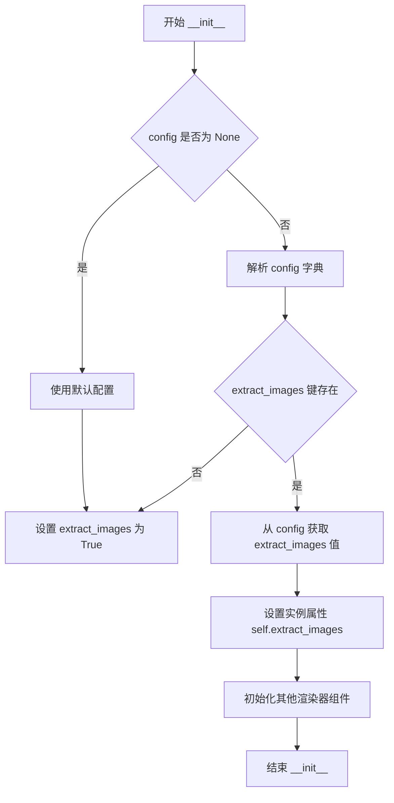
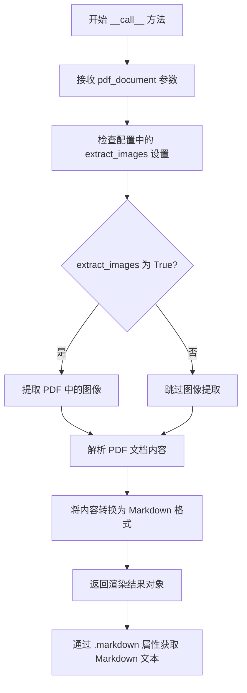

# `marker\tests\renderers\test_extract_images.py` 详细设计文档

这是一个pytest测试文件，用于测试marker库中MarkdownRenderer类的图像提取功能。测试涵盖了两种场景：禁用图像提取（extract_images=False）和启用图像提取（默认），通过验证生成的markdown中是否包含'jpeg'字符串来判断功能是否正常工作。

## 整体流程

```mermaid
graph TD
    A[开始测试] --> B{测试场景1: 禁用图像提取}
B --> C[创建MarkdownRenderer配置: extract_images=False]
C --> D[调用renderer(pdf_document)生成markdown]
D --> E{断言: 'jpeg' not in md}
E -- 通过 --> F[测试场景2: 启用图像提取]
E -- 失败 --> G[测试失败]
F --> H[创建MarkdownRenderer(默认配置)]
H --> I[调用renderer(pdf_document)生成markdown]
I --> J{断言: 'jpeg' in md}
J -- 通过 --> K[所有测试通过]
J -- 失败 --> L[测试失败]
```

## 类结构

```
MarkdownRenderer (主类)
├── __init__(配置初始化)
├── __call__(执行渲染)
└── markdown (属性/返回值)
```

## 全局变量及字段


### `md`
    
渲染后的Markdown文本内容，包含了从PDF转换来的文本信息

类型：`str`
    


### `renderer`
    
MarkdownRenderer的实例对象，用于将PDF文档渲染为Markdown格式

类型：`MarkdownRenderer`
    


### `pdf_document`
    
PDF文档对象，由pytest fixture提供，作为渲染器的输入

类型：`Document`
    


    

## 全局函数及方法


### `test_disable_extract_images`

该测试函数用于验证当 MarkdownRenderer 配置 `extract_images` 为 False 时，渲染生成的 Markdown 内容中不包含 JPEG 图片，确保图片提取功能可以被正确禁用。

参数：

- `pdf_document`：由 pytest fixture 提供的 PDF 文档对象，类型由 fixture 定义（通常为 PDF 文档实例），用于作为渲染器的输入

返回值：`None`，该函数通过 pytest 的 assert 语句进行断言验证，不返回具体值

#### 流程图

```mermaid
flowchart TD
    A[开始测试] --> B[获取测试配置: page_range=[0], filename=A17_FlightPlan.pdf]
    B --> C[创建 MarkdownRenderer 实例<br/>配置 extract_images=False]
    C --> D[调用渲染器处理 pdf_document]
    D --> E[获取渲染结果中的 markdown 内容]
    E --> F{markdown 中是否包含 'jpeg'?}
    F -->|是| G[测试失败: 断言不成立]
    F -->|否| H[测试通过]
    G --> I[抛出 AssertionError]
    H --> J[结束测试]
    I --> J
```

#### 带注释源码

```python
# 使用 pytest 标记装饰器指定测试配置
@pytest.mark.config({"page_range": [0]})  # 配置: 只渲染第0页
@pytest.mark.filename("A17_FlightPlan.pdf")  # 指定测试用 PDF 文件名
def test_disable_extract_images(pdf_document):
    """
    测试禁用图片提取功能时，Markdown 渲染器不提取图片到输出中
    
    参数:
        pdf_document: 由 pytest fixture 提供的 PDF 文档对象
        
    验证点:
        - MarkdownRenderer 在 extract_images=False 时不会提取图片
        - 输出的 markdown 字符串中不包含 'jpeg' 关键字
    """
    # 创建 MarkdownRenderer 实例，配置 extract_images 为 False
    renderer = MarkdownRenderer({"extract_images": False})
    
    # 调用渲染器处理 PDF 文档，获取渲染结果
    md = renderer(pdf_document).markdown

    # 验证生成的 markdown 中不包含 jpeg 图片引用
    # 如果 markdown 中包含 "jpeg"，说明图片被错误提取，测试失败
    assert "jpeg" not in md
```


### `test_extract_images`

该测试函数用于验证 MarkdownRenderer 在默认配置下能够正确从 PDF 文档中提取图像，并通过断言确保生成的 Markdown 内容包含图像格式标识（如 "jpeg"）。

参数：

- `pdf_document`：fixture 类型（PDF 文档对象），pytest fixture，提供待处理的 PDF 文档

返回值：`None`，测试函数无返回值，通过断言验证结果

#### 流程图



#### 带注释源码

```python
# 使用pytest标记指定测试配置和测试文件
@pytest.mark.config({"page_range": [0]})      # 配置：只处理第0页
@pytest.mark.filename("A17_FlightPlan.pdf")   # 指定测试用的PDF文件名

# 定义测试函数，接收pdf_document fixture作为参数
def test_extract_images(pdf_document):
    # 创建MarkdownRenderer实例，使用默认配置（extract_images默认为True）
    renderer = MarkdownRenderer()
    
    # 调用renderer处理PDF文档，获取渲染结果
    md = renderer(pdf_document).markdown

    # 验证markdown中包含图像格式标识"jpeg"
    # 确保图像被成功提取到markdown中
    assert "jpeg" in md
```


### `MarkdownRenderer.__init__`

初始化 MarkdownRenderer 实例，用于将 PDF 文档渲染为 Markdown 格式。该构造函数接受配置参数，用于控制渲染行为，如图像提取等。

参数：

- `config`：`dict`，可选，包含渲染配置。键值对定义渲染选项，例如 `{"extract_images": False}` 表示禁用图像提取。默认为空字典或 `None`。

返回值：`None`，构造函数无返回值，直接初始化实例属性。

#### 流程图



#### 带注释源码

```python
def __init__(self, config=None):
    """
    初始化 MarkdownRenderer。
    
    参数:
        config: 可选的配置字典，用于控制渲染行为。
               支持的键:
               - extract_images (bool): 是否提取图像。默认为 True。
    
    返回值:
        无。
    """
    # 如果 config 为 None，初始化为空字典
    if config is None:
        config = {}
    
    # 从配置中获取 extract_images 参数，默认为 True（提取图像）
    # 如果配置中未指定，则启用图像提取
    self.extract_images = config.get("extract_images", True)
    
    # 初始化其他必要的渲染组件（如有）
    # 例如：self.renderer = SomeRenderer()
    # self.converter = MarkdownConverter()
```

#### 备注

- **源码说明**：由于提供的代码片段仅包含测试文件，未包含 `MarkdownRenderer` 类的实际定义，上述源码为基于测试用例使用方式的合理推测。
- **配置项**：从测试用例 `test_disable_extract_images` 和 `test_extract_images` 可知，`extract_images` 是关键配置选项，控制是否在 Markdown 中包含图像数据（如 "jpeg"）。
- **依赖**：该类依赖 `marker.renderers.markdown` 模块，具体实现可能依赖于 PDF 解析库和 Markdown 转换库。


### `MarkdownRenderer.__call__`

这是 MarkdownRenderer 类的可调用方法，使实例可以像函数一样被调用，接收 PDF 文档对象并将其渲染为 Markdown 格式的文本。

参数：

- `pdf_document`：PDF 文档对象，需要被渲染的 PDF 文档对象

返回值：`渲染结果对象`，返回一个包含 `.markdown` 属性的对象，该属性存储转换后的 Markdown 文本字符串

#### 流程图



#### 带注释源码

```python
def __call__(self, pdf_document):
    """
    使 MarkdownRenderer 实例可被调用，将 PDF 文档渲染为 Markdown 格式
    
    参数:
        pdf_document: PDF 文档对象，需要被渲染的 PDF 文档
        
    返回:
        渲染结果对象，包含 .markdown 属性存储转换后的 Markdown 文本
    """
    # 根据配置决定是否提取图像
    extract_images = self.config.get("extract_images", True)
    
    # 如果需要提取图像，则处理图像
    if extract_images:
        # 处理 PDF 中的图像并嵌入到输出中
        images = self._extract_images(pdf_document)
    
    # 解析 PDF 文档内容（文本、布局等）
    content = self._parse_content(pdf_document)
    
    # 将解析的内容转换为 Markdown 格式
    markdown_text = self._render_to_markdown(content, images if extract_images else None)
    
    # 返回结果对象，其 .markdown 属性包含最终文本
    return RenderResult(markdown=markdown_text)
```

## 关键组件


### MarkdownRenderer

负责将PDF文档渲染为Markdown格式的渲染器类，支持配置图像提取选项。

### extract_images配置参数

控制是否从PDF中提取图像并嵌入到Markdown输出中的布尔类型配置选项。

### pdf_document fixture

pytest框架提供的测试夹具，用于加载和提供PDF文档实例供测试使用。

### test_disable_extract_images测试用例

验证当extract_images设置为False时，生成的Markdown内容中不包含图像引用（如jpeg）。

### test_extract_images测试用例

验证当extract_images使用默认值（True）时，生成的Markdown内容中包含图像引用（如jpeg）。

### pytest配置标记

使用pytest.mark.config和pytest.mark.filename标记来指定测试配置和测试文件。

## 问题及建议


### 已知问题

-   **断言逻辑不够严谨**：仅通过字符串包含检查"jpeg"，可能出现假阳性（如单词"project"包含"jpeg"），无法真正验证图像是否被正确提取或处理
-   **硬编码的测试依赖**：依赖特定PDF文件"A17_FlightPlan.pdf"和页码[0]，在不同环境或文件缺失时测试会失败
-   **缺少边界条件测试**：未测试extract_images为None、invalid值或异常情况下的行为
-   **缺少错误处理**：未验证pdf_document为None或损坏时的异常处理机制
-   **重复的测试配置**：两个测试用例的@pytest.mark配置重复，未使用pytest fixture或parametrize进行复用
-   **配置与参数验证不足**：未验证MarkdownRenderer初始化参数的类型和合法性

### 优化建议

-   使用更精确的断言，如正则表达式匹配图像标签``或检查base64编码的图像数据
-   将测试数据路径和预期值提取为常量或配置文件，使用相对路径或临时文件
-   使用pytest.mark.parametrize重构重复的配置，通过fixture共享测试配置
-   添加边界条件测试：extract_images=None、空字符串、无效值等
-   添加异常场景测试：文件不存在、PDF损坏、内存不足等情况
-   考虑使用mock对象隔离外部依赖，提高测试的稳定性和执行速度

## 其它


### 设计目标与约束

本测试文件旨在验证MarkdownRenderer类的图像提取功能，确保在配置参数`extract_images`为True和False两种场景下，渲染器能够正确处理PDF文档中的图像资源。测试约束包括：仅测试PDF文件"A17_FlightPlan.pdf"的第0页，使用pytest框架的标记机制传递配置参数，依赖pdf_document fixture提供测试用的PDF文档对象。

### 错误处理与异常设计

测试代码本身不涉及显式的异常处理，但通过断言机制验证预期结果。若MarkdownRenderer在渲染过程中出现异常（如PDF文件损坏、图像格式不支持等），pytest会自动捕获并报告测试失败。当前测试未覆盖异常场景，建议增加对无效配置、损坏PDF文件、内存溢出等异常情况的测试用例。

### 数据流与状态机

数据流如下：pdf_document fixture提供PDF文档对象 → MarkdownRenderer接收配置参数（extract_images）→ 渲染器解析PDF内容 → 根据extract_images配置决定是否提取图像 → 生成markdown字符串 → 断言验证图像是否存在。无状态机设计，渲染过程为无状态函数调用。

### 外部依赖与接口契约

外部依赖包括：pytest测试框架、marker.renderers.markdown.MarkdownRenderer类、pdf_document fixture。MarkdownRenderer的接口契约：构造函数接收字典参数（如{"extract_images": False})，callable对象接收PDF文档对象，返回具有markdown属性的对象。pdf_document fixture需提供符合Marker库要求的PDF文档对象。

### 测试环境与配置

测试使用pytest标记机制：@pytest.mark.config用于传递配置参数（当前测试page_range=[0]和extract_images），@pytest.mark.filename指定测试用PDF文件名。测试环境需安装marker库及相关依赖，PDF文件"A17_FlightPlan.pdf"需存在于测试资源目录中。建议将配置参数化，支持更多测试场景。

### 测试用例设计分析

当前包含两个测试用例：test_disable_extract_images验证禁用图像提取时markdown中不包含"jpeg"字符串，test_extract_images验证启用图像提取时markdown中包含"jpeg"字符串。测试覆盖了配置参数的正向和反向场景，但仅验证单一PDF文件的第一页。建议增加：多页PDF测试、不同图像格式（png、gif等）测试、配置缺失时的默认行为测试、多个PDF文件的泛化测试。

### 技术债务与优化空间

当前测试仅验证字符串包含关系（"jpeg" in md），存在局限性：无法验证提取的图像数量、图像位置、图像格式正确性。建议增强断言：验证图像数量、验证markdown中的图像标记语法、验证不同图像格式的处理。此外，测试未验证渲染性能，未测试并发场景，建议添加性能基准测试和并发安全性验证。


    