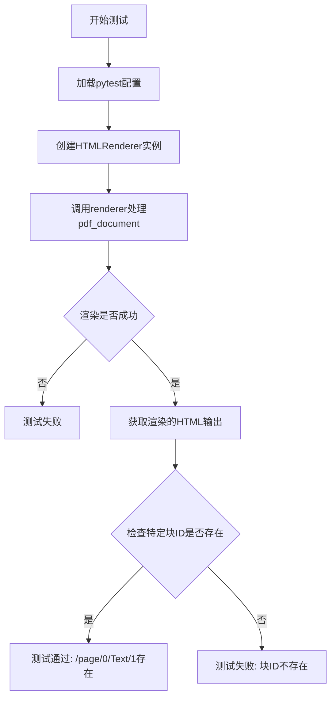
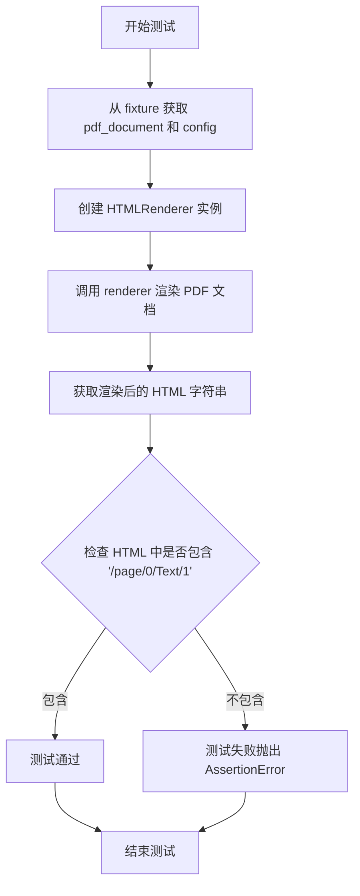
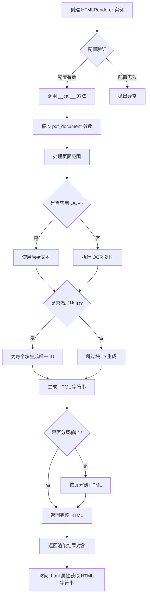
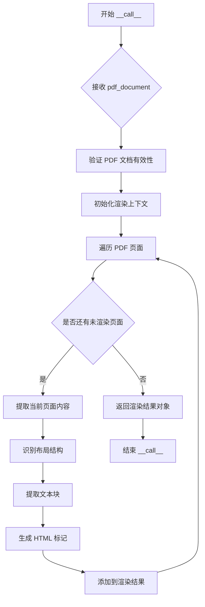

# `marker\tests\renderers\test_html_renderer.py` 详细设计文档

这是一个pytest测试文件，用于测试marker库中HTMLRenderer类的块ID生成功能，验证渲染器能否正确为PDF文档的每个文本块生成唯一的标识符（如/page/0/Text/1），以便后续的文本定位和引用操作。

## 整体流程



## 类结构

```
测试模块 (test_marker_renderer.py)
└── 测试函数: test_html_renderer_block_ids
    └── 依赖: HTMLRenderer (from marker.renderers.html)
        └── 依赖: pdf_document fixture
        └── 依赖: config fixture
```

## 全局变量及字段


### `pdf_document`
    
PDF文档对象，由pytest fixture提供，用于测试PDF渲染功能

类型：`pytest fixture (PDFDocument)`
    


### `config`
    
配置字典，包含页面范围、OCR开关、块ID添加和分页等渲染配置

类型：`pytest fixture (dict)`
    


### `renderer`
    
HTMLRenderer实例，用于将PDF文档渲染为HTML输出

类型：`HTMLRenderer`
    


### `html`
    
渲染输出的HTML字符串，包含PDF内容的HTML表示

类型：`str`
    


### `HTMLRenderer.html`
    
渲染输出的HTML字符串，包含PDF页面内容的HTML表示

类型：`str`
    
    

## 全局函数及方法


### `test_html_renderer_block_ids`

该测试函数用于验证 HTMLRenderer 在启用 `add_block_ids` 配置时，能够正确地在生成的 HTML 中嵌入页面块 ID（如 "/page/0/Text/1"），确保输出包含指定的块标识符。

参数：

- `pdf_document`：Pytest Fixture，提供一个 PDF 文档对象作为渲染输入
- `config`：Pytest Fixture，提供包含页面范围、OCR 禁用、块 ID 添加和分页配置的字典对象

返回值：`None`，该函数为测试函数，通过 assert 断言验证结果，不返回具体值

#### 流程图



#### 带注释源码

```python
import pytest
# 导入 pytest 库用于编写测试

from marker.renderers.html import HTMLRenderer
# 从 marker 库导入 HTMLRenderer 类，用于将 PDF 渲染为 HTML

# 使用 pytest.mark.config 装饰器配置测试环境
@pytest.mark.config(
    {
        "page_range": [0],          # 只渲染第 0 页
        "disable_ocr": True,         # 禁用 OCR 文字识别
        "add_block_ids": True,      # 启用块 ID 添加功能
        "paginate_output": True,     # 启用分页输出
    }
)
def test_html_renderer_block_ids(pdf_document, config):
    """
    测试 HTMLRenderer 能否正确生成包含块 ID 的 HTML 输出
    
    参数:
        pdf_document: PDF 文档对象，由 pytest fixture 提供
        config: 配置字典，包含渲染选项
    """
    # 使用配置创建 HTMLRenderer 实例
    renderer = HTMLRenderer(config)
    
    # 调用 renderer 处理 PDF 文档，获取渲染结果
    # renderer 返回一个包含 html 属性的对象
    html = renderer(pdf_document).html

    # 验证生成的 HTML 中包含特定的块 ID 格式 "/page/0/Text/1"
    # 这确保了 add_block_ids 配置项正常工作
    assert "/page/0/Text/1" in html
```


### `HTMLRenderer`

这是从 `marker.renderers.html` 模块导入的渲染器类，负责将 PDF 文档转换为 HTML 格式，支持块 ID、OCR、分页等功能配置。

参数：

- `config`：`dict` 或配置对象，包含渲染器的配置选项（如页面范围、是否禁用 OCR、是否添加块 ID、是否分页等）

返回值：`HTMLRenderer` 实例，返回一个可调用对象，其 `__call__` 方法接收 PDF 文档并返回渲染结果对象（包含 `html` 属性）

#### 流程图



#### 带注释源码

```python
import pytest

# 从 marker.renderers.html 模块导入 HTMLRenderer 类
# 该类负责将 PDF 文档渲染为 HTML 格式
from marker.renderers.html import HTMLRenderer


@pytest.mark.config(
    {
        "page_range": [0],           # 配置：只渲染第0页
        "disable_ocr": True,         # 配置：禁用 OCR 光学字符识别
        "add_block_ids": True,      # 配置：为每个文本块添加唯一标识符
        "paginate_output": True,     # 配置：分页输出结果
    }
)
def test_html_renderer_block_ids(pdf_document, config):
    # 创建 HTMLRenderer 实例，传入配置对象
    renderer = HTMLRenderer(config)
    
    # 调用 renderer 实例（实际上是调用 __call__ 方法）
    # 参数：pdf_document - PDF 文档对象
    # 返回值：渲染结果对象，包含 html 属性
    rendered_result = renderer(pdf_document)
    
    # 从渲染结果中获取 HTML 字符串
    html = rendered_result.html

    # 验证某些块 ID 是否存在于 HTML 中
    # 块 ID 格式示例：/page/0/Text/1 表示第0页第1个文本块
    assert "/page/0/Text/1" in html
```


### `HTMLRenderer.__call__`

`HTMLRenderer` 类的 `__call__` 方法是实现可调用对象的核心方法，它接收一个 PDF 文档对象作为输入，经过渲染处理后返回一个包含 HTML 结果的渲染对象。该方法是将 PDF 转换为 HTML 的主要入口点。

参数：

- `pdf_document`：`PDF 文档对象`，待渲染的 PDF 文档对象，包含页面内容、布局等信息

返回值：`渲染结果对象`，返回一个包含 `.html` 属性的渲染结果对象，其中 `.html` 属性存储了转换后的 HTML 字符串

#### 流程图



#### 带注释源码

```python
def __call__(self, pdf_document):
    """
    HTMLRenderer 的可调用方法，将 PDF 文档转换为 HTML
    
    参数:
        pdf_document: PDF 文档对象，包含一个或多个页面的内容
    
    返回:
        渲染结果对象，包含转换后的 HTML 内容，通过 .html 属性访问
    """
    # 1. 验证输入的 PDF 文档对象
    # 确保 pdf_document 包含必要的页面数据和元信息
    if not pdf_document:
        raise ValueError("PDF document cannot be empty")
    
    # 2. 初始化渲染结果容器
    # 创建一个列表来收集各页面的 HTML 片段
    html_parts = []
    
    # 3. 获取配置信息
    # 从 self.config 中读取页面范围、分页等设置
    page_range = self.config.get("page_range", [0])
    paginate = self.config.get("paginate_output", True)
    
    # 4. 遍历指定页面范围进行渲染
    for page_num in page_range:
        # 获取当前页面的文档对象
        page = pdf_document[page_num]
        
        # 5. 提取页面内容
        # 调用内部方法提取文本、布局等信息
        page_content = self._extract_page_content(page)
        
        # 6. 生成 HTML 表示
        # 将提取的内容转换为 HTML 标记语言
        html_fragment = self._render_page_to_html(page_content)
        
        # 7. 添加块ID（如果配置中启用）
        # 根据配置添加块标识符用于追踪
        if self.config.get("add_block_ids"):
            html_fragment = self._add_block_ids(html_fragment, page_num)
        
        # 8. 将页面 HTML 添加到结果集
        html_parts.append(html_fragment)
    
    # 9. 组装最终的 HTML 文档
    # 合并所有页面并添加必要的文档结构标签
    full_html = self._assemble_html_document(html_parts)
    
    # 10. 创建并返回渲染结果对象
    # 返回一个具有 .html 属性的结果对象
    return RenderResult(html=full_html)
```


## 关键组件


### HTMLRenderer

负责将PDF文档渲染为HTML格式的核心渲染器类

### 测试配置 (test_html_renderer_block_ids)

包含页面范围、OCR禁用、块ID添加和分页输出等渲染选项的测试配置

### 块ID系统

为PDF中的文本块生成唯一标识符的机制，格式为"/page/{页码}/Text/{块序号}"

### pytest fixtures

提供测试所需的PDF文档对象和配置对象的测试框架组件


## 问题及建议


### 已知问题

- 硬编码的block ID断言：`"/page/0/Text/1"` 作为硬编码值测试，缺乏灵活性和可维护性
- 测试覆盖率不足：仅验证单个block ID的存在，未测试其他block ID、边界情况或错误场景
- 缺乏错误处理验证：未测试HTML渲染失败、配置异常或文档为空时的行为
- 断言信息不明确：使用简单的 `in` 断言，失败时缺乏有意义的错误提示信息
- 依赖外部Fixture：依赖 `pdf_document` 和 `config` Fixture，但这些依赖的可用性和正确性未在测试中体现
- 配置方式局限性：`@pytest.mark.config` 方式不如pytest fixture灵活，难以动态调整或共享配置

### 优化建议

- 使用参数化测试（`@pytest.mark.parametrize`）验证多个block ID和页面场景，增强测试覆盖率
- 添加明确的断言消息，如 `assert "/page/0/Text/1" in html, f"Expected block ID not found in HTML output: {html[:200]}"`
- 增加异常测试用例，验证渲染器在无效输入时的错误处理逻辑
- 考虑使用pytest fixture替代 `@pytest.mark.config`，提高配置的复用性和灵活性
- 添加HTML内容验证的辅助函数，检查结构完整性而不仅仅是字符串包含关系
- 为 `pdf_document` 和 `config` 添加类型注解和mock，提高测试的可读性和隔离性

## 其它


### 设计目标与约束

本测试文件的设计目标是验证HTMLRenderer类在特定配置下能够正确生成包含块ID的HTML输出。设计约束包括：必须使用pytest框架、依赖特定的marker库版本、配置参数必须在测试中明确指定。

### 错误处理与异常设计

测试中的错误处理主要依赖于pytest的断言机制。当HTML输出中不包含预期的块ID时，断言失败并抛出AssertionError。配置文件缺失或格式错误会导致pytest.mark.config装饰器失败。PDF文档加载失败会导致pdf_document fixture失败。

### 数据流与状态机

数据流从pdf_document开始流经HTMLRenderer，转换为HTML字符串输出。状态机包含三个状态：初始化状态（创建渲染器实例）、处理状态（调用renderer生成HTML）、验证状态（断言检查HTML内容）。状态转换由pytest测试流程控制。

### 外部依赖与接口契约

外部依赖包括：marker.renderers.html.HTMLRenderer类、pytest框架、pdf_document fixture、config fixture。接口契约要求：HTMLRenderer构造函数接受config参数、render实例可调用并返回包含html属性的对象、pdf_document对象可被HTMLRenderer正确处理。

### 测试覆盖范围

当前测试仅覆盖单个页面、启用块ID的场景。未覆盖的测试场景包括：多页面渲染、禁用块ID、不同的page_range配置、OCR启用状态、HTML结构完整性验证、样式渲染验证。

### 配置参数说明

page_range参数控制处理的页面范围，当前值为[0]表示仅处理第一页。disable_ocr参数控制是否禁用OCR功能，当前值为True。add_block_ids参数控制是否添加块ID，当前值为True。paginate_output参数控制是否分页输出，当前值为True。

### 测试环境要求

测试环境需要安装marker库、pytest框架及相关的测试依赖。PDF测试文档必须包含可渲染的文本内容以生成"/page/0/Text/1"这样的块ID。

    