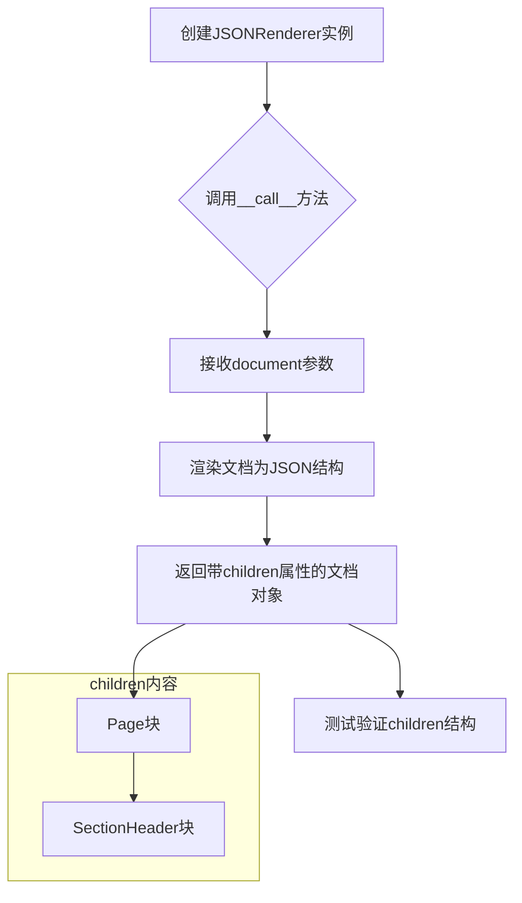

# `marker\tests\renderers\test_json_renderer.py` 详细设计文档

这是一个pytest测试文件，用于测试JSONRenderer类的分页渲染功能，验证PDF文档在指定页面范围（page_range=[0]）下能正确渲染出单个页面，并且页面包含正确的块类型（Page和SectionHeader）

## 整体流程

```mermaid
graph TD
    A[开始测试] --> B[导入依赖]
B --> C[创建JSONRenderer实例]
C --> D[调用renderer处理pdf_document]
D --> E[获取渲染结果的children属性]
E --> F{断言: 页面数量==1?}
F -- 否 --> G[测试失败]
F -- 是 --> H{断言: pages[0].block_type=='Page'}
H -- 否 --> G
H -- 是 --> I{断言: pages[0].children[0].block_type=='SectionHeader'}
I -- 否 --> G
I -- 是 --> J[测试通过]
```

## 类结构

```
JSONRenderer (渲染器类)
└── 继承关系未知（需查看marker.renderers.json源码）
```

## 全局变量及字段


### `pages`
    
JSONRenderer渲染结果的孩子节点列表，通常包含Page块对象

类型：`List[Block]`
    


### `pdf_document`
    
PDF文档对象fixture，提供待渲染的PDF文档内容

类型：`Document`
    


    

## 全局函数及方法


### `test_markdown_renderer_pagination`

这是一个pytest测试函数，用于验证JSONRenderer在配置了page_range为[0]时的分页功能是否正确工作。

参数：

- `pdf_document`：`PDFDocument`，pytest fixture，提供了PDF文档对象用于渲染测试

返回值：`None`，该函数为测试函数，不返回任何值（通过断言验证）

#### 流程图

```mermaid
flowchart TD
    A[开始测试] --> B[配置page_range为0的装饰器]
    B --> C[创建JSONRenderer实例]
    C --> D[调用renderer处理pdf_document]
    D --> E[获取返回的children即pages]
    E --> F{断言pages数量为1}
    F -->|是| G[断言pages[0]的block_type为Page]
    G --> H[断言pages[0].children[0]的block_type为SectionHeader]
    H --> I[测试通过]
    F -->|否| J[测试失败]
```

#### 带注释源码

```python
import pytest
# 导入pytest库用于测试框架

from marker.renderers.json import JSONRenderer
# 从marker.renderers.json模块导入JSONRenderer类

@pytest.mark.config({"page_range": [0]})
# pytest装饰器，配置测试环境：设置page_range为[0]，表示只渲染第0页
def test_markdown_renderer_pagination(pdf_document):
    # 测试函数：验证markdown渲染器的分页功能
    # 参数pdf_document: PDF文档fixture，由pytest提供
    
    renderer = JSONRenderer()
    # 创建JSONRenderer实例，用于将PDF渲染为JSON格式
    
    pages = renderer(pdf_document).children
    # 调用renderer处理pdf_document，获取渲染结果
    # .children属性包含所有页面对象
    
    assert len(pages) == 1
    # 断言：验证只生成了1页（因为page_range=[0]）
    
    assert pages[0].block_type == "Page"
    # 断言：验证第一页的block_type为"Page"
    
    assert pages[0].children[0].block_type == "SectionHeader"
    # 断言：验证第一页的第一个子元素是SectionHeader类型
    # 这验证了PDF内容被正确解析为文档块结构
```


### `JSONRenderer.__call__`

将PDF文档对象渲染为JSON格式的结构化数据，返回一个包含页面层级关系的文档对象。

参数：

-  `self`：无参数描述（隐式参数），Python对象自身引用
-  `document`：`Any`（具体类型未知，从测试推断为pdf_document对象），待渲染的PDF文档对象

返回值：`Any`，渲染后的文档对象，包含层级化的children属性，用于访问页面和内容块

#### 流程图



#### 带注释源码

```python
# 源代码未在提供的代码中给出，以下是基于测试用法的推断

class JSONRenderer:
    """
    JSON渲染器类
    负责将PDF文档对象转换为JSON格式的结构化数据
    """
    
    def __init__(self):
        """
        初始化JSONRenderer实例
        不接受任何配置参数（从测试代码推断）
        """
        pass
    
    def __call__(self, document):
        """
        使得JSONRenderer实例可调用
        将传入的PDF文档对象渲染为JSON结构
        
        参数:
            document: PDF文档对象，来自pdf_document fixture
            
        返回:
            渲染后的文档对象，包含children属性
            children是一个列表，包含Page块
            每个Page块包含子块如SectionHeader
        """
        # 1. 接收PDF文档对象
        # 2. 解析文档内容
        # 3. 构建层级结构：Document -> Page -> SectionHeader/Paragraph/etc.
        # 4. 返回带有children属性的文档对象
        pass
```

**注意**：由于提供的代码仅包含测试文件，未包含 `JSONRenderer` 类的实际实现源码。以上信息基于测试代码 `renderer(pdf_document).children` 的调用方式推断得出。


## 关键组件


### JSONRenderer

从marker.renderers.json导入的JSON渲染器类，负责将PDF文档内容渲染为JSON格式，是核心的渲染组件。

### pytest.mark.config

pytest的标记装饰器，用于配置测试参数，此处设置page_range为[0]，即只渲染第一页。

### test_markdown_renderer_pagination

测试函数，用于验证JSONRenderer的分页功能是否正常工作，确保指定页码范围时只渲染对应页面。

### pdf_document

测试夹具参数，提供了PDF文档的测试数据，用于渲染器的输入。

### 分页验证逻辑

测试中的断言逻辑，验证渲染结果只包含一页，且该页包含SectionHeader块，验证了渲染输出的结构正确性。


## 问题及建议


### 已知问题

-   **硬编码的页码范围**：使用 `page_range: [0]` 硬编码，仅测试了第一页，未覆盖多页场景或其他页码范围
-   **断言堆叠导致测试脆弱**：多个断言连续堆叠，第一个失败会导致后续断言不执行，无法全面了解失败原因
-   **缺乏边界条件测试**：未测试空PDF文档、PDF页数不足、children为空等边界情况
-   **未验证实际内容正确性**：仅检查 `block_type`，未验证 `children` 的实际数据内容是否符合预期
-   **外部Fixture依赖不明确**：`pdf_document` fixture 未在当前文件中定义，测试依赖于外部注入，缺少显式声明
-   **缺少错误处理测试**：未测试 `pdf_document` 为 `None`、renderer 初始化失败等异常场景

### 优化建议

-   使用 `@pytest.mark.parametrize` 参数化测试不同 `page_range` 值（如 `[0]`、`[0,1]`、`[0,-1]`）以提高覆盖率
-   使用 `pytest.raises` 编写负面测试用例，验证异常情况下的错误处理
-   拆分长断言为独立变量或使用辅助断言函数，提高可读性和调试能力
-   添加常量定义替代魔法数字（如 `PAGE_INDEX = 0`），增强代码可维护性
-   补充对 `children` 内容的数据验证，而不仅限于类型检查
-   考虑使用 `pytest.fixture` 显式声明 `pdf_document` fixture 的作用域和返回值类型要求

## 其它


### 设计目标与约束

该测试验证JSONRenderer的分页功能，确保在给定page_range配置为[0]时，仅渲染第一页。设计目标包括：1) 验证分页逻辑正确性；2) 确保渲染器正确解析PDF文档并生成分页结构；3) 验证每个页面包含正确的块类型（Block Type）。

### 错误处理与异常设计

测试用例使用pytest的断言机制进行错误验证。当分页数量不符合预期时，assert语句将抛出AssertionError。对于PDF解析失败或渲染异常，应由JSONRenderer内部捕获并转换为有意义的异常信息。测试通过检查children属性是否存在来间接验证渲染结果的完整性。

### 数据流与状态机

数据流：PDF文档 → JSONRenderer → 分页处理 → 渲染输出 → 页面对象数组。状态机包含：初始化状态（创建Renderer实例）→ 处理状态（调用renderer执行渲染）→ 完成状态（返回包含children的渲染结果）→ 验证状态（断言检查）。

### 外部依赖与接口契约

主要依赖：1) pytest框架（测试执行）；2) marker.renderers.json.JSONRenderer（核心渲染组件）；3) pdf_document fixture（PDF文档输入源）。接口契约：JSONRenderer必须实现__call__方法，接受pdf_document参数并返回可遍历对象，该对象包含children属性用于访问页面结构。

### 性能考虑

测试仅渲染单个页面（page_range: [0]），避免完整文档渲染带来的性能开销。在实际生产环境中，应考虑大文档的分页延迟加载策略，以及缓存机制以避免重复渲染。

### 安全性考虑

测试代码本身不涉及敏感数据处理。JSONRenderer应确保渲染输出不会泄露PDF文档中的敏感信息，如元数据、注释或隐藏文本内容。

### 测试策略

采用单元测试策略，验证JSONRenderer的分页功能。测试覆盖场景：1) 分页数量验证；2) 页面类型验证；3) 子元素结构验证。建议增加边界条件测试，如空页范围、无效页码范围、跨页内容连续性等场景。

### 配置说明

测试通过@pytest.mark.config装饰器注入配置：{"page_range": [0]}指定渲染页面范围。JSONRenderer应支持动态配置注入，并在配置变更时重新初始化渲染器状态。

### 使用示例

```python
renderer = JSONRenderer()
result = renderer(pdf_document)
pages = result.children
# 访问第一页
first_page = pages[0]
# 访问页面子元素
sections = first_page.children
```

### 版本兼容性

测试代码使用pytest框架，需确保与pytest 7.x版本兼容。JSONRenderer接口应保持向后兼容，避免破坏现有调用方代码。

    