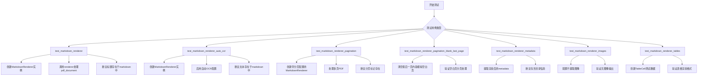
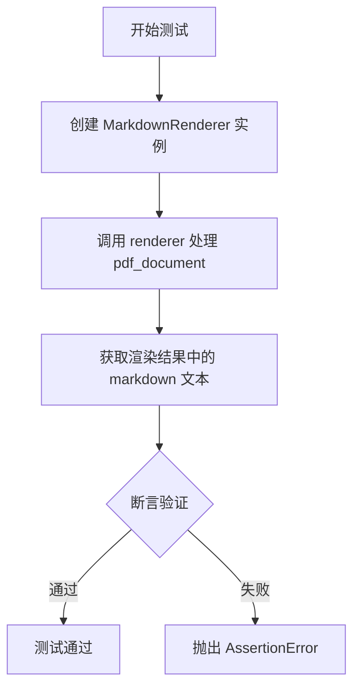
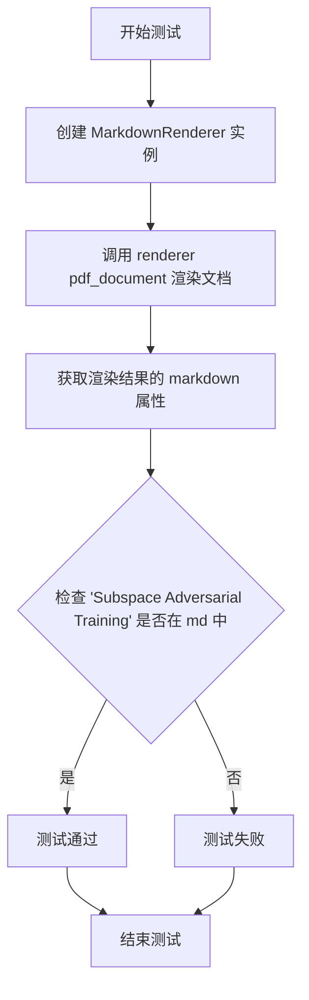
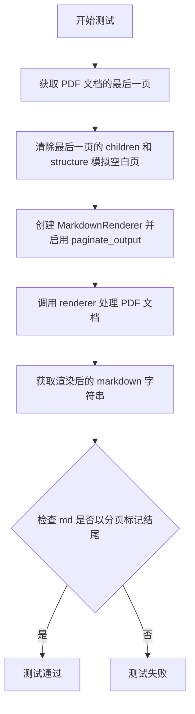
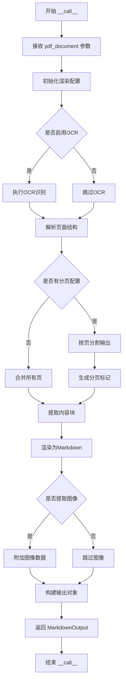

# `marker\tests\renderers\test_markdown_renderer.py` 详细设计文档

这是一个pytest测试文件，用于测试marker库中的MarkdownRenderer类，验证PDF文档到Markdown格式的转换功能，包括基本渲染、OCR自动识别、分页处理、元数据提取、图像提取和表格渲染等多个方面。

## 整体流程



## 类结构

```
测试模块 (test_marker_renderers_markdown)
├── MarkdownRenderer (被测类)
├── BlockTypes (枚举类)
└── TableCell (测试辅助类)
```

## 全局变量及字段


### `md`
    
渲染器输出的Markdown格式字符串

类型：`str`
    


### `metadata`
    
包含文档元数据的字典对象，如目录信息

类型：`dict`
    


### `markdown_output`
    
Markdown渲染器的输出对象，包含markdown和images属性

类型：`MarkdownRendererOutput`
    


### `table`
    
从PDF文档中提取的表格块对象

类型：`Block`
    


### `page`
    
PDF文档的页面对象

类型：`Page`
    


### `cell`
    
手动创建的表格单元格对象，用于测试

类型：`TableCell`
    


### `TableCell.polygon`
    
表格单元格的坐标多边形区域

类型：`list/tuple`
    


### `TableCell.text_lines`
    
表格单元格内的文本行列表，支持HTML和MathML标签

类型：`list[str]`
    


### `TableCell.rowspan`
    
表格单元格跨越的行数

类型：`int`
    


### `TableCell.colspan`
    
表格单元格跨越的列数

类型：`int`
    


### `TableCell.row_id`
    
表格单元格所在的行索引

类型：`int`
    


### `TableCell.col_id`
    
表格单元格所在的列索引

类型：`int`
    


### `TableCell.is_header`
    
标识表格单元格是否为表头行

类型：`bool`
    


### `TableCell.page_id`
    
表格单元格所属页面的标识符

类型：`str/int`
    
    

## 全局函数及方法


### `test_markdown_renderer`

这是一个 pytest 测试函数，用于验证 `MarkdownRenderer` 类将 PDF 文档转换为 Markdown 的核心功能是否正常工作。

参数：

-  `pdf_document`：`PDFDocument`（或类似的 PDF 文档对象），由 pytest fixture 提供，表示待渲染的 PDF 文档

返回值：`None`，该函数为测试函数，通过断言进行验证，不返回具体值

#### 流程图



#### 带注释源码

```python
@pytest.mark.config({"page_range": [0], "disable_ocr": True})
def test_markdown_renderer(pdf_document):
    """
    测试 MarkdownRenderer 的基本渲染功能。
    
    使用配置：
    - page_range: [0] - 只渲染第一页
    - disable_ocr: True - 禁用 OCR 识别
    
    参数：
        pdf_document: pytest fixture，提供 PDF 文档对象
        
    返回值：
        None（通过断言验证，不返回具体值）
    """
    # 创建一个 MarkdownRenderer 实例
    renderer = MarkdownRenderer()
    
    # 调用 renderer 处理 PDF 文档，获取渲染结果
    # 渲染结果是一个包含 markdown 属性的对象
    md = renderer(pdf_document).markdown

    # 验证生成的 markdown 文本中包含指定的标题
    # "# Subspace Adversarial Training" 是期望在 PDF 第一页中找到的标题
    assert "# Subspace Adversarial Training" in md
```


### `test_markdown_renderer_auto_ocr`

该函数是一个 pytest 测试用例，用于验证 MarkdownRenderer 在启用自动 OCR 功能时能够正确识别并渲染 PDF 文档中的文本内容。测试通过检查输出 Markdown 中是否包含特定文本片段来确认 OCR 功能正常工作。

参数：

- `pdf_document`：`pytest.fixture`，PDF 文档对象，由 pytest 框架自动注入，提供待渲染的 PDF 文档实例

返回值：`None`，该函数为测试用例，通过断言验证功能而非返回值

#### 流程图



#### 带注释源码

```python
# 使用 pytest 配置装饰器，设置 page_range 为 [0]，启用默认 OCR 功能
@pytest.mark.config({"page_range": [0]})
def test_markdown_renderer_auto_ocr(pdf_document):
    # 创建 MarkdownRenderer 实例，使用默认配置（启用 OCR）
    renderer = MarkdownRenderer()
    
    # 调用渲染器处理 PDF 文档，获取渲染结果对象
    rendered_output = renderer(pdf_document)
    
    # 从渲染结果中提取 markdown 文本内容
    md = rendered_output.markdown

    # 验证 markdown 输出中包含特定文本，确认 OCR 功能正常识别了文档内容
    assert "Subspace Adversarial Training" in md
```


### `test_markdown_renderer_pagination`

该测试函数用于验证 MarkdownRenderer 的分页输出功能。它通过渲染一个包含两页的 PDF 文档，并检查生成的 Markdown 中是否正确包含了分页标记 `{0}` 和 `{1}`。

参数：

- `pdf_document`：`PDFDocument`（或类似的 PDF 文档对象），pytest fixture，提供测试用的 PDF 文档实例

返回值：`None`，该函数为测试函数，没有显式返回值（返回 None）

#### 流程图

```mermaid
flowchart TD
    A[开始测试] --> B[配置测试环境<br/>page_range: [0, 1]<br/>paginate_output: True]
    B --> C[创建 MarkdownRenderer 实例<br/>参数: paginate_output: True]
    C --> D[调用 renderer 处理 pdf_document]
    D --> E[获取渲染后的 markdown 内容]
    E --> F{验证分页标记}
    F -->|包含 {0}-| G[验证第一页分页标记]
    F -->|包含 {1}-| H[验证第二页分页标记]
    G --> I[测试通过]
    H --> I
    F -->|不包含| J[测试失败]
```

#### 带注释源码

```python
@pytest.mark.config({"page_range": [0, 1], "paginate_output": True})
def test_markdown_renderer_pagination(pdf_document):
    """
    测试 MarkdownRenderer 的分页输出功能。
    
    该测试验证当启用分页输出时，渲染器能够正确地在
    Markdown 内容中插入分页标记，以便区分不同页面的内容。
    
    Args:
        pdf_document: pytest fixture，提供包含多页的 PDF 文档
        
    Returns:
        None: 测试函数无返回值，通过 assert 断言验证结果
    """
    # 创建 MarkdownRenderer 实例，启用分页输出选项
    renderer = MarkdownRenderer({"paginate_output": True})
    
    # 调用渲染器处理 PDF 文档，获取渲染结果
    # renderer 返回一个包含 markdown 属性的对象
    md = renderer(pdf_document).markdown

    # 验证生成的 Markdown 中包含第一页的分页标记 {0}-
    # 分页标记通常以换行符开头，形成视觉分隔
    assert "\n\n{0}-" in md
    
    # 验证生成的 Markdown 中包含第二页的分页标记 {1}-
    assert "\n\n{1}-" in md
```


### `test_markdown_renderer_pagination_blank_last_page`

该测试函数验证 MarkdownRenderer 在处理包含空白最后一页的 PDF 文档时的分页行为，确保在最后一页为空时仍能正确保留分页标记和尾随换行符。

参数：

- `pdf_document`：`pytest.fixture`，测试用的 PDF 文档对象，包含多个页面

返回值：`None`，测试函数无返回值，通过 assert 语句验证行为

#### 流程图



#### 带注释源码

```python
@pytest.mark.config({"page_range": [0, 1], "paginate_output": True})
def test_markdown_renderer_pagination_blank_last_page(pdf_document):
    # 清除 PDF 最后一页的所有子元素和结构，模拟空白页场景
    last_page = pdf_document.pages[-1]  # 获取最后一页对象
    last_page.children = []              # 清空页面子元素列表
    last_page.structure = []             # 清空页面结构列表

    # 创建 MarkdownRenderer，启用分页输出选项
    renderer = MarkdownRenderer({"paginate_output": True})
    # 调用渲染器处理修改后的 PDF 文档
    md = renderer(pdf_document).markdown

    # 验证渲染结果：
    # 1. 空白最后一页应该以分页标记结尾
    # 2. 保留尾随的两个换行符
    assert md.endswith("}\n\n") or md.endswith(
        "}------------------------------------------------\n\n"
    )
```

#### 关键组件信息

| 组件名称 | 一句话描述 |
|---------|-----------|
| `MarkdownRenderer` | 将 PDF 文档渲染为 Markdown 格式的核心类，支持分页输出 |
| `pdf_document.pages` | PDF 文档的页面集合，支持索引访问 |
| `paginate_output` | 配置选项，控制是否在输出中插入分页标记 |

#### 潜在技术债务与优化空间

1. **测试断言的脆弱性**：使用 `endswith` 两种可能的结果表明分页逻辑存在不确定性，应统一分页标记格式
2. **硬编码的页面范围**：测试使用 `[0, 1]` 固定页面范围，缺乏对动态页面数量的适应性
3. **重复的渲染器创建逻辑**：多个测试函数重复创建 `MarkdownRenderer` 对象，可提取为共享 fixture

#### 其他项目

- **设计目标**：验证分页功能在边界条件（空白页）下的正确性
- **错误处理**：未显式处理 PDF 文档为空或页面索引越界的情况
- **外部依赖**：依赖 `marker` 库的 `MarkdownRenderer` 类和 pytest 框架


### `test_markdown_renderer_metadata`

该测试函数用于验证 MarkdownRenderer 在渲染 PDF 文档时能够正确提取并返回元数据（metadata），特别是验证返回的元数据中包含 `table_of_contents`（目录）信息。

参数：

- `pdf_document`：`pytest.fixture`，PDF 文档对象，由 pytest fixture 提供，用于测试的输入文档

返回值：`dict`，渲染结果中的 metadata 元数据字典，应包含 "table_of_contents" 键

#### 流程图

```mermaid
flowchart TD
    A[开始测试] --> B[设置 pytest 配置: page_range=[0,1]]
    B --> C[创建 MarkdownRenderer 实例]
    C --> D[配置渲染器: paginate_output=True]
    D --> E[调用 renderer(pdf_document) 渲染文档]
    E --> F[获取渲染结果的 metadata 属性]
    F --> G{断言: 'table_of_contents' in metadata}
    G -->|是| H[测试通过]
    G -->|否| I[测试失败]
    H --> J[结束]
    I --> J
```

#### 带注释源码

```python
# 使用 pytest 配置标记，指定只处理第0页和第1页
@pytest.mark.config({"page_range": [0, 1]})
def test_markdown_renderer_metadata(pdf_document):
    # 创建 MarkdownRenderer 实例，配置启用分页输出
    renderer = MarkdownRenderer({"paginate_output": True})
    
    # 调用渲染器处理 PDF 文档，获取渲染结果
    # 渲染结果包含 markdown、metadata、images 等属性
    rendering_result = renderer(pdf_document)
    
    # 从渲染结果中提取 metadata 元数据
    metadata = rendering_result.metadata
    
    # 断言验证：元数据中必须包含 table_of_contents（目录）信息
    assert "table_of_contents" in metadata
```


### `test_markdown_renderer_images`

该测试函数用于验证 MarkdownRenderer 在禁用图像提取时的正确行为，确保渲染后的 markdown 输出中不包含任何图像内容，同时验证 images 列表为空。

参数：

- `pdf_document`：`PDFDocument`，pytest fixture，提供待渲染的 PDF 文档对象

返回值：`None`，测试函数无返回值

#### 流程图

```mermaid
flowchart TD
    A[开始测试] --> B[创建 MarkdownRenderer<br/>extract_images=False]
    B --> C[调用 renderer 渲染 pdf_document]
    C --> D{获取渲染结果}
    D --> E[断言: len(markdown_output.images) == 0]
    E --> F[断言: '  # 配置：只渲染前两页
def test_markdown_renderer_images(pdf_document):
    """
    测试 MarkdownRenderer 在禁用图像提取时的行为
    
    验证点：
    1. markdown_output.images 列表长度为 0（未提取图像）
    2. markdown_output.markdown 中不包含图片语法 
    
    # 使用 renderer 渲染 PDF 文档，获取渲染结果
    markdown_output = renderer(pdf_document)

    # 断言：验证 images 列表为空（未提取任何图像）
    assert len(markdown_output.images) == 0
    
    # 断言：验证 markdown 字符串中不包含图片语法
    assert "
def test_markdown_renderer_tables(pdf_document):
    """
    测试Markdown渲染器处理表格单元格中HTML和MathML标签的能力
    
    参数:
        pdf_document: pytest fixture提供的PDF文档对象
    """
    
    # 从PDF文档中获取第一个Table类型的块元素
    table = pdf_document.contained_blocks((BlockTypes.Table,))[0]
    
    # 获取PDF文档的第一页
    page = pdf_document.pages[0]

    # 创建一个TableCell对象，用于模拟表格单元格
    # 包含HTML标签 <i>, <br> 和 MathML标签 <math>
    cell = TableCell(
        polygon=table.polygon,  # 使用表格的 polygon 区域
        text_lines=["54<i>.45</i>67<br>89<math>x</math>"],  # 包含HTML和MathML的文本
        rowspan=1,  # 行跨度为1
        colspan=1,  # 列跨度为1
        row_id=0,   # 所在行索引为0
        col_id=0,   # 所在列索引为0
        is_header=False,  # 不是表头
        page_id=page.page_id,  # 关联到第一页
    )
    
    # 将创建的cell添加到页面的完整块列表中
    page.add_full_block(cell)
    
    # 清空表格的structure，为添加新的cell结构做准备
    table.structure = []
    
    # 将cell添加到表格的structure中
    table.add_structure(cell)

    # 创建MarkdownRenderer实例（默认配置）
    renderer = MarkdownRenderer()
    
    # 调用renderer处理PDF文档，获取渲染结果
    md = renderer(pdf_document).markdown
    
    # 验证渲染后的markdown是否正确转换了HTML和MathML标签
    # HTML <i> 转换为 Markdown *斜体*
    # HTML <br> 保持为 <br>
    # MathML <math> 转换为 $...$ (LaTeX数学公式格式)
    assert "54 <i>.45</i> 67<br>89 $x$" in md
```


### MarkdownRenderer.__call__

将PDF文档渲染为Markdown格式的核心方法，允许MarkdownRenderer实例像函数一样被调用，接受PDF文档对象并返回包含渲染结果的对象。

参数：

-  `pdf_document`：`PDFDocument`，待渲染的PDF文档对象，包含页面结构和内容

返回值：`MarkdownOutput`，包含渲染结果的输出对象，具有markdown（str）、metadata（dict）、images（list）等属性

#### 流程图



#### 带注释源码

```python
# 从测试代码推断的 __call__ 方法实现
def __call__(self, pdf_document):
    """
    将PDF文档渲染为Markdown格式
    
    参数:
        pdf_document: PDFDocument对象，包含待渲染的PDF文档内容
        
    返回:
        MarkdownOutput对象，包含以下属性:
            - markdown: str - 渲染后的Markdown字符串
            - metadata: dict - 文档元数据（如目录）
            - images: list - 提取的图像列表
    """
    # 1. 获取配置参数（如paginate_output, disable_ocr等）
    # config = self.config
    
    # 2. 如果未禁用OCR，则对文档进行OCR处理
    # if not config.get("disable_ocr", False):
    #     pdf_document = self._run_ocr(pdf_document)
    
    # 3. 遍历所有页面，提取结构化块（段落、表格、图像等）
    # blocks = self._extract_blocks(pdf_document)
    
    # 4. 将每个块渲染为对应的Markdown格式
    # markdown_parts = []
    # for block in blocks:
    #     markdown_parts.append(self._render_block(block))
    
    # 5. 如果启用分页，添加分页标记
    # if config.get("paginate_output", False):
    #     markdown = self._add_pagination(markdown_parts)
    # else:
    #     markdown = "\n\n".join(markdown_parts)
    
    # 6. 提取元数据（如目录）
    # metadata = self._extract_metadata(blocks)
    
    # 7. 根据配置决定是否提取图像
    # images = []
    # if config.get("extract_images", True):
    #     images = self._extract_images(blocks)
    
    # 8. 返回包含markdown、metadata、images的输出对象
    # return MarkdownOutput(
    #     markdown=markdown,
    #     metadata=metadata,
    #     images=images
    # )
    
    # 测试中的调用方式：
    # renderer = MarkdownRenderer(config_dict)
    # output = renderer(pdf_document)
    # md = output.markdown
    # metadata = output.metadata
    # images = output.images
```

## 关键组件


### MarkdownRenderer

核心的Markdown渲染器类，负责将PDF文档内容转换为Markdown格式。支持配置选项包括页面范围选择、OCR控制、分页输出和图像提取，通过__call__方法接收pdf_document参数并返回包含markdown和metadata的渲染结果对象。

### pdf_document

测试fixture提供的PDF文档对象，包含多个页面和结构化块内容。具有pages属性访问页面列表，contained_blocks方法获取指定类型的块，以及structure和children属性管理文档结构。

### BlockTypes.Table

表格块类型枚举值，用于识别和过滤PDF文档中的表格元素。在测试中用于获取PDF中的表格进行渲染验证。

### TableCell

表格单元格类，表示PDF中的表格单元格。包含多行文本内容（支持HTML标签和MathML数学公式）、rowspan和colspan属性、polygon坐标信息、row_id和col_id位置标识、is_header表头标记以及page_id页面关联。

### 配置选项

支持多种渲染配置：page_range指定处理的页面范围、disable_ocr控制是否禁用OCR光学字符识别、paginate_output启用分页输出功能、extract_images控制是否提取图像。这些配置通过字典参数传递给MarkdownRenderer构造函数。

### 分页输出标记

当启用paginate_output时，Markdown输出包含分页标记如{0}-{1}-格式，用于标识不同页面的内容边界。最后一页可能以}------------------------------------------------结尾。

### 混合内容渲染

支持渲染包含HTML标签（如<i>斜体</i>）和MathML数学公式（如<math>x</math>）的混合内容，测试验证了表格单元格中复杂内容的正确转换。


## 问题及建议


### 已知问题

-   **测试数据硬编码**：测试依赖于外部 `pdf_document` fixture 中的具体 PDF 内容（如 `"Subspace Adversarial Training"`、页码 `[5]` 等），当 PDF 内容变化时测试容易失败，缺乏对测试数据的显式控制。
-   **测试状态污染**：`test_markdown_renderer_tables` 直接修改了传入的 `pdf_document` 对象（添加 `TableCell`、清空 `structure`），未进行状态恢复，可能影响并行测试或其他测试用例。
-   **断言逻辑冗余**：在 `test_markdown_renderer_pagination_blank_last_page` 中使用 `or` 连接两个可能的结果进行断言，暴露了对输出格式的不确定性。
-   **配置方式不一致**：部分测试通过 `@pytest.mark.config` 传递配置，部分通过 `MarkdownRenderer()` 构造函数传递，缺乏统一的配置模式。
-   **Magic Number 和字符串**：页码范围 `[0]`、`[0, 1]`、`[5]` 以及特定字符串断言散落在各处，未抽取为常量或测试数据配置。
-   **缺少边界条件测试**：未覆盖空文档、单页文档、包含特殊字符的文档等边界情况。

### 优化建议

-   **抽取测试数据**：创建专用的测试 PDF fixture 或 mock 数据，明确控制文档内容，提高测试的确定性和可维护性。
-   **添加测试隔离和清理**：在修改文档状态的测试中使用 `pytest.fixture` 的 `request.addfinalizer` 或 `yield` 模式进行状态恢复，或使用深拷贝确保测试间隔离。
-   **统一配置方式**：明确配置优先级规则（fixture 配置 vs 运行时配置），并在代码中统一使用方式。
-   **参数化相似测试**：使用 `@pytest.mark.parametrize` 重构重复的页码范围测试，减少代码冗余。
-   **增强断言精确性**：明确期望的输出格式，避免使用模糊的 `or` 断言，确保对渲染结果的准确预期。
-   **补充边界测试**：添加空文档、单页文档、多语言字符、特殊格式（数学公式、表格嵌套）等场景的测试覆盖。


## 其它


### 设计目标与约束

该代码的MarkdownRenderer核心设计目标是将PDF文档高精度转换为Markdown格式，同时保留文档结构（标题、表格、图像等）。主要约束包括：支持配置化渲染（分页、OCR开关、图像提取等）、处理多页文档、模拟_blank页面场景。测试代码验证了转换的准确性、格式保留能力以及各种配置选项的正确性。

### 错误处理与异常设计

测试代码中主要通过pytest的assert语句进行验证，未显式展示异常处理逻辑。实际使用中MarkdownRenderer需处理：PDF解析失败、 unsupported PDF结构、配置参数非法、内存不足等情况。建议在详细设计中明确异常类型层次结构（如PDFParseError、ConfigurationError、RenderingError）及其处理策略。

### 数据流与状态机

数据流：PDF文档输入 → 配置解析 → 页面遍历 → 块识别（BlockTypes） → 结构解析 → Markdown渲染 → 输出Markdown字符串和元数据。状态机涉及：初始态（配置加载）→ 渲染中（逐页处理）→ 完成态（结果返回）。测试覆盖了单页/多页、_blank页、分页等不同状态转换场景。

### 外部依赖与接口契约

主要依赖：pytest（测试框架）、marker.renderers.markdown.MarkdownRenderer（核心渲染器）、marker.schema.BlockTypes（块类型枚举）、marker.schema.blocks.TableCell（表格单元块）。接口契约：MarkdownRenderer构造函数接受配置字典（可选），调用时传入PDF文档对象，返回包含markdown（字符串）、metadata（字典）、images（列表）属性的渲染结果对象。

### 性能考虑与优化空间

测试代码未包含性能测试用例。潜在性能关注点：大型PDF文档的内存占用、复杂表格的渲染效率、多页文档的分页处理。优化方向：流式处理长文档、缓存已解析的页面结构、并行处理独立页面。测试中通过paginate_output配置模拟了大文档场景。

### 配置管理

代码涉及多个配置项：page_range（指定渲染页码范围）、disable_ocr（禁用OCR识别）、paginate_output（启用分页输出）、extract_images（控制图像提取）。建议在详细设计中建立配置Schema，明确各配置项的类型（整数列表、布尔值）、默认值、互斥关系及配置校验规则。

### 兼容性考虑

测试使用@pytest.mark.config装饰器注入配置，说明MarkdownRenderer支持配置化定制。需考虑：不同PDF版本的兼容性（PDF 1.4-2.0）、跨平台路径处理、特殊字符编码（UTF-8、多语言PDF）。测试中包含OCR开关场景，反映了对OCR引擎可用性的兼容处理。

### 测试策略与覆盖率

测试覆盖场景：基本渲染、OCR启用/禁用、分页输出、_blank页处理、元数据提取、图像提取控制、复杂表格（含HTML标签和MathML）。建议补充边界条件测试：空PDF、单页超长内容、嵌套表格、损坏PDF输入、并发渲染等场景。

### 版本依赖与环境

代码使用pytest框架和marker库家族。需明确：Python版本要求（建议3.8+）、marker库版本约束、pytest版本要求、测试夹具（pdf_document）的来源及生命周期管理。测试使用@pytest.mark.config装饰器表明需要pytest-配置文件支持。

### 安全性考虑

处理来自不可信源的PDF文件需考虑：PDF中嵌入的恶意脚本执行、内存耗尽攻击、大文件DoS。测试中未包含安全相关验证，建议在详细设计中补充：文件大小限制、资源超时控制、PDF恶意内容过滤机制等安全设计章节。

### 部署与运维

测试代码为开发阶段产物，详细设计应包含：MarkdownRenderer的服务化部署方式（独立服务/库集成）、日志级别配置、监控指标（渲染成功率、平均耗时）、健康检查接口设计、版本升级策略。测试中的配置项可作为运维配置的参考基线。


    