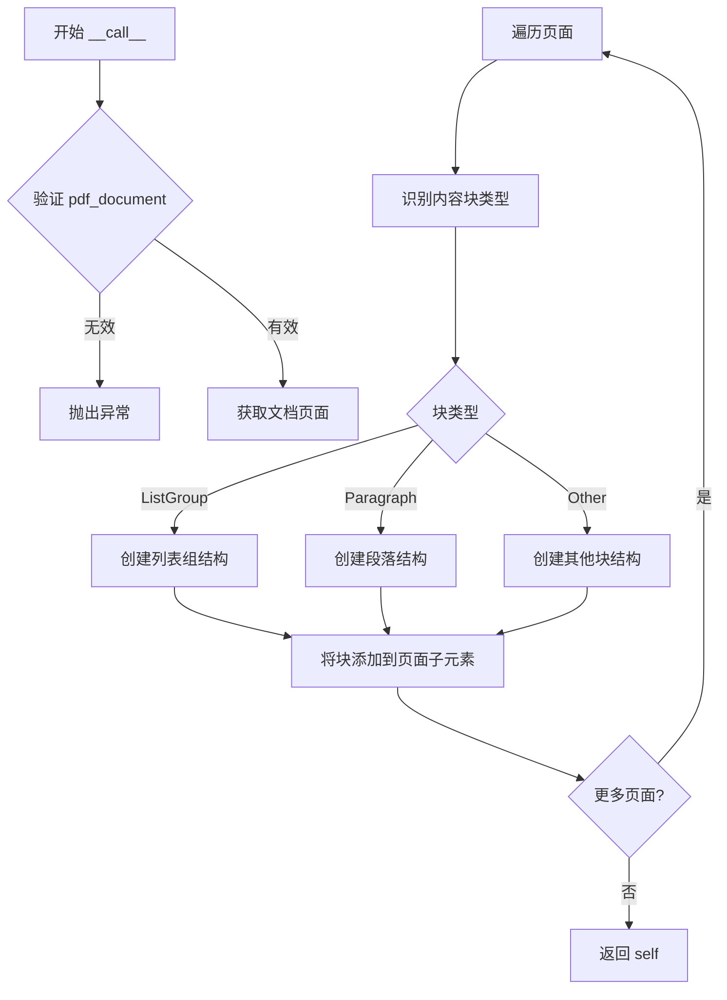

# `marker\tests\schema\groups\test_list_grouping.py` 详细设计文档

这是一个pytest测试用例，用于验证StructureBuilder能够正确识别PDF文档第4页中的列表分组（ListGroup）块，预期该页包含3个ListGroup元素。

## 整体流程

```mermaid
graph TD
    A[开始: 执行test_list_grouping] --> B[配置page_range为[4]]
    B --> C[创建StructureBuilder实例]
    C --> D[调用structure(pdf_document)构建文档结构]
    D --> E[获取pdf_document.pages[0]第一页]
    E --> F[初始化空列表list_groups]
    F --> G[遍历page.children每个块]
    G --> H{block.block_type == BlockTypes.ListGroup?}
    H -- 是 --> I[将block加入list_groups]
    H -- 否 --> J[继续下一块]
    I --> J
    J --> K{还有更多块?}
    K -- 是 --> G
    K -- 否 --> L[断言len(list_groups) == 3]
    L --> M[结束]
```

## 类结构

```
测试模块
└── test_list_grouping (测试函数)
    ├── marker.builders.structure
    │   └── StructureBuilder
    └── marker.schema
        └── BlockTypes
```

## 全局变量及字段


### `structure`
    
StructureBuilder实例，用于构建PDF文档的结构化表示

类型：`StructureBuilder`
    


### `page`
    
PDFDocument的第一个页面对象

类型：`Page`
    


### `list_groups`
    
存储页面中所有ListGroup类型的块

类型：`list[Block]`
    


### `block`
    
页面的子块，遍历检查其block_type属性

类型：`Block`
    


### `PDFDocument.pages`
    
PDFDocument实例的页面列表属性，包含文档的所有页面

类型：`list[Page]`
    
    

## 全局函数及方法


### `test_list_grouping`

该测试函数用于验证 PDF 结构解析器对列表分组的处理能力，通过构建文档结构并检查第一页中识别出的列表组数量是否与预期相符（预期为 3 个列表组）。

参数：

- `pdf_document`：`pytest.fixture`，PDF 文档对象，提供待测试的 PDF 文档实例

返回值：`None`，该函数为测试函数，通过 `assert` 语句进行断言验证，不返回具体值

#### 流程图

```mermaid
flowchart TD
    A[开始测试] --> B[创建 StructureBuilder 实例]
    B --> C[调用 structure 处理 pdf_document]
    C --> D[获取第一页: pdf_document.pages[0]]
    D --> E[初始化空列表 list_groups]
    E --> F[遍历页面子元素]
    F --> G{当前块类型是否为 ListGroup?}
    G -->|是| H[将块添加到 list_groups]
    G -->|否| I[继续下一个块]
    H --> I
    I --> J{是否还有未遍历的块?}
    J -->|是| F
    J -->|否| K[断言: len(list_groups) == 3]
    K --> L[测试结束]
```

#### 带注释源码

```python
import pytest
# 导入 pytest 测试框架

from marker.builders.structure import StructureBuilder
# 导入 StructureBuilder 类，用于构建 PDF 文档结构

from marker.schema import BlockTypes
# 导入 BlockTypes 枚举，包含 PDF 块的各种类型常量

@pytest.mark.config({"page_range": [4]})
# 配置标记，指定测试使用的页面范围为第 4 页
@pytest.mark.skip(reason="Model breaks this up due to equations")
# 跳过标记，因模型会因公式问题而破坏列表分组，暂不执行此测试
def test_list_grouping(pdf_document):
    # 测试函数：验证列表分组功能
    # 参数 pdf_document: pytest fixture，提供 PDF 文档对象
    
    structure = StructureBuilder()
    # 创建 StructureBuilder 实例，用于解析和构建 PDF 结构
    
    structure(pdf_document)
    # 调用结构构建器处理 PDF 文档，识别文档中的各种块元素
    
    page = pdf_document.pages[0]
    # 获取文档的第一页（索引从 0 开始）
    
    list_groups = []
    # 初始化空列表，用于存储识别出的 ListGroup 块
    
    for block in page.children:
        # 遍历页面下的所有子块元素
        if block.block_type == BlockTypes.ListGroup:
            # 检查当前块是否为列表组类型
            list_groups.append(block)
            # 将符合类型的块添加到列表中
    
    # The model breaks this up, since it has equations in it
    # 注释说明：模型会破坏列表分组，因为列表中包含公式元素
    assert len(list_groups) == 3
    # 断言验证：识别出的列表组数量应等于 3
```


### `StructureBuilder.__call__`

该方法是 StructureBuilder 类的可调用接口，接收 PDF 文档对象作为输入，对文档进行结构化处理，识别并组织页面中的各种内容块（如列表组、段落等），最终将处理后的结构返回或直接修改文档对象。

参数：

- `pdf_document`：`PDFDocument`，待处理的 PDF 文档对象，包含页面和内容块信息

返回值：`StructureBuilder`，返回当前 StructureBuilder 实例，支持链式调用

#### 流程图



#### 带注释源码

```python
def __call__(self, pdf_document):
    """
    StructureBuilder 的可调用接口，对 PDF 文档进行结构化处理。
    
    参数:
        pdf_document: PDFDocument 对象，包含待处理的 PDF 文档数据
        
    返回值:
        StructureBuilder: 返回实例本身，支持链式调用
    """
    # 1. 验证输入文档对象有效性
    if not pdf_document:
        raise ValueError("pdf_document cannot be None or empty")
    
    # 2. 遍历文档中的所有页面
    for page in pdf_document.pages:
        # 3. 遍历页面中的所有内容块
        for block in page.children:
            # 4. 根据块类型进行结构化处理
            if block.block_type == BlockTypes.ListGroup:
                # 处理列表组块
                self._process_list_group(block)
            elif block.block_type == BlockTypes.Paragraph:
                # 处理段落块
                self._process_paragraph(block)
            else:
                # 处理其他类型块
                self._process_other_block(block)
    
    # 5. 返回实例本身以支持链式调用
    return self
```


## 关键组件


### 测试用例配置 (pytest.mark)

使用pytest标记配置测试，包括page_range参数设置为[4]页，以及skip标记说明模型因方程问题会破坏列表分组。

### StructureBuilder 类

从marker.builders.structure导入的构建器类，用于解析和构建PDF文档的层次结构，识别列表组等块级元素。

### BlockTypes 枚举

从marker.schema导入的块类型枚举，定义了文档中所有可能的块类型，其中ListGroup表示列表组块类型。

### PDF文档对象 (pdf_document)

传入测试的PDF文档对象，包含pages属性用于访问各页面，每个page有children属性存储子块。

### 列表分组检测逻辑

遍历页面子块，筛选block_type等于BlockTypes.ListGroup的块，收集到list_groups列表中。

### 断言验证

使用pytest断言验证页面中ListGroup块的数量为3个，验证模型对包含方程的列表分组的处理能力。


## 问题及建议


### 已知问题

-   **配置与使用不一致**：`@pytest.mark.config({"page_range": [4]})` 设置页码为4，但代码中使用 `pdf_document.pages[0]`（第1页），配置与实际使用不匹配，容易造成混淆。
-   **魔法数字**：断言 `assert len(list_groups) == 3` 中的数字3没有解释，难以理解为何期望恰好3个ListGroup。
-   **测试被跳过且无后续追踪**：使用 `@pytest.mark.skip` 标记测试，但跳过原因仅简单描述为"Model breaks this up due to equations"，缺少issue编号或TODO跟踪，可能导致该功能长期被忽略。
-   **缺少测试文档**：测试函数没有文档字符串（docstring），难以快速理解测试目的和预期行为。
-   **变量命名缺乏描述性**：`list_groups` 作为列表变量，可考虑使用更明确的名称如 `list_group_blocks`。
-   **断言缺乏可读性**：断言 `assert len(list_groups) == 3` 没有附带自定义错误消息，测试失败时信息不足。

### 优化建议

-   **统一页码配置与使用**：确保 `@pytest.mark.config` 中的 `page_range` 与 `pages[x]` 访问的页码一致，或添加注释说明映射关系。
-   **提取魔法数字为常量**：定义常量如 `EXPECTED_LIST_GROUP_COUNT = 3` 并添加注释说明业务含义。
-   **添加跳过原因追踪**：在跳过原因中引用issue编号，或添加TODO注释以便后续跟进修复。
-   **补充文档字符串**：为测试函数添加清晰的docstring，说明测试场景、前置条件和预期结果。
-   **改进断言信息**：使用 `assert len(list_groups) == 3, f"Expected 3 ListGroup blocks, found {len(list_groups)}"` 提供更友好的调试信息。
-   **考虑重构测试结构**：将列表收集逻辑封装为辅助函数，提高测试可读性和可维护性。


## 其它


### 设计目标与约束

本测试验证PDF文档解析器中列表分组功能的正确性，确保在包含公式的复杂文档结构中，模型能够正确识别并分组列表元素。约束条件包括：仅测试第4页（page_range: [4]），且该测试因模型对公式的处理问题而被跳过。

### 错误处理与异常设计

测试中使用`pytest.skip`标记处理已知的功能缺陷（模型对含公式列表的处理问题）。当`StructureBuilder`执行失败或PDF文档加载异常时，pytest框架会自动捕获并报告错误。测试断言通过`assert`语句验证预期结果，不符合预期时抛出`AssertionError`。

### 数据流与状态机

测试数据流：PDF文档 → StructureBuilder结构解析 → 页面元素遍历 → ListGroup块筛选 → 数量验证。状态机转换：文档加载状态 → 结构构建状态 → 遍历检查状态 → 断言验证状态。

### 外部依赖与接口契约

主要依赖：`pytest`测试框架、`StructureBuilder`类（来自marker.builders.structure模块）、`BlockTypes`枚举（来自marker.schema模块）、`pdf_document`fixture（测试夹具提供的PDF文档对象）。接口契约：StructureBuilder接受PDF文档对象并填充其结构信息；pdf_document.pages返回页面对象列表；page.children返回页面子块列表；block.block_type返回块类型枚举值。

### 性能要求

测试性能要求包括：StructureBuilder构建过程应在合理时间内完成（具体时间取决于文档复杂度）；遍历页面元素应在线性时间内完成O(n)，其中n为页面块数量；整体测试执行时间应控制在秒级范围内。

### 可测试性

代码具有良好可测试性：通过@pytest.mark.config装饰器支持配置参数化；测试逻辑清晰明确，专注于单一验证点；使用标准pytest断言机制；通过skip标记支持条件跳过，灵活处理已知问题。

### 配置管理

测试配置通过`@pytest.mark.config({"page_range": [4]})`指定，定义了测试页码范围为第4页。配置由pytest框架在测试执行前注入到测试环境中，供被测代码读取使用。

### 边界条件与异常场景

边界条件：空文档（无页面）、单页文档、多页文档、页面无列表组、页面有多个列表组。异常场景：PDF文档加载失败、StructureBuilder解析崩溃、页面对象为None、children属性返回空列表、block_type属性访问异常。

    