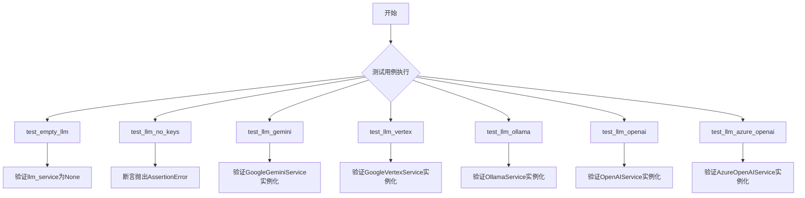
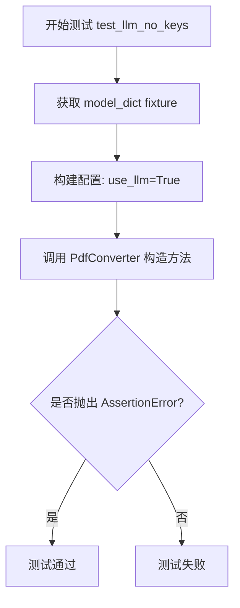
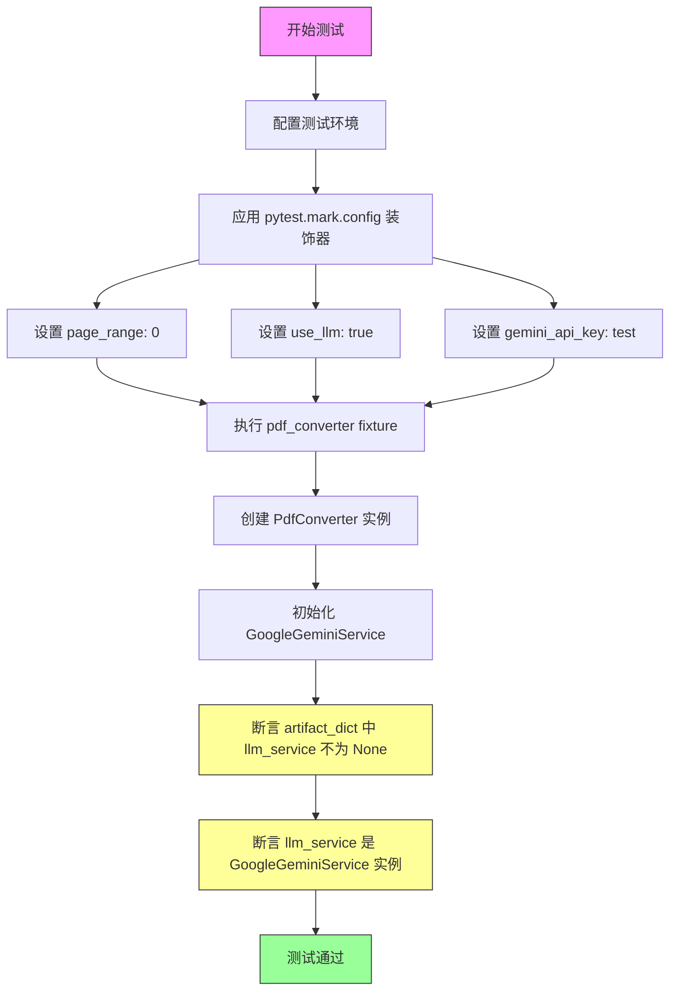
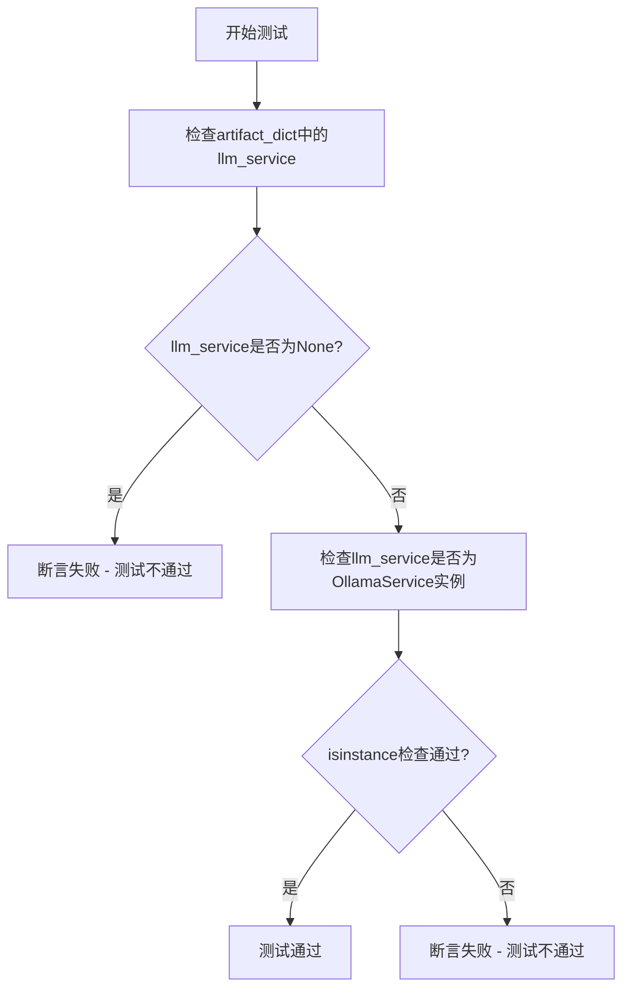
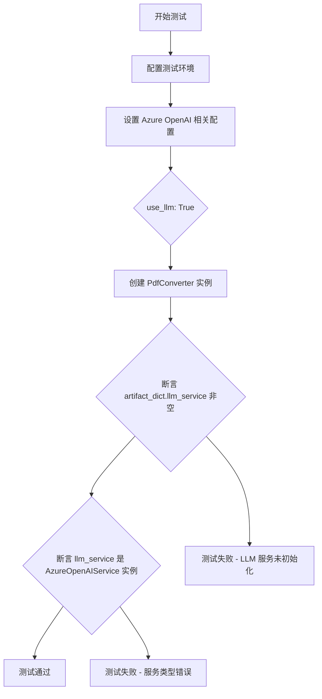

# `marker\tests\services\test_service_init.py` 详细设计文档

这是一个pytest测试文件，用于验证marker库中的PdfConverter与多种LLM服务（GoogleGemini、Ollama、GoogleVertex、OpenAI、AzureOpenAI）的集成功能，测试不同配置下LLM服务的正确初始化和注入。

## 整体流程



## 类结构

```
测试模块 (test_converter_services.py)
├── test_empty_llm (测试无LLM服务)
├── test_llm_no_keys (测试缺少API密钥)
├── test_llm_gemini (测试Google Gemini服务)
├── test_llm_vertex (测试Google Vertex服务)
├── test_llm_ollama (测试Ollama服务)
├── test_llm_openai (测试OpenAI服务)
└── test_llm_azure_openai (测试Azure OpenAI服务)
```

## 全局变量及字段


### `pdf_converter`
    
PdfConverter的pytest fixture实例，用于测试PDF到markdown的转换功能，包含artifact_dict和llm_service属性

类型：`PdfConverter`
    


### `temp_doc`
    
pytest fixture临时文档对象，用于提供测试用的PDF文档路径或内容

类型：`TemporaryDocument`
    


### `model_dict`
    
pytest fixture模型字典，包含预训练模型配置和artifact_dict的字典，用于初始化PdfConverter

类型：`Dict[str, Any]`
    


### `config`
    
pytest fixture配置字典，包含PDF转换和LLM服务的配置参数，如page_range、use_llm等

类型：`Dict[str, Any]`
    


    

## 全局函数及方法


### `test_empty_llm`

该测试函数用于验证在未配置任何LLM服务的情况下，PdfConverter 的 `llm_service` 属性和 `artifact_dict` 中的 `"llm_service"` 键均为 `None`，确保系统在不使用LLM时能够正确初始化。

参数：

- `pdf_converter`：`PdfConverter`，Pytest fixture 提供的 PDF 转换器实例，用于验证其内部状态
- `temp_doc`：任意类型，Pytest fixture 提供的临时文档对象，用于满足测试函数的参数要求

返回值：`None`，该函数为测试函数，使用断言进行验证，不返回任何值

#### 流程图

```mermaid
flowchart TD
    A[开始测试] --> B[接收 pdf_converter 和 temp_doc 参数]
    B --> C{断言 pdf_converter.artifact_dict['llm_service'] is None}
    C -->|通过| D{断言 pdf_converter.llm_service is None}
    C -->|失败| E[测试失败 - 抛出 AssertionError]
    D -->|通过| F[测试通过]
    D -->|失败| E
    F --> G[结束测试]
```

#### 带注释源码

```python
@pytest.mark.output_format("markdown")  # 标记测试输出格式为 markdown
@pytest.mark.config({"page_range": [0]})  # 配置测试使用第 0 页
def test_empty_llm(pdf_converter: PdfConverter, temp_doc):
    """
    测试当未配置 LLM 服务时，PdfConverter 的 llm_service 属性为 None
    
    参数:
        pdf_converter: PdfConverter 实例，通过 pytest fixture 注入
        temp_doc: 临时文档对象，通过 pytest fixture 注入
    """
    # 验证 artifact_dict 中的 llm_service 键为 None
    # 这是因为配置中未设置 use_llm=True 或任何 LLM 服务
    assert pdf_converter.artifact_dict["llm_service"] is None
    
    # 验证 PdfConverter 的 llm_service 属性为 None
    # 确保在未配置 LLM 时，该属性被正确初始化为 None
    assert pdf_converter.llm_service is None
```


### `test_llm_no_keys`

该测试函数用于验证当配置启用 LLM 服务但未提供必要的 API 密钥时，`PdfConverter` 会正确抛出 `AssertionError` 异常，确保系统在缺少认证凭证时能够安全地进行错误处理而不是继续执行。

参数：

- `model_dict`：`Dict`，由 pytest fixture 提供的模型字典，用于初始化 PdfConverter 的 artifact_dict 参数
- `config`：`Dict`，由 pytest fixture 提供的配置字典

返回值：`None`，该测试函数没有显式返回值，通过 `pytest.raises` 验证异常抛出行为

#### 流程图



#### 带注释源码

```python
def test_llm_no_keys(model_dict, config):
    """
    测试当 use_llm=True 但未提供 API 密钥时的异常处理行为。
    
    参数:
        model_dict: 包含模型配置的字典 fixture
        config: 包含测试配置的字典 fixture
    
    预期行为:
        PdfConverter 在缺少必要 API 密钥的情况下应该抛出 AssertionError
    """
    # 使用 pytest.raises 验证代码块会抛出 AssertionError
    with pytest.raises(AssertionError):
        # 尝试创建 PdfConverter，配置启用 LLM 但不提供任何 API 密钥
        # 这应该触发断言错误，因为缺少认证凭证
        PdfConverter(artifact_dict=model_dict, config={"use_llm": True})
```


### `test_llm_gemini`

测试当配置了 `gemini_api_key` 时，PdfConverter 能正确初始化 GoogleGeminiService 作为 LLM 服务。

参数：

- `pdf_converter`：`PdfConverter`，pytest fixture 提供的 PDF 转换器实例，用于验证 LLM 服务的初始化
- `temp_doc`：测试用的临时 PDF 文档 fixture

返回值：`None`，该函数为测试函数，无返回值，通过断言验证行为

#### 流程图



#### 带注释源码

```python
@pytest.mark.output_format("markdown")  # 指定输出格式为 markdown
@pytest.mark.config({
    "page_range": [0],       # 只处理第一页
    "use_llm": True,         # 启用 LLM 服务
    "gemini_api_key": "test" # 配置测试用的 Gemini API 密钥
})
def test_llm_gemini(pdf_converter: PdfConverter, temp_doc):
    """
    测试函数：验证 PdfConverter 能正确初始化 GoogleGeminiService
    
    测试场景：
    - 当配置 use_llm=True 时
    - 且提供了 gemini_api_key 时
    - PdfConverter 应自动创建 GoogleGeminiService 实例
    """
    # 验证 artifact_dict 中存储了 LLM 服务实例
    assert pdf_converter.artifact_dict["llm_service"] is not None
    
    # 验证 llm_service 属性是 GoogleGeminiService 的实例
    assert isinstance(pdf_converter.llm_service, GoogleGeminiService)
```


### `test_llm_vertex`

该测试函数用于验证当配置使用 Google Vertex Service 作为 LLM 服务时，`PdfConverter` 能够正确初始化 `GoogleVertexService` 实例，并将其存储在 `artifact_dict` 和 `llm_service` 属性中。

参数：

- `pdf_converter`：`PdfConverter`，pytest fixture，提供已配置的 PdfConverter 实例
- `temp_doc`：临时文档 fixture，提供测试用的 PDF 文档路径

返回值：`None`，pytest 测试函数无显式返回值，通过断言验证行为

#### 流程图

```mermaid
flowchart TD
    A[开始测试] --> B[装饰器配置<br/>output_format: markdown<br/>page_range: [0]<br/>use_llm: True<br/>vertex_project_id: test<br/>llm_service: GoogleVertexService]
    B --> C[执行断言1<br/>pdf_converter.artifact_dict['llm_service'] is not None]
    C --> D{断言1通过?}
    D -->|是| E[执行断言2<br/>isinstance(pdf_converter.llm_service, GoogleVertexService)]
    D -->|否| F[测试失败]
    E --> G{断言2通过?}
    G -->|是| H[测试通过]
    G -->|否| F
    H --> I[结束测试]
```

#### 带注释源码

```python
# 使用 pytest 标记定义输出格式为 markdown
@pytest.mark.output_format("markdown")
# 使用 pytest 标记定义配置参数：页面范围、启用 LLM、Vertex 项目 ID、LLM 服务类
@pytest.mark.config(
    {
        "page_range": [0],                                  # 仅处理第 0 页
        "use_llm": True,                                    # 启用 LLM 服务
        "vertex_project_id": "test",                        # Google Vertex 项目 ID
        "llm_service": "marker.services.vertex.GoogleVertexService",  # 指定使用 Vertex 服务
    }
)
def test_llm_vertex(pdf_converter: PdfConverter, temp_doc):
    """
    测试 Google Vertex Service 作为 LLM 服务时的初始化行为。
    
    参数:
        pdf_converter: PdfConverter 实例，由 pytest fixture 提供
        temp_doc: 临时文档路径，由 pytest fixture 提供
    """
    
    # 断言 1: 验证 artifact_dict 中已正确设置 llm_service
    # 这确认了 PdfConverter 在初始化时将 LLM 服务存储到了 artifact_dict
    assert pdf_converter.artifact_dict["llm_service"] is not None
    
    # 断言 2: 验证 llm_service 属性是 GoogleVertexService 的实例
    # 这确认了配置的 llm_service 类名被正确实例化
    assert isinstance(pdf_converter.llm_service, GoogleVertexService)
```


### `test_llm_ollama`

该测试函数用于验证在使用Ollama作为LLM服务时，`PdfConverter`能够正确初始化并设置`OllamaService`实例。

参数：

- `pdf_converter`：`PdfConverter`，pytest fixture，提供已配置的PDF转换器实例
- `temp_doc`：临时文档fixture，提供测试用的PDF文档路径

返回值：`None`，无返回值（pytest测试函数）

#### 流程图



#### 带注释源码

```python
@pytest.mark.output_format("markdown")
@pytest.mark.config(
    {
        "page_range": [0],           # 只处理第一页
        "use_llm": True,             # 启用LLM服务
        "llm_service": "marker.services.ollama.OllamaService",  # 指定使用Ollama服务
    }
)
def test_llm_ollama(pdf_converter: PdfConverter, temp_doc):
    """
    测试Ollama LLM服务是否正确集成到PdfConverter
    
    测试目标：
    1. 验证PdfConverter的artifact_dict中正确设置了llm_service
    2. 验证pdf_converter.llm_service是OllamaService的实例
    """
    
    # 断言1：检查artifact_dict中llm_service不为None
    assert pdf_converter.artifact_dict["llm_service"] is not None
    
    # 断言2：验证llm_service是OllamaService类型
    assert isinstance(pdf_converter.llm_service, OllamaService)
```


### `test_llm_openai`

该测试函数用于验证当配置文件指定使用 OpenAI 作为 LLM 服务时，PdfConverter 是否能够正确初始化 OpenAIService 实例，并确保 LLM 服务在 artifact_dict 和 llm_service 属性中正确设置。

参数：

- `pdf_converter`：`PdfConverter`，pytest fixture，提供配置好的 PDF 转换器实例，用于验证 LLM 服务的初始化状态
- `temp_doc`：未在代码中显式指定类型（应为 pytest fixture），提供测试用的临时 PDF 文档

返回值：`None`，测试函数无返回值，通过断言验证服务初始化状态

#### 流程图

```mermaid
flowchart TD
    A[开始测试 test_llm_openai] --> B[配置 pytest 标记: output_format=markdown]
    B --> C[配置 pytest 标记: page_range=0, use_llm=True, llm_service=OpenAIService, openai_api_key=test]
    C --> D[执行测试函数: 传入 pdf_converter 和 temp_doc]
    D --> E{断言 pdf_converter.artifact_dict['llm_service'] is not None}
    E -->|通过| F{断言 isinstance(pdf_converter.llm_service, OpenAIService)}
    F -->|通过| G[测试通过]
    E -->|失败| H[测试失败 - LLM service 未正确初始化]
    F -->|失败| I[测试失败 - LLM service 类型不匹配]
```

#### 带注释源码

```python
# 使用 pytest 标记指定输出格式为 markdown
@pytest.mark.output_format("markdown")
# 配置测试参数：页面范围、使用 LLM、选择 OpenAI 服务、设置 API 密钥
@pytest.mark.config(
    {
        "page_range": [0],                                    # 只处理第一页
        "use_llm": True,                                      # 启用 LLM 服务
        "llm_service": "marker.services.openai.OpenAIService",  # 指定使用 OpenAI 服务
        "openai_api_key": "test",                             # 设置测试用 API 密钥
    }
)
def test_llm_openai(pdf_converter: PdfConverter, temp_doc):
    """
    测试 OpenAI LLM 服务是否正确初始化
    
    验证点：
    1. artifact_dict 中已正确设置 llm_service
    2. pdf_converter.llm_service 是 OpenAIService 的实例
    """
    
    # 断言 1：验证 artifact_dict 中 LLM 服务已初始化（非 None）
    assert pdf_converter.artifact_dict["llm_service"] is not None
    
    # 断言 2：验证 llm_service 属性是 OpenAIService 的实例
    assert isinstance(pdf_converter.llm_service, OpenAIService)
```


### `test_llm_azure_openai`

该测试函数用于验证当配置使用 Azure OpenAI 作为 LLM 服务时，PdfConverter 是否能正确初始化并使用 AzureOpenAIService。

参数：

-  `pdf_converter`：`PdfConverter`，pytest fixture，提供配置好的 PdfConverter 实例
-  `temp_doc`：临时文档 fixture，提供测试用的 PDF 文档

返回值：无（通过断言验证服务类型）

#### 流程图



#### 带注释源码

```python
@pytest.mark.output_format("markdown")
@pytest.mark.config(
    {
        "page_range": [0],                    # 只处理第0页
        "use_llm": True,                       # 启用LLM服务
        "llm_service": "marker.services.azure_openai.AzureOpenAIService",  # 指定使用Azure OpenAI服务
        "azure_endpoint": "https://example.openai.azure.com",  # Azure端点URL
        "azure_api_key": "test",               # Azure API密钥（测试用）
        "deployment_name": "test-model",       # 部署模型名称
        "azure_api_version": "1",              # Azure API版本
    }
)
def test_llm_azure_openai(pdf_converter: PdfConverter, temp_doc):
    """
    测试 Azure OpenAI LLM 服务的集成
    
    验证点：
    1. pdf_converter.artifact_dict["llm_service"] 被正确初始化（非None）
    2. pdf_converter.llm_service 是 AzureOpenAIService 的实例
    """
    # 验证 LLM 服务已在 artifact_dict 中初始化
    assert pdf_converter.artifact_dict["llm_service"] is not None
    
    # 验证实际使用的 LLM 服务是 AzureOpenAIService 类型
    assert isinstance(pdf_converter.llm_service, AzureOpenAIService)
```

## 关键组件


### PdfConverter

主转换器类，负责PDF转Markdown/HTML，支持配置LLM服务进行内容增强

### LLM服务接口层

提供多种大语言模型服务的统一接口，包括Google Gemini、Google Vertex、Ollama、OpenAI和Azure OpenAI

### 测试配置体系

基于pytest的参数化配置机制，通过markers和config字典控制测试行为

### artifact_dict

存储转换器内部状态的字典结构，用于在服务初始化前传递配置和模型工件

### llm_service

PdfConverter的属性，动态绑定具体的LLM服务实例

### 服务工厂模式

通过字符串配置动态加载LLM服务类，实现服务类型与具体实现的解耦


## 问题及建议


### 已知问题

- **硬编码敏感信息**：测试中使用硬编码的API Key（如"test"），虽然用于测试环境，但缺乏安全意识，可能被开发者误用于生产环境
- **直接访问私有属性**：测试直接访问`artifact_dict["llm_service"]`私有属性，暴露了内部实现细节，降低了代码的可维护性
- **配置参数不一致**：不同LLM服务的配置参数命名不统一（如`gemini_api_key`vs`openai_api_key`），增加了理解和维护成本
- **缺少错误处理测试**：未测试LLM服务初始化失败、网络异常、API Key无效等异常场景
- **测试覆盖不全面**：未覆盖边界情况，如无效的LLM服务名称、配置缺失必需参数、并发使用场景等
- **重复代码模式**：各测试函数的配置字典存在大量重复，可通过pytest参数化或fixture重构

### 优化建议

- **移除硬编码敏感信息**：使用环境变量或pytest fixture管理测试凭证，避免代码中直接出现
- **重构属性访问**：通过公共方法（如`get_llm_service()`）访问LLM服务，减少对内部实现的依赖
- **统一配置结构**：设计标准化的配置schema，确保不同LLM服务使用一致的参数命名规范
- **补充异常测试**：添加初始化失败、无效配置、网络错误等场景的测试用例
- **使用参数化测试**：通过`@pytest.mark.parametrize`重构重复的测试配置，提高代码简洁性和可维护性
- **添加集成测试**：验证不同LLM服务在实际PDF转换场景中的功能和性能

## 其它


### 设计目标与约束

本测试文件旨在验证marker库中PdfConverter类与多种LLM服务（Google Gemini、Google Vertex、Ollama、OpenAI、Azure OpenAI）的集成能力。测试覆盖了以下约束条件：1) 必须支持通过配置动态选择LLM服务实现；2) 必须支持在不使用LLM的情况下运行（llm_service为None）；3) 必须验证API密钥和服务端点的正确配置；4) 必须确保不同LLM服务的实例化逻辑正确。

### 错误处理与异常设计

测试文件中包含一个异常测试用例test_llm_no_keys，用于验证当use_llm设置为True但未提供有效模型配置时的错误处理。该测试期望抛出AssertionError，表明系统需要在前置条件不满足时立即失败并提供明确的错误信息。其他测试用例通过断言验证llm_service的正确实例化，确保不会出现空指针或类型错误。

### 数据流与状态机

测试数据流如下：1) pytest fixture提供temp_doc（测试用PDF文档）和pdf_converter（已配置的PdfConverter实例）；2) 测试通过marker库提供的配置机制（如gemini_api_key、vertex_project_id、llm_service等）将LLM服务参数注入到PdfConverter；3) PdfConverter内部根据配置实例化相应的LLM服务类；4) 测试验证artifact_dict和llm_service属性是否正确反映了所选择的LLM服务。状态转换包括：无LLM服务 → 配置LLM服务 → 实例化LLM服务。

### 外部依赖与接口契约

本测试文件依赖以下外部组件：1) marker库（marker.converters.pdf.PdfConverter及各类LLM服务类）；2) pytest框架及其fixture机制；3) 各种LLM服务提供商的API（Google Gemini、Google Vertex、Ollama、OpenAI、Azure OpenAI）。接口契约方面：PdfConverter接受artifact_dict和config参数；config字典支持page_range（列表）、use_llm（布尔）、llm_service（字符串形式的类路径）、各类API密钥和端点配置；LLM服务类需实现marker服务接口规范。

### 测试覆盖范围

本测试文件覆盖了以下测试场景：1) 空LLM服务配置验证（test_empty_llm）；2) 缺少必需密钥时的异常处理（test_llm_no_keys）；3) Google Gemini服务集成（test_llm_gemini）；4) Google Vertex服务集成（test_llm_vertex）；5) Ollama本地服务集成（test_llm_ollama）；6) OpenAI服务集成（test_llm_openai）；7) Azure OpenAI服务集成（test_llm_azure_openai）。

### 配置参数映射

各LLM服务对应的配置参数映射关系如下：GoogleGeminiService需要gemini_api_key；GoogleVertexService需要vertex_project_id；OllamaService无需API密钥（本地部署）；OpenAIService需要openai_api_key；AzureOpenAIService需要azure_endpoint、azure_api_key、deployment_name、azure_api_version。

### 测试夹具依赖

测试依赖于pytest fixture：pdf_converter（提供配置好的PdfConverter实例）、temp_doc（提供测试用PDF文档路径）、model_dict（提供模型配置字典）、config（提供配置字典）。这些fixture在conftest.py中定义，负责准备测试环境和参数。

### 安全性考量

测试中使用了模拟的API密钥（如"test"字符串），不应使用真实的生产环境密钥。测试验证了API密钥配置的传递路径，确保密钥不会以明文形式记录在日志中。Azure端点配置验证了正确格式的HTTPS端点URL。

### 性能与资源考虑

测试使用page_range=[0]限制处理页面数量，以加快测试执行速度。LLM服务在测试环境中应为模拟或轻量级实现，避免调用真实API产生额外开销和延迟。

### 可维护性与扩展性

测试采用参数化配置方式，便于添加新的LLM服务支持。类路径字符串（llm_service）机制允许在不修改核心代码的情况下扩展支持的LLM服务类型。测试结构清晰，每个测试函数对应一种LLM服务场景，便于后续维护和调试。


    