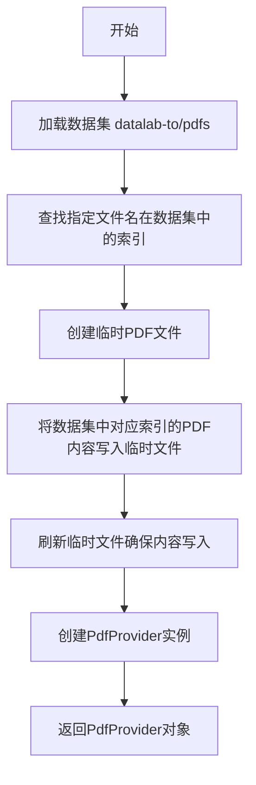
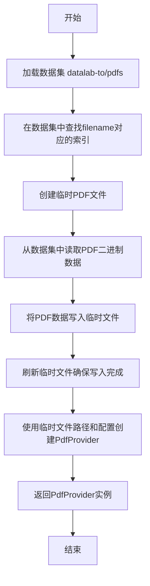

# `marker\tests\utils.py` 详细设计文档

该代码实现了一个PDF提供者设置函数，通过从Hugging Face datasets加载PDF数据集，将指定的PDF文件提取到临时文件中，并返回一个PdfProvider对象用于后续的PDF处理。

## 整体流程



## 类结构

```
模块级函数
└── setup_pdf_provider
```

## 全局变量及字段


### `dataset`
    
从Hugging Face加载的PDF数据集，包含训练集split

类型：`datasets.Dataset`
    


### `idx`
    
目标PDF文件名在数据集中的索引位置

类型：`int`
    


### `temp_pdf`
    
用于临时存储PDF文件的文件对象

类型：`tempfile.NamedTemporaryFile`
    


### `provider`
    
PDF文档提供者实例，用于处理PDF内容

类型：`PdfProvider`
    


    

## 全局函数及方法


### `setup_pdf_provider`

该函数从Hugging Face的"datalab-to/pdfs"数据集中加载指定的PDF文件，将其写入系统临时文件，并返回一个配置好的`PdfProvider`实例用于处理该PDF文档。

参数：

- `filename`：`str`，可选，默认值为`'adversarial.pdf'`，指定要加载的PDF文件名
- `config`：`any`，可选，默认值为`None`，传递给PdfProvider的配置对象

返回值：`PdfProvider`，返回已初始化并配置好的PDF提供者实例

#### 流程图



#### 带注释源码

```python
from marker.providers.pdf import PdfProvider  # 导入PDF提供者类
import tempfile  # 导入临时文件模块

import datasets  # 导入数据集加载模块


def setup_pdf_provider(
    filename='adversarial.pdf',  # 要加载的PDF文件名，默认 adversarial.pdf
    config=None,                 # 可选的配置对象，传递给 PdfProvider
) -> PdfProvider:
    """
    从HuggingFace数据集加载PDF并创建PdfProvider实例
    
    Args:
        filename: PDF文件在数据集中的名称
        config: 可选的配置参数
    
    Returns:
        初始化好的PdfProvider实例
    """
    # 从HuggingFace Hub加载PDF数据集，split="train"获取训练集
    dataset = datasets.load_dataset("datalab-to/pdfs", split="train")
    
    # 在数据集的filename列中查找指定文件的索引位置
    idx = dataset['filename'].index(filename)

    # 创建临时PDF文件，suffix=".pdf"确保文件扩展名为.pdf
    temp_pdf = tempfile.NamedTemporaryFile(suffix=".pdf")
    
    # 从数据集的pdf列中读取对应索引的二进制PDF数据并写入临时文件
    temp_pdf.write(dataset['pdf'][idx])
    
    # 刷新文件缓冲区，确保数据真正写入磁盘
    temp_pdf.flush()

    # 使用临时文件的完整路径和配置创建PdfProvider实例
    provider = PdfProvider(temp_pdf.name, config)
    
    # 返回配置好的PdfProvider供后续使用
    return provider
```

---

#### 潜在技术债务与优化空间

| 项目 | 说明 |
|------|------|
| 临时文件未清理 | `temp_pdf`使用后未显式关闭和删除，可能导致临时文件泄露，建议使用上下文管理器或手动删除 |
| 索引查找效率低 | `dataset['filename'].index(filename)`对大数据集为O(n)操作，可预先构建索引或使用过滤 |
| 硬编码数据集 | 数据集名称`datalab-to/pdfs`硬编码，缺少配置化支持 |
| 异常处理缺失 | 未处理文件不存在、下载失败等异常情况 |
| 无缓存机制 | 每次调用都重新下载数据集，网络开销大 |

## 关键组件


### 一段话描述

该代码是一个PDF文档处理初始化模块，通过从Hugging Face数据集仓库加载指定名称的PDF文件，将其写入临时文件系统，然后使用自定义配置创建PdfProvider实例来提供PDF解析服务。

### 文件整体运行流程

1. 加载Hugging Face的"datalab-to/pdfs"数据集
2. 在数据集的文件名列表中查找目标PDF的索引位置
3. 读取对应索引的PDF二进制数据
4. 创建临时PDF文件并将二进制数据写入
5. 刷新文件缓冲区确保数据落盘
6. 使用临时文件路径和配置初始化PdfProvider并返回

### 全局变量和全局函数

#### `setup_pdf_provider`

- **名称**: setup_pdf_provider
- **参数**: 
  - filename (str): 要加载的PDF文件名，默认为'adversarial.pdf'
  - config (dict): PdfProvider的配置参数，默认为None
- **返回类型**: PdfProvider
- **返回值描述**: 返回配置好的PDF文档提供者实例
- **描述**: 主入口函数，负责从数据集加载PDF并创建提供者

#### `filename`

- **名称**: filename
- **类型**: str
- **描述**: 目标PDF文件的名称，用于在数据集中检索

#### `config`

- **名称**: config
- **类型**: dict | None
- **描述**: 传递给PdfProvider的配置字典，可为None使用默认配置

### 关键组件信息

#### 1. Hugging Face数据集加载组件

从datalab-to/pdfs数据集仓库加载PDF集合，支持通过文件名进行检索

#### 2. 临时文件管理系统

使用tempfile.NamedTemporaryFile创建和管理临时PDF文件，确保文件正确清理

#### 3. PdfProvider工厂函数

将外部PDF文件路径和配置转换为可用的文档解析提供者实例

### 潜在的技术债务或优化空间

1. **临时文件未显式关闭**: temp_pdf未显式调用close()，依赖垃圾回收释放资源
2. **缺少错误处理**: 未处理数据集加载失败、文件未找到、索引越界等异常情况
3. **硬编码文件名**: 目标文件名作为默认参数缺乏灵活性
4. **资源泄漏风险**: 若PdfProvider创建失败，临时文件可能未被清理
5. **缺少异步支持**: 同步加载大文件可能导致阻塞

### 其它项目

#### 设计目标与约束

- 目标：封装PDF文档加载流程，提供统一的Provider接口
- 约束：依赖marker库和Hugging Face datasets库

#### 错误处理与异常设计

- 未实现try-except包裹，异常会直接向上抛出
- 未验证索引是否存在可能导致IndexError

#### 数据流与状态机

- 数据流：数据集 → 二进制数据 → 临时文件 → Provider实例
- 状态：初始化 → 加载 → 写入 → 创建Provider → 返回

#### 外部依赖与接口契约

- 依赖：marker.providers.pdf.PdfProvider、datasets库、tempfile模块
- 接口契约：filename参数指定PDF名称，config参数传递配置，返回PdfProvider实例


## 问题及建议


### 已知问题

-   **资源泄漏风险**：使用 `tempfile.NamedTemporaryFile` 创建临时文件后未显式关闭，也没有使用上下文管理器（with 语句），可能导致文件描述符泄漏
-   **性能问题**：使用 `dataset['filename'].index(filename)` 遍历整个数据集查找文件，时间复杂度为 O(n)，当数据集很大时效率低下
-   **错误处理缺失**：未处理数据集加载失败、文件不存在、索引越界等异常情况
-   **硬编码值**：数据集名称 "datalab-to/pdfs" 和默认文件名 'adversarial.pdf' 被硬编码，缺乏灵活性
-   **临时文件清理**：临时文件在程序结束时由操作系统清理，但如果程序长时间运行，会占用磁盘空间
-   **没有验证机制**：未验证 `PdfProvider` 初始化是否成功

### 优化建议

-   使用上下文管理器管理临时文件，例如使用 `tempfile.NamedTemporaryFile(delete=False)` 并在使用完后手动删除，或使用 `tempfile.TemporaryDirectory`
-   考虑使用 Pandas 或 NumPy 的向量化操作来加速查找，或在数据集加载时使用过滤条件
-   添加 try-except 块处理可能的异常，如 `FileNotFoundError`、`KeyError` 等
-   将硬编码的值提取为函数参数或配置对象，提高代码的可配置性
-   添加适当的类型提示和文档字符串，提高代码可读性和可维护性
-   考虑添加验证逻辑，确保 `PdfProvider` 成功初始化


## 其它


### 设计目标与约束

本函数的主要设计目标是从Hugging Face数据集"datalab-to/pdfs"中加载指定的PDF文件，并将其转换为PdfProvider对象供后续处理使用。设计约束包括：1) 依赖于Hugging Face的datasets库和marker库的PdfProvider；2) 使用临时文件机制存储PDF数据，需确保临时文件正确清理；3) 数据集必须包含'filename'和'pdf'两个字段。

### 错误处理与异常设计

可能出现的错误情况及处理方式：1) **数据集加载失败**：datasets.load_dataset可能抛出异常，需捕获并向上传递；2) **文件名不存在**：dataset['filename'].index(filename)会在文件名不存在时抛出ValueError，调用方需确保文件名存在于数据集中；3) **临时文件操作失败**：tempfile操作可能抛出IOError或OSError；4) **PdfProvider初始化失败**：PdfProvider构造函数可能抛出异常。函数本身未进行显式异常处理，依赖调用方进行异常捕获。

### 数据流与状态机

数据流过程：1) 加载Hugging Face数据集；2) 在数据集filename字段中查找目标文件名索引；3) 获取对应索引的PDF二进制数据；4) 创建临时PDF文件并写入数据；5) 调用flush确保数据写入磁盘；6) 创建PdfProvider实例并返回。状态机较为简单，主要经历"初始化→数据加载→临时文件创建→Provider创建→返回"的状态转换。

### 外部依赖与接口契约

外部依赖：1) **datasets库**：Hugging Face的datasets库，用于加载PDF数据集；2) **tempfile模块**：Python标准库，用于创建临时文件；3) **marker.providers.pdf.PdfProvider**：marker库提供的PDF处理Provider类。接口契约：输入filename参数默认为'adversarial.pdf'，config参数默认为None；输出返回PdfProvider实例；调用方需确保数据集可访问且文件名存在于数据集中。

### 性能考虑

潜在性能问题：1) 每次调用都会重新加载整个数据集，效率较低，建议缓存数据集或使用数据集的filter功能；2) 临时文件I/O操作可能影响性能，可考虑使用内存映射或直接传递BytesIO对象给PdfProvider（如果支持）；3) dataset['filename'].index(filename)是O(n)操作，可预先建立索引或使用filter过滤。

### 安全性考虑

安全风险：1) 临时文件使用NamedTemporaryFile，在并发场景下可能存在竞态条件风险；2) 临时文件未显式删除，需依赖系统自动清理或调用方手动管理；3) 从远程数据集加载PDF数据，需确保数据源可信。建议：1) 使用SecureTemporaryFile或显式管理临时文件生命周期；2) 添加数据来源验证；3) 考虑使用mkstemp获取更安全的文件描述符。

### 使用示例

```python
# 基础用法
provider = setup_pdf_provider()

# 指定文件名
provider = setup_pdf_provider(filename='example.pdf')

# 传入配置
config = {'page': 1, 'dpi': 300}
provider = setup_pdf_provider(filename='example.pdf', config=config)

# 使用返回的provider进行后续操作
# provider.convert() 或其他操作
```

### 配置说明

config参数直接传递给PdfProvider构造函数，具体配置项取决于PdfProvider的实现，常见配置可能包括：页面选择、渲染DPI、文本提取选项等。具体配置项需参考marker库的文档。

### 资源管理与生命周期

资源管理：1) temp_pdf文件描述符未显式关闭，存在资源泄漏风险，建议使用with语句或显式调用close()；2) 函数返回后临时文件依然存在，需依赖调用方在使用完毕后删除。建议改进：1) 返回provider的同时返回临时文件路径，由调用方负责清理；2) 使用context manager模式；3) 考虑在provider内部处理临时文件生命周期。


    