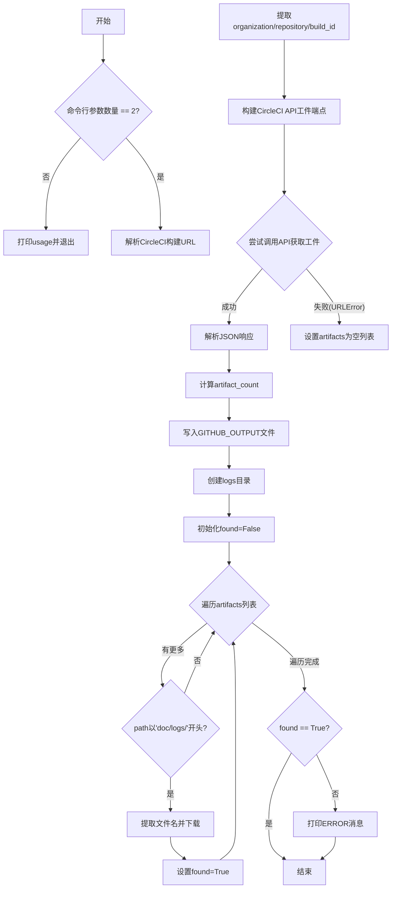
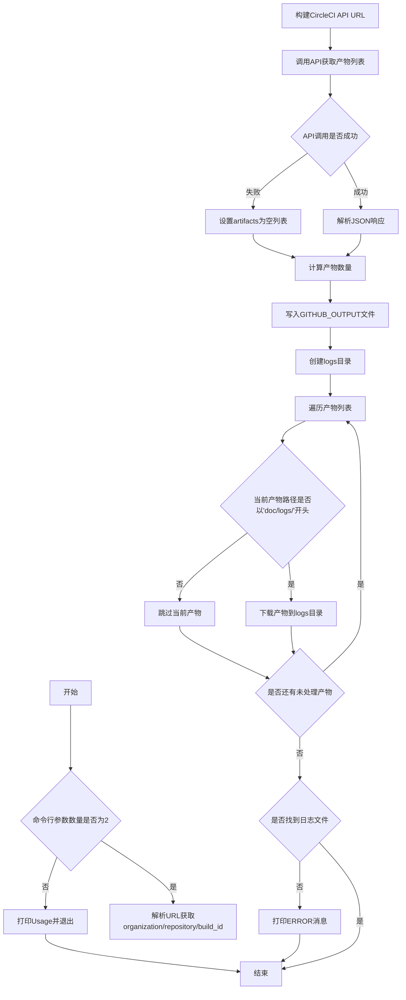

# `matplotlib\.circleci\fetch_doc_logs.py` 详细设计文档

该脚本从CircleCI下载文档构建的工件（主要是警告和弃用日志），将日志文件保存到本地logs目录，并将工件数量作为GitHub Actions工作流输出。

## 整体流程



## 类结构

```
该脚本为面向过程式设计，无类定义
```

## 全局变量及字段


### `target_url`
    
解析后的CircleCI构建URL

类型：`urllib.parse.ParseResult`
    


### `artifact_count`
    
工件数量

类型：`int`
    


### `logs`
    
日志目录Path对象

类型：`pathlib.Path`
    


### `found`
    
标记是否找到日志文件

类型：`bool`
    


### `path`
    
循环中当前工件路径

类型：`str`
    


### `artifact_url`
    
CircleCI API端点URL

类型：`str`
    


### `artifacts`
    
API返回的JSON响应

类型：`dict`
    


    

## 全局函数及方法


### `fetch_doc_results.py` (主脚本)

该脚本是CircleCI文档构建产物下载工具，通过解析命令行传入的CircleCI构建URL，调用CircleCI API获取构建产物列表，筛选并下载`docs/logs/`路径下的日志文件到本地`logs`目录，同时将产物数量写入GitHub Actions的输出文件中。

参数：

- `sys.argv[1]`：`str`，CircleCI构建URL，来源于GitHub Actions工作流中的`github.event.target_url`

返回值：无明确返回值，脚本通过写入文件和打印输出完成功能

#### 流程图



#### 带注释源码

```python
"""
Download artifacts from CircleCI for a documentation build.

This is run by the :file:`.github/workflows/circleci.yml` workflow in order to
get the warning/deprecation logs that will be posted on commits as checks. Logs
are downloaded from the :file:`docs/logs` artifact path and placed in the
:file:`logs` directory.

Additionally, the artifact count for a build is produced as a workflow output,
by appending to the file specified by :env:`GITHUB_OUTPUT`.

If there are no logs, an "ERROR" message is printed, but this is not fatal, as
the initial 'status' workflow runs when the build has first started, and there
are naturally no artifacts at that point.

This script should be run by passing the CircleCI build URL as its first
argument. In the GitHub Actions workflow, this URL comes from
``github.event.target_url``.
"""

# 导入标准库：json处理、操作系统接口、路径操作、系统参数、URL解析、HTTP请求
import json
import os
from pathlib import Path
import sys
from urllib.parse import urlparse
from urllib.request import URLError, urlopen

# 检查命令行参数数量，若不等于2则打印使用说明并退出
if len(sys.argv) != 2:
    print('USAGE: fetch_doc_results.py CircleCI-build-url')
    sys.exit(1)

# 解析传入的CircleCI构建URL
target_url = urlparse(sys.argv[1])
# 从URL路径中提取组织名、仓库名和构建ID
*_, organization, repository, build_id = target_url.path.split('/')
print(f'Fetching artifacts from {organization}/{repository} for {build_id}')

# 构建CircleCI API端点URL用于获取产物列表
artifact_url = (
    f'https://circleci.com/api/v2/project/gh/'
    f'{organization}/{repository}/{build_id}/artifacts'
)
print(artifact_url)

# 尝试调用CircleCI API获取产物列表
try:
    with urlopen(artifact_url) as response:
        artifacts = json.load(response)
except URLError:
    # 若网络请求失败，设置空产物列表
    artifacts = {'items': []}

# 计算产物数量并打印
artifact_count = len(artifacts['items'])
print(f'Found {artifact_count} artifacts')

# 将产物数量写入GitHub Actions输出文件
with open(os.environ['GITHUB_OUTPUT'], 'w+') as fd:
    fd.write(f'count={artifact_count}\n')

# 创建logs目录用于存放下载的日志文件
logs = Path('logs')
logs.mkdir(exist_ok=True)

# 标记是否找到日志文件
found = False

# 遍历所有产物，查找并下载docs/logs/路径下的文件
for item in artifacts['items']:
    path = item['path']
    if path.startswith('doc/logs/'):
        # 提取文件名
        path = Path(path).name
        print(f'Downloading {path} from {item["url"]}')
        # 下载并保存文件
        with urlopen(item['url']) as response:
            (logs / path).write_bytes(response.read())
        found = True

# 若未找到任何日志文件，打印错误信息
if not found:
    print('ERROR: Did not find any artifact logs!')
```


## 关键组件


### 命令行参数解析

解析CircleCI构建URL并提取组织名、仓库名和构建ID

### CircleCI API 调用

通过CircleCI v2 API获取指定构建的产物列表

### 产物下载器

遍历产物列表，筛选doc/logs/路径下的日志文件并下载到本地logs目录

### GitHub输出写入

将产物数量写入GITHUB_OUTPUT环境变量指定的文件，供GitHub Actions工作流使用

### 错误处理机制

处理网络请求失败和产物不存在等异常情况


## 问题及建议


### 已知问题

- **URL 验证不足**：使用 `urlparse` 解析用户输入但未验证协议是否为 HTTPS，存在安全风险
- **异常处理不完善**：仅捕获 `URLError`，未处理 JSON 解析异常、网络超时等其他可能的错误
- **环境变量未校验**：直接使用 `os.environ['GITHUB_OUTPUT']` 而未检查该环境变量是否存在
- **硬编码路径**：artifact_url 假设 CircleCI API 路径格式固定，缺少灵活性
- **缺少类型注解**：整个脚本无任何类型提示，降低了代码可维护性
- **使用 print 调试**：生产环境应使用 logging 模块而非 print
- **文件写入无错误处理**：`write_bytes` 和文件写入操作未捕获可能的 I/O 异常

### 优化建议

- 使用 `argparse` 替代 `sys.argv` 进行命令行参数解析，并添加参数校验
- 添加 URL 协议验证，确保仅接受 HTTPS 请求
- 为所有网络请求添加超时设置，并实现重试机制
- 增加 `try/except` 块捕获 JSON 解析异常和更多网络相关错误
- 检查并验证 `GITHUB_OUTPUT` 环境变量，缺失时给出明确错误信息
- 引入类型注解提升代码可读性和 IDE 支持
- 将 `print` 替换为 `logging` 模块，实现可配置的日志级别
- 添加单元测试覆盖主要逻辑路径
- 使用 `pathlib` 统一路径操作，减少字符串拼接

## 其它


### 设计目标与约束

该脚本的核心目标是从CircleCI构建系统中下载文档相关的日志产物，供GitHub Actions工作流使用。主要约束包括：1) 必须在GitHub Actions环境中运行，因为依赖GITHUB_OUTPUT环境变量；2) 需要有效的CircleCI构建URL作为唯一命令行参数；3) 仅处理doc/logs/路径下的产物，其他产物会被忽略。

### 错误处理与异常设计

脚本采用了温和的错误处理策略。对于网络请求失败（如CircleCI API不可达），程序不会中止，而是返回空的产物列表，这是有意为之的设计，因为在构建初期确实不存在任何产物。对于日志文件未找到的情况，打印ERROR消息但同样不触发sys.exit，因为这是预期场景。命令行参数缺失时则调用sys.exit(1)表示使用错误。

### 数据流与状态机

数据流从命令行参数开始，经过URL解析获取构建标识符，然后向CircleCI API发起HTTP请求获取JSON格式的产物列表。产物列表经过过滤筛选出doc/logs/路径项，最后通过HTTP GET下载每个匹配的产物文件到本地logs目录。同时，产物数量通过文件写入传递回GitHub Actions工作流。

### 外部依赖与接口契约

主要外部依赖包括：1) CircleCI API v2（https://circleci.com/api/v2/project/gh/{org}/{repo}/{build_id}/artifacts），返回JSON格式的产物列表；2) GITHUB_OUTPUT环境变量，用于向GitHub Actions输出值；3) 标准库urllib.request用于HTTP通信。产物下载URL来自API响应中的url字段。

### 性能考量

当前实现采用顺序下载方式，对于少量日志文件足够使用。若产物数量增加，可考虑使用并发下载（如concurrent.futures）提升速度。API响应仅获取一次且JSON数据量通常较小，网络开销可控。

### 安全性考虑

1) URL参数未做严格校验，恶意构造的URL可能导致路径遍历风险（虽然当前代码通过split('/')限制了攻击面）；2) 写入文件使用Path.write_bytes直接落盘，未做内容校验；3) 未实现超时机制，长时间无响应会阻塞；4) GITHUB_OUTPUT文件写入模式为'w+'，会覆盖已有内容。

### 配置与环境变量

脚本依赖单一环境变量GITHUB_OUTPUT，由GitHub Actions自动注入。无需其他配置。所有参数通过命令行传递，保持了脚本的无状态性。

### 使用示例

```bash
# 在GitHub Actions中调用
python fetch_doc_results.py "https://circleci.com/gh/organization/repository/12345"

# 手动运行（需要设置GITHUB_OUTPUT）
GITHUB_OUTPUT=/tmp/output python fetch_doc_results.py "https://circleci.com/gh/myorg/myrepo/67890"
```

### 限制与假设

1) 假设CircleCI API返回的产物结构稳定（items数组，每个item包含path和url字段）；2) 假设doc/logs/目录下的日志文件可以直接用文件名保存，不会产生冲突；3) 未处理认证信息，假设CircleCI项目为公开访问或已通过其他方式配置认证；4) 未实现重试机制，网络波动可能导致下载失败。

    