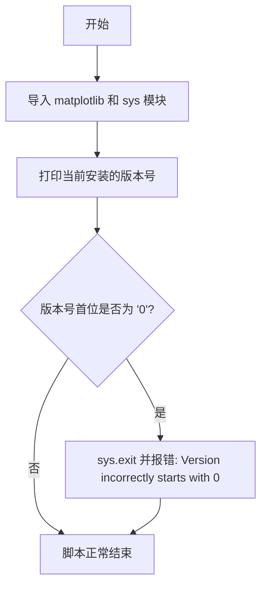

# `matplotlib\ci\check_version_number.py` 详细设计文档

这是一个版本号检查脚本，用于验证安装的 Matplotlib 版本号是否符合要求（不能以0开头），以确保发布流程中的版本规范。

## 整体流程



## 类结构

```
这是一个扁平结构的脚本，无类层次结构
```

## 全局变量及字段


### `sys`
    
Python标准库模块，用于访问系统相关功能和退出程序

类型：`module`
    


### `matplotlib`
    
matplotlib库主模块，通过导入获取版本信息

类型：`module`
    


    

## 全局函数及方法


## 关键组件


### 版本检查模块

该脚本是一个简单的版本验证工具，用于确保已安装的Matplotlib版本号不以"0"开头，以防止可能的版本解析问题。

### 主流程

该脚本首先导入matplotlib模块和sys模块，然后获取当前安装的matplotlib版本号，检查版本号首字符是否为"0"，若是则退出程序，否则打印版本信息。

### 关键组件

#### 1. matplotlib模块导入
用于获取当前安装的matplotlib版本信息

#### 2. 版本号字符串
存储matplotlib.__version__返回的版本号字符串

#### 3. 版本号首字符检查
通过索引[0]获取版本号的第一个字符，判断是否为"0"

### 潜在的技术债务或优化空间

1. **错误处理不足**：使用sys.exit()时传入字符串而非退出码，应该使用sys.exit(1)表示错误
2. **版本格式假设**：假设版本号总是以字符串形式存在且长度大于0，未进行空字符串检查
3. **缺乏灵活性**：硬编码检查"0"，无法适配其他版本格式或自定义检查规则
4. **输出信息不一致**：成功时打印版本，失败时仅退出无输出

### 其它项目

- **设计目标**：确保安装的matplotlib版本符合构建要求，防止版本号以0开头的潜在问题
- **约束条件**：需要在安装matplotlib后运行
- **错误处理**：版本号以0开头时程序异常退出
- **外部依赖**：仅依赖matplotlib和sys标准库


## 问题及建议


### 已知问题

-   **版本号解析方式不安全**：直接使用 `matplotlib.__version__[0]` 获取第一个字符，未检查版本号是否为 `None`、空字符串或非字符串类型，可能导致 `IndexError` 或 `TypeError`
-   **错误处理不完善**：`sys.exit("Version incorrectly starts with 0")` 传递字符串给 exit 函数，虽然功能上可行，但不符合最佳实践，应使用 `sys.exit(1)` 并配合错误消息输出
-   **版本检查逻辑不够精确**：仅检查第一个字符是否为 "0"，无法准确判断主版本号，例如 "10.2.3" 第一个字符是 "1" 会通过检查，但 "00.1.0" 会失败
-   **缺少导入异常处理**：假设 `matplotlib` 已正确安装，若未安装会直接抛出 `ImportError`，没有友好的错误提示
-   **类型注解缺失**：函数和变量均缺少类型注解，不利于代码可读性和静态分析工具的使用
-   **注释与实际用途不符**：文件头注释提到可使用 `python3 -m build .` 构建，但实际脚本仅用于检查已安装版本

### 优化建议

-   在访问版本号前进行类型和值检查：`if isinstance(matplotlib.__version__, str) and matplotlib.__version__`
-   使用更健壮的版本解析方式，如 `packaging.version` 库来解析版本号并比较主版本号
-   将 `sys.exit("message")` 改为先 `print("error message", file=sys.stderr)` 再 `sys.exit(1)`
-   添加 `try-except` 捕获 `ImportError` 并给出友好提示
-   考虑添加 `--help` 或配置选项以提高脚本灵活性
-   添加日志模块替代简单的 print 语句，便于调试和监控


## 其它


### 设计目标与约束

该脚本的设计目标是在安装matplotlib后验证其版本号是否符合预期，即版本号的首位字符不应为"0"。主要约束包括：仅支持Python 3环境，依赖matplotlib包必须已安装，脚本作为安装后验证工具运行。

### 错误处理与异常设计

脚本通过sys.exit()处理版本号不符合预期的情况，返回错误消息字符串作为退出状态。当matplotlib.__version__为空或不存在时，可能触发AttributeError异常。改进建议：添加try-except捕获导入异常和属性异常，提供更友好的错误提示。

### 外部依赖与接口契约

直接依赖matplotlib包，通过matplotlib.__version__属性获取版本字符串。无其他外部依赖。接口契约：matplotlib模块必须成功导入且包含__version__属性。

### 安全性考虑

代码本身安全性较高，无用户输入处理，无网络请求，无文件操作。但存在潜在风险：如果matplotlib.__version__返回非字符串类型（如None），直接使用索引访问会导致TypeError。

### 可维护性与扩展性

当前脚本功能单一，仅检查版本号首位字符。扩展建议：支持命令行参数指定版本号格式验证规则，支持配置化的版本号校验逻辑，可集成到CI/CD流程作为安装验证步骤。

### 测试策略

由于代码简单，建议采用以下测试策略：单元测试验证正常版本号场景、测试版本号以0开头的失败场景、测试matplotlib未安装的异常场景、测试__version__为非字符串类型的异常场景。

### 日志与监控设计

当前仅使用print输出版本信息。改进建议：引入标准logging模块，支持日志级别配置，将检查结果输出到标准错误流以便CI/CD管道捕获。


    