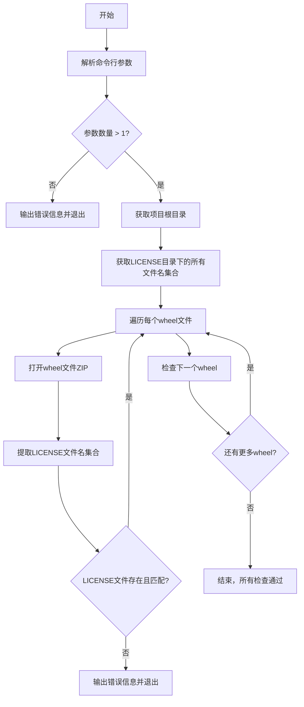
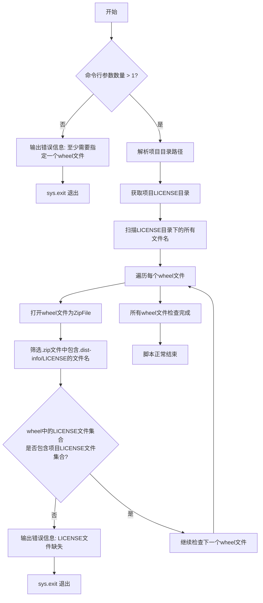

# `matplotlib\ci\check_wheel_licenses.py` 详细设计文档

该脚本用于验证Python wheel包中是否包含了正确的LICENSE文件，确保分发包符合许可证合规要求。

## 整体流程



## 类结构

```
模块级别脚本 (无类定义)
├── 全局执行流程
│   ├── 参数验证
│   ├── 目录路径解析
│   ├── LICENSE文件名收集
│   └── wheel文件检查循环
```

## 全局变量及字段


### `project_dir`
    
项目根目录路径，通过解析当前脚本文件的父目录的父目录得到

类型：`Path`
    


### `license_dir`
    
LICENSE目录路径，指向项目根目录下的LICENSE文件夹

类型：`Path`
    


### `license_file_names`
    
LICENSE目录下的文件名集合，通过遍历LICENSE目录并提取文件名生成

类型：`set`
    


### `wheel`
    
当前遍历的wheel文件名，从命令行参数中获取

类型：`str`
    


### `wheel_license_file_names`
    
wheel包内LICENSE文件名集合，通过解析wheel压缩包内的.dist-info/LICENSE路径提取

类型：`set`
    


    

## 全局函数及方法


### `check_wheel_licenses.py` (主脚本)

这是一个独立的Python脚本，用于验证指定的wheel安装包文件中是否包含与项目LICENSE目录相匹配的LICENSE文件，通过检查wheel文件内部的.dist-info/LICENSE路径来实现许可证合规性检查。

参数：

- `sys.argv[1:]`：`List[str]`，命令行传入的wheel文件路径列表（至少需要指定一个）

返回值：`int`，成功时返回0（通过`sys.exit(0)`或脚本正常结束），失败时返回非0值（通过`sys.exit('error message')`退出）

#### 流程图



#### 带注释源码

```python
#!/usr/bin/env python3
"""
Check that all specified .whl files have the correct LICENSE files included.

To run:
    $ python3 -m build --wheel
    $ ./ci/check_wheel_licenses.py dist/*.whl
"""

# 导入标准库：pathlib用于路径操作，sys用于系统参数和退出，zipfile用于读取whl文件
from pathlib import Path
import sys
import zipfile


# 检查命令行参数是否至少提供一个wheel文件路径
# sys.argv[0]是脚本本身，从sys.argv[1]开始是传入的参数
if len(sys.argv) <= 1:
    # 参数不足时，以错误信息退出程序（返回非0状态码）
    sys.exit('At least one wheel must be specified in command-line arguments.')

# 获取项目根目录：脚本文件所在目录的父目录的父目录（即项目根目录）
# resolve()将路径转换为绝对路径，parent获取父目录
project_dir = Path(__file__).parent.resolve().parent

# 定义LICENSE文件目录路径：项目根目录下的LICENSE文件夹
license_dir = project_dir / 'LICENSE'

# 获取LICENSE目录中所有文件的文件名集合
# sorted()确保顺序一致，path.name获取文件名而非完整路径
license_file_names = {path.name for path in sorted(license_dir.glob('*'))}

# 遍历命令行传入的每一个wheel文件路径
for wheel in sys.argv[1:]:
    # 打印当前正在检查的wheel文件信息
    print(f'Checking LICENSE files in: {wheel}')
    
    # 以只读模式打开wheel文件（wheel本质是zip压缩包）
    with zipfile.ZipFile(wheel) as f:
        # 提取wheel文件中所有文件路径，筛选包含.dist-info/LICENSE的路径
        # 并获取这些路径的文件名，存入集合
        wheel_license_file_names = {
            Path(path).name
            for path in sorted(f.namelist())
            if '.dist-info/LICENSE' in path
        }
        
        # 检查逻辑：
        # 1. wheel中必须至少有一个LICENSE文件（len > 0）
        # 2. wheel中的LICENSE文件集合必须完全覆盖项目LICENSE文件集合
        if not (len(wheel_license_file_names) and
                wheel_license_file_names.issuperset(license_file_names)):
            # 检查失败时，输出详细的错误信息并退出
            # 显示wheel中实际包含的LICENSE文件 vs 期望的LICENSE文件
            sys.exit(f'LICENSE file(s) missing:\n'
                     f'{wheel_license_file_names} !=\n'
                     f'{license_file_names}')

# 所有wheel文件检查通过后，脚本正常结束（隐式返回0）
```

#### 关键组件信息

| 组件名称 | 一句话描述 |
|---------|-----------|
| `project_dir` | 项目根目录路径，通过脚本文件位置向上两级获取 |
| `license_dir` | 项目LICENSE文件目录，存放所有需要打包的LICENSE文件 |
| `license_file_names` | 项目LICENSE目录中所有文件名组成的集合 |
| `wheel_license_file_names` | 当前检查的wheel文件中LICENSE文件名组成的集合 |
| `zipfile.ZipFile` | Python标准库，用于读取wheel（zip格式）文件内容 |
| `Path.glob('*')` | pathlib方法，用于遍历目录下的所有文件 |

#### 潜在的技术债务或优化空间

1. **缺乏详细错误报告**：当前只显示文件缺失，但未说明具体缺少哪些LICENSE文件，可增强错误信息的可读性
2. **不支持自定义LICENSE目录**：LICENSE路径硬编码为`project_dir / 'LICENSE'`，可考虑添加命令行参数支持自定义路径
3. **文件编码假设**：LICENSE文件名比较未考虑编码问题，可能在跨平台场景下出现问题
4. **缺少日志记录**：使用`print`输出检查进度，建议使用标准日志模块便于集成CI/CD系统
5. **无跳过机制**：对于可选LICENSE文件没有处理逻辑，缺乏灵活性
6. **权限错误处理**：读取wheel文件或LICENSE目录时可能抛出异常（如文件被占用、权限不足），缺乏try-except保护

#### 其它项目

**设计目标与约束：**
- 目标：确保发布的wheel包包含完整的LICENSE文件，满足开源许可证合规性要求
- 约束：wheel文件名必须以`.whl`结尾，LICENSE目录必须存在于项目根目录

**错误处理与异常设计：**
- 命令行参数不足时使用`sys.exit()`输出错误信息并返回非0状态码
- LICENSE文件缺失时同样使用`sys.exit()`报告具体缺失情况
- 未对文件读取异常（如文件不存在、权限问题）进行显式捕获

**数据流与状态机：**
```
[输入：命令行参数] → [解析项目路径] → [读取LICENSE目录] 
→ [遍历每个wheel文件] → [读取wheel内LICENSE列表] 
→ [比对集合] → [输出结果/退出]
```

**外部依赖与接口契约：**
- 依赖Python标准库：`pathlib`、`sys`、`zipfile`，无需第三方包
- 输入接口：命令行参数传入一个或多个`.whl`文件路径（支持通配符）
- 输出接口：成功时静默退出（状态码0），失败时输出错误信息并退出（状态码1）
- 假设wheel文件遵循PEP 427规范，包含`.dist-info`元数据目录


## 关键组件


### 命令行参数处理

处理用户传入的wheel文件路径列表，验证至少提供了一个wheel文件路径

### 项目LICENSE目录扫描

从项目根目录扫描LICENSE文件夹，获取所有LICENSE文件名称集合

### Wheel文件读取

使用zipfile模块打开wheel文件（.whl本质是zip格式），提取其中的LICENSE文件列表

### LICENSE文件比对

比对wheel包内的LICENSE文件与项目LICENSE目录中的文件，检查是否包含所有必需的LICENSE文件

### 错误处理与退出机制

当LICENSE文件缺失或不完整时，使用sys.exit()抛出错误信息并终止程序执行


## 问题及建议


### 已知问题

-   **缺乏命令行参数解析**：使用 `sys.argv` 手动解析，未使用 `argparse` 模块，导致无法显示帮助信息、缺乏参数校验和灵活配置
-   **缺少错误处理**：未检查 `license_dir` 是否存在，若目录不存在会导致 `FileNotFoundError` 异常
-   **魔法字符串**：`.dist-info/LICENSE` 字符串硬编码在代码中，缺乏常量定义
-   **缺乏类型注解**：函数参数和返回值均无类型提示，降低代码可读性和可维护性
-   **使用 `sys.exit` 退出**：直接调用 `sys.exit` 而非抛出异常，不利于单元测试和调用方捕获错误
-   **变量命名不够直观**：`wheel_license_file_names` 命名过长，可使用别名或重构
-   **缺乏日志输出**：仅使用 `print` 输出，无日志级别控制，不便于生产环境调试

### 优化建议

-   使用 `argparse` 替代手动 `sys.argv` 解析，添加 `--help`、`-v/--verbose` 等选项
-   在访问 `license_dir` 前检查其是否存在，必要时提供友好的错误提示或默认值
-   将 `.dist-info/LICENSE` 等字符串提取为模块级常量，如 `LICENSE_IN_WHEEL_SUBSTRING = ".dist-info/LICENSE"`
-   为函数参数和返回值添加类型注解（如 `def check_wheel_licenses(wheel_path: Path) -> bool:`）
-   将错误检测逻辑改为抛出自定义异常或返回布尔值，使函数更易于测试
-   使用 `logging` 模块替代 `print`，支持配置日志级别
-   考虑使用 `pathlib` 的 `exists()` 方法提前校验路径，提高代码健壮性

## 其它


### 设计目标与约束

确保发布的Python wheel包包含正确的LICENSE文件，符合开源许可合规要求。约束条件：脚本必须在Python 3环境下运行，需要wheel文件路径作为命令行参数，且wheel文件必须使用zipfile模块可读取。

### 错误处理与异常设计

脚本在以下情况退出：1) 未提供wheel文件参数时，输出错误信息并以状态码1退出；2) LICENSE文件缺失或不匹配时，输出详细的差异信息并以状态码1退出。异常处理主要依赖zipfile模块的异常传播，无自定义异常类。

### 数据流与状态机

主要流程：1) 解析命令行参数获取wheel文件列表；2) 读取项目LICENSE目录获取期望的许可文件集合；3) 遍历每个wheel文件，使用zipfile打开并提取LICENSE文件路径；4) 比较wheel内LICENSE文件集合与期望集合；5) 匹配失败则报错退出，成功则继续下一个wheel。

### 外部依赖与接口契约

依赖：Python标准库pathlib、sys、zipfile。输入接口：命令行参数传递wheel文件路径（支持通配符）。输出接口：标准输出打印检查进度，错误信息输出到标准错误，进程退出码表示成功/失败状态。

### 性能考虑

对于大型wheel文件，每次检查都需完整解压扫描。建议：1) 使用zipfile.ZipFile.namelist()而非解压；2) 添加--parallel选项支持多线程检查；3) 缓存项目LICENSE目录扫描结果。

### 安全性考虑

代码直接使用命令行参数构造文件路径，理论存在路径注入风险（虽然实际风险较低因wheel文件名通常可信）。建议：对wheel路径进行验证，确保在预期目录内。

### 可维护性与扩展性

硬编码的.dist-info/LICENSE路径限制了灵活性。建议：1) 将LICENSE子目录路径改为配置参数；2) 支持自定义文件扩展名检查（如LICENCE）；3) 添加--verbose选项输出详细日志。

### 测试策略

建议添加单元测试：1) 模拟项目LICENSE目录结构；2) 创建测试用wheel文件（包含/不包含LICENSE）；3) 测试各种边界条件（空参数、非法路径、损坏的wheel）。

    