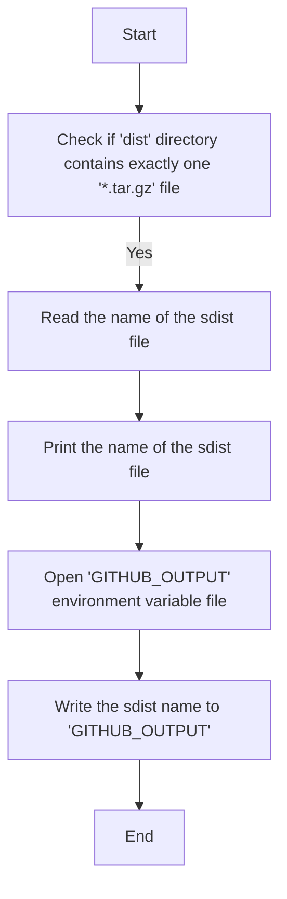

# `matplotlib\ci\export_sdist_name.py` 详细设计文档

This script determines the name of the sdist file in the 'dist' directory and exports it to GitHub output as 'SDIST_NAME'.

## 整体流程



## 类结构

```
Script (Main script)
```

## 全局变量及字段


### `paths`
    
List of names of sdist files found in the 'dist' directory.

类型：`list of str`
    


### `os`
    
Standard operating system interface module.

类型：`module`
    


### `sys`
    
Access to some variables used or maintained by the interpreter and to functions that interact strongly with the interpreter.

类型：`module`
    


### `Path`
    
A path-like object representing a file system path.

类型：`class`
    


### `GITHUB_OUTPUT`
    
Environment variable used to specify the output file for GitHub actions.

类型：`str`
    


    

## 全局函数及方法


### main()

该函数是程序的入口点，用于确定sdist的名称并将其输出到GitHub。

参数：

- 无

返回值：无

#### 流程图

```mermaid
graph TD
    A[Start] --> B[Check for single sdist in "dist"]
    B -->|Found| C[Print sdist name]
    B -->|Not found| D[Exit with error]
    C --> E[Write sdist name to GITHUB_OUTPUT]
    E --> F[End]
```

#### 带注释源码

```
#!/usr/bin/env python3

"""
Determine the name of the sdist and export to GitHub output named SDIST_NAME.

To run:
    $ python3 -m build --sdist
    $ ./ci/determine_sdist_name.py
"""
import os
from pathlib import Path
import sys

# Entry point of the script
def main():
    # List all .tar.gz files in the "dist" directory
    paths = [p.name for p in Path("dist").glob("*.tar.gz")]
    
    # Check if there is exactly one sdist file
    if len(paths) != 1:
        # If not, exit with an error message
        sys.exit(f"Only a single sdist is supported, but found: {paths}")
    
    # Print the name of the sdist
    print(paths[0])
    
    # Open the GITHUB_OUTPUT file for appending
    with open(os.environ["GITHUB_OUTPUT"], "a") as f:
        # Write the sdist name to the file
        f.write(f"SDIST_NAME={paths[0]}\n")

# Call the main function if the script is executed directly
if __name__ == "__main__":
    main()
```


## 关键组件


### 张量索引与惰性加载

支持对张量的索引操作，并在需要时才加载数据，以优化内存使用。

### 反量化支持

提供对反量化操作的支持，允许在量化过程中进行逆量化处理。

### 量化策略

实现不同的量化策略，以适应不同的应用场景和性能需求。


## 问题及建议


### 已知问题

-   {问题1}：代码中假设只有一个`.tar.gz`文件存在于`dist`目录中，如果存在多个或没有，程序会退出。这可能导致在多版本或构建过程中出现错误。
-   {问题2}：代码没有进行错误处理，例如在打开`GITHUB_OUTPUT`文件时可能会遇到权限问题或其他I/O错误。
-   {问题3}：代码没有考虑异常情况，如环境变量`GITHUB_OUTPUT`未设置时的情况。

### 优化建议

-   {建议1}：增加错误处理逻辑，确保在存在多个`.tar.gz`文件或文件不存在时，程序能够给出清晰的错误信息，而不是直接退出。
-   {建议2}：在打开文件时使用异常处理，确保在遇到I/O错误时程序能够优雅地处理异常，而不是直接崩溃。
-   {建议3}：检查环境变量`GITHUB_OUTPUT`是否已设置，如果未设置，则提供默认值或错误信息。
-   {建议4}：考虑使用更健壮的文件命名约定，以便在构建过程中区分不同的`.tar.gz`文件版本。
-   {建议5}：增加日志记录，以便在构建过程中跟踪和调试。


## 其它


### 设计目标与约束

- 设计目标：确保代码能够准确识别并输出单个sdist文件名，并将其导出到GitHub输出。
- 约束条件：只支持单个sdist文件，若存在多个sdist文件则退出程序。

### 错误处理与异常设计

- 错误处理：当`dist`目录下存在多个`.tar.gz`文件时，程序将输出错误信息并退出。
- 异常设计：未使用特定的异常处理机制，但通过检查文件数量来避免潜在的错误。

### 数据流与状态机

- 数据流：程序从`dist`目录下读取所有`.tar.gz`文件，检查数量，然后输出文件名。
- 状态机：程序没有明确的状态机，但可以视为一个简单的流程控制。

### 外部依赖与接口契约

- 外部依赖：`os`和`pathlib`模块。
- 接口契约：程序通过环境变量`GITHUB_OUTPUT`接收输出文件名。


    