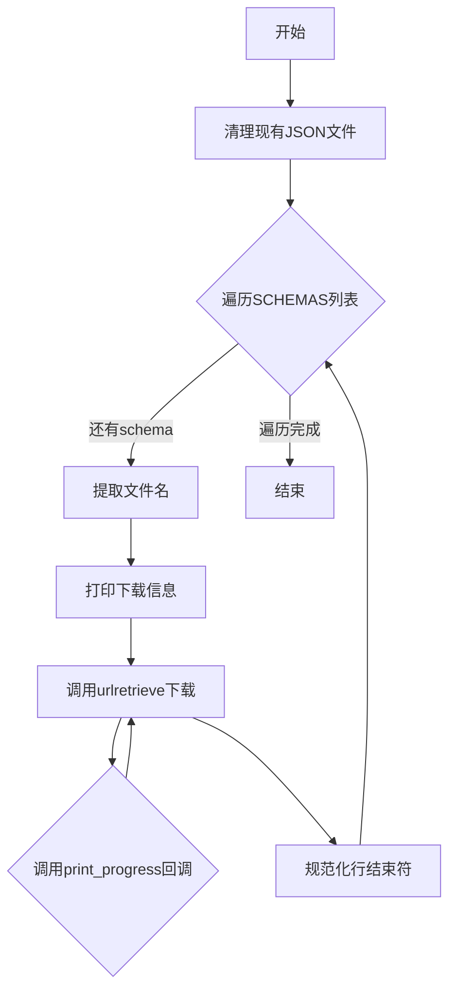

# `matplotlib\ci\schemas\vendor_schemas.py` 详细设计文档

该脚本用于在无互联网访问的 pre-commit CI 环境中，下载并保存多个 JSON Schema 文件到本地仓库，同时清理旧的 schema 文件并规范化行结束符以避免 Git 投诉。

## 整体流程



## 类结构

```
该脚本为扁平结构，无类层次
仅包含全局变量和全局函数
```

## 全局变量及字段


### `HERE`
    
当前脚本所在目录的路径对象

类型：`pathlib.Path`
    


### `SCHEMAS`
    
要下载的 JSON Schema URL 列表

类型：`list`
    


    

## 全局函数及方法


### `print_progress`

该函数是 `urllib.request.urlretrieve` 的回调函数（reporthook），用于在下载文件时显示进度条。它接收块传输通知，计算当前下载量，并使用 Unicode 块字符绘制可更新的进度条。

参数：

- `block_count`：`int`，已传输的块数量
- `block_size`：`int`，每个块的字节大小
- `total_size`：`int`，要下载文件的总字节数，如果未知则为 -1

返回值：`None`，该函数无返回值，仅通过标准输出打印进度信息

#### 流程图

```mermaid
flowchart TD
    A[开始] --> B[计算当前已下载大小: size = block_count * block_size]
    B --> C{total_size != -1?}
    C -->|是| D[限制大小: size = min(size, total_size)]
    C -->|否| G[计算进度条百分比: percent = size / total_size * 100]
    D --> G
    G --> H[计算填充宽度: filled = int(percent // 2)]
    H --> I[构建进度条字符串: 使用全块字符和浅色阴影字符]
    I --> J[打印进度条和数字: 使用\r覆盖当前行]
    J --> K[结束]
```

#### 带注释源码

```python
def print_progress(block_count, block_size, total_size):
    """
    urllib.request.urlretrieve 的回调函数，用于显示下载进度条。
    
    参数:
        block_count: 已传输的块数量
        block_size: 每个块的字节大小
        total_size: 文件总大小（字节），未知时为 -1
    """
    
    # 计算当前已下载的字节数（基于块数和块大小）
    size = block_count * block_size
    
    # 检查文件总大小是否已知（不为 -1）
    if total_size != -1:
        # 限制当前大小不超过总大小（防止超出）
        size = min(size, total_size)
        
        # 进度条宽度为 50 个字符
        width = 50
        
        # 计算已下载百分比 (0-100)
        percent = size / total_size * 100
        
        # 计算已填充的字符数量（每个字符代表 2%）
        filled = int(percent // (100 // width))
        
        # 使用 Unicode 块字符构建进度条
        # \N{Full Block} = █ (已填充部分)
        # \N{Light Shade} = ░ (未填充部分)
        percent_str = '\N{Full Block}' * filled + '\N{Light Shade}' * (width - filled)
    
    # 打印进度条，使用 \r 回到行首实现覆盖更新
    # 格式: "[进度条]  当前大小 / 总大小"
    print(f'{percent_str} {size:6d} / {total_size:6d}', end='\r')
```

## 关键组件


### SCHEMAS

存储预定义的模式文件URL列表，用于下载JSON Schema文件以支持linting和验证功能

### print_progress

下载进度回调函数，计算并显示下载进度条，包含已下载字节数和百分比

### 文件清理模块

遍历当前目录下的所有JSON文件并删除，为下载新文件做准备

### 下载模块

从预定义URL下载schema文件，使用urllib.request.urlretrieve并通过reporthook参数关联进度显示函数

### 行尾规范化模块

读取刚下载的文件内容并重新写入，确保行尾符与当前平台一致，避免Git提交时出现行尾符警告


## 问题及建议


### 已知问题

-   **缺乏错误处理**：网络请求没有异常捕获，下载失败时脚本会直接崩溃，导致所有已下载的文件丢失
-   **进度条计算缺陷**：`print_progress` 函数中 `percent // (100 // width)` 的计算在 total_size 为 -1 时会出错，且进度条更新逻辑不准确
-   **文件安全风险**：先删除所有 JSON 文件再下载，若下载中断会造成数据丢失
-   **行尾规范化操作冗余**：`path.write_text(path.read_text())` 只是简单读写相同内容，没有实际作用，反而增加了 I/O 开销
-   **无下载验证**：未验证文件是否为有效 JSON，也未校验文件完整性
-   **硬编码配置**：SCHEMAS 列表直接写在代码中，缺乏灵活性

### 优化建议

-   **添加异常处理**：使用 try/except 包裹网络请求，添加重试机制，记录失败日志
-   **改进进度条**：修复计算逻辑，或使用第三方库如 tqdm
-   **原子性写入**：先下载到临时文件，验证成功后再重命名，避免中断导致文件损坏
-   **添加下载验证**：验证 HTTP 状态码、检查 JSON 有效性、可选校验和验证
-   **配置外部化**：将 URL 列表移至配置文件，支持环境变量或命令行参数
-   **简化行尾处理**：如需规范化直接使用 textwrap.dedent 或相应工具，明确操作目的

## 其它


### 设计目标与约束

**设计目标**：为pre-commit CI环境提供离线可用的JSON Schema文件，通过预先下载并绑定到仓库中，使linting和validation功能在无网络环境下正常工作。

**约束条件**：
- 运行环境无互联网访问
- 需要兼容Windows、Linux、macOS三大平台（使用pathlib处理路径）
- 下载文件需规范化换行符以避免Git告警
- 脚本需在Python 3环境下运行

### 错误处理与异常设计

**网络错误处理**：
- `urllib.request.urlretrieve` 在网络失败时会抛出异常（如`URLError`、`HTTPError`），当前代码未捕获，脚本会中断
- 建议添加重试机制或友好的错误提示

**文件操作错误处理**：
- `os.remove(json)` 和 `path.write_text()` 可能因权限问题抛出`PermissionError`
- `path.read_text()` 可能因文件编码问题抛出`UnicodeDecodeError`
- 当前均未做异常捕获

**建议改进**：
```python
try:
    urllib.request.urlretrieve(schema, filename=path, reporthook=print_progress)
except urllib.error.URLError as e:
    print(f'Failed to download {schema}: {e}')
    continue
```

### 数据流与状态机

**数据流**：
1. 读取SCHEMAS列表 → 2. 清理旧文件 → 3. 遍历每个schema URL → 4. 提取文件名 → 5. 下载文件（带进度回调）→ 6. 规范化换行符 → 7. 写入磁盘

**状态机**：
- 初始状态：读取SCHEMAS列表
- 清理状态：删除现有JSON文件
- 下载状态：对每个schema执行下载流程
- 完成状态：所有文件下载并规范化完毕

### 外部依赖与接口契约

**外部依赖**：
- `os` - 标准库，文件删除操作
- `pathlib` - 标准库，路径处理
- `urllib.request` - 标准库，HTTP下载
- 远程URL依赖：
  - json.schemastore.org（需互联网访问）
  - github.com（需互联网访问）

**接口契约**：
- `print_progress(block_count, block_size, total_size)` - 进度回调函数，由urlretrieve调用
- SCHEMAS列表可扩展，支持添加更多schema URL

### 性能考虑

**下载性能**：
- 串行下载，无并发机制，大列表时效率较低
- 可考虑使用`concurrent.futures.ThreadPoolExecutor`实现并行下载

**存储性能**：
- 每次运行都删除所有JSON文件并重新下载，无增量更新机制
- 建议：可添加时间戳检查，仅下载更新过的文件

### 安全性考虑

**URL验证**：
- 代码未验证URL来源，存在供应链攻击风险
- 建议：添加URL白名单或哈希校验

**文件写入**：
- 直接写入当前目录，可能覆盖同名文件
- 建议：写入前检查文件是否已存在或使用临时文件

### 可维护性与扩展性

**扩展性**：
- 添加新schema只需在SCHEMAS列表中追加URL
- 目标目录通过HERE变量自动定位当前脚本目录

**维护性问题**：
- 硬编码的URL列表难以维护
- 建议：使用配置文件或从远程清单获取schema列表

### 测试策略建议

**单元测试**：
- 测试文件名提取逻辑（`rsplit('/', 1)[-1]`）
- 测试进度回调函数计算逻辑

**集成测试**：
- 模拟网络环境测试下载功能
- 测试不同平台下的换行符规范化

**建议添加**：
```python
def test_filename_extraction():
    assert 'appveyor.json' == 'https://json.schemastore.org/appveyor.json'.rsplit('/', 1)[-1]
```

### 监控与日志

**当前日志**：
- 仅通过`print`输出下载进度和状态
- 无结构化日志，无日志级别控制
- 无下载失败或成功的统计信息

**建议改进**：
- 添加日志模块（logging）
- 记录下载成功/失败统计
- 支持静默模式（-q参数）

### 版本兼容性

**Python版本**：
- 使用`#!/usr/bin/env python3`，要求Python 3.6+
- `pathlib`在Python 3.4+可用
- `urllib.request`在Python 3所有版本可用

**跨平台**：
- 使用`pathlib`确保跨平台兼容性
- 换行符规范化使用`path.read_text()`/`write_text()`自动处理

### 部署与使用说明

**使用方式**：
```bash
python download_schemas.py
```

**执行前提**：
- 当前目录可写
- 可访问目标URL（互联网或内部网络）
- Python 3.6+

**CI集成**：
- 作为pre-commit hook的一部分运行
- 建议在CI构建前执行，确保schema文件最新

    