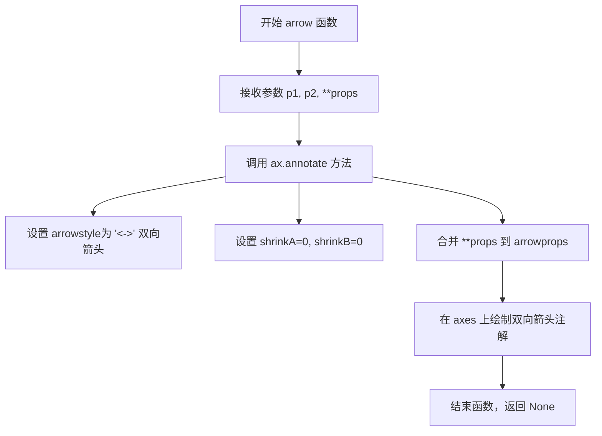

# `matplotlib\doc\_embedded_plots\axes_margins.py` 详细设计文档

该Python脚本使用matplotlib和numpy库创建一个可视化图表，展示正弦波数据，并通过各种图形注解（箭头、文本、彩色区域）直观地解释axes的margins属性如何影响x轴和y轴的显示范围，帮助开发者理解数据范围与边距之间的关系。

## 整体流程

```mermaid
graph TD
    A[开始] --> B[导入numpy和matplotlib.pyplot库]
    B --> C[创建画布和axes对象 figsize=(6.5, 4)]
    C --> D[生成x数据: np.linspace(0, 1, 33)]
    D --> E[计算y数据: y = -np.sin(x * 2π)]
    E --> F[绘制散点图: ax.plot(x, y, 'o')]
    F --> G[设置margins: ax.margins(0.5, 0.2)]
    G --> H[固定axes limits防止后续修改]
    H --> I[定义arrow辅助函数用于绘制双箭头]
    I --> J[获取并计算x轴相关边界值]
    J --> K[绘制x轴margin可视化区域和箭头]
    K --> L[添加x轴说明文本]
    L --> M[获取并计算y轴相关边界值]
    M --> N[绘制y轴margin可视化区域和箭头]
    N --> O[添加y轴说明文本]
    O --> P[结束/显示图表]
```

## 类结构

```
该文件为脚本式代码，无类层次结构
仅有模块级函数定义和全局变量
```

## 全局变量及字段


### `fig`
    
图表画布对象，用于承载整个图形

类型：`matplotlib.figure.Figure`
    


### `ax`
    
坐标轴对象，用于绘制数据图形和添加注释

类型：`matplotlib.axes.Axes`
    


### `x`
    
从0到1的33个等间距点

类型：`numpy.ndarray`
    


### `y`
    
对应x的负正弦值数组

类型：`numpy.ndarray`
    


### `axmin`
    
axes的x轴最小显示范围

类型：`float`
    


### `axmax`
    
axes的x轴最大显示范围

类型：`float`
    


### `aymin`
    
axes的y轴最小显示范围

类型：`float`
    


### `aymax`
    
axes的y轴最大显示范围

类型：`float`
    


### `xmin`
    
x数据的最小值

类型：`float`
    


### `xmax`
    
x数据的最大值

类型：`float`
    


### `ymin`
    
y数据的最小值

类型：`float`
    


### `ymax`
    
y数据的最大值

类型：`float`
    


### `y0`
    
-0.8, x轴margin注释的y坐标

类型：`float`
    


### `x0`
    
0.1, y轴margin注释的x坐标

类型：`float`
    


### `arrow`
    
用于在坐标轴上绘制双向箭头的全局函数

类型：`function`
    


    

## 全局函数及方法


### `arrow`

该局部函数接收两个坐标点p1和p2及样式属性，在matplotlib的axes对象上绘制双向箭头注解，使用ax.annotate实现，支持通过props传递额外的箭头样式属性。

参数：

- `p1`：元组或列表，表示箭头的起始坐标点 (x, y)
- `p2`：元组或列表，表示箭头的结束坐标点 (x, y)
- `**props`：可变关键字参数，用于传递箭头样式属性（如颜色、线宽等），会合并到arrowprops字典中

返回值：`None`，该函数无返回值，直接在axes上绘制图形

#### 流程图



#### 带注释源码

```python
def arrow(p1, p2, **props):
    """
    在 axes 上绘制双向箭头注解
    
    参数:
        p1: 起始坐标点 (x, y)
        p2: 结束坐标点 (x, y)
        **props: 可变关键字参数，传递给 arrowprops 的样式属性
    """
    # 使用 annotate 方法绘制双向箭头
    # arrowstyle="<->" 表示双向箭头样式
    # shrinkA=0 表示箭头起始端不收缩，紧贴 p1 点
    # shrinkB=0 表示箭头结束端不收缩，紧贴 p2 点
    # **props 允许调用者自定义箭头颜色、线宽等样式
    ax.annotate("", p1, p2,
                arrowprops=dict(arrowstyle="<->", shrinkA=0, shrinkB=0, **props))
```

## 关键组件


### 图形初始化与数据生成

使用 matplotlib 创建 6.5x4 英寸的图表，生成 33 个采样点的 x 轴数据（0到1之间），以及对应的 -sin(x*2π) 的 y 轴数据，并绘制散点图。

### 边距固定机制

通过 `ax.set(xlim=ax.get_xlim(), ylim=ax.get_ylim())` 锁定当前坐标轴的显示范围，防止后续辅助绘图操作改变已设置的边距。

### 箭头绘制辅助函数

自定义 `arrow(p1, p2, **props)` 函数封装 `ax.annotate()`，用于在图表上绘制双向箭头，支持灵活的样式属性配置。

### X轴边距可视化

使用 `axvspan` 绘制橙色半透明区域标注 x 轴的左右边距范围，通过双向箭头和文本标签说明"x margin"与"x data range"的关系。

### Y轴边距可视化

使用 `axhspan` 绘制绿色半透明区域标注 y 轴的上下边距范围，通过双向箭头和文本标签说明"y margin"与"y data range"的关系。


## 问题及建议


### 已知问题

-   **硬编码的数值过多**： margins值(0.5, 0.2)、y0坐标(−0.8)、x0坐标(0.1)、文本偏移量(0.05, 0.1)等关键数值均为硬编码，缺乏可配置性
-   **冗余的轴限制设置**：`ax.set(xlim=ax.get_xlim(), ylim=ax.get_ylim())` 先获取限制再设置回去，逻辑冗余且无实际意义
-   **魔法数字缺乏解释**：文本偏移量、颜色透明度等数值未定义为常量，难以理解和维护
-   **函数定义位置不当**：`arrow` 函数定义在脚本中部，遵循PEP8应在文件顶部定义
-   **缺少函数文档**：`arrow` 函数无docstring，无法快速理解其用途和参数说明
-   **无错误处理机制**：缺少对数据范围异常、图形元素创建失败等情况的异常捕获
-   **颜色格式不统一**：混用颜色名称字符串("sienna")和元组格式(("orange", 0.1))，降低代码一致性
-   **文本定位硬编码**：如`ax.text(0.55, y0+0.1, ...)`中的位置坐标对不同数据范围适应性差

### 优化建议

-   将关键配置参数（margins、数据点范围、样式参数等）提取为模块级常量或配置字典
-   重构`arrow`函数，添加完整的docstring说明参数、返回值和功能
-   移除冗余的轴限制设置代码，或将其替换为有实际作用的操作
-   使用统一的颜色格式定义（如RGBA元组），或通过matplotlib的color参数统一管理
-   为可能失败的图形操作添加try-except异常处理
-   将文本位置计算公式化，基于实际数据范围动态计算，而非硬编码坐标
-   考虑将可视化逻辑封装为函数或类，提高代码复用性和可测试性

## 其它


### 设计目标与约束

本代码是一个matplotlib可视化示例程序，旨在通过图形化方式直观演示matplotlib中axes的margins属性工作原理。代码生成一个正弦波图表，并通过箭头、文本和色块标注，展示x轴和y轴的边距（margin）与实际数据范围之间的关系。约束条件包括：依赖numpy和matplotlib两个外部库，需要在支持图形渲染的环境下运行。

### 错误处理与异常设计

代码较为简单，未包含显式的错误处理机制。潜在异常包括：numpy或matplotlib未安装导致的ImportError；无图形显示环境导致的RuntimeError（如在headless服务器上运行）；数据为空或数值溢出导致的计算异常。建议在实际应用中添加环境检查（如plt.isinteractive()）、数据验证（检查x、y数组非空）以及异常捕获（try-except块包装绘图逻辑）。

### 数据流与状态机

代码的数据流较为简单线性：首先生成x轴数据点（np.linspace生成0到1的33个点），然后计算对应的y值（-sin(x*2π)），接着创建Figure和Axes对象，最后通过一系列绘图API（plot、annotate、axvspan、axhspan、text等）将数据可视化并添加注释。状态机方面，代码执行分为初始化状态（导入库、创建画布）→ 数据准备状态（生成x、y数据）→ 绑图状态（绑定数据到axes）→ 注释状态（添加箭头、文本、色块）→ 完成状态（set_xlim/ylim锁定范围）。

### 外部依赖与接口契约

代码依赖两个外部库：numpy（版本建议1.x以上）提供数值计算功能，matplotlib（版本建议2.x以上）提供绑图功能。numpy的接口契约：np.linspace返回等间距数组，np.sin执行三角函数计算，数组的min/max方法返回极值。matplotlib的接口契约：plt.subplots返回(Figure, Axes)元组，ax.plot绑定折线图，ax.annotate创建箭头注释，ax.axvspan/axhspan创建范围色块，ax.text添加文本标签，ax.set_xlim/ylim设置坐标轴范围。

### 性能考量与优化空间

当前代码性能无明显问题，因为数据量较小（33个点）。可考虑的优化空间：若数据量增大，可使用ax.plot的where参数或set_data进行增量更新；箭头和文本对象可预先创建以复用；色块填充可用fill_between替代axvspan以获得更高灵活性。代码结构上，建议将arrow函数抽取为独立的辅助函数，提高可测试性和可维护性。

### 可配置性与参数说明

代码中包含多个可配置参数：图表尺寸figsize=(6.5, 4)可调整；数据点数量33可修改；x数据范围linspace(0,1)可更改；y0边距标记位置-0.8可调整；x0文本位置0.1可修改；各颜色值（orange、sienna、tab:green等）可替换为自定义颜色；透明度0.1可调整；边距值margins(0.5, 0.2)可配置。

### 使用场景与扩展方向

当前代码用于教学演示目的。扩展方向包括：将其封装为函数，接受数据、边距值等参数；支持多种函数曲线（cos、tan等）；支持动态动画展示margin变化效果；可扩展为交互式widget，允许用户拖动边距并实时查看效果；可集成到文档生成系统作为API使用示例。

### 代码质量与维护建议

代码质量整体良好，注释清晰。改进建议：将全局函数arrow抽取到专门的辅助模块；将硬编码的数值（颜色、位置、标签文本）抽取为常量或配置文件；为关键代码段添加docstring；考虑使用面向对象方式封装，创建一个MarginDemo类来管理图表状态；添加类型注解以提高代码可读性和IDE支持。


    