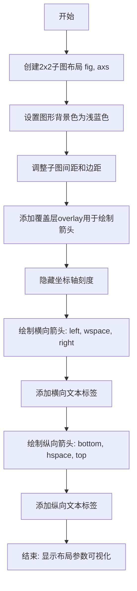
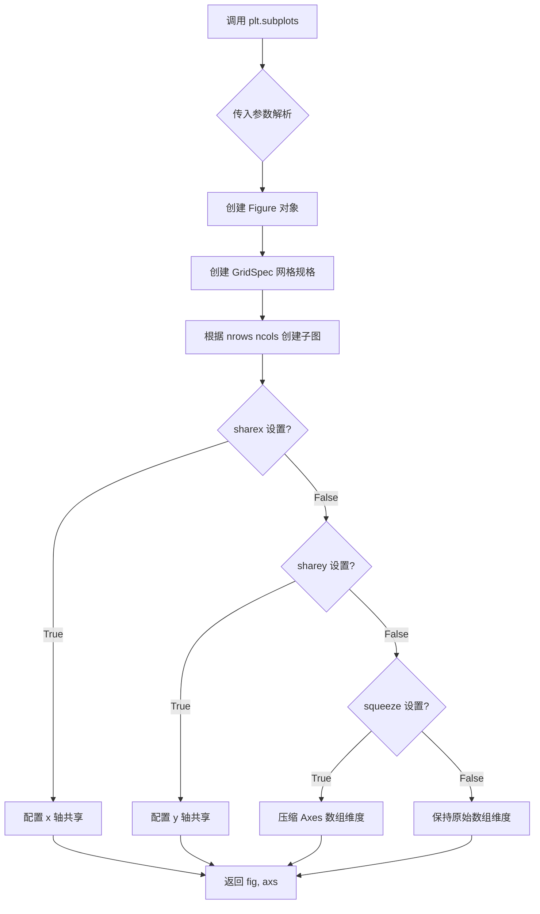
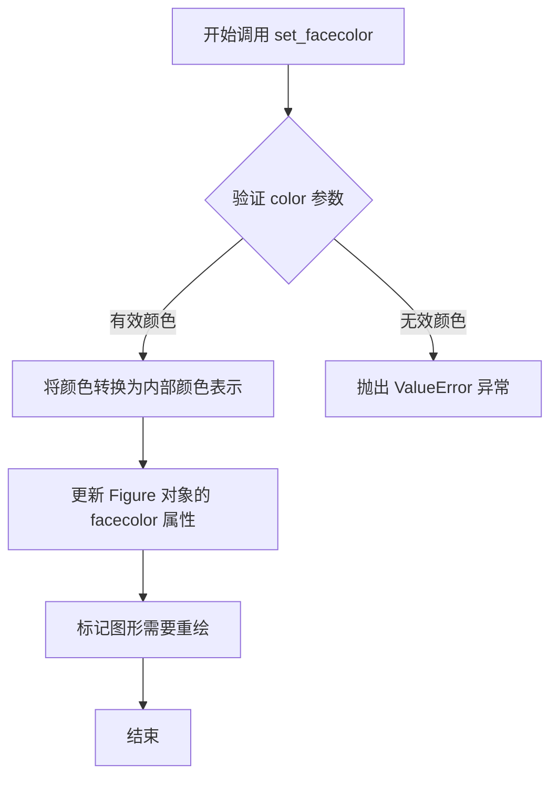
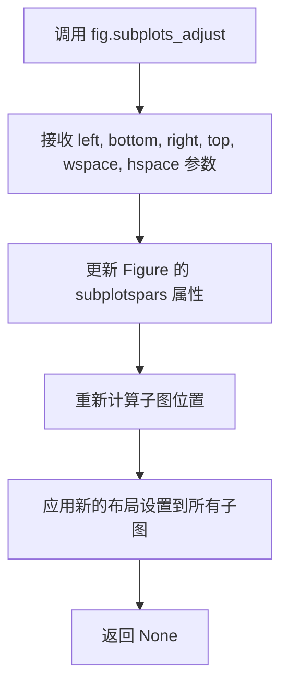
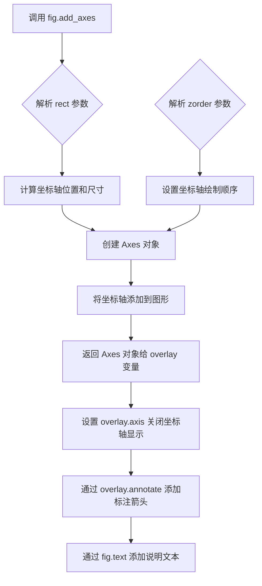
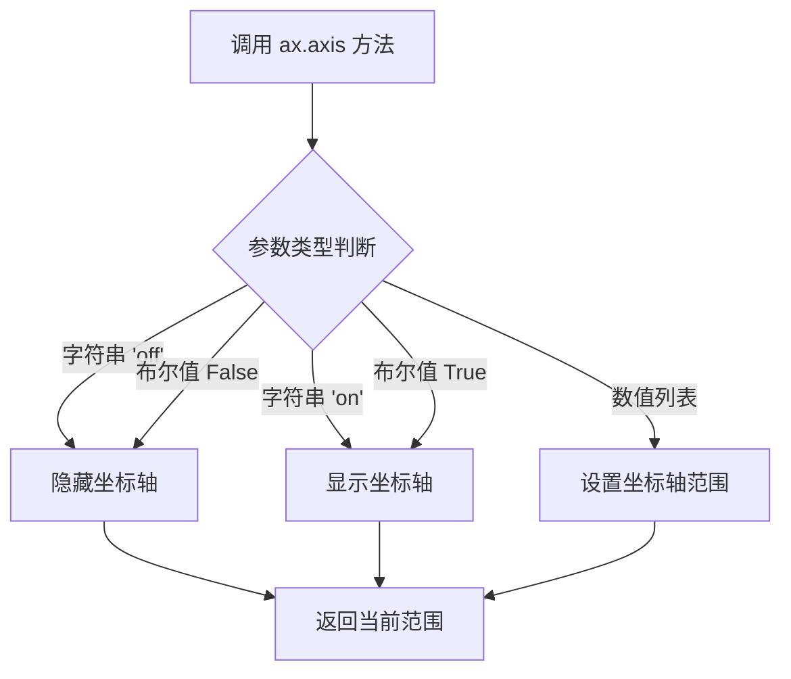
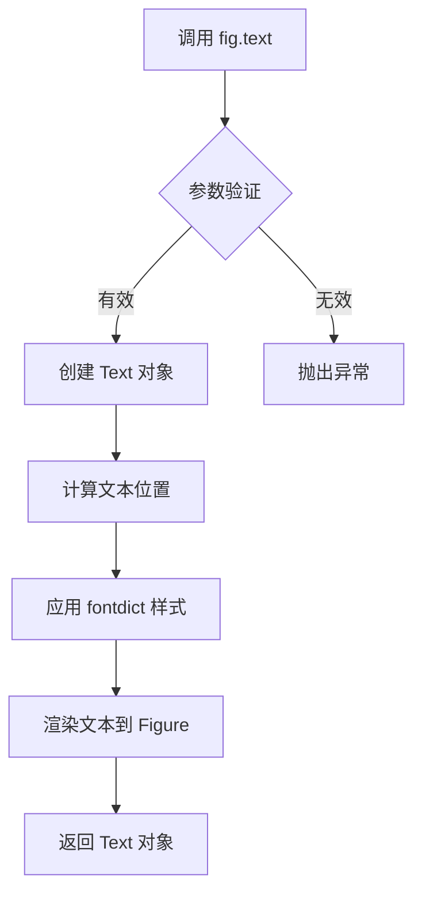
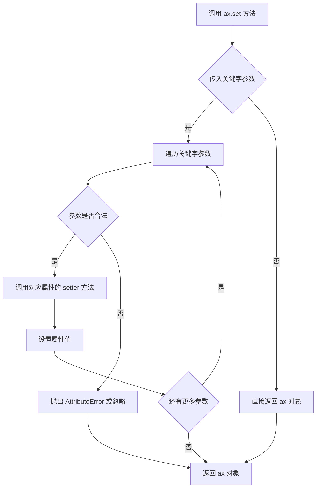

# `matplotlib\doc\_embedded_plots\figure_subplots_adjust.py` 详细设计文档

该代码使用matplotlib创建一个2x2的子图布局，并通过添加覆盖层、箭头和文本注释来可视化展示子图之间的间距参数（left、right、top、bottom、hspace、wspace）的位置和含义

## 整体流程



## 类结构

```
该代码为脚本式Python程序，无类定义
主要使用matplotlib.pyplot模块的函数式API
涉及对象: Figure, Axes, Text, Annotation
```

## 全局变量及字段


### `fig`
    
图形对象

类型：`matplotlib.figure.Figure`
    


### `axs`
    
2x2 Axes数组

类型：`numpy.ndarray`
    


### `overlay`
    
覆盖层坐标轴对象

类型：`matplotlib.axes.Axes`
    


### `xycoords`
    
坐标转换模式('figure fraction')

类型：`str`
    


### `arrowprops`
    
箭头属性配置字典

类型：`dict`
    


    

## 全局函数及方法


### `plt.subplots`

`plt.subplots` 是 matplotlib.pyplot 库中的核心函数，用于创建一个包含多个子图的图形布局。它能够一次性生成 Figure 对象和对应的 Axes 对象数组，支持灵活的行列网格布局、轴共享、间距调整等功能，是科学计算和数据可视化中最常用的多子图创建方式。

参数：

- `nrows`：`int`，默认值 1，子图网格的行数
- `ncols`：`int`，默认值 1，子图网格的列数
- `sharex`：`bool or {'none', 'all', 'row', 'col'}`，默认值 False，控制是否共享 x 轴
- `sharey`：`bool or {'none', 'all', 'row', 'col'}`，默认值 False，控制是否共享 y 轴
- `squeeze`：`bool`，默认值 True，为 True 时返回的 Axes 数组维度将压缩到最优维度
- `width_ratios`：`array-like of length ncols`，可选，定义每列的相对宽度
- `height_ratios`：`array-like of length nrows`，可选，定义每行的相对高度
- `subplot_kw`：`dict`，可选，传递给每个子图创建函数的关键字参数
- `gridspec_kw`：`dict`，可选，传递给 GridSpec 构造函数的关键字参数
- `**fig_kw`：传递给 Figure 创建函数的关键字参数（如 figsize、facecolor 等）

返回值：`tuple(Figure, Axes or array of Axes)`，返回图形对象和轴对象（或轴对象数组）

#### 流程图



#### 带注释源码

```python
import matplotlib.pyplot as plt

# 创建 2x2 的子图布局，返回 Figure 和 Axes 数组
# 参数说明：
#   2, 2: 表示 2 行 2 列共 4 个子图
#   figsize=(6.5, 4): 设置图形宽度 6.5 英寸，高度 4 英寸
fig, axs = plt.subplots(2, 2, figsize=(6.5, 4))

# 设置图形的背景颜色为浅蓝色
fig.set_facecolor('lightblue')

# 调整子图之间的间距参数：
# left=0.1: 左侧边距占图形宽度的 10%
# right=0.9: 右侧边距占图形宽度的 90%
# bottom=0.1: 底部边距占图形高度的 10%
# top=0.9: 顶部边距占图形高度的 90%
# wspace=0.4: 子图之间的水平间距（宽间距）占可用空间的 40%
# hspace=0.4: 子图之间的垂直间距（高间距）占可用空间的 40%
fig.subplots_adjust(0.1, 0.1, 0.9, 0.9, 0.4, 0.4)

# 创建一个覆盖整个图形的叠加层，用于绘制注释箭头
# 参数 [0, 0, 1, 1] 表示 axes 位置为整个 figure 区域
# zorder=100 确保叠加层显示在最上层
overlay = fig.add_axes([0, 0, 1, 1], zorder=100)

# 关闭叠加层的坐标轴显示
overlay.axis("off")

# 设置注释箭头的坐标参考系为 figure 分数（0-1 范围）
xycoords = 'figure fraction'

# 定义箭头样式：双向箭头，两端不收缩
arrowprops = dict(arrowstyle="<->", shrinkA=0, shrinkB=0)

# 遍历所有子图，清除 x 和 y 轴的刻度
for ax in axs.flat:
    ax.set(xticks=[], yticks=[])

# ========== 绘制边距注释箭头和标签 ==========

# 左边界箭头（左侧边距指示）
overlay.annotate("", (0, 0.75), (0.1, 0.75),
                 xycoords=xycoords, arrowprops=arrowprops)

# wspace 箭头（子图间水平间距指示）
overlay.annotate("", (0.435, 0.25), (0.565, 0.25),
                 xycoords=xycoords, arrowprops=arrowprops)

# 右边界箭头（右侧边距指示）
overlay.annotate("", (0, 0.8), (0.9, 0.8),
                 xycoords=xycoords, arrowprops=arrowprops)

# 添加文字标签说明各区域
fig.text(0.05, 0.7, "left", ha="center")      # 左边界标签
fig.text(0.5, 0.3, "wspace", ha="center")     # 水平间距标签
fig.text(0.05, 0.83, "right", ha="center")    # 右边界标签

# 底部边界箭头（底部边距指示）
overlay.annotate("", (0.75, 0), (0.75, 0.1),
                 xycoords=xycoords, arrowprops=arrowprops)

# hspace 箭头（子图间垂直间距指示）
overlay.annotate("", (0.25, 0.435), (0.25, 0.565),
                 xycoords=xycoords, arrowprops=arrowprops)

# 顶部边界箭头（顶部边距指示）
overlay.annotate("", (0.8, 0), (0.8, 0.9),
                 xycoords=xycoords, arrowprops=arrowprops)

# 添加文字标签说明各区域
fig.text(0.65, 0.05, "bottom", va="center")   # 底部边界标签
fig.text(0.28, 0.5, "hspace", va="center")    # 垂直间距标签
fig.text(0.82, 0.05, "top", va="center")      # 顶部边界标签

# 显示图形（如果在交互式环境中）
# plt.show()
```


### `Figure.set_facecolor`

设置matplotlib Figure对象的背景颜色（面颜色）。

参数：

- `color`：字符串或元组，可选，默认值：'white'。背景颜色，可以是任何matplotlib可识别的颜色格式，如颜色名称（'red'、'lightblue'）、十六进制颜色码（'#FF0000'）、RGB元组（(1, 0, 0)）或RGBA元组（(1, 0, 0, 1)）。

返回值：`None`，无返回值，该方法直接修改Figure对象的内部状态。

#### 流程图



#### 带注释源码

```python
# 在 matplotlib 中，Figure.set_facecolor 方法的典型实现如下：
# （以下为简化版源码，展示核心逻辑）

def set_facecolor(self, color):
    """
    设置图形的背景颜色。
    
    参数:
        color : 颜色值
            可以是以下任一形式:
            - 颜色名称字符串: 'red', 'lightblue', 'white'
            - 十六进制字符串: '#FF0000', '#00FF00FF'
            - RGB元组: (1.0, 0.0, 0.0)
            - RGBA元组: (1.0, 0.0, 0.0, 1.0)
            - 特殊值: 'inherit' (继承父容器颜色)
    """
    # 将传入的颜色值转换为matplotlib内部颜色表示
    color = mcolors.to_rgba(color)  # 调用颜色处理模块
    
    # 更新Figure对象的_facecolor属性（私有属性存储实际颜色数据）
    self._facecolor = color
    
    # 设置标志位，指示图形需要重新渲染
    self.stale = True
    
    # 返回None，符合matplotlib大多数设置方法的约定
    return None

# 在实际代码中的调用示例：
fig, axs = plt.subplots(2, 2, figsize=(6.5, 4))  # 创建2x2子图布局
fig.set_facecolor('lightblue')  # 设置图形背景色为浅蓝色
```

#### 关键点说明

1. **方法归属**：此方法属于 `matplotlib.figure.Figure` 类
2. **调用时机**：在创建Figure对象后、渲染前调用
3. **颜色格式支持**：支持多种颜色格式，包括命名颜色、十六进制、RGB/RGBA
4. **副作用**：设置 `stale = True` 标志，触发后续重绘流程
5. **返回值设计**：返回 `None` 是matplotlib的传统设计，便于使用 `fig.set_facecolor('color').subplots_adjust(...)` 链式调用的模式


### `Figure.subplots_adjust`

调整 Figure 中子图的间距和边距。该方法通过设置子图区域的外边距（left, right, bottom, top）以及子图之间的内边距（wspace, hspace）来控制子图的布局。

参数：

- `left`：`float`，左侧边距，相对于图形宽度的比例（0到1之间）
- `bottom`：`float`，底部边距，相对于图形高度的比例（0到1之间）
- `right`：`float`，右侧边距，相对于图形宽度的比例（0到1之间）
- `top`：`float`，顶部边距，相对于图形高度的比例（0到1之间）
- `wspace`：`float`，子图之间的水平间距，相对于子图宽度的比例
- `hspace`：`float`，子图之间的垂直间距，相对于子图高度的比例

返回值：`None`，该方法直接修改 Figure 对象的布局属性，不返回任何值

#### 流程图



#### 带注释源码

```python
# 调用 fig.subplots_adjust(0.1, 0.1, 0.9, 0.9, 0.4, 0.4)
# 
# 参数对应关系：
# left=0.1    : 子图区域左边界距离图形左边 10% 的位置
# bottom=0.1  : 子图区域底边界距离图形底部 10% 的位置
# right=0.9   : 子图区域右边界距离图形左边 90% 的位置
# top=0.9     : 子图区域顶边界距离图形底部 90% 的位置
# wspace=0.4  : 子图之间的水平间距为子图宽度的 40%
# hspace=0.4  : 子图之间的垂直间距为子图高度的 40%
#
# 该调用将子图布局设置为：
# - 外边距：左右各留 10%，上下各留 10%
# - 内边距：子图间水平和垂直间距均为 40%

fig.subplots_adjust(0.1, 0.1, 0.9, 0.9, 0.4, 0.4)
```


### `fig.add_axes`

该函数用于在matplotlib图形对象上创建一个新的坐标轴（Axes），常用于添加覆盖层以实现图形标注和说明。在本代码中，它被用于创建一个覆盖整个图形的透明坐标轴层，以便在子图之间添加间距标注箭头和文本。

参数：

- `rect`：`list` 或 `tuple`，形状为 `[left, bottom, width, height]` 的四元素列表，表示新坐标轴相对于图形的位置和尺寸。本例中传入 `[0, 0, 1, 1]`，表示坐标轴从图形左下角 (0, 0) 开始，宽度和高度均为 1（覆盖整个图形区域）。
- `zorder`：`int`，绘图顺序参数，数值越高越晚绘制（显示在最上层）。本例中传入 `100`，确保覆盖层坐标轴显示在其他所有元素之上。

返回值：`matplotlib.axes.Axes`，返回新创建的坐标轴对象（本例中赋值给变量 `overlay`），用于后续添加注释、文本等元素。

#### 流程图



#### 带注释源码

```python
# 在图形 fig 上添加一个新的坐标轴，覆盖整个图形区域
# 参数 [0, 0, 1, 1] 定义了坐标轴的位置和大小：
#   - left=0: 左边从图形左边缘开始
#   - bottom=0: 底边从图形底边缘开始  
#   width=1: 宽度为整个图形的宽度
#   height=1: 高度为整个图形的高度
# zorder=100: 设置极高的绘制优先级，确保覆盖层显示在最上层
overlay = fig.add_axes([0, 0, 1, 1], zorder=100)

# 关闭覆盖层坐标轴的坐标轴线和刻度显示，使其成为透明覆盖层
overlay.axis("off")

# 定义坐标系统为 'figure fraction'，即基于图形尺寸的相对坐标（0-1）
xycoords = 'figure fraction'

# 定义箭头样式：双向箭头，不收缩
arrowprops = dict(arrowstyle="<->", shrinkA=0, shrinkB=0)

# 遍历所有子图，移除它们的刻度标记
for ax in axs.flat:
    ax.set(xticks=[], yticks=[])

# === 添加左侧间距标注 ===
overlay.annotate("", (0, 0.75), (0.1, 0.75),
                 xycoords=xycoords, arrowprops=arrowprops)  # 左箭头

# === 添加水平间距（wspace）标注 ===
overlay.annotate("", (0.435, 0.25), (0.565, 0.25),
                 xycoords=xycoords, arrowprops=arrowprops)  # 宽间距箭头

# === 添加右侧间距标注 ===
overlay.annotate("", (0, 0.8), (0.9, 0.8),
                 xycoords=xycoords, arrowprops=arrowprops)  # 右箭头

# 在指定位置添加文字标注
fig.text(0.05, 0.7, "left", ha="center")      # 左侧标注文字
fig.text(0.5, 0.3, "wspace", ha="center")    # 水平间距标注文字
fig.text(0.05, 0.83, "right", ha="center")    # 右侧标注文字

# === 添加底部间距标注 ===
overlay.annotate("", (0.75, 0), (0.75, 0.1),
                 xycoords=xycoords, arrowprops=arrowprops)  # 下箭头

# === 添加垂直间距（hspace）标注 ===
overlay.annotate("", (0.25, 0.435), (0.25, 0.565),
                 xycoords=xycoords, arrowprops=arrowprops)  # 高间距箭头

# === 添加顶部间距标注 ===
overlay.annotate("", (0.8, 0), (0.8, 0.9),
                 xycoords=xycoords, arrowprops=arrowprops)  # 上箭头

# 在指定位置添加文字标注
fig.text(0.65, 0.05, "bottom", va="center")   # 底部标注文字
fig.text(0.28, 0.5, "hspace", va="center")    # 垂直间距标注文字
fig.text(0.82, 0.05, "top", va="center")      # 顶部标注文字
```


### `matplotlib.axes.Axes.axis`

该方法用于设置或获取坐标轴的可见性以及坐标轴的范围。在代码中通过 `overlay.axis("off")` 调用，以隐藏坐标轴的显示。

参数：

- `v`：`str` 或 `bool`，可选，用于控制坐标轴的可见性。传递 `"off"` 隐藏坐标轴，传递 `"on"` 显示坐标轴，传递 `True`/`False` 布尔值也可控制可见性。
- `*args`：可变参数，可选，当传递四个数值 `[xmin, xmax, ymin, ymax]` 时，用于设置坐标轴的范围。
- `**kwargs`：关键字参数，可选，用于传递其他matplotlib属性设置。

返回值：`list`，返回当前坐标轴的范围 `[xmin, xmax, ymin, ymax]`。

#### 流程图



#### 带注释源码

```python
# 在代码中的实际调用
overlay.axis("off")

# 完整的方法签名（简化版）
# def axis(self, v=None, *, emit=True, **kwargs):
#     """
#     设置或获取坐标轴的可见性和范围。
#     
#     参数:
#         v : str 或 bool 或 list
#             - 'on' / True: 显示坐标轴
#             - 'off' / False: 隐藏坐标轴
#             - [xmin, xmax, ymin, ymax]: 设置坐标轴范围
#     
#     返回:
#         list: [xmin, xmax, ymin, ymax]
#     """
#     
#     # 方法内部逻辑（伪代码）
#     if v == 'off' or v is False:
#         # 隐藏坐标轴的所有元素（刻度、标签、边框等）
#         self.xaxis.set_visible(False)
#         self.yaxis.set_visible(False)
#         self.spines['top'].set_visible(False)
#         self.spines['bottom'].set_visible(False)
#         self.spines['left'].set_visible(False)
#         self.spines['right'].set_visible(False)
#     
#     return self.get_xlim() + self.get_ylim()
```

#### 代码上下文说明

在给定的完整代码中，`overlay.axis("off")` 的作用是：
1. 创建一个覆盖整个图形的透明坐标轴（`zorder=100` 置于顶层）
2. 调用 `axis("off")` 隐藏该坐标轴的所有视觉元素
3. 使 overlay 成为一个纯注释层，用于绘制箭头和文字说明，而不显示坐标轴边框
4. 这样可以清晰地展示子图布局中的 `left`、`right`、`top`、`bottom`、`wspace`、`hspace` 参数的含义和效果


### `overlay.annotate` (左箭头)

在图表的左侧添加一条水平双向箭头，指示 left 区域。

参数：

- `s`：`str`，注释文本内容（此处为空字符串""，表示不显示文本）
- `xy`：`tuple`，箭头指向的终点坐标 (x, y)，此处为 `(0.1, 0.75)`
- `xytext`：`tuple`，箭头起始的起点坐标 (x, y)，此处为 `(0, 0.75)`
- `xycoords`：`str`，坐标系统，此处为 `'figure fraction'`（基于图形分数的坐标）
- `arrowprops`：`dict`，箭头属性字典，此处为 `dict(arrowstyle="<->", shrinkA=0, shrinkB=0)`

返回值：`Text`，返回创建的注释文本对象

#### 流程图

```mermaid
graph TD
    A[开始调用 annotate] --> B[设置箭头起点 xytext: (0, 0.75)]
    B --> C[设置箭头终点 xy: (0.1, 0.75)]
    C --> D[使用 figure fraction 坐标系统]
    D --> E[应用箭头样式: <-> 双向箭头]
    E --> F[渲染左箭头注释]
    F --> G[返回 Text 对象]
```

#### 带注释源码

```python
# 左箭头 - 指向左侧区域边界
# s: 注释文本（为空），xy: 终点坐标，xytext: 起点坐标
overlay.annotate("",                    # 注释文本为空，只显示箭头
                 (0, 0.75),            # xy: 箭头指向的终点 (x, y)
                 (0.1, 0.75),          # xytext: 箭头起始点 (x, y)
                 xycoords=xycoords,    # 使用 'figure fraction' 坐标系
                 arrowprops=arrowprops) # 箭头属性: 双向箭头，无收缩
```

---

### `overlay.annotate` (wspace 箭头)

在图表内部添加水平双向箭头，指示子图之间的水平间距（wspace）。

参数：

- `s`：`str`，注释文本内容（此处为空字符串""）
- `xy`：`tuple`，箭头指向的终点坐标，此处为 `(0.565, 0.25)`
- `xytext`：`tuple`，箭头起始的起点坐标，此处为 `(0.435, 0.25)`
- `xycoords`：`str`，坐标系统，此处为 `'figure fraction'`
- `arrowprops`：`dict`，箭头属性字典

返回值：`Text`，返回创建的注释文本对象

#### 流程图

```mermaid
graph TD
    A[开始调用 annotate] --> B[设置箭头起点 xytext: (0.435, 0.25)]
    B --> C[设置箭头终点 xy: (0.565, 0.25)]
    C --> D[使用 figure fraction 坐标系统]
    D --> E[应用箭头样式: <-> 双向箭头]
    E --> F[渲染水平间距箭头]
    F --> G[返回 Text 对象]
```

#### 带注释源码

```python
# wspace 箭头 - 指示子图间水平间距
overlay.annotate("",                    # 无文本注释
                 (0.435, 0.25),        # xytext: 起点 (左侧子图边缘)
                 (0.565, 0.25),        # xy: 终点 (右侧子图边缘)
                 xycoords=xycoords,    # figure fraction 坐标系
                 arrowprops=arrowprops) # 双向箭头样式
```

---

### `overlay.annotate` (右箭头)

在图表的右侧添加一条水平双向箭头，指示 right 区域。

参数：

- `s`：`str`，注释文本内容（此处为空字符串""）
- `xy`：`tuple`，箭头指向的终点坐标，此处为 `(0.9, 0.8)`
- `xytext`：`tuple`，箭头起始的起点坐标，此处为 `(0, 0.8)`
- `xycoords`：`str`，坐标系统，此处为 `'figure fraction'`
- `arrowprops`：`dict`，箭头属性字典

返回值：`Text`，返回创建的注释文本对象

#### 流程图

```mermaid
graph TD
    A[开始调用 annotate] --> B[设置箭头起点 xytext: (0, 0.8)]
    B --> C[设置箭头终点 xy: (0.9, 0.8)]
    C --> D[使用 figure fraction 坐标系统]
    D --> E[应用箭头样式: <-> 双向箭头]
    E --> F[渲染右箭头注释]
    F --> G[返回 Text 对象]
```

#### 带注释源码

```python
# 右箭头 - 指向右侧区域边界
overlay.annotate("",                    # 无文本
                 (0, 0.8),             # xytext: 从左侧开始
                 (0.9, 0.8),           # xy: 延伸到右侧
                 xycoords=xycoords,
                 arrowprops=arrowprops)
```

---

### `overlay.annotate` (bottom 箭头)

在图表底部添加垂直双向箭头，指示 bottom 区域。

参数：

- `s`：`str`，注释文本内容（此处为空字符串""）
- `xy`：`tuple`，箭头指向的终点坐标，此处为 `(0.75, 0.1)`
- `xytext`：`tuple`，箭头起始的起点坐标，此处为 `(0.75, 0)`
- `xycoords`：`str`，坐标系统，此处为 `'figure fraction'`
- `arrowprops`：`dict`，箭头属性字典

返回值：`Text`，返回创建的注释文本对象

#### 流程图

```mermaid
graph TD
    A[开始调用 annotate] --> B[设置箭头起点 xytext: (0.75, 0)]
    B --> C[设置箭头终点 xy: (0.75, 0.1)]
    C --> D[使用 figure fraction 坐标系统]
    D --> E[应用箭头样式: <-> 双向箭头]
    E --> F[渲染底部垂直箭头]
    F --> G[返回 Text 对象]
```

#### 带注释源码

```python
# bottom 箭头 - 指示底部区域
overlay.annotate("",                    # 无文本
                 (0.75, 0),            # xytext: 起点在底部边缘
                 (0.75, 0.1),         # xy: 终点向上偏移
                 xycoords=xycoords,
                 arrowprops=arrowprops)
```

---

### `overlay.annotate` (hspace 箭头)

在图表内部添加垂直双向箭头，指示子图之间的垂直间距（hspace）。

参数：

- `s`：`str`，注释文本内容（此处为空字符串""）
- `xy`：`tuple`，箭头指向的终点坐标，此处为 `(0.25, 0.565)`
- `xytext`：`tuple`，箭头起始的起点坐标，此处为 `(0.25, 0.435)`
- `xycoords`：`str`，坐标系统，此处为 `'figure fraction'`
- `arrowprops`：`dict`，箭头属性字典

返回值：`Text`，返回创建的注释文本对象

#### 流程图

```mermaid
graph TD
    A[开始调用 annotate] --> B[设置箭头起点 xytext: (0.25, 0.435)]
    B --> C[设置箭头终点 xy: (0.25, 0.565)]
    C --> D[使用 figure fraction 坐标系统]
    D --> E[应用箭头样式: <-> 双向箭头]
    E --> F[渲染垂直间距箭头]
    F --> G[返回 Text 对象]
```

#### 带注释源码

```python
# hspace 箭头 - 指示子图间垂直间距
overlay.annotate("",                    # 无文本
                 (0.25, 0.435),        # xytext: 下方子图边缘
                 (0.25, 0.565),        # xy: 上方子图边缘
                 xycoords=xycoords,
                 arrowprops=arrowprops)
```

---

### `overlay.annotate` (top 箭头)

在图表顶部添加垂直双向箭头，指示 top 区域。

参数：

- `s`：`str`，注释文本内容（此处为空字符串""）
- `xy`：`tuple`，箭头指向的终点坐标，此处为 `(0.8, 0.9)`
- `xytext`：`tuple`，箭头起始的起点坐标，此处为 `(0.8, 0)`
- `xycoords`：`str`，坐标系统，此处为 `'figure fraction'`
- `arrowprops`：`dict`，箭头属性字典

返回值：`Text`，返回创建的注释文本对象

#### 流程图

```mermaid
graph TD
    A[开始调用 annotate] --> B[设置箭头起点 xytext: (0.8, 0)]
    B --> C[设置箭头终点 xy: (0.8, 0.9)]
    C --> D[使用 figure fraction 坐标系统]
    D --> E[应用箭头样式: <-> 双向箭头]
    E --> F[渲染顶部垂直箭头]
    F --> G[返回 Text 对象]
```

#### 带注释源码

```python
# top 箭头 - 指示顶部区域
overlay.annotate("",                    # 无文本
                 (0.8, 0),             # xytext: 从底部开始
                 (0.8, 0.9),           # xy: 延伸到顶部
                 xycoords=xycoords,
                 arrowprops=arrowprops)
```


# 详细设计文档

## 1. 一段话描述

该代码是一个 matplotlib 可视化示例程序，创建了一个 2x2 的子图布局，并通过 `fig.text()` 方法在图形上的指定位置添加文本标签，用于标注子图布局的参数如 left、right、top、bottom、hspace 和 wspace。

---

## 2. 文件的整体运行流程

```
开始
  │
  ├─> 创建 2x2 子图布局 (fig, axs)
  │
  ├─> 设置图形背景颜色为浅蓝色
  │
  ├─> 调整子图布局参数
  │
  ├─> 创建覆盖层 axes (用于绘制箭头)
  │
  ├─> 循环设置所有子图无刻度
  │
  ├─> 绘制水平方向箭头 (left, wspace, right)
  │
  ├─> 使用 fig.text() 添加水平方向文本标签
  │
  ├─> 绘制垂直方向箭头 (bottom, hspace, top)
  │
  └─> 使用 fig.text() 添加垂直方向文本标签
```

---

## 3. 类的详细信息

### 3.1 全局变量和全局函数

| 名称 | 类型 | 描述 |
|------|------|------|
| `plt` | matplotlib.pyplot | matplotlib 的 pyplot 模块，用于创建图形和图表 |
| `fig` | matplotlib.figure.Figure | 整个图形对象 |
| `axs` | numpy.ndarray (2x2) | 2x2 的 Axes 对象数组 |
| `overlay` | matplotlib.axes._axes.Axes | 覆盖层 Axes，用于绘制箭头 |
| `xycoords` | str | 坐标系统，设置为 'figure fraction' |
| `arrowprops` | dict | 箭头样式属性字典 |

---

## 4. 关键组件信息

| 组件名称 | 一句话描述 |
|----------|------------|
| `fig.text()` | 在 Figure 上指定位置添加文本标签的方法 |
| `fig.add_axes()` | 向 Figure 添加 Axes 的方法 |
| `overlay.annotate()` | 在 Axes 上绘制箭头的标注方法 |
| `fig.subplots_adjust()` | 调整子图布局参数的方法 |

---

## 5. fig.text 方法详细信息

### `fig.text`

在 Figure 对象上添加文本标签，用于标注图形布局参数。

#### 参数

- `x`：`float`，文本的 x 坐标（相对于 xycoords 指定的坐标系统）
- `y`：`float`，文本的 y 坐标（相对于 xycoords 指定的坐标系统）
- `s`：`str`，要显示的文本字符串内容
- `ha`：`str`（可选），水平对齐方式（'center', 'left', 'right'）
- `va`：`str`（可选），垂直对齐方式（'center', 'top', 'bottom', 'baseline'）

#### 返回值

`matplotlib.text.Text`，返回创建的文本对象，可用于后续修改文本属性。

#### 流程图



#### 带注释源码

```python
# 在图形上添加文本标签的示例

# 参数说明：
# x: 0.05 - 文本 x 坐标（图形宽度的 5% 处）
# y: 0.7 - 文本 y 坐标（图形高度的 70% 处）
# "left" - 要显示的文本内容
# ha="center" - 水平居中对齐
fig.text(0.05, 0.7, "left", ha="center")

# 参数说明：
# x: 0.5 - 图形宽度 50% 处
# y: 0.3 - 图形高度 30% 处
# "wspace" - 子图水平间距标签
# ha="center" - 水平居中对齐
fig.text(0.5, 0.3, "wspace", ha="center")

# 参数说明：
# x: 0.05 - 图形宽度 5% 处
# y: 0.83 - 图形高度 83% 处
# "right" - 右侧标签
# ha="center" - 水平居中对齐
fig.text(0.05, 0.83, "right", ha="center")

# 参数说明：
# x: 0.65 - 图形宽度 65% 处
# y: 0.05 - 图形高度 5% 处
# "bottom" - 底部标签
# va="center" - 垂直居中对齐
fig.text(0.65, 0.05, "bottom", va="center")

# 参数说明：
# x: 0.28 - 图形宽度 28% 处
# y: 0.5 - 图形高度 50% 处
# "hspace" - 子图垂直间距标签
# va="center" - 垂直居中对齐
fig.text(0.28, 0.5, "hspace", va="center")

# 参数说明：
# x: 0.82 - 图形宽度 82% 处
# y: 0.05 - 图形高度 5% 处
# "top" - 顶部标签
# va="center" - 垂直居中对齐
fig.text(0.82, 0.05, "top", va="center")
```

---

## 6. 潜在的技术债务或优化空间

1. **硬编码坐标值**：所有坐标值都是硬编码的，建议提取为配置常量或参数
2. **重复代码**：文本标签的添加有重复模式，可封装为辅助函数
3. **缺少文档字符串**：整个脚本缺少模块级和函数级文档字符串
4. **魔法数字**：如 `0.1, 0.9, 0.4` 等布局参数缺乏说明
5. **未使用返回值**：`fig.text()` 返回的 Text 对象未被利用

---

## 7. 其它项目

### 设计目标与约束
- 目标：可视化 matplotlib 子图布局参数（hspace, wspace, left, right, top, bottom）
- 坐标系统：使用 'figure fraction' 坐标系，值范围 0-1

### 错误处理与异常设计
- 代码未包含显式错误处理
- 依赖 matplotlib 内部异常机制

### 数据流与状态机
- 静态可视化，无复杂状态变化
- 数据流：配置参数 → Figure 对象 → 渲染输出

### 外部依赖与接口契约
- 依赖：`matplotlib>=3.0`
- 接口：matplotlib Figure API


### `ax.set`

`ax.set` 是 matplotlib 库中 `Axes` 类的通用属性设置方法，用于通过关键字参数批量设置坐标轴的多种属性（如标题、刻度、标签、范围等），支持链式调用。

参数：

-  `**kwargs`：关键字参数，接受任意数量的属性名-值对，如 `xticks`、`yticks`、`xlabel`、`title` 等。每个关键字对应一个坐标轴属性。

返回值：`ax`（`Axes` 对象），返回调用该方法的坐标轴对象本身，支持链式调用。

#### 流程图



#### 带注释源码

```python
# 示例源码为 matplotlib.axes.Axes.set 方法的核心逻辑简化版
def set(self, **kwargs):
    """
    设置坐标轴的一个或多个属性。
    
    参数：
        **kwargs：关键字参数，例如 xticks=[], yticks=[],
                  xlabel='label', title='title' 等。
    
    返回值：
        self：返回 Axes 对象，支持链式调用。
    """
    # 遍历所有传入的关键字参数
    for attr, value in kwargs.items():
        # 将属性名转换为 setter 方法名（如 'xticks' -> 'set_xticks'）
        setter_method = f'set_{attr}'
        
        # 检查对象是否有对应的 setter 方法
        if hasattr(self, setter_method):
            # 调用对应的 setter 方法设置属性值
            getattr(self, setter_method)(value)
        else:
            # 如果没有对应的 setter 方法，尝试直接设置属性
            if hasattr(self, attr):
                setattr(self, attr, value)
            else:
                # 属性不存在，抛出属性错误
                raise AttributeError(f"Axes object has no attribute '{attr}'")
    
    # 返回 self 以支持链式调用（如 ax.set(...).set(...)）
    return self

# 在代码中的实际调用：
for ax in axs.flat:
    ax.set(xticks=[], yticks=[])  # 设置 x 轴和 y 轴刻度为空
```


## 关键组件


### Figure对象 (fig)

Figure对象是整个图形的容器，设置背景色为浅蓝色，并管理子图布局

### Axes网格 (axs)

2x2的子图网格，使用subplots创建，每个子图移除了刻度线

### 覆盖层 (overlay)

位于图形最上层(zorder=100)的透明坐标轴，用于添加注释而不影响子图显示

### 箭头注释系统

使用annotate方法创建的双向箭头，指示图形布局参数的具体位置和方向

### 文字标签系统

使用fig.text添加的"left"、"right"、"top"、"bottom"、"hspace"、"wspace"标签，用于说明布局参数名称


## 问题及建议


### 已知问题

-   **大量硬编码的魔法数字**：代码中使用了大量未经解释的数值（如0.1, 0.9, 0.75, 0.435, 0.565等），这些magic numbers严重损害了代码可读性和可维护性，难以理解其含义和计算逻辑。
-   **重复代码模式**：annotate()和text()调用存在大量重复模式，违反了DRY（Don't Repeat Yourself）原则，导致代码冗余且难以维护。
-   **缺少代码注释**：整个脚本没有任何注释说明各部分的用途，增加了理解难度。
-   **无错误处理**：代码缺少任何异常处理机制，如果`plt.subplots()`或`fig.add_axes()`失败，后续代码将继续执行并产生难以追踪的错误。
-   **未使用的变量**：创建的`axs`子图数组仅用于隐藏刻度，遍历后的ax对象未被实际利用，浪费了资源。
-   **资源管理不当**：没有显式的图形关闭或资源释放代码，在某些环境下可能导致资源泄漏。
-   **zorder值任意设定**：overlay的zorder=100的取值缺乏明确的设计意图说明。
-   **布局参数计算不精确**：wspace和hspace的标注位置计算（0.435和0.565）基于估算而非精确计算，可能在参数调整后产生视觉偏差。

### 优化建议

-   **提取布局常量**：将所有硬编码的坐标值定义为具名常量（如LEFT_MARGIN, RIGHT_MARGIN等），提高代码可读性和可维护性。
-   **封装重复逻辑**：创建辅助函数如`add_arrow()`和`add_label()`来消除重复代码，接收坐标、文本等参数。
-   **添加文档注释**：为关键代码段添加注释，说明布局参数的意义和计算逻辑。
-   **添加错误处理**：使用try-except块包装可能失败的调用，并提供有意义的错误信息。
-   **参数化配置**：将子图行列数、间距参数等提取为配置变量，支持动态调整。
-   **使用布局管理器**：考虑使用matplotlib的`GridSpec`或`constrained_layout`进行更精确的布局控制。
-   **添加类型注解**：为函数添加类型提示，提高代码的健壮性和可读性。


## 其它


### 设计目标与约束

该代码的目标是创建一个可视化matplotlib子图布局间距的示意图，通过2x2子图网格展示left、right、top、bottom、wspace、hspace等布局参数的空间关系。设计约束包括使用matplotlib 3.x版本，需要pyplot支持，输出为静态图像。

### 错误处理与异常设计

代码未包含显式的错误处理机制。潜在异常包括：plt.subplots()因内存不足失败、add_axes()坐标参数无效导致绘制异常、fig.text()中文本坐标超出范围等。建议添加参数校验和异常捕获逻辑。

### 外部依赖与接口契约

主要外部依赖为matplotlib库（版本≥3.0），无其他第三方依赖。接口契约包括：plt.subplots()返回(fig, axs)元组、fig.add_axes()接收4元素列表坐标、overlay.annotate()参数顺序为(start_xy, end_xy, arrowprops)等。

### 性能考虑

当前代码性能开销较小，主要耗时在matplotlib图形渲染。建议在需要批量生成时复用fig对象，避免重复创建figure和axes的开销。

### 安全性考虑

代码无用户输入、无文件操作、无网络请求，安全性风险较低。唯一风险点为hardcoded的坐标值，若坐标值被外部配置加载需进行输入验证。

### 可维护性分析

代码可维护性较低，存在以下问题：大量magic numbers（坐标值如0.75、0.435等）、重复性代码（多次调用overlay.annotate和fig.text）、缺乏配置集中管理。建议将坐标值、标签文本提取为配置常量或数据结构。

### 测试策略

建议添加单元测试验证：子图数量为4、坐标值范围在[0,1]之间、返回的fig对象非空、axs为2x2数组。可使用pytest-mock模拟matplotlib渲染结果。

### 部署和运行环境

运行环境要求：Python 3.6+、matplotlib 3.0+、NumPy（matplotlib自动依赖）。部署方式为直接运行脚本或作为模块导入调用show()/savefig()方法。

    