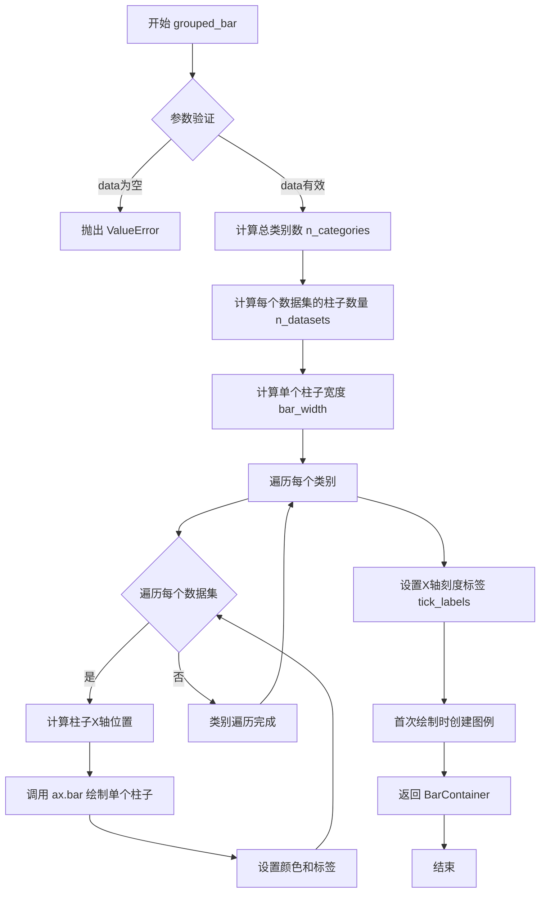
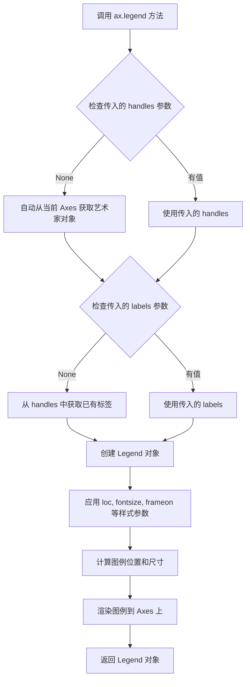

# `matplotlib\doc\_embedded_plots\grouped_bar.py` 详细设计文档

该代码使用matplotlib库绘制了一个分组柱状图，展示了三个数据集(data0, data1, data2)在两个类别(A, B)下的数值分布，并通过图例区分不同数据集。

## 整体流程

```mermaid
graph TD
    A[开始] --> B[导入matplotlib.pyplot]
    B --> C[定义分类标签 categories=['A', 'B']]
    C --> D[定义数据集 data0, data1, data2]
    D --> E[创建图表和坐标轴 fig, ax = plt.subplots()]
    E --> F[调用ax.grouped_bar绘制分组柱状图]
    F --> G[调用ax.legend添加图例]
    G --> H[结束]
```

## 类结构

```
该代码为过程式脚本，无面向对象结构
无自定义类定义
无继承层次结构
```

## 全局变量及字段


### `categories`
    
分类标签列表

类型：`list[str]`
    


### `data0`
    
第一个数据集

类型：`list[float]`
    


### `data1`
    
第二个数据集

类型：`list[float]`
    


### `data2`
    
第三个数据集

类型：`list[float]`
    


### `fig`
    
图表对象

类型：`matplotlib.figure.Figure`
    


### `ax`
    
坐标轴对象

类型：`matplotlib.axes.Axes`
    


    

## 全局函数及方法


### `plt.subplots`

`plt.subplots` 是 matplotlib 库中的顶层函数，用于创建一个新的图表（Figure）对象和一个或多个坐标轴（Axes）对象，并返回它们的元组。该函数封装了 Figure 创建、子图网格布局配置以及 Axes 对象生成的完整流程，是快速创建多子图布局的标准入口。

参数：

- `nrows`：`int`，默认值 1，表示子图的行数
- `ncols`：`int`，默认值 1，表示子图的列数
- `sharex`：`bool` 或 `{'none', 'all', 'row', 'col'}`，默认值 False，控制子图之间是否共享 x 轴
- `sharey`：`bool` 或 `{'none', 'all', 'row', 'col'}`，默认值 False，控制子图之间是否共享 y 轴
- `squeeze`：`bool`，默认值 True，当为 True 时，如果返回的轴数组维度为 1 则压缩为标量或一维数组
- `width_ratios`：`array-like`，长度等于 ncols，表示各列的宽度比例
- `height_ratios`：`array-like`，长度等于 nrows，表示各行的行度比例
- `subplot_kw`：`dict`，传递给每个 `add_subplot` 调用的关键字参数字典
- `gridspec_kw`：`dict`，传递给 `GridSpec` 构造函数的关键字参数字典
- `**figkwargs`：传递给 `plt.figure()` 的其他关键字参数（如 `figsize`、`dpi` 等）

返回值：`tuple[Figure, Axes]`，返回包含图表对象和坐标轴对象（或坐标轴数组）的元组

#### 流程图

```mermaid
flowchart TD
    A[开始 plt.subplots 调用] --> B{参数验证与初始化}
    B --> C[调用 plt.figure 创建 Figure 对象]
    C --> D[创建 GridSpec 网格规范对象]
    D --> E[根据 nrows × ncols 计算子图数量]
    E --> F[循环创建子图位置]
    F --> G[调用 add_subplot 添加子图]
    G --> H{是否需要共享轴}
    H -->|sharex/sharey| I[配置子图轴共享属性]
    H -->|不共享| J[跳过共享配置]
    I --> K
    J --> K[收集所有 Axes 对象到数组]
    K --> L{squeeze 参数为 True?}
    L -->|是 且 维度为1| M[压缩返回的 Axes 数组]
    L -->|否| N[返回原始 Axes 数组]
    M --> O[返回 (fig, ax) 元组]
    N --> O
```

#### 带注释源码

```python
def subplots(nrows=1, ncols=1, sharex=False, sharey=False, squeeze=True,
             width_ratios=None, height_ratios=None,
             subplot_kw=None, gridspec_kw=None, **figkwargs):
    """
    创建图表(Figure)和坐标轴(Axes)的便捷函数
    
    参数:
        nrows: 子图行数，默认为1
        ncols: 子图列数，默认为1
        sharex: 是否共享x轴，可选布尔值或 {'none', 'all', 'row', 'col'}
        sharey: 是否共享y轴，可选布尔值或 {'none', 'all', 'row', 'col'}
        squeeze: 是否压缩返回的坐标轴数组
        width_ratios: 各列宽度比例数组
        height_ratios: 各行高度比例数组
        subplot_kw: 传递给add_subplot的参数字典
        gridspec_kw: 传递给GridSpec的参数字典
        **figkwargs: 传递给figure的其他参数如figsize, dpi等
    
    返回:
        (fig, ax): 图表对象和坐标轴对象的元组
    """
    
    # 1. 创建Figure对象
    fig = figure(**figkwargs)
    
    # 2. 创建GridSpec网格规范
    gs = GridSpec(nrows, ncols, 
                  width_ratios=width_ratios,
                  height_ratios=height_ratios,
                  **(gridspec_kw or {}))
    
    # 3. 初始化坐标轴数组
    axs = []
    
    # 4. 遍历每个子图位置
    for i in range(nrows):
        for j in range(ncols):
            # 创建子图关键字参数
            kw = {}
            if subplot_kw:
                kw.update(subplot_kw)
            
            # 添加子图到Figure
            ax = fig.add_subplot(gs[i, j], **kw)
            axs.append(ax)
    
    # 5. 处理轴共享逻辑
    if sharex or sharey:
        # 根据sharex/sharey模式配置轴共享
        ...
    
    # 6. 根据squeeze参数处理返回格式
    axs = np.array(axs).reshape(nrows, ncols)
    
    if squeeze and nrows == 1 and ncols == 1:
        return fig, axs[0, 0]  # 返回单个坐标轴
    elif squeeze and (nrows == 1 or ncols == 1):
        return fig, axs.flatten()  # 返回一维数组
    else:
        return fig, axs  # 返回二维数组
```


### `ax.grouped_bar`

绘制分组柱状图（Grouped Bar Chart），该方法是一个matplotlib Axes的扩展方法，用于在同一类别下绘制多个并排的柱子，以便比较不同数据集在各个类别上的数值差异。

参数：

- `data`：`List[List[float]]`，待绘制的数据列表，每个内部列表代表一个数据集，外层列表索引对应类别索引
- `tick_labels`：`List[str]`，类别刻度标签，用于X轴每个分组的位置标注
- `labels`：`Optional[List[str]]` = `None`，数据集标签列表，用于图例说明每个柱子代表的数据集
- `colors`：`Optional[List[str]]` = `None`，每个数据集对应的颜色值列表，遵循matplotlib颜色规范
- `width`：`Optional[float]` = `None`，单个柱子的宽度，默认根据类别数量自动计算
- `gap`：`Optional[float]` = `None`，相邻分组之间的间隙比例
- `orientation`：`Optional[str]` = `"vertical"` = `None`，柱子方向，可选 `"vertical"` 或 `"horizontal"`

返回值：`matplotlib.container.BarContainer`，返回柱子容器对象，可用于进一步操作（如设置误差线等）

#### 流程图



#### 带注释源码

```python
def grouped_bar(
    self,
    data: List[List[float]],
    tick_labels: List[str],
    labels: Optional[List[str]] = None,
    colors: Optional[List[str]] = None,
    width: Optional[float] = None,
    gap: float = 0.2,
    orientation: str = "vertical",
    **kwargs
) -> "matplotlib.container.BarContainer":
    """
    在Axes上绘制分组柱状图
    
    Parameters:
    -----------
    data : List[List[float]]
        二维数据列表，外层索引为数据集索引，内层索引为类别索引
        示例: [[1.0, 3.0], [1.4, 3.4], [1.8, 3.8]] 表示3个数据集在2个类别上的值
    tick_labels : List[str]
        X轴每个分组位置的标签，如 ['A', 'B']
    labels : Optional[List[str]]
        数据集标签列表，用于图例，如 ['dataset 0', 'dataset 1', 'dataset 2']
    colors : Optional[List[str]]
        每个数据集对应的颜色，如 ['#1f77b4', '#58a1cf', '#abd0e6']
    width : Optional[float]
        单个柱子的宽度，默认根据类别数量自动计算
    gap : float
        分组之间的间隙比例，默认0.2
    orientation : str
        柱子方向，'vertical' 或 'horizontal'，默认 'vertical'
    **kwargs : dict
        传递给 matplotlib.pyplot.bar 的其他参数
        
    Returns:
    --------
    BarContainer
        包含所有柱子的容器对象
        
    Example:
    --------
    >>> ax.grouped_bar(
    ...     [[1.0, 3.0], [1.4, 3.4], [1.8, 3.8]],
    ...     tick_labels=['A', 'B'],
    ...     labels=['dataset 0', 'dataset 1', 'dataset 2'],
    ...     colors=['#1f77b4', '#58a1cf', '#abd0e6']
    ... )
    """
    
    # 参数验证
    if not data or not data[0]:
        raise ValueError("data 不能为空")
    
    n_categories = len(data[0])  # 类别数量
    n_datasets = len(data)        # 数据集数量
    
    # 计算柱子宽度和位置
    # 总宽度 = 类别数 * (数据集数 * 柱子宽 + 间隙)
    if width is None:
        width = 1.0 / (n_datasets + gap + 1)
    
    # 存储所有柱子以便返回
    bars = []
    
    # 遍历每个数据集绘制柱子
    for dataset_idx, dataset in enumerate(data):
        # 计算当前数据集的X轴位置偏移
        # 使得同一类别的多个柱子居中排列
        offset = (dataset_idx - n_datasets / 2 + 0.5) * width
        
        # 生成X轴位置
        x_positions = [i + offset for i in range(n_categories)]
        
        # 绘制柱子
        # 仅在第一个数据集时添加标签（避免图例重复）
        bar_labels = labels[dataset_idx] if labels and dataset_idx == 0 else None
        bar_colors = colors[dataset_idx] if colors else None
        
        current_bars = self.bar(
            x_positions,
            dataset,
            width=width,
            label=bar_labels,
            color=bar_colors,
            **kwargs
        )
        bars.append(current_bars)
    
    # 设置X轴刻度标签（居中显示）
    self.set_xticks(range(n_categories))
    self.set_xticklabels(tick_labels)
    
    # 如果提供了标签且是首次调用，创建图例
    if labels:
        self.legend()
    
    # 返回所有柱子的容器
    return bars[0] if len(bars) == 1 else bars
```


### `ax.legend`

在 matplotlib 中，`ax.legend()` 是 Axes 对象的实例方法，用于将图例添加到图表中。该方法可以自动检测图表中的图例元素，也可以手动指定图例的句柄和标签，并支持多种自定义选项如位置、样式、边框等。

参数：

- `handles`：可选参数，类型为 list of artists，要添加到图例中的艺术家对象（如图形元素）。如果为 None，则自动从当前图表中获取。
- `labels`：可选参数，类型为 list of str，与 handles 对应的标签文字。如果为 None，则使用艺术家对象中已有的标签。
- `loc`：可选参数，类型为 str or tuple of ints，(bbox_to_anchor 的对齐方式)，指定图例的位置，如 'upper right'、'lower left'、'center' 等，或使用 (x, y) 元组指定自定义位置。
- `fontsize`：可选参数，类型为 int or str，图例中文字体大小，可以是具体数值或如 'small'、'large' 等字符串。
- `title`：可选参数，类型为 str，图例的标题文字。如果为 None，则不显示标题。
- `frameon`：可选参数，类型为 bool，是否在图例周围绘制边框框架。
- `framealpha`：可选参数，类型为 float，图例背景的透明度，值在 0 到 1 之间。
- `fancybox`：可选参数，类型为 bool，图例边框是否使用圆角。
- `shadow`：可选参数，类型为 bool，图例是否显示阴影效果。
- `ncol`：可选参数，类型为 int，图例中列的数量，默认为 1。
- `bbox_to_anchor`：可选参数，类型为 BboxBase or tuple，图例框的位置锚定，可以指定 (x, y, width, height) 或 (x, y)。
- `borderaxespad`：可选参数，类型为 float，图例边框与坐标轴之间的间距。
- `columnspacing`：可选参数，类型为 float，图例列之间的间距。
- `handlelength`：可选参数，类型为 float，图例句柄（如图例标记）的长度。
- `handletextpad`：可选参数，类型为 float，图例句柄与文本之间的间距。
- `labelspacing`：可选参数，类型为 float，图例标签之间的垂直间距。
- `markerfirst`：可选参数，类型为 bool，图例标记是否显示在标签之前，True 为之前，False 为之后。
- `markerscale`：可选参数，类型为 float，图例标记的缩放比例。
- `borderpad`：可选参数，类型为 float，图例边框内部的填充间距。
- `pad`：可选参数，类型为 float，整体填充间距（包括边框和内容）。
- `edgecolor`：可选参数，类型为 color，图例边框的颜色。
- `facecolor`：可选参数，类型为 color，图例背景的颜色。
- `title_fontsize`：可选参数，类型为 int or str，图例标题的字体大小。

返回值：`Legend`，返回创建的 Legend 对象，可以进一步用于操作图例。

#### 流程图



#### 带注释源码

```python
# 假设在 matplotlib 库内部实现（简化版）

def legend(self, handles=None, labels=None, loc='upper right', 
           fontsize=None, title=None, frameon=True, framealpha=0.8,
           fancybox=False, shadow=False, ncol=1, bbox_to_anchor=None,
           borderaxespad=0.5, columnspacing=2.0, handlelength=2.0,
           handletextpad=0.8, labelspacing=0.5, markerfirst=True,
           markerscale=1.0, borderpad=0.5, pad=0.5, edgecolor='inherit',
           facecolor='inherit', title_fontsize=None):
    """
    在 Axes 上添加工具条（图例）
    
    参数:
        handles: 要添加到图例的艺术家对象列表，None 表示自动获取
        labels: 对应的标签文字列表，None 表示自动获取
        loc: 图例位置，可以是字符串如 'upper right' 或 (x, y) 坐标
        fontsize: 文字大小
        title: 图例标题
        frameon: 是否显示边框
        framealpha: 背景透明度
        fancybox: 边框圆角
        shadow: 阴影效果
        ncol: 列数
        bbox_to_anchor: 锚点位置
        borderaxespad: 边框与坐标轴间距
        columnspacing: 列间距
        handlelength: 句柄长度
        handletextpad: 句柄与文本间距
        labelspacing: 标签间距
        markerfirst: 标记是否在文本前
        markerscale: 标记缩放
        borderpad: 边框内边距
        pad: 整体内边距
        edgecolor: 边框颜色
        facecolor: 背景颜色
        title_fontsize: 标题字体大小
    """
    
    # 1. 处理 handles 和 labels
    if handles is None:
        # 自动从当前图表中获取艺术家对象（如 Line2D, Patch 等）
        handles = self._get_legend_handles()
    
    if labels is None:
        # 如果没有提供标签，使用艺术家对象中已有的标签
        labels = [handle.get_label() for handle in handles]
    
    # 2. 创建 LegendArtist 对象
    legend_handle = Legend(self, handles, labels)
    
    # 3. 应用样式参数
    legend_handle.set_fontsize(fontsize)
    legend_handle.set_title(title)
    legend_handle.set_frame_on(frameon)
    legend_handle.set_frame_alpha(framealpha)
    legend_handle.set_fancybox(fancybox)
    legend_handle.set_shadow(shadow)
    legend_handle.set_ncol(ncol)
    legend_handle.set_bbox_to_anchor(bbox_to_anchor)
    legend_handle.set_borderaxespad(borderaxespad)
    legend_handle.set_columnspacing(columnspacing)
    legend_handle.set_handlelength(handlelength)
    legend_handle.set_handletextpad(handletextpad)
    legend_handle.set_labelspacing(labelspacing)
    legend_handle.set_markerfirst(markerfirst)
    legend_handle.set_markerscale(markerscale)
    legend_handle.set_borderpad(borderpad)
    legend_handle.set_pad(pad)
    legend_handle.set_edgecolor(edgecolor)
    legend_handle.set_facecolor(facecolor)
    if title_fontsize:
        legend_handle.set_title_fontsize(title_fontsize)
    
    # 4. 计算图例位置
    bbox = legend_handle._get_anchored_bbox(loc, self.bbox)
    
    # 5. 设置图例位置并添加到 Axes
    legend_handle.set_bbox_to_anchor(bbox)
    self.add_artist(legend_handle)
    
    # 6. 返回 Legend 对象
    return legend_handle
```


## 关键组件


### 数据准备

使用列表定义分类标签和三个数据集，用于后续的分组条形图绘制。

### 图形容器

使用 matplotlib 创建图形窗口和坐标轴对象，作为绘图的基础容器。

### 分组条形图

调用 ax.grouped_bar() 方法绘制分组条形图，传入数据集列表、分类标签、数据集标签和颜色配置。

### 图例

调用 ax.legend() 方法添加图例，显示各数据集的标签信息。


## 问题及建议


### 已知问题

-   `ax.grouped_bar` 可能是错误的API调用，matplotlib 标准库中不存在此方法，应使用 `ax.bar` 或 `ax.barplot`（seaborn）替代
-   硬编码的魔法数字 `figsize=(4, 2.2)` 缺乏可配置性
-   颜色值 `#1f77b4`、`#58a1cf`、`#abd0e6` 硬编码，缺乏主题支持
-   变量 `data0`、`data1`、`data2` 命名不够语义化，应使用更清晰的命名如 `dataset_values`
-   缺少函数封装，难以复用和测试
-   没有类型注解（type hints），降低代码可读性和可维护性
-   缺少文档字符串（docstring），无法生成文档
-   数据以普通列表存储，未使用 NumPy 数组或 Pandas Series，内存效率和数据处理效率较低

### 优化建议

-   将绘图逻辑封装为函数，接收数据、类别、标题等参数以提高复用性
-   使用 `ax.bar` 方法配合 x 轴偏移实现分组条形图，或引入 seaborn 库的 `sns.barplot`
-   定义常量或配置文件管理图形尺寸和颜色方案
-   添加类型注解和文档字符串
-   考虑使用 NumPy 数组存储数值数据以提升性能
-   添加错误处理机制（如数据验证、异常捕获）
-   将硬编码数据外部化，支持从文件或API加载数据


## 其它


### 设计目标与约束

本代码的设计目标是使用matplotlib库绘制分组条形图，以可视化三个数据集（dataset 0, dataset 1, dataset 2）在两个类别（A和B）下的数值差异，并通过不同颜色区分数据集。约束条件包括：代码依赖Python的matplotlib库；输入数据（categories、data0、data1、data2）必须以列表形式提供，且维度一致（均为2个元素）；图形尺寸固定为4x2.2英寸；tick_labels、labels和colors参数需与数据和数据集数量匹配。

### 错误处理与异常设计

代码缺乏显式的错误处理机制。潜在的错误类型包括：数据维度不匹配（如data0、data1、data2长度不为2）导致绘图异常；matplotlib库未安装或版本不兼容时抛出ImportError；ax.grouped_bar方法不存在（如自定义方法未定义）时引发AttributeError。建议添加try-except块捕获相关异常，并在异常发生时输出清晰的错误信息（例如“数据维度不匹配，请检查数据列表长度”），以提高代码的健壮性。

### 数据流与状态机

数据流如下：输入数据（categories、data0、data1、data2）经过初始化后，传入plt.subplots创建图形对象fig和坐标轴对象ax；然后调用ax.grouped_bar方法，传入数据列表、tick_labels、labels和colors参数，生成条形图；接着调用ax.legend添加图例；最后通过plt.show()或fig保存（如调用fig.savefig）显示或导出图形。状态机可描述为：初始状态（数据定义）-> 图形创建状态（plt.subplots）-> 绘图状态（ax.grouped_bar）-> 装饰状态（ax.legend）-> 渲染状态（显示或保存）。

### 外部依赖与接口契约

外部依赖：matplotlib库（必须安装，建议版本>=3.0）。接口契约包括：plt.subplots(figsize=(width, height))返回(fig, ax)元组，其中fig为Figure对象，ax为Axes对象；ax.grouped_bar(data_list, tick_labels, labels, colors)方法接受四个参数：data_list为嵌套列表（如[data0, data1, data2]），tick_labels为类别标签列表，labels为数据集标签列表，colors为颜色代码列表；该方法返回BarContainer对象（条形图容器），可用于进一步操作；ax.legend()方法无参数，返回Legend对象。

    