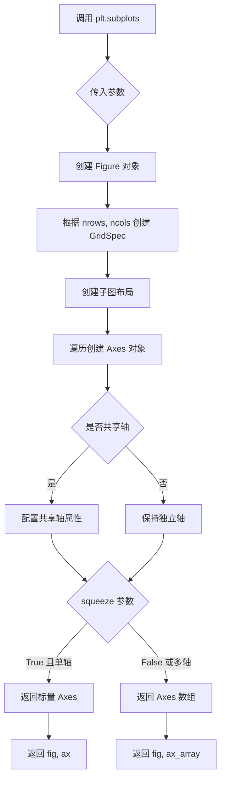
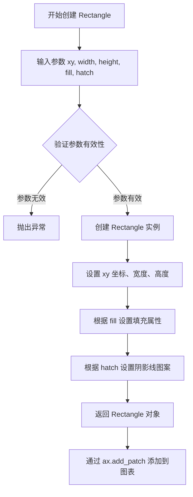
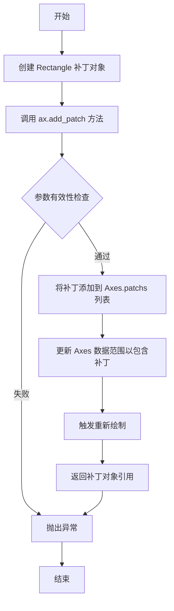
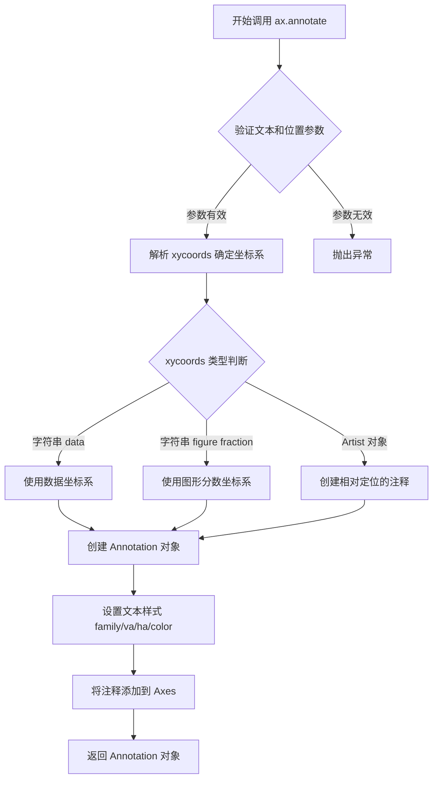
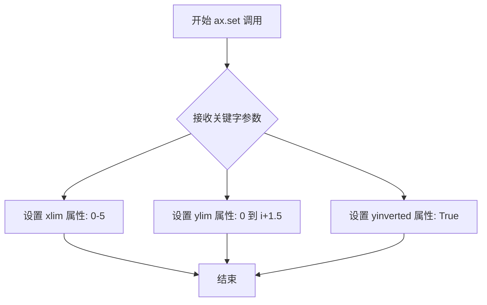
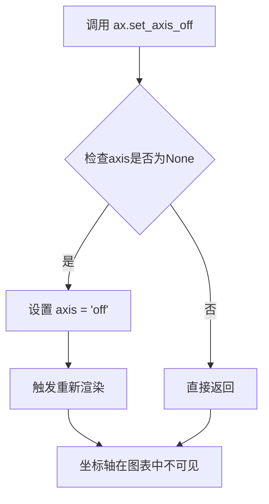

# `matplotlib\doc\_embedded_plots\hatch_classes.py` 详细设计文档

该代码使用matplotlib库创建一个填充图案(hatching patterns)的可视化演示，通过循环遍历预定义的图案映射字典，为每种图案创建带有对应填充样式的矩形，并标注图案符号及其对应的Matplotlib Hatch类名。

## 整体流程

```mermaid
graph TD
    A[开始] --> B[导入matplotlib.pyplot和Rectangle]
    B --> C[创建Figure和Axes对象 fig, ax = plt.subplots()]
    C --> D[定义pattern_to_class映射字典]
    D --> E[循环遍历pattern_to_class.items()]
    E --> F[创建Rectangle: 设置位置、尺寸、fill=False、hatch属性]
    F --> G[ax.add_patch(r)将矩形添加到图表]
    G --> H[ax.annotate添加图案符号文本标签]
    H --> I[ax.annotate添加类名文本标签]
    I --> J{检查是否还有未处理的图案}
    J -- 是 --> E
    J -- 否 --> K[设置xlim和ylim]
    K --> L[ax.set_axis_off隐藏坐标轴]
    L --> M[结束]
```

## 类结构

```
该脚本为扁平化结构，无类定义，所有代码在模块级别顺序执行
```

## 全局变量及字段


### `fig`
    
图形对象，表示整个matplotlib图形窗口

类型：`matplotlib.figure.Figure`
    


### `ax`
    
坐标轴对象，用于添加图形元素和设置图形属性

类型：`matplotlib.axes.Axes`
    


### `pattern_to_class`
    
映射填充图案符号到Hatch类名的字典

类型：`dict`
    


### `i`
    
循环计数器，表示当前处理的图案索引

类型：`int`
    


### `hatch`
    
图案符号字符，从字典键中获取

类型：`str`
    


### `classes`
    
对应的Hatch类名，从字典值中获取

类型：`str`
    


### `r`
    
矩形补丁对象，用于显示填充图案

类型：`matplotlib.patches.Rectangle`
    


### `h`
    
第一个注释文本对象，用于显示图案符号

类型：`matplotlib.text.Annotation`
    


    

## 全局函数及方法


### `plt.subplots()`

`plt.subplots()` 是 matplotlib 库中的核心函数，用于创建一个新的 Figure（图形窗口）对象以及一个或多个 Axes（坐标轴）对象，返回值可用于后续的绘图操作。

参数：

- `nrows`：`int`，默认值 1，表示子图网格的行数
- `ncols`：`int`，默认值 1，表示子图网格的列数
- `sharex`：`bool` 或 `str`，默认值 False，是否共享 x 轴刻度
- `sharey`：`bool` 或 `str`，默认值 False，是否共享 y 轴刻度
- `squeeze`：`bool`，默认值 True，当为 True 时，如果返回的轴数组维度为 1，则降维处理
- `subplot_kw`：`dict`，默认值 None，传递给每个 `add_subplot` 的关键字参数
- `gridspec_kw`：`dict`，默认值 None，传递给 `GridSpec` 的关键字参数
- `figsize`：`tuple(float, float)`，默认值 None，图形宽度和高度（英寸）
- `dpi`：`int`，默认值 None，图形分辨率（每英寸点数）

返回值：`tuple(Figure, Axes or ndarray of Axes)`，返回创建的 Figure 对象和 Axes 对象（单个 Axes 对象或 Axes 对象数组）

#### 流程图



#### 带注释源码

```python
# 导入 matplotlib.pyplot 模块，plt 是常用别名
import matplotlib.pyplot as plt

# 调用 subplots() 函数创建图形和坐标轴
# 参数说明：
#   - nrows=1, ncols=1：创建 1 行 1 列的子图（即单个坐标轴）
#   - figsize=(width, height)：可选，设置图形大小（英寸）
#   - dpi=100：可选，设置图形分辨率
# 返回值：
#   - fig：Figure 对象，代表整个图形窗口
#   - ax：Axes 对象，代表坐标轴区域
fig, ax = plt.subplots(nrows=1, ncols=1, figsize=None, dpi=None)

# 后续代码使用返回的 ax 对象进行绘图操作
# 例如：
#   ax.plot([1, 2, 3], [1, 2, 3])
#   ax.set_title('示例图')
#   plt.show()

# pattern_to_class 字典：定义填充图案与类名的映射关系
# 用于可视化不同填充图案（hatch patterns）的效果
pattern_to_class = {
    '/': 'NorthEastHatch',           # 斜向右上 hatching
    '\\': 'SouthEastHatch',          # 斜向右下 hatching
    '|': 'VerticalHatch',            # 垂直线 hatching
    '-': 'HorizontalHatch',          # 水平线 hatching
    '+': 'VerticalHatch + HorizontalHatch',  # 交叉线
    'x': 'NorthEastHatch + SouthEastHatch',  # 交叉斜线
    'o': 'SmallCircles',             # 小圆圈
    'O': 'LargeCircles',             # 大圆圈
    '.': 'SmallFilledCircles',       # 小实心圆
    '*': 'Stars',                    # 星形
}

# 遍历字典，为每种图案创建一个 Rectangle（矩形）对象
for i, (hatch, classes) in enumerate(pattern_to_class.items()):
    # Rectangle 参数说明：
    #   (0.1, i+0.5)：左下角坐标 (x, y)
    #   0.8：宽度
    #   0.8：高度
    #   fill=False：不填充矩形内部
    #   hatch=hatch*2：填充图案（乘 2 是为了增加图案密度）
    r = Rectangle((0.1, i+0.5), 0.8, 0.8, fill=False, hatch=hatch*2)
    
    # 将矩形添加到坐标轴
    ax.add_patch(r)
    
    # 添加第一个注释：显示图案字符
    h = ax.annotate(f"'{hatch}'", xy=(1.2, .5), xycoords=r,
                    family='monospace', va='center', ha='left')
    
    # 添加第二个注释：显示对应的类名
    ax.annotate(pattern_to_class[hatch], xy=(1.5, .5), xycoords=h,
                family='monospace', va='center', ha='left', color='tab:blue')

# 设置坐标轴属性
ax.set(xlim=(0, 5),          # x 轴范围：0 到 5
       ylim=(0, i+1.5),      # y 轴范围：0 到 (最后一个索引 + 1.5)
       yinverted=True)       # y 轴反向（值越大越靠下）

# 关闭坐标轴显示（隐藏坐标轴线和刻度）
ax.set_axis_off()
```


### `Rectangle((x, y), width, height, fill, hatch)`

该函数用于创建 matplotlib 中的矩形补丁（Patch）对象，可通过设置填充（fill）和阴影线（hatch）属性来定制矩形的外观，常用于绘制带有图案填充的矩形区域。

参数：

- `xy`：`tuple` 或 `array-like`，矩形左下角的坐标 (x, y)
- `width`：`float`，矩形的宽度
- `height`：`float`，矩形的高度
- `fill`：`bool`，是否填充矩形区域，默认为 `True`
- `hatch`：`str`，阴影线填充图案，默认为 `None`

返回值：`matplotlib.patches.Rectangle`，返回创建的矩形补丁对象

#### 流程图



#### 带注释源码

```python
# 创建 Rectangle 补丁对象
# 参数说明：
#   xy: 矩形左下角坐标 (0.1, i+0.5)，其中 0.1 是 x 坐标，i+0.5 是 y 坐标
#   width: 矩形宽度 0.8
#   height: 矩形高度 0.8
#   fill: 设置为 False，不填充矩形内部（仅显示边框）
#   hatch: 阴影线图案，使用 hatch*2 重复两次以增加图案密度
r = Rectangle((0.1, i+0.5), 0.8, 0.8, fill=False, hatch=hatch*2)

# 将创建的 Rectangle 补丁添加到 axes 对象中
# add_patch 方法会将补丁渲染到图表上
ax.add_patch(r)

# 可选：使用 annotate 方法为矩形添加标注
# xy: 标注位置相对于 r 的坐标系
# family='monospace': 使用等宽字体
h = ax.annotate(f"'{hatch}'", xy=(1.2, .5), xycoords=r,
                family='monospace', va='center', ha='left')
```

#### 关键组件信息

| 组件名称 | 描述 |
|---------|------|
| `matplotlib.patches.Rectangle` | matplotlib 中的矩形补丁类，继承自 Patch 基类 |
| `ax.add_patch()` | 将补丁对象添加到 Axes 的方法 |
| `pattern_to_class` | 映射表，将 hatch 字符映射到对应的类名描述 |
| `hatch*2` | 通过重复字符增强阴影线图案的视觉效果 |

#### 潜在的技术债务或优化空间

1. **硬编码坐标值**：矩形的位置和尺寸使用硬编码值 (0.1, 0.8, 0.8)，缺乏灵活性，应考虑参数化或动态计算
2. **魔法数字**：代码中存在多处魔法数字（如 0.1, 0.8, 1.2, 1.5 等），应提取为常量或配置参数
3. **图案映射表静态定义**：`pattern_to_class` 字典是静态定义的，未来扩展需要修改代码
4. **缺少错误处理**：未对 hatch 参数的有效性进行验证，可能导致意外行为
5. **注释缺失**：核心 Rectangle 调用缺少详细的参数说明注释

#### 其它项目

**设计目标与约束：**

- 目标：演示 matplotlib 中不同 hatch 图案的视觉效果
- 约束：使用固定的图表布局和坐标范围

**错误处理与异常设计：**

- 当传入无效的 hatch 值时，matplotlib 会忽略该值但不会抛出异常
- 建议添加参数验证以提高代码健壮性

**数据流与状态机：**

- 数据流：`pattern_to_class` 字典 → 遍历生成 Rectangle → 添加到 Axes → 渲染输出
- 状态：图表初始化 → 循环创建补丁 → 添加标注 → 设置坐标轴 → 渲染完成

**外部依赖与接口契约：**

- 依赖：`matplotlib.pyplot` 和 `matplotlib.patches`
- 接口契约：Rectangle 返回 Patch 对象，需通过 `ax.add_patch()` 才能在图表中显示


### `Axes.add_patch`

将 `Patch` 对象（此处为 `Rectangle`）添加到 Axes 坐标轴中，并返回添加的补丁对象以便进一步操作。

参数：

- `p`：`matplotlib.patches.Patch`，要添加的补丁对象（如此处的 `Rectangle` 实例）

返回值：`matplotlib.patches.Patch`，返回添加的补丁对象的引用，允许链式调用或后续修改。

#### 流程图



#### 带注释源码

```python
# 代码上下文：ax 是通过 plt.subplots() 创建的 Axes 对象
# r 是通过 Rectangle 构造函数创建的补丁对象
r = Rectangle((0.1, i+0.5), 0.8, 0.8, fill=False, hatch=hatch*2)

# 调用 add_patch 方法将 Rectangle 补丁添加到 Axes
# 参数说明：
#   p: Patch 对象（此处为 Rectangle 实例）
#   - (0.1, i+0.5): 矩形左下角坐标 (x, y)
#   - 0.8: 矩形宽度
#   - 0.8: 矩形高度
#   - fill=False: 不填充矩形内部
#   - hatch=hatch*2: 填充图案（乘以2以获得更密集的图案）
ax.add_patch(r)

# add_patch 方法内部执行流程：
# 1. 验证补丁对象是否为 Patch 的实例
# 2. 将补丁追加到 self.patches 列表
# 3. 调用 _request_autoscale_view 更新视图范围
# 4. 返回传入的补丁对象（支持链式调用）
```


### `Axes.annotate()`

`ax.annotate()` 是 Matplotlib 中 `Axes` 类的一个方法，用于在图表上添加文本注释。该方法可以在指定位置（使用数据坐标、轴坐标或相对于其他Artist对象的坐标）插入文本，并支持丰富的样式定制如字体、对齐方式和颜色。

参数：

- `text`：`str`，要显示的注释文本内容
- `xy`：`tuple`，注释指向的目标坐标点 (x, y)
- `xycoords`：`str` 或 `Artist`，坐标系统，常见值包括 `'data'`（数据坐标）、`'figure fraction'`（图形分数坐标）、`'axes fraction'`（轴分数坐标），也可以是具体的 Artist 对象（如 Rectangle 或 Annotation）使注释相对于该对象定位
- `family`：`str`，字体家族，如 `'monospace'`、`'sans-serif'` 等
- `va`：`str`，垂直对齐方式，可选 `'center'`、`'top'`、`'bottom'`、`'baseline'`
- `ha`：`str`，水平对齐方式，可选 `'left'`、`'right'`、`'center'`
- `color`：`str`，文本颜色，可使用颜色名称如 `'tab:blue'` 或十六进制颜色码

返回值：`matplotlib.text.Annotation`，返回创建的注释对象，可用于后续修改或获取信息

#### 流程图



#### 带注释源码

```python
import matplotlib.pyplot as plt
from matplotlib.patches import Rectangle

# 创建画布和坐标轴
fig, ax = plt.subplots()

# 定义填充图案到类名的映射字典
pattern_to_class = {
    '/': 'NorthEastHatch',
    '\\': 'SouthEastHatch',
    '|': 'VerticalHatch',
    '-': 'HorizontalHatch',
    '+': 'VerticalHatch + HorizontalHatch',
    'x': 'NorthEastHatch + SouthEastHatch',
    'o': 'SmallCircles',
    'O': 'LargeCircles',
    '.': 'SmallFilledCircles',
    '*': 'Stars',
}

# 遍历每种填充图案，创建矩形并添加注释
for i, (hatch, classes) in enumerate(pattern_to_class.items()):
    # 创建带填充图案的矩形 (左下角x, 左下角y, 宽, 高)
    r = Rectangle((0.1, i+0.5), 0.8, 0.8, fill=False, hatch=hatch*2)
    ax.add_patch(r)
    
    # 第一次调用 annotate: 添加图案符号注释
    # xycoords=r 表示注释位置相对于矩形 r 的坐标
    h = ax.annotate(f"'{hatch}'",          # 文本内容：图案符号
                    xy=(1.2, .5),          # 目标点坐标 (相对于矩形)
                    xycoords=r,            # 坐标系统：相对于 Rectangle 对象
                    family='monospace',    # 使用等宽字体
                    va='center',           # 垂直居中对齐
                    ha='left')             # 左对齐
    
    # 第二次调用 annotate: 添加图案类名注释
    # xycoords=h 表示注释位置相对于上一个注释对象 h
    ax.annotate(pattern_to_class[hatch],   # 文本内容：类名
                xy=(1.5, .5),               # 目标点坐标 (相对于前一个注释)
                xycoords=h,                # 坐标系统：相对于 Annotation 对象 h
                family='monospace',        # 使用等宽字体
                va='center',               # 垂直居中对齐
                ha='left',                 # 左对齐
                color='tab:blue')          # 文本颜色：蓝色

# 设置坐标轴范围和属性
ax.set(xlim=(0, 5), ylim=(0, i+1.5), yinverted=True)
ax.set_axis_off()  # 隐藏坐标轴

plt.show()
```


### `ax.set`

该方法用于在 matplotlib 中一次性设置 Axes 对象的多个属性，如坐标轴范围、是否反转等操作。

参数：

-  `**kwargs`：关键字参数，用于设置 Axes 的多种属性
  - `xlim`：元组类型，设置 x 轴的显示范围，示例中为 (0, 5)
  - `ylim`：元组类型，设置 y 轴的显示范围，示例中为 (0, i+1.5)
  - `yinverted`：布尔类型，控制 y 轴是否反转，示例中为 True

返回值：`Axes` 对象，返回该 Axes 对象本身，支持链式调用

#### 流程图



#### 带注释源码

```python
# 调用 ax.set() 方法设置坐标轴属性
# 参数说明：
#   xlim=(0, 5)     -> 设置 x 轴范围从 0 到 5
#   ylim=(0, i+1.5) -> 设置 y 轴范围从 0 到 i+1.5（i 为循环变量）
#   yinverted=True  -> 将 y 轴反转，使其数值向下增加（而非默认的向上增加）
ax.set(xlim=(0, 5), ylim=(0, i+1.5), yinverted=True)
```


### `Axes.set_axis_off`

隐藏坐标轴的显示。该方法关闭坐标轴的可见性，使其在绘图中不显示，但仍然可以正常进行绘图操作。

参数：
- 该方法没有参数

返回值：`None`，无返回值（该方法直接修改Axes对象的内部状态）

#### 流程图



#### 带注释源码

```python
# 源代码位于 matplotlib/axes/_base.py
# 以下是 set_axis_off 方法的实现

def set_axis_off(self):
    """
    Hide the x and y axis, even if the frame is on.

    This is a convenience method to turn off the visibility of the
    axis, while leaving :attr:`frame_on` untouched.
    """
    # 获取当前的axis状态
    axis = self._axaxis

    # 如果axis存在，则将其状态设置为'off'
    if axis is not None:
        axis.set_visible(False)
    
    # 注意：该方法不修改 frame_on 属性
    # 坐标轴虽然不可见，但仍然可以进行绘图操作
    # 坐标轴的刻度、标签等都不会显示
```

#### 使用示例源码

```python
import matplotlib.pyplot as plt
from matplotlib.patches import Rectangle

# 创建图表和坐标轴
fig, ax = plt.subplots()

# 定义填充图案到类名的映射
pattern_to_class = {
    '/': 'NorthEastHatch',
    '\\': 'SouthEastHatch',
    '|': 'VerticalHatch',
    '-': 'HorizontalHatch',
    '+': 'VerticalHatch + HorizontalHatch',
    'x': 'NorthEastHatch + SouthEastHatch',
    'o': 'SmallCircles',
    'O': 'LargeCircles',
    '.': 'SmallFilledCircles',
    '*': 'Stars',
}

# 遍历每种填充图案并绘制矩形
for i, (hatch, classes) in enumerate(pattern_to_class.items()):
    # 创建带填充图案的矩形
    r = Rectangle((0.1, i+0.5), 0.8, 0.8, fill=False, hatch=hatch*2)
    ax.add_patch(r)
    # 添加图案字符注释
    h = ax.annotate(f"'{hatch}'", xy=(1.2, .5), xycoords=r,
                    family='monospace', va='center', ha='left')
    # 添加图案类名注释
    ax.annotate(pattern_to_class[hatch], xy=(1.5, .5), xycoords=h,
                family='monospace', va='center', ha='left', color='tab:blue')

# 设置坐标轴范围
ax.set(xlim=(0, 5), ylim=(0, i+1.5), yinverted=True)

# 隐藏坐标轴显示 - 核心功能
ax.set_axis_off()

# 显示图表
plt.show()
```

#### 关联方法对比

| 方法 | 功能描述 |
|------|----------|
| `set_axis_off()` | 完全隐藏坐标轴（x轴和y轴） |
| `set_axis_on()` | 显示坐标轴 |
| `axis('off')` | 与set_axis_off()等价的高级接口 |
| `set_visible(False)` | 通用方法，可隐藏任何Artist对象 |


## 关键组件


### 图案映射字典 (pattern_to_class)

存储matplotlib填充图案字符与对应类名的映射关系，用于将简短的图案符号映射到完整的类名称。

### 矩形创建与渲染 (Rectangle)

使用matplotlib.patches.Rectangle创建带填充图案的矩形，通过hatch参数设置重复图案以增强视觉效果。

### 注释标注系统 (ax.annotate)

在图形中添加两段注释：图案字符和对应的类名，使用family='monospace'保证等宽字体显示，xycoords参数实现相对于目标对象的定位。

### 坐标轴配置 (ax.set)

设置图形x轴范围(0-5)、y轴范围(0-循环次数+1.5)、反转y轴、关闭坐标轴显示，实现无坐标系的纯图案展示效果。


## 问题及建议


### 已知问题

- **未使用的变量**：导入了 `matplotlib.pyplot as plt` 并创建了 `fig` 变量，但从未使用过该变量，造成资源浪费。
- **魔法数字**：代码中存在多个硬编码的数值（如 `0.1`, `0.8`, `1.2`, `1.5`, `5` 等），缺乏常量定义，可读性和可维护性差。
- **废弃的 API**：使用了 `yinverted=True` 参数，这是已废弃的写法，现代 matplotlib 应使用 `y_inverted=True` 或 `ax.invert_yaxis()`。
- **脆弱的坐标转换**：使用 `xycoords=h` 引用上一个 annotation 对象，这种链式坐标引用方式较为脆弱，容易因布局调整而失效。
- **字典映射可能不准确**：`pattern_to_class` 中的类名映射（如 `'NorthEastHatch'`, `'SouthEastHatch'` 等）是硬编码的字符串，可能与实际 matplotlib 内部的类实现不完全对应。
- **无类型注解**：代码中没有任何类型提示（type hints），降低了代码的可读性和 IDE 支持。
- **无错误处理**：缺乏对边界情况和异常的处理，如字典查询失败等场景。
- **hatch*2 的语义不明确**：使用 `hatch*2` 来增强填充效果，但没有注释说明为何要乘以 2，这个值的选取缺乏依据。
- **布局硬编码**：坐标和间距是硬编码的，在不同显示环境下可能导致显示效果不一致。

### 优化建议

- **提取常量和配置**：将魔法数字提取为具名常量，如 `RECT_WIDTH = 0.8`, `SPACING = 1.0`, `HATCH_MULTIPLIER = 2` 等。
- **封装为函数**：将代码封装为可复用的函数，接收参数如 `pattern_dict`、`figsize` 等，提高灵活性。
- **更新 API 用法**：将 `yinverted=True` 替换为 `ax.invert_yaxis()` 或 `y_inverted=True`。
- **简化坐标系统**：避免链式 `xycoords` 引用，考虑使用 `ax.transData` 或 `ax.transAxes` 等更稳定的坐标转换方式。
- **添加类型注解**：为函数参数和返回值添加类型提示。
- **移除未使用变量**：删除未使用的 `fig` 变量，或将其用于返回以便调用者进一步操作。
- **添加文档字符串**：为代码块添加 docstring 说明其功能和参数。
- **动态验证映射**：考虑通过 matplotlib 源码或反射机制动态获取实际的 hatch 类名，而非硬编码映射。
- **添加错误处理**：对关键操作添加异常捕获，如 `Rectangle` 创建失败的情况。


## 其它


### 设计目标与约束

本代码旨在可视化matplotlib支持的填充图案（hatch patterns），展示不同符号与对应图案类名之间的映射关系。设计目标包括：1）提供一个直观的图案参考表；2）演示matplotlib的Rectangle和annotate用法；3）展示不同hatch符号的视觉效果。约束条件包括：依赖matplotlib库；输出为静态图像；仅支持代码中定义的有限图案集合。

### 错误处理与异常设计

代码未包含显式的错误处理机制。潜在异常场景包括：1）pattern_to_class字典中不存在的hatch符号会导致KeyError；2）matplotlib版本兼容性可能导致API变化；3）图形参数（如坐标、字体）设置不当可能产生警告。当前实现假设输入数据有效且环境配置正确，属于原型演示代码级别。

### 数据流与状态机

数据流：pattern_to_class字典（静态配置数据）→Rectangle对象创建→ax.add_patch()添加图形→annotate对象创建→ax.annotate()添加标签→最终渲染输出。状态机：本代码为一次性脚本，无状态机概念，执行流程为线性：初始化图表→循环创建图案→设置坐标轴→渲染显示。

### 外部依赖与接口契约

主要外部依赖：matplotlib.pyplot（plt模块）和matplotlib.patches（Rectangle类）。接口契约：plt.subplots()返回(fig, ax)元组；ax.add_patch()接受Patch对象；ax.annotate()接受文本字符串和坐标参数。版本要求：matplotlib 3.0+（支持hatch*2语法）；Python 3.6+。

### 性能要求与约束

代码为一次性静态绘图脚本，无严格性能要求。关键性能考量：循环次数固定为11次（字典长度），Rectangle和annotate对象创建为即时操作，渲染时间可忽略。内存占用极低，适合在任何现代计算环境运行。

### 可扩展性与维护性

可扩展性方面：1）可轻松添加新图案到pattern_to_class字典；2）可调整Rectangle参数改变图形尺寸；3）可扩展注释内容添加更多信息。维护性问题：硬编码的坐标值（0.1, 0.8, 1.2, 1.5等）缺乏解释；魔法数字应提取为常量；缺乏配置化设计。

### 测试策略

由于为可视化脚本，测试重点包括：1）单元测试验证pattern_to_class字典完整性和格式；2）集成测试验证图像生成无异常；3）视觉回归测试对比输出图像。由于依赖外部库，建议使用mock或snapshot方式进行测试。

### 版本兼容性说明

代码使用Python 3语法（f-string需要3.6+），matplotlib API要求3.0+版本。早于这些版本的运行环境可能导致兼容性问题。建议在requirements.txt或setup.py中明确声明版本依赖：matplotlib>=3.0, python>=3.6。

    