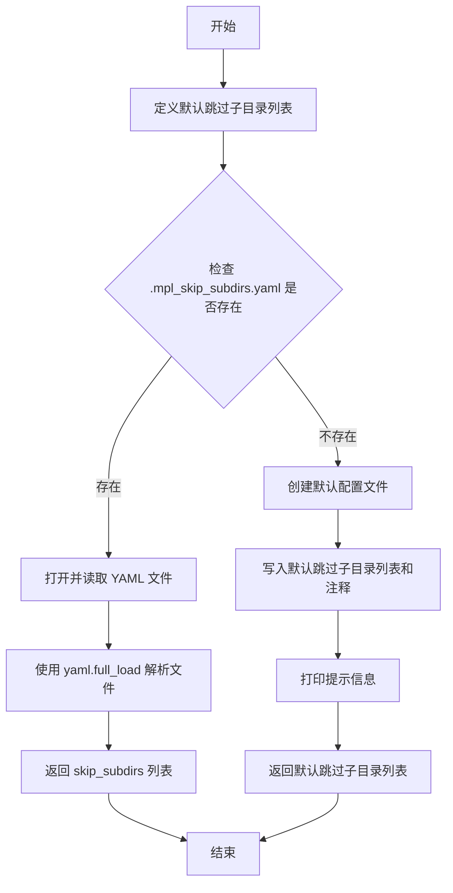
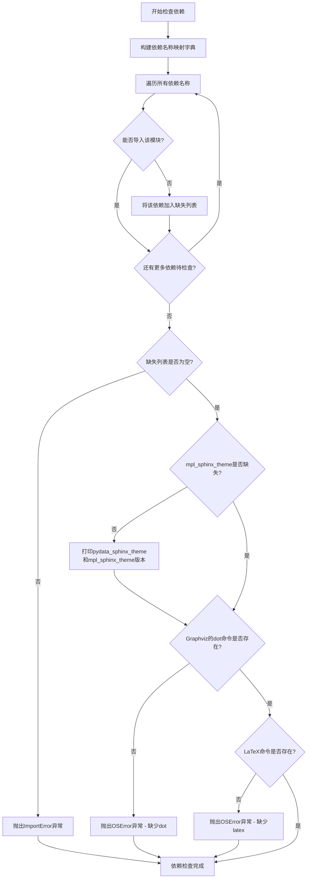
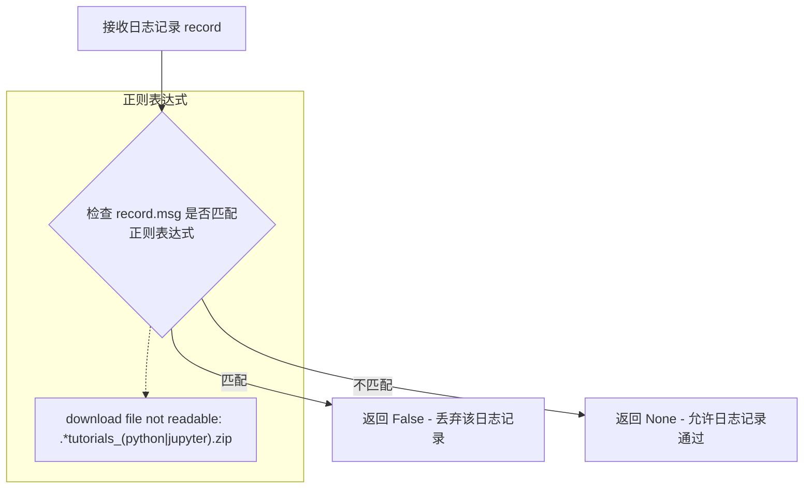
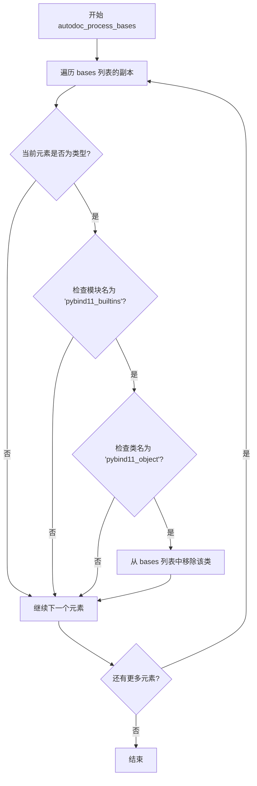
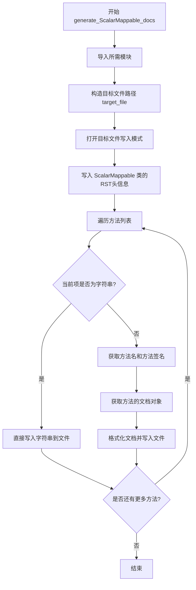
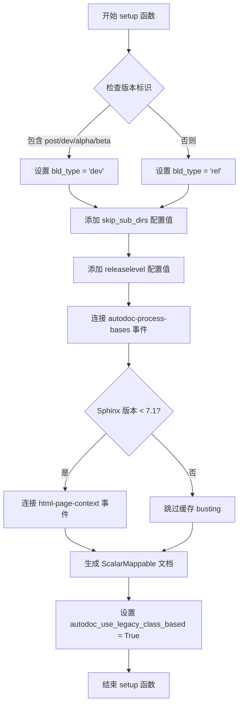

# `matplotlib\doc\conf.py` 详细设计文档

这是 Matplotlib 项目的 Sphinx 文档构建配置文件。它主要负责配置文档构建环境，包括检查系统依赖（如 LaTeX 和 Graphviz）、配置 Sphinx 扩展（特别是 sphinx-gallery 用于生成示例画廊）、设置 HTML 和 LaTeX 输出选项、注册自定义的文档生成钩子（如自动生成 ScalarMappable 文档）以及处理 GitHub 源码链接解析。

## 整体流程

```mermaid
graph TD
    Start([开始]) --> EnvCheck[解析环境变量]
    EnvCheck --> DepsCheck{_check_dependencies}
    DepsCheck -- 缺失依赖 --> RaiseError[抛出 ImportError]
    DepsCheck -- 依赖满足 --> ConfigExt[配置 Sphinx 扩展]
    ConfigExt --> ConfigGallery[配置 sphinx_gallery]
    ConfigGallery --> ConfigOutput[配置 HTML/LaTeX 输出]
    ConfigOutput --> DefineHooks[定义自定义函数钩子]
    DefineHooks --> SphinxSetup[调用 setup(app) 注册配置]
    SphinxSetup --> End([配置完成，等待构建])
```

## 类结构

```
Configuration File (无面向对象类结构，基于过程式配置)
├── 1. 环境与依赖检查模块
│   ├── _check_dependencies
│   └── _parse_skip_subdirs_file
├── 2. 核心配置字典
│   ├── extensions (Sphinx 插件列表)
│   ├── sphinx_gallery_conf (画廊生成配置)
│   └── html_theme_options (主题配置)
├── 3. 文档生成钩子 (Hooks)
│   ├── autodoc_process_bases
│   ├── add_html_cache_busting
│   ├── linkcode_resolve
│   └── generate_ScalarMappable_docs
└── 4. Sphinx 入口点
    └── setup
```

## 全局变量及字段


### `is_release_build`
    
Boolean flag indicating whether this is a release build, used to enable optimizations and related options

类型：`bool`
    


### `CIRCLECI`
    
Boolean flag indicating whether the code is running in CircleCI environment

类型：`bool`
    


### `DEVDOCS`
    
Boolean flag indicating whether the build is deploying to matplotlib.org/devdocs

类型：`bool`
    


### `sourceyear`
    
The year extracted from SOURCE_DATE_EPOCH environment variable or current time for reproducible builds

类型：`int`
    


### `skip_subdirs`
    
List of subdirectories to skip during documentation build when html-skip-subdirs is triggered

类型：`list[str]`
    


### `extensions`
    
List of Sphinx extension module names to enable for the documentation build

类型：`list[str]`
    


### `exclude_patterns`
    
List of patterns for files or directories to exclude from the documentation build

类型：`list[str]`
    


### `intersphinx_mapping`
    
Dictionary mapping external project names to their documentation URLs for cross-referencing

类型：`dict`
    


### `gallery_dirs`
    
List of gallery directory paths to include in the build, excluding skipped subdirectories

类型：`list[str]`
    


### `example_dirs`
    
List of example directory paths corresponding to gallery directories

类型：`list[str]`
    


### `sphinx_gallery_conf`
    
Configuration dictionary for sphinx-gallery extension controlling gallery generation behavior

类型：`dict`
    


### `html_theme`
    
The name of the Sphinx HTML theme to use for the documentation

类型：`str`
    


### `html_theme_options`
    
Dictionary of options to configure the HTML theme appearance and behavior

类型：`dict`
    


### `html_css_files`
    
List of CSS files to include in the HTML output

类型：`list[str]`
    


### `html_static_path`
    
List of directories containing custom static files to copy to HTML output

类型：`list[str]`
    


### `html_baseurl`
    
The base URL for the documentation site

类型：`str`
    


### `latex_documents`
    
List of tuples defining LaTeX document specifications for PDF output

类型：`list[tuple]`
    


### `latex_elements`
    
Dictionary of LaTeX element configurations for PDF build customization

类型：`dict`
    


### `project`
    
The project name for the documentation

类型：`str`
    


### `copyright`
    
Copyright notice string with year range and contributor information

类型：`str`
    


### `version`
    
The short X.Y version number of Matplotlib

类型：`str`
    


### `release`
    
The full version string including alpha/beta/rc tags

类型：`str`
    


### `SHA`
    
Git describe output or matplotlib version string used for cache busting and identification

类型：`str`
    


    

## 全局函数及方法


### `_parse_skip_subdirs_file`

该函数用于读取 `.mpl_skip_subdirs.yaml` 配置文件，获取在执行 `make html-skip-subdirs` 时需要跳过的子目录列表。如果配置文件不存在，则创建默认配置文件并返回默认的跳过列表。

参数： 无

返回值：`list`，返回需要跳过的子目录路径模式列表

#### 流程图



#### 带注释源码

```python
def _parse_skip_subdirs_file():
    """
    Read .mpl_skip_subdirs.yaml for subdirectories to not
    build if we do `make html-skip-subdirs`.  Subdirectories
    are relative to the toplevel directory.  Note that you
    cannot skip 'users' as it contains the table of contents,
    but you can skip subdirectories of 'users'.  Doing this
    can make partial builds very fast.
    """
    # 定义默认需要跳过的子目录列表
    default_skip_subdirs = [
        'release/prev_whats_new/*', 'users/explain/*', 'api/*', 'gallery/*',
        'tutorials/*', 'plot_types/*', 'devel/*']
    
    try:
        # 尝试打开并读取 .mpl_skip_subdirs.yaml 文件
        with open(".mpl_skip_subdirs.yaml", 'r') as fin:
            print('Reading subdirectories to skip from',
                  '.mpl_skip_subdirs.yaml')
            # 使用 yaml.full_load 解析 YAML 文件内容
            out = yaml.full_load(fin)
        # 返回配置文件中的 skip_subdirs 列表
        return out['skip_subdirs']
    except FileNotFoundError:
        # 如果配置文件不存在，则创建默认配置文件
        with open(".mpl_skip_subdirs.yaml", 'w') as fout:
            # 构建包含默认跳过列表和注释的字典
            yamldict = {'skip_subdirs': default_skip_subdirs,
                        'comment': 'For use with make html-skip-subdirs'}
            # 将字典以 YAML 格式写入文件
            yaml.dump(yamldict, fout)
        # 打印提示信息，告知用户已创建默认配置文件
        print('Skipping subdirectories, but .mpl_skip_subdirs.yaml',
              'not found so creating a default one. Edit this file',
              'to customize which directories are included in build.')

        # 返回默认的跳过子目录列表
        return default_skip_subdirs
```


### `_check_dependencies`

该函数用于验证构建 Matplotlib 文档所需的所有依赖项（Python 扩展包和系统工具）是否已安装，并在缺少任何必需依赖时抛出相应的错误信息。

参数：无需传入参数

返回值：无返回值（通过抛出异常表示验证失败）

#### 流程图



#### 带注释源码

```python
def _check_dependencies():
    """
    检查构建文档所需的所有依赖项是否已安装。
    包括Python扩展包和系统工具（Graphviz和LaTeX）。
    """
    # 构建依赖名称映射字典
    # extensions是Sphinx扩展列表，每个扩展格式如'sphinx.ext.autodoc'
    # split(".")[0]取第一部分作为模块名，如'autodoc'
    # 同时显式列出不匹配或非扩展的依赖
    names = {
        **{ext: ext.split(".")[0] for ext in extensions},
        # Explicitly list deps that are not extensions, or whose PyPI package
        # name does not match the (toplevel) module name.
        "colorspacious": 'colorspacious',           # 颜色空间处理库
        "mpl_sphinx_theme": 'mpl_sphinx_theme',     # Matplotlib文档主题
        "sphinxcontrib.inkscapeconverter": 'sphinxcontrib-svg2pdfconverter',  # SVG转PDF扩展
    }
    
    missing = []  # 存储缺失的依赖
    
    # 遍历所有需要检查的依赖
    for name in names:
        try:
            # 尝试动态导入该模块
            __import__(name)
        except ImportError:
            # 导入失败则加入缺失列表（使用PyPI包名）
            missing.append(names[name])
    
    # 如果有任何缺失的依赖，抛出ImportError异常
    if missing:
        raise ImportError(
            "The following dependencies are missing to build the "
            f"documentation: {', '.join(missing)}")

    # debug sphinx-pydata-theme and mpl-theme-version
    # 如果mpl_sphinx_theme已安装，打印主题版本信息用于调试
    if 'mpl_sphinx_theme' not in missing:
        import pydata_sphinx_theme
        import mpl_sphinx_theme
        print(f"pydata sphinx theme: {pydata_sphinx_theme.__version__}")
        print(f"mpl sphinx theme: {mpl_sphinx_theme.__version__}")

    # 检查Graphviz的dot命令是否可用（用于生成图表）
    if shutil.which('dot') is None:
        raise OSError(
            "No binary named dot - graphviz must be installed to build the "
            "documentation")
    
    # 检查LaTeX是否安装（用于PDF输出）
    if shutil.which('latex') is None:
        raise OSError(
            "No binary named latex - a LaTeX distribution must be installed to build "
            "the documentation")
```


### `tutorials_download_error`

该函数是一个日志过滤器，用于过滤 Sphinx 文档构建过程中的特定警告信息。当日志记录的消息匹配到指定的正则表达式（关于教程下载文件无法读取的错误）时，返回 `False` 以阻止该日志记录被输出，从而避免因 sphinx-gallery 17.0 版本中常见的教程下载问题而产生不必要的警告。

参数：

- `record`：`logging.LogRecord`，日志记录对象，包含日志消息（msg）和其他元数据

返回值：`bool`，当消息匹配到 "download file not readable: .*tutorials_(python|jupyter).zip" 模式时返回 `False`（丢弃该日志记录），否则返回 `None`（默认行为，允许日志记录通过）

#### 流程图



#### 带注释源码

```python
def tutorials_download_error(record):
    """
    日志过滤器：忽略 sphinx-gallery 17.0 中关于教程下载文件无法读取的警告。
    
    该函数被添加为 sphinx logger 的过滤器，用于捕获并丢弃特定的警告信息。
    这些警告通常发生在下载教程的 Python 或 Jupyter zip 文件失败时，
    但不影响文档构建的最终结果。
    
    参数:
        record: logging.LogRecord 对象，包含日志消息和相关元数据
        
    返回:
        bool: 当消息匹配特定模式时返回 False 以过滤掉该日志记录；
              否则返回 None（默认行为）以允许日志记录通过
    """
    # 使用正则表达式检查日志消息是否匹配教程下载错误的特定模式
    # 匹配以下格式的错误消息：
    # - "download file not readable: ...tutorials_python.zip"
    # - "download file not readable: ...tutorials_jupyter.zip"
    if re.match("download file not readable: .*tutorials_(python|jupyter).zip",
                record.msg):
        # 返回 False 告诉日志系统丢弃这条记录，不输出此警告
        return False
```


### `autodoc_process_bases`

该函数是 Sphinx autodoc 的事件处理器，用于在生成文档时从类的继承树中隐藏 pybind11 的基础对象类（`pybind11_object`），以提供更清晰的文档展示。

参数：

- `app`：`sphinx.application.Sphinx`，Sphinx 应用程序实例，用于访问配置和事件系统
- `name`：`str`，被处理对象的名称
- `obj`：任意类型，被处理的对象（类或函数）
- `options`：`dict`，autodoc 的选项字典，包含传递给 autodoc 指令的配置参数
- `bases`：`list`，类的基类列表，会被原地修改以移除 pybind11 基础类

返回值：`None`，该函数不返回任何值，直接修改 `bases` 列表

#### 流程图



#### 带注释源码

```python
def autodoc_process_bases(app, name, obj, options, bases):
    """
    Hide pybind11 base object from inheritance tree.

    Note, *bases* must be modified in place.
    """
    # 遍历 bases 列表的副本（使用切片 [:] 创建副本）
    # 因为我们需要在遍历时修改原列表
    for cls in bases[:]:
        # 检查当前元素是否为类型对象
        # 如果不是类型（例如实例或其他对象），则跳过
        if not isinstance(cls, type):
            continue
        # 检查该类是否来自 pybind11_builtins 模块
        # pybind11 自动创建的类会有这个模块名
        if cls.__module__ == 'pybind11_builtins' and cls.__name__ == 'pybind11_object':
            # 从基类列表中移除 pybind11 基础对象
            # 这样在生成的文档中不会显示这个内部基类
            bases.remove(cls)
```


### `add_html_cache_busting`

为 CSS 和 JavaScript 静态资源添加基于 Git SHA 版本号的缓存破坏（cache busting）查询参数。当资源来自本地 `_static` 目录且没有现有查询参数时，函数会将 SHA 值添加为查询字符串，从而确保浏览器在部署新版本时加载最新资源而非缓存副本。

参数：

- `app`：`sphinx.application.Sphinx`，Sphinx 应用实例，用于访问配置和扩展信息
- `pagename`：`str`，当前构建的页面名称
- `templatename`：`str`，使用的模板名称
- `context`：`dict`，HTML 页面上下文字典，包含 `css_tag` 和 `js_tag` 等渲染函数
- `doctree`：`docutils.nodes.document`，文档树对象

返回值：`None`，该函数直接修改 `context` 字典中的 `css_tag` 和 `js_tag` 函数

#### 流程图

```mermaid
flowchart TD
    A[开始 add_html_cache_busting] --> B[从 sphinx.builders.html 导入 Stylesheet 和 JavaScript]
    B --> C[获取 context 中的 css_tag 和 js_tag]
    
    D[定义内部函数 css_tag_with_cache_busting] --> E{检查 css 是否为 Stylesheet 实例}
    E -->|是| F{检查 filename 是否存在}
    F -->|是| G{检查是否为本地路径无查询参数}
    G -->|是| H[用 SHA 替换查询参数]
    H --> I[创建新的 Stylesheet 对象]
    I --> J[调用原始 css_tag]
    E -->|否| J
    F -->|否| J
    G -->|否| J
    
    K[定义内部函数 js_tag_with_cache_busting] --> L{检查 js 是否为 JavaScript 实例}
    L --> M{检查 filename 是否存在}
    M --> N{检查是否为本地路径无查询参数}
    N --> O[用 SHA 替换查询参数]
    O --> P[创建新的 JavaScript 对象]
    P --> Q[调用原始 js_tag]
    L -->|否| Q
    M -->|否| Q
    N -->|否| Q
    
    J --> R[将新的 css_tag_with_cache_busting 赋值给 context['css_tag']]
    Q --> S[将新的 js_tag_with_cache_busting 赋值给 context['js_tag']]
    R --> T[结束]
    S --> T
```

#### 带注释源码

```python
def add_html_cache_busting(app, pagename, templatename, context, doctree):
    """
    Add cache busting query on CSS and JavaScript assets.

    This adds the Matplotlib version as a query to the link reference in the
    HTML, if the path is not absolute (i.e., it comes from the `_static`
    directory) and doesn't already have a query.

    .. note:: Sphinx 7.1 provides asset checksums; so this hook only runs on
              Sphinx 7.0 and earlier.
    """
    # 从 Sphinx 的 HTML 构建器导入 Stylesheet 和 JavaScript 类
    # 用于检查资源类型并创建新的资源对象
    from sphinx.builders.html import Stylesheet, JavaScript

    # 从上下文中获取原始的 CSS 和 JS 标签渲染函数
    # 这些函数负责生成 HTML 中的 <link> 和 <script> 标签
    css_tag = context['css_tag']
    js_tag = context['js_tag']

    def css_tag_with_cache_busting(css):
        """为 CSS 资源添加缓存破坏查询参数的内部函数"""
        # 检查是否为 Stylesheet 类型且包含文件名
        if isinstance(css, Stylesheet) and css.filename is not None:
            # 解析 URL 以检查是否为本地资源
            url = urlsplit(css.filename)
            # 仅处理本地资源（无域名且无现有查询参数）
            if not url.netloc and not url.query:
                # 用 SHA 版本号替换查询参数
                url = url._replace(query=SHA)
                # 创建新的 Stylesheet 对象，保留原有属性
                css = Stylesheet(urlunsplit(url), priority=css.priority,
                                 **css.attributes)
        # 调用原始的 css_tag 函数生成 HTML 标签
        return css_tag(css)

    def js_tag_with_cache_busting(js):
        """为 JavaScript 资源添加缓存破坏查询参数的内部函数"""
        # 检查是否为 JavaScript 类型且包含文件名
        if isinstance(js, JavaScript) and js.filename is not None:
            # 解析 URL 以检查是否为本地资源
            url = urlsplit(js.filename)
            # 仅处理本地资源（无域名且无现有查询参数）
            if not url.netloc and not url.query:
                # 用 SHA 版本号替换查询参数
                url = url._replace(query=SHA)
                # 创建新的 JavaScript 对象，保留原有属性
                js = JavaScript(urlunsplit(url), priority=js.priority,
                                **js.attributes)
        # 调用原始的 js_tag 函数生成 HTML 标签
        return js_tag(js)

    # 将带有缓存破坏功能的新函数替换到上下文中
    # 这样在渲染 HTML 时会自动为本地静态资源添加版本查询参数
    context['css_tag'] = css_tag_with_cache_busting
    context['js_tag'] = js_tag_with_cache_busting
```


### `linkcode_resolve`

该函数是 Sphinx 链接代码扩展的核心回调函数，用于在文档构建时动态解析 Python 对象的源代码 URL，使其在生成的文档中可以直接链接到 GitHub 上的源代码。

参数：

-  `domain`：`str`，Sphinx 域名标识，指定要解析的对象类型（如 'py' 表示 Python）
-  `info`：`dict`，包含对象元信息的字典，必须包含 'module' 和 'fullname' 键

返回值：`Optional[str]`，返回指向 GitHub 仓库中源代码的 URL 字符串，如果无法解析则返回 None

#### 流程图

```mermaid
flowchart TD
    A[开始: linkcode_resolve] --> B{domain == 'py'?}
    B -->|否| C[返回 None]
    B -->|是| D[从 info 获取 module 和 fullname]
    E[获取 sys.modules 中的模块] --> F{模块存在?}
    F -->|否| G[返回 None]
    F -->|是| H[遍历 fullname 的每个部分]
    H --> I{获取属性成功?}
    I -->|否| J[返回 None]
    I -->|是| K{还有更多部分?}
    K -->|是| H
    K -->|否| L[解包函数如果需要]
    L --> M[尝试获取源代码文件]
    M --> N{获取成功?}
    N -->|否| O{尝试从 __module__ 获取?}
    N -->|是| P{文件是 __init__.py?}
    P -->|是| O
    P -->|否| Q[获取源代码行号]
    O --> R{获取成功?}
    R -->|否| S[返回 None]
    R -->|是| T[生成 linespec]
    Q --> T
    T --> U[计算相对路径]
    U --> V{路径有效?}
    V -->|否| W[返回 None]
    V -->|是| X{路径以 matplotlib/ 或 mpl_toolkits/ 开头?]
    X -->|否| Y[返回 None]
    X -->|是| Z[确定版本标签]
    Z --> AA[构建 GitHub URL]
    AA --> AB[返回完整 URL]
```

#### 带注释源码

```python
def linkcode_resolve(domain, info):
    """
    Determine the URL corresponding to Python object
    """
    # 仅处理 Python 域的对象
    if domain != 'py':
        return None

    # 从 info 字典中提取模块名和完整对象名
    modname = info['module']
    fullname = info['fullname']

    # 获取模块对象
    submod = sys.modules.get(modname)
    if submod is None:
        return None

    # 从模块开始，逐步解析对象的属性
    obj = submod
    for part in fullname.split('.'):
        try:
            obj = getattr(obj, part)
        except AttributeError:
            return None

    # 如果是函数，解包以获取原始函数（去除装饰器）
    if inspect.isfunction(obj):
        obj = inspect.unwrap(obj)
    
    # 尝试获取对象的源代码文件路径
    try:
        fn = inspect.getsourcefile(obj)
    except TypeError:
        fn = None
    
    # 如果获取失败或是 __init__.py，尝试从对象的 __module__ 获取
    if not fn or fn.endswith('__init__.py'):
        try:
            fn = inspect.getsourcefile(sys.modules[obj.__module__])
        except (TypeError, AttributeError, KeyError):
            fn = None
    
    if not fn:
        return None

    # 获取源代码的起始行号
    try:
        source, lineno = inspect.getsourcelines(obj)
    except (OSError, TypeError):
        lineno = None

    # 生成行号范围说明（如 #L100-L150）
    linespec = (f"#L{lineno:d}-L{lineno + len(source) - 1:d}"
                if lineno else "")

    # 计算相对于 matplotlib 源码根目录的路径
    startdir = Path(matplotlib.__file__).parent.parent
    try:
        fn = os.path.relpath(fn, start=startdir).replace(os.path.sep, '/')
    except ValueError:
        return None

    # 仅处理 matplotlib 和 mpl_toolkits 下的文件
    if not fn.startswith(('matplotlib/', 'mpl_toolkits/')):
        return None

    # 根据版本确定 Git 标签
    version = parse_version(matplotlib.__version__)
    tag = 'main' if version.is_devrelease else f'v{version.public}'
    
    # 构建并返回完整的 GitHub URL
    return ("https://github.com/matplotlib/matplotlib/blob"
            f"/{tag}/lib/{fn}{linespec}")
```


### `generate_ScalarMappable_docs`

该函数用于自动生成 Matplotlib 中 `ScalarMappable` 类的文档，遍历该类的多个方法（包括 `autoscale`、`get_cmap`、`set_norm` 等），并将其方法签名和文档字符串写入到 RST 文件中，以供 Sphinx 文档构建使用。

参数：无

返回值：无

#### 流程图



#### 带注释源码

```python
def generate_ScalarMappable_docs():
    """
    自动生成 ScalarMappable 类的文档文件。
    
    该函数遍历 matplotlib.colorizer._ScalarMappable 类的多个方法，
    提取其方法签名和文档字符串，并写入到 RST 格式的文档文件中，
    供 Sphinx 文档构建系统使用。
    """
    
    # 导入所需的模块
    import matplotlib.colorizer  # Matplotlib 颜色映射模块
    from numpydoc.docscrape_sphinx import get_doc_obj  # 用于从方法获取文档对象
    from pathlib import Path  # 路径处理
    import textwrap  # 文本格式化缩进
    from sphinx.util.inspect import stringify_signature  # 将方法签名转换为字符串
    
    # 构造目标文件路径：当前目录下的 api/scalarmappable.gen_rst
    target_file = Path(__file__).parent / 'api' / 'scalarmappable.gen_rst'
    
    # 以写入模式打开目标文件
    with open(target_file, 'w') as fout:
        # 写入 ScalarMappable 类的 RST 头信息
        fout.write("""
.. class:: ScalarMappable(colorizer, **kwargs)
   :canonical: matplotlib.colorizer._ScalarMappable

""")
        
        # 定义需要生成文档的方法列表
        for meth in [
                matplotlib.colorizer._ScalarMappable.autoscale,  # 自动缩放方法
                matplotlib.colorizer._ScalarMappable.autoscale_None,  # 自动缩放空值处理
                matplotlib.colorizer._ScalarMappable.changed,  # 变更通知方法
                """
   .. attribute:: colorbar

        The last colorbar associated with this ScalarMappable. May be None.
""",  # colorbar 属性文档
                matplotlib.colorizer._ScalarMappable.get_alpha,  # 获取透明度
                matplotlib.colorizer._ScalarMappable.get_array,  # 获取数组数据
                matplotlib.colorizer._ScalarMappable.get_clim,  # 获取颜色限制
                matplotlib.colorizer._ScalarMappable.get_cmap,  # 获取颜色映射
                """
   .. property:: norm
""",  # norm 属性文档
                matplotlib.colorizer._ScalarMappable.set_array,  # 设置数组数据
                matplotlib.colorizer._ScalarMappable.set_clim,  # 设置颜色限制
                matplotlib.colorizer._ScalarMappable.set_cmap,  # 设置颜色映射
                matplotlib.colorizer._ScalarMappable.set_norm,  # 设置归一化对象
                matplotlib.colorizer._ScalarMappable.to_rgba,  # 转换为 RGBA 颜色
        ]:
            # 判断当前项是否为字符串（字符串表示静态文档片段）
            if isinstance(meth, str):
                # 直接将字符串写入文件
                fout.write(meth)
            else:
                # 否则是方法对象，需要提取信息
                name = meth.__name__  # 获取方法名
                
                # 使用 inspect 模块获取方法签名并转换为字符串
                sig = stringify_signature(inspect.signature(meth))
                
                # 获取方法的文档对象
                docstring = textwrap.indent(
                    str(get_doc_object(meth)),
                    '      '  # 缩进 6 个空格
                ).rstrip()  # 去除末尾空白
                
                # 格式化写入方法文档
                fout.write(f"""
   .. method::  {name}{sig}
{docstring}

""")
```


### `setup`

Sphinx 扩展的入口点函数，用于配置 Sphinx 应用程序，添加配置值、注册事件处理器、生成文档并设置文档构建类型。

参数：

- `app`：`sphinx.application.Sphinx`，Sphinx 应用程序实例，用于添加配置值、连接事件处理器和修改配置

返回值：`None`，无返回值

#### 流程图



#### 带注释源码

```python
def setup(app):
    """
    Sphinx 扩展的入口点函数。
    
    此函数在 Sphinx 加载扩展时被调用，用于配置文档构建的各种选项。
    """
    # 根据 Matplotlib 版本判断是否为开发版本
    # 如果版本号中包含 post, dev, alpha, beta 则为开发版本
    if any(st in version for st in ('post', 'dev', 'alpha', 'beta')):
        bld_type = 'dev'    # 开发版本类型
    else:
        bld_type = 'rel'    # 正式版本类型
    
    # 添加自定义配置值：skip_sub_dirs
    # 用于控制是否跳过子目录的构建
    app.add_config_value('skip_sub_dirs', 0, '')
    
    # 添加自定义配置值：releaselevel
    # 用于标识当前构建是开发版本还是正式版本
    app.add_config_value('releaselevel', bld_type, 'env')
    
    # 连接 autodoc-process-bases 事件处理器
    # 用于在 autodoc 处理类继承关系时隐藏 pybind11 基类
    app.connect('autodoc-process-bases', autodoc_process_bases)
    
    # 检查 Sphinx 版本是否为 7.1 以下
    # 如果是，则添加 HTML 缓存 busting 功能
    if sphinx.version_info[:2] < (7, 1):
        # 连接 html-page-context 事件
        # 用于在 HTML 页面上下文中添加缓存破坏查询参数
        app.connect('html-page-context', add_html_cache_busting, priority=1000)
    
    # 生成 ScalarMappable 类的文档
    # 创建自动生成的 RST 文件
    generate_ScalarMappable_docs()
    
    # 配置 autodoc 使用传统的基于类的 autodoc
    # 兼容旧版本的 autodoc 行为
    app.config.autodoc_use_legacy_class_based = True
```

## 关键组件


### 依赖检查与验证 (`_check_dependencies`)

检查所有 Sphinx 扩展、第三方库（如 colorspacious、mpl_sphinx_theme）、graphviz 和 LaTeX 发行版是否已安装，确保文档构建所需的所有依赖完整。

### 子目录跳过机制 (`_parse_skip_subdirs_file`)

读取 `.mpl_skip_subdirs.yaml` 配置文件，支持通过 `make html-skip-subdirs` 命令跳过部分子目录（如 gallery、tutorials、api 等），实现增量构建以大幅提升构建速度。

### HTML 缓存破坏 (`add_html_cache_busting`)

在 Sphinx 7.0 及更早版本中，为 CSS 和 JavaScript 资源的 URL 添加 Matplotlib 版本作为查询参数，强制浏览器加载最新资源而非使用缓存。

### Sphinx Gallery 配置 (`sphinx_gallery_conf`)

配置图像压缩、动画支持（mp4 格式）、示例缩略图大小、图库排序、引用链接等，集成 matplotlib 特定的 LaTeX 图像抓取器。

### 链接代码解析 (`linkcode_resolve`)

动态解析 Python 对象对应的 GitHub 源代码 URL，支持从主分支或发布标签分支生成链接，便于文档读者直接跳转查看源码。

### ScalarMappable 文档生成 (`generate_ScalarMappable_docs`)

动态生成 ScalarMappable 类的 RST 文档文件，包含 autoscale、set_norm、get_cmap 等方法的签名和文档字符串。

### 自动文档基类处理 (`autodoc_process_bases`)

从继承树中隐藏 pybind11 的基对象，避免文档中显示不相关的 C++ 绑定实现细节。

### 版本与发布管理

根据 Matplotlib 版本号判断是否为开发版本、预发布版本或正式发布版本，动态设置发布级别和切换器配置。

### Intersphinx 跨项目链接映射

配置与 NumPy、Pandas、SciPy、Python 等项目的交叉引用映射，支持文档间的无缝链接。

### LaTeX/PDF 构建配置

配置 XeLaTeX 引擎、Unicode 字体支持（XITS、FreeSans、FreeMono）、数学字体、目录深度等，确保 PDF 输出质量。

### 文档构建过滤器

配置警告过滤规则，将缺失字形警告、deprecated 模块警告等降级处理，同时将某些警告转为错误以确保文档质量。


## 问题及建议


### 已知问题

-   **YAML 安全问题**：使用 `yaml.full_load(fin)` 存在安全风险，应使用 `yaml.safe_load()` 或明确指定 `Loader` 参数
-   **弃用的配置项**：`html_index = 'index.html'` 已在 Sphinx 3.0+ 中弃用，应使用 `root_doc` 替代
-   **版本检查方式脆弱**：使用 `sphinx.version_info[:2] < (7, 1)` 进行版本比较，无法准确匹配 Sphinx 的主版本变化
-   **全局副作用**：在模块级别直接调用 `_check_dependencies()` 和 `import sphinx_gallery`，导致配置加载时产生大量副作用，难以独立测试和调试
-   **硬编码的构建目标检测**：通过检查 `sys.argv` 来判断构建目标（html/latex）的逻辑不够健壮，命令行参数顺序依赖性强
-   **冗余的依赖检查**：`shutil.which('dot')` 和 `shutil.which('latex')` 在依赖检查函数中已被调用，但后续又通过 `import` 再次验证，效率低下
-   **警告过滤过于宽泛**：全局 `warnings.filterwarnings('error', append=True)` 会导致任何警告都会使文档构建失败，可能误杀合法的警告信息

### 优化建议

-   将 YAML 加载改为 `yaml.safe_load(fin)` 或使用 `yaml.load(fin, Loader=yaml.SafeLoader)`
-   移除 `html_index` 配置项，统一使用 `root_doc` 管理入口文档
-   使用 `sphinx.version_info >= (7, 1)` 替代切片比较，并考虑使用 `parse_version(sphinx.__version__)` 进行更可靠的版本检查
-   将依赖检查逻辑封装为延迟加载或条件函数调用，避免模块导入时的强制依赖
-   使用 `argparse` 解析命令行参数或检查 `os.environ.get('SPHINX_BUILD')` 等环境变量来更可靠地判断构建目标
-   将警告过滤策略改为按需启用，并为特定扩展（如 sphinx-gallery）配置独立的警告处理机制
-   考虑将大型配置块（如 sphinx_gallery_conf）提取为独立的 YAML/JSON 配置文件，提高可维护性


## 其它


### 设计目标与约束

本配置文件旨在为 Matplotlib 项目构建完整的 Sphinx 文档，包含用户指南、API 参考、图库和教程。核心目标包括：生成可在 matplotlib.org 发布的 HTML 文档和可打印的 LaTeX/PDF 版本；通过 sphinx-gallery 自动生成图库示例；支持多版本切换和缓存失效；确保文档构建的可重现性（使用 SOURCE_DATE_EPOCH）。约束条件包括：必须安装 graphviz 和 LaTeX 发行版；依赖特定的 sphinx-gallery 版本；仅支持 Python 3.x 环境。

### 错误处理与异常设计

配置文件实现了多层次的错误处理机制。依赖检查函数 `_check_dependencies()` 在构建前验证所有必需包是否存在，缺失时抛出 `ImportError`；graphviz 和 LaTeX 检查缺失时抛出 `OSError`。警告过滤策略通过 `warnings.filterwarnings()` 将某些警告转为错误以确保文档质量，同时对字体缺失和图库下载等已知问题进行过滤。日志系统通过自定义 `tutorials_download_error` 过滤器处理 sphinx-gallery 17.0 的警告。异常捕获还用于 git 命令执行（获取版本信息）和 YAML 文件读取，确保配置文件即使在边缘环境下也能优雅降级。

### 外部依赖与接口契约

本配置依赖以下外部组件：Sphinx 及其扩展（autodoc、intersphinx、graphviz 等）；sphinx-gallery（版本需 >= 0.16.0）；matplotlib 本身及其图例渲染器；pydata-sphinx-theme 和 mpl-sphinx-theme 主题；各种 Python 包（Pillow、numpy、pandas、scipy 等用于图库示例）。接口契约方面：配置定义了一系列 Sphinx 配置值（如 `html_theme_options`、`sphinx_gallery_conf`）；提供了 `setup()` 函数作为 Sphinx 扩展入口点；通过 `linkcode_resolve()` 函数实现源码链接的接口协议；图库配置遵循 sphinx-gallery 的配置规范。

### 数据流与状态机

配置文件的数据流主要分为三个阶段：初始化阶段（导入依赖、解析环境变量、判断构建模式）、配置阶段（设置扩展、配置选项、注册钩子）和构建阶段（Sphinx 读取配置并执行）。状态机方面：构建模式由 `is_release_build` 和 `CIRCLECI`、`DEVDOCS` 环境变量决定；图库构建根据 `plot_gallery` 参数决定是否生成图库图像；Sphinx 版本检测用于条件加载不同版本的 sphinx-gallery 功能；HTML 缓存失效机制根据版本切换动态调整。

### 配置项说明

所有配置项按照功能分类：扩展配置（extensions 列表）、排除规则（exclude_patterns）、图库配置（sphinx_gallery_conf 字典）、HTML 输出配置（html_theme_options 字典）、LaTeX 输出配置（latex_documents、latex_elements 字典）、跨项目引用（intersphinx_mapping）、版本信息（version、release、SHA）。每个配置项都直接影响最终文档的生成效果和行为。

### 构建环境检测

配置文件通过环境变量和系统调用检测构建环境：检测是否在 CircleCI 上运行（`CIRCLECI` 变量）；判断是否为发布版本（`tags.has('release')`）；检测是否部署到 devdocs（通过项目名和分支名判断）；获取 git 描述信息或回退到 setuptools_scm 版本。这些检测结果决定了文档构建的许多关键行为，如缓存策略、分析脚本注入、版本切换器配置等。

    