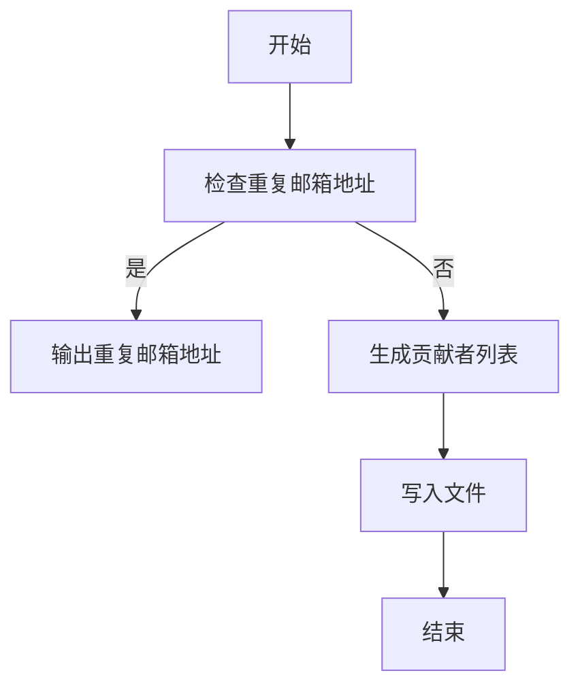
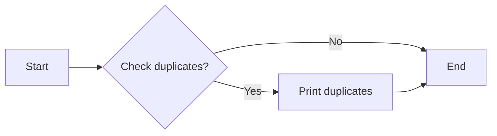
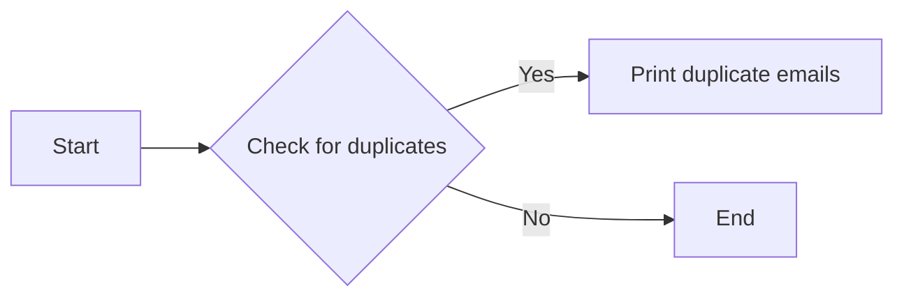

# `matplotlib\doc\project\generate_credits.py` 详细设计文档

This script generates a list of contributors to the matplotlib github repository and checks for duplicate email addresses.

## 整体流程



## 类结构

```
generate_credits.py (主脚本)
├── check_duplicates() (检查重复邮箱地址)
│   ├── subprocess.check_output(['git', 'shortlog', '--summary', '--email'])
│   ├── lines = text.decode('utf8').split('
')
│   ├── contributors = [line.split('	', 1)[1].strip() for line in lines if line]
│   ├── emails = [re.match('.*<(.*)>', line).group(1) for line in contributors]
│   ├── email_counter = Counter(emails)
│   └── if email_counter.most_common(1)[0][1] > 1: ...
└── generate_credits() (生成贡献者列表)
    ├── text = subprocess.check_output(['git', 'shortlog', '--summary'])
    ├── lines = text.decode('utf8').split('
')
    ├── contributors = [line.split('	', 1)[1].strip() for line in lines if line]
    ├── contributors.sort(key=locale.strxfrm)
    ├── with open('credits.rst', 'w') as f: ...
    └── f.write(TEMPLATE.format(contributors=',
'.join(contributors)))
```

## 全局变量及字段


### `TEMPLATE`
    
The template string used to generate the credits.rst file.

类型：`str`
    


### `text`
    
The output from the subprocess command executed to get the git shortlog.

类型：`str`
    


### `lines`
    
The lines of the output from the subprocess command, split by newline.

类型：`list of str`
    


### `contributors`
    
The list of contributors extracted from the git shortlog.

类型：`list of str`
    


### `emails`
    
The list of email addresses extracted from the contributors.

类型：`list of str`
    


### `email_counter`
    
A Counter object that counts the occurrences of each email address in the list of emails.

类型：`Counter`
    


### `Counter.emails`
    
The list of email addresses used by contributors.

类型：`list of str`
    


### `Counter.most_common(1)[0][1] > 1`
    
A boolean expression that checks if the most common email address in the Counter object has more than one occurrence.

类型：`bool`
    
    

## 全局函数及方法


### check_duplicates()

该函数用于检查贡献者列表中是否存在重复的电子邮件地址，并打印出重复的电子邮件地址。

参数：

- `text`：`str`，从子进程输出中解码的文本。
- `lines`：`list`，从文本中分割得到的行列表。
- `contributors`：`list`，从行中提取的贡献者列表。
- `emails`：`list`，从贡献者列表中提取的电子邮件地址列表。
- `email_counter`：`Counter`，电子邮件地址的计数器。

返回值：无

#### 流程图



#### 带注释源码

```python
def check_duplicates():
    text = subprocess.check_output(['git', 'shortlog', '--summary', '--email'])
    lines = text.decode('utf8').split('\n')
    contributors = [line.split('\t', 1)[1].strip() for line in lines if line]
    emails = [re.match('.*<(.*)>', line).group(1) for line in contributors]
    email_counter = Counter(emails)

    if email_counter.most_common(1)[0][1] > 1:
        print('DUPLICATE CHECK: The following email addresses are used with '
              'more than one name.\nConsider adding them to .mailmap.\n')
        for email, count in email_counter.items():
            if count > 1:
                print('{}\n{}'.format(
                    email, '\n'.join(l for l in lines if email in l)))
```


### generate_credits()

This function generates a file named `credits.rst` with an up-to-date list of contributors to the matplotlib github repository.

参数：

- 无

返回值：无

#### 流程图

```mermaid
graph LR
A[Start] --> B{Check for duplicates?}
B -- Yes --> C[Run check_duplicates()]
B -- No --> D[Generate credits]
D --> E[Write to credits.rst]
E --> F[End]
```

#### 带注释源码

```python
def generate_credits():
    text = subprocess.check_output(['git', 'shortlog', '--summary'])
    lines = text.decode('utf8').split('\n')
    contributors = [line.split('\t', 1)[1].strip() for line in lines if line]
    contributors.sort(key=locale.strxfrm)
    with open('credits.rst', 'w') as f:
        f.write(TEMPLATE.format(contributors=',\n'.join(contributors)))
```


### `Counter.most_common(1)[0][1]`

该表达式用于检查是否有多个贡献者使用了相同的电子邮件地址，并且这些贡献者的名字不止一个。

参数：

- 无

返回值：`int`，表示电子邮件地址对应的贡献者名字数量

#### 流程图



#### 带注释源码

```python
# ... (代码中的相关部分)
email_counter = Counter(emails)

if email_counter.most_common(1)[0][1] > 1:
    print('DUPLICATE CHECK: The following email addresses are used with '
          'more than one name.\nConsider adding them to .mailmap.\n')
    for email, count in email_counter.items():
        if count > 1:
            print('{}\n{}'.format(
                email, '\n'.join(l for l in lines if email in l)))
# ... (代码中的相关部分)
```


## 关键组件


### 张量索引与惰性加载

支持对张量的索引操作，同时采用惰性加载机制，以优化内存使用。

### 反量化支持

提供反量化功能，允许用户对量化后的模型进行反量化处理。

### 量化策略

实现多种量化策略，包括全精度到低精度转换，以及低精度到全精度转换。


## 问题及建议


### 已知问题

-   **依赖外部命令**: 代码依赖于 `git` 命令来获取贡献者信息，这可能导致跨平台兼容性问题。
-   **硬编码模板**: `TEMPLATE` 字符串是硬编码的，如果模板格式需要更改，则需要修改代码。
-   **错误处理**: 代码没有明确的错误处理机制，如果 `subprocess.check_output` 调用失败，程序可能会崩溃。
-   **代码风格**: 代码风格不一致，例如缩进和空格的使用。

### 优化建议

-   **使用配置文件**: 将模板和其它配置信息移至配置文件中，以便于管理和修改。
-   **异常处理**: 添加异常处理来捕获和处理 `subprocess.check_output` 可能抛出的异常。
-   **代码风格一致性**: 使用代码风格指南（如PEP 8）来确保代码风格的一致性。
-   **跨平台兼容性**: 检查 `git` 命令在不同操作系统上的可用性，或者提供一个替代方案。
-   **日志记录**: 添加日志记录功能，以便于跟踪程序的执行过程和潜在的错误。
-   **单元测试**: 编写单元测试来确保代码的稳定性和可靠性。
-   **文档**: 为代码添加详细的文档，包括如何使用该脚本以及如何进行维护。


## 其它


### 设计目标与约束

- 设计目标：生成一个包含Matplotlib项目贡献者列表的`credits.rst`文件。
- 约束：使用Git命令行工具获取贡献者信息，确保生成的文件格式正确。

### 错误处理与异常设计

- 错误处理：使用`subprocess.check_output`确保Git命令执行成功，捕获并处理可能的异常。
- 异常设计：在检测到重复邮箱地址时，打印警告信息并建议添加到`.mailmap`文件中。

### 数据流与状态机

- 数据流：从Git命令行工具获取贡献者信息，处理并排序数据，生成`credits.rst`文件。
- 状态机：程序分为两个主要状态：检查重复邮箱地址和生成贡献者列表。

### 外部依赖与接口契约

- 外部依赖：依赖Git命令行工具获取贡献者信息。
- 接口契约：使用`subprocess`模块执行Git命令，处理输出结果。

### 安全性与隐私

- 安全性：确保Git命令执行成功，避免潜在的安全风险。
- 隐私：不涉及敏感信息处理，仅生成贡献者列表。

### 性能优化

- 性能优化：使用`Counter`类统计重复邮箱地址，提高处理效率。

### 代码风格与规范

- 代码风格：遵循PEP 8编码规范，确保代码可读性和可维护性。
- 规范：使用函数封装代码逻辑，提高代码复用性。

### 测试与验证

- 测试：编写单元测试验证代码功能，确保程序稳定运行。
- 验证：手动验证生成的`credits.rst`文件内容是否正确。

### 维护与更新

- 维护：定期更新代码，修复潜在问题，确保程序持续可用。
- 更新：根据项目需求，调整代码逻辑和功能。


    