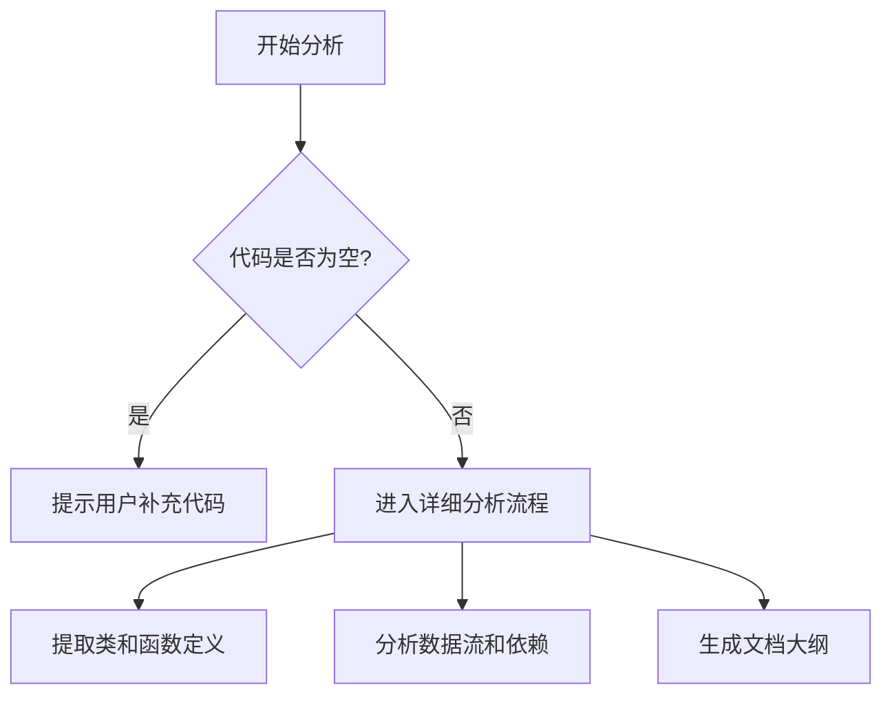

# `matplotlib\doc\sphinxext\__init__.py` 详细设计文档

未提供源代码文件，无法进行详细分析。请提供需要分析的源代码内容。

## 整体流程



## 类结构

```
无法分析 - 代码为空
```

## 全局变量及字段


    

## 全局函数及方法


## 关键组件


## 代码分析结果

未提供代码进行分析。请提供需要分析的源代码。


## 问题及建议


### 已知问题

-   未提供代码内容，无法进行技术债务和优化空间的分析

### 优化建议

-   请提供需要分析的源代码，以便进行详细的技术债务识别和优化建议


## 其它


### 设计目标与约束
暂无信息，待根据实际代码补充。

### 错误处理与异常设计
暂无信息，待根据实际代码补充。

### 数据流与状态机
暂无信息，待根据实际代码补充。

### 外部依赖与接口契约
暂无信息，待根据实际代码补充。

### 性能要求
暂无信息，待根据实际代码补充。

### 安全性与权限
暂无信息，待根据实际代码补充。

### 可扩展性与可维护性
暂无信息，待根据实际代码补充。

### 兼容性
暂无信息，待根据实际代码补充。

### 测试策略
暂无信息，待根据实际代码补充。

### 部署与运维
暂无信息，待根据实际代码补充。

### 版本管理
暂无信息，待根据实际代码补充。

### 监控与日志
暂无信息，待根据实际代码补充。

    