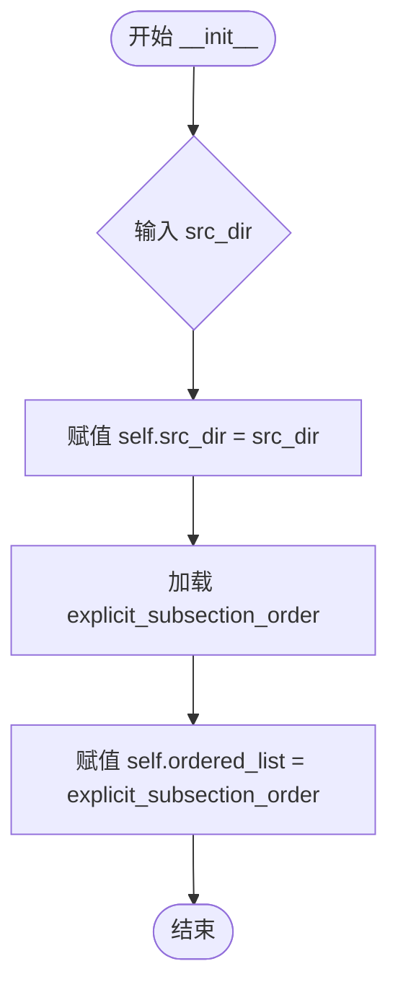
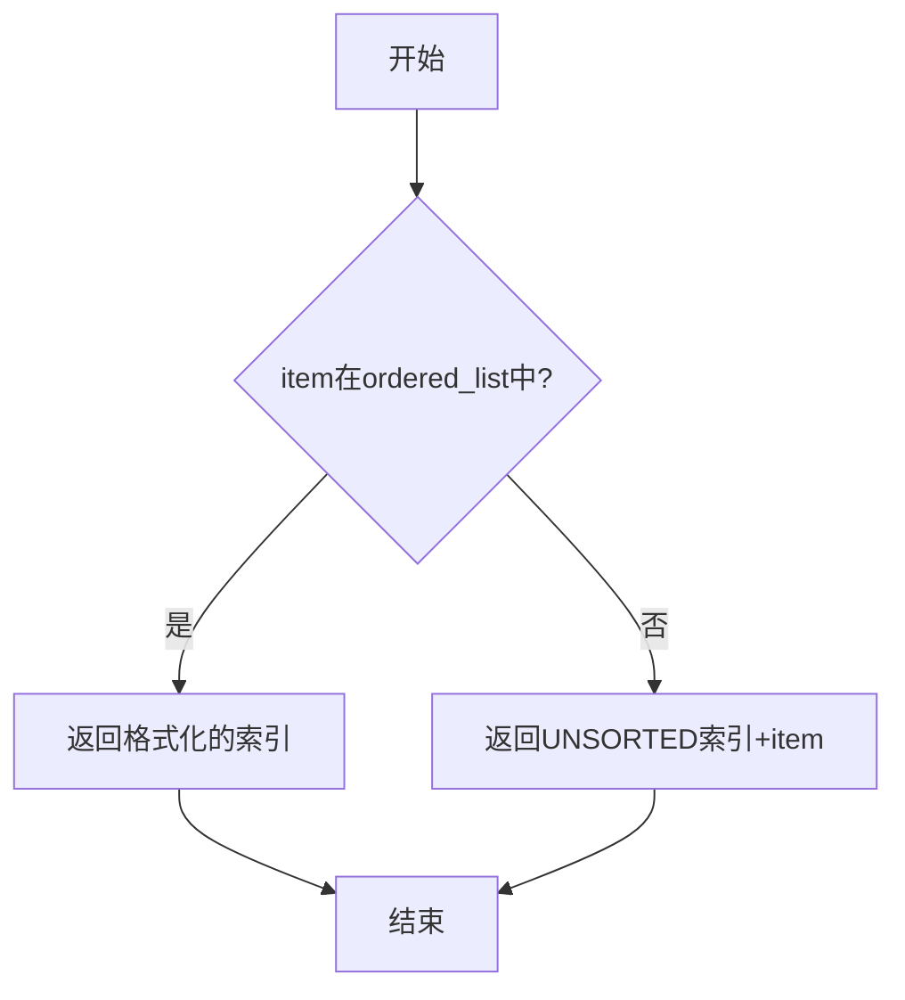
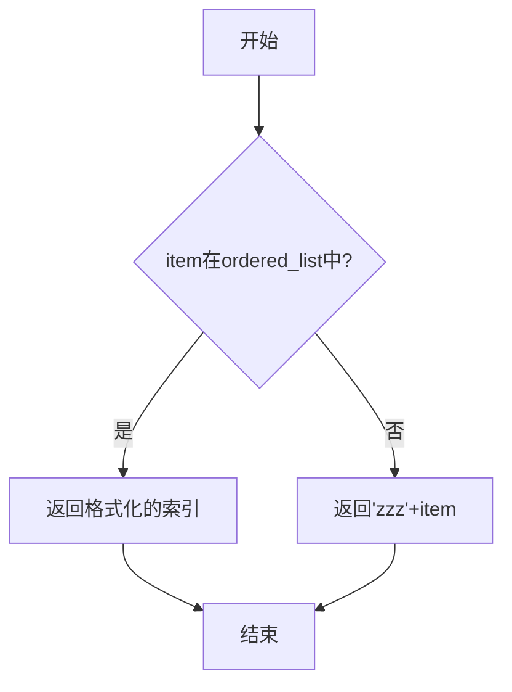

# `matplotlib\doc\sphinxext\gallery_order.py` 详细设计文档

这是一个用于Sphinx-Gallery的配置模块（gen_gallery_order.py），主要定义了Matplotlib项目文档gallery中示例（examples）、教程（tutorials）和图表类型（plot_types）的展示顺序，并通过继承ExplicitOrder类实现了自定义的排序逻辑。

## 整体流程

```mermaid
graph TD
    Start[开始] --> DefineConstants[定义常量 UNSORTED]
    DefineConstants --> DefineLists[定义三个列表: examples_order, tutorials_order, plot_types_order]
    DefineLists --> CombineLists[组合为 folder_lists]
    CombineLists --> BuildFolderOrder[构建 explicit_order_folders]
    BuildFolderOrder --> LogicPre{遍历列表提取 UNSORTED 前的项}
    LogicPre --> AppendUnsorted[添加 UNSORTED 标记]
    AppendUnsorted --> LogicPost{遍历列表提取 UNSORTED 后的项}
    LogicPost --> ExtendList[将剩余项追加到列表末尾]
    ExtendList --> DefineSubOrder[构建 explicit_subsection_order 列表]
    DefineSubOrder --> CreateClasses[实例化排序类]
    CreateClasses --> ClassUsage[外部调用 (e.g. sphinx conf.py)]
    subgraph Class Logic
        InputItem[传入 item] --> CheckItem{item in ordered_list?}
        CheckItem -- 是 --> ReturnIndex[返回格式化索引 f'{index:04d}']
        CheckItem -- 否 --> ReturnFallback[返回后备排序字符串]
    End
```

## 类结构

```
sphinx_gallery.sorting.ExplicitOrder (第三方抽象基类)
├── MplExplicitOrder (用于章节排序 'subsection_order')
└── MplExplicitSubOrder (用于子章节排序 'within_subsection_order')
```

## 全局变量及字段


### `UNSORTED`
    
Constant string representing the position where non-matching sections are inserted.

类型：`str`
    


### `examples_order`
    
List of gallery examples section paths in display order.

类型：`list[str]`
    


### `tutorials_order`
    
List of gallery tutorials section paths in display order.

类型：`list[str]`
    


### `plot_types_order`
    
List of plot types section paths in display order.

类型：`list[str]`
    


### `folder_lists`
    
Container holding all three folder order lists.

类型：`list[list[str]]`
    


### `explicit_order_folders`
    
Flattened and reordered list of folders with unsorted position specified.

类型：`list[str]`
    


### `list_all`
    
List of all subsection names used for explicit ordering.

类型：`list[str]`
    


### `explicit_subsection_order`
    
List of subsection names with .py extension for explicit ordering.

类型：`list[str]`
    


### `sectionorder`
    
Instance of MplExplicitOrder for determining section sort order.

类型：`MplExplicitOrder`
    


### `subsectionorder`
    
Class reference to MplExplicitSubOrder for determining subsection sort order.

类型：`type[MplExplicitSubOrder]`
    


### `MplExplicitOrder.ordered_list`
    
Inherited from ExplicitOrder, stores the explicit_order_folders list.

类型：`list[str]`
    


### `MplExplicitSubOrder.src_dir`
    
Source directory parameter, currently unused in the implementation.

类型：`str`
    


### `MplExplicitSubOrder.ordered_list`
    
Stores the explicit_subsection_order list for subsection ordering.

类型：`list[str]`
    
    

## 全局函数及方法


### `MplExplicitOrder.__call__`

该方法是 `MplExplicitOrder` 类的可调用接口，用于根据预定义的顺序对图库（gallery）中的章节或示例进行排序。它接受一个项目路径作为输入，如果该项目在预定义的排序列表中，则返回其索引位置；否则返回 UNSORTED 的索引位置加上该项目路径，以确保未匹配的项被放在未排序区域。

**参数：**

- `self`：`MplExplicitOrder`，类的实例本身（隐式参数），继承自 `ExplicitOrder`，包含 `ordered_list` 属性存储预定义的排序顺序
- `item`：`str`，待排序的项目，通常是文件路径或文件夹路径（例如 `'../galleries/examples/lines_bars_and_markers'`）

**返回值：** `str`，排序键字符串，格式为 4 位数字字符串（如 "0001"）或 "4位数字+原项目路径"（如 "0014../galleries/examples/userdemo"）

#### 流程图

```mermaid
flowchart TD
    A[开始 __call__] --> B{self.ordered_list 中是否包含 item?}
    B -->|是| C[获取 item 在 ordered_list 中的索引位置]
    C --> D[返回格式化索引: f"{self.ordered_list.index(item):04d}"]
    B -->|否| E[获取 UNSORTED 在 ordered_list 中的索引位置]
    E --> F[返回 UNSORTED 索引 + item: f"{self.ordered_list.index(UNSORTED):04d}{item}"]
    D --> G[结束]
    F --> G[结束]
```

#### 带注释源码

```python
class MplExplicitOrder(ExplicitOrder):
    """For use within the 'subsection_order' key."""
    def __call__(self, item):
        """Return a string determining the sort order.
        
        参数:
            item: str, 待排序的项目路径（如文件夹路径）
            
        返回:
            str, 排序键字符串，用于确定排序顺序
        """
        # 检查 item 是否在预定义的排序列表中
        if item in self.ordered_list:
            # 如果在列表中，返回该项目的 4 位数字索引
            # 例如索引为 1 时返回 "0001"，索引为 12 时返回 "0012"
            return f"{self.ordered_list.index(item):04d}"
        else:
            # 如果不在列表中，返回 UNSORTED 的索引 + 原项目路径
            # 例如 UNSORTED 索引为 14，item 为 "../galleries/examples/userdemo"
            # 返回 "0014../galleries/examples/userdemo"
            # 这样未匹配的项会排在 UNSORTED 位置之后，保持相对顺序
            return f"{self.ordered_list.index(UNSORTED):04d}{item}"
```


### `MplExplicitSubOrder.__init__`

初始化 `MplExplicitSubOrder` 类实例，用于定义 Sphinx Gallery 中子章节（within-subsection）的排序逻辑。该方法接收源码目录路径，并初始化内部的有序列表。

参数：

-  `self`：`MplExplicitSubOrder` 对象，类的实例本身。
-  `src_dir`：`str`，源文件的目录路径。（根据代码注释，此参数当前未被实际使用，仅作接口占位符）。

返回值：`None`，构造函数不返回任何值。

#### 流程图



#### 带注释源码

```python
def __init__(self, src_dir):
    """
    初始化排序器。

    Parameters:
        src_dir (str): 源文件目录路径（当前未使用，保留接口）。
    """
    # 将传入的 src_dir 绑定到实例属性
    # 注意：虽然接收了该参数，但在当前逻辑中并未使用，仅作占位符
    self.src_dir = src_dir  

    # 从全局变量 explicit_subsection_order 中加载预定义的排序列表
    # 该列表包含了教程和示例的特定排序顺序
    self.ordered_list = explicit_subsection_order
```


### `MplExplicitSubOrder.__call__`

该方法是 `MplExplicitSubOrder` 类的实例调用接口，接收一个文件项（item），根据预定义的显式顺序列表返回排序字符串，用于 Sphinx-Gallery 的子章节内文件排序。

参数：

- `item`：`str`，要排序的文件名（通常是 .py 文件名），需要确定其在子章节中的排序位置

返回值：`str`，排序字符串——如果文件在预定义列表中，返回4位数字索引（如 "0001"）；否则返回 "zzz" + 原文件名，确保未明确列出的文件排在最后

#### 流程图

```mermaid
flowchart TD
    A[开始 __call__] --> B{item 是否在 self.ordered_list 中?}
    B -->|是| C[获取 item 的索引位置]
    C --> D[返回格式化的4位索引: f&quot;{index:04d}&quot;]
    B -->|否| E[返回 &quot;zzz&quot; + item]
    D --> F[结束]
    E --> F
    
    style B fill:#f9f,stroke:#333
    style D fill:#9f9,stroke:#333
    style E fill:#ff9,stroke:#333
```

#### 带注释源码

```python
def __call__(self, item):
    """Return a string determining the sort order."""
    # 检查传入的 item（文件名）是否在预定义的排序列表中
    if item in self.ordered_list:
        # 如果在列表中，返回格式化的索引位置（4位数字，不足前面补0）
        # 例如：索引为 1 时返回 "0001"，索引为 10 时返回 "0010"
        return f"{self.ordered_list.index(item):04d}"
    else:
        # 如果不在列表中，确保这些未明确列出的项目排在最后
        # 使用 "zzz" 前缀保证字典序排序时排在已排序项目之后
        return "zzz" + item
```

#### 详细说明

| 属性 | 值 |
|------|-----|
| 类名 | `MplExplicitSubOrder` |
| 方法名 | `__call__` |
| 所属类 | `ExplicitOrder` 的子类 |
| 用途 | 用于 Sphinx-Gallery 配置中的 `within_subsection_order`，确定子章节内示例文件的显示顺序 |
| 排序逻辑 | 预定义文件按列表顺序排序，未列出文件按文件名自然排序并放在最后 |


## 关键组件


### UNSORTED 常量

用于标记未排序部分的占位符字符串，值为 "unsorted"

### examples_order 列表

按顺序定义示例画廊的各个章节路径，包括 lines_bars_and_markers、images_contours_and_fields 等多个章节

### tutorials_order 列表

定义教程画廊的章节顺序，包含 introductory、intermediate、advanced 等教程章节

### plot_types_order 列表

定义绘图类型的章节顺序，包含 basic、stats、arrays 等绘图类型章节

### folder_lists 列表

将 examples_order、tutorials_order 和 plot_types_order 三个列表整合为一个统一的书目录列表

### explicit_order_folders 列表

通过列表推导式将 folder_lists 扁平化处理，并确保 UNSORTED 标记位于正确位置的完整文件夹顺序列表

### list_all 列表

包含所有需要明确排序的子章节名称，涵盖教程、示例和绘图类型的各个子章节

### explicit_subsection_order 列表

将 list_all 中的每个子章节名称追加 ".py" 扩展名形成的完整文件名列表，用于子章节排序

### MplExplicitOrder 类

继承自 sphinx_gallery.sorting.ExplicitOrder，用于在 conf.py 中 'subsection_order' 键的排序功能，通过返回格式化字符串确定排序顺序

### MplExplicitSubOrder 类

继承自 sphinx_gallery.sorting.ExplicitOrder，用于在 conf.py 中 'within_subsection_order' 键的子章节内部排序功能

### sectionorder 实例

MplExplicitOrder 类的实例，作为 Sphinx Gallery 配置的 section_order 参数使用

### subsectionorder 类引用

MplExplicitSubOrder 类直接作为 Sphinx Gallery 配置的 within_subsection_order 参数使用


## 问题及建议


### 已知问题

-   **UNSORTED 依赖风险**：`folders.index(UNSORTED)` 在多个位置使用，若列表中不存在 UNSORTED 将抛出 ValueError 异常，导致程序崩溃
-   **src_dir 参数未使用**：`MplExplicitSubOrder.__init__` 接收 src_dir 参数但从未使用，存在冗余设计
-   **潜在的重复文件名**：`explicit_subsection_order = [item + ".py" for item in list_all]` 若 list_all 中的项已包含 .py 扩展名会导致文件名重复
-   **Magic String 值**：`"zzz"` 作为默认排序前缀缺乏明确的语义说明，后续维护困难
-   **列表重复元素隐患**：若 folder_lists 中存在重复路径，`index()` 只返回第一个匹配位置，可能导致排序逻辑错误
-   **硬编码路径缺乏灵活性**：所有路径硬编码为相对路径，项目结构变化时需手动修改多处
-   **缺乏类型注解**：整个代码库无任何类型提示，影响代码可读性和 IDE 支持
-   **排序逻辑重复**：MplExplicitOrder 和 MplExplicitSubOrder 的 __call__ 方法实现高度相似，违反 DRY 原则

### 优化建议

-   添加 UNSORTED 存在性检查，使用 try-except 或提前验证，确保安全性
-   移除未使用的 src_dir 参数，或在文档中说明其预留用途
-   在拼接 .py 扩展名前检查是否已存在：例如使用 `item if item.endswith('.py') else item + '.py'`
-   将 "zzz" 提取为具名常量，如 `DEFAULT_SORT_PREFIX = "zzz"`，并添加注释说明其排序意图
-   使用集合（set）去重或添加重复检查警告，增强数据一致性
-   考虑将路径配置外部化或支持环境变量/配置文件注入，提高可维护性
-   为所有函数和类添加类型注解（typing），提升代码可读性
-   抽取公共排序逻辑到基类或工具函数，例如创建排序键生成器方法


## 其它


### 项目概览

本代码是 Sphinx Gallery 的配置文件，定义了图库中示例、教程和图表类型的显示顺序。通过自定义排序类实现灵活的子部分排序功能，确保图库内容按照预定义的顺序展示。

### 文件整体运行流程

1. 定义未分类项的占位符 UNSORTED
2. 创建示例、教程和图表类型的排序列表
3. 构建文件夹列表并生成显式排序顺序
4. 实现 MplExplicitOrder 类用于整体排序
5. 创建列表定义子部分排序顺序
6. 实现 MplExplicitSubOrder 类用于子部分排序
7. 导出 sectionorder 和 subsectionorder 供 conf.py 使用

### 类详细信息

#### MplExplicitOrder 类

**类描述：** 继承自 ExplicitOrder，用于在 'subsection_order' 键中确定图库部分的排序顺序。

**类字段：**

- ordered_list：列表类型，存储预定义的文件夹排序顺序

**类方法：**

- __init__(self, ordered_list)
  - 参数：ordered_list - 列表类型，用于初始化排序顺序列表
  - 返回值：无
  - 描述：构造函数，调用父类初始化方法

- __call__(self, item)
  - 参数：item - 字符串类型，要排序的项目路径
  - 返回值：字符串类型，返回格式化的排序键
  - 描述：根据项目是否在预定义列表中返回相应的排序键，未找到的项目使用 UNSORTED 的索引



```python
def __call__(self, item):
    """Return a string determining the sort order."""
    if item in self.ordered_list:
        return f"{self.ordered_list.index(item):04d}"
    else:
        return f"{self.ordered_list.index(UNSORTED):04d}{item}"
```

#### MplExplicitSubOrder 类

**类描述：** 继承自 ExplicitOrder，用于在 'within_subsection_order' 键中确定子部分的排序顺序。

**类字段：**

- src_dir：字符串类型，源目录路径（当前未使用）
- ordered_list：列表类型，存储预定义的子部分排序顺序

**类方法：**

- __init__(self, src_dir)
  - 参数：src_dir - 字符串类型，源目录路径
  - 返回值：无
  - 描述：构造函数，初始化源目录和预定义的子部分排序列表

- __call__(self, item)
  - 参数：item - 字符串类型，要排序的项目文件名
  - 返回值：字符串类型，返回格式化的排序键
  - 描述：根据项目是否在预定义列表中返回相应的排序键，未找到的项目排在最后



```python
def __call__(self, item):
    """Return a string determining the sort order."""
    if item in self.ordered_list:
        return f"{self.ordered_list.index(item):04d}"
    else:
        # ensure not explicitly listed items come last.
        return "zzz" + item
```

### 全局变量详细信息

**UNSORTED：**

- 类型：字符串
- 描述：用于标记未分类部分的占位符

**examples_order：**

- 类型：列表
- 描述：示例部分的显示顺序列表

**tutorials_order：**

- 类型：列表
- 描述：教程部分的显示顺序列表

**plot_types_order：**

- 类型：列表
- 描述：图表类型部分的显示顺序列表

**folder_lists：**

- 类型：列表
- 描述：包含所有文件夹顺序列表的列表

**explicit_order_folders：**

- 类型：列表
- 描述：展平后的显式排序文件夹列表

**list_all：**

- 类型：列表
- 描述：子部分的排序顺序定义列表

**explicit_subsection_order：**

- 类型：列表
- 描述：添加 .py 扩展名后的子部分排序顺序

**sectionorder：**

- 类型：MplExplicitOrder 实例
- 描述：用于整体部分排序的实例

**subsectionorder：**

- 类型：类
- 描述：用于子部分排序的类（注意：这是一个类而不是实例）

### 关键组件信息

- **MplExplicitOrder 类**：负责图库主要部分的排序逻辑
- **MplExplicitSubOrder 类**：负责子部分（如图形类型）的排序逻辑
- **explicit_order_folders**：处理文件夹排序的核心数据结构
- **explicit_subsection_order**：处理子部分排序的核心数据结构

### 设计目标与约束

- **设计目标**：为 Sphinx Gallery 提供灵活的排序机制，确保示例、教程和图表类型按照预定义顺序展示
- **约束条件**：
  - 路径相对于 conf.py 文件
  - UNSORTED 作为占位符用于标记未分类部分
  - 排序键使用数字字符串格式确保字典序正确

### 错误处理与异常设计

- 当前代码未实现显式的错误处理机制
- 潜在的 KeyError 风险：如果 UNSORTED 不在列表中，index() 方法会抛出 ValueError
- 潜在的索引错误：如果列表操作不当可能出现 IndexError
- 建议添加对 UNSORTED 存在性的验证和异常处理

### 数据流与状态机

- **数据流**：配置文件 → 排序列表构建 → 排序类实例化 → Sphinx Gallery 调用
- **状态转换**：
  - 初始状态：定义原始排序列表
  - 处理状态：构建展平的排序顺序
  - 终态：生成可调用的排序对象

### 外部依赖与接口契约

- **依赖项**：
  - sphinx_gallery.sorting.ExplicitOrder：排序基类
  - Python 标准库：列表操作、字符串格式化
- **接口契约**：
  - sectionorder：可调用对象，接受项目路径返回排序键
  - subsectionorder：类定义，可实例化为可调用对象
  - 两者都需与 Sphinx Gallery 的配置系统兼容

### 潜在技术债务与优化空间

1. **未使用的参数**：src_dir 参数在 MplExplicitSubOrder 中定义但未使用
2. **硬编码排序键**："zzz" 前缀为硬编码值，缺乏可配置性
3. **重复逻辑**：两个排序类的 __call__ 方法有相似逻辑，可抽象基类
4. **缺乏验证**：未验证列表中路径的有效性
5. **扩展性有限**：新增排序规则需要修改代码而非配置

### 其它建议

- 考虑将排序配置外部化到独立的 YAML 或 JSON 文件
- 添加类型注解提高代码可维护性
- 考虑添加日志记录以便调试排序问题
- 为大型项目添加缓存机制避免重复计算

    