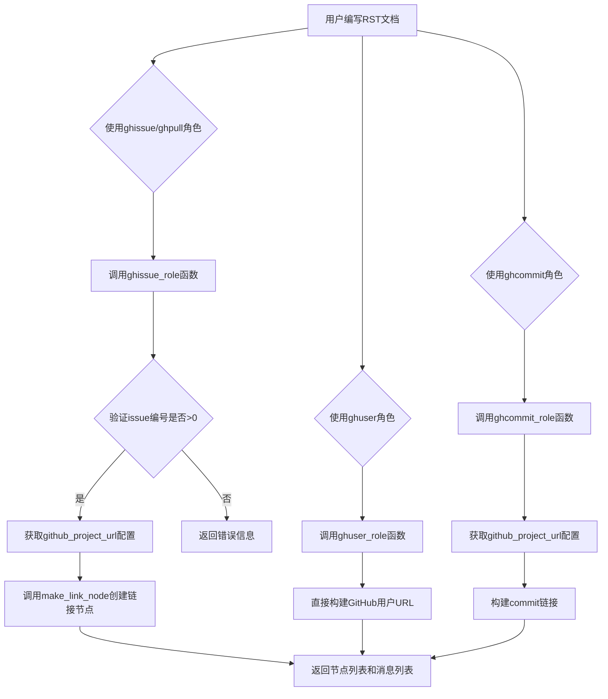
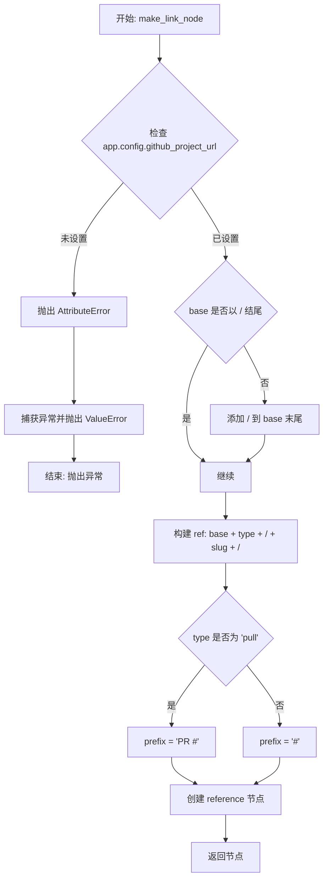
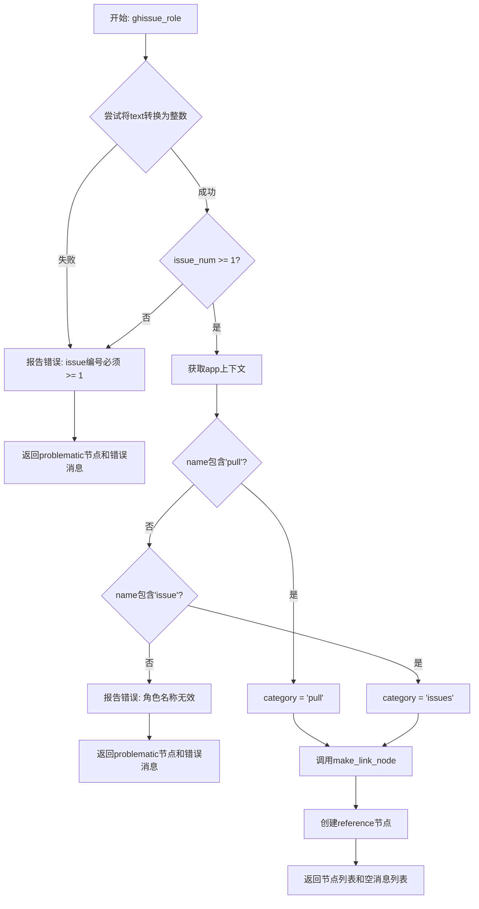
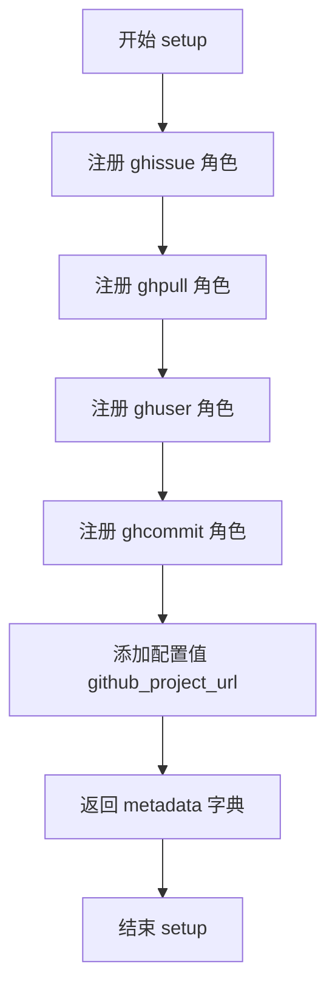

# `matplotlib\doc\sphinxext\github.py` 详细设计文档

这是一个Sphinx扩展模块，用于在reStructuredText文档中创建指向GitHub资源（issues、pull requests、users、commits）的超链接，支持通过RST角色（ghissue、ghpull、ghuser、ghcommit）快速引用GitHub相关内容。

## 整体流程



## 类结构

```
模块级别 (无类)
├── make_link_node (辅助函数)
├── ghissue_role (RST角色函数)
├── ghuser_role (RST角色函数)
├── ghcommit_role (RST角色函数)
└── setup (Sphinx插件入口函数)
```

## 全局变量及字段


### `make_link_node.rawtext`
    
Text being replaced with link node

类型：`str`
    


### `make_link_node.app`
    
Sphinx application context

类型：`Sphinx application context`
    


### `make_link_node.type`
    
Link type (issues, pull, changeset, etc.)

类型：`str`
    


### `make_link_node.slug`
    
ID of the thing to link to

类型：`str`
    


### `make_link_node.options`
    
Options dictionary passed to role func

类型：`dict`
    


### `make_link_node.base`
    
GitHub project base URL

类型：`str`
    


### `make_link_node.ref`
    
Full URL to the GitHub resource

类型：`str`
    


### `make_link_node.prefix`
    
Prefix for display text (e.g., 'PR #' for pull requests)

类型：`str`
    


### `make_link_node.node`
    
Docutils reference node

类型：`nodes.reference`
    


### `ghissue_role.name`
    
The role name used in the document

类型：`str`
    


### `ghissue_role.rawtext`
    
The entire markup snippet with role

类型：`str`
    


### `ghissue_role.text`
    
The text marked with the role

类型：`str`
    


### `ghissue_role.lineno`
    
The line number where rawtext appears in the input

类型：`int`
    


### `ghissue_role.inliner`
    
The inliner instance that called us

类型：`Inliner instance`
    


### `ghissue_role.options`
    
Directive options for customization

类型：`dict`
    


### `ghissue_role.content`
    
The directive content for customization

类型：`list`
    


### `ghissue_role.issue_num`
    
Parsed GitHub issue number

类型：`int`
    


### `ghissue_role.msg`
    
Error message for validation failures

类型：`system message`
    


### `ghissue_role.prb`
    
Problematic node for error display

类型：`nodes.problematic`
    


### `ghissue_role.category`
    
GitHub category (issues or pull)

类型：`str`
    


### `ghissue_role.node`
    
Docutils reference node to return

类型：`nodes.reference`
    


### `ghuser_role.name`
    
The role name used in the document

类型：`str`
    


### `ghuser_role.rawtext`
    
The entire markup snippet with role

类型：`str`
    


### `ghuser_role.text`
    
The text marked with the role (username)

类型：`str`
    


### `ghuser_role.lineno`
    
The line number where rawtext appears in the input

类型：`int`
    


### `ghuser_role.inliner`
    
The inliner instance that called us

类型：`Inliner instance`
    


### `ghuser_role.options`
    
Directive options for customization

类型：`dict`
    


### `ghuser_role.content`
    
The directive content for customization

类型：`list`
    


### `ghuser_role.ref`
    
Full URL to the GitHub user profile

类型：`str`
    


### `ghuser_role.node`
    
Docutils reference node to return

类型：`nodes.reference`
    


### `ghcommit_role.name`
    
The role name used in the document

类型：`str`
    


### `ghcommit_role.rawtext`
    
The entire markup snippet with role

类型：`str`
    


### `ghcommit_role.text`
    
The text marked with the role (commit hash)

类型：`str`
    


### `ghcommit_role.lineno`
    
The line number where rawtext appears in the input

类型：`int`
    


### `ghcommit_role.inliner`
    
The inliner instance that called us

类型：`Inliner instance`
    


### `ghcommit_role.options`
    
Directive options for customization

类型：`dict`
    


### `ghcommit_role.content`
    
The directive content for customization

类型：`list`
    


### `ghcommit_role.app`
    
Sphinx application context

类型：`Sphinx application context`
    


### `ghcommit_role.base`
    
GitHub project base URL

类型：`str`
    


### `ghcommit_role.ref`
    
Full URL to the GitHub commit

类型：`str`
    


### `ghcommit_role.node`
    
Docutils reference node to return

类型：`nodes.reference`
    


### `setup.app`
    
Sphinx application context

类型：`Sphinx application context`
    


### `setup.metadata`
    
Plugin metadata for parallel read/write safety

类型：`dict`
    
    

## 全局函数及方法


### `make_link_node`

创建指向 GitHub 资源的链接节点，处理配置获取、URL 构建和节点创建。

参数：

- `rawtext`：`str`，原始文本，被链接节点替换的文本
- `app`：`Sphinx application context`，Sphinx 应用程序上下文，用于获取配置
- `type`：`str`，链接类型（如 issues、pull 等）
- `slug`：`str`，要链接到的资源的 ID（如 issue 编号）
- `options`：`dict`，选项字典，传递给角色函数的选项

返回值：`docutils.nodes.reference`，生成的 docutils 引用节点对象

#### 流程图



#### 带注释源码

```python
def make_link_node(rawtext, app, type, slug, options):
    """
    Create a link to a github resource.

    :param rawtext: Text being replaced with link node.
    :param app: Sphinx application context
    :param type: Link type (issues, changeset, etc.)
    :param slug: ID of the thing to link to
    :param options: Options dictionary passed to role func.
    """

    # 尝试获取 GitHub 项目的基础 URL 配置
    try:
        base = app.config.github_project_url  # 从 Sphinx 配置获取 github_project_url
        if not base:  # 检查配置是否为空
            raise AttributeError  # 空值视为未设置
        if not base.endswith('/'):  # 确保 URL 以斜杠结尾
            base += '/'
    except AttributeError as err:  # 捕获配置缺失错误
        # 抛出有意义的错误信息
        raise ValueError(
            f'github_project_url configuration value is not set '
            f'({err})') from err

    # 构建完整的 GitHub 资源引用 URL
    ref = base + type + '/' + slug + '/'
    
    # 处理选项中的 CSS 类
    set_classes(options)
    
    # 根据类型确定链接文本前缀
    prefix = "#"
    if type == 'pull':  # Pull Request 类型使用 'PR #' 前缀
        prefix = "PR " + prefix
    
    # 创建 docutils 引用节点
    # rawtext: 原始标记文本
    # prefix + utils.unescape(slug): 显示文本（如 "#1" 或 "PR #123"）
    # refuri=ref: 实际的链接 URL
    # **options: 传递额外的选项（如 CSS 类）
    node = nodes.reference(rawtext, prefix + utils.unescape(slug), refuri=ref,
                           **options)
    return node
```


### `ghissue_role`

该函数是 Sphinx 扩展中的 RST 角色处理器，用于在文档中创建指向 GitHub Issue 或 Pull Request 的链接。它验证输入的 issue 编号是否有效，根据角色名称（ghissue 或 ghpull）确定链接类别，然后调用 `make_link_node` 生成对应的文档树节点。

参数：

- `name`：`str`，角色名称（如 "ghissue" 或 "ghpull"）
- `rawtext`：`str`，包含角色的完整 RST 标记文本
- `text`：`str`，角色标记的文本内容（即 issue 编号）
- `lineno`：`int`，在输入文档中的行号
- `inliner`：`docutils.parsers.rst.core.Inliner`，调用此角色的内联器实例，用于报告错误和生成问题节点
- `options`：`dict`，可选参数，用于自定义的指令选项（默认为空字典）
- `content`：`list`，可选参数，用于自定义的指令内容（默认为空列表）

返回值：`tuple[list, list]`，包含两个列表的元组——第一个是待插入文档的节点列表，第二个是系统消息列表。两者均可为空。

#### 流程图



#### 带注释源码

```python
def ghissue_role(name, rawtext, text, lineno, inliner, options={}, content=[]):
    """
    Link to a GitHub issue.

    Returns 2 part tuple containing list of nodes to insert into the
    document and a list of system messages.  Both are allowed to be
    empty.

    :param name: The role name used in the document.
    :param rawtext: The entire markup snippet, with role.
    :param text: The text marked with the role.
    :param lineno: The line number where rawtext appears in the input.
    :param inliner: The inliner instance that called us.
    :param options: Directive options for customization.
    :param content: The directive content for customization.
    """

    # 验证输入的issue编号是否为有效的正整数
    try:
        issue_num = int(text)  # 尝试将文本转换为整数
        if issue_num <= 0:    # issue编号必须大于等于1
            raise ValueError
    except ValueError:
        # 转换失败或值无效，生成错误报告
        msg = inliner.reporter.error(
            'GitHub issue number must be a number greater than or equal to 1; '
            '"%s" is invalid.' % text, line=lineno)
        # 创建problematic节点标记文档中的错误
        prb = inliner.problematic(rawtext, rawtext, msg)
        # 返回错误节点和错误消息
        return [prb], [msg]

    # 获取Sphinx应用上下文，用于访问配置
    app = inliner.document.settings.env.app

    # 根据角色名称确定链接类别（pull request 或 issue）
    if 'pull' in name.lower():
        category = 'pull'      # 用于PR链接
    elif 'issue' in name.lower():
        category = 'issues'    # 用于issue链接
    else:
        # 角色名称无效，报告错误
        msg = inliner.reporter.error(
            'GitHub roles include "ghpull" and "ghissue", '
            '"%s" is invalid.' % name, line=lineno)
        prb = inliner.problematic(rawtext, rawtext, msg)
        return [prb], [msg]

    # 调用辅助函数创建指向GitHub资源的链接节点
    node = make_link_node(rawtext, app, category, str(issue_num), options)
    
    # 返回节点列表（用于插入文档）和空消息列表（无错误）
    return [node], []
```


### `ghuser_role`

该函数是Sphinx文档工具的一个角色处理器，用于在文档中创建指向GitHub用户主页的链接。它接收RST角色参数，构造GitHub用户URL，并返回docutils节点以渲染为可点击链接。

参数：

- `name`：`str`，角色名称（如"ghuser"）
- `rawtext`：`str`，包含角色的完整RST标记文本
- `text`：`str`，角色标记后的文本（即用户名）
- `lineno`：`int`，rawtext在输入文档中的行号
- `inliner`：`Inliner`，调用此函数的内联器实例，用于报告错误
- `options`：`dict`，可选的指令选项字典，用于自定义链接样式
- `content`：`list`，可选的指令内容列表

返回值：`tuple[list, list]`，包含两个元素的元组——第一个是docutils节点列表（用于插入文档），第二个是系统消息列表（用于报告错误或警告）。两者均可为空列表。

#### 流程图

```mermaid
flowchart TD
    A[开始: ghuser_role] --> B[构造GitHub用户URL]
    B --> C[ref = 'https://www.github.com/' + text]
    C --> D[创建reference节点]
    D --> E[node = nodes.reference<br/>rawtext, text, refuri=ref, **options]
    E --> F[返回节点和空消息列表]
    F --> G[返回 [node], []]
```

#### 带注释源码

```python
def ghuser_role(name, rawtext, text, lineno, inliner, options={}, content=[]):
    """
    Link to a GitHub user.

    Returns 2 part tuple containing list of nodes to insert into the
    document and a list of system messages.  Both are allowed to be
    empty.

    :param name: The role name used in the document.
    :param rawtext: The entire markup snippet, with role.
    :param text: The text marked with the role.
    :param lineno: The line number where rawtext appears in the input.
    :param inliner: The inliner instance that called us.
    :param options: Directive options for customization.
    :param content: The directive content for customization.
    """
    # 构造GitHub用户主页URL: https://www.github.com/{用户名}
    ref = 'https://www.github.com/' + text
    
    # 创建docutils reference节点，用于渲染为HTML链接
    # 参数: rawtext-原始文本, text-显示文本, refuri-链接目标地址
    # **options将额外的样式选项传入节点
    node = nodes.reference(rawtext, text, refuri=ref, **options)
    
    # 返回2元素元组: [节点列表, 消息列表]
    # 节点列表会被插入到最终文档中
    # 消息列表用于报告错误/警告，此处无错误故为空列表
    return [node], []
```


### `ghcommit_role`

该函数是 Sphinx reStructuredText (RST) 的一个自定义角色（role），用于在文档中创建指向 GitHub 提交的链接。它接收 RST 文本中的角色标记，解析commit哈希值，验证配置，并返回一个包含指向GitHub提交页面的引用节点（reference node）的元组。

参数：

- `name`：`str`，在文档中使用的角色名称
- `rawtext`：`str`，包含角色的整个标记片段
- `text`：`str`，标记为角色的文本（即commit哈希值）
- `lineno`：`int`，rawtext出现在输入中的行号
- `inliner`：`obj`，调用此函数的内联器实例
- `options`：`dict`，用于自定义的指令选项
- `content`：`list`，用于自定义的指令内容

返回值：`tuple[list, list]`，包含要插入文档的节点列表和系统消息列表的二元组，两者都可能为空

#### 流程图

```mermaid
flowchart TD
    A[开始 ghcommit_role] --> B[从 inliner 获取 app]
    B --> C{验证 github_project_url}
    C -->|未设置| D[抛出 ValueError 异常]
    C -->|已设置| E{base 是否以 / 结尾}
    E -->|否| F[添加 / 到 base 末尾]
    E -->|是| G[继续]
    F --> G
    G --> H[构造 ref = base + text]
    H --> I[创建 reference 节点<br/>显示前6位commit哈希]
    I --> J[返回 [node], []]
```

#### 带注释源码

```python
def ghcommit_role(
        name, rawtext, text, lineno, inliner, options={}, content=[]):
    """
    Link to a GitHub commit.

    Returns 2 part tuple containing list of nodes to insert into the
    document and a list of system messages.  Both are allowed to be
    empty.

    :param name: The role name used in the document.
    :param rawtext: The entire markup snippet, with role.
    :param text: The text marked with the role.
    :param lineno: The line number where rawtext appears in the input.
    :param inliner: The inliner instance that called us.
    :param options: Directive options for customization.
    :param content: The directive content for customization.
    """
    # 从 inliner 获取 Sphinx 应用上下文
    app = inliner.document.settings.env.app
    
    # 尝试获取并验证 github_project_url 配置
    try:
        base = app.config.github_project_url
        if not base:
            raise AttributeError
        # 确保 URL 以斜杠结尾，便于拼接
        if not base.endswith('/'):
            base += '/'
    except AttributeError as err:
        # 配置未设置时抛出详细错误信息
        raise ValueError(
            f'github_project_url configuration value is not set '
            f'({err})') from err

    # 构造完整的 GitHub 提交链接 URL
    ref = base + text
    
    # 创建引用节点，显示 commit 哈希的前6位
    # text[:6] 通常显示缩短的 commit hash
    node = nodes.reference(rawtext, text[:6], refuri=ref, **options)
    
    # 返回节点列表和空消息列表
    return [node], []
```


### `setup`

该函数是Sphinx插件的入口点，用于安装GitHub相关的文本角色（roles）到Sphinx应用程序中，并配置项目URL等参数，使文档能够支持链接到GitHub issues、pull requests、users和commits。

参数：

-  `app`：`Sphinx.application`，Sphinx应用程序上下文，用于注册角色和配置值

返回值：`dict`，包含插件的并行读写安全元数据

#### 流程图



#### 带注释源码

```python
def setup(app):
    """
    Install the plugin.

    :param app: Sphinx application context.
    """
    # 注册 ghissue 角色，用于链接到 GitHub Issue
    app.add_role('ghissue', ghissue_role)
    
    # 注册 ghpull 角色，用于链接到 GitHub Pull Request（复用 ghissue_role 函数）
    app.add_role('ghpull', ghissue_role)
    
    # 注册 ghuser 角色，用于链接到 GitHub 用户
    app.add_role('ghuser', ghuser_role)
    
    # 注册 ghcommit 角色，用于链接到 GitHub 提交
    app.add_role('ghcommit', ghcommit_role)
    
    # 添加配置值 github_project_url，默认值为 None，作用域为 'env'
    app.add_config_value('github_project_url', None, 'env')

    # 定义插件的元数据，表明插件支持并行读写
    metadata = {'parallel_read_safe': True, 'parallel_write_safe': True}
    
    # 返回元数据字典
    return metadata
```

## 关键组件


### make_link_node

创建GitHub资源链接的辅助函数，负责构造URL、设置链接前缀（Issue用#，PR用PR #）并生成docutils的reference节点。

### ghissue_role

处理GitHub Issue链接的角色函数，验证issue编号有效性（必须为>=1的整数），根据角色名称判断链接类别（issue或pull），返回包含链接节点的元组。

### ghpull_role

处理GitHub Pull Request链接的角色函数，代码中直接复用ghissue_role实现，通过检测角色名中是否包含'pull'来设置正确的链接类别。

### ghuser_role

处理GitHub用户链接的角色函数，将文本转换为GitHub用户主页URL（https://www.github.com/{username}），返回对应的reference节点。

### ghcommit_role

处理GitHub提交链接的角色函数，从Sphinx配置获取项目基础URL，构造完整提交链接，显示时截取前6位哈希值。

### setup

Sphinx插件入口函数，注册四个角色（ghissue、ghpull、ghuser、ghcommit）和一个配置项（github_project_url），返回并行读写安全元数据。

### 配置项 github_project_url

Sphinx配置值，用于存储GitHub项目的基础URL，角色函数据此构建完整链接。


## 问题及建议


### 已知问题

- **代码重复**：ghissue_role 和 ghpull_role 逻辑几乎完全相同，仅 category 不同，可合并为一个函数
- **URL 构建方式不安全**：使用字符串拼接（+）构建 URL，应使用 urllib.parse.urljoin 避免路径错误
- **可变默认参数**：函数签名中使用 `options={}` 和 `content=[]` 作为默认参数，这是 Python 反模式，可能导致意外的列表共享问题
- **ghuser_role 硬编码 URL**：与其他角色使用配置不同，ghuser_role 硬编码了 `https://www.github.com/`，缺乏灵活性
- **缺少输入验证**：ghcommit_role 未验证 text 是否为有效的 commit SHA 格式
- **配置检查重复**：make_link_node 和 ghcommit_role 中都有相同的 github_project_url 配置检查逻辑，可提取为辅助函数
- **无单元测试**：代码缺少测试覆盖

### 优化建议

- 提取配置检查逻辑为独立函数 `get_github_base_url(app)`
- 将 ghissue_role 和 ghpull_role 合并为一个带参数的函数
- 将 `options={}` 和 `content=[]` 默认参数改为 `options=None` 并在函数内初始化
- 为 ghcommit_role 添加 commit SHA 格式验证
- 使用 urllib.parse.urljoin 替代字符串拼接构建 URL
- 考虑将 "PR " 前缀抽取为配置项
- 添加单元测试覆盖核心逻辑

## 其它


### 设计目标与约束

本Sphinx扩展的设计目标是提供一个轻量级的文档内联角色（inline role）系统，使文档作者能够在reStructuredText文档中便捷地创建指向GitHub资源的链接，包括Issue、Pull Request、用户和提交记录。约束条件包括：1) 依赖Sphinx应用上下文获取配置；2) 需要在Sphinx配置中设置github_project_url；3) 仅支持静态链接生成，不支持动态API调用；4) 必须兼容Sphinx的并行读取和写入功能。

### 错误处理与异常设计

代码采用多层异常处理机制。在make_link_node函数中，使用try-except捕获AttributeError，当github_project_url未配置或配置值不符合要求时，抛出ValueError并携带详细错误信息。在ghissue_role中，使用try-except捕获ValueError来处理无效的issue编号（非数字或小于1），通过inliner.reporter.error生成文档级别错误。在ghcommit_role中复用类似的错误处理模式。ghuser_role不进行输入验证，直接使用文本构建URL。setup函数返回元数据字典表明并行安全性，但不处理运行时异常。

### 数据流与状态机

数据流主要分为三路：1) Issue/Pull Request流程：用户输入文本 -> ghissue_role解析 -> 验证数字有效性 -> 判断类别(pull/issues) -> make_link_node获取配置构建URL -> 生成reference节点返回；2) User流程：用户输入文本 -> ghuser_role直接构建GitHub用户URL -> 生成reference节点返回；3) Commit流程：用户输入文本 -> ghcommit_role获取配置验证 -> 直接使用文本作为slug构建URL -> 生成reference节点返回。无状态机设计，角色函数均为无状态函数，每次调用独立处理。

### 外部依赖与接口契约

主要外部依赖包括：1) docutils.nodes模块，提供reference节点类用于构建链接；2) docutils.utils模块，提供unescape函数用于处理转义文本；3) docutils.parsers.rst.roles模块，提供set_classes函数处理选项类；4) Sphinx应用对象，用于获取配置和注册角色。接口契约方面：setup函数接受app参数并返回元数据字典，角色函数遵循docutils角色接口签名(name, rawtext, text, lineno, inliner, options, content)并返回(node_list, message_list)元组。

### 配置项说明

本扩展提供一个Sphinx配置项：github_project_url，位于github_project_url键下，默认为None， rebuild条件为'env'（配置变更时重建环境）。该配置项必须设置为有效的GitHub项目URL，格式如https://github.com/username/repository/，make_link_node和ghcommit_role函数会检查该配置并在末尾自动添加斜杠。

### 使用示例

在RST文档中使用本扩展的角色：
```
:ghissue:`123` - 链接到Issue #123
:ghpull:`456` - 链接到Pull Request #456  
:ghuser:`octocat` - 链接到GitHub用户octocat
:ghcommit:`abc123def` - 链接到提交abc123def
```
需要在conf.py中配置：github_project_url = "https://github.com/sphinx-doc/sphinx/"

### 版本兼容性说明

代码依赖Python 3的f-string语法（make_link_node和ghcommit_role中使用），需Python 3.6+。使用dict默认值{}作为函数可选参数（options={}）是Python可变默认参数的反模式，但在docutils角色接口中这是约定俗成的用法。parallel_read_safe和parallel_write_safe元数据表明支持Sphinx 1.3+的并行构建。

### 安全考虑

ghuser_role直接使用用户输入构建URL，存在潜在的开放重定向风险，如果text字段包含恶意构造的URL。ghissue_role和ghcommit_role使用项目URL作为基础，可降低此风险。建议在ghuser_role中添加URL验证逻辑，确保text仅为有效的GitHub用户名格式。配置项github_project_url需由文档维护者控制，确保可信。

### 性能特性

角色函数均为轻量级字符串处理和节点创建，无网络请求或重计算。make_link_node中对base URL的字符串处理（检查末尾斜杠）每次调用执行，可考虑在setup时预处理配置值以优化。节点创建使用docutils高效API，总体性能开销可忽略。


    