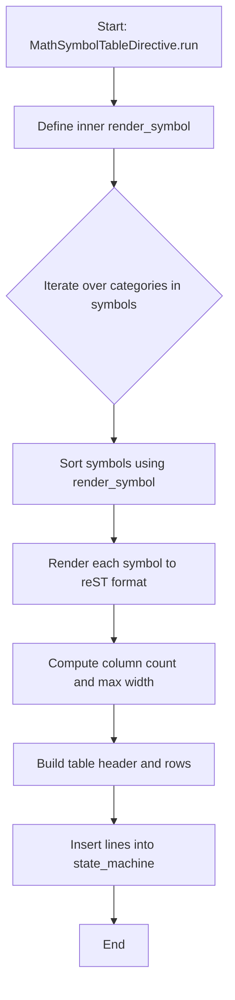
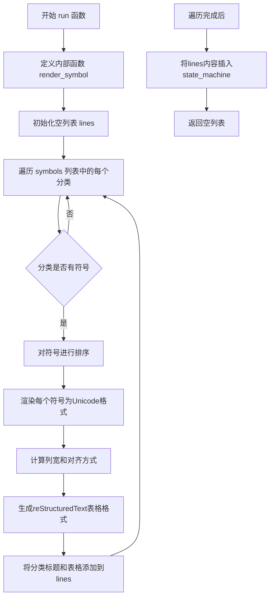
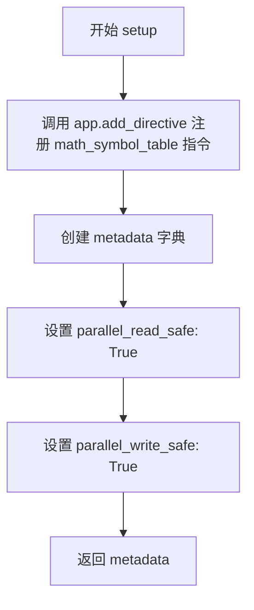
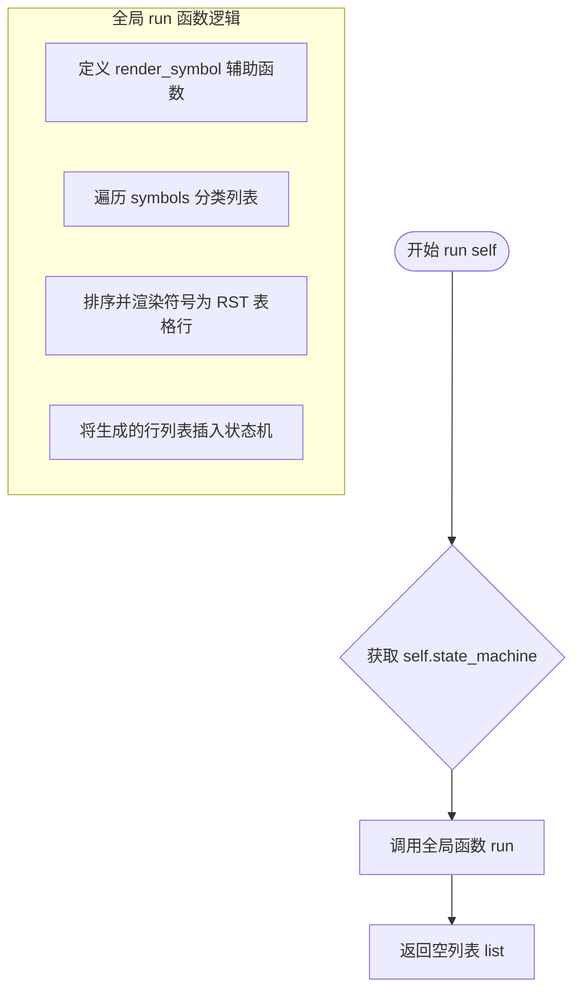
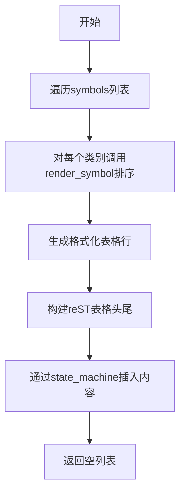

# `matplotlib\doc\sphinxext\math_symbol_table.py` 详细设计文档

A Sphinx reStructuredText directive that generates a table of LaTeX math symbols from matplotlib's internal symbol data for documentation.

## 整体流程



## 类结构

```
Directive (docutils.parsers.rst.Directive)
└── MathSymbolTableDirective
```

## 全局变量及字段


### `re`
    
Python standard library module for regular expressions

类型：`module`
    


### `Directive`
    
Base class for reStructuredText directives in docutils

类型：`class`
    


### `_mathtext`
    
Matplotlib's internal module for parsing and rendering mathematical text

类型：`module`
    


### `_mathtext_data`
    
Matplotlib's internal module containing mathematical text symbol data

类型：`module`
    


### `bb_pattern`
    
Compiled regex pattern to match blackboard bold capital letters (BbbA-Z)

类型：`re.Pattern`
    


### `scr_pattern`
    
Compiled regex pattern to match script letters (scra-zA-Z)

类型：`re.Pattern`
    


### `frak_pattern`
    
Compiled regex pattern to match Fraktur capital letters (frakA-Z)

类型：`re.Pattern`
    


### `symbols`
    
List of symbol categories with column count and symbol collections for documentation generation

类型：`list`
    


### `MathSymbolTableDirective.has_content`
    
Flag indicating whether the directive accepts content blocks

类型：`bool`
    


### `MathSymbolTableDirective.required_arguments`
    
Number of required positional arguments for the directive

类型：`int`
    


### `MathSymbolTableDirective.optional_arguments`
    
Number of optional positional arguments for the directive

类型：`int`
    


### `MathSymbolTableDirective.final_argument_whitespace`
    
Flag allowing whitespace after the final argument

类型：`bool`
    


### `MathSymbolTableDirective.option_spec`
    
Dictionary mapping option names to validator functions for directive options

类型：`dict`
    
    

## 全局函数及方法


### `run`

该函数是Sphinx数学符号表生成器的核心逻辑，接收文档状态机作为参数，遍历预定义的符号分类列表，通过自定义的符号渲染逻辑将每个LaTeX符号转换为Unicode字符，并按列对齐格式化为reStructuredText表格文本，最后将生成的表格内容插入到文档状态机中。

参数：

- `state_machine`：`state_machine`，Sphinx文档处理状态机对象，用于插入生成的符号表内容

返回值：`list`，返回空列表，表示该指令不产生任何警告或消息

#### 流程图



#### 带注释源码

```python
def run(state_machine):
    """
    生成数学符号表并插入到Sphinx文档状态机中。
    
    该函数遍历预定义的符号分类，将每个LaTeX符号渲染为Unicode字符，
    并按照列数和对齐规则生成reStructuredText格式的表格。
    
    参数:
        state_machine: Sphinx文档处理的状态机对象，用于插入生成的表格内容
        
    返回:
        list: 返回空列表，表示无警告信息
    """
    
    def render_symbol(sym, ignore_variant=False):
        """
        将LaTeX符号渲染为Unicode字符或LaTeX命令。
        
        该内部函数处理单个符号的转换：
        - 处理变体符号（如\\varo），将\\var前缀替换为反斜杠
        - 对于反斜杠开头的符号，查找对应的Unicode字符
        - 保留特殊符号如\\、|、+、-、*的原样输出
        
        参数:
            sym: LaTeX符号字符串
            ignore_variant: 是否忽略变体形式，默认为False
            
        返回:
            str: 渲染后的符号字符串
        """
        # 如果忽略变体且符号不是特殊符号，替换\\var为\\
        if ignore_variant and sym not in (r"\varnothing", r"\varlrtriangle"):
            sym = sym.replace(r"\var", "\\")
        
        # 如果符号以反斜杠开头，尝试转换为Unicode
        if sym.startswith("\\"):
            sym = sym.lstrip("\\")  # 移除前导反斜杠
            # 检查是否为函数名或特殊函数
            if sym not in (_mathtext.Parser._overunder_functions |
                           _mathtext.Parser._function_names):
                # 查找Unicode码点并转换为字符
                sym = chr(_mathtext_data.tex2uni[sym])
        
        # 对于特殊符号，添加反斜杠前缀
        return f'\\{sym}' if sym in ('\\', '|', '+', '-', '*') else sym

    # 初始化存储表格行的列表
    lines = []
    
    # 遍历所有符号分类
    for category, columns, syms in symbols:
        # 对符号进行排序：
        # 1. 按渲染后的Unicode字符排序
        # 2. 变体符号排在标准版本之后
        syms = sorted(syms,
                      # Sort by Unicode and place variants immediately
                      # after standard versions.
                      key=lambda sym: (render_symbol(sym, ignore_variant=True),
                                       sym.startswith(r"\var")),
                      reverse=(category == "Hebrew"))  # Hebrew is rtl
        
        # 渲染每个符号，格式为"渲染符号 ``原始LaTeX``"
        rendered_syms = [f"{render_symbol(sym)} ``{sym}``" for sym in syms]
        
        # 确定实际使用的列数（不能超过符号数量）
        columns = min(columns, len(syms))
        
        # 添加分类标题（粗体）
        lines.append("**%s**" % category)
        lines.append('')  # 空行
        
        # 计算最大宽度用于对齐
        max_width = max(map(len, rendered_syms))
        
        # 生成表头分隔线
        header = (('=' * max_width) + ' ') * columns
        lines.append(header.rstrip())
        
        # 按列分组生成表格行
        for part in range(0, len(rendered_syms), columns):
            row = " ".join(
                sym.rjust(max_width) for sym in rendered_syms[part:part + columns])
            lines.append(row)
        
        # 添加表尾分隔线
        lines.append(header.rstrip())
        lines.append('')  # 空行

    # 将生成的表格内容插入到文档状态机
    # source_name设为"Symbol table"用于调试和跟踪
    state_machine.insert_input(lines, "Symbol table")
    
    # 返回空列表表示无警告
    return []
```


### `setup`

该函数是 Sphinx 扩展的入口点，用于注册自定义的 `math_symbol_table` 指令到 Sphinx 应用中，并返回扩展的元数据信息。

参数：

-  `app`：`Sphinx`，Sphinx 应用实例，用于注册指令和获取配置

返回值：`dict`，包含 `'parallel_read_safe'` 和 `'parallel_write_safe'` 两个键，指示该扩展是否支持并行读写

#### 流程图



#### 带注释源码

```python
def setup(app):
    """
    Sphinx 扩展的入口函数，用于注册自定义指令和返回元数据。
    
    参数:
        app: Sphinx 应用实例，用于注册指令和获取配置
    返回:
        dict: 包含扩展元数据的字典
    """
    # 注册名为 "math_symbol_table" 的指令，关联到 MathSymbolTableDirective 类
    app.add_directive("math_symbol_table", MathSymbolDirective)

    # 定义扩展的并行读写安全性元数据
    metadata = {'parallel_read_safe': True, 'parallel_write_safe': True}
    # 返回元数据供 Sphinx 在加载扩展时使用
    return metadata
```


### `MathSymbolTableDirective.run`

该方法是 `MathSymbolTableDirective` 类的核心执行入口。作为 reStructuredText (RST) 指令的实现，它不直接处理复杂的渲染逻辑，而是充当一个控制器，将指令上下文中的 `state_machine` 传递给全局的 `run` 函数，以生成并插入数学符号表文档。

#### 参数

- `self`：`MathSymbolTableDirective`，指令的实例对象。包含了指令的上下文信息，核心使用 `self.state_machine` 来向文档流中注入生成的文本。

#### 返回值

- `list`，返回一个空列表。在 docutils 架构中，指令通过 `state_machine` 直接修改文档流时，通常返回空列表以表示无需返回额外的文档树节点。

#### 流程图



#### 带注释源码

```python
class MathSymbolTableDirective(Directive):
    """
    用于在文档中插入数学符号表的 RST 指令类。
    """
    has_content = False  # 指令不接受直接内容块
    required_arguments = 0
    optional_arguments = 0
    final_argument_whitespace = False
    option_spec = {}

    def run(self):
        """
        指令的执行入口。
        负责提取状态机并调用全局的符号表生成逻辑。
        """
        # 调用全局函数 run，传入 docutils 的状态机以注入生成的文本
        return run(self.state_machine)


def run(state_machine):
    """
    处理符号表数据并生成 RST 格式表格的全局函数。
    
    参数:
        state_machine: docutils 的状态机对象，用于插入输入流。
    """
    # --- 内部辅助函数: 渲染单个符号 ---
    def render_symbol(sym, ignore_variant=False):
        # 处理变体符号，例如将 \varalpha 转换为 \alpha 以进行排序
        if ignore_variant and sym not in (r"\varnothing", r"\varlrtriangle"):
            sym = sym.replace(r"\var", "\\")
        
        # 去除反斜杠，尝试转换为 Unicode 字符（如果不是函数名）
        if sym.startswith("\\"):
            sym = sym.lstrip("\\")
            # 检查是否为数学函数名
            if sym not in (_mathtext.Parser._overunder_functions |
                           _mathtext.Parser._function_names):
                # 尝试从映射表中查找 Unicode 码点
                sym = chr(_mathtext_data.tex2uni[sym])
        
        # 保持 LaTeX 逃逸字符的格式
        return f'\\{sym}' if sym in ('\\', '|', '+', '-', '*') else sym

    lines = [] # 用于存储生成的 RST 文本行
    
    # --- 遍历所有预定义的符号分类 ---
    for category, columns, syms in symbols:
        # 对符号进行排序：
        # 1. 按渲染后的符号排序（忽略变体前缀）
        # 2. 将变体版本（如 \varepsilon）排在标准版本（如 \epsilon）之后
        # 3. 希伯来文需要反转（RTL）
        syms = sorted(syms,
                      key=lambda sym: (render_symbol(sym, ignore_variant=True),
                                       sym.startswith(r"\var")),
                      reverse=(category == "Hebrew"))
        
        # 格式化每个符号为 "渲染结果 ``源码``" 的形式
        rendered_syms = [f"{render_symbol(sym)} ``{sym}``" for sym in syms]
        
        # 计算列宽和表头
        columns = min(columns, len(syms))
        lines.append("**%s**" % category)
        lines.append('')
        max_width = max(map(len, rendered_syms))
        header = (('=' * max_width) + ' ') * columns
        lines.append(header.rstrip())
        
        # 分行处理，形成 RST 表格
        for part in range(0, len(rendered_syms), columns):
            row = " ".join(
                sym.rjust(max_width) for sym in rendered_syms[part:part + columns])
            lines.append(row)
        lines.append(header.rstrip())
        lines.append('')

    # --- 注入文档流 ---
    # 将生成的 lines 作为输入源插入到当前解析状态
    state_machine.insert_input(lines, "Symbol table")
    return [] # 指令成功执行，返回空节点列表
```

---

### 关键组件与依赖信息

1.  **symbols (全局列表)**：存储了所有符号类别（希腊字母、希伯来字母、运算符等）及其原始 LaTeX 表达式。
2.  **_mathtext 与 _mathtext_data (外部依赖)**：这是 Matplotlib 的内部模块，提供了 LaTeX 符号到 Unicode 的映射转换。
3.  **render_symbol (内部函数)**：负责将 LaTeX 符号字符串转换为适合排序和展示的格式。

---

### 潜在的技术债务与优化空间

1.  **性能优化 (render_symbol)**：
    *   **问题**：每次调用全局 `run` 函数时，都会重新定义内部的 `render_symbol` 函数。虽然 Python 解释器对此有优化，但在处理大量符号表时，逻辑上将其提取到模块级别或缓存结果会更佳。
    *   **建议**：将 `render_symbol` 提取为模块级函数或使用 `functools.lru_cache` 缓存转换结果（如果输入是确定性的）。

2.  **代码耦合**：
    *   **问题**：该模块直接访问了 Matplotlib 的私有 API (`_mathtext.Parser._function_names`, `_mathtext_data.tex2uni`)。这些内部实现可能会在 Matplotlib 升级时发生变化，导致该指令失效。
    *   **建议**：考虑通过官方公共 API 或更稳定的接口获取符号映射，减少对私有实现细节的强耦合。

3.  **硬编码与可扩展性**：
    *   **问题**：所有的符号分类和排序逻辑都硬编码在 `symbols` 列表和 `run` 函数的循环中。如果用户想添加自定义分类，只能修改源码。
    *   **建议**：如果需要提供更高的灵活性，可以考虑将符号表配置外部化（例如 YAML/JSON 配置文件），但考虑到这是一个生成文档帮助的工具，当前设计尚可接受。

## 关键组件


### 概述

该代码是一个Sphinx文档扩展模块，用于生成数学符号表的reStructuredText（reST）标记，通过解析matplotlib的_mathtext和_mathtext_data模块中的符号数据，按照Unicode排序生成格式化的符号表格，包含希腊字母、希伯来字母、定界符、运算符、关系符、箭头符等各类数学符号的LaTeX命令与Unicode字符对应关系。

### 整体运行流程

1. **模块加载阶段**：导入正则表达式模块和Sphinx Directive类，编译用于匹配特殊字符集的正则表达式（bb_pattern, scr_pattern, frak_pattern）
2. **符号数据准备阶段**：构建symbols列表，从matplotlib._mathtext和_mathtext_data模块获取各类符号数据
3. **指令触发阶段**：当Sphinx解析文档遇到"math_symbol_table"指令时，实例化MathSymbolTableDirective
4. **表格生成阶段**：run()函数对每个符号类别进行排序处理，render_symbol()函数将LaTeX命令转换为可显示符号
5. **输出阶段**：生成reST格式的表格字符串，通过state_machine.insert_input()插入文档

### 类详细信息

#### MathSymbolTableDirective类

| 字段 | 类型 | 描述 |
|------|------|------|
| has_content | bool | 指示指令是否有内容块，此处设为False |
| required_arguments | int | 必需参数数量，此处为0 |
| optional_arguments | int | 可选参数数量，此处为0 |
| final_argument_whitespace | bool | 最终参数是否允许空白，此处为False |
| option_spec | dict | 指令选项规范，此处为空字典 |

| 方法 | 参数 | 类型 | 返回值 | 描述 |
|------|------|------|--------|------|
| run | self | - | list | 执行指令，调用run()函数生成符号表并返回空列表 |

### 全局变量和全局函数详细信息

#### 全局变量

| 名称 | 类型 | 描述 |
|------|------|------|
| bb_pattern | re.Pattern | 编译后的正则表达式，用于匹配黑板粗体大写字母（如A-Z） |
| scr_pattern | re.Pattern | 编译后的正则表达式，用于匹配手写体字母（scr[a-zA-Z]） |
| frak_pattern | re.Pattern | 编译后的正则表达式，用于匹配花体大写字母（Fraktur A-Z） |
| symbols | list | 符号类别列表，每个元素为[类别名, 列数, 符号元组/列表]的三元组 |

#### 全局函数

**run(state_machine)**

| 参数名称 | 参数类型 | 参数描述 |
|----------|----------|----------|
| state_machine | StateMachine | Sphinx的状态机对象，用于插入生成的reST内容 |

| 返回值类型 | 返回值描述 |
|------------|------------|
| list | 返回空列表，表示指令执行完成 |

**mermaid流程图**



**带注释源码**

```python
def run(state_machine):
    """主函数：生成数学符号表"""
    
    def render_symbol(sym, ignore_variant=False):
        """内部函数：将LaTeX符号转换为可显示形式"""
        # 处理变体符号，如\varnothing和\varlrtriangle
        if ignore_variant and sym not in (r"\varnothing", r"\varlrtriangle"):
            sym = sym.replace(r"\var", "\\")  # 替换\var为\
        if sym.startswith("\\"):
            sym = sym.lstrip("\\")  # 去掉前导反斜杠
            # 如果不是函数名，则转换为Unicode字符
            if sym not in (_mathtext.Parser._overunder_functions |
                           _mathtext.Parser._function_names):
                sym = chr(_mathtext_data.tex2uni[sym])
        # 处理特殊符号需要保留反斜杠
        return f'\\{sym}' if sym in ('\\', '|', '+', '-', '*') else sym

    lines = []  # 存储生成的reST行
    for category, columns, syms in symbols:
        # 按Unicode排序，变体符号排在标准符号后面
        syms = sorted(syms,
                      key=lambda sym: (render_symbol(sym, ignore_variant=True),
                                       sym.startswith(r"\var")),
                      reverse=(category == "Hebrew"))  # 希伯来文从右到左
        # 生成格式化后的符号列表
        rendered_syms = [f"{render_symbol(sym)} ``{sym}``" for sym in syms]
        # 计算列数
        columns = min(columns, len(syms))
        lines.append("**%s**" % category)  # 类别标题
        lines.append('')
        max_width = max(map(len, rendered_syms))  # 最大宽度
        # 生成表格分隔行
        header = (('=' * max_width) + ' ') * columns
        lines.append(header.rstrip())
        # 生成表格数据行
        for part in range(0, len(rendered_syms), columns):
            row = " ".join(
                sym.rjust(max_width) for sym in rendered_syms[part:part + columns])
            lines.append(row)
        lines.append(header.rstrip())
        lines.append('')

    state_machine.insert_input(lines, "Symbol table")  # 插入内容
    return []
```

**setup(app)**

| 参数名称 | 参数类型 | 参数描述 |
|----------|----------|----------|
| app | Sphinx | Sphinx应用程序实例 |

| 返回值类型 | 返回值描述 |
|------------|------------|
| dict | 返回包含parallel_read_safe和parallel_write_safe的元数据字典 |

```python
def setup(app):
    """Sphinx扩展入口函数"""
    app.add_directive("math_symbol_table", MathSymbolTableDirective)

    metadata = {'parallel_read_safe': True, 'parallel_write_safe': True}
    return metadata
```

### 关键组件信息

#### 张量索引与惰性加载

该代码不涉及张量操作，采用直接加载方式从matplotlib._mathtext和_mathtext_data模块获取符号数据，数据在模块导入时即被加载到symbols列表中。

#### 反量化支持

不涉及量化操作，无反量化支持需求。

#### 量化策略

无量化相关功能。

#### 正则表达式符号匹配模式

使用三个预编译正则表达式（bb_pattern, scr_pattern, frak_pattern）匹配Unicode符号库中的特定字符集，用于生成黑板粗体、手写体和花体字符的符号列表。

#### 符号渲染核心函数

render_symbol()函数负责将LaTeX命令转换为可显示的Unicode字符，处理变体符号（如\varnothing）和特殊符号（反斜杠、竖线等）的边界情况。

### 潜在的技术债务或优化空间

1. **硬编码符号数据依赖**：symbols列表中的部分数据直接从_mathtext.Parser的私有属性获取（如_delims、_function_names等），这些私有API可能在版本升级时发生变化
2. **缺少错误处理**：render_symbol函数中访问_mathtext_data.tex2uni字典时未进行键存在性检查，可能在数据不一致时抛出KeyError异常
3. **重复计算**：render_symbol函数在排序键和渲染过程中被多次调用，可考虑缓存渲染结果
4. **静态正则表达式**：三个正则模式在模块加载时即被编译，但如果_mathtext_data.tex2uni内容变化，这些预编译模式可能失效

### 其它项目

#### 设计目标与约束

- **设计目标**：为Sphinx文档系统提供自动生成数学符号表的功能，减少手动维护工作量
- **约束**：依赖matplotlib内部实现细节，符号数据来源于_mathtext.Parser的私有属性和_mathtext_data.tex2uni字典

#### 错误处理与异常设计

- 符号查找失败时chr()函数会抛出ValueError（当Unicode码点无效时）
- 正则匹配失败时返回空列表，不会导致文档构建中断
- 缺少对_mathtext_data.tex2uni中不存在的符号的显式错误报告机制

#### 数据流与状态机

- 数据流：matplotlib模块 → symbols列表 → render_symbol()处理 → reST格式表格 → state_machine.insert_input() → 文档输出
- 状态机：Sphinx的StateMachine对象负责管理文档解析状态和内容插入

#### 外部依赖与接口契约

- **docutils.parsers.rst.Directive**：Sphinx指令基类
- **matplotlib._mathtext**：提供Parser类的_delims、_function_names、_overunder_functions等属性
- **matplotlib._mathtext_data**：提供tex2uni字典，包含LaTeX命令到Unicode码点的映射
- **Sphinx应用接口**：add_directive()方法注册自定义指令，返回元数据字典表明并行读写安全性


## 问题及建议


### 已知问题

- **硬编码的正则表达式模式**：模块级编译的 `bb_pattern`、`scr_pattern`、`frak_pattern` 缺乏灵活性，难以动态配置或扩展
- **硬编码的列数**：symbols 列表中的魔法数字（4、5、6）直接写死，修改时需要改动多处
- **性能隐患**：`render_symbol` 函数在排序键中被调用两次（`key=lambda sym: (render_symbol(sym, ignore_variant=True), sym.startswith(r"\var"))`），导致每个符号重复渲染，增加计算开销
- **类型混用**：symbols 列表混合了 list、set、tuple 等不同类型，可能导致不一致的行为（如集合的无序性）
- **缺少类型注解**：整个代码库缺乏类型提示，降低了代码的可读性和 IDE 支持
- **错误处理缺失**：当 `_mathtext_data.tex2uni` 中不存在某个符号时，代码可能抛出 KeyError 异常
- **内部 API 依赖**：代码依赖 matplotlib 的私有模块 `_mathtext` 和 `_mathtext_data`，这些 API 可能在版本升级时变更，导致代码脆弱性
- **嵌套函数设计**：`render_symbol` 定义在 `run` 函数内部，每次调用 `run` 都会重新定义该函数，造成不必要的开销
- **文档缺失**：模块、类和函数均无 docstring，降低了代码可维护性
- **Hebrew 排序逻辑问题**：`reverse=True` 用于 Hebrew 类别的排序，但当前排序键基于 `render_symbol` 的结果，可能无法正确实现从右到左的排序意图

### 优化建议

- **提取配置常量**：将列数、正则模式等配置项提取到模块级常量或配置类中，提高可维护性
- **添加类型注解**：为函数参数、返回值添加类型提示，提升代码清晰度
- **优化排序逻辑**：使用 `functools.lru_cache` 缓存 `render_symbol` 的结果，避免重复计算
- **统一数据结构**：将 symbols 列表中的数据类型统一为 list，确保行为一致性
- **增强错误处理**：在访问 `_mathtext_data.tex2uni` 和相关属性时添加异常处理，提供降级方案
- **重构嵌套函数**：将 `render_symbol` 提升为模块级函数或工具类
- **添加文档字符串**：为关键函数和类添加 docstring，说明参数、返回值和用途
- **分离关注点**：将 `__main__` 块中的验证逻辑移至独立的测试或验证模块
- **考虑公共 API**：评估是否可以使用 matplotlib 的公共 API 替代私有模块，减少版本兼容风险

## 其它


### 设计目标与约束

本模块的主要设计目标是为Sphinx文档系统提供一个可扩展的数学符号表生成指令，能够自动从matplotlib的mathtext数据中提取并格式化各类数学符号（希腊字母、希伯来字母、定界符、运算符、关系符、箭头符等），生成符合reStructuredText格式的符号参考表格。设计约束包括：依赖matplotlib的内部数据结构（_mathtext和_mathtext_data模块），生成的输出必须兼容Sphinx的指令系统，且符号表按Unicode码点排序以确保一致性和可查找性。

### 错误处理与异常设计

代码目前的错误处理较为有限。在render_symbol函数中，当符号不在_function_names或_overunder_functions中时，会尝试从tex2uni字典查找对应的Unicode字符，若查找失败会导致KeyError。此外，symbols列表中的数据来源于matplotlib的内部属性（如Parser._delims、_function_names等），如果matplotlib版本升级导致这些属性发生变化，代码可能无声地失败或产生不完整的输出。建议增加对关键数据结构的验证，检查必要属性是否存在，并在缺少数据时提供明确的错误信息而非静默跳过。

### 数据流与状态机

数据流从symbols列表开始，该列表定义了符号的分类、列数和具体符号内容。run函数遍历每个分类，对符号进行排序处理（考虑Unicode排序和变体符号的放置顺序），然后通过render_symbol函数将TeX符号转换为可显示的形式。render_symbol函数内部包含一个简单的状态机逻辑：根据ignore_variant参数决定是否处理变体符号（如\varnothing），以及是否将\var前缀替换为标准反斜杠。最终输出通过state_machine.insert_input方法注入到Sphinx的状态机中，生成RST格式的表格行。

### 外部依赖与接口契约

本模块直接依赖三个外部包：re（标准库）、docutils.parsers.rst.Directive（docutils包）、matplotlib._mathtext和matplotlib._mathtext_data（matplotlib包）。关键的接口契约包括：symbols列表的结构必须为[category_name, columns, symbols_or_iterable]；render_symbol函数接受符号字符串和可选的ignore_variant布尔参数，返回渲染后的符号字符串；run函数必须接受state_machine对象并返回空列表；setup函数必须接受app对象并返回包含parallel_read_safe和parallel_write_safe的元字典。matplotlib方面的接口契约较为脆弱，因为Parser类的_delims、_function_names、_binary_operators、_relation_symbols、_arrow_symbols、_overunder_symbols、_dropsub_symbols、_overunder_functions、_accent_map和_wide_accents属性属于内部API，可能在不同版本间发生变化。

### 性能考虑

当前实现的主要性能瓶颈在于符号排序过程。render_symbol函数在排序键中被频繁调用（每个符号调用两次），且每次调用都进行正则匹配和字典查找操作。对于大型符号集（如数千个字符），这可能导致可感知的延迟。优化方向包括：缓存render_symbol的结果以避免重复计算，或在排序前预先计算所有符号的渲染形式。此外，正则表达式编译（bb_pattern、scr_pattern、frak_pattern）在模块加载时已完成，这是合理的做法。

### 安全性考虑

代码本身不涉及用户输入处理或网络通信，安全性风险较低。但需要注意symbols列表中的一部分数据来自外部定义（_mathtext_data.tex2uni），如果该数据结构被恶意篡改可能影响输出。此外，代码使用f-string和fr-string进行字符串格式化，在symbol来自不可信来源时理论上存在格式化字符串漏洞风险，但由于symbol来源于可信的matplotlib内部数据，当前风险可控。

### 测试策略

现有代码在__main__块中包含基础的验证逻辑，用于检查STIX字体符号和表格完整性。推荐的测试策略包括：单元测试验证render_symbol函数对各类输入的处理（正常符号、变体符号、定界符、函数名等）；集成测试验证生成的RST输出格式正确（检查表格分隔线、列对齐等）；回归测试建立已知符号列表的快照以检测matplotlib升级后的变化；边界情况测试处理空符号列表、单列输出等情形。

### 可扩展性设计

当前架构具有较好的可扩展性。要添加新的符号分类，只需在symbols列表中增加新的元组元素，无需修改核心逻辑。要添加新的符号渲染规则，可在render_symbol函数中增加条件分支。setup函数支持通过app.add_directive注册多个指令。然而，排序逻辑与渲染逻辑的耦合度较高，新分类可能需要根据Hebrew的反向排序需求调整排序参数，这部分可通过将排序策略参数化来改善。

### 版本兼容性说明

本模块依赖于matplotlib的多个内部属性，这些属性未在官方API中保证稳定性。测试代码表明开发者已意识到这一问题（通过验证脚本检查符号是否在tex2uni中）。建议在文档中明确标注支持的matplotlib版本范围，并在setup函数中添加版本检测逻辑，当检测到不兼容的matplotlib版本时输出警告信息。此外，docutils的Directive接口相对稳定，兼容性风险较低。

### 维护注意事项

维护时应注意以下事项：定期运行__main__中的验证脚本检查matplotlib数据变化；symbols列表中的Hardcoded字符串（如Miscellaneous symbols中的多行字符串）应保持格式一致以确保split()正确工作；Hebrew分类的reverse=True排序是特例，需要注释说明原因；_mathtext.Parser._delims等属性访问采用私有前缀（单下划线），表明这些接口可能在未来版本中更改，建议关注matplotlib的changelog以便及时适配。
    