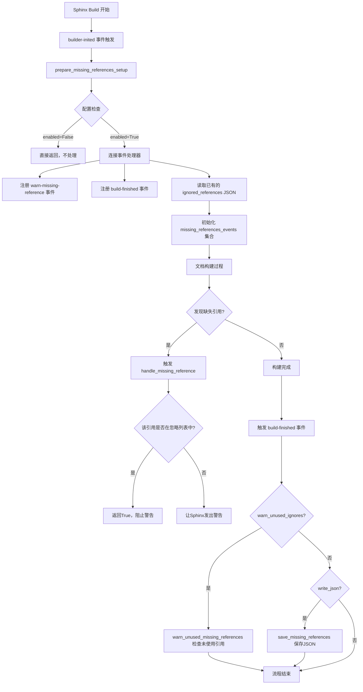
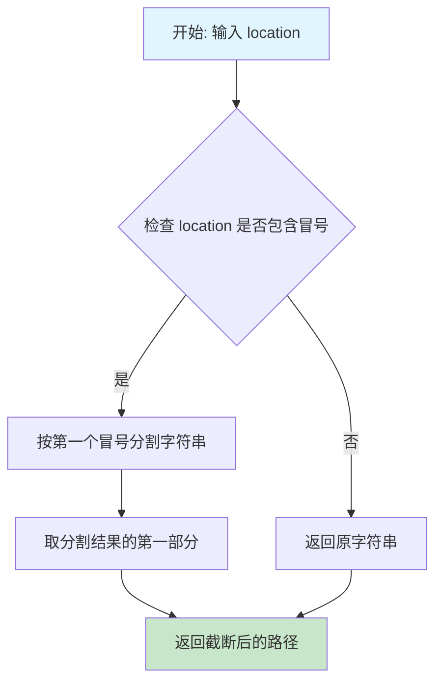
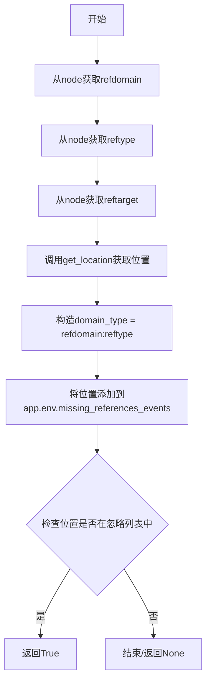
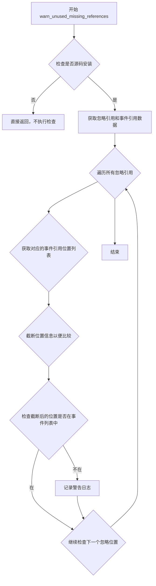
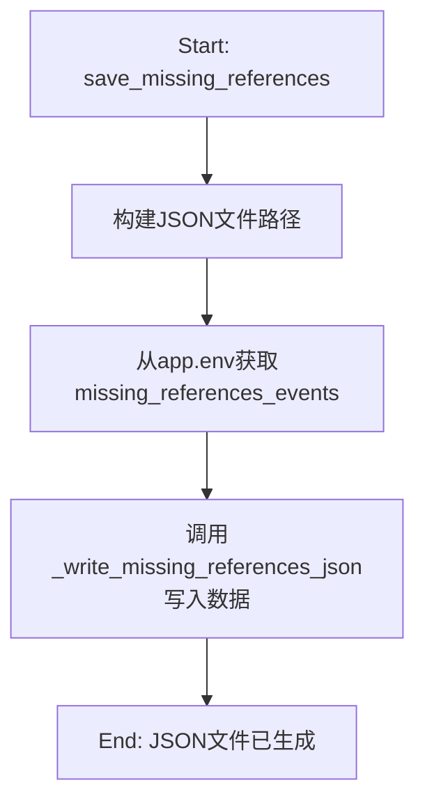
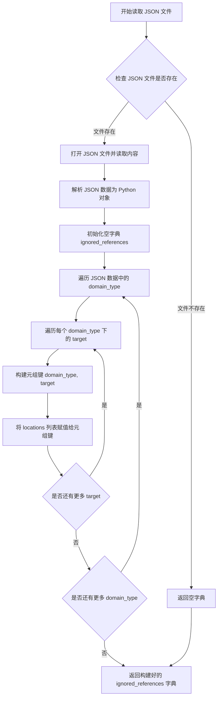

# `matplotlib\doc\sphinxext\missing_references.py` 详细设计文档

这是一个Sphinx扩展，用于在nitpicky模式下记录和持久化缺失的引用。它通过监听warn-missing-reference事件收集缺失引用，将它们保存为JSON文件，并在后续构建时自动忽略这些引用，从而解决文档中的断链问题。

## 整体流程



## 类结构

```
无类定义 - 纯模块化函数设计
主要包含以下函数:
├── get_location (获取源码位置)
├── _truncate_location (截断位置字符串)
├── handle_missing_reference (处理缺失引用事件)
├── warn_unused_missing_references (检查未使用的忽略)
├── save_missing_references (保存缺失引用)
├── _write_missing_references_json (写JSON)
├── _read_missing_references_json (读JSON)
├── prepare_missing_references_setup (初始化设置)
└── setup (入口函数)
```

## 全局变量及字段


### `logger`
    
Sphinx日志记录器实例，用于记录警告信息

类型：`sphinx.util.logging.Logger`
    


### `matplotlib`
    
外部依赖模块，用于路径检查以确定是否从源代码安装

类型：`module`
    


    

## 全局函数及方法


### `get_location`

获取 docutils 节点对应的源码位置，返回一个表示源文件路径和行号的字符串。对于外部模块的文档字符串或无法定位的源码，会返回特殊的占位符（如 `<external>` 或 `<unknown>`），以确保跨平台路径一致性。

参数：

- `node`：`docutils.nodes.Node`，docutils 树中的一个节点对象，用于获取源码位置信息
- `app`：`sphinx.application.Sphinx`，Sphinx 应用程序实例，提供源码根目录等配置信息

返回值：`str`，源码位置的字符串表示，格式通常为 "path/to/file:linenumber"，或特殊值 "<external>" / "<unknown>"

#### 流程图

```mermaid
flowchart TD
    A[开始: get_location] --> B[调用 get_source_line 获取源码和行号]
    B --> C{source 是否存在?}
    C -->|是| D{source 是否包含 ':docstring of'?}
    D -->|是| E[使用 rpartition 分割路径和 docstring 说明]
    D -->|否| F[path = source, post = '']
    E --> G[计算 basepath: app.srcdir 的父目录]
    G --> H[计算 fullpath: path 的绝对路径]
    H --> I{fullpath 能否相对于 basepath?}
    I -->|是| J[path = fullpath 相对于 basepath 的相对路径]
    I -->|否| K[path = Path('<external>') / fullpath.name]
    J --> L[path = path.as_posix 转换为 POSIX 路径]
    K --> L
    C -->|否| M[path = '<unknown>', post = '']
    L --> N{line 是否存在?}
    M --> N
    N -->|是| O[保留原始行号]
    N -->|否| P[line = '']
    O --> Q[返回 f'{path}{post}:{line}']
    P --> Q
```

#### 带注释源码

```python
def get_location(node, app):
    """
    Given a docutils node and a sphinx application, return a string
    representation of the source location of this node.

    Usually, this will be of the form "path/to/file:linenumber". Two
    special values can be emitted, "<external>" for paths which are
    not contained in this source tree (e.g. docstrings included from
    other modules) or "<unknown>", indicating that the sphinx application
    cannot locate the original source file (usually because an extension
    has injected text into the sphinx parsing engine).
    """
    # 从 docutils 节点获取源码文件和行号
    source, line = get_source_line(node)

    if source:
        # 'source' 可以是 '/some/path:docstring of some.api' 的形式
        # 冒号在 Windows 上非法，但在 POSIX 系统上可以直接传递
        if ':docstring of' in source:
            # 从右边分割，提取 docstring 说明部分
            path, *post = source.rpartition(':docstring of')
            # 将剩余部分拼接为字符串
            post = ''.join(post)
        else:
            path = source
            post = ''
        
        # 我们相对于文档目录的父目录来定位引用
        # 对于 matplotlib，这将指向 matplotlib 仓库的根目录
        # 当 matplotlib 不是可编辑安装时会发生奇怪的事情，但我们无法完全恢复
        basepath = Path(app.srcdir).parent.resolve()

        # 将路径转换为绝对路径
        fullpath = Path(path).resolve()

        try:
            # 尝试获取相对于 basepath 的相对路径
            path = fullpath.relative_to(basepath)
        except ValueError:
            # 有时文档直接包含已安装模块的文档字符串
            # 我们将这些记录为 <external>，以独立于模块安装位置
            path = Path("<external>") / fullpath.name

        # 确保所有报告的路径都是 POSIX 格式
        # 以便 Windows 上的文档在 JSON 文件中产生相同的警告
        path = path.as_posix()

    else:
        # 无法获取源码位置时返回 <unknown>
        path = "<unknown>"
        post = ''
    
    # 如果没有行号，则设为空字符串
    if not line:
        line = ""

    # 拼接最终的位置字符串
    return f"{path}{post}:{line}"
```


### `_truncate_location(location)`

截取位置字符串的第一个冒号前内容，用于在忽略行号差异的情况下比较文件路径。

参数：

- `location`：`str`，位置字符串，通常格式为 "path/to/file:linenumber"

返回值：`str`，返回第一个冒号之前的字符串内容，即文件路径部分

#### 流程图



#### 带注释源码

```python
def _truncate_location(location):
    """
    Cuts off anything after the first colon in location strings.

    This allows for easy comparison even when line numbers change
    (as they do regularly).
    """
    # 使用 split 方法以 ":" 为分隔符分割字符串，参数 1 表示只分割一次
    # 这样可以得到一个最多包含两个元素的列表：[冒号前部分, 冒号后部分]
    # 然后取 [0] 即获取冒号之前的内容
    return location.split(":", 1)[0]
```


### `handle_missing_reference`

处理 warn-missing-reference 事件，记录缺失引用信息并在引用已被忽略时阻止 Sphinx 发出警告。

参数：

- `app`：`sphinx.application.Sphinx`，Sphinx 应用实例，提供对配置、环境和构建流程的访问
- `domain`：`sphinx.domains.Domain`，文档域对象（当前函数未直接使用）
- `node`：`docutils.nodes.Node`，docutils 节点对象，包含缺失引用的详细信息

返回值：`bool`，如果该位置在忽略列表中返回 `True` 以阻止 Sphinx 发出警告，否则返回 `None`

#### 流程图



#### 带注释源码

```python
def handle_missing_reference(app, domain, node):
    """
    Handle the warn-missing-reference Sphinx event.

    This function will:

    #. record missing references for saving/comparing with ignored list.
    #. prevent Sphinx from raising a warning on ignored references.
    """
    # 从节点中提取引用域（如 "py" 表示 Python 域）
    refdomain = node["refdomain"]
    # 从节点中提取引用类型（如 "obj", "class", "func" 等）
    reftype = node["reftype"]
    # 从节点中提取引用目标（具体的目标名称）
    target = node["reftarget"]
    # 获取引用的源代码位置（文件路径和行号）
    location = get_location(node, app)
    # 构造域类型字符串，用于唯一标识引用类型
    domain_type = f"{refdomain}:{reftype}"

    # 将缺失引用的位置记录到环境的事件集合中
    # 格式：{(domain_type, target): {location1, location2, ...}}
    app.env.missing_references_events[(domain_type, target)].add(location)

    # 检查此引用是否在忽略列表中
    # 如果是，返回 True 告诉 Sphinx 已处理（即使我们实际上没有警告）
    # 这样可以阻止 Sphinx 输出缺失引用的警告
    if location in app.env.missing_references_ignored_references.get(
            (domain_type, target), []):
        return True
```


### `warn_unused_missing_references`

检查并警告不再需要的忽略引用。当 Sphinx 文档构建完成后，此函数会比较已保存的忽略引用列表与实际发生的缺失引用事件，如果某些被忽略的引用已经不再缺失（即引用已修复），则发出警告，提示可以从 JSON 配置文件中移除该忽略规则。

参数：

- `app`：`sphinx.application.Sphinx`，Sphinx 应用程序实例，提供配置信息（`app.config.missing_references_filename`）和环境信息（`app.env.missing_references_ignored_references`、`app.env.missing_references_events`）
- `exc`：`BaseException | None`，构建过程中发生的异常（如果存在），用于判断构建是否成功

返回值：`None`，此函数不返回任何值，仅通过日志记录警告信息

#### 流程图



#### 带注释源码

```python
def warn_unused_missing_references(app, exc):
    """
    Check that all lines of the existing JSON file are still necessary.
    
    此函数在 Sphinx 构建完成后被调用，用于检查已保存的忽略引用配置
    是否仍然有效。如果某些引用不再缺失，说明文档问题已被修复，
    应该从配置文件中移除对应的忽略规则。
    """
    # We can only warn if we are building from a source install
    # otherwise, we just have to skip this step.
    # 只有从源码安装构建时才有意义，pip 安装的预编译包无法准确追踪源码位置
    basepath = Path(matplotlib.__file__).parent.parent.parent.resolve()
    srcpath = Path(app.srcdir).parent.resolve()

    # 如果不是源码安装，则跳过检查
    if basepath != srcpath:
        return

    # This is a dictionary of {(domain_type, target): locations}
    # 从环境变量中获取之前保存的忽略引用和本次构建观察到的缺失引用事件
    references_ignored = app.env.missing_references_ignored_references
    references_events = app.env.missing_references_events

    # Warn about any reference which is no longer missing.
    # 遍历所有已配置的忽略引用，检查它们是否仍然缺失
    for (domain_type, target), locations in references_ignored.items():
        # 获取本次构建中观察到的该引用类型+目标的缺失位置列表
        # 使用 _truncate_location 截断行号，只比较文件路径
        missing_reference_locations = [
            _truncate_location(location)
            for location in references_events.get((domain_type, target), [])]

        # For each ignored reference location, ensure a missing reference
        # was observed. If it wasn't observed, issue a warning.
        # 逐个检查忽略引用的位置
        for ignored_reference_location in locations:
            # 截断位置信息以忽略行号变化的影响
            short_location = _truncate_location(ignored_reference_location)
            # 如果该位置没有观察到缺失引用，说明问题已修复
            if short_location not in missing_reference_locations:
                # 生成警告消息，提示可以移除该忽略配置
                msg = (f"Reference {domain_type} {target} for "
                       f"{ignored_reference_location} can be removed"
                       f" from {app.config.missing_references_filename}."
                        " It is no longer a missing reference in the docs.")
                # 记录警告日志，包含位置、类型和子类型
                logger.warning(msg,
                               location=ignored_reference_location,
                               type='ref',
                               subtype=domain_type)
```


### `save_missing_references`

在 Sphinx 构建结束时，将构建过程中收集的缺失引用记录写入到 JSON 文件中，以便后续可以进行忽略或修复。

参数：

- `app`：`Sphinx.application` 对象，Sphinx 应用程序实例，提供配置和构建环境信息
- `exc`：`BaseException | None`，构建过程中发生的异常（如果构建成功则为 `None`）

返回值：`None`，该函数仅执行副作用操作，不返回任何值

#### 流程图



#### 带注释源码

```python
def save_missing_references(app, exc):
    """
    Write a new JSON file containing missing references.
    """
    # 使用 Sphinx 配置中的目录和文件名构建完整的 JSON 文件路径
    # app.confdir 是配置文件所在目录
    # app.config.missing_references_filename 默认为 "missing-references.json"
    json_path = Path(app.confdir) / app.config.missing_references_filename
    
    # 从 Sphinx 环境的运行时数据中获取构建过程中收集的所有缺失引用事件
    # 这是一个 defaultdict(set)，键为 (domain_type, target) 元组，值为位置集合
    references_warnings = app.env.missing_references_events
    
    # 调用辅助函数将缺失引用记录转换为 JSON 格式并写入文件
    _write_missing_references_json(references_warnings, json_path)
```


### `_write_missing_references_json`

该函数用于将 Sphinx 扩展中记录的缺失引用信息从内部元组格式转换为 JSON 兼容的嵌套字典格式，并写入指定的 JSON 文件。

参数：

- `records`：`dict`，形式为 `{(domain_type, target): locations}` 的字典，其中 `domain_type` 是字符串（如 `"py:obj"`），`target` 是字符串（引用目标），`locations` 是位置集合。包含所有需要写入的缺失引用记录。
- `json_path`：`Path` 对象，表示输出 JSON 文件的完整路径。

返回值：`None`，该函数无返回值，直接将数据写入文件。

#### 流程图

```mermaid
flowchart TD
    A[开始 _write_missing_references_json] --> B[创建 defaultdict dict]
    B --> C[遍历 records 中的每个 (domain_type, target) 和 paths]
    C --> D[将 paths 排序并赋值给 transformed_records[domain_type][target]]
    D --> E{records 遍历完毕?}
    E -->|否| C
    E -->|是| F[以写入模式打开 json_path]
    F --> G[使用 json.dump 写入 JSON 数据]
    G --> H[写入换行符避免 pre-commit 警告]
    H --> I[关闭文件流]
    I --> J[结束]
```

#### 带注释源码

```python
def _write_missing_references_json(records, json_path):
    """
    Convert ignored references to a format which we can write as JSON

    Convert from ``{(domain_type, target): locations}`` to
    ``{domain_type: {target: locations}}`` since JSON can't serialize tuples.
    """
    # Sorting records and keys avoids needlessly big diffs when
    # missing_references.json is regenerated.
    # 创建嵌套字典，用于存储转换后的记录
    transformed_records = defaultdict(dict)
    
    # 遍历原始记录，将元组键转换为嵌套字典结构
    for (domain_type, target), paths in records.items():
        # 对路径列表进行排序，确保 JSON 输出顺序一致，减小 diff 差异
        transformed_records[domain_type][target] = sorted(paths)
    
    # 以写入模式打开 JSON 文件路径
    with json_path.open("w") as stream:
        # 使用 json.dump 将转换后的记录写入文件
        # sort_keys=True 确保字典键按字母顺序排列
        # indent=2 使用缩进格式化输出，提高可读性
        json.dump(transformed_records, stream, sort_keys=True, indent=2)
        # 写入末尾换行符，避免 pre-commit 工具警告文件末尾缺少换行符
        stream.write("\n")  # Silence pre-commit no-newline-at-end-of-file warning.
```


### `_read_missing_references_json`

将 JSON 文件中存储的引用数据从 JSON 格式 `{domain_type: {target: [locations,]}}` 转换回内部使用的字典格式 `{(domain_type, target): [locations]}`，以便在 Sphinx 扩展中进行处理。

参数：

- `json_path`：`Path`，JSON 文件的路径，指向包含已忽略引用的 JSON 配置文件

返回值：`dict`，内部使用的字典格式，键为 `(domain_type, target)` 元组，值为缺失引用位置的列表

#### 流程图



#### 带注释源码

```python
def _read_missing_references_json(json_path):
    """
    Convert from the JSON file to the form used internally by this
    extension.

    The JSON file is stored as ``{domain_type: {target: [locations,]}}``
    since JSON can't store dictionary keys which are tuples. We convert
    this back to ``{(domain_type, target):[locations]}`` for internal use.

    """
    # 打开指定路径的 JSON 文件进行读取
    with json_path.open("r") as stream:
        # 使用 json 模块将文件内容解析为 Python 字典/列表对象
        data = json.load(stream)

    # 初始化一个空字典用于存储转换后的内部格式数据
    ignored_references = {}
    
    # 外层循环：遍历 JSON 数据中的每个 domain_type（如 'py:func'）
    for domain_type, targets in data.items():
        # 内层循环：遍历每个 domain_type 下的所有 target（函数/类名）
        for target, locations in targets.items():
            # 构建元组键 (domain_type, target) 作为字典的主键
            # 将 locations 列表（引用出现位置）作为值
            ignored_references[(domain_type, target)] = locations
    
    # 返回转换完成的内部格式字典
    return ignored_references
```


### `prepare_missing_references_setup`

该函数是 Sphinx 扩展的初始化函数，负责在配置就绪后设置事件处理器和加载已忽略的引用数据。它根据配置选项有条件地连接不同的事件监听器，并从 JSON 文件读取或初始化缺失引用相关的数据结构。

参数：

- `app`：`Sphinx.application` 对象，Sphinx 应用程序实例，包含配置和构建环境

返回值：`None`，无返回值

#### 流程图

```mermaid
flowchart TD
    A[开始 prepare_missing_references_setup] --> B{检查 missing_references_enabled 配置}
    B -->|禁用| C[直接返回 - no-op]
    B -->|启用| D[连接 warn-missing-reference 事件到 handle_missing_reference]
    D --> E{检查 missing_references_warn_unused_ignores 配置}
    E -->|启用| F[连接 build-finished 事件到 warn_unused_missing_references]
    E -->|禁用| G{检查 missing_references_write_json 配置}
    F --> G
    G -->|启用| H[连接 build-finished 事件到 save_missing_references]
    G -->|禁用| I[构建 JSON 文件路径]
    H --> I
    I --> J{JSON 文件是否存在?}
    J -->|是| K[调用 _read_missing_references_json 读取文件]
    J -->|否| L[初始化为空字典]
    K --> M[设置 app.env.missing_references_ignored_references]
    L --> M
    M --> N[初始化 app.env.missing_references_events 为 defaultdict(set)]
    N --> O[结束]
```

#### 带注释源码

```python
def prepare_missing_references_setup(app):
    """
    Initialize this extension once the configuration is ready.
    """
    # 检查扩展是否启用，如果未启用则直接返回（空操作）
    if not app.config.missing_references_enabled:
        # no-op when we are disabled.
        return

    # 连接 warn-missing-reference 事件，用于处理缺失引用
    app.connect("warn-missing-reference", handle_missing_reference)
    
    # 如果配置了 warn_unused_ignores，在构建结束时检查未使用的忽略引用
    if app.config.missing_references_warn_unused_ignores:
        app.connect("build-finished", warn_unused_missing_references)
    
    # 如果配置了 write_json，在构建结束时保存缺失引用到 JSON 文件
    if app.config.missing_references_write_json:
        app.connect("build-finished", save_missing_references)

    # 构建 JSON 文件路径（位于配置目录中）
    json_path = Path(app.confdir) / app.config.missing_references_filename
    
    # 从 JSON 文件读取已忽略的引用列表，如果文件不存在则为空字典
    app.env.missing_references_ignored_references = (
        _read_missing_references_json(json_path) if json_path.exists() else {}
    )
    
    # 初始化缺失引用事件记录器（使用 defaultdict(set) 存储位置集合）
    app.env.missing_references_events = defaultdict(set)
```


### 1. 一句话描述
`setup(app)` 是该 Sphinx 扩展的入口函数，负责注册配置项（布尔值和文件名），并挂载 `builder-inited` 事件以在文档构建初始化阶段触发参考引用处理逻辑。

### 2. 文件的整体运行流程
当 Sphinx 读取 `conf.py` 并加载 `missing_references` 扩展时，首先调用 `setup(app)`。
1.  **注册配置**: `setup` 向 Sphinx 应用实例注册4个配置值，允许用户在 `conf.py` 中控制扩展行为。
2.  **挂载事件**: 它连接 `builder-inited` 事件到 `prepare_missing_references_setup` 函数。
3.  **初始化**: 当 Sphinx 构建器初始化时，`prepare_missing_references_setup` 被调用，进一步连接 `warn-missing-reference` 和 `build-finished` 事件，并读取或初始化内存中的引用数据。
4.  **构建与输出**: 在文档构建过程中，`handle_missing_reference` 记录缺失引用，构建结束时 `save_missing_references` 写入 JSON 文件。

### 3. 类的详细信息（Global Functions）

#### 3.1 `setup(app)` - 扩展入口函数
- **描述**: Sphinx 扩展的标准入口点，用于初始化扩展环境。
- **参数**:
    - `app`: `sphinx.application.Sphinx`，Sphinx 应用对象，包含配置和构建环境。
- **返回值**: `dict`，返回 `{'parallel_read_safe': True}`，表明该扩展支持并行读取。

#### 3.2 `prepare_missing_references_setup(app)` - 初始化逻辑
- **描述**: 在构建器初始化时运行，负责读取忽略引用的 JSON 文件，并将具体的事件处理器连接 到 Sphinx 事件系统。
- **参数**:
    - `app`: `sphinx.application.Sphinx`。
- **返回值**: `None`。

#### 3.3 `handle_missing_reference(app, domain, node)` - 核心处理函数
- **描述**: 处理 `warn-missing-reference` 事件，记录缺失引用并检查是否应忽略。
- **参数**:
    - `app`: `sphinx.application.Sphinx`。
    - `domain`: `str`，文档域（如 `py`）。
    - `node`: `docutils.nodes.Node`，引用节点。

### 4. 变量与函数详细信息（针对 `setup`）

#### 4.1 全局变量
无特定于 `setup` 函数作用域的全局变量，但该模块级函数依赖于以下配置键名（字符串字面量）：
- `missing_references_enabled`: 扩展启用开关。
- `missing_references_write_json`: 是否生成 JSON 文件。
- `missing_references_warn_unused_ignores`: 是否警告未使用的忽略项。
- `missing_references_filename`: 输出文件名。

#### 4.2 针对 `setup(app)` 的提取详情

### `setup(app)`

Sphinx 扩展的入口函数，注册配置值和事件钩子。

参数：
-  `app`：`sphinx.application.Sphinx`，Sphinx 应用实例，用于注册配置和事件。

返回值：`dict`，返回 `{'parallel_read_safe': True}`，表示该扩展在并行构建中是安全的。

#### 流程图

```mermaid
flowchart TD
    A[Sphinx 加载扩展] --> B{调用 setup(app)}
    B --> C[app.add_config_value<br/>missing_references_enabled: True]
    B --> D[app.add_config_value<br/>missing_references_write_json: False]
    B --> E[app.add_config_value<br/>missing_references_warn_unused_ignores: True]
    B --> F[app.add_config_value<br/>missing_references_filename: 'missing-references.json']
    B --> G[app.connect<br/>builder-inited -> prepare_missing_references_setup]
    G --> H[等待构建器初始化]
    B --> I[返回 {'parallel_read_safe': True}]
```

#### 带注释源码

```python
def setup(app):
    """
    入口函数：注册配置值和事件。
    """
    # 注册一个布尔配置项，控制扩展是否生效
    app.add_config_value("missing_references_enabled", True, "env")
    
    # 注册一个布尔配置项，控制是否在构建结束时写入缺失引用的 JSON 文件
    app.add_config_value("missing_references_write_json", False, "env")
    
    # 注册一个布尔配置项，控制是否检查已被忽略但不再缺失的引用（警告用户可以清理）
    app.add_config_value("missing_references_warn_unused_ignores", True, "env")
    
    # 注册一个字符串配置项，指定输出/输入的 JSON 文件名
    app.add_config_value("missing_references_filename",
                         "missing-references.json", "env")

    # 挂载 'builder-inited' 事件。
    # 注意：这里挂载的是 prepare_missing_references_setup，而不是直接挂载最终的处理函数。
    # 这是为了确保配置值已经被读取，且应用环境已准备好。
    app.connect("builder-inited", prepare_missing_references_setup)

    # 返回扩展的元数据，parallel_read_safe=True 表示该扩展可以安全地用于并行构建
    return {'parallel_read_safe': True}
```

### 5. 关键组件信息
- **配置值 (Config Values)**: 通过 `app.add_config_value` 注册的四个变量，是用户与此扩展交互的主要接口。
- **事件钩子 (Event Hooks)**: 
    - `builder-inited`: 触发初始化逻辑（读取 JSON，连接其他事件）。
    - `warn-missing-reference`: 触发引用检查。
    - `build-finished`: 触发 JSON 保存或警告检查。

### 6. 潜在的技术债务或优化空间
- **硬编码路径假设**: 虽然文件名可配置，但 `_write_missing_references_json` 和 `_read_missing_references_json` 默认使用 `app.confdir`。如果用户希望将 JSON 文件存储在版本控制根目录而非 `conf.py` 旁边，当前的实现支持不完善（尽管 `basepath` 计算存在于 `warn_unused_missing_references` 中）。
- **初始化时机**: 使用 `builder-inited` 是合适的，但如果扩展逻辑非常重，理论上可以延迟到更晚阶段，不过对于引用处理来说，尽早初始化监听器是必要的。
- **并行写入**: 虽然声明了 `parallel_read_safe`，但 `save_missing_references` 是在 `build-finished` 阶段写入文件。如果存在多个并行 writer 进程同时写入（理论上 Sphinx 并行构建由 worker 进程完成，最终汇总），需要确保文件写入的原子性或由主进程统一写入。当前的实现依赖于 `build-finished` 通常由主进程调用的特性。

### 7. 其它项目

**设计目标与约束**:
- **目标**: 解决 Sphinx 在 `nitpicky = True` 模式下的“破碎引用”问题，通过生成白名单（JSON）自动忽略已知缺失的引用。
- **约束**: 依赖于 Sphinx 的 `warn-missing-reference` 事件和 `app.env` 来存储状态。

**错误处理与异常设计**:
- **文件不存在**: 在 `prepare_missing_references_setup` 中，使用 `if json_path.exists()` 来优雅处理首次运行（无 JSON 文件）的情况。
- **构建环境限制**: `warn_unused_missing_references` 中包含了一个环境检查（对比 `matplotlib.__file__` 路径和 `app.srcdir`），如果不符合条件（非编辑安装模式），则跳过警告逻辑。这反映了该扩展最初是针对特定项目（Matplotlib）定制的痕迹。

**外部依赖**:
- `sphinx.application.Sphinx`: 核心框架对象。
- `json`: 用于序列化/反序列化忽略列表。
- `pathlib.Path`: 路径处理。
- `docutils.utils.get_source_line`: 用于定位引用的源码位置。

## 关键组件


### 缺失引用处理 (Missing Reference Handler)

核心组件，负责监听和处理Sphinx构建过程中的缺失引用事件。通过`handle_missing_reference`函数捕获引用警告，并将缺失引用信息记录到环境中，支持按域和类型分类管理。

### 位置信息解析 (Location Resolution)

提供文档节点位置信息的获取和格式化功能。`get_location`函数将docutils节点转换为标准化的文件路径表示，支持外部文档和未知来源的特殊处理。`_truncate_location`函数用于简化位置比较，排除行号差异。

### JSON持久化层 (JSON Persistence)

负责缺失引用数据的序列化和反序列化。`_write_missing_references_json`将内存中的引用记录转换为JSON格式存储，支持排序以减少不必要的差异。`_read_missing_references_json`从JSON文件恢复引用忽略列表，处理JSON无法直接存储元组键的转换。

### 未使用引用警告 (Unused Reference Warning)

在构建完成后验证已忽略的引用是否仍然缺失。`warn_unused_missing_references`函数比较JSON文件中记录的引用与实际构建过程中的引用事件，对不再缺失的引用发出警告，支持引用清理。

### 扩展初始化与配置 (Extension Initialization)

Sphinx扩展的入口点和配置管理模块。`setup`函数注册配置项和事件处理器。`prepare_missing_references_setup`在构建初始化阶段配置事件监听器，根据配置启用或禁用各项功能。


## 问题及建议


### 已知问题

- **不必要的模块导入**：在模块顶层导入了`matplotlib`，但仅在`warn_unused_missing_references`函数中使用，这增加了模块加载时间且造成不必要的依赖
- **配置验证不足**：配置值添加时未进行充分验证，如`missing_references_filename`未检查是否为有效文件名
- **错误处理缺失**：`_read_missing_references_json`函数未处理JSON文件解析异常和文件格式错误的情况
- **路径处理复杂**：`get_location`函数中的路径处理逻辑过于复杂，包含多个条件分支和特殊处理，降低了可维护性
- **类型注解缺失**：所有函数都缺少参数和返回值的类型注解，影响代码可读性和IDE支持
- **魔法字符串**：多处使用硬编码字符串如`"warn-missing-reference"`、`"builder-inited"`、`"build-finished"`，未定义为常量
- **潜在的属性访问错误**：在多个函数中直接访问`app.config`和`app.env`属性，假设它们存在但未进行防御性检查

### 优化建议

- 将`import matplotlib`移到`warn_unused_missing_references`函数内部以实现惰性加载
- 为所有配置值添加类型检查和默认值验证
- 在`_read_missing_references_json`中添加try-except处理JSON解析错误，并验证JSON结构
- 重构`get_location`函数，将路径处理逻辑分解为更小的、专注的辅助函数
- 为所有函数添加类型注解（使用typing模块）
- 创建常量类或模块级常量来存储事件名称和配置键
- 在访问`app.config`和`app.env`属性前添加存在性检查或使用getattr提供默认值
- 考虑将某些逻辑移入类中以更好地封装状态，使用数据类（dataclass）来组织相关配置
- 添加单元测试覆盖边界情况，如无效的JSON文件、不存在的路径等


## 其它


### 设计目标与约束

本扩展旨在解决Sphinx文档构建时nitpicky模式下的缺失引用问题。核心目标包括：1）自动收集构建过程中的所有缺失引用；2）生成可移植的JSON配置文件供后续构建忽略这些引用；3）在重新构建时检测已不再缺失的引用并给出警告。约束条件包括：需要Sphinx应用环境、依赖matplotlib包（用于路径判断）、配置文件需为JSON格式、仅支持Sphinx 1.0以上版本。

### 错误处理与异常设计

代码主要通过异常捕获处理两类错误：文件不存在错误（在`_read_missing_references_json`中）和路径解析错误（在`get_location`中的`ValueError`异常）。当JSON配置文件不存在时，`prepare_missing_references_setup`函数会返回空字典而非抛出异常。当basepath与srcpath不一致时，`warn_unused_missing_references`函数会提前返回，不进行未使用引用的警告检查。

### 数据流与状态机

本扩展的数据流分为三个阶段：初始化阶段在`builder-inited`事件触发时读取已有JSON配置并初始化数据结构；收集阶段在`warn-missing-reference`事件触发时记录所有缺失引用；输出阶段在`build-finished`事件触发时写入更新后的JSON文件或警告未使用的忽略规则。状态转换如下：禁用状态→初始化完成状态→监听状态→处理完成状态。

### 外部依赖与接口契约

本扩展依赖以下外部包：sphinx（用于日志、应用接口和事件处理）、docutils（用于get_source_line函数）、pathlib（标准库）、json（标准库）、collections（标准库）、matplotlib（仅用于路径判断）。配置接口包含四个配置项：`missing_references_enabled`（布尔值，默认为True）、`missing_references_write_json`（布尔值，默认为False）、`missing_references_warn_unused_ignores`（布尔值，默认为True）、`missing_references_filename`（字符串，默认为missing-references.json）。

### 安全性考虑

本扩展以写模式打开JSON文件，可能存在文件覆盖风险。JSON数据来源于Sphinx解析的引用信息，理论上可被恶意构造的文档触发异常。所有路径处理均使用`Path.resolve()`进行规范化，防止路径遍历攻击。日志输出使用Sphinx标准日志接口，兼容Sphinx的警告过滤机制。

### 性能考虑

`get_location`函数中每次调用都进行路径解析和相对路径计算，可能影响大型文档的构建速度。`warn_unused_missing_references`函数使用O(n*m)的双重循环比较位置信息，可考虑使用集合操作优化。JSON写入时使用`sorted()`对所有记录排序，确保文件内容稳定，减少不必要的版本控制差异。

### 测试策略

建议测试场景包括：1）正常流程测试：启用扩展、构建文档、验证JSON文件生成；2）忽略功能测试：配置nitpick_ignore后构建，验证无警告输出；3）警告清理测试：在引用修复后构建，验证警告信息正确输出；4）边界条件测试：配置文件损坏、缺失、不存在等异常情况；5）跨平台测试：验证Windows和POSIX路径的正确处理。

    