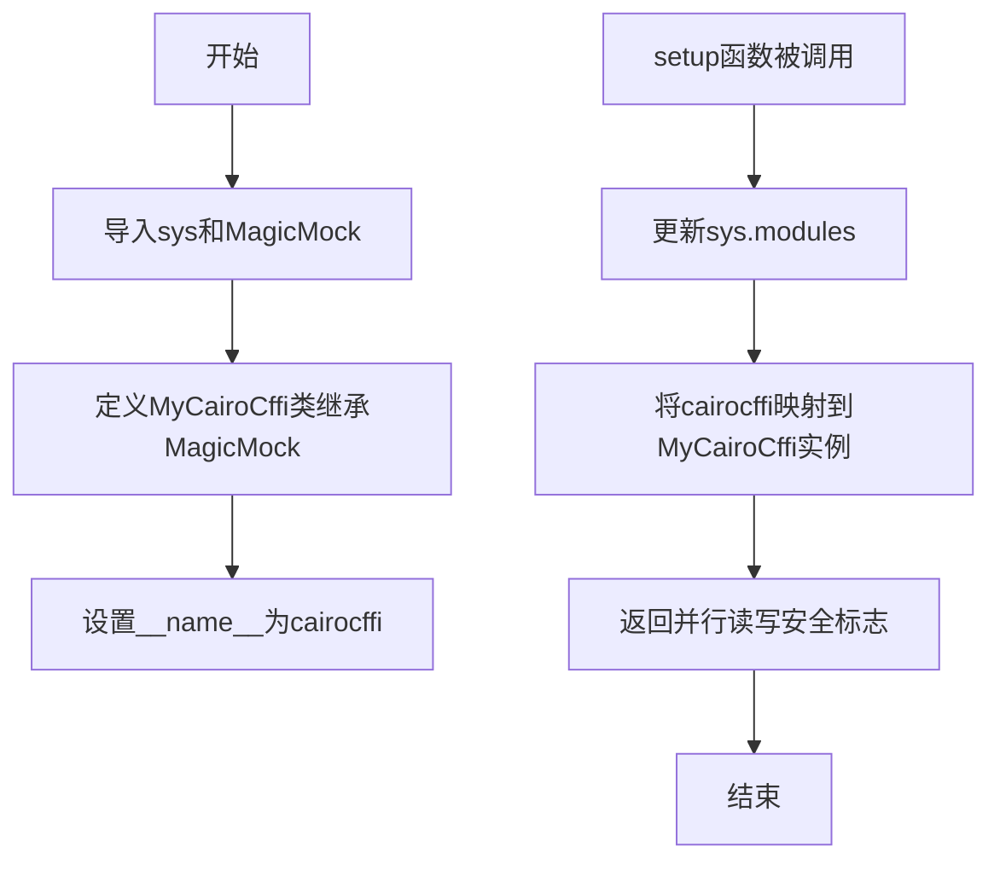
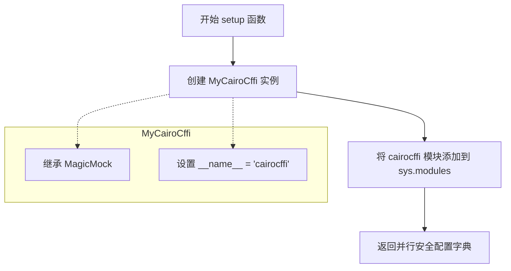
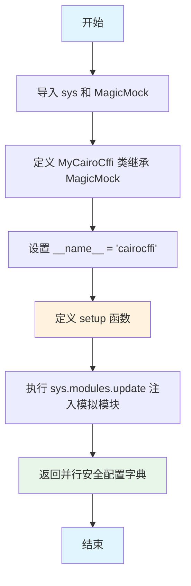

# `matplotlib\doc\sphinxext\mock_gui_toolkits.py` 详细设计文档

这是一个Sphinx扩展的初始化模块，通过MagicMock模拟cairocffi模块，使得在未安装cairocffi库的环境中也能正常运行Sphinx文档构建工具。该模块在setup函数中替换系统模块为mock对象，并声明扩展支持并行读写。

## 整体流程



## 类结构

```
MagicMock (unittest.mock)
└── MyCairoCffi (自定义Mock类)
```

## 全局变量及字段


### `sys`
    
Python标准库中的sys模块，用于访问系统相关的参数和函数

类型：`module`
    


### `MagicMock`
    
unittest.mock模块中的MagicMock类，用于创建mock对象

类型：`class`
    


### `MyCairoCffi.__name__`
    
类属性，值为'cairocffi'，用于模拟cairocffi模块名称

类型：`str`
    


### `MyCairoCffi.__name__`
    
类属性，设置为'cairocffi'以模拟cairocffi模块的__name__

类型：`str`
    
    

## 全局函数及方法


### `setup`

该函数是 Sphinx 扩展的入口点，用于在文档构建过程中模拟 `cairocffi` 库，使得在不支持 Cairo 的环境中也能正常运行 Sphinx 文档构建。

参数：

- `app`：`Sphinx Application 对象`，Sphinx 扩展的标准参数，代表 Sphinx 应用实例

返回值：`Dict[str, bool]`，返回一个字典，包含 `parallel_read_safe` 和 `parallel_write_safe` 两个键，均值为 `True`，表示该扩展支持并行读写。

#### 流程图



#### 带注释源码

```python
# 导入系统模块，用于操作 sys.modules
import sys
# 导入 MagicMock，用于创建模拟对象
from unittest.mock import MagicMock


# 定义 MyCairoCffi 类，继承自 MagicMock
# 用途：模拟 cairocffi 库的所有属性和方法
class MyCairoCffi(MagicMock):
    # 设置类的 __name__ 属性为 "cairocffi"
    # 用途：使模拟对象在运行时能够通过 __name__ 识别为 cairocffi 模块
    __name__ = "cairocffi"


def setup(app):
    """
    Sphinx 扩展的入口函数
    
    用途：
        1. 模拟 cairocffi 库，使其在 Sphinx 构建文档时可用
        2. 返回扩展的并行读写安全配置
    
    参数：
        app: Sphinx Application 对象，代表当前 Sphinx 应用实例
    
    返回：
        dict: 包含并行读写安全配置的字典
    """
    # 使用 sys.modules.update() 将模拟的 cairocffi 模块添加到系统模块中
    # 原理：当其他代码尝试导入 cairocffi 时，会优先从 sys.modules 中查找
    # 用途：确保 Sphinx 在没有真实 Cairo 库的情况下也能正常构建文档
    sys.modules.update(
        cairocffi=MyCairoCffi(),  # 创建模拟实例并映射到 cairocffi 键
    )
    # 返回扩展配置字典
    # parallel_read_safe: True 表示该扩展可以安全地并行读取
    # parallel_write_safe: True 表示该扩展可以安全地并行写入
    return {'parallel_read_safe': True, 'parallel_write_safe': True}
```


# 设计文档：MyCairoCffi 模块

## 一段话描述

该代码定义了一个 `MyCairoCffi` 类，继承自 `unittest.mock.MagicMock`，用于在 Sphinx 扩展中模拟 `cairocffi` 模块，使得在未安装 cairo 库的环境中也能正常运行 Sphinx 文档构建。

## 文件的整体运行流程

1. 导入 `sys` 模块和 `MagicMock` 类
2. 定义 `MyCairoCffi` 类，继承 `MagicMock`，设置类属性 `__name__` 为 "cairocffi"
3. 定义 `setup` 函数作为 Sphinx 扩展入口点
4. `setup` 函数执行时，将模拟的 `MyCairoCffi()` 实例注入到 `sys.modules` 中
5. 返回并行读写安全的配置字典

## 类的详细信息

### 类字段

| 名称 | 类型 | 描述 |
|------|------|------|
| `__name__` | str | 类名标识，设置为 "cairocffi" 用于模拟真实的 cairocffi 模块 |

### 类方法

由于 `MyCairoCffi` 继承自 `MagicMock`，它会在运行时自动创建以下核心方法（继承自 MagicMock 的常用方法）：

| 方法名称 | 描述 |
|----------|------|
| `__init__` | 初始化方法，从 MagicMock 继承 |
| `__call__` | 使实例可调用，从 MagicMock 继承 |
| `__getattr__` | 动态属性访问，从 MagicMock 继承 |
| `__setattr__` | 动态属性设置，从 MagicMock 继承 |
| `__delattr__` | 动态属性删除，从 MagicMock 继承 |
| `reset_mock` | 重置 mock 状态，从 MagicMock 继承 |
| `assert_called` | 断言是否被调用，从 MagicMock 继承 |
| `assert_called_once` | 断言是否被调用一次，从 MagicMock 继承 |
| `assert_called_with` | 断言调用参数，从 MagicMock 继承 |
| `assert_called_once_with` | 断言调用一次且参数正确，从 MagicMock 继承 |
| `assert_not_called` | 断言未被调用，从 MagicMock 继承 |

## 全局变量和全局函数

### 全局变量

| 名称 | 类型 | 描述 |
|------|------|------|
| `sys` | module | Python 标准库模块，用于操作 sys.modules |
| `MagicMock` | class | unittest.mock 中的 MagicMock 类，用于创建模拟对象 |

### 全局函数

### `setup(app)`

Sphinx 扩展的入口函数。

**参数：**

- `app`：`Sphinx` 对象，Sphinx 应用实例

**返回值：** `dict`，包含并行读写安全配置

**返回值描述：** 返回字典 `{'parallel_read_safe': True, 'parallel_write_safe': True}`，表示该扩展支持并行读写操作。

#### 流程图



#### 带注释源码

```python
# 导入系统模块，用于操作 sys.modules
import sys
# 从 unittest.mock 导入 MagicMock，用于创建模拟对象
from unittest.mock import MagicMock


# 定义 MyCairoCffi 类，继承自 MagicMock
# MagicMock 会自动创建所有属性和方法，
# 使其可以模拟任何对象或模块
class MyCairoCffi(MagicMock):
    # 设置类属性 __name__ 为 "cairocffi"
    # 这样 sys.modules['cairocffi'].__name__ 会返回 "cairocffi"
    # 符合真实模块的命名规范
    __name__ = "cairocffi"


# setup 函数是 Sphinx 扩展的标准入口点
# Sphinx 会在加载扩展时调用此函数
def setup(app):
    """
    Sphinx 扩展初始化函数
    
    参数:
        app: Sphinx 应用实例
        
    返回:
        dict: 扩展配置信息
    """
    # 使用 sys.modules.update 将模拟的 cairocffi 模块注入到系统模块中
    # 这样当代码尝试导入 cairocffi 时，会得到这个 MagicMock 对象
    # 而不是抛出 ModuleNotFoundError
    sys.modules.update(
        cairocffi=MyCairoCffi(),
    )
    # 返回扩展配置，告知 Sphinx 该扩展支持并行读写
    return {'parallel_read_safe': True, 'parallel_write_safe': True}
```

## 关键组件信息

| 组件名称 | 一句话描述 |
|----------|------------|
| `MyCairoCffi` | 继承 MagicMock 的模拟类，用于模拟 cairocffi 模块的所有功能 |
| `setup()` | Sphinx 扩展入口函数，将模拟模块注入 sys.modules |
| `sys.modules.update()` | Python 运行时模块注入机制，用于动态添加模块 |

## 潜在的技术债务或优化空间

1. **缺乏具体模拟行为**：当前实现是空壳 MagicMock，如果代码实际调用 cairo 函数，可能返回默认的 MagicMock 对象而非真实返回值，可能导致静默错误。

2. **无版本检测机制**：无法判断依赖方是否真正需要 cairocffi，只要导入就会注入模拟对象。

3. **缺少日志记录**：没有日志记录模拟模块何时被注入，不利于调试和问题追踪。

4. **配置灵活性不足**：没有提供配置选项来控制模拟行为或选择性地启用/禁用。

## 其它项目

### 设计目标与约束

- **目标**：在 Sphinx 文档构建环境中，当 cairo 库不可用时，提供一个回退方案，使依赖 cairocffi 的扩展仍能正常加载。
- **约束**：仅用于开发和测试环境，生产环境应安装真实的 cairocffi 库。

### 错误处理与异常设计

- 当前实现不涉及显式错误处理，因为 MagicMock 会捕获并忽略所有属性访问和调用。
- 建议：可以添加类型检查确保 `app` 参数存在。

### 数据流与状态机

- 数据流：Sphinx 加载扩展 → 调用 `setup()` → 修改 `sys.modules` 全局状态 → 后续模块导入时获得模拟对象
- 状态：单例模式，一旦 `sys.modules['cairocffi']` 被设置，所有后续导入都会使用同一个实例

### 外部依赖与接口契约

- **依赖**：Python 标准库 `sys`，`unittest.mock`
- **接口**：遵循 Sphinx 扩展规范，`setup(app)` 函数为约定入口点
- **返回契约**：必须返回包含 `parallel_read_safe` 和 `parallel_write_safe` 的字典

## 关键组件


### 一段话描述

该代码是一个Python模块，用于在运行时模拟替换`cairocffi`库，通过MagicMock创建一个虚拟的cairocffi模块并注册到sys.modules中，使得依赖cairocffi的代码可以在未安装该库的环境中正常运行或用于测试目的。

### 文件的整体运行流程

1. 导入系统模块`sys`和`unittest.mock.MagicMock`
2. 定义`MyCairoCffi`类继承自`MagicMock`，用于模拟cairocffi模块
3. 设置`MyCairoCffi.__name__`为"cairocffi"
4. 定义`setup`函数作为入口点
5. 当`setup`被调用时，将模拟的cairocffi模块注入到`sys.modules`中
6. 返回配置字典表明模块支持并行读写

### 类详细信息

#### MyCairoCffi类

**类字段：**
- `__name__`：字符串类型，值为"cairocffi"，用于模拟模块名称

**类方法：**
- 继承自MagicMock的所有方法（包括`__init__`、`__call__`等）

### 全局函数详细信息

#### setup函数

**参数：**
- `app`：任意类型，应用实例参数（用于插件系统）

**返回值：**
- 字典类型，包含`parallel_read_safe`和`parallel_write_safe`两个布尔值

**Mermaid流程图：**
```mermaid
flowchart TD
    A[开始] --> B[创建MyCairoCffi实例]
    B --> C[将实例赋值给sys.modules['cairocffi']]
    C --> D[返回并行安全配置字典]
```

**带注释源码：**
```python
def setup(app):
    """
    Sphinx插件入口函数，用于模拟cairocffi模块
    
    参数:
        app: Sphinx应用实例
    
    返回:
        包含并行读写安全状态的字典
    """
    # 使用MagicMock创建cairocffi的模拟对象
    sys.modules.update(
        cairocffi=MyCairoCffi(),
    )
    # 返回插件配置，表明支持并行读写
    return {'parallel_read_safe': True, 'parallel_write_safe': True}
```

### 关键组件信息

### cairocffi模块模拟

通过MagicMock动态创建完整的cairocffi模块替代品，支持所有属性和方法调用

### Sphinx插件接口

遵循Sphinx的插件规范，提供setup入口函数和并行安全配置

### 潜在的技术债务或优化空间

1. **缺乏具体API模拟**：当前使用通用的MagicMock，未针对cairocffi的实际API进行具体模拟，可能导致测试覆盖不足
2. **无版本适配**：未考虑不同版本cairocffi的API差异
3. **硬编码配置**：并行安全配置硬编码为True，未基于实际环境检测
4. **缺乏日志记录**：未提供模块替换的日志记录，难以排查问题

### 其它项目

**设计目标与约束：**
- 目标：在无cairocffi环境下提供向后兼容的模拟实现
- 约束：仅用于开发/测试环境，不可用于生产环境

**错误处理与异常设计：**
- 未定义特定异常处理
- MagicMock会自动处理未定义的属性访问，返回新的Mock对象

**数据流与状态机：**
- 静态模块注册，无运行时状态变化
- sys.modules为进程级全局状态

**外部依赖与接口契约：**
- 依赖Python标准库unittest.mock
- 遵循Sphinx插件接口规范
- 模拟对象需兼容cairocffi的调用约定


## 问题及建议


### 已知问题

-   **硬编码模块名**：将"cairocffi"模块名硬编码在代码中，缺乏灵活性，无法动态支持其他需要模拟的模块
-   **缺少清理机制**：没有提供teardown或cleanup函数来移除已注入的模拟模块，可能导致测试间的污染
-   **重复注册风险**：setup函数被多次调用时，sys.modules会被重复更新，可能覆盖之前的状态
- **过度使用MagicMock**：使用MagicMock模拟整个模块可能隐藏真实的导入错误，不利于调试
- **缺乏参数验证**：对传入的app参数没有任何校验或类型检查
- **无文档注释**：代码缺少docstring，难以理解其用途和使用场景
- **返回值无解释**：parallel_read_safe和parallel_write_safe的布尔值含义未注释说明

### 优化建议

-   提取模块名到配置常量或函数参数，提高可配置性
-   实现teardown函数用于清理sys.modules中的模拟模块，确保测试隔离
-   在setup中添加幂等性检查，避免重复注册相同模块
-   考虑使用更具体的Mock策略，而非完全依赖MagicMock
-   添加app参数的类型检查和必要的验证逻辑
-   为类和函数添加详细的docstring说明
-   为返回值字典添加注释说明各字段的含义
-   考虑添加类型注解提升代码可维护性


## 其它


### 设计目标与约束

该代码是一个Sphinx扩展模块，其核心目标是在Sphinx文档构建过程中，当系统缺少cairocffi库时，通过模拟替换的方式使文档构建过程能够继续进行，从而实现对不支持cairo图形库的环境的兼容。设计约束包括：必须保持与Sphinx扩展接口的兼容性，仅用于开发或测试环境，生产环境应使用真实的cairocffi库。

### 错误处理与异常设计

该模块的错误处理设计较为简单。由于使用MagicMock进行模拟，调用不存在的属性或方法时会自动返回另一个MagicMock对象，不会抛出异常。setup函数本身没有错误处理逻辑，在实际部署时应考虑添加对sys.modules访问权限的异常捕获，以及对返回值格式的验证。

### 外部依赖与接口契约

该模块的外部依赖包括：Python标准库中的sys模块、unittest.mock模块，以及Sphinx框架。接口契约方面，setup函数必须接受app参数并返回包含parallel_read_safe和parallel_write_safe键的字典，以符合Sphinx扩展的标准接口规范。MyCairoCffi类需要模拟cairocffi模块的__name__属性。

### 兼容性考虑

该代码兼容Python 3.x版本（MagicMock在Python 2.7+可用但语法有差异）。由于仅在sys.modules中替换模块，不修改全局状态，因此与Sphinx的不同版本理论上均兼容。但需要注意Sphinx版本对扩展接口的要求可能发生变化。

### 性能考虑

该模块在Sphinx初始化阶段执行，仅涉及简单的模块替换操作，性能开销可忽略不计。MagicMock对象的创建是惰性的，只有在实际访问属性或调用方法时才会创建新的Mock对象，因此对构建性能影响极小。

### 安全性考虑

该模块通过sys.modules进行模块替换，理论上存在安全风险，因为任何后续导入cairocffi的代码都会获得模拟对象。在生产环境中使用模拟库可能导致未预期的行为或安全漏洞。建议仅在受控的开发或测试环境中使用此扩展。

### 测试策略

该模块可通过以下方式进行测试：验证setup函数返回值的正确性、验证sys.modules中cairocffi被正确替换、验证MyCairoCffi实例可以模拟cairocffi的行为。由于该模块功能简单，建议编写基本的单元测试确保模块替换功能正常即可。

### 使用场景

该扩展主要适用于以下场景：在没有安装cairo图形库的Linux发行版上进行Sphinx文档开发、在CI/CD环境中构建文档（避免安装图形库依赖）、在Windows或macOS等不原生支持cairo的系统上进行文档构建。在这些场景下，该模块可以避免因缺少cairocffi导致的文档构建失败。

    