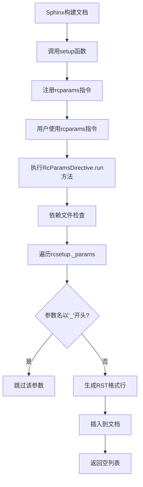
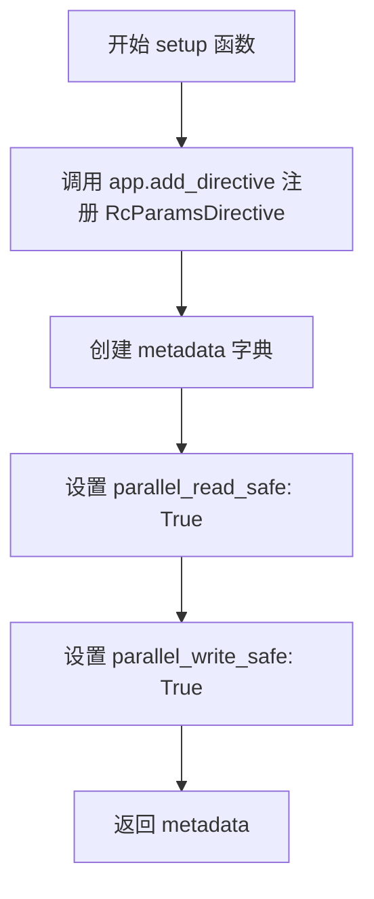
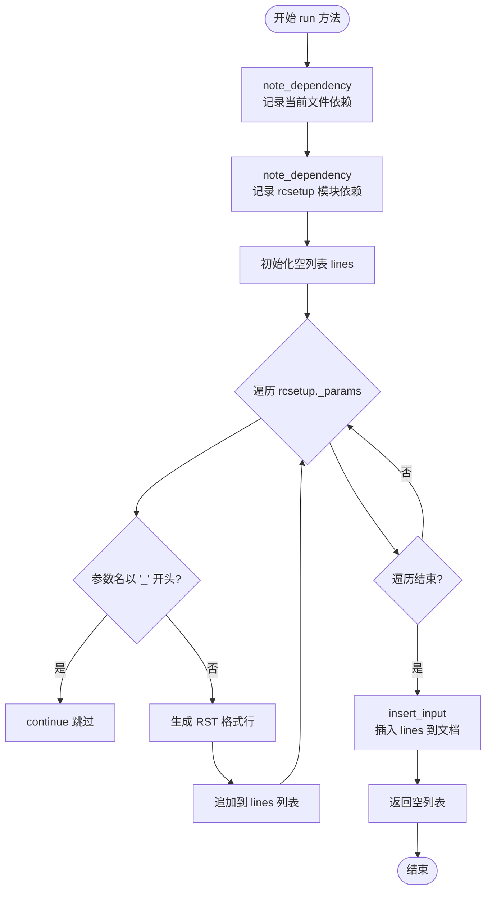
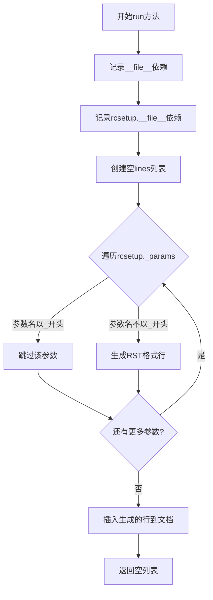
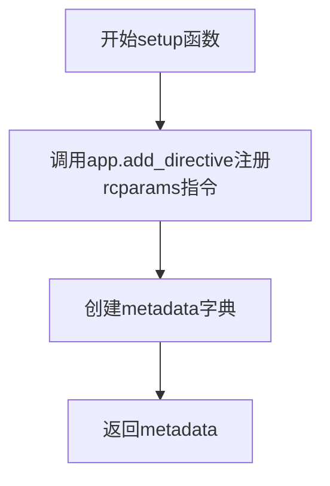

# `matplotlib\doc\sphinxext\rcparams.py` 详细设计文档

这是一个Sphinx扩展模块，通过注册自定义指令`rcparams`，自动遍历matplotlib的rcParams配置参数列表，生成对应的RST格式文档片段，用于构建matplotlib配置参数的参考文档。

## 整体流程



## 类结构

```
Directive (docutils.parsers.rst)
└── RcParamsDirective (自定义Sphinx指令)
```

## 全局变量及字段


### `Directive`
    
Docutils基类，用于创建自定义RST指令

类型：`class (from docutils.parsers.rst)`
    


### `rcsetup`
    
matplotlib配置参数设置模块，包含_params等属性

类型：`module (from matplotlib)`
    


### `RcParamsDirective.has_content`
    
指示指令是否有内容块

类型：`bool`
    


### `RcParamsDirective.required_arguments`
    
指令必需的参数数量

类型：`int`
    


### `RcParamsDirective.optional_arguments`
    
指令可选的参数数量

类型：`int`
    


### `RcParamsDirective.final_argument_whitespace`
    
指示最后一个参数是否允许空白

类型：`bool`
    


### `RcParamsDirective.option_spec`
    
指令支持的选项规范字典

类型：`dict`
    
    

## 全局函数及方法


### `setup`

这是 Sphinx 扩展的入口函数，用于注册自定义的 `rcparams` 指令到 Sphinx 应用中，并返回扩展的元数据信息。

参数：

- `app`：`Sphinx.application.Sphinx`，Sphinx 应用实例，用于注册指令和获取配置信息

返回值：`dict`，返回包含扩展并行读写安全状态的元数据字典

#### 流程图



#### 带注释源码

```python
def setup(app):
    """
    Sphinx 扩展入口函数，用于注册自定义指令。
    
    参数:
        app: Sphinx 应用实例，用于注册指令和获取配置信息
    
    返回:
        dict: 包含扩展并行读写安全状态的元数据字典
    """
    # 注册名为 "rcparams" 的自定义指令，关联到 RcParamsDirective 类
    app.add_directive("rcparams", RcParamsDirective)

    # 定义扩展的元数据，说明该扩展支持并行读写
    metadata = {'parallel_read_safe': True, 'parallel_write_safe': True}
    
    # 返回元数据字典，供 Sphinx 在加载扩展时读取
    return metadata
```


### `RcParamsDirective.run`

这是一个 Sphinx/Docutils 指令方法，用于在 Matplotlib 文档中动态生成 rcParams 参数的 RST 格式参考文档。它通过遍历 `rcsetup._params` 中的所有公共参数，为每个参数生成对应的文档锚点和描述，并将这些内容插入到文档流中。

参数：

- `self`：`RcParamsDirective`（隐式），指令实例本身，包含 `state`（文档解析状态）等属性

返回值：`list`，返回空列表，表示该指令不生成任何文档节点

#### 流程图



#### 带注释源码

```python
def run(self):
    """
    Generate rst documentation for rcParams.

    Note: The style is very simple, but will be refined later.
    """
    # 记录当前文件为依赖项，实现文档构建时的增量更新
    self.state.document.settings.env.note_dependency(__file__)
    # 记录 rcsetup 模块文件为依赖项，确保参数变化时触发重建
    self.state.document.settings.env.note_dependency(rcsetup.__file__)
    
    # 用于存储生成的 RST 格式文档行
    lines = []
    
    # 遍历所有 rcParams 参数
    for param in rcsetup._params:
        # 跳过私有参数（以下划线开头的参数）
        if param.name[0] == '_':
            continue
        
        # 为每个参数生成 RST 格式的文档：
        # 1. 锚点标签：.. _rcparam_{name}:
        # 2. 参数名和默认值：{name}: ``{default!r}``
        # 3. 参数描述：{description} 或 "*no description*"
        lines += [
            f'.. _rcparam_{param.name.replace(".", "_")}:',
            '',
            f'{param.name}: ``{param.default!r}``',
            f'    {param.description if param.description else "*no description*"}'
        ]
    
    # 将生成的行插入到文档状态机中，来源标记为 'rcParams table'
    self.state_machine.insert_input(lines, 'rcParams table')
    
    # 返回空列表，表示该指令不产生独立的文档节点
    return []
```

## 关键组件


### RcParamsDirective 类

核心文档生成类，继承自 docutils 的 Directive 指令类，用于自动生成 matplotlib rcParams 配置参数的 RST 格式文档。

### setup 函数

Sphinx 扩展的入口函数，负责注册 rcparams 指令到应用，并返回扩展的元数据。

### rcsetup._params

外部依赖数据源，提供 matplotlib 所有可配置的 rcParams 参数列表，每个参数包含 name、default、description 等属性。

### 文档生成逻辑

遍历 rcsetup._params 参数列表，跳过私有参数（以 _ 开头），为每个公共参数生成 RST 格式的文档链接和描述。

### 环境依赖追踪

通过 note_dependency 记录文档对源文件的依赖关系，确保文档在源文件变更时自动重建。


## 问题及建议


### 已知问题

-   **依赖私有API**：直接访问`rcsetup._params`私有属性，缺乏版本兼容性和稳定性保障
-   **缺少错误处理**：未对`rcsetup._params`不存在、参数属性缺失等情况进行异常捕获，可能导致运行时崩溃
-   **硬编码过滤逻辑**：使用`param.name[0] == '_'`过滤私有参数，逻辑简单且不够健壮
-   **无类型注解**：代码完全缺少类型提示，影响可维护性和IDE支持
-   **文档生成能力有限**：注释表明样式"very simple, but will be refined later"，功能未完善
-   **字符串格式化风险**：使用`param.default!r`直接格式化默认值，可能产生超长或格式不佳的输出

### 优化建议

-   添加try-except块处理`rcsetup._params`访问异常，提供有意义的错误信息
-   为Directive类和方法添加完整的类型注解（参数类型、返回值类型）
-   将私有参数过滤逻辑封装为可配置选项，支持白名单/黑名单机制
-   考虑添加max_line_length等选项控制输出格式，或使用textwrap模块处理长默认值
-   在文档注释中补充该指令的详细用法说明和示例
-   评估是否可通过公共API获取rcParams信息，减少版本兼容风险

## 其它


### 一段话描述

该代码是一个Sphinx RST扩展指令，用于自动生成matplotlib rcParams配置参数的文档，通过遍历`rcsetup._params`并生成RST格式的参考文档。

### 文件的整体运行流程

1. 当Sphinx构建文档时，遇到`rcparams`指令会创建`RcParamsDirective`实例
2. `run()`方法被调用执行文档生成逻辑
3. 首先记录对`__file__`和`rcsetup.__file__`的依赖
4. 遍历`rcsetup._params`中的所有参数对象
5. 过滤掉名称以`_`开头的私有参数
6. 为每个有效参数生成RST格式的锚点、参数名和默认值、描述信息
7. 通过`state_machine.insert_input()`将生成的行插入到文档流中
8. 返回空列表表示没有输出节点

### 类的详细信息

#### RcParamsDirective类

**类字段：**

| 名称 | 类型 | 描述 |
|------|------|------|
| has_content | bool | 指令是否有内容块，设为False |
| required_arguments | int | 必需参数数量，设为0 |
| optional_arguments | int | 可选参数数量，设为0 |
| final_argument_whitespace | bool | 最终参数是否允许空格，设为False |
| option_spec | dict | 指令选项规范，设为空字典 |

**类方法：**

##### run方法

- **名称**：run
- **参数**：无
- **参数类型**：无
- **参数描述**：无
- **返回值类型**：list
- **返回值描述**：返回空列表，表示该指令不产生独立的文档节点
- **mermaid流程图**：

- **带注释源码**：
```python
def run(self):
    """
    Generate rst documentation for rcparams.

    Note: The style is very simple, but will be refined later.
    """
    # 记录对当前文件和李节取文件的双重依赖，确保文档重建时能响应配置变更
    self.state.document.settings.env.note_dependency(__file__)
    self.state.document.settings.env.note_dependency(rcsetup.__file__)
    
    # 初始化存储生成行的列表
    lines = []
    
    # 遍历所有rcParams参数
    for param in rcsetup._params:
        # 过滤掉私有参数（以下划线开头）
        if param.name[0] == '_':
            continue
        
        # 构建RST格式的文档内容
        lines += [
            f'.. _rcparam_{param.name.replace(".", "_")}:',  # 锚点定义
            '',
            f'{param.name}: ``{param.default!r}``',           # 参数名和默认值
            f'    {param.description if param.description else "*no description*"}'  # 描述
        ]
    
    # 将生成的行插入到文档状态机中
    self.state_machine.insert_input(lines, 'rcparams table')
    return []
```

### 全局变量和全局函数信息

#### setup函数

- **名称**：setup
- **参数名称**：app
- **参数类型**：Sphinx应用对象
- **参数描述**：Sphinx应用程序实例，用于注册指令和获取配置
- **返回值类型**：dict
- **返回值描述**：返回包含并行读写安全性的元数据字典
- **mermaid流程图**：

- **带注释源码**：
```python
def setup(app):
    """
    注册rcparams指令到Sphinx应用。
    
    参数:
        app: Sphinx应用程序实例
    
    返回:
        包含并行处理安全性的元数据字典
    """
    # 注册自定义指令，指令名称为rcparams
    app.add_directive("rcparams", RcParamsDirective)

    # 定义指令的元数据，表明指令在并行读写时是安全的
    metadata = {'parallel_read_safe': True, 'parallel_write_safe': True}
    return metadata
```

### 关键组件信息

| 名称 | 一句话描述 |
|------|------------|
| RcParamsDirective | Sphinx RST指令类，负责生成rcParams配置参数的文档 |
| setup | 入口函数，用于向Sphinx注册指令并返回元数据 |
| rcsetup._params | matplotlib配置参数列表，包含name、default、description等属性 |
| state_machine | 文档状态机，用于插入生成的RST内容到文档流中 |

### 设计目标与约束

**设计目标：**
- 自动生成matplotlib rcParams配置的RST格式参考文档
- 避免手动维护配置参数文档，确保文档与代码同步
- 提供跨链接能力，通过锚点允许其他文档引用特定参数

**约束：**
- 依赖于`rcsetup._params`的结构，必须保持参数对象的属性兼容
- 仅生成简单格式的文档，暂不支持复杂布局和高级样式
- 指令无内容块和参数，调用方式固定为`.. rcparams::`

### 错误处理与异常设计

- **依赖文件缺失**：通过`note_dependency`确保文件变更时触发重建，但未处理文件不存在的情况
- **参数属性缺失**：使用条件表达式`param.description if param.description else "*no description*"`处理描述缺失的场景
- **参数名包含特殊字符**：使用`replace(".", "_")`处理点号，但未处理其他可能影响RST锚点有效性的字符
- **无显式异常捕获**：代码假设`rcsetup._params`始终存在且格式正确，错误会直接向上传播

### 数据流与状态机

**数据输入：**
- `rcsetup._params`：包含所有matplotlib配置参数的可迭代对象
- 每个param对象应具有`name`（字符串）、`default`（任意类型）、`description`（字符串或None）属性

**数据处理：**
- 过滤：以`_`开头的参数名被过滤排除
- 格式化：将参数对象转换为RST格式的字符串行

**数据输出：**
- RST格式的行列表，每行包含锚点定义、参数名、默认值、描述
- 通过`state_machine.insert_input`注入到文档解析流程

### 外部依赖与接口契约

**外部依赖：**
- `docutils.parsers.rst.Directive`：docutils指令基类
- `matplotlib.rcsetup`：matplotlib配置参数定义模块
- `rcsetup._params`：私有属性，依赖其内部数据结构

**接口契约：**
- `setup(app)`函数必须返回包含`parallel_read_safe`和`parallel_write_safe`的字典
- `RcParamsDirective.run()`必须返回空列表或节点列表
- `rcsetup._params`中的元素必须具有`name`（字符串）、`default`、`description`属性

### 潜在的技术债务或优化空间

1. **硬编码依赖私有API**：直接访问`rcsetup._params`私有属性，版本升级可能导致兼容性问题，应考虑通过公共API获取参数
2. **缺乏错误处理**：未对`rcsetup._params`为空或格式异常的情况进行处理
3. **简单格式化**：文档样式简单，不支持分组、分类、默认值说明等高级特性
4. **参数名处理不完整**：仅处理了点号的替换，其他特殊字符（如空格）可能破坏锚点有效性
5. **无缓存机制**：每次构建都重新生成，未利用缓存优化性能
6. **缺少单元测试**：代码未包含测试用例，依赖手动验证
7. **文档字符串过时**：`Note`中提到"will be refined later"但未实现

### 其它项目

**版本兼容性考虑：**
- 代码假设使用较新版本的docutils和Sphinx，需要确认最低支持版本
- `rcsetup._params`的实现细节可能在不同matplotlib版本间变化

**可扩展性建议：**
- 可添加选项支持过滤参数（如仅显示特定分类的参数）
- 可添加选项控制输出格式（表格、列表等）
- 可支持自定义描述格式化模板

**性能考量：**
- 遍历所有参数生成文档，在参数数量增多时可能影响构建速度
- 可考虑添加缓存或增量生成机制

    