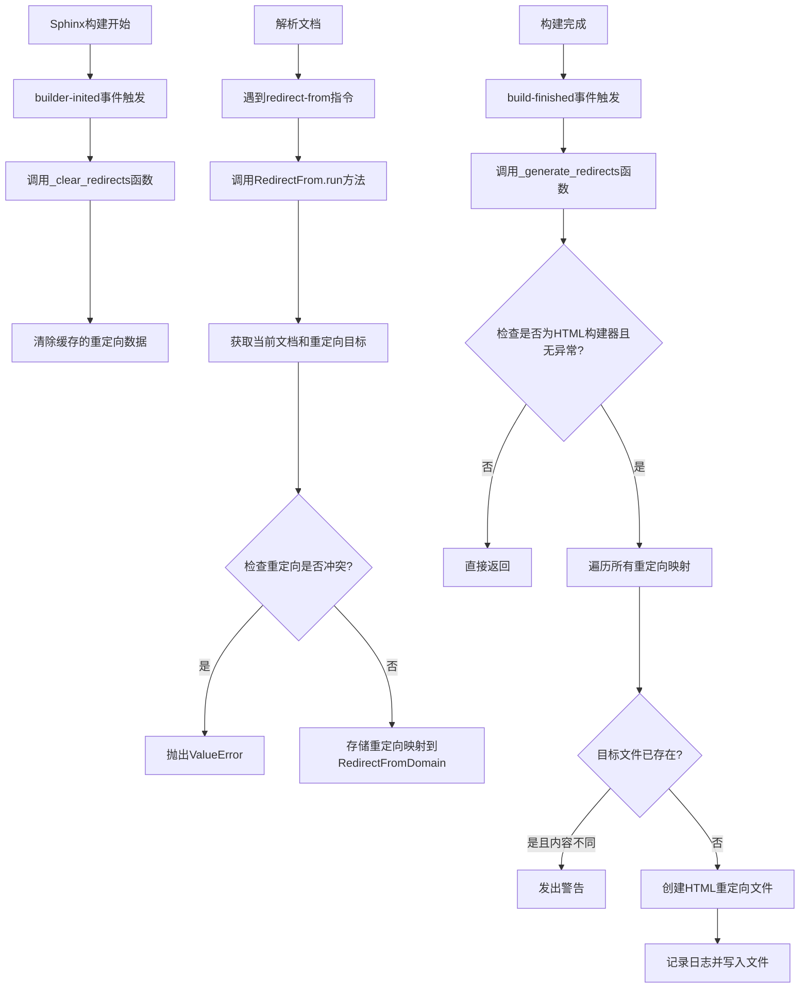
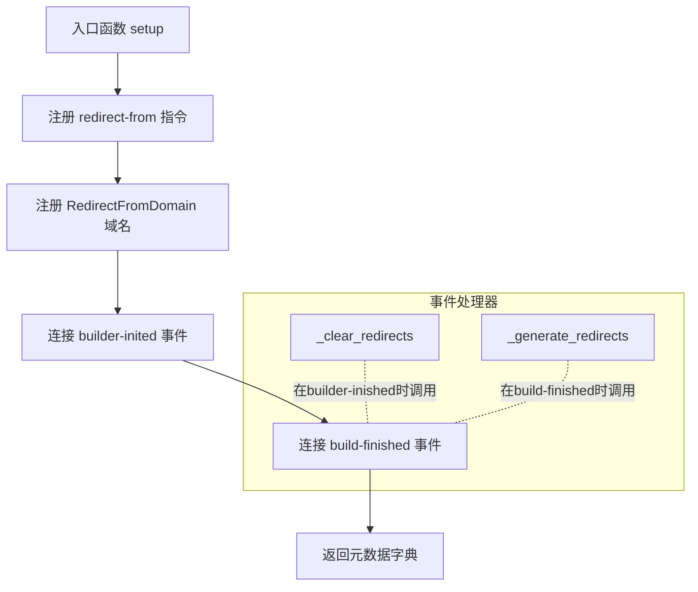
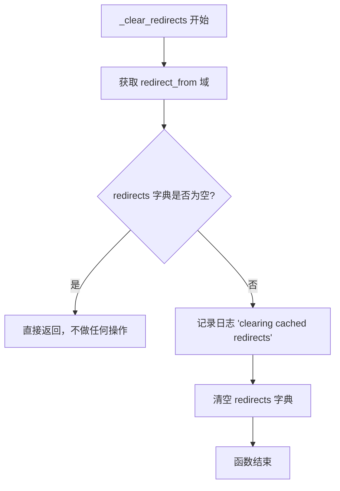
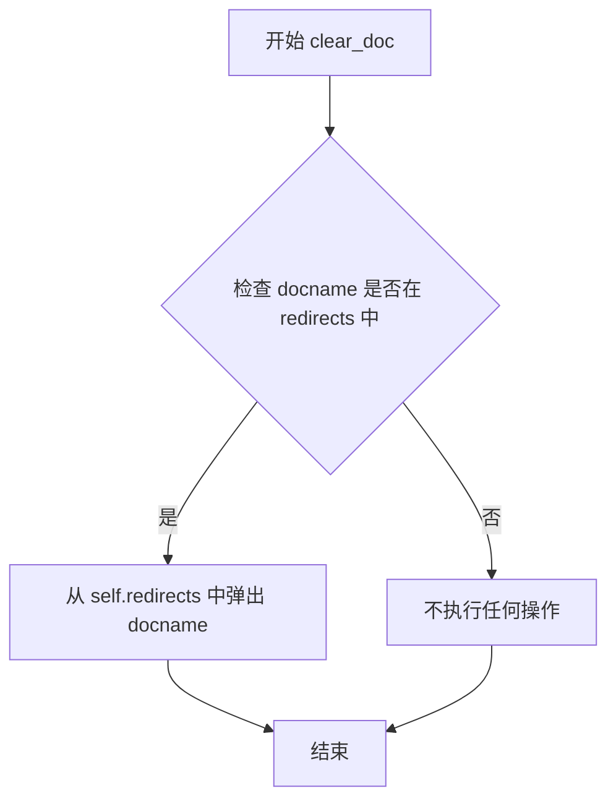
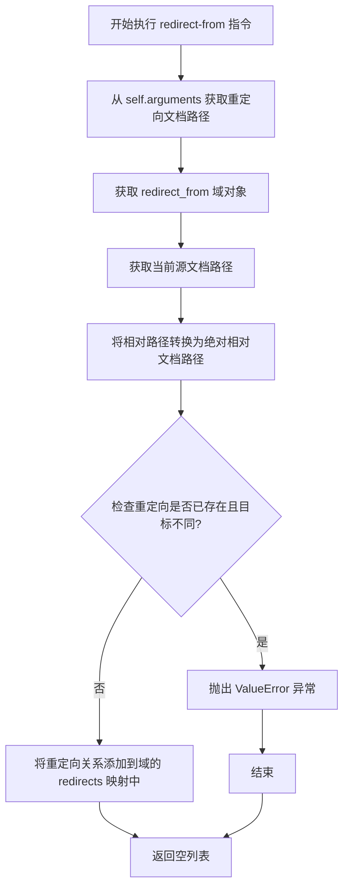

# `matplotlib\doc\sphinxext\redirect_from.py` 详细设计文档

这是一个Sphinx扩展，用于在文档构建时自动创建HTML重定向页面。当rst文件被移动或其内容被合并到其他文件时，使用redirect-from指令可以在构建目录中生成包含刷新元信息的HTML文件，将旧文档URL重定向到新位置。

## 整体流程



## 类结构

```
Sphinx Extension
├── setup (入口函数)
├── RedirectFromDomain (Domain类)
│   ├── name: str
│   ├── label: str
│   ├── redirects (property)
│   ├── clear_doc()
│   └── merge_domaindata()
├── RedirectFrom (SphinxDirective类)
│   ├── required_arguments: int
│   └── run()
├── _generate_redirects (全局函数)
└── _clear_redirects (全局函数)
```

## 全局变量及字段


### `HTML_TEMPLATE`
    
HTML重定向页面模板字符串,包含meta刷新标签

类型：`str`
    


### `logger`
    
模块级日志记录器

类型：`logging.Logger`
    


### `RedirectFromDomain.name`
    
域名标识符

类型：`str`
    


### `RedirectFromDomain.label`
    
域名显示标签

类型：`str`
    


### `RedirectFromDomain.redirects`
    
重定向映射字典(通过property访问)

类型：`dict`
    


### `RedirectFrom.required_arguments`
    
必需的位置参数数量

类型：`int = 1`
    
    

## 全局函数及方法


### `setup(app)`

Sphinx扩展的入口函数，负责注册自定义指令、域名以及构建过程中的事件处理器，以实现文档重定向功能。

参数：

-  `app`：`Sphinx` 应用实例，Sphinx核心对象，提供注册指令、域名和事件处理器的接口

返回值：`dict`，返回一个包含 `'parallel_read_safe': True` 的字典，表示该扩展在并行读取时是安全的

#### 流程图



#### 带注释源码

```python
def setup(app):
    """
    Sphinx扩展入口函数，用于初始化重定向功能。
    在Sphinx构建时自动调用此函数来注册扩展组件。
    """
    
    # 注册自定义指令 "redirect-from"，允许在RST文件中使用
    # 该指令用于指定当前文档被重定向自哪些旧路径
    app.add_directive("redirect-from", RedirectFrom)
    
    # 注册自定义域 "RedirectFromDomain"，用于存储重定向映射关系
    # 该域作为并行读取安全的数据存储
    app.add_domain(RedirectFromDomain)
    
    # 连接 "builder-inited" 事件，在构建器初始化时清除缓存的重定向
    app.connect("builder-inited", _clear_redirects)
    
    # 连接 "build-finished" 事件，在构建完成时生成重定向HTML文件
    app.connect("build-finished", _generate_redirects)
    
    # 返回扩展元数据
    # parallel_read_safe: True 表示该扩展可以安全地用于并行构建
    metadata = {'parallel_read_safe': True}
    return metadata
```


### `_generate_redirects(app, exception)`

该函数是 Sphinx 扩展 `redirect-from` 的核心功能实现，负责在构建完成后生成所有重定向 HTML 文件。它遍历重定向映射表，为每个需要重定向的旧文档路径生成一个包含 meta refresh 的 HTML 文件，使访问旧 URL 时自动跳转到新文档。

参数：

- `app`：`Sphinx.application` 对象，Sphinx 应用实例，包含构建器、环境和配置等信息
- `exception`：`Exception` 或 `None`，构建过程中发生的异常（如有），如果存在异常则不生成重定向文件

返回值：`None`，该函数没有返回值，通过早期返回或正常执行完毕结束

#### 流程图

```mermaid
flowchart TD
    A[开始 _generate_redirects] --> B{builder.name == 'html' 且 exception 为 None?}
    B -->|否| C[早期返回, 不执行重定向生成]
    B -->|是| D[获取 redirect_from 域的重定向映射]
    D --> E{遍历映射中的每个 key-value 对}
    E -->|遍历| F[构建输出文件路径: Path(app.outdir, k + builder.out_suffix)]
    F --> G[使用模板生成 HTML: HTML_TEMPLATE.format]
    G --> H{文件是否已存在?}
    H -->|是| I{文件内容是否与新生成的 HTML 不同?}
    I -->|是| J[记录警告: 文件已存在且内容不同]
    I -->|否| K[跳过, 不覆盖]
    H -->|否| L[创建父目录]
    L --> M[写入 HTML 文件]
    M --> E
    E -->|遍历完成| N[结束]
    J --> N
    K --> N
    C --> N
```

#### 带注释源码

```python
def _generate_redirects(app, exception):
    """
    在构建完成后生成所有重定向 HTML 文件。
    
    该函数作为 'build-finished' 事件的处理器被调用，
    遍历所有已注册的重定向关系，为每个旧文档路径生成
    一个包含 meta refresh 的 HTML 文件。
    
    参数:
        app: Sphinx 应用对象,包含 builder、env 等构建相关对象
        exception: 构建过程中抛出的异常对象,若无异常则为 None
    
    返回值:
        None: 该函数不返回任何值,通过副作用完成重定向文件的生成
    """
    
    # 从 app 获取构建器对象,用于判断构建类型和获取输出路径信息
    builder = app.builder
    
    # 仅当构建器为 HTML 类型且构建过程无异常时才执行重定向生成
    # 这样可以避免在非 HTML 构建或构建失败时产生无效的重定向文件
    if builder.name != "html" or exception:
        return
    
    # 从环境域中获取 redirect_from 域的重定向映射表
    # 映射表结构: {旧文档相对路径: 新文档相对路径}
    for k, v in app.env.get_domain('redirect_from').redirects.items():
        
        # 拼接完整的输出文件路径
        # k: 旧文档的相对路径(如 'topic/old-page')
        # builder.out_suffix: HTML 文件后缀(通常为 '.html')
        p = Path(app.outdir, k + builder.out_suffix)
        
        # 使用模板生成重定向 HTML 内容
        # builder.get_relative_uri(k, v): 计算从旧路径 k 到新路径 v 的相对 URI
        html = HTML_TEMPLATE.format(v=builder.get_relative_uri(k, v))
        
        # 检查目标文件是否已存在
        if p.is_file():
            # 如果文件存在,对比内容是否相同
            # 这种情况通常发生在手动创建了同名文件,或之前已执行过重定向生成
            if p.read_text() != html:
                logger.warning(
                    'A redirect-from directive is trying to '
                    'create %s, but that file already exists '
                    '(perhaps you need to run "make clean")', p
                )
        else:
            # 文件不存在,创建新的重定向文件
            logger.info('making refresh html file: %s redirect to %s', k, v)
            
            # 确保父目录存在,处理跨子目录的重定向场景
            p.parent.mkdir(parents=True, exist_ok=True)
            
            # 写入 UTF-8 编码的 HTML 内容
            p.write_text(html, encoding='utf-8')
```


### `_clear_redirects`

在 Sphinx 构建过程初始化阶段，清除上一次构建遗留的重定向缓存数据，确保每次构建都从干净的状态开始，避免使用过期的重定向映射。

参数：

- `app`：`Sphinx.application.Sphinx`，Sphinx 应用实例，包含了环境配置、构建器信息和域数据等

返回值：`None`，无返回值，仅执行副作用操作

#### 流程图



#### 带注释源码

```python
def _clear_redirects(app):
    """
    清除上一次构建缓存的重定向数据
    
    该函数在 Sphinx builder-inited 事件触发时调用，
    确保每次构建都使用最新的重定向配置。
    
    参数:
        app: Sphinx 应用实例，包含了当前构建的所有上下文信息
    
    返回值:
        无返回值
    """
    # 从应用环境中获取 redirect_from 域
    domain = app.env.get_domain('redirect_from')
    
    # 检查是否存在缓存的重定向数据
    if domain.redirects:
        # 记录日志，提示正在清除缓存
        logger.info('clearing cached redirects')
        
        # 清空重定向字典，释放内存
        domain.redirects.clear()
```


### `RedirectFromDomain.redirects`

该属性是 `RedirectFromDomain` 类的只读属性，用于获取存储在域数据中的重定向映射字典。如果映射不存在，则自动创建空字典。

参数：无（该方法为属性访问器，隐式接收 `self` 参数）

返回值：`dict`，返回重定向映射字典，其中键为源文档路径，值为目标文档路径。

#### 流程图

```mermaid
flowchart TD
    A[开始访问 redirects 属性] --> B{self.data 中是否存在 'redirects' 键}
    B -->|存在| C[返回 self.data['redirects']]
    B -->|不存在| D[创建空字典作为默认值]
    D --> E[self.data.setdefault('redirects', {})]
    E --> F[返回新创建的空字典]
    C --> G[结束]
    F --> G
```

#### 带注释源码

```python
@property
def redirects(self):
    """The mapping of the redirects."""
    # self.data 是 Sphinx Domain 用于存储域数据的字典
    # setdefault 方法：如果键存在则返回其值，如果不存在则设置默认值并返回
    # 这里确保 'redirects' 键始终存在，返回一个字典用于存储重定向映射
    # 字典结构：{源文档相对路径: 目标文档相对路径}
    return self.data.setdefault('redirects', {})
```


### `RedirectFromDomain.clear_doc`

清除指定文档的重定向记录，从重定向映射中移除指定文档名称的条目。

参数：

- `docname`：`str`，需要清除重定向记录的文档名称

返回值：`None`，无返回值

#### 流程图



#### 带注释源码

```python
def clear_doc(self, docname):
    """
    清除指定文档的重定向记录。

    参数:
        docname: str, 需要清除重定向映射的文档名称

    返回值:
        None

    说明:
        使用字典的 pop 方法从 redirects 映射中移除指定的 docname。
        如果 docname 不存在，pop 方法会返回 None 而不会抛出异常。
        这允许在不检查键是否存在的情况下安全地删除条目。
    """
    self.redirects.pop(docname, None)
```


### `RedirectFromDomain.merge_domaindata`

该方法用于在 Sphinx 并行构建过程中合并来自不同进程的域数据（重定向映射），确保在并行读取阶段各个子进程的重定向数据能够正确汇总到主进程中，同时检测并防止冲突的重定向配置。

参数：
- `docnames`：集（set），在当前版本的实现中未使用，仅作为 Sphinx 合并接口的签名参数保留
- `otherdata`：字典（dict），来自另一个并行进程或子域的域数据，包含键 `'redirects'`，其值为重定向映射字典

返回值：`None`（无显式返回值），通过直接修改实例属性 `self.redirects` 来完成数据合并

#### 流程图

```mermaid
flowchart TD
    A[开始 merge_domaindata] --> B{遍历 otherdata['redirects'] 项}
    B --> C{检查源文档 src 是否在 self.redirects 中}
    C -->|不存在| D[直接添加 src -> dst 映射]
    C -->|存在| E{检查目标地址是否相同}
    E -->|相同| F[跳过，继续下一项]
    E -->|不同| G[抛出 ValueError 异常]
    D --> B
    F --> B
    G --> H[终止合并]
```

#### 带注释源码

```python
def merge_domaindata(self, docnames, otherdata):
    """
    合并来自并行构建的其他进程/子域的重定向数据。
    
    该方法在 Sphinx 并行构建的归约（reduce）阶段被调用，
    用于将子进程收集的域数据合并到主进程的域对象中。
    
    参数:
        docnames: 当前未使用，仅为符合 Sphinx Domain 基类接口而保留
        otherdata: 包含 'redirects' 键的字典，值为 {源文档: 目标文档} 映射
    
    异常:
        ValueError: 当检测到同一源文档被重定向到不同目标时抛出
    """
    # 遍历另一个数据源中的所有重定向项
    for src, dst in otherdata['redirects'].items():
        # 情况1: 当前域中不存在该源文档的重定向记录
        # 直接添加映射，无需冲突检查
        if src not in self.redirects:
            self.redirects[src] = dst
        # 情况2: 当前域中已存在该源文档的重定向
        # 需要验证目标地址是否一致，避免冲突
        elif self.redirects[src] != dst:
            # 检测到不一致的重定向配置，抛出异常终止构建
            raise ValueError(
                f"Inconsistent redirections from {src} to "
                f"{self.redirects[src]} and {otherdata['redirects'][src]}")
```

---

#### 完整类信息：`RedirectFromDomain`

`RedirectFromDomain` 是 Sphinx 扩展 `sphinx.ext.redirects` 的核心领域对象，充当重定向映射的数据存储容器。

类字段：
- `name`：字符串，领域名称 `'redirect_from'`
- `label`：字符串，领域标签 `'redirect_from'`
- `redirects`：属性（property），返回 `self.data` 中的重定向映射字典

类方法：
| 方法名 | 功能描述 |
|--------|----------|
| `clear_doc(docname)` | 清除指定文档的重定向记录 |
| `merge_domaindata(docnames, otherdata)` | 合并并行构建时的域数据 |

---

#### 关键组件信息

| 组件名称 | 描述 |
|----------|------|
| `RedirectFrom` 指令 | Sphinx 指令，解析 `.. redirect-from::` 标记并注册重定向 |
| `HTML_TEMPLATE` | HTML 刷新页面模板，用于生成重定向目标页面 |
| `_generate_redirects` 函数 | 构建完成后生成实际的 HTML 重定向文件 |
| `_clear_redirects` 函数 | 构建开始前清除缓存的重定向数据 |

---

#### 潜在技术债务与优化空间

1. **未使用的参数**：`merge_domaindata` 的 `docnames` 参数未被使用，可考虑移除或添加注释说明保留原因
2. **冲突处理粒度**：当前遇到冲突直接抛出异常中断构建，可考虑改为警告并采用首次写入或最后写入策略
3. **并发写入风险**：在极高并发场景下字典的读写操作缺乏锁保护，虽然 Sphinx 的任务调度保证了串行调用
4. **缺乏数据验证**：未对 `redirected_doc` 路径格式进行验证，可能接受不规范的输入

---

#### 错误处理设计

- **冲突检测**：通过比较同一源文档的目标地址是否一致来检测冲突，检测到不一致时抛出 `ValueError` 并附带详细错误信息
- **文件覆盖警告**：在生成重定向文件时，若目标文件已存在且内容不同，会输出警告建议运行 `make clean`


### `RedirectFrom.run()`

该方法是 Sphinx 指令 `redirect-from` 的核心执行逻辑，负责解析指令参数、获取当前文档信息、验证重定向目标的有效性，并将重定向关系注册到 `RedirectFromDomain` 中。

#### 参数

- `self`：`RedirectFrom`，Sphinx 指令类的实例，继承自 `SphinxDirective`

#### 返回值

- `list`，返回空列表，表示指令不生成任何 AST 节点

#### 流程图



#### 带注释源码

```python
def run(self):
    """
    执行 redirect-from 指令的核心逻辑
    
    该方法负责：
    1. 解析重定向源文档路径
    2. 获取当前文档路径
    3. 验证重定向目标的有效性
    4. 注册重定向关系到域中
    """
    # 从指令参数中获取重定向的文档路径
    # self.arguments 来自 SphinxDirective，required_arguments = 1
    redirected_doc, = self.arguments
    
    # 获取 redirect_from 域的实例，用于存储重定向映射关系
    domain = self.env.get_domain('redirect_from')
    
    # 获取当前正在处理的文档的路径
    # self.state.document.current_source 返回当前文档的源文件路径
    current_doc = self.env.path2doc(self.state.document.current_source)
    
    # 将相对路径转换为相对文档路径
    # 处理可能跨目录的重定向，例如 /topic/subdir1/old-page.rst
    redirected_reldoc, _ = self.env.relfn2path(redirected_doc, current_doc)
    
    # 检查是否存在冲突的重定向
    # 如果同一个源文档已经被重定向到另一个不同的目标文档，则报错
    if (
        redirected_reldoc in domain.redirects
        and domain.redirects[redirected_reldoc] != current_doc
    ):
        raise ValueError(
            f"{redirected_reldoc} is already noted as redirecting to "
            f"{domain.redirects[redirected_reldoc]}\n"
            f"Cannot also redirect it to {current_doc}"
        )
    
    # 注册重定向关系：将旧文档路径映射到当前文档路径
    domain.redirects[redirected_reldoc] = current_doc
    
    # 返回空列表，表示此指令不创建任何文档节点
    return []
```

## 关键组件


### RedirectFromDomain

Sphinx 域类，作为并行读取安全的数据存储，保存重定向映射关系（源路径到目标路径的字典），并提供清除文档和合并域数据的方法。

### RedirectFrom

Sphinx 指令类，用于在文档中指定重定向关系，解析指令参数并将重定向映射添加到域数据中，同时检测冲突的重定向。

### HTML_TEMPLATE

字符串常量，定义重定向 HTML 页面的模板，包含 UTF-8 编码声明和元刷新指令，用于将旧文档重定向到新文档。

### setup 函数

Sphinx 扩展的入口点，注册 RedirectFrom 指令、RedirectFromDomain 域，连接构建事件处理器，并返回并行读取安全的元数据。

### _generate_redirects 函数

在构建完成时生成重定向 HTML 文件的函数，检查构建器类型，遍历重定向映射，创建包含刷新指令的 HTML 文件，并处理文件已存在的警告。

### _clear_redirects 函数

在构建开始前清除缓存重定向的函数，获取重定向域并清空其 redirects 字典，确保每次构建从干净状态开始。

### 重定向冲突检测

在 RedirectFrom.run() 方法中实现的逻辑，检测同一源路径是否被多个目标文档重定向，防止不一致的重定向配置。

### 并行构建支持

通过 RedirectFromDomain.merge_domaindata() 方法实现，支持在并行构建时合并来自不同进程的重定向数据，并检测冲突的重定向。


## 问题及建议


### 已知问题

- **文件冲突处理不完善**：当重定向目标文件已存在且内容不同时，仅输出警告信息，不会采取任何纠正措施（如覆盖或提示用户手动处理），可能导致构建成功但重定向功能失效。
- **缺少异常处理**：文件写入操作（`p.write_text`、`p.parent.mkdir`）未捕获可能的IO异常（如权限不足、磁盘空间不足），可能导致构建意外中断。
- **未验证目标文档存在性**：在注册重定向时未检查目标文档（`current_doc`）是否真实存在于项目文档中，可能创建指向不存在文档的重定向。
- **并发写入风险**：虽然声明为`parallel_read_safe`，但写入文件时缺乏锁机制，多进程并行构建时可能产生竞态条件，导致文件写入冲突或内容覆盖。
- **不支持其他构建器**：仅检查`html`构建器，但未对不支持的构建器给出明确提示，用户可能误以为其他构建器也支持此功能。

### 优化建议

- 添加文件写入的异常处理，使用`try-except`捕获`OSError`等异常，并给出明确的错误信息。
- 在注册重定向前验证目标文档存在性，可通过`self.env.get_doctree(current_doc)`或检查文档文件是否存在来实现。
- 对于已存在且内容不同的文件，可以考虑添加配置选项让用户选择覆盖或保留原文件。
- 添加构建器兼容性检查，对于不支持的构建器记录日志信息，避免用户困惑。
- 考虑使用文件锁或原子写入操作（如临时文件+重命名）来保证并发安全。
- 添加增量构建支持，确保重定向数据能正确序列化和反序列化，避免每次完整构建。

## 其它


### 设计目标与约束

本扩展旨在解决RST文档重构后的旧链接失效问题，通过自动生成HTML重定向文件实现无缝迁移。设计约束包括：仅支持HTML构建器、重定向源文件必须在构建输出前不存在（防止覆盖现有内容）、需要Sphinx 1.0+版本支持。

### 错误处理与异常设计

代码包含两类错误处理：1）ValueError异常：当同一文档被重定向到多个目标或数据合并时存在冲突，会抛出详细错误信息；2）警告机制：当重定向目标文件已存在时输出警告，建议运行"make clean"。异常设计遵循Sphinx标准模式，通过返回值和日志记录而非抛出异常处理常规情况。

### 数据流与状态机

数据流分为三个阶段：1）解析阶段：RedirectFrom指令在文档解析时执行，将重定向映射注册到RedirectFromDomain；2）构建初始化阶段：builder-inited事件清除缓存的重定向；3）生成阶段：build-finished事件触发_redirects生成函数，遍历所有重定向映射创建HTML文件。

### 外部依赖与接口契约

主要依赖包括：pathlib.Path用于文件路径操作、sphinx.util.docutils.SphinxDirective定义指令接口、sphinx.domains.Domain定义域接口、sphinx.util.logging日志接口。app.connect()注册事件处理器，app.add_directive()和app.add_domain()注册扩展组件。

### 性能考虑

扩展标记为parallel_read_safe: True，支持并行读取。数据存储使用Python字典实现O(1)查找性能。文件写入使用Path.write_text()一次性写入，避免频繁IO。重定向生成在构建结束时批量处理。

### 安全性考虑

代码通过p.parent.mkdir(parents=True, exist_ok=True)安全创建目录。使用encoding='utf-8'明确编码防止乱码。Path.read_text()和write_text()操作限制在特定输出目录，不会访问系统敏感路径。

### 测试策略

建议测试场景包括：单文件重定向、多级目录跨目录重定向、重复重定向检测、冲突重定向检测、已存在文件的警告行为、并行构建支持。测试应覆盖Sphinx项目集成测试和单元测试。

### 配置选项

当前版本无额外配置选项。HTML模板通过HTML_TEMPLATE常量定义，刷新延迟为0秒，相对URI通过builder.get_relative_uri()方法获取。未来可考虑添加自定义刷新延迟、模板定制等配置。

### 兼容性考虑

仅兼容Sphinx的HTML构建器（builder.name == "html"）。输出后缀通过builder.out_suffix动态获取，兼容不同Sphinx版本。域合并逻辑确保并行构建时的数据一致性。

### 使用示例

在new-page.rst中使用：
```
.. redirect-from:: /topic/old-page
```

跨目录重定向：
```
.. redirect-from:: /topic/subdir1/old-page.rst
```

构建后将自动在build/html/topic/old-page.html生成重定向页面。


    