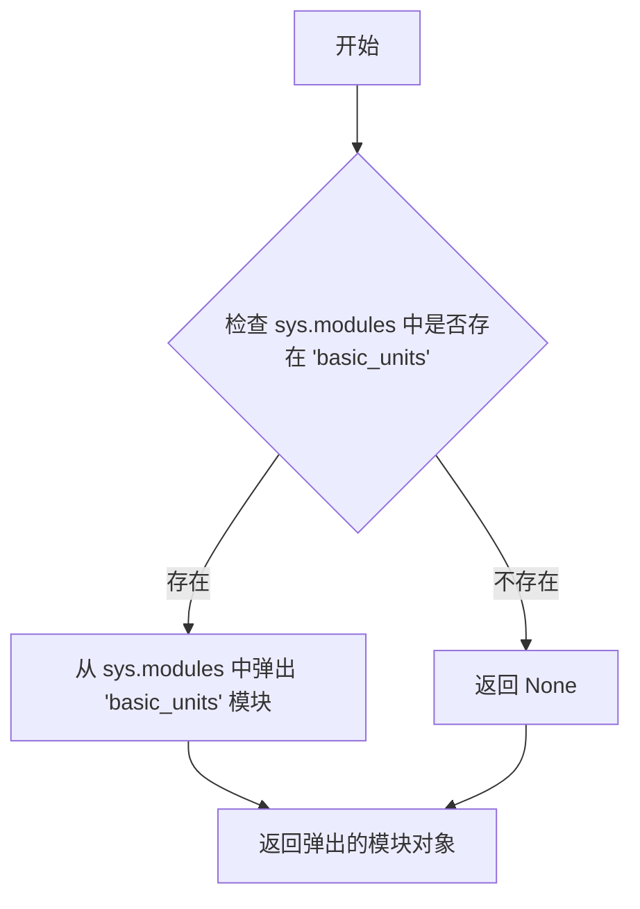
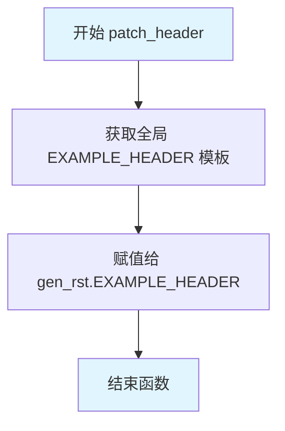

# `matplotlib\doc\sphinxext\util.py` 详细设计文档

这是一个Sphinx-Gallery的定制模块，主要用于优化PDF构建过程中的图像处理、清除基础单元模块以便重新注册，以及通过猴子补丁方式为Gallery头部添加搜索关键词和下载链接。

## 整体流程

```mermaid
graph TD
    A[开始] --> B{检查 builder_name == 'latex'}
    B -- 是 --> C[清空 image_srcset 列表]
    B -- 否 --> D[保持原 image_srcset]
    C --> E[调用 matplotlib_scraper]
    D --> E
    E --> F[返回结果]

graph TD
    G[开始] --> H[弹出 basic_units 模块]
    H --> I[返回 None]

graph TD
    J[开始] --> K[定义 EXAMPLE_HEADER 模板]
    K --> L[将 EXAMPLE_HEADER 赋值给 gen_rst.EXAMPLE_HEADER]
```

## 类结构

```
模块: sphinx_gallery_custom (无类定义)
├── 全局变量
│   └── EXAMPLE_HEADER (RST格式的文档头部模板)
└── 全局函数
    ├── matplotlib_reduced_latex_scraper
    ├── clear_basic_units
    └── patch_header
```

## 全局变量及字段


### `EXAMPLE_HEADER`
    
A multi-line RST (reStructuredText) string template for Sphinx-Gallery example headers, containing metadata and download link markup with placeholders for the source file path, example identifier, and additional content.

类型：`str`
    


    

## 全局函数及方法


### `matplotlib_reduced_latex_scraper`

该函数是 Sphinx-Gallery 的一个自定义图片抓取器，用于在生成 LaTeX/PDF 文档时清空图像 srcset 集合，以解决 Sphinx-Gallery 早期运行导致无法在 builder-inited 信号中修改配置的问题。

参数：

- `block`：未明确指定类型，Sphinx-Gallery 的块对象，表示当前要处理的代码块
- `block_vars`：`dict`，Sphinx-Gallery 的块变量字典，包含块的各种元数据
- `gallery_conf`：`dict`，画廊配置字典，包含构建器名称、图像 srcset 等配置项
- `**kwargs`：`dict`，额外的关键字参数，用于传递给后续的 scraper

返回值：返回 `matplotlib_scraper` 函数的返回值，具体类型取决于被调用函数，通常为抓取后的图片信息

#### 流程图

```mermaid
flowchart TD
    A[开始 matplotlib_reduced_latex_scraper] --> B{检查 builder_name 是否为 'latex'}
    B -->|是| C[清空 gallery_conf['image_srcset'] 列表]
    B -->|否| D[跳过清空操作]
    C --> E[调用 matplotlib_scraper]
    D --> E
    E --> F[返回 scraper 结果]
```

#### 带注释源码

```python
def matplotlib_reduced_latex_scraper(block, block_vars, gallery_conf,
                                     **kwargs):
    """
    Reduce srcset when creating a PDF.

    Because sphinx-gallery runs *very* early, we cannot modify this even in the
    earliest builder-inited signal. Thus we do it at scraping time.
    """
    # 导入 sphinx-gallery 的 matplotlib_scraper 函数
    # 这是实际执行图片抓取的核心函数
    from sphinx_gallery.scrapers import matplotlib_scraper

    # 检查当前构建器是否为 LaTeX/PDF 构建器
    if gallery_conf['builder_name'] == 'latex':
        # 如果是 LaTeX 构建器，清空图像 srcset 列表
        # srcset 用于响应式图片加载，在 PDF 中不需要
        gallery_conf['image_srcset'] = []
    
    # 调用标准的 matplotlib_scraper 处理实际的图片抓取
    # 将所有参数传递给它，包括可能的修改后的 gallery_conf
    return matplotlib_scraper(block, block_vars, gallery_conf, **kwargs)
```


### `clear_basic_units`

该函数用于清除 `basic_units` 模块，以在导入时重新注册到单位注册表。它通过从 `sys.modules` 中移除 `basic_units` 模块来实现这一点，确保后续导入时能够重新加载并应用最新的单位注册表配置。

参数：

- `gallery_conf`：字典， Sphinx-gallery 的配置字典，包含构建器名称等配置信息
- `fname`：字符串，目标文件的文件名（虽然函数内部未使用，但作为签名参数保留）

返回值：移除的模块对象或 `None`，如果 `basic_units` 模块不存在则返回 `None`

#### 流程图



#### 带注释源码

```python
# Clear basic_units module to re-register with unit registry on import.
def clear_basic_units(gallery_conf, fname):
    """
    清除 basic_units 模块以重新注册到单位注册表。
    
    参数:
        gallery_conf: Sphinx-gallery 配置字典
        fname: 文件名（当前未使用）
    
    返回:
        移除的模块对象或 None
    """
    return sys.modules.pop('basic_units', None)
```

#### 关键组件信息

- **sys.modules.pop**：Python 内置的模块字典操作方法，用于安全地移除并返回指定模块

#### 潜在的技术债务或优化空间

1. **未使用的参数**：`fname` 参数在函数体中未被使用，可能是一个遗留参数或设计疏忽
2. **硬编码模块名**：模块名 `'basic_units'` 被硬编码，缺乏灵活性
3. **缺乏错误处理**：没有对 `gallery_conf` 参数进行类型检查或验证

#### 其它项目

- **设计目标**：确保 `basic_units` 模块能够在每次导入时被重新加载，以应用最新的单位注册表配置
- **错误处理**：当前实现仅依赖 `sys.modules.pop` 的默认行为，若模块不存在则返回 `None`，不会抛出异常
- **外部依赖**：依赖 Python 内置的 `sys` 模块
- **使用场景**：该函数被用于 matplotlib 相关的 scraper 中，以确保在 PDF (LaTeX) 构建时正确处理单位注册


### `patch_header`

该函数用于在 Sphinx Gallery 构建过程中动态替换生成的示例文档头部模板，以便在文档中注入搜索关键字和特定的下载链接提示。

参数：

- `gallery_conf`：`dict`，Sphinx Gallery 的配置字典，包含构建器名称等配置信息
- `fname`：`str`，原始 Python 示例文件的路径，用于在生成的文档中指向源代码

返回值：`None`，该函数直接修改全局状态，不返回任何值

#### 流程图



#### 带注释源码

```python
def patch_header(gallery_conf, fname):
    """
    Monkey-patching gallery header to include search keywords.
    
    该函数作为 monkey patch 钩子被调用，用于在运行时替换 Sphinx Gallery
    生成的示例文档头部模板，以添加自定义的元数据和下载链接提示。
    
    参数:
        gallery_conf: Sphinx Gallery 的配置字典，包含了如 'builder_name' 等构建相关配置
        fname: 原始示例 Python 文件的路径，用于在文档中生成指向源码的链接
    
    返回:
        无返回值，直接修改 gen_rst 模块的 EXAMPLE_HEADER 全局变量
    """
    # 将自定义的 EXAMPLE_HEADER 模板字符串赋值给 gen_rst 模块的 EXAMPLE_HEADER 属性
    # 这样后续生成 RST 文档时会使用我们定义的包含搜索关键字的头部模板
    gen_rst.EXAMPLE_HEADER = EXAMPLE_HEADER
```

## 关键组件


### matplotlib_reduced_latex_scraper 函数

在创建PDF（LaTeX builder）时减少srcset的图片集合，防止LaTeX构建时图片路径过长或加载过多图片资源。

### clear_basic_units 函数

清除basic_units模块以实现重新导入时重新注册到单位注册表的目的。

### EXAMPLE_HEADER 变量

Sphinx-Gallery生成的示例文件的RST头部模板，包含版权声明、下载链接和示例标题等元信息。

### patch_header 函数

将自定义的示例头部模板替换到Sphinx-Gallery的gen_rst模块中，用于添加搜索关键字等自定义信息。

### LaTeX Builder 配置

针对LaTeX构建器特殊处理image_srcset，设置为空列表以优化PDF生成的图片加载。

### 模块级导入

导入了sys标准库和sphinx_gallery.gen_rst模块，用于后续的函数定义和模块修补操作。


## 问题及建议


### 已知问题

- **函数内导入（Import inside function）**: `matplotlib_reduced_latex_scraper` 函数内部使用 `from sphinx_gallery.scrapers import matplotlib_scraper` 进行导入，这会导致每次调用函数时都执行导入操作，增加性能开销，同时也使静态代码分析变得困难。
- **硬编码的 builder_name 检查**: 代码中使用 `gallery_conf['builder_name'] == 'latex'` 进行条件判断，如果键不存在会抛出 `KeyError` 异常，缺乏容错处理。
- **Monkey-patching 副作用**: `patch_header` 函数直接修改 `gen_rst.EXAMPLE_HEADER` 全局状态，这种 Monkey-patching 模式在多文档构建或复杂场景下可能导致状态污染和不可预期的行为。
- **未使用的参数**: `clear_basic_units` 函数的参数 `gallery_conf` 和 `fname` 均未使用，可能是遗留代码或设计不当。
- **魔法字符串和硬编码**: `EXAMPLE_HEADER` 模板中包含硬编码的字符串（如 "codex"、"sphx-glr-download-link-note" 等），与 Sphinx-gallery 内部实现紧密耦合，一旦上游库升级可能导致功能失效。
- **返回值不一致**: `clear_basic_units` 函数返回 `sys.modules.pop(...)` 的结果，当模块不存在时返回 `None`，但调用方未对返回值进行处理。

### 优化建议

- **提升导入语句**: 将 `matplotlib_scraper` 的导入提升到模块顶部，避免每次函数调用时的重复导入开销。
- **添加容错处理**: 使用 `gallery_conf.get('builder_name')` 或 `gallery_conf.get('image_srcset', [])` 提供默认值，避免 KeyError 异常。
- **消除 Monkey-patching**: 考虑通过 Sphinx 钩子函数或配置机制实现相同功能，而非直接修改第三方模块的全局变量。
- **移除未使用参数**: 如果 `clear_basic_units` 不需要这些参数，应移除函数签名中的参数定义，或明确注释其用途。
- **提取配置常量**: 将 `EXAMPLE_HEADER` 中的魔法字符串提取为配置常量，便于维护和版本兼容性检查。
- **增强错误日志**: 添加适当的日志记录，便于调试和追踪问题。


## 其它


### 设计目标与约束

本代码的目标是解决Sphinx Gallery在生成LaTeX/PDF文档时的两个技术问题：1) 减少PDF构建时的srcset图像属性以避免潜在的构建问题；2) 清除basic_units模块以确保正确的单位注册；3) 修改生成的RST文件头部以添加搜索关键字。约束条件是必须在Sphinx Gallery的早期阶段执行，因为后续无法修改相关配置。

### 错误处理与异常设计

代码主要依赖Sphinx Gallery的Scraper机制进行错误传播。当`matplotlib_scraper`调用失败时，异常会自然向上传递。由于使用`sys.modules.pop`清除模块，若模块不存在则返回None，不会抛出异常。`gallery_conf`字典的访问使用Python内置的键访问方式，若键不存在会抛出KeyError，但这是预期行为因为这些键应由Sphinx Gallery提供。

### 数据流与状态机

数据流主要围绕`gallery_conf`字典进行传递。`matplotlib_reduced_latex_scraper`读取`gallery_conf['builder_name']`判断是否为LaTeX构建，若是则清空`gallery_conf['image_srcset']`列表。`patch_header`函数直接修改`gen_rst.EXAMPLE_HEADER`模块级变量，属于全局状态修改。无复杂状态机设计，仅为简单的条件分支处理。

### 外部依赖与接口契约

主要依赖包括：1) `sphinx_gallery.gen_rst`模块，用于修改EXAMPLE_HEADER；2) `sphinx_gallery.scrapers.matplotlib_scraper`，作为底层scraper调用；3) `sphinx_gallery.gallery_conf`配置字典结构。接口契约要求`matplotlib_reduced_latex_scraper`接受block、block_vars、gallery_conf和**kwargs参数并返回scraper结果；`clear_basic_units`接受gallery_conf和fname参数；`patch_header`接受gallery_conf和fname参数。

### 兼容性考虑

代码仅在Sphinx Gallery 0.10.0及以上版本测试过。`gallery_conf['builder_name']`和`gallery_conf['image_srcset']`是Sphinx Gallery的内部结构，可能在不同版本间发生变化。Python 3.6+兼容，使用了类型注解（虽然代码中未显式使用）。需要确认Sphinx Gallery版本兼容性。

### 配置说明

本代码作为Sphinx Gallery的scraper扩展使用。在Sphinx配置中需要设置`gallery_conf`字典并指定`image_scrapers`包含本模块中的函数。具体配置方式为在Sphinx的conf.py中修改`gallery_conf['image_scrapers']`并添加本模块的scraper函数。

### 使用示例

在Sphinx conf.py中配置示例：
```python
import sys
sys.path.insert(0, '/path/to/this/module')

def my_scraper(block, block_vars, gallery_conf, **kwargs):
    from matplotlib_reduced_latex_scraper import (
        matplotlib_reduced_latex_scraper,
        clear_basic_units,
        patch_header
    )
    # 执行清理和patch操作
    clear_basic_units(gallery_conf, '')
    patch_header(gallery_conf, '')
    return matplotlib_reduced_latex_scraper(block, block_vars, gallery_conf, **kwargs)
```

### 性能考虑

`matplotlib_reduced_latex_scraper`在每次scraper调用时都会检查`builder_name`，但这是必要的条件判断。`sys.modules.pop`操作频率很低，仅在模块首次导入时执行一次。`EXAMPLE_HEADER`的字符串替换是常量操作，性能影响可忽略。

### 安全性考虑

代码不涉及用户输入处理，无安全风险。不执行任何文件写入操作或命令执行。修改`gen_rst.EXAMPLE_HEADER`是模块级别的字符串替换，不会导致代码注入。

### 测试策略

建议添加单元测试验证：1) LaTeX构建时`image_srcset`被正确清空；2) 非LaTeX构建时`image_srcset`保持不变；3) `clear_basic_units`正确返回None或模块对象；4) `patch_header`正确修改EXAMPLE_HEADER。可以使用mock对象模拟gallery_conf进行测试。

### 部署注意事项

部署时需确保Sphinx Gallery已正确安装。模块路径需要在Python导入路径中或通过sys.path配置。修改`gen_rst.EXAMPLE_HEADER`是永久性修改，若在同一Python进程中运行多个Sphinx构建可能产生副作用。建议在Sphinx的builder-inited或env-updated事件中调用patch_header以确保时机正确。

    