# `matplotlib\extern\agg24-svn\include\agg_alpha_mask_u8.h` 详细设计文档

这是Anti-Grain Geometry (AGG) 库中的一个头文件，提供了基于8位alpha通道的掩码处理功能。该文件定义了两个主要的模板类（alpha_mask_u8和amask_no_clip_u8），用于处理图像的透明度遮罩，支持多种像素格式（灰度、RGB、BGR、RGBA等），并提供像素级和扫描线级的读写与组合操作。

## 整体流程

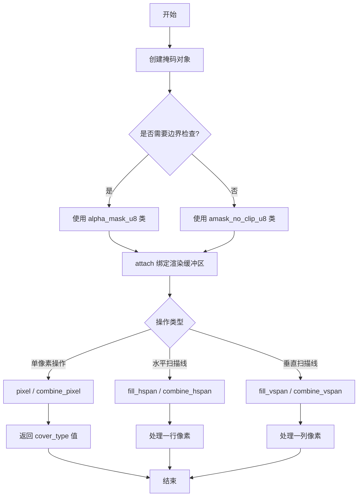

## 类结构

```
agg (命名空间)
├── one_component_mask_u8 (结构体)
├── rgb_to_gray_mask_u8<R,G,B> (模板结构体)
├── alpha_mask_u8<Step, Offset, MaskF> (模板类 - 带边界检查)
│   └── 派生类型: alpha_mask_gray8, alpha_mask_rgb24r, ...
└── amask_no_clip_u8<Step, Offset, MaskF> (模板类 - 无边界检查)
    └── 派生类型: amask_no_clip_gray8, amask_no_clip_rgb24r, ...
```

## 全局变量及字段


### `m_rbuf`
    
指向渲染缓冲区的指针，用于访问像素数据

类型：`rendering_buffer*`
    


### `m_mask_function`
    
掩码函数对象，用于计算像素的alpha覆盖值

类型：`MaskF`
    


### `m_rbuf`
    
指向渲染缓冲区的指针，用于访问像素数据

类型：`rendering_buffer*`
    


### `m_mask_function`
    
掩码函数对象，用于计算像素的alpha覆盖值

类型：`MaskF`
    


### `alpha_mask_u8<Step, Offset, MaskF>.m_rbuf`
    
指向渲染缓冲区的指针，用于访问像素数据

类型：`rendering_buffer*`
    


### `alpha_mask_u8<Step, Offset, MaskF>.m_mask_function`
    
掩码函数对象，用于计算像素的alpha覆盖值

类型：`MaskF`
    


### `amask_no_clip_u8<Step, Offset, MaskF>.m_rbuf`
    
指向渲染缓冲区的指针，用于访问像素数据

类型：`rendering_buffer*`
    


### `amask_no_clip_u8<Step, Offset, MaskF>.m_mask_function`
    
掩码函数对象，用于计算像素的alpha覆盖值

类型：`MaskF`
    
    

## 全局函数及方法


### `one_component_mask_u8.calculate`

该静态成员函数是单通道掩码计算的实现，用于从给定的像素数据指针中直接提取第一个字节作为遮罩值。这是 Anti-Grain Geometry 库中用于处理 8 位灰度或单通道图像掩码的简单实现。

参数：

- `p`：`const int8u*`，指向像素数据的指针，通常指向图像缓冲区中的某个像素位置

返回值：`unsigned`，返回解引用后的字节值（0-255），作为像素的遮罩值

#### 流程图

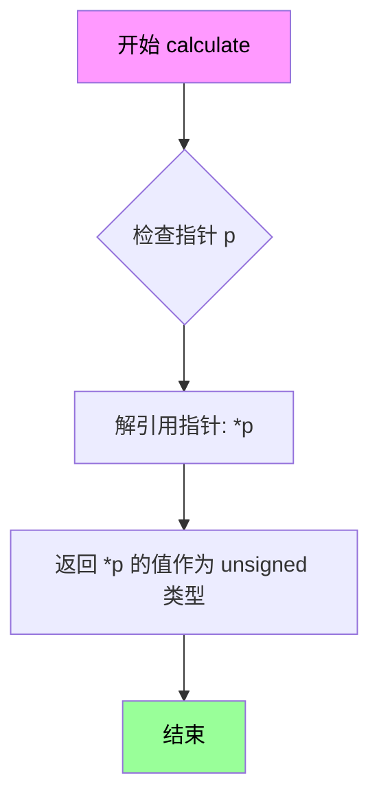

#### 带注释源码

```cpp
//----------------------------------------------------------------------------
// Anti-Grain Geometry - Version 2.4
// Copyright (C) 2002-2005 Maxim Shemanarev (http://www.antigrain.com)
//
// Permission to copy, use, modify, sell and distribute this software 
// is granted provided this copyright notice appears in all copies. 
// This software is provided "as is" without express or implied
// warranty, and with no claim as to its suitability for any purpose.
//----------------------------------------------------------------------------

//===================================================one_component_mask_u8
// 这是一个简单的掩码函数结构体，用于单通道（灰度）图像的掩码计算
struct one_component_mask_u8
{
    // calculate: 静态成员函数，直接返回指针指向的字节值
    // 参数 p: 指向像素数据的 const int8u 指针（8位无符号字节）
    // 返回值: unsigned 类型，直接返回 *p 的值（0-255）
    // 
    // 工作原理：
    //   - 该函数用于从图像缓冲区中提取单个字节作为遮罩值
    //   - 适用于灰度图像（8位）或 RGBA 图像中提取单个通道
    //   - 这是一个最简单的掩码函数，直接返回第一个字节的值
    //   - 在 alpha_mask_u8 或 amask_no_clip_u8 模板类中被使用
    //
    // 使用场景：
    //   - 当图像数据本身就是单通道灰度时使用
    //   - 作为 MaskF 模板参数的默认实现
    //   - 可被 rgb_to_gray_mask_u8 等更复杂的实现替换
    //
    static unsigned calculate(const int8u* p) 
    { 
        return *p;  // 直接解引用指针，返回第一个字节的值作为遮罩
    }
};
```


### `rgb_to_gray_mask_u8<R,G,B>.calculate`

该函数是一个模板结构体的静态方法，用于将RGB像素数据转换为灰度掩码值。它使用标准的亮度公式（77:150:29的加权系数）计算像素的灰度值，适用于8位掩码操作。

参数：

- `p`：`const int8u*`，指向像素数据的指针，包含了R、G、B通道的数组

返回值：`unsigned`，计算得到的灰度掩码值（0-255范围的Cover值）

#### 流程图

```mermaid
flowchart TD
    A[开始: 输入像素指针p] --> B{检查指针有效性}
    B -->|有效| C[提取红色分量: p[R] * 77]
    B -->|无效| D[返回0]
    C --> E[提取绿色分量: p[G] * 150]
    E --> F[提取蓝色分量: p[B] * 29]
    F --> G[求和: p[R]*77 + p[G]*150 + p[B]*29]
    G --> H[右移8位: >> 8]
    H --> I[返回灰度值]
```

#### 带注释源码

```cpp
//=====================================================rgb_to_gray_mask_u8
// 模板结构体: RGB转灰度掩码
// R, G, B: 模板参数，指定RGB通道在像素数组中的索引位置
template<unsigned R, unsigned G, unsigned B>
struct rgb_to_gray_mask_u8
{
    //========================================calculate
    // 静态方法: 计算RGB像素的灰度掩码值
    // 参数: p - 指向像素数据的指针，格式为[R, G, B]或[R, G, B, A]的数组
    // 返回: unsigned - 灰度值，范围0-255
    // 算法: 使用ITU-R BT.601标准的亮度公式 (0.299*R + 0.587*G + 0.114*B)
    //       系数近似为整数: 77, 150, 29
    //       除以256通过右移8位实现，比浮点除法更高效
    static unsigned calculate(const int8u* p) 
    { 
        // R通道加权 + G通道加权 + B通道加权，然后除以256
        return (p[R]*77 + p[G]*150 + p[B]*29) >> 8; 
    }
};
```


### `alpha_mask_u8<Step, Offset, MaskF>.alpha_mask_u8(rendering_buffer& rbuf)`

这是一个模板类的构造函数，用于初始化 `alpha_mask_u8` 类的实例。它接收一个渲染缓冲区引用，并将其地址存储在内部成员变量中，以便后续进行像素掩码操作。

参数：
- `rbuf`：`rendering_buffer&`，待绑定的渲染缓冲区引用，提供了像素数据的来源。

返回值：`void`，构造函数不返回值。

#### 流程图

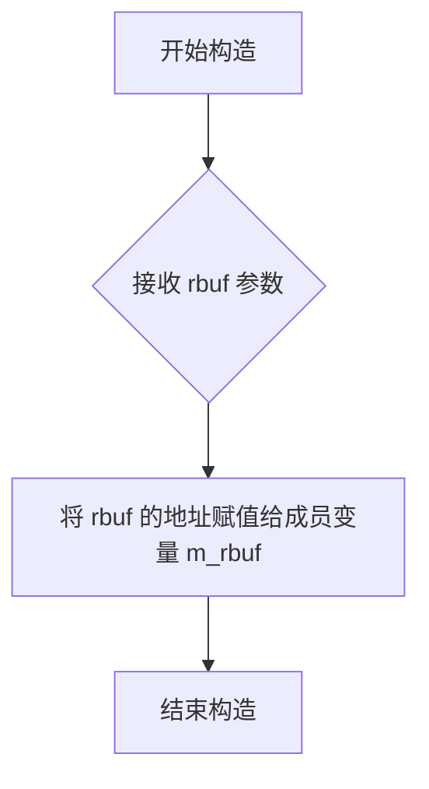

#### 带注释源码

```cpp
// 显式构造函数，接收一个渲染缓冲区引用
explicit alpha_mask_u8(rendering_buffer& rbuf) : m_rbuf(&rbuf) 
// 初始化列表：将传入的 rbuf 的地址赋值给指针成员 m_rbuf
{}
```


### `alpha_mask_u8<Step, Offset, MaskF>::alpha_mask_u8`

这是一个显式构造函数，接受一个渲染缓冲区引用作为参数，用于初始化 `alpha_mask_u8` 对象，将内部缓冲区指针指向传入的渲染缓冲区。

参数：

- `rbuf`：`rendering_buffer&`，渲染缓冲区引用，用于提供像素数据源

返回值：无返回值（构造函数）

#### 流程图

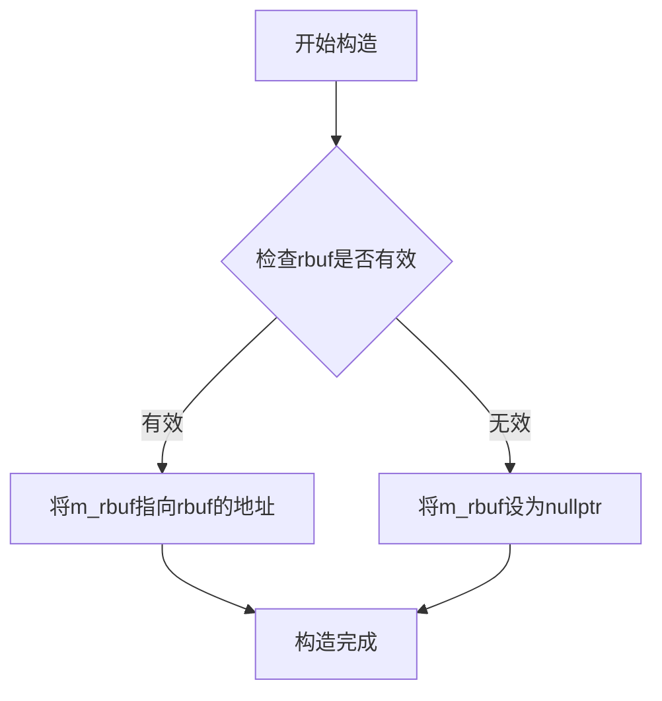

#### 带注释源码

```cpp
//----------------------------------------------------------------------------
// explicit 构造函数
// 参数: rbuf - rendering_buffer引用，作为掩码的像素数据源
// 功能: 初始化alpha_mask_u8对象，将内部缓冲区指针指向传入的渲染缓冲区
//----------------------------------------------------------------------------
explicit alpha_mask_u8(rendering_buffer& rbuf) : m_rbuf(&rbuf) 
// 初始化列表直接将m_rbuf指向传入的rbuf地址
// 使用explicit关键字防止隐式类型转换
// 注意: 此构造函数不验证rbuf的有效性，调用者需确保rbuf在对象生命周期内有效
{}
```

#### 相关成员变量

| 变量名 | 类型 | 描述 |
|--------|------|------|
| `m_rbuf` | `rendering_buffer*` | 指向渲染缓冲区的指针，存储像素掩码数据 |
| `m_mask_function` | `MaskF` | 掩码函数对象，用于从像素数据中计算掩码值 |

#### 设计说明

1. **显式构造函数**：使用 `explicit` 关键字防止编译器进行隐式类型转换，避免意外的对象创建
2. **直接初始化**：通过初始化列表直接设置 `m_rbuf` 指针，效率更高
3. **不拥有所有权**：`alpha_mask_u8` 不管理 `rbuf` 的生命周期，仅保存指针引用
4. **与默认构造函数配合**：存在无参构造函数 `alpha_mask_u8()` 将 `m_rbuf` 设为 `nullptr`，可通过 `attach()` 方法后续绑定


### alpha_mask_u8::attach

该方法用于将渲染缓冲区（rendering_buffer）附加到 alpha_mask_u8 对象，使对象能够通过内部指针访问缓冲区数据，以便执行后续的像素遮罩计算操作。

参数：

- `rbuf`：`rendering_buffer&`，要附加的渲染缓冲区引用

返回值：`void`，无返回值

#### 流程图

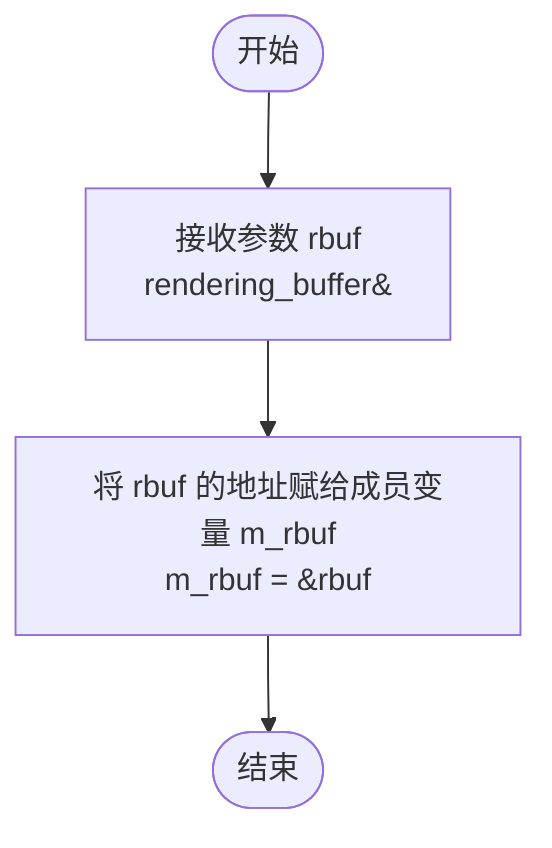

#### 带注释源码

```
//----------------------------------------------------------------------------
// 将渲染缓冲区附加到 alpha_mask_u8 对象
//----------------------------------------------------------------------------
// 参数：rbuf - rendering_buffer 类型的引用，要附加的渲染缓冲区
// 返回值：无
//----------------------------------------------------------------------------
void attach(rendering_buffer& rbuf) 
{ 
    m_rbuf = &rbuf;  // 将传入的渲染缓冲区引用转换为指针并存储到成员变量中
}
```


### `alpha_mask_u8<Step, Offset, MaskF>.mask_function`

该方法提供对内部掩码函数对象的访问，允许外部代码自定义或检查掩码计算策略。通过返回引用，调用者可以直接修改掩码函数的内部状态或行为。

参数：无（成员方法，隐式包含 `this` 指针）

返回值：`MaskF&`，返回对内部掩码函数对象的可变引用，允许调用者修改掩码计算逻辑

#### 流程图

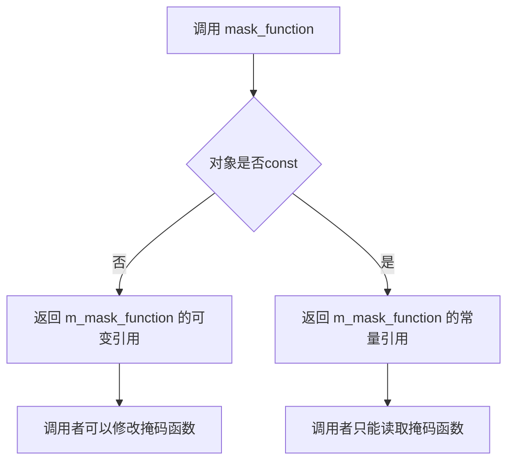

#### 带注释源码

```cpp
// 模板类 alpha_mask_u8 的成员方法
// 这是一个模板类，用于处理 8 位 Alpha 掩码，支持不同的像素格式和掩码函数

template<unsigned Step=1, unsigned Offset=0, class MaskF=one_component_mask_u8>
class alpha_mask_u8
{
public:
    // 省略其他成员...
    
    //--------------------------------------------------------------------
    // mask_function: 获取掩码函数对象的引用
    // 返回值：MaskF& - 对内部 m_mask_function 成员的可变引用
    // 用途：允许外部代码访问和修改掩码计算策略
    //--------------------------------------------------------------------
    MaskF& mask_function() 
    { 
        return m_mask_function;  // 返回对 m_mask_function 的可变引用
    }
    
    //--------------------------------------------------------------------
    // mask_function: 获取掩码函数对象的常量引用（const 版本）
    // 返回值：const MaskF& - 对内部 m_mask_function 成员的常量引用
    // 用途：允许外部代码读取掩码计算策略，但不能修改
    //--------------------------------------------------------------------
    const MaskF& mask_function() const 
    { 
        return m_mask_function;  // 返回对 m_mask_function 的常量引用
    }

private:
    //--------------------------------------------------------------------
    // 私有成员变量
    //--------------------------------------------------------------------
    rendering_buffer* m_rbuf;    // 渲染缓冲区指针，存储像素数据
    MaskF             m_mask_function;  // 掩码函数对象，用于计算像素的 alpha 值
};
```

**补充说明：**

- `MaskF` 是一个模板参数，默认值为 `one_component_mask_u8`，也可以使用 `rgb_to_gray_mask_u8` 等其他掩码函数
- 该方法通常用于在运行时动态修改掩码计算策略，或者检查当前使用的掩码函数类型
- 由于返回的是引用而非副本，修改返回的 `MaskF` 对象会直接影响 `alpha_mask_u8` 内部的掩码函数状态


### `alpha_mask_u8<Step, Offset, MaskF>.mask_function()`

该函数是 `alpha_mask_u8` 类模板的常量成员方法，用于获取当前掩码函数对象的只读引用，允许外部代码访问掩码计算策略而不修改内部状态。

参数：该函数无参数（隐式 `this` 指针除外）

返回值：`const MaskF&`，返回对模板参数 `MaskF` 类型掩码函数对象的常量引用，调用者可通过此引用调用掩码计算方法（如 `calculate()`）来获取像素的覆盖值。

#### 流程图

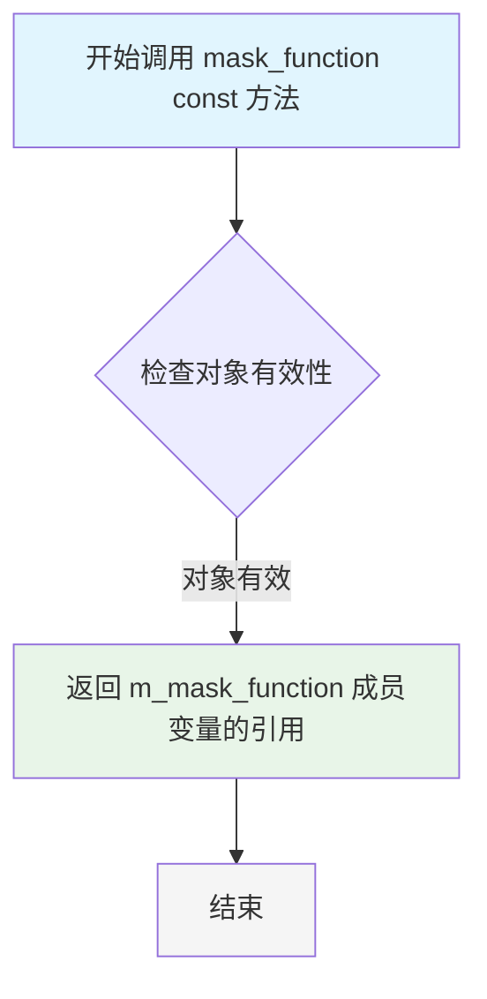

#### 带注释源码

```cpp
// 类模板 alpha_mask_u8 的成员函数定义
template<unsigned Step=1, unsigned Offset=0, class MaskF=one_component_mask_u8>
class alpha_mask_u8
{
public:
    // ... 其他成员 ...

    //--------------------------------------------------------------
    // 获取掩码函数对象的只读引用（常量成员函数）
    // 参数：无
    // 返回值：const MaskF& - 对掩码计算函数对象的常量引用
    // 用途：允许外部代码访问掩码策略（如 one_component_mask_u8 
    //       或 rgb_to_gray_mask_u8）以进行像素覆盖值计算
    //--------------------------------------------------------------
    const MaskF& mask_function() const 
    { 
        return m_mask_function;  // 直接返回成员变量 m_mask_function 的引用
    }

    // ... 其他成员 ...

private:
    // 禁止拷贝构造函数和赋值运算符（保持对象不可复制）
    alpha_mask_u8(const self_type&);
    const self_type& operator = (const self_type&);

    // 指向渲染缓冲区的指针，用于访问像素数据
    rendering_buffer* m_rbuf;
    
    // 掩码函数对象，用于计算像素的覆盖/透明度值
    // MaskF 可以是 one_component_mask_u8（单通道）或 
    // rgb_to_gray_mask_u8（RGB转灰度）
    MaskF             m_mask_function;
};
```

**设计说明**：

1. **双重接口设计**：该类同时提供了 `mask_function()` 的可变版本（返回 `MaskF&`）和常量版本（返回 `const MaskF&`），使得 const 对象只能获取只读引用，非 const 对象可以修改掩码函数。

2. **模板参数作用**：
   - `Step`：像素步长（1=灰度，3=RGB，4=RGBA）
   - `Offset`：颜色通道偏移量
   - `MaskF`：掩码计算策略（默认为单通道灰度）

3. **访问控制**：此方法暴露了内部掩码函数，使得调用者可以直接调用 `m_mask_function.calculate(p)` 来获取特定像素位置的覆盖值，这在 `pixel()`、`fill_hspan()` 等方法内部被使用。


### `alpha_mask_u8<Step, Offset, MaskF>.pixel`

该方法是 alpha 遮罩类的核心像素访问函数，用于获取指定坐标位置的遮罩（覆盖）值。函数首先检查坐标是否在渲染缓冲区有效范围内，若超出范围则返回 0，否则通过掩码函数计算并返回对应的覆盖值。

**参数：**

- `x`：`int`，待查询像素的 x 坐标
- `y`：`int`，待查询像素的 y 坐标

**返回值：** `cover_type`（即 `int8u` / `unsigned char`），返回指定坐标 `(x, y)` 处的遮罩值。如果坐标超出图像范围则返回 0。

#### 流程图

```mermaid
flowchart TD
    A[开始 pixel] --> B{检查坐标有效性: x >= 0 && y >= 0}
    B -->|是| C{x < width && y < height}
    B -->|否| D[返回 0]
    C -->|是| E[计算像素指针位置: row_ptr(y) + x * Step + Offset]
    C -->|否| D
    E --> F[调用 mask_function.calculate 计算遮罩值]
    F --> G[返回 cover_type 类型的遮罩值]
```

#### 带注释源码

```cpp
//--------------------------------------------------------------------
cover_type pixel(int x, int y) const
{
    // 首先检查坐标是否在有效范围内
    if(x >= 0 && y >= 0 && 
       x < (int)m_rbuf->width() && 
       y < (int)m_rbuf->height())
    {
        // 坐标有效，计算像素位置并通过掩码函数获取覆盖值
        // m_rbuf->row_ptr(y): 获取第 y 行的指针
        // x * Step + Offset: 根据模板参数计算目标像素的偏移量
        // Step: 像素组件步长（如 RGB 为 3，RGBA 为 4）
        // Offset: 颜色通道偏移量（如 R=0, G=1, B=2, A=3）
        return (cover_type)m_mask_function.calculate(
                                m_rbuf->row_ptr(y) + x * Step + Offset);
    }
    // 坐标超出范围，返回 0 表示完全透明/无覆盖
    return 0;
}
```


### `alpha_mask_u8<Step, Offset, MaskF>.combine_pixel`

该函数用于将给定的覆盖值（cover）与指定像素位置(x, y)处的遮罩值进行线性组合，返回组合后的覆盖值。如果坐标超出渲染缓冲区的边界，则返回0。

参数：

- `x`：`int`，要访问的像素的x坐标
- `y`：`int`，要访问的像素的y坐标  
- `val`：`cover_type`（即`int8u`），要结合的覆盖值

返回值：`cover_type`（即`int8u`），组合后的覆盖值，范围为0-255

#### 流程图

```mermaid
flowchart TD
    A[开始 combine_pixel] --> B{检查坐标有效性<br/>x >= 0 && y >= 0 &&<br/>x < width && y < height}
    B -- 否 --> C[返回 0]
    B -- 是 --> D[获取行指针<br/>m_rbuf->row_ptr(y)]
    D --> E[计算像素位置<br/>row_ptr + x * Step + Offset]
    E --> F[调用遮罩函数<br/>m_mask_function.calculate]
    F --> G[计算组合值<br/>(cover_full + val * mask) >> cover_shift]
    G --> H[类型转换并返回<br/>cover_type]
    C --> I[结束]
    H --> I
```

#### 带注释源码

```cpp
//--------------------------------------------------------------------
cover_type combine_pixel(int x, int y, cover_type val) const
{
    // 检查坐标(x, y)是否在渲染缓冲区范围内
    if(x >= 0 && y >= 0 && 
       x < (int)m_rbuf->width() && 
       y < (int)m_rbuf->height())
    {
        // 获取第y行的指针，并计算实际像素位置
        // x * Step + Offset 用于跳过字节和颜色通道偏移
        const int8u* pixel_ptr = m_rbuf->row_ptr(y) + x * Step + Offset;
        
        // 调用遮罩函数获取该位置的遮罩值
        unsigned mask_value = m_mask_function.calculate(pixel_ptr);
        
        // 线性组合：计算 (cover_full + val * mask_value) >> cover_shift
        // 即 (255 + val * mask) / 256，实现加权平均
        // cover_full(255) 用于避免除以0的情况
        return (cover_type)((cover_full + val * 
                             mask_value) >> 
                             cover_shift);
    }
    
    // 坐标超出边界，返回0（完全透明/无覆盖）
    return 0;
}
```


### `alpha_mask_u8<Step, Offset, MaskF>.fill_hspan`

该函数用于在水平方向上填充一段覆盖值（cover values），根据给定的起始坐标(x, y)、目标缓冲区和像素数量，从Alpha蒙版中读取相应的覆盖值并写入目标数组。函数包含完整的边界检查和裁剪逻辑，确保在渲染缓冲区边界之外时能够正确处理。

参数：

- `x`：`int`，水平起始坐标
- `y`：`int`，垂直坐标
- `dst`：`cover_type*`，目标覆盖值数组指针
- `num_pix`：`int`，要处理的像素数量

返回值：`void`，无返回值

#### 流程图

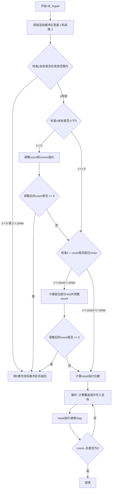

#### 带注释源码

```cpp
//--------------------------------------------------------------------
void fill_hspan(int x, int y, cover_type* dst, int num_pix) const
{
    // 获取渲染缓冲区的边界
    int xmax = m_rbuf->width() - 1;   // 最后一个有效像素的x坐标
    int ymax = m_rbuf->height() - 1;  // 最后一个有效像素的y坐标

    int count = num_pix;              // 需要处理的像素数量
    cover_type* covers = dst;         // 目标覆盖值数组指针

    // 检查y坐标是否在有效范围内
    if(y < 0 || y > ymax)
    {
        // y坐标越界，将目标缓冲区全部置为0
        memset(dst, 0, num_pix * sizeof(cover_type));
        return;
    }

    // 处理x坐标小于0的情况（左侧裁剪）
    if(x < 0)
    {
        count += x;                    // 减少需要处理的像素数
        if(count <= 0) 
        {
            // 没有有效像素需要处理
            memset(dst, 0, num_pix * sizeof(cover_type));
            return;
        }
        // 填充左侧被裁剪部分的0值
        memset(covers, 0, -x * sizeof(cover_type));
        covers -= x;                  // 调整目标指针
        x = 0;                        // 将x修正为0
    }

    // 处理右侧越界情况
    if(x + count > xmax)
    {
        int rest = x + count - xmax - 1;  // 计算超出边界的像素数
        count -= rest;                    // 减少需要处理的像素数
        if(count <= 0) 
        {
            // 没有有效像素需要处理
            memset(dst, 0, num_pix * sizeof(cover_type));
            return;
        }
        // 填充右侧被裁剪部分的0值
        memset(covers + count, 0, rest * sizeof(cover_type));
    }

    // 计算蒙版数据的起始位置
    const int8u* mask = m_rbuf->row_ptr(y) + x * Step + Offset;
    
    // 循环处理每个像素
    do
    {
        // 使用蒙版函数计算覆盖值并写入目标缓冲区
        *covers++ = (cover_type)m_mask_function.calculate(mask);
        mask += Step;                 // 移动到下一个蒙版像素
    }
    while(--count);                   // count递减直到0
}
```


### `alpha_mask_u8<Step, Offset, MaskF>.combine_hspan`

该方法用于合并水平跨距（horizontal span）的覆盖值，通过掩码函数计算每个像素的覆盖值，并与目标缓冲区中已有的覆盖值进行混合运算，支持边界剪裁处理。

参数：

- `x`：`int`，水平起始坐标
- `y`：`int`，垂直坐标
- `dst`：`cover_type*`，目标覆盖值数组指针，用于存储混合后的覆盖值
- `num_pix`：`int`，要处理的像素数量

返回值：`void`，无返回值

#### 流程图

```mermaid
flowchart TD
    A[开始 combine_hspan] --> B[获取渲染缓冲区宽度-1和高度-1]
    B --> C{检查y是否在有效范围内}
    C -->|y < 0 或 y > ymax| D[将dst清零并返回]
    C -->|y在有效范围内| E{检查x是否小于0}
    E -->|x < 0| F[调整count和covers指针,清零左侧边界]
    E -->|x >= 0| G{检查x+count是否超过xmax}
    G -->|x + count > xmax| H[调整count,清零右侧边界]
    G -->|x + count <= xmax| I[计算掩码起始位置]
    F --> I
    H --> I
    I --> J[循环: 对每个像素计算混合覆盖值]
    J --> K{count > 0?}
    K -->|是| L[计算: *covers = (cover_full + *covers * mask_value) >> cover_shift]
    L --> M[covers指针++, mask指针+=Step]
    M --> K
    K -->|否| N[结束]
    D --> N
```

#### 带注释源码

```cpp
//--------------------------------------------------------------------
void combine_hspan(int x, int y, cover_type* dst, int num_pix) const
{
    // 获取渲染缓冲区的边界值
    int xmax = m_rbuf->width() - 1;    // 最大有效x坐标
    int ymax = m_rbuf->height() - 1;   // 最大有效y坐标

    int count = num_pix;               // 待处理像素计数
    cover_type* covers = dst;         // 目标覆盖值数组指针

    // 边界检查：y坐标超出有效范围则直接置零返回
    if(y < 0 || y > ymax)
    {
        memset(dst, 0, num_pix * sizeof(cover_type));
        return;
    }

    // 处理x坐标在左侧边界外的情况
    if(x < 0)
    {
        count += x;                     // 调整有效像素计数
        if(count <= 0)                  // 如果没有有效像素
        {
            memset(dst, 0, num_pix * sizeof(cover_type));
            return;
        }
        // 将左侧超出部分的覆盖值置零
        memset(covers, 0, -x * sizeof(cover_type));
        covers -= x;                    // 调整指针位置
        x = 0;                          // 将x修正为0
    }

    // 处理x坐标在右侧边界外的情况
    if(x + count > xmax)
    {
        int rest = x + count - xmax - 1; // 右侧超出像素数
        count -= rest;                   // 调整有效像素计数
        if(count <= 0)                  // 如果没有有效像素
        {
            memset(dst, 0, num_pix * sizeof(cover_type));
            return;
        }
        // 将右侧超出部分的覆盖值置零
        memset(covers + count, 0, rest * sizeof(cover_type));
    }

    // 计算掩码数据的起始位置
    // m_rbuf->row_ptr(y)获取第y行的起始指针
    // x * Step + Offset计算像素在行中的偏移
    const int8u* mask = m_rbuf->row_ptr(y) + x * Step + Offset;
    
    // 循环处理每个像素，混合已有覆盖值与掩码值
    do
    {
        // 覆盖值混合公式：(cover_full + existing_cover * mask_value) >> cover_shift
        // 相当于：new_cover = (255 + old_cover * mask) / 256
        // 这是一种基于加权的混合算法，确保平滑过渡
        *covers = (cover_type)((cover_full + (*covers) * 
                               m_mask_function.calculate(mask)) >> 
                               cover_shift);
        ++covers;                        // 移动到下一个覆盖值位置
        mask += Step;                   // 移动到下一个掩码像素位置
    }
    while(--count);                     // 处理完所有像素后结束
}
```


### `alpha_mask_u8<Step, Offset, MaskF>.fill_vspan`

该函数用于在垂直扫描线上填充覆盖值（coverage），根据传入的起始坐标和像素数量，从Alpha掩码缓冲区中读取相应的掩码值并写入目标数组，同时处理边界情况的裁剪。

参数：

- `x`：`int`，垂直扫描线的起始X坐标
- `y`：`int`，垂直扫描线的起始Y坐标
- `dst`：`cover_type*`，指向目标覆盖值数组的指针，用于存储计算得到的覆盖值
- `num_pix`：`int`，需要处理的像素数量

返回值：`void`，无返回值，结果直接写入到 `dst` 指针指向的数组中

#### 流程图

```mermaid
flowchart TD
    A[开始 fill_vspan] --> B[获取渲染缓冲区的宽度-1和高度-1]
    B --> C{检查x坐标是否超出范围<br/>x < 0 或 x > xmax?}
    C -->|是| D[使用memset将目标数组清零<br/>并返回]
    C -->|否| E{检查y坐标是否小于0}
    E -->|是| F[调整count和covers指针<br/>处理y < 0的情况]
    E -->|否| G{检查y + count是否超过ymax}
    F --> G
    G -->|是| H[调整count<br/>处理超出底部边界的情况]
    G -->|否| I[计算mask指针位置<br/>m_rbuf->row_ptr(y) + x * Step + Offset]
    H --> I
    D --> Z[结束]
    I --> J{循环: count > 0?}
    J -->|是| K[调用m_mask_function.calculate计算覆盖值<br/>写入*covers++]
    K --> L[mask指针增加stride<br/>移动到下一行]
    L --> J
    J -->|否| Z
```

#### 带注释源码

```cpp
//--------------------------------------------------------------------
void fill_vspan(int x, int y, cover_type* dst, int num_pix) const
{
    // 获取渲染缓冲区的边界值
    int xmax = m_rbuf->width() - 1;    // 缓冲区最大X坐标
    int ymax = m_rbuf->height() - 1;   // 缓冲区最大Y坐标

    int count = num_pix;               // 需要处理的像素计数
    cover_type* covers = dst;          // 目标覆盖值数组指针

    // 步骤1: 检查X坐标是否在有效范围内
    if(x < 0 || x > xmax)
    {
        // X坐标超出边界，将整个目标数组清零并返回
        memset(dst, 0, num_pix * sizeof(cover_type));
        return;
    }

    // 步骤2: 检查Y坐标是否小于0（顶部裁剪）
    if(y < 0)
    {
        // 计算实际需要处理的像素数
        count += y;    // y为负数，count减少
        if(count <= 0) 
        {
            // 如果没有有效像素，全部清零并返回
            memset(dst, 0, num_pix * sizeof(cover_type));
            return;
        }
        // 将目标数组的前(-y)个元素清零
        memset(covers, 0, -y * sizeof(cover_type));
        // 调整指针，跳过已清零的部分
        covers -= y;
        // 将y修正为0
        y = 0;
    }

    // 步骤3: 检查是否超出底部边界（底部裁剪）
    if(y + count > ymax)
    {
        // 计算超出底部的像素数
        int rest = y + count - ymax - 1;
        // 调整有效像素计数
        count -= rest;
        if(count <= 0) 
        {
            // 如果没有有效像素，全部清零并返回
            memset(dst, 0, num_pix * sizeof(cover_type));
            return;
        }
        // 将超出部分的数组元素清零
        memset(covers + count, 0, rest * sizeof(cover_type));
    }

    // 步骤4: 计算掩码数据指针位置
    // row_ptr(y)获取Y行起始位置，x * Step + Offset计算像素偏移
    const int8u* mask = m_rbuf->row_ptr(y) + x * Step + Offset;
    
    // 步骤5: 循环填充覆盖值
    do
    {
        // 使用掩码函数计算当前像素的覆盖值
        // 并写入目标数组
        *covers++ = (cover_type)m_mask_function.calculate(mask);
        
        // 移动掩码指针到下一行
        // 垂直扫描线沿Y方向延伸，所以增加stride（行跨度）
        mask += m_rbuf->stride();
    }
    while(--count);
}
```


### `alpha_mask_u8<Step, Offset, MaskF>.combine_vspan`

该方法用于垂直扫描线的组合掩码操作，将掩膜值与目标覆盖值进行组合处理，处理过程中会进行边界检查和裁剪，适用于带有Alpha通道的图像掩码处理场景。

参数：

- `x`：`int`，垂直扫描线的起始X坐标
- `y`：`int`，垂直扫描线的起始Y坐标
- `dst`：`cover_type*`，目标覆盖值数组指针（输入/输出），用于存储组合后的覆盖值
- `num_pix`：`int`，要处理的像素数量

返回值：`void`，无返回值

#### 流程图

```mermaid
flowchart TD
    A[开始 combine_vspan] --> B[获取渲染缓冲区宽度xmax和高度ymax]
    B --> C[初始化count = num_pix, covers = dst]
    D{检查y坐标是否在有效范围内<br/>y < 0 || y > ymax} -->|是| E[使用memset将dst设置为0,直接返回]
    E --> Z[结束]
    D -->|否| F{检查x坐标是否在有效范围内<br/>x < 0 || x > xmax}
    F -->|是| E
    F -->|否| G{处理左侧裁剪<br/>x < 0}
    G -->|是| H[count += x, memset(covers, 0, -x), covers -= x, x = 0]
    G -->|否| I{处理右侧裁剪<br/>x + count > xmax}
    H --> I
    I -->|是| J[计算rest = x + count - xmax - 1, count -= rest, memset添加尾部0]
    I -->|否| K[计算mask指针位置: m_rbuf->row_ptr(y) + x * Step + Offset]
    J --> K
    K --> L{循环条件<br/>count > 0}
    L -->|是| M[计算组合覆盖值: (cover_full + (*covers) * mask_function.calculate(mask)) >> cover_shift]
    M --> N[更新目标覆盖值: *covers = 组合结果]
    N --> O[covers指针递增, mask指针按stride递增]
    O --> P[count递减]
    P --> L
    L -->|否| Z
```

#### 带注释源码

```cpp
//--------------------------------------------------------------------
void combine_vspan(int x, int y, cover_type* dst, int num_pix) const
{
    // 获取渲染缓冲区的宽度和高度边界
    int xmax = m_rbuf->width() - 1;
    int ymax = m_rbuf->height() - 1;

    // 初始化计数器和目标指针
    int count = num_pix;
    cover_type* covers = dst;

    // 检查y坐标是否在有效范围内（垂直方向裁剪）
    if(x < 0 || x > xmax)
    {
        // x坐标超出边界，将整个目标数组置零并返回
        memset(dst, 0, num_pix * sizeof(cover_type));
        return;
    }

    // 处理y坐标小于0的情况（顶部裁剪）
    if(y < 0)
    {
        // 调整有效像素计数
        count += y;
        if(count <= 0) 
        {
            // 没有有效像素，全部置零返回
            memset(dst, 0, num_pix * sizeof(cover_type));
            return;
        }
        // 将顶部超出部分置零
        memset(covers, 0, -y * sizeof(cover_type));
        covers -= y;  // 调整目标指针
        y = 0;        // 修正y坐标为0
    }

    // 处理y + count超出下边界的情况（底部裁剪）
    if(y + count > ymax)
    {
        // 计算底部超出部分
        int rest = y + count - ymax - 1;
        count -= rest;
        if(count <= 0) 
        {
            // 没有有效像素，全部置零返回
            memset(dst, 0, num_pix * sizeof(cover_type));
            return;
        }
        // 将底部超出部分置零（注意：这里是从count位置开始置零）
        memset(covers + count, 0, rest * sizeof(cover_type));
    }

    // 计算掩码数据的起始位置：获取指定行的指针并加上偏移量
    const int8u* mask = m_rbuf->row_ptr(y) + x * Step + Offset;
    
    // 遍历每个像素进行掩码组合
    do
    {
        // 组合公式：(cover_full + (*covers) * mask_value) >> cover_shift
        // 这是一个加权的混合算法，将原始覆盖值与掩码值进行混合
        *covers = (cover_type)((cover_full + (*covers) * 
                               m_mask_function.calculate(mask)) >> 
                               cover_shift);
        ++covers;                    // 移动到下一个目标位置
        mask += m_rbuf->stride();    // 移动到下一行（垂直方向）
    }
    while(--count);
}
```


### `amask_no_clip_u8<Step, Offset, MaskF>::amask_no_clip_u8()`

这是 `amask_no_clip_u8` 模板类的构造函数，用于初始化一个不带裁剪功能的 8 位 Alpha 掩码对象。该构造函数可以接受一个渲染缓冲区引用作为参数，将内部的 `m_rbuf` 指针指向该缓冲区，从而使得该掩码对象能够访问像素数据。

参数：

- `rbuf`：`rendering_buffer&`，渲染缓冲区引用，用于提供像素数据源

返回值：无（构造函数，不返回任何值）

#### 流程图

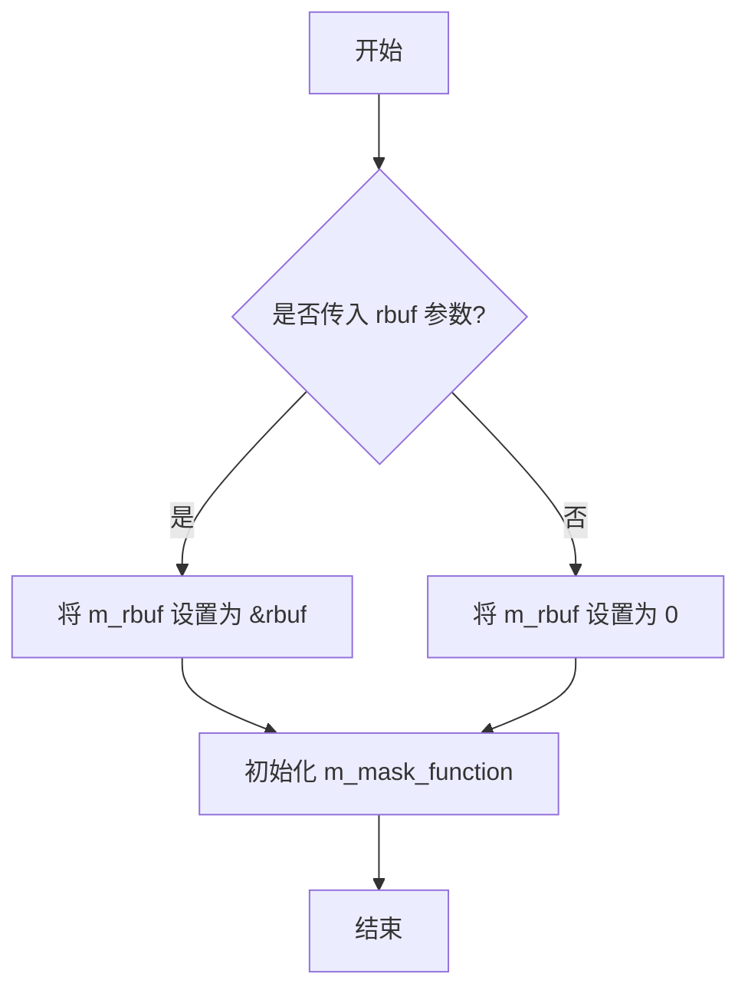

#### 带注释源码

```cpp
// 默认构造函数，初始化 m_rbuf 为空指针
amask_no_clip_u8() : m_rbuf(0) {}

// 带参数的构造函数，接受渲染缓冲区引用
// 参数：rbuf - 渲染缓冲区引用，用于提供像素数据
explicit amask_no_clip_u8(rendering_buffer& rbuf) : m_rbuf(&rbuf) {}
```


### `amask_no_clip_u8<Step, Offset, MaskF>.explicit amask_no_clip_u8`

该函数是 `amask_no_clip_u8` 类的显式构造函数，接受一个渲染缓冲区引用作为参数，并将其地址存储到成员变量 `m_rbuf` 中，用于后续的掩码计算操作。

参数：

- `rbuf`：`rendering_buffer&`，关联的渲染缓冲区引用，用于提供像素数据访问

返回值：无返回值（构造函数）

#### 流程图

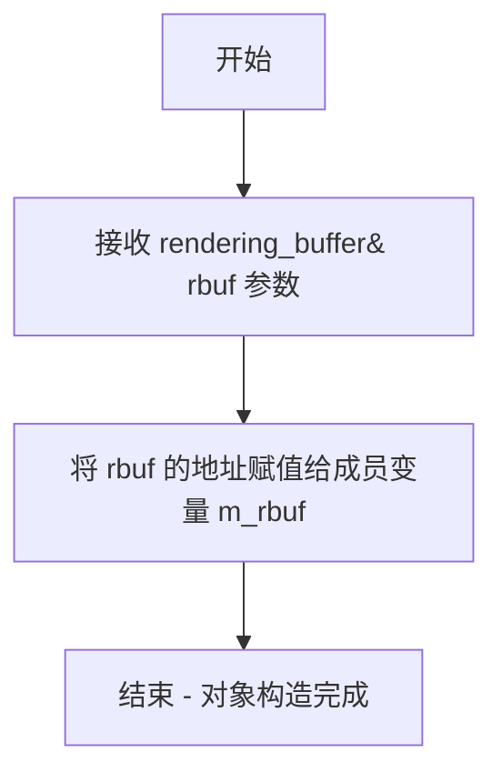

#### 带注释源码

```cpp
//----------------------------------------------------------------------------
// 模板类 amask_no_clip_u8 的显式构造函数
// 参数：
//   rbuf - rendering_buffer&，关联的渲染缓冲区引用
//----------------------------------------------------------------------------
explicit amask_no_clip_u8(rendering_buffer& rbuf) : m_rbuf(&rbuf) {}
/*
 * 详细说明：
 * 1. 使用初始化列表直接初始化 m_rbuf 成员变量
 * 2. 将传入的渲染缓冲区引用转换为指针并存储
 * 3. m_rbuf 将在后续的 pixel()、fill_hspan() 等方法中使用
 *    来访问底层像素数据
 */
```


### `amask_no_clip_u8<Step, Offset, MaskF>.attach`

该方法用于将传入的渲染缓冲区（rendering_buffer）关联到当前掩码对象，通过将 rbuf 的地址赋值给成员变量 m_rbuf 实现，使得掩码对象可以访问底层图像数据进行遮罩计算。

参数：

-  `rbuf`：`rendering_buffer&`，要关联的渲染缓冲区引用

返回值：`void`，无返回值

#### 流程图

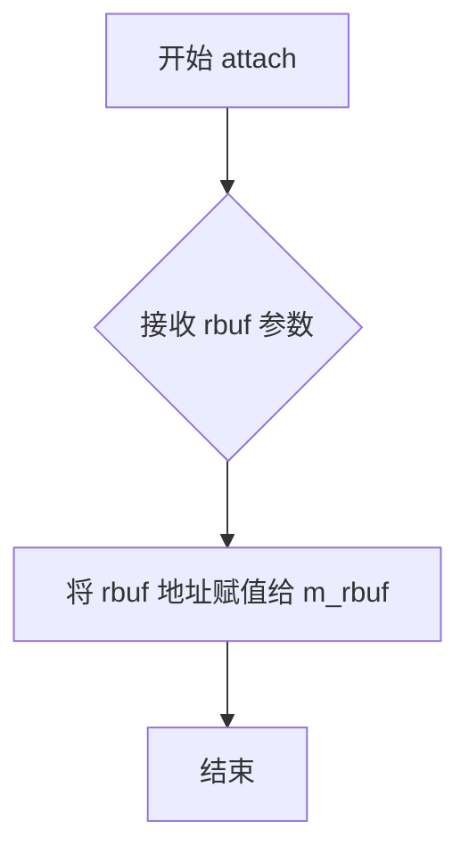

#### 带注释源码

```cpp
//----------------------------------------------------------------------------
// amask_no_clip_u8 类的 attach 方法
// 用于将渲染缓冲区绑定到当前掩码对象
//----------------------------------------------------------------------------

// 参数: rbuf - rendering_buffer 引用，要关联的渲染缓冲区
// 返回值: void
void attach(rendering_buffer& rbuf) 
{ 
    // 将传入的渲染缓冲区指针赋值给成员变量 m_rbuf
    // 使得当前掩码对象可以访问底层图像数据进行遮罩计算
    m_rbuf = &rbuf; 
}
```


### `amask_no_clip_u8<Step, Offset, MaskF>.mask_function`

该方法是 `amask_no_clip_u8` 类的成员函数，用于获取内部掩码函数对象的引用。通过返回对 `MaskF` 类型对象的引用，调用者可以访问或修改底层掩码计算逻辑（如 `one_component_mask_u8` 或 `rgb_to_gray_mask_u8`），从而灵活地处理不同像素格式的 alpha 通道提取。

参数： （无参数）

返回值：`MaskF&`，返回对掩码函数对象的可变引用，允许调用者自定义掩码计算逻辑。

#### 流程图

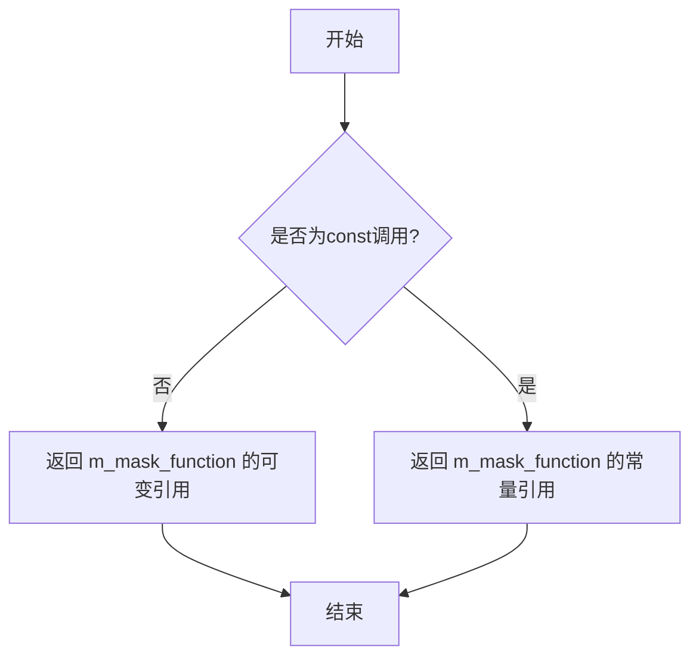

#### 带注释源码

```cpp
// 非const版本：返回掩码函数的可变引用
MaskF& mask_function() 
{ 
    return m_mask_function; 
}

// const版本：返回掩码函数的常量引用
const MaskF& mask_function() const 
{ 
    return m_mask_function; 
}
```

**说明：**
- `m_mask_function` 是类 `amask_no_clip_u8` 的成员变量，类型为 `MaskF`（模板参数，默认值为 `one_component_mask_u8`）。
- 该方法提供了对内部掩码计算函数的双重访问方式：
  - 非 const 版本：允许外部代码修改掩码函数的行为。
  - const 版本：提供只读访问，适用于常量对象。
- 掩码函数（`MaskF`）通常实现 `calculate(const int8u* p)` 静态方法，用于从像素数据中提取 alpha 值。


### `amask_no_clip_u8<Step, Offset, MaskF>.mask_function() const`

该函数是 `amask_no_clip_u8` 类的常量成员方法，用于获取掩码函数对象的常量引用，允许外部代码访问内部掩码计算逻辑而不修改它。

参数：（无参数）

返回值：`const MaskF&`，返回模板参数 `MaskF` 类型的常量引用，该引用指向存储在类内部的掩码函数对象，用于执行实际的像素值计算。

#### 流程图

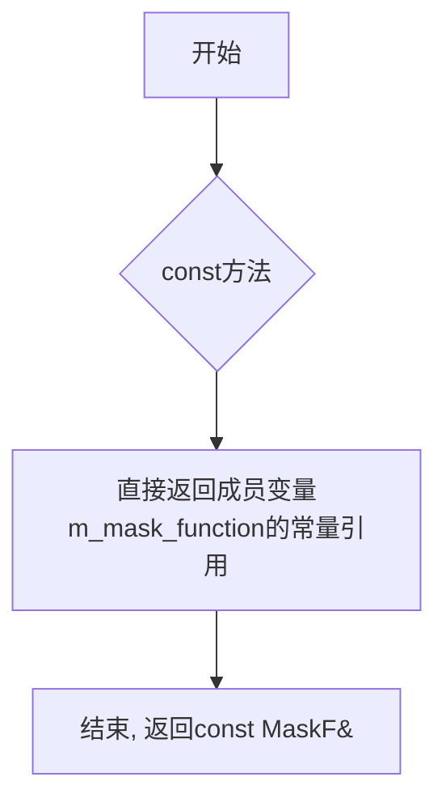

#### 带注释源码

```cpp
// 类模板定义
template<unsigned Step=1, unsigned Offset=0, class MaskF=one_component_mask_u8>
class amask_no_clip_u8
{
public:
    // ... 其他成员 ...

    //--------------------------------------------------------------------
    // 非const版本的mask_function，返回可修改的引用
    //--------------------------------------------------------------------
    MaskF& mask_function() 
    { 
        return m_mask_function; 
    }

    //--------------------------------------------------------------------
    // const版本的mask_function，返回常量引用
    // 此函数为用户要求提取的函数
    //--------------------------------------------------------------------
    const MaskF& mask_function() const 
    { 
        // 直接返回成员变量m_mask_function的常量引用
        // 不进行任何边界检查或复制操作
        // 调用者只能读取掩码函数，不能修改它
        return m_mask_function; 
    }

    // ... 其他成员 ...

private:
    // 禁止拷贝构造和赋值
    amask_no_clip_u8(const self_type&);
    const self_type& operator = (const self_type&);

    //--------------------------------------------------------------------
    // 私有成员变量
    //--------------------------------------------------------------------
    rendering_buffer* m_rbuf;    // 指向渲染缓冲区的指针，用于访问像素数据
    MaskF             m_mask_function;  // 掩码函数对象，执行实际的像素值计算
};
```


### `amask_no_clip_u8<Step, Offset, MaskF>.pixel`

该函数是 `amask_no_clip_u8` 类的成员方法，用于获取指定坐标 (x, y) 处的像素掩码值（coverage/alpha值）。它通过 `rendering_buffer` 获取行指针，结合模板参数 `Step` 和 `Offset` 计算像素位置，然后调用掩码函数 `m_mask_function.calculate()` 计算并返回掩码值。此版本不进行边界检查，适用于已知坐标在有效范围内的场景。

参数：

-  `x`：`int`，像素的X坐标（相对于图像左侧）
-  `y`：`int`，像素的Y坐标（相对于图像顶部）

返回值：`cover_type`（即 `int8u`，无符号8位整型），返回指定坐标位置的掩码值，范围通常为 0-255，其中 0 表示完全透明，255 表示完全不透明

#### 流程图

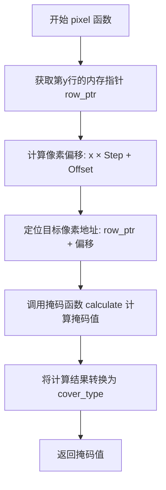

#### 带注释源码

```cpp
//--------------------------------------------------------------------
/// @brief 获取指定坐标位置的像素掩码值（无边界检查版本）
/// @param x 像素的X坐标
/// @param y 像素的Y坐标
/// @return cover_type 掩码值（0-255）
/// @note 调用此函数前必须确保坐标在有效范围内，否则行为未定义
//--------------------------------------------------------------------
cover_type pixel(int x, int y) const
{
    // 步骤1: 获取渲染缓冲区中第y行的起始指针
    // 步骤2: 计算目标像素的内存偏移量 = x * Step + Offset
    //        - Step: 像素分量之间的步长（如RGB为3，RGBA为4）
    //        - Offset: 起始偏移量（选择R/G/B/A分量）
    // 步骤3: 调用模板化的掩码计算函数（可能是单通道、灰度转换等）
    // 步骤4: 将计算结果强制转换为 cover_type 并返回
    return (cover_type)m_mask_function.calculate(
                           m_rbuf->row_ptr(y) + x * Step + Offset);
}
```


### `amask_no_clip_u8<Step, Offset, MaskF>.combine_pixel`

该函数用于将给定的覆盖值与指定像素位置的掩码值进行组合，通过加权平均的方式计算新的覆盖值。它不进行边界检查（no clip），因此调用者需要确保坐标在有效范围内。

参数：

- `x`：`int`，像素的x坐标
- `y`：`int`，像素的y坐标
- `val`：`cover_type`（即`int8u`，无符号8位整数），要组合的覆盖值

返回值：`cover_type`（即`int8u`），组合后的覆盖值，范围为0-255

#### 流程图

```mermaid
flowchart TD
    A[开始 combine_pixel] --> B[获取像素行指针]
    B --> C[计算像素偏移: x * Step + Offset]
    C --> D[调用掩码函数计算像素掩码值]
    D --> E[计算组合值: cover_full + val * mask_value]
    E --> F[右移8位进行归一化]
    F --> G[转换为cover_type并返回]
```

#### 带注释源码

```
//--------------------------------------------------------------------
cover_type combine_pixel(int x, int y, cover_type val) const
{
    // 计算组合覆盖值：
    // 1. 获取渲染缓冲区的行指针 m_rbuf->row_ptr(y)
    // 2. 计算像素偏移量：x * Step + Offset（Step是颜色通道步长，Offset是通道偏移）
    // 3. 使用掩码函数计算该像素位置的掩码值
    // 4. 将输入覆盖值val与掩码值进行加权组合：(cover_full + val * mask) >> cover_shift
    //    其中 cover_full = 255, cover_shift = 8，这实际上是一个加权平均计算
    // 5. 将结果强制转换为cover_type并返回
    
    return (cover_type)((cover_full + val * 
                         m_mask_function.calculate(
                            m_rbuf->row_ptr(y) + x * Step + Offset)) >> 
                         cover_shift);
}
```


### `amask_no_clip_u8<Step, Offset, MaskF>::fill_hspan`

该函数用于在不使用裁剪的情况下，填充指定水平跨度的覆盖值（coverage）。它根据掩码函数计算每个像素的覆盖值，并将其写入目标缓冲区。

参数：

- `x`：`int`，水平起始坐标
- `y`：`int`，垂直坐标
- `dst`：`cover_type*`，目标覆盖值数组指针，用于存储计算得到的覆盖值
- `num_pix`：`int`，要处理的像素数量

返回值：`void`，无返回值

#### 流程图

```mermaid
flowchart TD
    A[开始 fill_hspan] --> B[计算掩码指针起始位置: mask = m_rbuf->row_ptr(y) + x * Step + Offset]
    B --> C{num_pix > 0?}
    C -->|是| D[使用mask_function计算当前像素覆盖值]
    D --> E[*dst++ = cover_type calculated value]
    E --> F[mask += Step]
    F --> G[num_pix--]
    G --> C
    C -->|否| H[结束]
```

#### 带注释源码

```cpp
//--------------------------------------------------------------------
void fill_hspan(int x, int y, cover_type* dst, int num_pix) const
{
    // 计算掩码数据的起始指针：
    // m_rbuf->row_ptr(y) 获取第y行的起始位置
    // x * Step 根据水平坐标和步长计算偏移
    // Offset 添加额外的偏移量
    const int8u* mask = m_rbuf->row_ptr(y) + x * Step + Offset;
    
    // 循环遍历每个像素，使用do-while确保至少执行一次
    do
    {
        // 调用掩码函数计算当前像素位置的覆盖值
        // m_mask_function.calculate(mask) 根据掩码函数类型计算
        // 将结果转换为cover_type并写入目标缓冲区
        *dst++ = (cover_type)m_mask_function.calculate(mask);
        
        // 移动掩码指针到下一个像素位置
        // Step控制像素之间的间距（如RGB 3字节或RGBA 4字节）
        mask += Step;
    }
    // 递减像素计数，当计数为0时退出循环
    while(--num_pix);
}
```


### `amask_no_clip_u8<Step, Offset, MaskF>.combine_hspan`

该方法用于在给定的水平跨度上合并像素的遮罩值。它遍历从(x, y)开始的num_pix个像素，通过mask_function计算每个像素的遮罩值，然后与目标缓冲区中已有的覆盖值进行线性插值合并，生成新的覆盖值。

参数：

- `x`：`int`，水平起始坐标
- `y`：`int`，垂直坐标
- `dst`：`cover_type*`，目标覆盖值数组，存储合并后的覆盖值
- `num_pix`：`int`，要处理的像素数量

返回值：`void`，无返回值

#### 流程图

```mermaid
flowchart TD
    A[开始 combine_hspan] --> B[计算mask指针: m_rbuf->row_ptr(y) + x * Step + Offset]
    B --> C{num_pix > 0?}
    C -->|Yes| D[计算当前像素遮罩: m_mask_function.calculate(mask)]
    D --> E[合并覆盖值: cover_full + (*dst) * mask >> cover_shift]
    E --> F[更新目标: *dst = 合并值]
    F --> G[dst指针前移]
    G --> H[mask指针前移: mask += Step]
    H --> I[num_pix--]
    I --> C
    C -->|No| J[结束]
```

#### 带注释源码

```cpp
//--------------------------------------------------------------------
void combine_hspan(int x, int y, cover_type* dst, int num_pix) const
{
    // 计算掩码数据的起始位置：
    // m_rbuf->row_ptr(y) 获取第y行的起始指针
    // x * Step 计算x位置偏移（Step是每个像素占用的字节数）
    // Offset 是额外的字节偏移
    const int8u* mask = m_rbuf->row_ptr(y) + x * Step + Offset;
    
    // 遍历每个像素
    do
    {
        // 计算合并后的覆盖值：
        // (*dst) 是目标缓冲区中已有的覆盖值
        // m_mask_function.calculate(mask) 计算当前像素位置的遮罩值
        // 使用线性插值公式: (cover_full + val * mask) >> cover_shift
        // 其中 cover_full=255, cover_shift=8，等价于 (255 + val * mask) / 256
        *dst = (cover_type)((cover_full + (*dst) * 
                            m_mask_function.calculate(mask)) >> 
                            cover_shift);
        
        // 移动目标指针到下一个位置
        ++dst;
        
        // 移动掩码指针到下一个像素位置（按Step偏移）
        mask += Step;
    }
    // 处理完所有像素后退出循环
    while(--num_pix);
}
```


### `amask_no_clip_u8<Step, Offset, MaskF>.fill_vspan`

该函数用于在垂直扫描线上填充覆盖值（cover values），通过掩码函数计算每个像素位置的覆盖值，并将其写入目标数组。与 `fill_hspan`（水平扫描线）不同，该函数沿着Y轴方向（垂直方向）迭代，每次增加行指针的步长（stride）来获取下一行的像素数据。

参数：

-  `x`：`int`，垂直扫描线的起始X坐标
-  `y`：`int`，垂直扫描线的起始Y坐标
-  `dst`：`cover_type*`，目标覆盖值数组，用于存储计算得到的覆盖值
-  `num_pix`：`int`，要处理的像素数量（即垂直方向上的像素数）

返回值：`void`，无返回值

#### 流程图

```mermaid
flowchart TD
    A[开始 fill_vspan] --> B[计算掩码指针起始位置<br/>mask = m_rbuf->row_ptry + x * Step + Offset]
    B --> C{num_pix > 0?}
    C -->|是| D[计算当前像素覆盖值<br/>value = mask_function.calculatemask]
    D --> E[将覆盖值写入目标数组<br/>*dst++ = value]
    E --> F[移动掩码指针到下一行<br/>mask += m_rbuf->stride]
    F --> G[num_pix--]
    G --> C
    C -->|否| H[结束]
```

#### 带注释源码

```cpp
//--------------------------------------------------------------------
void fill_vspan(int x, int y, cover_type* dst, int num_pix) const
{
    // 计算掩码指针的起始位置：
    // 1. m_rbuf->row_ptr(y) 获取第y行的起始指针
    // 2. x * Step 计算x坐标在行内的字节偏移（Step为每个像素的字节数，如RGB为3，RGBA为4）
    // 3. Offset 为额外的字节偏移，用于选择颜色通道（如R、G或B）
    const int8u* mask = m_rbuf->row_ptr(y) + x * Step + Offset;
    
    // 循环遍历每个像素，沿着垂直方向（Y轴）处理
    do
    {
        // 使用掩码函数计算当前像素位置的覆盖值
        // MaskF::calculate 可能是：
        //   - one_component_mask_u8::calculate：直接返回单字节值
        //   - rgb_to_gray_mask_u8::calculate：将RGB转换为灰度值
        *dst++ = (cover_type)m_mask_function.calculate(mask);
        
        // 移动掩码指针到下一行
        // 使用 stride（行间距）而非 Step，因为是垂直移动
        mask += m_rbuf->stride();
    }
    while(--num_pix);
}
```


### `amask_no_clip_u8<Step, Offset, MaskF>.combine_vspan`

该方法用于在垂直扫描线上组合覆盖值，通过模板化的掩码函数计算每个像素的覆盖度，并将结果存储到目标数组中，适用于无裁剪需求的alpha掩码处理场景。

参数：
- `x`：`int`，水平起始坐标，指定垂直扫描线在图像中的x位置。
- `y`：`int`，垂直起始坐标，指定垂直扫描线在图像中的y起始位置。
- `dst`：`cover_type*`，目标覆盖值数组的指针，用于存储计算后的覆盖值（覆盖类型为无符号8位整数）。
- `num_pix`：`int`，要处理的像素数量，指定垂直扫描线上包含的像素总数。

返回值：`void`，无返回值。该方法直接修改`dst`指针指向的数组内容，不返回任何值。

#### 流程图

```mermaid
graph TD
    A([开始]) --> B[计算mask指针位置: m_rbuf->row_ptr(y) + x * Step + Offset]
    B --> C{num_pix > 0?}
    C -->|是| D[调用mask_function.calculate计算当前mask值]
    D --> E[组合覆盖值: (cover_full + (*dst) * mask值) >> cover_shift]
    E --> F[将计算结果写入*dst]
    F --> G[dst指针递增]
    G --> H[mask指针递增: mask += m_rbuf->stride()]
    H --> I[num_pix递减]
    I --> C
    C -->|否| J([结束])
```

#### 带注释源码

```cpp
//--------------------------------------------------------------------
void combine_vspan(int x, int y, cover_type* dst, int num_pix) const
{
    // 计算垂直扫描线起始位置的mask指针：
    // m_rbuf->row_ptr(y)获取y行的起始位置，x * Step + Offset计算水平偏移
    const int8u* mask = m_rbuf->row_ptr(y) + x * Step + Offset;
    
    // 遍历垂直扫描线上的每个像素
    do
    {
        // 使用mask_function计算当前mask值，并与目标数组中已有的覆盖值进行组合：
        // 公式: (cover_full + 当前覆盖值 * mask计算值) >> cover_shift
        // cover_full为255，cover_shift为8，用于将结果归一化为0-255范围
        *dst = (cover_type)((cover_full + (*dst) * 
                            m_mask_function.calculate(mask)) >> 
                            cover_shift);
        
        // 移动到目标数组的下一个位置
        ++dst;
        
        // 移动mask指针到下一行（垂直方向移动，所以增加行stride）
        mask += m_rbuf->stride();
    }
    // 循环处理所有像素，直到num_pix递减为0
    while(--num_pix);
}
```


## 关键组件


### one_component_mask_u8

单分量掩码函数结构体，直接返回指针所指的8位灰度值，作为最简单的掩码计算方式，用于灰度图像或单通道alpha通道的掩码提取。

### rgb_to_gray_mask_u8

RGB转灰度掩码函数模板结构体，使用加权系数(77, 150, 29)将RGB三通道像素转换为灰度值，支持自定义R/G/B通道索引，适用于从彩色图像提取亮度作为掩码。

### alpha_mask_u8

带边界检查的alpha掩码类模板，支持通过模板参数配置像素步长(Step)、通道偏移(Offset)和掩码计算函数(MaskF)，提供单像素查询、水平/垂直span填充与合并功能，内置坐标边界验证防止越界访问，适用于需要安全检查的渲染场景。

### amask_no_clip_u8

无边界检查的alpha掩码类模板，功能与alpha_mask_u8类似但省略了坐标边界验证，提供更高效的掩码访问性能，适用于已确认坐标在有效范围内的优化渲染路径。

### alpha_mask_gray8 / amask_no_clip_gray8

灰度8位图像的掩码类型别名，Step=1表示每像素1字节，Offset=0表示从首字节提取掩码值。

### alpha_mask_rgb24r/g/b / amask_no_clip_rgb24r/g/b

RGB24位图像各通道掩码类型别名，Step=3表示每像素3字节，Offset分别对应R(0)、G(1)、B(2)通道位置。

### alpha_mask_bgr24r/g/b / amask_no_clip_bgr24r/g/b

BGR24位图像各通道掩码类型别名，Step=3表示每像素3字节，Offset分别对应R(2)、G(1)、B(0)通道位置。

### alpha_mask_rgba32r/g/b/a / amask_no_clip_rgba32r/g/b/a

RGBA32位图像各通道掩码类型别名，Step=4表示每像素4字节，Offset分别对应R(0)、G(1)、B(2)、A(3)通道位置。

### alpha_mask_argb32r/g/b/a / amask_no_clip_argb32r/g/b/a

ARGB32位图像各通道掩码类型别名，Step=4表示每像素4字节，Offset分别对应R(1)、G(2)、B(3)、A(0)通道位置。

### alpha_mask_bgra32r/g/b/a / amask_no_clip_bgra32r/g/b/a

BGRA32位图像各通道掩码类型别名，Step=4表示每像素4字节，Offset分别对应R(2)、G(1)、B(0)、A(3)通道位置。

### alpha_mask_abgr32r/g/b/a / amask_no_clip_abgr32r/g/b/a

ABGR32位图像各通道掩码类型别名，Step=4表示每像素4字节，Offset分别对应R(3)、G(2)、B(1)、A(0)通道位置。

### alpha_mask_rgb24gray / amask_no_clip_rgb24gray

RGB图像转灰度掩码类型，使用rgb_to_gray_mask_u8<0,1,2>将RGB像素转换为灰度值作为掩码。

### alpha_mask_bgr24gray / amask_no_clip_bgr24gray

BGR图像转灰度掩码类型，使用rgb_to_gray_mask_u8<2,1,0>将BGR像素转换为灰度值作为掩码。

### alpha_mask_rgba32gray / amask_no_clip_rgba32gray

RGBA图像转灰度掩码类型，使用rgb_to_gray_mask_u8<0,1,2>从RGBA像素提取RGB后转灰度。

### alpha_mask_argb32gray / amask_no_clip_argb32gray

ARGB图像转灰度掩码类型，使用rgb_to_gray_mask_u8<0,1,2>从ARGB像素提取RGB后转灰度。

### alpha_mask_bgra32gray / amask_no_clip_bgra32gray

BGRA图像转灰度掩码类型，使用rgb_to_gray_mask_u8<2,1,0>从BGRA像素提取BGR后转灰度。

### alpha_mask_abgr32gray / amask_no_clip_abgr32gray

ABGR图像转灰度掩码类型，使用rgb_to_gray_mask_u8<2,1,0>从ABGR像素提取BGR后转灰度。


## 问题及建议


### 已知问题

- **空指针风险**：`alpha_mask_u8`和`amask_no_clip_u8`类的构造函数和`attach`方法接受`rendering_buffer`指针，但未进行空指针检查。如果传入空指针，后续调用`pixel`、`fill_hspan`等方法时将导致程序崩溃。

- **代码重复**：`alpha_mask_u8`与`amask_no_clip_u8`两个类存在大量重复代码，仅在边界检查逻辑上有差异。这违反了DRY原则，维护成本高，容易出现同步修改遗漏。

- **边界条件不一致**：在`fill_hspan`、`fill_vspan`等方法中，边界检查使用了`y > ymax`和`y + count > ymax`这种不对称的条件判断，可能导致边缘像素处理逻辑出现微妙错误。

- **潜在的整数溢出风险**：在`fill_hspan`和`combine_hspan`中，计算`x + count > xmax`时，如果`x`和`count`都是较大的正整数，可能发生整数溢出导致判断错误。

- **注释与实现不符**：文件头注释声明的是"scanline_u8 class"，但实际实现的是"alpha_mask_u8"类，文档未及时更新。

- **灰度转换系数硬编码**：RGB转灰度的系数(77, 150, 29)是固定的，缺乏灵活性，无法适应不同色域的图像。

### 优化建议

- **添加空指针保护**：在所有访问`m_rbuf`的方法开头添加断言或空指针检查，例如使用`AGL_ASSERT(m_rbuf != 0)`或直接抛出异常。

- **提取公共基类**：将两个类的公共逻辑提取到基类中，通过模板参数控制是否启用边界检查，减少代码重复。

- **统一边界条件**：检查并统一所有边界判断逻辑，确保`y >= 0 && y <= ymax`的一致性使用。

- **使用无符号整数**：对于像素坐标和计数，考虑使用`unsigned int`或`size_t`类型，避免负数处理和潜在的整数溢出问题。

- **更新文档注释**：修正文件头注释以反映实际实现内容，并添加详细的API文档。

- **参数化灰度转换系数**：将RGB转灰度的系数改为模板参数或配置选项，提高`rgb_to_gray_mask_u8`的通用性。

- **SIMD优化**：对于大规模像素处理（如`fill_hspan`循环），可考虑使用SIMD指令加速批量像素掩码计算。


## 其它


### 设计目标与约束

**设计目标**：
- 提供高效的8位Alpha通道掩码处理功能
- 支持多种像素格式（灰度、RGB、BGR、RGBA、ARGB、BGRA、ABGR）
- 提供带边界检查和不带边界检查两种实现，以满足不同性能需求
- 通过策略模式（MaskF模板参数）支持自定义掩码计算方式

**性能约束**：
- 关键路径应避免不必要的边界检查（amask_no_clip_u8）
- 内存访问应尽量连续（使用row_ptr和stride）
- 避免在循环中进行函数调用以外的额外计算

**兼容性约束**：
- 使用标准C++，无平台特定代码
- 依赖AGG核心模块（agg_basics.h、agg_rendering_buffer.h）

### 错误处理与异常设计

**边界越界处理**：
- alpha_mask_u8类对所有输入坐标进行边界检查
- 当坐标超出范围时，像素读取返回0，span填充将对应位置设为0
- 边界检查在函数入口处进行，使用if判断而非异常机制

**空指针处理**：
- 构造函数允许空渲染缓冲区（m_rbuf可为nullptr）
- 在pixel、combine_pixel、fill_hspan等方法中，首先检查m_rbuf是否为nullptr
- 若m_rbuf为空，返回0或不做处理

**无异常保证**：
- 本代码不抛出任何异常
- 所有错误通过返回值（0）或空操作处理
- 调用方应确保在使用amask_no_clip_u8前验证坐标有效性

**错误传播机制**：
- combine_pixel和combine_*_span方法在计算失败时返回cover_none (0)
- 错误不会向上传播，调用方可通过返回值判断操作是否有效

### 数据流与状态机

**主要数据流**：

```
输入坐标(x,y) 
    ↓
[边界检查]（仅alpha_mask_u8）
    ↓
获取像素行指针 m_rbuf->row_ptr(y)
    ↓
计算像素偏移 x * Step + Offset
    ↓
调用掩码函数 m_mask_function.calculate(mask)
    ↓
[可选：与现有值组合] combine操作
    ↓
输出cover_type值或span数组
```

**状态转换**：

| 状态 | 条件 | 转换动作 |
|------|------|----------|
| 初始 | 构造函数 | m_rbuf=null |
| 就绪 | attach()或构造函数传入有效rbuf | m_rbuf指向有效缓冲区 |
| 处理中 | 调用pixel/fill_*_span等方法 | 读取并计算掩码值 |
| 异常 | 坐标越界 | 返回0或填充0 |

**组合操作状态**：

```
原有cover值 + 新掩码值
    ↓
计算: (cover_full + 原值 * 新掩码) >> cover_shift
    ↓
输出组合后的cover值
```

### 外部依赖与接口契约

**依赖模块**：

| 依赖文件 | 作用 |
|----------|------|
| agg_basics.h | 提供基础类型定义（int8u等） |
| agg_rendering_buffer.h | 提供像素缓冲区访问接口 |
| string.h (C标准库) | 提供memset内存操作函数 |

**rendering_buffer接口契约**：

| 方法 | 契约要求 |
|------|----------|
| width() | 返回缓冲区宽度（像素数） |
| height() | 返回缓冲区高度（像素数） |
| row_ptr(y) | 返回第y行像素数据的指针，y必须在[0, height-1]范围内 |
| stride() | 返回行跨度（字节数），用于垂直遍历 |

**MaskF策略接口契约**：

```cpp
struct MaskF
{
    // 输入：指向像素数据的指针
    // 输出：计算后的掩码值（0-255）
    static unsigned calculate(const int8u* p);
};
```

**用户接口契约**：

| 方法 | 前置条件 | 后置条件 |
|------|----------|----------|
| attach(rbuf) | rbuf为有效指针 | m_rbuf指向rbuf |
| pixel(x,y) | 无 | 返回(x,y)处的掩码值，越界返回0 |
| combine_pixel(x,y,val) | 无 | 返回val与掩码值的组合结果 |
| fill_hspan(x,y,dst,n) | dst指向足够大的数组 | dst[0..n-1]填充掩码值 |
| combine_hspan(x,y,dst,n) | dst包含初始cover值 | dst包含组合后的cover值 |

### 内存管理模型

**对象生命周期**：

- alpha_mask_u8和amask_no_clip_u8为轻量级对象
- 不负责渲染缓冲区的生命周期管理
- 用户需确保在使用期间rendering_buffer对象有效

**内部内存操作**：

- fill_*_span使用memset清零边界外区域
- 不分配动态内存，所有操作在栈上完成
- span处理函数假设目标缓冲区足够大

### 线程安全性分析

**线程安全等级**：不安全

**原因**：
- 类内部包含可变状态（m_rbuf指针）
- 多个线程同时访问同一实例需要外部同步
- MaskF策略类如果是用户自定义的，可能存在线程安全问题

**使用建议**：
- 建议每个线程使用独立的mask实例
- 或使用线程本地存储（TLS）
- 或在调用前进行全局锁保护

### 配置与可扩展性设计

**模板参数扩展**：

| 参数 | 可选值 | 说明 |
|------|--------|------|
| Step | 1,3,4 | 像素分量数（灰度=1，RGB/BGR=3，RGBA等=4） |
| Offset | 0-3 | Alpha通道在像素数据中的偏移量 |
| MaskF | 自定义策略类 | 实现calculate方法的函数对象 |

**自定义MaskF示例**：

```cpp
struct custom_mask
{
    static unsigned calculate(const int8u* p)
    {
        // 自定义掩码计算逻辑
        return (*p > 128) ? 255 : 0;
    }
};

// 使用自定义掩码
alpha_mask_u8<4, 3, custom_mask> my_mask(rbuf);
```

### 版本兼容性说明

**API稳定性**：
- 本文件为AGG 2.4版本的一部分
- 公有接口保持向后兼容
- 私有实现细节可能变更

**模板实例化**：
- 提供的typedef为常用配置，无需用户手动模板实例化
- 未来可能添加更多预定义类型

    