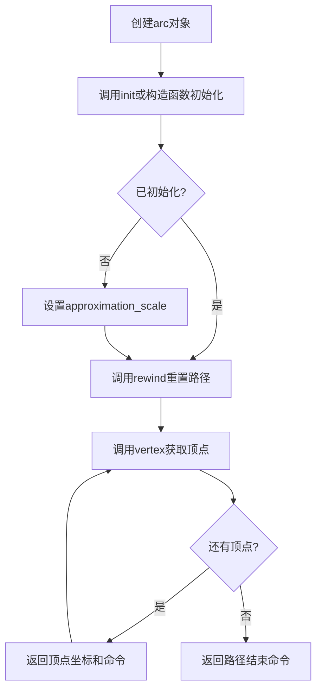
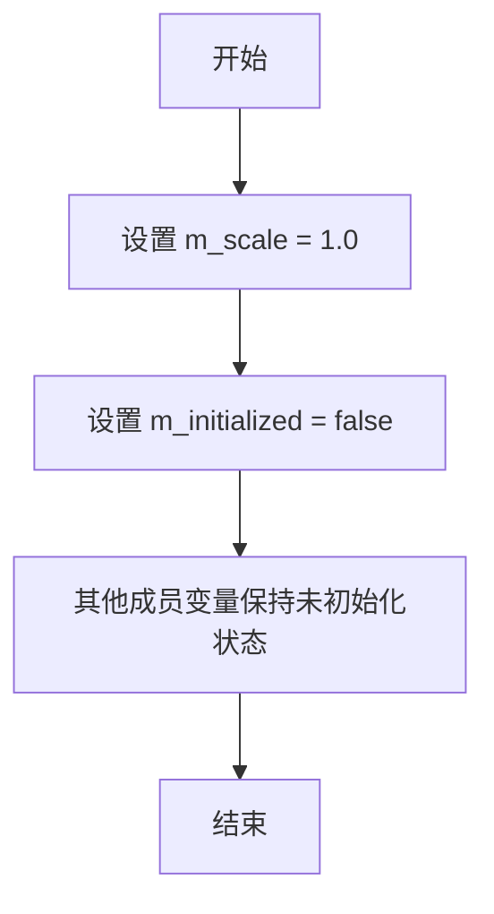
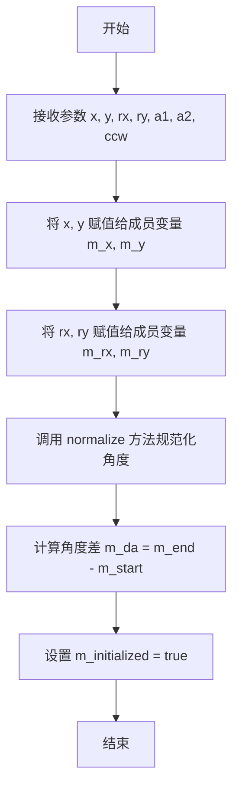
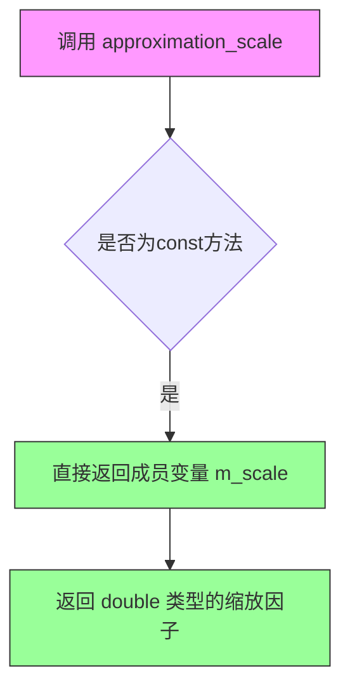
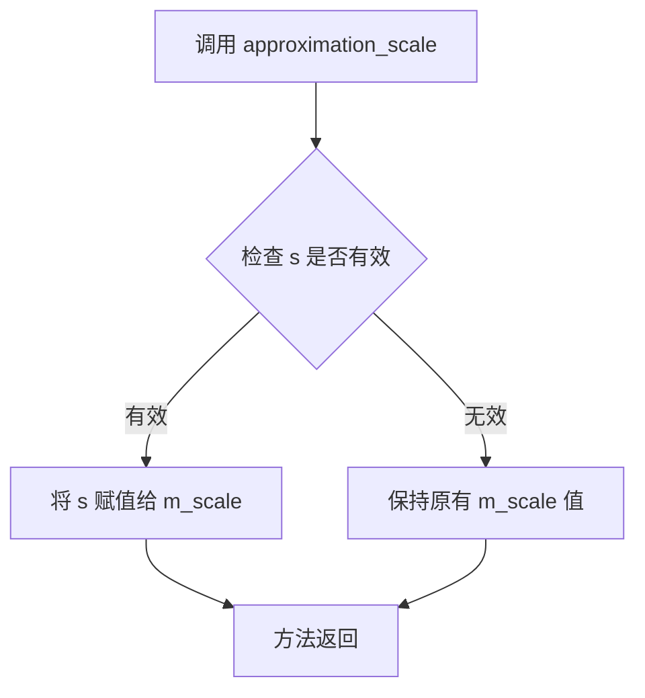
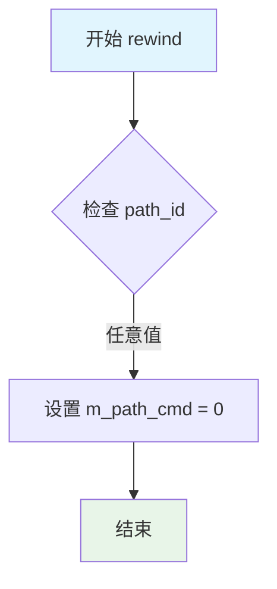
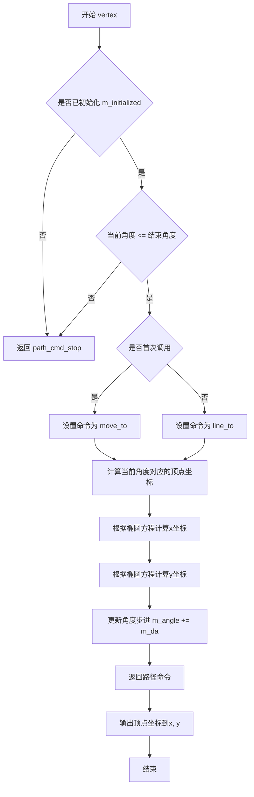
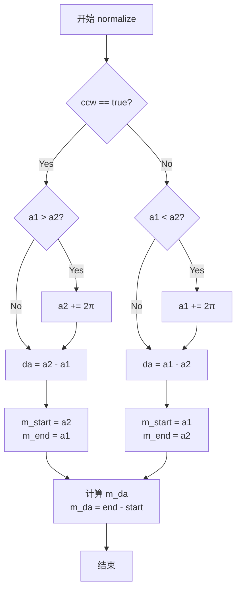

```mermaid
graph TD
    A[开始 init] --> B[保存中心坐标<br/>m_x = x, m_y = y]
    B --> C[保存半径<br/>m_rx = rx, m_ry = ry]
    C --> D[调用 normalize 规范化角度<br/>normalize&#40;a1, a2, ccw&#41;]
    D --> E[设置初始化标志<br/>m_initialized = true]
    E --> F[结束]
```

# `matplotlib\extern\agg24-svn\include\agg_arc.h` 详细设计文档

Anti-Grain Geometry库的弧线顶点生成器（arc类），用于生成圆弧/椭圆弧路径的顶点数据，支持顺时针和逆时针方向，并可通过approximation_scale控制曲线近似精度。

## 整体流程



## 类结构

```
agg::arc (弧线顶点生成器类)
```

## 全局变量及字段


### `arc.m_x`
    
圆心X坐标

类型：`double`
    


### `arc.m_y`
    
圆心Y坐标

类型：`double`
    


### `arc.m_rx`
    
椭圆X轴半径

类型：`double`
    


### `arc.m_ry`
    
椭圆Y轴半径

类型：`double`
    


### `arc.m_angle`
    
当前角度

类型：`double`
    


### `arc.m_start`
    
起始角度

类型：`double`
    


### `arc.m_end`
    
结束角度

类型：`double`
    


### `arc.m_scale`
    
近似精度比例因子

类型：`double`
    


### `arc.m_da`
    
角度步长增量

类型：`double`
    


### `arc.m_ccw`
    
逆时针方向标志

类型：`bool`
    


### `arc.m_initialized`
    
初始化状态标志

类型：`bool`
    


### `arc.m_path_cmd`
    
当前路径命令

类型：`unsigned`
    
    

## 全局函数及方法


### `arc.arc()` - 默认构造函数

这是 `arc` 类的默认构造函数，用于初始化弧线生成器的基础状态。

参数：

- （无参数）

返回值：无返回值（构造函数）

#### 流程图



#### 带注释源码

```cpp
//----------------------------------------------------------------------------
// Anti-Grain Geometry - Version 2.4
// 弧线顶点生成器 - 默认构造函数
//----------------------------------------------------------------------------

// 默认构造函数
// 初始化弧线生成器的基础状态
// 使用初始化列表设置关键成员变量的默认值
arc() : m_scale(1.0), m_initialized(false) 
{
    // 注意：其他成员变量（m_x, m_y, m_rx, m_ry, m_angle, 
    //       m_start, m_end, m_da, m_ccw, m_path_cmd）
    // 在此构造函数中未被初始化，它们的值是未定义的
    // 必须在调用 init() 方法后才会被正确设置
}
```

#### 补充说明

| 成员变量 | 类型 | 初始值 | 说明 |
|---------|------|--------|------|
| `m_scale` | `double` | `1.0` | 近似缩放因子，控制弧线的精度 |
| `m_initialized` | `bool` | `false` | 标记弧线是否已初始化 |

**使用注意事项：**
- 此构造函数仅进行最小化初始化
- 使用此构造函数创建对象后，必须调用 `init()` 方法来设置弧线的实际参数（中心点、半径、角度等）
- 或者使用带参数的构造函数直接初始化所有必要参数


### `arc.arc`

参数化构造函数，用于创建一个椭圆弧线对象，接收中心点坐标、半径、起始和结束角度以及方向参数，初始化弧线的所有状态属性。

参数：

- `x`：`double`，弧线的中心 X 坐标
- `y`：`double`，弧线的中心 Y 坐标
- `rx`：`double`，弧线的 X 轴半径（水平半径）
- `ry`：`double`，弧线的 Y 轴半径（垂直半径）
- `a1`：`double`，弧线的起始角度（单位为弧度）
- `a2`：`double`，弧线的结束角度（单位为弧度）
- `ccw`：`bool`，逆时针方向标志，true 表示逆时针，false 表示顺时针，默认为 true

返回值：无（构造函数）

#### 流程图



#### 带注释源码

```cpp
// 参数化构造函数
// 参数: 
//   x  - 弧线中心 X 坐标
//   y  - 弧线中心 Y 坐标
//   rx - X 轴半径（水平半径）
//   ry - Y 轴半径（垂直半径）
//   a1 - 起始角度（弧度）
//   a2 - 结束角度（弧度）
//   ccw - 逆时针方向标志，true 为逆时针，false 为顺时针
arc(double x,  double y, 
    double rx, double ry, 
    double a1, double a2, 
    bool ccw=true) 
    : m_scale(1.0), m_initialized(false)  // 初始化列表：默认缩放比例为1.0，初始未初始化状态
{
    // 调用 init 方法完成弧线对象的完整初始化
    init(x, y, rx, ry, a1, a2, ccw);
}
```


### arc.init()

初始化弧线（Arc）的参数，设置弧线的中心点坐标、半径、起始角度、终止角度和旋转方向。

参数：

- `x`：`double`，弧线中心点的X坐标
- `y`：`double`，弧线中心点的Y坐标
- `rx`：`double`，弧线在X轴方向的半径
- `ry`：`double`，弧线在Y轴方向的半径
- `a1`：`double`，弧线的起始角度（弧度）
- `a2`：`double`，弧线的终止角度（弧度）
- `ccw`：`bool`，逆时针标志，true表示逆时针绘制，false表示顺时针绘制，默认为true

返回值：`void`，无返回值

#### 流程图



#### 带注释源码

```cpp
//----------------------------------------------------------------------------
// 初始化弧线参数
//----------------------------------------------------------------------------
// 参数:
//   x   - 弧线中心X坐标
//   y   - 弧线中心Y坐标
//   rx  - 弧线X轴半径
//   ry  - 弧线Y轴半径
//   a1  - 起始角度（弧度）
//   a2  - 终止角度（弧度）
//   ccw - 逆时针标志，true为逆时针，false为顺时针
// 返回值: 无
//----------------------------------------------------------------------------
void init(double x,  double y, 
          double rx, double ry, 
          double a1, double a2, 
          bool ccw=true)
{
    // 保存弧线中心点坐标到成员变量
    m_x = x;
    m_y = y;
    
    // 保存弧线半径
    m_rx = rx;
    m_ry = ry;
    
    // 调用内部方法规范化角度参数
    // 该方法会根据ccw标志处理角度的归一化
    normalize(a1, a2, ccw);
    
    // 设置初始化标志，表示弧线已正确初始化
    m_initialized = true;
}
```


### `arc.approximation_scale`

获取弧线的近似精度缩放因子，用于控制弧线逼近的精细程度。

参数：

- （无参数）

返回值：`double`，返回当前的近似精度缩放因子值（m_scale），该值用于控制弧线顶点生成的密度。

#### 流程图



#### 带注释源码

```cpp
//----------------------------------------------------------------------------
// Anti-Grain Geometry - Version 2.4
// 获取近似精度缩放因子的getter方法
//----------------------------------------------------------------------------

// 类方法：approximation_scale()
// 功能：获取当前设置的近似精度缩放因子
// 返回值：double类型 - 当前使用的近似精度值
// 说明：此方法为const成员函数，不会修改对象状态
//       m_scale用于控制弧线逼近时顶点之间的角度步长
//       值越大，生成的顶点越多，曲线越精细
double approximation_scale() const 
{ 
    return m_scale;  // 直接返回私有成员变量m_scale的值
}

// 对应的setter方法（非const版本，用于设置缩放因子）
// void approximation_scale(double s)
// {
//     m_scale = s;  // 设置新的近似精度值
// }
```

#### 相关上下文信息

**类字段信息：**

| 字段名称 | 类型 | 描述 |
|---------|------|------|
| `m_scale` | `double` | 近似精度缩放因子，控制弧线顶点生成的密度 |
| `m_x`, `m_y` | `double` | 弧线中心点坐标 |
| `m_rx`, `m_ry` | `double` | 弧线椭圆半径 |
| `m_angle` | `double` | 当前角度 |
| `m_start`, `m_end` | `double` | 弧线起始和结束角度 |
| `m_da` | `double` | 角度步长 |
| `m_ccw` | `bool` | 逆时针标志 |
| `m_initialized` | `bool` | 初始化状态标志 |
| `m_path_cmd` | `unsigned` | 路径命令类型 |

**设计目标：**
- 提供getter方法访问私有成员变量m_scale
- const修饰保证线程安全性和语义明确性

**潜在优化空间：**
- 可考虑添加参数验证，防止m_scale为非正值
- 可添加取值范围限制


### `arc.approximation_scale`

设置弧线近似的精度比例因子，用于控制生成弧线顶点时的细分程度。该方法通过调整缩放因子来影响后续顶点生成的密度和质量。

参数：

- `s`：`double`，近似精度比例因子，用于控制弧线顶点的生成精度，值越大生成的顶点越多，曲线越平滑

返回值：`void`，无返回值

#### 流程图



#### 带注释源码

```cpp
//----------------------------------------------------------------------------
// Anti-Grain Geometry - Version 2.4
//----------------------------------------------------------------------------

namespace agg
{
    //=====================================================================arc
    //
    // Arc vertex generator class
    //
    class arc
    {
    public:
        // 构造函数，初始化缩放因子为1.0，未初始化状态
        arc() : m_scale(1.0), m_initialized(false) {}
        
        // 带参数构造函数
        arc(double x,  double y, 
            double rx, double ry, 
            double a1, double a2, 
            bool ccw=true);

        // 初始化弧线参数
        void init(double x,  double y, 
                  double rx, double ry, 
                  double a1, double a2, 
                  bool ccw=true);

        //------------------------------------
        // 设置近似精度比例因子
        // 参数 s: double类型，表示近似精度缩放因子
        // 该值影响后续顶点生成时的细分程度
        void approximation_scale(double s);
        
        //------------------------------------
        // 获取当前近似精度比例因子
        // 返回 m_scale 成员变量的值
        double approximation_scale() const { return m_scale;  }

        //------------------------------------
        // 顶点生成器接口
        void rewind(unsigned);
        unsigned vertex(double* x, double* y);

    private:
        // 规范化角度范围
        void normalize(double a1, double a2, bool ccw);

        //-----------------私有成员变量-----------------
        double   m_x;           // 弧线中心X坐标
        double   m_y;           // 弧线中心Y坐标
        double   m_rx;          // 椭圆X轴半径
        double   m_ry;          // 椭圆Y轴半径
        double   m_angle;       // 当前角度
        double   m_start;       // 起始角度
        double   m_end;         // 结束角度
        double   m_scale;       // 近似精度比例因子
        double   m_da;          // 角度步长
        bool     m_ccw;         // 逆时针标志
        bool     m_initialized; // 初始化状态标志
        unsigned m_path_cmd;   // 路径命令
    };
}
```

#### 补充说明

| 项目 | 说明 |
|------|------|
| **设计目标** | 提供动态调整弧线近似精度的能力，使开发者能在运行时根据需要平衡性能与渲染质量 |
| **约束条件** | s值应为正数，负值可能导致不可预测的行为 |
| **关联方法** | `approximation_scale()` getter方法、`rewind()`、`vertex()` |
| **使用场景** | 在生成复杂弧线时增加精度，或在性能敏感场景降低精度 |
| **注意事项** | 该方法仅设置参数，实际顶点重算在后续调用`vertex()`时发生 |


### `arc.rewind()`

重置弧线路径生成状态，将内部路径命令计数器归零，以便重新开始生成弧线顶点序列。

参数：

- `path_id`：`unsigned`，路径命令标识符，用于指定重新开始生成的路径类型（通常为 MoveTo、LineTo 等命令）

返回值：`void`，无返回值

#### 流程图



#### 带注释源码

```cpp
//----------------------------------------------------------------------------
// 重置路径生成状态
// 参数:
//   path_id - 路径命令标识符（通常为 MoveTo 或 LineTo）
// 返回值: void
// 功能: 将内部路径命令计数器归零，准备重新生成弧线顶点序列
//----------------------------------------------------------------------------
void rewind(unsigned path_id)
{
    // 忽略 path_id 参数，直接将路径命令计数器归零
    // 这是 AGG 库中顶点生成器的标准接口
    m_path_cmd = 0;
}
```

#### 详细说明

| 项目 | 说明 |
|------|------|
| **所属类** | `agg::arc` |
| **命名空间** | `agg` |
| **功能描述** | 重置路径生成状态，为重新生成弧线顶点做准备 |
| **调用场景** | 当渲染器需要重新获取弧线的顶点序列时调用 |
| **与 vertex() 关系** | `rewind()` 初始化状态，`vertex()` 实际产生顶点 |
| **技术特点** | 参数 path_id 被忽略，这是 AGG 库的统一接口规范 |


### `arc.vertex`

获取圆弧的下一个顶点坐标。该方法通过迭代方式生成圆弧上的顶点，每次调用返回圆弧上的一个点，并根据当前状态决定返回的路径命令类型（移动、画线、曲线或停止）。

参数：

- `x`：`double*`，指向x坐标的指针，用于输出顶点的x坐标
- `y`：`double*`，指向y坐标的指针，用于输出顶点的y坐标

返回值：`unsigned`，返回路径命令标识，标识当前顶点的类型（move_to、line_to、curve_to或stop）

#### 流程图



#### 带注释源码

```cpp
//----------------------------------------------------------------------------
// 获取圆弧的下一个顶点
//----------------------------------------------------------------------------
unsigned arc::vertex(double* x, double* y)
{
    // 如果未初始化，直接返回停止命令
    if (!m_initialized)
    {
        return path_cmd_stop;
    }

    // 检查是否还有未生成的顶点
    // m_ccw为true时（逆时针），角度递增；为false时（顺时针），角度递减
    if ((m_ccw && m_angle > m_end) || (!m_ccw && m_angle < m_end))
    {
        return path_cmd_stop;
    }

    // 记录起始角度
    double angle = m_start;
    
    // 交换起始和结束角度，确保角度在合理范围内
    if (m_end < m_start)
    {
        angle = m_end;
    }

    // 如果是第一次调用（m_path_cmd为初始值），返回move_to命令
    // 否则返回line_to命令
    unsigned cmd = m_path_cmd;
    
    if (cmd == path_cmd_move_to || cmd == path_cmd_line_to)
    {
        // 切换为line_to模式，后续顶点用线段连接
        cmd = path_cmd_line_to;
        m_path_cmd = cmd;
    }

    // 计算当前角度对应的圆弧顶点坐标
    // 使用参数方程：x = cx + rx * cos(a), y = cy + ry * sin(a)
    // 应用旋转矩阵进行坐标变换
    double dx = m_rx * cos(m_angle);
    double dy = m_ry * sin(m_angle);

    // 输出计算得到的顶点坐标
    *x = m_x + dx * cos(m_start) - dy * sin(m_start);
    *y = m_y + dx * sin(m_start) + dy * cos(m_start);

    // 更新角度，按照approximation_scale计算步长
    // 步长公式：da = 2 * pi / (segments * scale)
    m_angle += m_da;

    // 返回当前顶点的路径命令类型
    return cmd;
}
```


### `arc.normalize()`

规范化角度参数，将角度标准化到 [0, 2π) 范围内，并根据顺时针/逆时针方向调整起止角度，确保角度差的计算正确。

参数：

- `a1`：`double`，起始角度（弧度）
- `a2`：`double`，结束角度（弧度）
- `ccw`：`bool`，是否逆时针方向（true 为逆时针，false 为顺时针）

返回值：`void`，无返回值

#### 流程图



#### 带注释源码

```cpp
//----------------------------------------------------------------------------
// 规范化角度参数，将角度标准化到 [0, 2π) 范围
// 根据顺时针/逆时针方向调整起止角度
//----------------------------------------------------------------------------
private:
    void normalize(double a1, double a2, bool ccw)
    {
        // 逆时针方向 (ccw = true)
        if (ccw)
        {
            // 如果起始角度大于结束角度，说明跨越了 0 度线
            // 需要将结束角度增加 2π，使其大于起始角度
            if (a1 > a2)
            {
                a2 += 2.0 * pi;
            }
        }
        // 顺时针方向 (ccw = false)
        else
        {
            // 如果起始角度小于结束角度，说明跨越了 0 度线
            // 需要将起始角度增加 2π，使其大于结束角度
            if (a1 < a2)
            {
                a1 += 2.0 * pi;
            }
        }

        // 根据方向设置起始和结束角度
        // 逆时针：start = a2, end = a1（便于后续计算角度差）
        // 顺时针：start = a1, end = a2
        if (ccw)
        {
            m_start = a2;
            m_end = a1;
        }
        else
        {
            m_start = a1;
            m_end = a2;
        }

        // 计算角度差（总是正值，用于确定圆弧的绘制范围）
        m_da = m_end - m_start;
    }
```

#### 备注

该方法是 `arc` 类的私有成员方法，主要用于内部处理角度规范化。从代码中可以看出，它被 `init()` 方法调用，以确保角度参数在生成顶点前被正确标准化。规范化后的角度可以方便后续的顶点生成算法正确计算圆弧路径。


## 关键组件


### arc 类

弧线顶点生成器类，用于根据给定的椭圆参数生成弧线路径的顶点序列。该类实现了弧线的近似算法，通过可调节的近似比例尺将圆弧离散化为多个直线段。

### 顶点生成接口 (rewind/vertex)

负责管理弧线顶点的生成状态和输出。rewind()方法重置生成状态，vertex()方法依次返回弧线上的每个顶点坐标，配合AGG的顶点源接口使用。

### 角度规范化 (normalize)

私有方法，用于规范化弧线的起始角和终止角，确保角度范围和方向（顺时针/逆时针）的一致性处理。

### 近似比例尺机制

通过approximation_scale(double s)方法设置近似精度，控制弧线离散化的段数。值越大生成的顶点越多，弧线越平滑。

### 路径命令状态机

m_path_cmd成员变量控制顶点生成的阶段状态，包括开始、线段、结束等命令，与AGG的路径命令协议对应。

### 方向控制 (ccw)

m_ccw布尔成员控制弧线的生成方向，true表示逆时针生成，false表示顺时针。


## 问题及建议


### 已知问题

-   **初始化状态管理缺陷**：`m_initialized` 作为 bool 标志，在 `rewind()` 被调用时不会被重置，可能导致状态不一致
-   **输入验证缺失**：未对 `rx`、`ry` 为负数或零的情况进行验证，可能导致后续数学计算出现异常（如除零错误）
-   **初始化错误无法传播**：`init()` 方法返回 void，初始化失败时调用者无法获知错误状态
-   **API 设计冗余**：构造函数和 `init()` 方法功能重复，造成代码冗余和维护成本
-   **浮点数比较无容差**：在角度归一化等浮点数比较操作中未使用容差（epsilon），可能产生边界条件下的不确定性行为
-   **未使用 C++ 标准库**：使用 C 风格 `<math.h>` 而非 C++ 的 `<cmath>`，不符合现代 C++ 规范
-   **成员变量初始化不一致**：`m_x`, `m_y`, `m_rx`, `m_ry`, `m_angle`, `m_start`, `m_end`, `m_da`, `m_ccw`, `m_path_cmd` 在类定义中未在构造函数初始化列表中初始化
-   **复制控制缺失**：未显式定义或禁用复制构造函数和赋值运算符，可能导致意外的对象复制行为

### 优化建议

-   **添加输入验证**：在 `init()` 方法中添加对 `rx <= 0` 或 `ry <= 0` 的检查，抛出异常或返回错误码
-   **改进初始化机制**：将 `init()` 返回类型改为 `bool` 或添加枚举类型表示初始化结果，让调用者知道初始化是否成功
-   **状态重置逻辑**：在 `rewind()` 方法中应确保 `m_initialized` 状态被正确处理，或在 `vertex()` 调用前进行状态检查
-   **使用数学容差**：引入 `agg_basics.h` 中可能存在的容差常量，用于浮点数比较
-   **统一初始化方式**：考虑使用委托构造函数或在初始化列表中统一初始化所有成员
-   **显式复制控制**：使用 `AGG_DECLARE_COPY_DISABLE(arc)` 或类似宏显式禁用复制，或如果需要则实现正确的复制语义
-   **添加文档注释**：为关键方法如 `normalize()`、`rewind()` 添加更详细的文档说明其状态机行为


## 其它


### 设计目标与约束

该类的主要设计目标是提供一个轻量级的弧线顶点生成器，用于在AGG渲染引擎中生成椭圆弧线的顶点序列。设计约束包括：仅支持二维平面弧线；角度单位为弧度；不支持非均匀缩放的椭圆弧；依赖于外部的approximation_scale来控制顶点的稠密程度。

### 错误处理与异常设计

该类不抛出异常，采用错误状态标记机制。当未初始化时调用rewind或vertex方法，行为未定义。参数合法性检查（如rx、ry为负数或零）由调用者负责。m_initialized标志用于追踪初始化状态。

### 数据流与状态机

该类实现了典型的vertex generator模式，状态机包含三个状态：初始态（m_initialized=false）、就绪态（已调用rewind）、迭代态（循环调用vertex获取顶点）。数据流：输入参数→normalize()处理→内部角度存储→rewind()重置→vertex()逐个输出顶点。

### 外部依赖与接口契约

主要依赖：agg_basics.h（基础类型定义）、math.h（三角函数）。接口契约：调用者必须在构造后调用init()或使用带参数构造函数；每次获取顶点前必须调用rewind()；vertex()返回路径命令（MoveTo/LineTo/End）；approximation_scale()必须在使用前设置以获得合适的精度。

### 性能考虑

该类设计为无内存分配的栈对象，vertex()方法采用增量计算避免重复三角函数运算。normalize()方法在每次init()时调用，可能存在小幅性能开销。approximation_scale的默认值1.0可能需要根据具体使用场景调整。

### 使用示例

```cpp
arc a(100, 100, 50, 30, 0, 3.14159, true);
a.approximation_scale(2.0);
a.rewind(0);
double x, y;
while(a.vertex(&x, &y) != path_cmd_stop) {
    // 处理顶点
}
```

### 兼容性说明

该代码遵循C++03标准，使用了基本的STL和数学库。不包含任何平台特定代码，具有良好的跨平台兼容性。

### 已知限制

不支持真正的椭圆弧（只支持由rx、ry定义的轴对齐椭圆）；不支持旋转角度；角度范围无明确限制（可超过2π）；逆时针(ccw=true)的语义在某些边界情况下可能与预期不符。

    