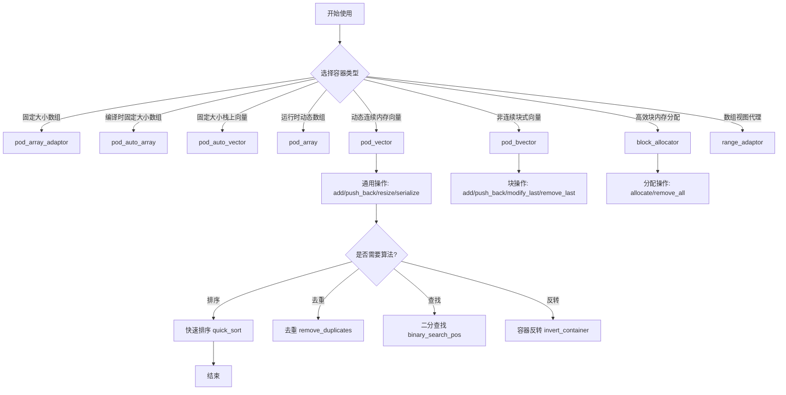
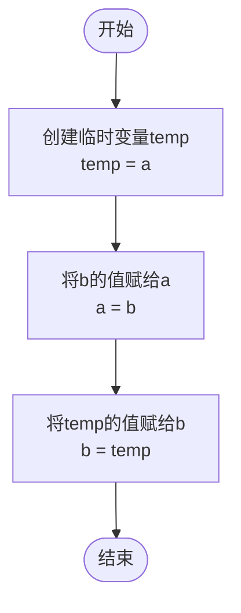
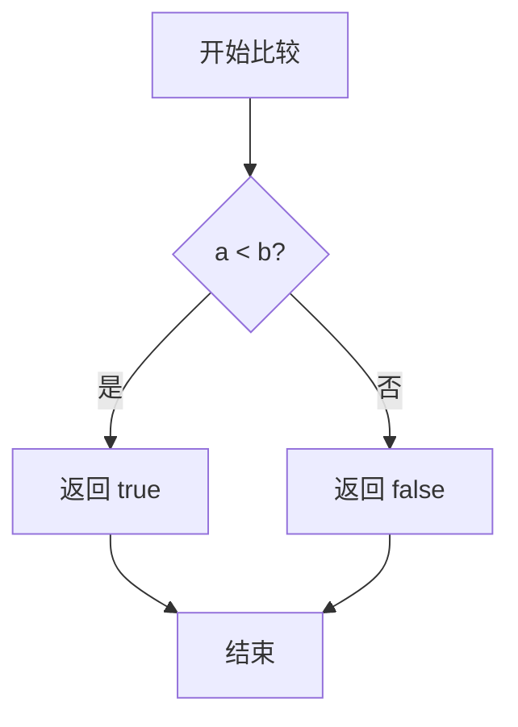
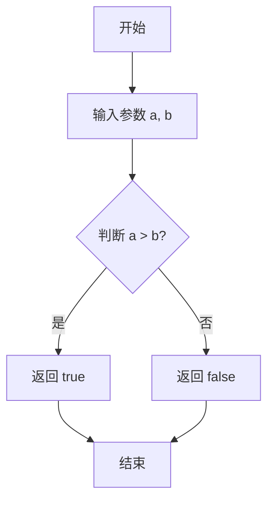
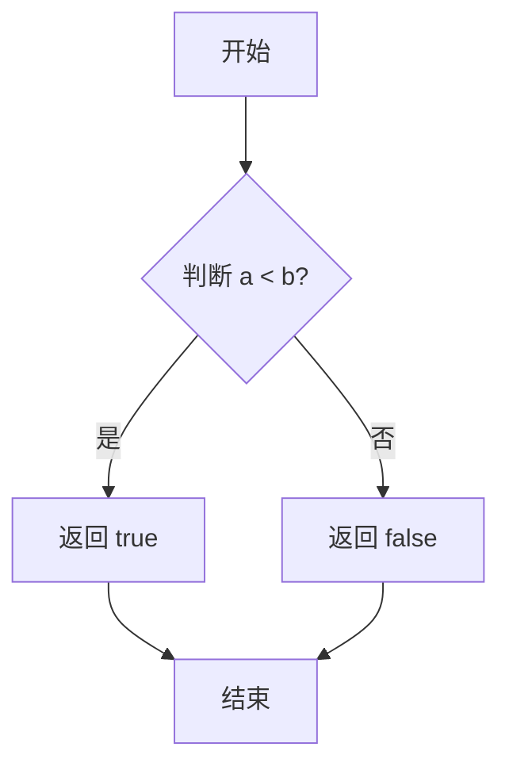
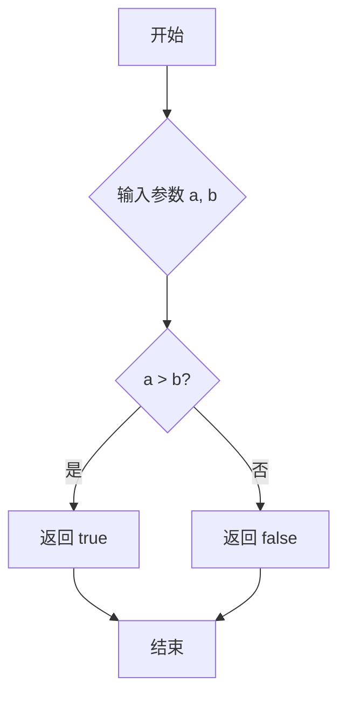
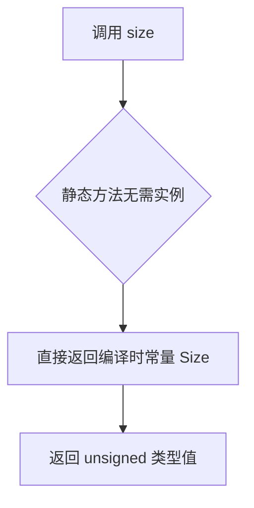
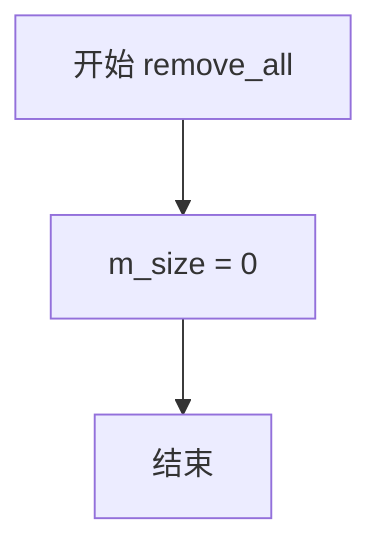
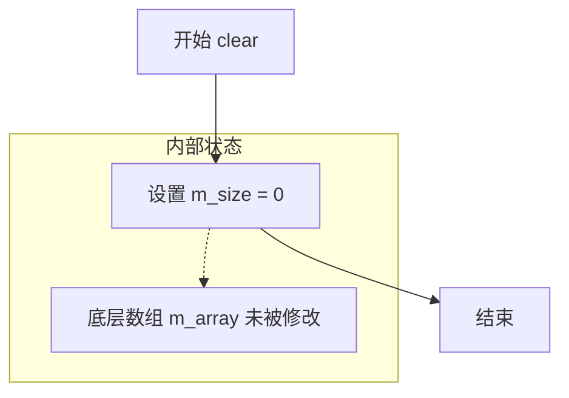

# `matplotlib\extern\agg24-svn\include\agg_array.h` 详细设计文档

这是Anti-Grain Geometry库中的一个核心头文件，定义了一系列用于存储和处理Plain Old Data (POD) 类型数据的模板类和辅助函数。这些类提供了多种内存管理策略，包括静态数组、自动扩展数组、动态数组、基于块的向量以及块内存分配器，旨在为高性能图形编程提供轻量级且高效的容器实现。此外，文件还包含了快速排序、去重、二分查找等通用算法模板。

## 整体流程



## 类结构

```
agg:: namespace
├── pod_array_adaptor<T> (模板类：数组适配器)
├── pod_auto_array<T, Size> (模板类：静态自动数组)
├── pod_auto_vector<T, Size> (模板类：静态自动向量)
├── pod_array<T> (模板类：动态数组)
├── pod_vector<T> (模板类：动态向量)
├── pod_bvector<T, S> (模板类：块向量)
├── block_allocator (类：块分配器)
├── range_adaptor<Array> (模板类：范围适配器)
├── 枚举: quick_sort_threshold_e
└── 全局函数模板:
    ├── swap_elements
    ├── quick_sort
    ├── remove_duplicates
    ├── invert_container
    ├── binary_search_pos
    ├── int_less
    ├── int_greater
    ├── unsigned_less
    └── unsigned_greater
```

## 全局变量及字段


### `quick_sort_threshold`
    
快速排序阈值，当数组长度小于等于此值时使用插入排序

类型：`int`
    


### `pod_array_adaptor<T>.m_array`
    
指向外部数组的指针

类型：`T*`
    


### `pod_array_adaptor<T>.m_size`
    
数组大小

类型：`unsigned`
    


### `pod_auto_array<T, Size>.m_array`
    
编译时确定大小的数组

类型：`T[Size]`
    


### `pod_auto_vector<T, Size>.m_array`
    
栈上分配的数组

类型：`T[Size]`
    


### `pod_auto_vector<T, Size>.m_size`
    
当前元素数量

类型：`unsigned`
    


### `pod_array<T>.m_array`
    
动态分配的数组指针

类型：`T*`
    


### `pod_array<T>.m_size`
    
当前大小

类型：`unsigned`
    


### `pod_vector<T>.m_size`
    
当前元素数量

类型：`unsigned`
    


### `pod_vector<T>.m_capacity`
    
分配的总容量

类型：`unsigned`
    


### `pod_vector<T>.m_array`
    
指向数据块的指针

类型：`T*`
    


### `pod_bvector<T, S>.m_size`
    
元素总数

类型：`unsigned`
    


### `pod_bvector<T, S>.m_num_blocks`
    
当前块数

类型：`unsigned`
    


### `pod_bvector<T, S>.m_max_blocks`
    
最大块数

类型：`unsigned`
    


### `pod_bvector<T, S>.m_blocks`
    
块指针数组

类型：`T**`
    


### `pod_bvector<T, S>.m_block_ptr_inc`
    
块指针增量

类型：`unsigned`
    


### `block_allocator.m_block_size`
    
块大小

类型：`unsigned`
    


### `block_allocator.m_block_ptr_inc`
    
块指针增量

类型：`unsigned`
    


### `block_allocator.m_num_blocks`
    
当前块数

类型：`unsigned`
    


### `block_allocator.m_max_blocks`
    
最大块数

类型：`unsigned`
    


### `block_allocator.m_blocks`
    
块数组

类型：`block_type*`
    


### `block_allocator.m_buf_ptr`
    
当前缓冲区指针

类型：`int8u*`
    


### `block_allocator.m_rest`
    
剩余空间

类型：`unsigned`
    


### `range_adaptor<Array>.m_array`
    
引用的数组

类型：`Array&`
    


### `range_adaptor<Array>.m_start`
    
起始索引

类型：`unsigned`
    


### `range_adaptor<Array>.m_size`
    
大小

类型：`unsigned`
    
    

## 全局函数及方法


### `swap_elements`

这是一个模板函数，用于交换两个变量的值。它通过创建一个临时变量，先将第一个参数的值存入临时变量，再将第二个参数的值赋给第一个参数，最后将临时变量的值赋给第二个参数，从而实现两个元素的交换。

参数：

- `a`：`T&`，第一个要交换的元素（引用传递）
- `b`：`T&`，第二个要交换的元素（引用传递）

返回值：`void`，无返回值（通过引用参数直接修改传入的变量）

#### 流程图



#### 带注释源码

```cpp
//-----------------------------------------------------------swap_elements
// 模板函数：交换两个元素的值
// 使用标准的三步交换算法：通过临时变量实现值的交换
//------------------------------------------------------------------------
template<class T> 
inline void swap_elements(T& a, T& b)
{
    // 第一步：将a的值保存到临时变量temp中
    T temp = a;
    
    // 第二步：将b的值赋给a
    a = b;
    
    // 第三步：将临时变量temp（原来的a值）赋给b
    b = temp;
}
```


### `quick_sort`

这是一个使用迭代方式实现的快速排序模板函数，通过自定义比较函数对数组进行原地排序。算法使用显式栈来避免递归调用，对于小区间使用插入排序优化。

参数：

- `arr`：`Array&`，要排序的数组，需支持 `size()` 方法和 `operator[]`
- `less`：`Less`，比较函数/函数对象，用于确定元素顺序（如果 `less(a, b)` 为 true 表示 a < b）

返回值：`void`，无返回值，直接在原数组上进行排序

#### 流程图

```mermaid
flowchart TD
    A[开始 quick_sort] --> B{数组大小 < 2?}
    B -->|是| C[直接返回]
    B -->|否| D[初始化栈和边界: limit = size, base = 0]
    D --> E[进入主循环]
    
    E --> F{子数组长度 > 阈值?}
    
    F -->|是| G[选择枢轴: pivot = base + len/2]
    G --> H[将枢轴交换到位置 base]
    H --> I[进行三点中值分区]
    I --> J[从两端向中间扫描]
    J --> K{i > j?}
    K -->|否| L[交换 arr[i] 和 arr[j], 继续扫描]
    K -->|是| M[将枢轴交换到位置 j]
    M --> N[将较大的子数组边界入栈]
    N --> O{栈顶基址和限制}
    O --> E
    
    F -->|否| P[对小区间进行插入排序]
    P --> Q{栈非空?}
    Q -->|是| R[弹出栈顶的 base 和 limit]
    R --> E
    Q -->|否| S[排序完成，返回]
    
    C --> S
```

#### 带注释源码

```cpp
//--------------------------------------------------------------quick_sort
// 快速排序模板函数 - 迭代实现版本
// @tparam Array 数组类型，需提供 size() 方法和 operator[] 
// @tparam Less  比较函数类型，用于比较两个元素的大小
// @param arr    要排序的数组（原地修改）
// @param less   比较函数对象，less(a, b) 返回 true 表示 a < b
// @return       void
template<class Array, class Less>
void quick_sort(Array& arr, Less less)
{
    // 边界情况：数组为空或只有一个元素，无需排序
    if(arr.size() < 2) return;

    // 声明临时指针用于元素比较和交换
    typename Array::value_type* e1;
    typename Array::value_type* e2;

    // 使用固定大小栈存储子数组边界（避免递归调用）
    // 栈中每两个元素表示一个子数组的 [base, limit)
    int  stack[80];
    int* top = stack; 
    int  limit = arr.size();  // limit 是exclusive的，即排序范围是 [base, limit)
    int  base = 0;            // 子数组起始位置

    // 主循环：持续处理栈中的子数组
    for(;;)
    {
        // 计算当前子数组的长度
        int len = limit - base;

        int i;
        int j;
        int pivot;

        // 如果子数组长度大于阈值，使用快速排序
        if(len > quick_sort_threshold)
        {
            // 选择枢轴：使用中间元素
            // 这里使用"三点中值"策略，选择 base、base+len/2、limit-1 三个位置的中值
            pivot = base + len / 2;
            swap_elements(arr[base], arr[pivot]);

            i = base + 1;
            j = limit - 1;

            // 确保 *i <= *base <= *j（三点分区）
            // 这一步确保枢轴位置正确，减少最坏情况的发生
            e1 = &(arr[j]); 
            e2 = &(arr[i]);
            if(less(*e1, *e2)) swap_elements(*e1, *e2);

            e1 = &(arr[base]); 
            e2 = &(arr[i]);
            if(less(*e1, *e2)) swap_elements(*e1, *e2);

            e1 = &(arr[j]); 
            e2 = &(arr[base]);
            if(less(*e1, *e2)) swap_elements(*e1, *e2);

            // 分区过程：i 从左向右扫描，j 从右向左扫描
            for(;;)
            {
                // i 向右移动，找到大于等于枢轴的元素
                do i++; while( less(arr[i], arr[base]) );
                // j 向左移动，找到小于等于枢轴的元素
                do j--; while( less(arr[base], arr[j]) );

                // 如果 i 和 j 交叉，说明分区完成
                if( i > j )
                {
                    break;
                }

                // 交换两个元素的位置
                swap_elements(arr[i], arr[j]);
            }

            // 将枢轴放到最终位置 j
            swap_elements(arr[base], arr[j]);

            // 将较大的子数组边界压入栈，先处理较小的子数组（尾递归优化）
            // 这样可以减少栈的深度
            if(j - base > limit - i)
            {
                // 左侧子数组较大
                top[0] = base;
                top[1] = j;
                base   = i;       // 接下来处理右侧较小的子数组
            }
            else
            {
                // 右侧子数组较大
                top[0] = i;
                top[1] = limit;
                limit  = j;       // 接下来处理左侧较小的子数组
            }
            top += 2;              // 栈指针前移
        }
        else
        {
            // 子数组较小，使用插入排序（对于小数组更高效）
            j = base;
            i = j + 1;

            for(; i < limit; j = i, i++)
            {
                // 从右向左比较，找到正确的插入位置
                for(; less(*(e1 = &(arr[j + 1])), *(e2 = &(arr[j]))); j--)
                {
                    // 交换元素（实际上是插入操作）
                    swap_elements(*e1, *e2);
                    // 如果已经到达子数组的最左端，停止
                    if(j == base)
                    {
                        break;
                    }
                }
            }
            
            // 如果栈中有待处理的子数组，弹出并继续
            if(top > stack)
            {
                top  -= 2;
                base  = top[0];
                limit = top[1];
            }
            else
            {
                // 栈为空，所有子数组处理完毕，排序完成
                break;
            }
        }
    }
}
```


### `remove_duplicates`

该函数用于从已排序的数组中移除重复元素。它遍历数组并将不重复的元素重写到数组的前部，最后返回剩余元素的数量（注意：不会实际截断数组长度）。

参数：

- `arr`：`Array&`，待处理的有序数组引用
- `equal`：`Equal`，用于判断两个元素是否相等的函数对象（或函数指针）

返回值：`unsigned`，去除重复后剩余的元素数量

#### 流程图

```mermaid
flowchart TD
    A[开始] --> B{数组大小 < 2?}
    B -->|是| C[直接返回 arr.size]
    B -->|否| D[i = 1, j = 1]
    D --> E{i < arr.size?}
    E -->|否| F[返回 j]
    E -->|是| G[获取 arr[i] 元素 e]
    H{e = arr[i-1]?}
    H -->|相等| I[i++]
    H -->|不等| J[arr[j] = e, j++]
    J --> I
    I --> E
```

#### 带注释源码

```cpp
//------------------------------------------------------------------------
//remove_duplicates
// Remove duplicates from a sorted array. It doesn't cut the 
// tail of the array, it just returns the number of remaining elements.
//-----------------------------------------------------------------------
template<class Array, class Equal>
unsigned remove_duplicates(Array& arr, Equal equal)
{
    // 如果数组大小小于2，没有重复元素需要处理
    if(arr.size() < 2) return arr.size();

    unsigned i, j;
    // i 用于遍历数组，j 用于记录不重复元素的位置
    for(i = 1, j = 1; i < arr.size(); i++)
    {
        // 获取当前元素
        typename Array::value_type& e = arr[i];
        // 如果当前元素与前一个元素不相等，则保留到位置 j
        if(!equal(e, arr[i - 1]))
        {
            arr[j++] = e;
        }
    }
    // 返回去重后的元素数量
    return j;
}
```


### `invert_container`

该函数是一个模板函数，用于将传入的容器（如数组或类似容器的对象）中的元素顺序反转。它通过从两端向中间交换元素来实现，无需额外内存。

参数：

- `arr`：`Array&`，要反转的容器引用，通过模板参数Array指定容器类型，函数直接修改该容器而不返回新容器

返回值：`void`，该函数直接修改输入容器，不返回任何值

#### 流程图

```mermaid
graph TD
    A[开始] --> B[设置i = 0, j = arr.size - 1]
    B --> C{i < j?}
    C -->|是| D[交换arr[i]和arr[j]]
    D --> E[i = i + 1, j = j - 1]
    E --> C
    C -->|否| F[结束]
```

#### 带注释源码

```cpp
//--------------------------------------------------------invert_container
// 反转容器的元素顺序
// 模板参数Array支持任何包含size()方法和下标操作符[]的容器类型
template<class Array> void invert_container(Array& arr)
{
    // i从容器起始位置开始
    int i = 0;
    // j从容器末尾位置开始
    int j = arr.size() - 1;
    
    // 从两端向中间交换元素，当i >= j时停止
    while(i < j)
    {
        // 交换两端元素，然后i前进，j后退
        swap_elements(arr[i++], arr[j--]);
    }
}
```


### `binary_search_pos`

该函数是一个模板函数，用于在已排序的数组（或类似容器）中通过二分查找算法寻找特定值的插入位置。如果数组中有与该值相等的元素，返回该元素的位置（靠后）；如果所有元素都小于该值，返回数组末尾的下一个位置。

参数：

-  `arr`：`const Array&`，已排序的数组或容器。
-  `val`：`const Value&`，要查找插入位置的值。
-  `less`：`Less`，一个严格弱排序的 functor，用于比较 `val` 和数组元素。

返回值：`unsigned`，返回值为 `val` 可以插入且保持数组有序的最小索引位置。

#### 流程图

```mermaid
graph TD
    A([开始]) --> B{arr.size() == 0?}
    B -- 是 --> C[返回 0]
    B -- 否 --> D{beg = 0, end = size - 1}
    D --> E{less(val, arr[0])?}
    E -- 是 --> F[返回 0]
    E -- 否 --> G{less(arr[end], val)?}
    G -- 是 --> H[返回 end + 1]
    G -- 否 --> I{end - beg > 1?}
    I -- 否 --> J[返回 end]
    I -- 是 --> K[计算 mid = (beg + end) >> 1]
    K --> L{less(val, arr[mid])?}
    L -- 是 --> M[end = mid]
    L -- 否 --> N[beg = mid]
    M --> I
    N --> I
    F --> J
    H --> J
    C --> J
```

#### 带注释源码

```cpp
//------------------------------------------------------binary_search_pos
// 模板函数：二分查找位置
// 参数：
//   arr: 已排序的数组
//   val: 要查找的值
//   less: 比较 functor
// 返回值：
//   返回 val 可以插入的位置（保持数组有序的最小索引）
//   如果 val 小于所有元素，返回 0
//   如果 val 大于所有元素，返回 arr.size()
//   否则返回 (end) 即 第一个大于 val 的元素的索引
//------------------------------------------------------
template<class Array, class Value, class Less>
unsigned binary_search_pos(const Array& arr, const Value& val, Less less)
{
    // 1. 空数组检查
    if(arr.size() == 0) return 0;

    // 2. 初始化边界
    unsigned beg = 0;
    unsigned end = arr.size() - 1;

    // 3. 边界情况检查：如果 val 小于第一个元素，插入位置为 0
    if(less(val, arr[0])) return 0;
    
    // 4. 边界情况检查：如果 val 大于最后一个元素，插入位置为 end + 1 (即 size)
    if(less(arr[end], val)) return end + 1;

    // 5. 二分查找主循环
    // 缩小范围直到 beg 和 end 相邻或重叠
    while(end - beg > 1)
    {
        // 计算中点，防止溢出
        unsigned mid = (end + beg) >> 1;
        
        // 如果 val < arr[mid]，说明 val 位于左半部分，更新 end
        if(less(val, arr[mid])) 
            end = mid; 
        // 否则 val >= arr[mid]，说明 val 位于右半部分（包括等于的情况），更新 beg
        else                    
            beg = mid;
    }

    // 6. 循环结束，end 指向第一个 >= val 的位置（或者是相等元素的最后一个的下一个）
    // 实际上逻辑保证了 end 是目标位置
    return end;
}
```


### `int_less`

该函数是一个简单的内联比较函数，用于比较两个整数的大小关系，判断第一个整数是否小于第二个整数。

参数：

- `a`：`int`，第一个要比较的整数
- `b`：`int`，第二个要比较的整数

返回值：`bool`，如果 `a < b` 返回 `true`，否则返回 `false`

#### 流程图



#### 带注释源码

```cpp
//---------------------------------------------------------------int_less
// 内联函数：比较两个整数是否满足 a < b
// 参数：
//   a - 第一个整数
//   b - 第二个整数
// 返回值：
//   bool - 如果 a < b 返回 true，否则返回 false
//---------------------------------------------------------------
inline bool int_less(int a, int b) 
{ 
    return a < b;  // 直接返回简单的比较结果
}
```


### `int_greater`

该函数是一个内联函数，用于比较两个整数的大小，如果第一个整数大于第二个整数则返回 true，否则返回 false。

参数：
- `a`：`int`，要比较的第一个整数
- `b`：`int`，要比较的第二个整数

返回值：`bool`，如果 a 大于 b 返回 true，否则返回 false

#### 流程图



#### 带注释源码

```cpp
//------------------------------------------------------------int_greater
// 内联函数：比较两个整数是否大于
// 参数：
//   a - 第一个整数
//   b - 第二个整数
// 返回值：
//   bool - 如果 a > b 返回 true，否则返回 false
inline bool int_greater(int a, int b) { return a > b; }
```


### `unsigned_less`

该函数是一个简单的内联函数，用于比较两个无符号整数（unsigned）的大小，判断第一个参数是否小于第二个参数。

参数：

- `a`：`unsigned`，第一个要比较的无符号整数
- `b`：`unsigned`，第二个要比较的无符号整数

返回值：`bool`，如果 `a` 小于 `b` 则返回 `true`，否则返回 `false`

#### 流程图



#### 带注释源码

```cpp
//----------------------------------------------------------unsigned_less
// 这是一个简单的内联函数，用于比较两个无符号整数的大小
// 参数:
//   a - 第一个无符号整数
//   b - 第二个无符号整数
// 返回值:
//   bool - 如果 a < b 返回 true，否则返回 false
inline bool unsigned_less(unsigned a, unsigned b) { return a < b; }
```


### `unsigned_greater`

这是一个内联函数，用于比较两个无符号整数的大小，当第一个参数大于第二个参数时返回真（true），否则返回假（false）。

参数：

- `a`：`unsigned`，第一个无符号整数，待比较的左侧值
- `b`：`unsigned`，第二个无符号整数，待比较的右侧值

返回值：`bool`，如果 a > b 则返回 true，否则返回 false

#### 流程图



#### 带注释源码

```cpp
//-------------------------------------------------------unsigned_greater
// 这是一个内联函数，用于比较两个无符号整数的大小
// 参数:
//   a - 第一个无符号整数
//   b - 第二个无符号整数
// 返回值:
//   bool - 如果 a > b 返回 true，否则返回 false
inline bool unsigned_greater(unsigned a, unsigned b) { return a > b; }
```


### `pod_array_adaptor<T>.size()`

返回该适配器管理的数组的大小。

参数：
- （无）

返回值：`unsigned`，返回数组中元素的数量，即成员变量 m_size 的值。

#### 流程图

```mermaid
graph TD
    A[调用 size()] --> B[返回 m_size]
```

#### 带注释源码

```cpp
// 返回数组的大小
// 参数：无
// 返回值：unsigned 类型，表示数组中当前元素的数量
unsigned size() const { return m_size; }
```


### `pod_array_adaptor<T>.operator[]`

提供对底层数组的直接索引访问，通过索引返回对应元素的引用，支持常量和非常量两种语义。

参数：

- `i`：`unsigned`，要访问的数组索引，从0开始。

返回值：`T&`（非const版本）或 `const T&`（const版本），返回数组中索引为i的元素的引用。

#### 流程图

```mermaid
graph TD
    A[开始] --> B[输入索引 i]
    B --> C[直接访问底层数组 m_array[i]]
    C --> D[返回元素引用]
```

#### 带注释源码

```cpp
// 非const版本：允许修改返回的元素
T& operator [] (unsigned i)       
{ 
    return m_array[i]; // 返回索引i处元素的引用
}

// const版本：只读访问，返回常量引用
const T& operator [] (unsigned i) const 
{ 
    return m_array[i]; // 返回索引i处元素的常量引用
}
```


### `pod_array_adaptor<T>.at()`

该方法是 `pod_array_adaptor` 类的成员函数，提供对数组元素的访问操作。通过索引返回数组中对应位置的元素引用，包含 const 和非 const 两个重载版本。

参数：

-  `i`：`unsigned`，访问元素的索引位置

返回值：`T&`（非 const 版本）/ `const T&`（const 版本），返回数组中第 i 个元素的引用

#### 流程图

```mermaid
flowchart TD
    A[调用 at 方法] --> B{检查索引是否有效}
    B -->|索引有效| C[返回 m_array[i] 的引用]
    B -->|索引无效| D[未定义行为 - 无边界检查]
    C --> E[返回结果]
```

#### 带注释源码

```cpp
// 非 const 版本的 at 方法
// 参数: i - 要访问的元素索引
// 返回值: T& - 第 i 个元素的引用，可修改
T& at(unsigned i)                 
{ 
    return m_array[i];  // 直接返回数组第 i 个元素的引用，无边界检查
}

// const 版本的 at 方法
// 参数: i - 要访问的元素索引
// 返回值: const T& - 第 i 个元素的常量引用，不可修改
const T& at(unsigned i) const     
{ 
    return m_array[i];  // 直接返回数组第 i 个元素的常量引用，无边界检查
}
```


### `pod_array_adaptor<T>.value_at`

获取数组中指定索引位置的元素值（按值返回）。

参数：

- `i`：`unsigned`，数组索引

返回值：`T`，返回数组中索引位置 i 处的元素副本（按值返回，而非引用）

#### 流程图

```mermaid
flowchart TD
    A[开始 value_at] --> B{检查索引 i 是否有效}
    B -->|是| C[返回 m_array[i] 的副本]
    B -->|否| D[未定义行为 - 取决于调用方保证索引有效性]
    C --> E[结束]
    D --> E
```

#### 带注释源码

```cpp
// 获取数组中指定索引位置的元素值（按值返回）
// 参数 i: 无符号整数，表示要访问的数组索引
// 返回值: T类型的值，即数组元素的副本
// 注意: 该方法不进行边界检查，调用方需确保索引在有效范围内 [0, m_size-1]
T value_at(unsigned i) const
{
    return m_array[i];  // 返回数组中第 i 个元素的副本（按值返回）
}
```


### `pod_auto_array<T, Size>::size`

该方法是一个静态成员函数，用于返回模板类 `pod_auto_array` 的编译时常量数组大小，提供对固定大小数组的元信息访问能力。

参数：无需参数

返回值：`unsigned`，返回模板参数 `Size`，即数组的编译时常量大小

#### 流程图



#### 带注释源码

```cpp
//---------------------------------------------------------pod_auto_array
// 模板类：pod_auto_array<T, Size>
// 用于存储固定大小 Plain Old Data 的模板类
//------------------------------------------------------------------------
template<class T, unsigned Size> class pod_auto_array
{
public:
        typedef T value_type;
        typedef pod_auto_array<T, Size> self_type;

        // 默认构造函数
        pod_auto_array() {}
        
        // 显式构造函数，从 C 风格数组拷贝数据
        explicit pod_auto_array(const T* c)
        {
            memcpy(m_array, c, sizeof(T) * Size);
        }

        // 重载赋值运算符，从 C 风格数组拷贝数据
        const self_type& operator = (const T* c)
        {
            memcpy(m_array, c, sizeof(T) * Size);
            return *this;
        }

        // 静态方法：返回编译时常量数组大小
        // 该方法为模板元编程提供数组大小的元信息
        // 无需实例化即可调用（通过类名作用域调用）
        static unsigned size() { return Size; }
        
        // 以下为元素访问操作符重载
        const T& operator [] (unsigned i) const { return m_array[i]; }
              T& operator [] (unsigned i)       { return m_array[i]; }
        const T& at(unsigned i) const           { return m_array[i]; }
              T& at(unsigned i)                 { return m_array[i]; }
        T  value_at(unsigned i) const           { return m_array[i]; }

private:
        // 内部存储：固定大小的 C 风格数组
        T m_array[Size];
};
```

---

### 扩展信息

**设计目标与约束**：
- 该类是 AGG 库中用于处理固定大小数组的轻量级容器
- `size()` 方法设计为静态方法，返回编译时常量，避免运行时开销
- 模板参数 `Size` 必须在编译时确定，适用于需要固定大小缓冲区的场景

**与 `pod_auto_vector` 的区别**：
- `pod_auto_array`：大小固定，`size()` 返回编译时常量
- `pod_auto_vector`：大小可动态增长，`size()` 返回运行时变量 `m_size`


### `pod_auto_array<T, Size>::operator[]`

该函数是 `pod_auto_array` 模板类的下标运算符重载，提供对内部固定大小数组的元素访问功能。通过返回数组元素的引用，允许用户像使用标准数组一样使用该类。

参数：

- `i`：`unsigned`，数组索引，指定要访问的元素位置

返回值：`T&`（可变版本）/ `const T&`（常量版本），返回数组中指定索引位置的元素的引用，可变版本允许修改元素，常量版本仅提供只读访问

#### 流程图

```mermaid
flowchart TD
    A[调用 operator[i]] --> B{是否为常量对象}
    B -->|是| C[返回 const T& m_array[i]]
    B -->|否| D[返回 T& m_array[i]]
    C --> E[返回引用, 访问结束]
    D --> E
```

#### 带注释源码

```cpp
//---------------------------------------------------------pod_auto_array
template<class T, unsigned Size> class pod_auto_array
{
public:
    typedef T value_type;
    typedef pod_auto_array<T, Size> self_type;

    // 默认构造函数
    pod_auto_array() {}

    // 从C数组拷贝初始化的构造函数
    explicit pod_auto_array(const T* c)
    {
        memcpy(m_array, c, sizeof(T) * Size);
    }

    // 从C数组拷贝赋值运算符
    const self_type& operator = (const T* c)
    {
        memcpy(m_array, c, sizeof(T) * Size);
        return *this;
    }

    // 返回数组静态大小
    static unsigned size() { return Size; }

    // 常量版本的下标运算符 - 只读访问
    // 参数: i - 无符号整型索引
    // 返回: 常量引用，防止修改数组元素
    const T& operator [] (unsigned i) const { return m_array[i]; }

    // 可变版本的下标运算符 - 可读写访问
    // 参数: i - 无符号整型索引
    // 返回: 引用，允许修改数组元素
          T& operator [] (unsigned i)       { return m_array[i]; }

    // 带边界检查的访问方法（功能与operator[]相同）
    const T& at(unsigned i) const           { return m_array[i]; }
          T& at(unsigned i)                 { return m_array[i]; }

    // 值返回方式的访问（返回副本）
    T  value_at(unsigned i) const           { return m_array[i]; }

private:
    // 内部固定大小的数组存储
    T m_array[Size];
};
```


### `pod_auto_array<T, Size>.at()`

该方法是 `pod_auto_array` 模板类的成员函数，提供对数组元素的访问操作。通过给定索引返回数组中对应位置的元素引用，支持常量和非常量两种版本。

参数：

- `i`：`unsigned`，要访问的元素的索引位置

返回值：`T&`（非常量版本）或 `const T&`（常量版本），返回数组中索引为 i 的元素的引用

#### 流程图

```mermaid
flowchart TD
    A[开始 at 调用] --> B{是否是常量版本?}
    B -->|是| C[返回 const T&]
    B -->|否| D[返回 T&]
    C --> E[返回 m_array[i] 的常量引用]
    D --> F[返回 m_array[i] 的可变引用]
    E --> G[结束]
    F --> G
```

#### 带注释源码

```cpp
// pod_auto_array 类的 at() 方法实现
// 提供对数组元素的安全访问（与 operator[] 功能相同）
template<class T, unsigned Size> class pod_auto_array
{
public:
    // ... 其他成员 ...

    // 常量版本的 at() 方法，返回常量引用
    // 参数 i: 元素的索引位置
    // 返回值: 数组中第 i 个元素的常量引用
    const T& at(unsigned i) const           
    { 
        return m_array[i];  // 直接返回数组中索引 i 处的元素引用
    }

    // 可变版本的 at() 方法，返回可变引用
    // 参数 i: 元素的索引位置
    // 返回值: 数组中第 i 个元素的可变引用，允许修改元素值
    T& at(unsigned i)                 
    { 
        return m_array[i];  // 直接返回数组中索引 i 处的元素引用
    }

private:
    // 私有成员变量：固定大小的数组
    T m_array[Size];  // 存储 Size 个类型为 T 的元素
};
```


### `pod_auto_array<T, Size>::value_at`

该函数是 `pod_auto_array` 模板类的成员方法，通过索引返回数组中对应位置的元素值。与 `at()` 和 `operator[]` 返回引用不同，`value_at()` 返回元素的副本（按值返回）。

参数：

- `i`：`unsigned`，表示要访问的元素的索引位置

返回值：`T`，返回索引位置处元素的**值**（按值返回，而非引用）

#### 流程图

```mermaid
flowchart TD
    A[开始 value_at] --> B{检查索引 i}
    B -->|索引有效| C[返回 m_array[i] 的值副本]
    B -->|索引越界| D[未定义行为<br/>不进行边界检查]
    C --> E[返回 T 类型的值]
    D --> E
    E[结束]
```

#### 带注释源码

```cpp
//--------------------------------------------------------------pod_auto_array
// pod_auto_array: 固定大小的自动数组模板类
// 存储在栈上的固定大小数组，不进行动态内存分配
//------------------------------------------------------------------------
template<class T, unsigned Size> class pod_auto_array
{
public:
    typedef T value_type;                  // 元素类型别名
    typedef pod_auto_array<T, Size> self_type;  // 自身类型别名

    // 默认构造函数
    pod_auto_array() {}

    // 带参数的构造函数，从给定的 C 风格数组复制数据
    explicit pod_auto_array(const T* c)
    {
        memcpy(m_array, c, sizeof(T) * Size);
    }

    // 赋值运算符重载，从 C 风格数组复制数据
    const self_type& operator = (const T* c)
    {
        memcpy(m_array, c, sizeof(T) * Size);
        return *this;
    }

    // 返回数组的静态大小（在编译时确定）
    static unsigned size() { return Size; }

    // 下标运算符重载（常量版本），返回元素的引用
    const T& operator [] (unsigned i) const { return m_array[i]; }
    
    // 下标运算符重载（非常量版本），返回元素的引用
          T& operator [] (unsigned i)       { return m_array[i]; }

    // at() 方法，返回元素的引用（与 operator[] 等价）
    const T& at(unsigned i) const           { return m_array[i]; }
          T& at(unsigned i)                 { return m_array[i]; }

    // value_at() 方法：返回元素的**值**（按值返回，而非引用）
    // 参数：i - 无符号整数，表示元素索引
    // 返回值：T 类型的值（元素的副本）
    // 注意：不进行边界检查，索引越界会导致未定义行为
    T  value_at(unsigned i) const           { return m_array[i]; }

private:
    // 私有成员变量：固定大小的数组
    T m_array[Size];
};
```


### `pod_auto_vector<T, Size>.remove_all()`

该方法用于清空 pod_auto_vector 容器中的所有元素，通过将内部元素计数 m_size 重置为 0 来实现"移除所有元素"的效果，但底层数组数据本身不会被清除。

参数：该方法无参数

返回值：`void`，无返回值

#### 流程图



#### 带注释源码

```cpp
//--------------------------------------------------------pod_auto_vector
template<class T, unsigned Size> class pod_auto_vector
{
public:
    // ... 省略其他成员 ...

    //-----------------------------------------------------------------------
    // 方法: remove_all
    // 功能: 移除容器中所有元素（将大小计数器置零）
    // 参数: 无
    // 返回: void
    //-----------------------------------------------------------------------
    void remove_all()            
    { 
        // 将内部元素计数 m_size 设置为 0
        // 注意：底层数组 m_array 中的数据并未被真正删除，
        // 只是通过将 m_size 置零来"隐藏"这些元素
        // 这是一种高效的重置方式，无需遍历或释放内存
        m_size = 0; 
    }

    // ... 省略其他成员 ...
};
```


### `pod_auto_vector<T, Size>.clear()`

将 `pod_auto_vector` 容器的元素数量重置为 0，但不释放底层数组的内存。这是一种轻量级的清空操作，适用于需要重用容器但不想频繁分配内存的场景。

参数：
- （无参数）

返回值：`void`，无返回值描述

#### 流程图



#### 带注释源码

```cpp
// 模板类 pod_auto_vector 的成员方法 clear()
// 功能：将向量大小重置为 0，不释放底层数组内存
// 参数：无
// 返回值：void
void clear()                 { m_size = 0; }

// 备注：
// 1. 该方法与 remove_all() 功能完全相同，都是将 m_size 设为 0
// 2. 底层数组 m_array 中的数据不会被修改或释放
// 3. 这样设计的目的是保持内存预分配，避免后续添加元素时重新分配内存
// 4. 这是一种常见的性能优化策略，特别适用于需要频繁清空和重新填充的场景
```


### `pod_auto_vector<T, Size>::add`

将传入的元素添加到向量末尾，通过将元素赋值到当前数组末尾位置（由m_size指定），然后递增m_size来扩展向量大小。

参数：

- `v`：`const T&`，要添加到向量中的元素，采用const引用传递以避免不必要的拷贝

返回值：`void`，无返回值

#### 流程图

```mermaid
flowchart TD
    A[开始 add] --> B[将元素v赋值到m_array[m_size]]
    B --> C[m_size++]
    C --> D[结束]
```

#### 带注释源码

```cpp
//--------------------------------------------------------pod_auto_vector
// pod_auto_vector: 一个固定大小的 POD (Plain Old Data) 向量模板类
// 内部使用静态数组存储元素，避免动态内存分配
//------------------------------------------------------------------------
template<class T, unsigned Size> class pod_auto_vector
{
public:
    typedef T value_type;
    typedef pod_auto_vector<T, Size> self_type;

    // 构造函数，初始化大小为0
    pod_auto_vector() : m_size(0) {}

    // ... 其他方法 ...

    // 添加元素到向量末尾
    // 参数: v - 要添加的元素（const引用）
    // 返回: void
    // 注意: 本方法不进行边界检查，调用者需确保 m_size < Size
    void add(const T& v)         { m_array[m_size++] = v; }
    
    // push_back 与 add 功能完全相同，提供 STL 兼容接口
    void push_back(const T& v)   { m_array[m_size++] = v; }
    
    // 增加向量大小
    void inc_size(unsigned size) { m_size += size; }
    
    // 获取当前向量大小
    unsigned size() const { return m_size; }
    
    // 下标运算符重载，提供数组式访问
    const T& operator [] (unsigned i) const { return m_array[i]; }
          T& operator [] (unsigned i)       { return m_array[i]; }
          
    // 带边界检查的访问方法
    const T& at(unsigned i) const           { return m_array[i]; }
          T& at(unsigned i)                 { return m_array[i]; }
          
    // 返回元素值而非引用
    T  value_at(unsigned i) const           { return m_array[i]; }

private:
    T m_array[Size];      // 存储元素的静态数组，容量固定为Size
    unsigned m_size;      // 当前元素数量
};
```

#### 相关类成员说明

| 成员 | 类型 | 描述 |
|------|------|------|
| `m_array` | `T m_array[Size]` | 存储元素的静态数组，容量在模板实例化时固定 |
| `m_size` | `unsigned` | 当前向量中元素的数量，add/push_back 操作会将其递增 |

#### 设计特点与约束

1. **固定容量**：容量在模板实例化时确定（由 Size 参数指定），不进行动态内存分配
2. **无边界检查**：`add` 方法不检查是否超出容量，可能导致缓冲区溢出
3. **POD 类型优化**：专为 POD（Plain Old Data）类型设计，无构造函数调用开销
4. **高效实现**：单条语句完成元素添加，无额外开销


### `pod_auto_vector<T, Size>::push_back`

该方法用于将元素添加到自动扩容向量的末尾，内部实现为将元素赋值到数组当前末尾位置（m_size 索引处），然后将 m_size 加 1。

参数：

-  `v`：`const T&`，要添加的元素值，以常量引用的方式传入

返回值：`void`，无返回值

#### 流程图

```mermaid
flowchart TD
    A[开始 push_back] --> B{检查容量是否足够}
    B -->|是| C[将元素 v 赋值给 m_array[m_size]]
    --> D[m_size++]
    --> E[结束]
    B -->|否| F[未定义行为 - 可能溢出]
    --> E
```

#### 带注释源码

```cpp
//------------------------------------------------------------------------
// push_back 方法实现
// 将元素添加到向量末尾，内部数组索引 m_size 处，然后递增 m_size
//------------------------------------------------------------------------
void push_back(const T& v)   { m_array[m_size++] = v; }
```

该方法是一个内联实现的简单方法，执行以下操作：

1. **参数接收**：接收一个常量引用 `v`，避免不必要的拷贝
2. **元素存储**：将元素 `v` 赋值到内部数组 `m_array` 的当前末尾位置（即索引 `m_size` 处）
3. **大小更新**：将 `m_size` 递增 1，使用后置递增操作符

**关键约束**：

- 该方法**不检查容量是否超出模板参数 `Size`**
- 如果添加元素超过预定义大小 `Size`，会导致数组越界访问（未定义行为）
- 与 `add()` 方法功能完全相同，是 `add()` 的别名


### `pod_auto_vector<T, Size>.inc_size`

该方法用于将 `pod_auto_vector` 容器的当前大小增加指定的数值，不进行边界检查，仅简单地累加内部计数器 `m_size`。

参数：

-  `size`：`unsigned`，要增加的数值大小

返回值：`void`，无返回值

#### 流程图

```mermaid
graph TD
    A[开始 inc_size] --> B[接收 size 参数]
    B --> C[m_size = m_size + size]
    C --> D[结束]
```

#### 带注释源码

```cpp
// 增加向量的大小
// 参数: size - 要增加的大小值
// 返回: void
void inc_size(unsigned size) { m_size += size; }
```


### `pod_auto_vector<T, Size>::size()`

该方法返回 pod_auto_vector 当前存储的元素数量，是一个常量成员函数，用于获取容器的当前大小。

参数：
- 无参数

返回值：`unsigned`，返回当前向量中已存储的元素数量 m_size

#### 流程图

```mermaid
flowchart TD
    A[开始 size] --> B{方法调用}
    B --> C[返回成员变量 m_size]
    C --> D[结束]
    
    style A fill:#f9f,stroke:#333
    style C fill:#9f9,stroke:#333
    style D fill:#9f9,stroke:#333
```

#### 带注释源码

```cpp
// 返回 pod_auto_vector 中当前存储的元素数量
// 这是一个常量成员函数，不修改对象状态
// 返回值：unsigned 类型，表示当前元素个数
unsigned size() const { return m_size; }
```


### `pod_auto_vector<T, Size>.operator[]`

该重载运算符提供对 `pod_auto_vector` 内部数组的直接元素访问，支持常量和非常量两种访问形式，分别返回常量引用和非常量引用。

参数：

- `i`：`unsigned`，要访问的元素索引，范围为 0 到当前向量大小减一

返回值：

- **常量版本**：`const T&`，返回指定位置元素的常量引用
- **非常量版本**：`T&`，返回指定位置元素的非常量引用，允许修改元素值

#### 流程图

```mermaid
flowchart TD
    A[开始访问元素] --> B{检查索引i}
    B -->|索引有效| C[返回m_array[i]的引用]
    B -->|索引越界| D[未定义行为 - 无边界检查]
    C --> E[结束]
    D --> E
```

#### 带注释源码

```cpp
// pod_auto_vector 类中 operator[] 的实现
// 位于 agg 命名空间下

template<class T, unsigned Size> class pod_auto_vector
{
public:
    // ... 其他成员 ...

    //-----------------------------------------常量版本 operator[]
    // 提供只读访问，返回常量引用
    const T& operator [] (unsigned i) const 
    { 
        return m_array[i];  // 直接返回内部数组m_array的第i个元素的引用
    }

    //-----------------------------------------非常量版本 operator[]
    // 提供读写访问，返回非常量引用
    T& operator [] (unsigned i)       
    { 
        return m_array[i];  // 直接返回内部数组m_array的第i个元素的引用
    }

    // ... 其他成员 ...

private:
    T m_array[Size];      // 内部固定大小的数组，存储实际数据
    unsigned m_size;      // 当前向量中实际存储的元素个数
};
```

#### 设计说明

1. **设计目标**：`pod_auto_vector` 是一个固定大小的 POD（Plain Old Data）向量容器，模板参数 `T` 指定元素类型，`Size` 指定预分配的数组大小。`operator[]` 提供了与标准数组类似的直接访问接口，性能高效。

2. **约束与限制**：
   - **无边界检查**：该运算符不进行索引越界检查，调用者需确保索引 `i` 在有效范围内 `[0, m_size)`，否则会导致未定义行为。
   - 与 `at()` 方法不同，`at()` 方法通常会进行边界检查（在某些实现中）。

3. **与其他访问方法的对比**：
   - `operator[]`：无边界检查，高性能访问
   - `at()`：同样无边界检查（本实现中），接口与 `operator[]` 等价
   - `value_at()`：返回元素的副本而非引用，适用于需要拷贝的场景

4. **潜在优化空间**：
   - 当前实现可以添加调试模式下的边界检查断言（assert）
   - 可以考虑添加迭代器支持以增强 STL 兼容性


### `pod_auto_vector<T, Size>.at`

该方法是 `pod_auto_vector` 模板类的成员方法，提供对数组中指定索引位置元素的访问操作。通过返回元素的引用，允许调用者直接读取或修改数组中的元素值。

参数：

- `i`：`unsigned`，要访问的元素索引位置

返回值：`T&`（非 const 版本）或 `const T&`（const 版本），返回指定索引位置处元素的引用

#### 流程图

```mermaid
flowchart TD
    A[调用 at 方法] --> B{判断调用对象类型}
    B -->|const 对象| C[返回 const T& 引用]
    B -->|非 const 对象| D[返回 T& 引用]
    C --> E[返回 m_array[i]]
    D --> E
    E --> F[流程结束]
```

#### 带注释源码

```cpp
// 在 pod_auto_vector 类内部
//--------------------------------------------------------------------------------
// at() 方法的 const 版本 - 用于只读访问
// 参数: i - 元素索引
// 返回: const T& - 常量引用，不允许修改元素
//--------------------------------------------------------------------------------
const T& at(unsigned i) const
{
    return m_array[i];  // 直接返回数组第 i 个元素的常量引用
}

//--------------------------------------------------------------------------------
// at() 方法的非 const 版本 - 用于读写访问
// 参数: i - 元素索引
// 返回: T& - 可变引用，允许修改元素
//--------------------------------------------------------------------------------
T& at(unsigned i)
{
    return m_array[i];  // 返回数组第 i 个元素的引用
}
```

#### 补充说明

- **边界检查**：该方法内部未进行边界检查，若索引超出数组范围将导致未定义行为
- **与 operator[] 的区别**：在当前实现中，`at()` 方法与 `operator[]` 功能完全相同，都不进行边界检查
- **设计目的**：通常 `at()` 方法会包含边界检查逻辑，但该实现中为了性能考虑省略了这一步骤，将边界检查的责任交给调用者
- **模板参数**：
  - `T`：存储元素的类型
  - `Size`：数组的固定容量大小


### `pod_auto_vector<T, Size>::value_at`

该函数是 `pod_auto_vector` 模板类的成员方法，用于获取数组中指定索引位置的元素值（返回元素的副本而非引用）。

参数：

- `i`：`unsigned`，要访问的元素索引，索引范围应在 `[0, size())` 之间，否则行为未定义

返回值：`T`，返回数组中指定索引位置元素的**值副本**（按值返回）

#### 流程图

```mermaid
flowchart TD
    A[调用 value_at i] --> B{检查索引有效性}
    B -->|索引有效| C[返回 m_array[i] 的副本]
    B -->|索引无效| D[未定义行为]
    C --> E[返回 T 类型值]
```

#### 带注释源码

```cpp
// 在 pod_auto_vector 类模板内部
//--------------------------------------------------------pod_auto_vector
template<class T, unsigned Size> class pod_auto_vector
{
public:
    // ... 其他成员 ...

    // 访问指定索引位置的元素值（按值返回副本）
    // 参数 i: 无符号整数索引
    // 返回值: 索引位置元素的副本
    T  value_at(unsigned i) const           
    { 
        return m_array[i];   // 返回数组中第 i 个元素的副本
    }

private:
    T m_array[Size];         // 内部存储的固定大小数组
    unsigned m_size;         // 当前实际存储的元素个数
};
```

#### 说明

| 项目 | 详情 |
|------|------|
| **所属类** | `pod_auto_vector<T, Size>` |
| **const 限定** | 是（const 成员函数） |
| **与 `at()` 的区别** | `at()` 返回引用，`value_at()` 返回值副本；`at()` 提供边界检查的文档说明（但实现未显式检查），`value_at()` 不返回引用 |
| **与 `operator[]` 的区别** | `operator[]` 返回引用，`value_at()` 返回值副本 |
| **潜在风险** | 未进行索引边界检查，若 `i >= m_size` 或 `i >= Size` 将导致未定义行为（访问越界内存） |


### `pod_array<T>::~pod_array`

该析构函数负责释放 `pod_array` 对象持有的动态分配内存，通过调用 `pod_allocator<T>::deallocate` 将数组内存归还给系统，是模板类 `pod_array` 生命周期管理的重要组成部分。

参数：
- 无

返回值：
- 无（C++ 析构函数不返回任何值）

#### 流程图

```mermaid
graph TD
    A[开始] --> B{检查 m_array 是否为 nullptr}
    B -- 是 --> C[直接结束]
    B -- 否 --> D[调用 pod_allocator<T>::deallocate 释放 m_array]
    D --> E[结束]
```

#### 带注释源码

```cpp
/// 析构函数 ~pod_array
/// 功能：释放动态分配的数组内存
/// 注意：当 m_array 为 nullptr 或 m_size 为 0 时，
///       pod_allocator<T>::deallocate 应正确处理（通常为空操作）
~pod_array() 
{ 
    // 调用 pod_allocator 的 deallocate 方法释放内存
    // 参数为：要释放的内存指针 m_array 和元素个数 m_size
    pod_allocator<T>::deallocate(m_array, m_size); 
}
```


### pod_array<T>::pod_array()

这是一个模板类 pod_array 的默认构造函数，用于创建一个空数组，不分配任何内存。

参数：
- 无

返回值：
- 无（构造函数不返回任何值）

#### 流程图

```mermaid
graph TD
    A[开始] --> B[设置 m_array = 0]
    B --> C[设置 m_size = 0]
    C --> D[结束]
```

#### 带注释源码

```cpp
// 默认构造函数
// 创建一个空数组，不分配内存
pod_array() : m_array(0), m_size(0) {}
```

---

### pod_array<T>::pod_array(unsigned size)

这是一个带参数的构造函数，用于创建一个指定大小的数组。

参数：
- `size`：`unsigned`，要分配的数组元素数量

返回值：
- 无（构造函数不返回任何值）

#### 流程图

```mermaid
graph TD
    A[开始] --> B[调用 allocate 分配 size 个 T 类型的内存]
    B --> C[将分配的指针赋值给 m_array]
    C --> D[设置 m_size = size]
    D --> E[结束]
```

#### 带注释源码

```cpp
// 带参数的构造函数
// 分配指定大小的内存用于存储数组元素
pod_array(unsigned size) : 
    m_array(pod_allocator<T>::allocate(size)), 
    m_size(size) 
{}
```

---

### pod_array<T>::pod_array(const self_type& v)

这是拷贝构造函数，用于从另一个 pod_array 对象创建新的数组。

参数：
- `v`：`const self_type&`，要拷贝的源 pod_array 对象的引用

返回值：
- 无（构造函数不返回任何值）

#### 流程图

```mermaid
graph TD
    A[开始] --> B[根据源对象 v.m_size 分配内存]
    B --> C[将分配的指针赋值给 m_array]
    C --> D[设置 m_size = v.m_size]
    D --> E[使用 memcpy 拷贝源数组数据到目标数组]
    E --> F[结束]
```

#### 带注释源码

```cpp
// 拷贝构造函数
// 从另一个 pod_array 对象拷贝数据
pod_array(const self_type& v) : 
    m_array(pod_allocator<T>::allocate(v.m_size)), 
    m_size(v.m_size) 
{
    // 使用 memcpy 拷贝数据，确保是浅拷贝（对于 POD 类型是安全的）
    memcpy(m_array, v.m_array, sizeof(T) * m_size);
}
```


### `pod_array<T>.pod_array(unsigned size)`

该构造函数是 `pod_array` 模板类的带参数构造函数，用于分配指定大小的连续内存空间来存储 POD（Plain Old Data）类型元素。

参数：

- `size`：`unsigned`，指定要分配的数组元素个数

返回值：无返回值（构造函数）

#### 流程图

```mermaid
flowchart TD
    A[开始构造] --> B[接收 size 参数]
    B --> C{size > 0?}
    C -->|是| D[调用 pod_allocator&lt;T&gt;::allocate<br/>分配 size * sizeof(T) 字节内存]
    D --> E[将分配得到的指针赋值给 m_array]
    E --> F[将 size 参数赋值给 m_size]
    F --> G[结束构造]
    C -->|否| H[将 m_array 设为 0]
    H --> I[将 m_size 设为 0]
    I --> G
```

#### 带注释源码

```cpp
//---------------------------------------------------------------pod_array
template<class T> class pod_array
{
public:
    typedef T value_type;
    typedef pod_array<T> self_type;

    // 析构函数：释放已分配的内存
    ~pod_array() { pod_allocator<T>::deallocate(m_array, m_size); }
    
    // 默认构造函数：空数组，m_array 指向 NULL，m_size 为 0
    pod_array() : m_array(0), m_size(0) {}

    // 带参数构造函数：根据指定大小分配内存
    // 参数：size - 要分配的数组元素个数
    pod_array(unsigned size) : 
        m_array(pod_allocator<T>::allocate(size)),  // 调用分配器分配 size 个 T 类型的内存空间
        m_size(size)                                 // 记录分配的数组大小
    {}

    // ... 其他成员函数和成员变量
private:
    T*       m_array;   // 指向动态分配数组的指针
    unsigned m_size;   // 数组中元素的数量
};
```

#### 详细说明

| 项目 | 详情 |
|------|------|
| **函数名称** | `pod_array<T>::pod_array(unsigned size)` |
| **所属类** | `pod_array<T>` |
| **参数** | `size: unsigned` - 指定的数组大小 |
| **返回值** | 无（构造函数） |
| **内存分配** | 通过 `pod_allocator<T>::allocate(size)` 分配 `size * sizeof(T)` 字节的连续内存 |
| **异常安全性** | 如果 `pod_allocator<T>::allocate(size)` 抛出异常，构造函数本身不会传播异常（但可能导致内存泄漏） |
| **设计意图** | 提供一个简单的动态数组容器，用于存储 POD 类型数据，避免使用 `new`/`delete` 的繁琐操作 |


### `pod_array<T>.pod_array(const self_type& v)`

这是 `pod_array` 类的拷贝构造函数，用于创建一个新的 `pod_array` 对象，该对象是另一个 `pod_array` 对象的深拷贝。该构造函数分配新的内存空间并将源数组的所有元素复制到新数组中。

参数：

- `v`：`const self_type&`，源 `pod_array` 对象的引用，包含要复制的数据

返回值：无（拷贝构造函数）

#### 流程图

```mermaid
flowchart TD
    A[开始拷贝构造] --> B[分配新内存空间<br/>pod_allocator<T>::allocate<br/>参数: v.m_size]
    B --> C[复制大小<br/>m_size = v.m_size]
    C --> D[复制数据<br/>memcpy<br/>参数: m_array, v.m_array, sizeof(T) * m_size]
    D --> E[结束]
```

#### 带注释源码

```cpp
// 拷贝构造函数
// 参数: v - 常量引用，指向要复制的源 pod_array 对象
// 功能: 创建源数组的深拷贝，包括分配新内存并复制所有元素
pod_array(const self_type& v) : 
    // 初始化列表：首先使用源数组的大小分配新内存空间
    // 调用 pod_allocator<T>::allocate 分配 v.m_size 个 T 类型的内存
    m_array(pod_allocator<T>::allocate(v.m_size)), 
    // 将源数组的大小复制到当前对象
    m_size(v.m_size) 
{
    // 构造函数体：使用 memcpy 将源数组的所有元素复制到新分配的数组
    // 参数1: 目标数组指针 (m_array)
    // 参数2: 源数组指针 (v.m_array)
    // 参数3: 要复制的字节数 (sizeof(T) * m_size)
    memcpy(m_array, v.m_array, sizeof(T) * m_size);
}
```


### `pod_array<T>.resize`

该方法用于调整 pod_array 对象的大小。如果新大小与当前大小不同，则释放旧内存并分配新内存。

参数：

- `size`：`unsigned`，新的数组大小

返回值：`void`，无返回值

#### 流程图

```mermaid
flowchart TD
    A[Start resize] --> B{size != m_size?}
    B -->|No| C[Return - 大小未改变，无需操作]
    B -->|Yes| D[调用 pod_allocator<T>::deallocate 释放旧数组内存]
    D --> E[调用 pod_allocator<T>::allocate 分配新大小内存]
    E --> F[更新 m_size 为新大小]
    F --> G[End]
```

#### 带注释源码

```cpp
// 调整数组大小
// 参数: size - 新的数组大小
// 返回值: void
void resize(unsigned size)
{
    // 仅当新大小与当前大小不同时才执行调整
    if(size != m_size)
    {
        // 1. 首先释放旧的数组内存
        pod_allocator<T>::deallocate(m_array, m_size);
        
        // 2. 分配新的内存，并将 m_size 更新为新大小
        // 注意: 这里使用了逗号运算符，先分配内存，再赋值 m_size
        m_array = pod_allocator<T>::allocate(m_size = size);
    }
}
```


### `pod_array<T>::operator=`

该方法是 `pod_array` 类的赋值运算符，用于将另一个 `pod_array` 对象的内容复制到当前对象中，实现对象的深拷贝赋值。

参数：

-  `v`：`const self_type&`，要复制的源 `pod_array` 对象引用

返回值：`const self_type&`，返回对当前对象的引用（`*this`），以支持链式赋值

#### 流程图

```mermaid
flowchart TD
    A[开始赋值操作 operator=] --> B{当前大小 ≠ 源大小?}
    B -->|是| C[调用resize调整大小]
    B -->|否| D[保留当前内存]
    C --> E[memcpy复制数据]
    D --> E
    E --> F[return *this]
    F --> G[结束]
```

#### 带注释源码

```cpp
// pod_array<T>::operator= 赋值运算符实现
// 参数: v - 要复制的源pod_array对象（常量引用）
// 返回: 对当前对象的引用（用于链式赋值）
const self_type& operator = (const self_type& v)
{
    // 第一步：调整数组大小以匹配源数组
    // resize方法会处理内存重新分配（如果需要）
    resize(v.size());
    
    // 第二步：将源数组的数据复制到目标数组
    // 使用memcpy进行浅拷贝（对于POD类型是安全的）
    // 复制 sizeof(T) * m_size 字节的数据
    memcpy(m_array, v.m_array, sizeof(T) * m_size);
    
    // 第三步：返回对当前对象的引用，支持链式赋值
    // 例如: a = b = c;
    return *this;
}
```

#### 相关的私有成员

-  `m_array`：`T*`，指向动态分配数组的指针
-  `m_size`：`unsigned`，数组中元素的数量


### `pod_array<T>::size`

获取 `pod_array` 容器中当前存储的元素数量。该方法是一个轻量级的 const 成员函数，直接返回内部维护的 `m_size` 成员变量，不进行任何边界检查或复杂计算。

参数： 无

返回值：`unsigned`，返回容器中当前存储的元素数量

#### 流程图

```mermaid
flowchart TD
    A[调用 size()] --> B{是否是 const 方法?}
    B -->|是| C[直接返回成员变量 m_size]
    C --> D[返回类型为 unsigned]
    D --> E[流程结束]
```

#### 带注释源码

```cpp
//---------------------------------------------------------pod_array
template<class T> class pod_array
{
public:
    // ... 其他成员 ...

    // 获取容器中当前元素的数量
    // 该方法为 const 保证，不会修改对象状态
    // @return unsigned 当前存储的元素个数
    unsigned size() const { return m_size; }

    // ... 其他成员 ...

private:
    T*       m_array;    // 指向动态分配数组的指针
    unsigned m_size;     // 当前数组中存储的元素数量
};
```

**方法说明**：

- **位置**：位于 `pod_array<T>` 类定义内部
- **访问权限**：public 成员函数
- **const 限定符**：确保该方法不会修改对象状态，可用于 const 对象
- **实现逻辑**：直接返回私有成员变量 `m_size`，时间复杂度为 O(1)
- **线程安全性**：该方法本身是线程安全的（只读操作），但 `m_size` 的修改操作需要外部同步

**相关上下文**：
- `m_size` 在构造函数、复制构造函数、`resize()` 方法和赋值运算符中被修改
- 与 `pod_vector<T>::size()` 方法功能相同，但实现可能因内部存储机制不同而有差异


### `pod_array<T>.operator[]`

该重载运算符提供对pod_array内部数组的直接索引访问，支持常量和非常量上下文的数组元素读写操作。

参数：

- `i`：`unsigned`，数组索引，指定要访问的元素位置

返回值：`T&`（非const版本）/ `const T&`（const版本），返回数组中指定索引位置元素的引用

#### 流程图

```mermaid
graph TD
    A[开始访问元素] --> B{检查索引i}
    B -->|有效索引| C[返回m_array[i]的引用]
    B -->|无效索引| D[未定义行为 - 可能越界]
    C --> E[结束]
    
    style D fill:#ff9999
    style C fill:#99ff99
```

#### 带注释源码

```cpp
// pod_array类中的operator[]重载（非const版本）
const T& operator [] (unsigned i) const 
{ 
    // 返回数组中第i个元素的常量引用
    // 不进行边界检查，调用者需确保索引在有效范围内 [0, m_size-1]
    return m_array[i]; 
}

// pod_array类中的operator[]重载（非常量版本）
T& operator [] (unsigned i)       
{ 
    // 返回数组中第i个元素的引用
    // 允许修改返回的元素
    // 不进行边界检查，调用者需确保索引在有效范围内 [0, m_size-1]
    return m_array[i]; 
}
```


### `pod_array<T>.at()`

该方法是 `pod_array` 模板类的元素访问方法，提供对数组中指定位置元素的引用访问，包含常量和非常量两个版本，用于安全的只读或读写访问。

参数：
- `i`：`unsigned`，数组索引，指定要访问的元素位置

返回值：`T&`（非常量版本）/ `const T&`（常量版本），返回数组中第 i 个位置的元素的引用

#### 流程图

```mermaid
flowchart TD
    A[开始 at 方法] --> B{检查索引有效性}
    B -->|索引有效| C[返回 m_array[i] 的引用]
    B -->|索引无效| D[未定义行为<br/>（调用者负责保证索引合法）]
    C --> E[结束]
    D --> E
```

#### 带注释源码

```cpp
// pod_array 类的常量版本 at 方法
// 参数: i - 无符号整数索引
// 返回: 常量引用，指向数组中第 i 个元素
const T& at(unsigned i) const           
{ 
    return m_array[i];  // 直接返回数组第 i 位置的常量引用
}

// pod_array 类的非常量版本 at 方法
// 参数: i - 无符号整数索引
// 返回: 非常量引用，指向数组中第 i 个元素，可用于修改
T& at(unsigned i)                 
{ 
    return m_array[i];  // 直接返回数组第 i 位置的可修改引用
}
```

#### 补充说明

- **设计目标**：提供与 `operator[]` 相同的功能，保持接口一致性
- **约束**：调用者必须确保索引 `i` 在有效范围内 `[0, size())`，否则行为未定义
- **与 operator[] 的关系**：功能上与 `operator[]` 完全相同，代码实现也一致，均不进行边界检查
- **异常安全**：此方法不抛出异常，属于无异常保证（noexcept）
- **性能特征**：时间复杂度 O(1)，直接通过指针偏移访问元素


### `pod_array<T>.value_at()`

该方法是 `pod_array<T>` 类的只读访问方法，用于返回指定索引位置元素的副本值。区别于 `operator[]` 和 `at()` 返回引用，该方法返回的是值拷贝，适用于需要获取元素副本而不希望修改原数组的场景。

参数：

- `i`：`unsigned`，要访问的元素索引，索引范围为 0 到 size()-1

返回值：`T`，返回指定索引位置元素的**值拷贝**（而非引用）

#### 流程图

```mermaid
flowchart TD
    A[开始 value_at] --> B{检查索引 i 是否有效}
    B -->|有效| C[返回 m_array[i] 的值拷贝]
    B -->|无效| D[未定义行为<br/>调用者需确保索引有效]
    C --> E[结束]
    D --> E
```

#### 带注释源码

```cpp
//---------------------------------------------------------------pod_array
template<class T> class pod_array
{
public:
    // ... 其他成员 ...

    // value_at: 返回指定索引位置元素的**值拷贝**
    // 参数 i: 无符号整型索引，范围 [0, size()-1]
    // 返回值: 类型 T 的值，而非引用
    T value_at(unsigned i) const
    { 
        // 直接返回数组中第 i 个元素的副本
        // 注意：此处不进行边界检查，调用者需自行保证 i < m_size
        return m_array[i]; 
    }

    // ... 其他成员 ...

private:
    T*       m_array;      // 指向动态分配数组的指针
    unsigned m_size;       // 数组中元素的数量
};
```

**使用示例：**

```cpp
pod_array<int> arr(5);
arr[0] = 10; arr[1] = 20; arr[2] = 30;

// 获取值副本（修改副本不影响原数组）
int val = arr.value_at(1);  // val = 20
val = 100;                   // 修改副本
// arr[1] 仍然是 20，原数组不受影响

// 对比：引用返回可修改原数组
int& ref = arr[1];          // ref 是 arr[1] 的引用
ref = 100;                  // 修改引用
// arr[1] 现在是 100
```


### `pod_array<T>::data()`

该方法返回指向pod_array内部数组数据的指针，提供对原始数据的直接访问（const和non-const两个重载版本）。

参数： 无

返回值： 
- `const T*`（const版本）：返回指向常量数组数据的指针，用于只读访问
- `T*`（非const版本）：返回指向数组数据的指针，用于读写访问

#### 流程图

```mermaid
flowchart TD
    A[调用data方法] --> B{是否const版本?}
    B -->|是| C[返回const T*]
    B -->|否| D[返回T*]
    C --> E[返回m_array指针]
    D --> E
```

#### 带注释源码

```cpp
// 在pod_array类内部
//-----------------------------------------------------------------------------
// const版本：返回常量指针，限制修改内部数据
//-----------------------------------------------------------------------------
const T* data() const 
{ 
    return m_array;  // 返回内部数组的常量指针，调用者只能读取数据
}

//-----------------------------------------------------------------------------
// 非const版本：返回可变指针，允许修改内部数据
//-----------------------------------------------------------------------------
T* data()       
{ 
    return m_array;  // 返回内部数组的可变指针，调用者可以读写数据
}
```


### `pod_vector<T>.~pod_vector()`

析构函数，负责释放 pod_vector 对象在堆上分配的数组内存。

参数：
- 无

返回值：无返回值（析构函数）

#### 流程图

```mermaid
flowchart TD
    A[开始析构] --> B{检查m_capacity是否大于0}
    B -->|是| C[调用pod_allocator&lt;T&gt;::deallocate释放m_array内存]
    B -->|否| D[内存为null, 无需释放]
    C --> E[结束析构]
    D --> E
```

#### 带注释源码

```cpp
//----------------------------------------------------------------------------
// 析构函数模板实现
// 位于 agg 命名空间
//----------------------------------------------------------------------------
~pod_vector() 
{ 
    // 使用 pod_allocator 的 deallocate 方法释放动态分配的数组内存
    // 参数1: 要释放的指针 (m_array)
    // 参数2: 分配的容量大小 (m_capacity)
    pod_allocator<T>::deallocate(m_array, m_capacity); 
}
```

#### 补充说明

- **调用时机**：当 pod_vector 对象生命周期结束时自动调用
- **内存管理**：依赖 pod_allocator<T> 进行内存释放，确保与 allocate 配对使用
- **潜在问题**：若 m_capacity 为 0 或 m_array 为 null，deallocate 应能正确处理（由 pod_allocator 实现保证）
- **异常安全**：不抛出异常，符合 RAII 原则


### `pod_vector<T>::pod_vector()`

默认构造函数，创建一个空的 POD 向量，初始化所有成员变量为零或空。

参数： 无

返回值： 无（构造函数）

#### 流程图

```mermaid
flowchart TD
    A[开始] --> B[初始化 m_size = 0]
    B --> C[初始化 m_capacity = 0]
    C --> D[初始化 m_array = nullptr]
    E[结束]
```

#### 带注释源码

```cpp
// 默认构造函数
// 创建一个空的 pod_vector，不分配任何内存
pod_vector() : m_size(0), m_capacity(0), m_array(0) {}
```

---

### `pod_vector<T>::pod_vector(unsigned cap, unsigned extra_tail)`

带容量参数的构造函数，创建具有指定初始容量的 POD 向量。

参数：

- `cap`：`unsigned`，初始容量大小
- `extra_tail`：`unsigned`，可选参数，额外的尾部空间，默认为 0

返回值： 无（构造函数）

#### 流程图

```mermaid
flowchart TD
    A[开始] --> B[计算 m_capacity = cap + extra_tail]
    B --> C{m_capacity > 0?}
    C -->|是| D[使用 pod_allocator 分配内存]
    C -->|否| E[m_array 设为 nullptr]
    D --> F[初始化 m_size = 0]
    E --> G[结束]
    F --> G
```

#### 带注释源码

```cpp
// 带容量参数的构造函数
// 参数: cap - 初始容量, extra_tail - 额外的尾部空间
// 功能: 预先分配足够的内存空间，但 m_size 初始为 0
template<class T> 
pod_vector<T>::pod_vector(unsigned cap, unsigned extra_tail) :
    m_size(0),                                    // 初始元素个数为 0
    m_capacity(cap + extra_tail),                // 总容量 = 指定容量 + 额外尾部空间
    m_array(pod_allocator<T>::allocate(m_capacity))  // 分配内存，如果容量为0则返回nullptr
{
    // 构造函数体为空，所有初始化在初始化列表中完成
}
```

---

### `pod_vector<T>::pod_vector(const pod_vector<T>& v)`

拷贝构造函数，通过复制另一个 pod_vector 来创建新的向量。

参数：

- `v`：`const pod_vector<T>&`，要拷贝的源向量

返回值： 无（构造函数）

#### 流程图

```mermaid
flowchart TD
    A[开始] --> B[复制 m_size]
    B --> C[复制 m_capacity]
    C --> D{m_capacity > 0?}
    D -->|是| E[分配内存并复制数据]
    D -->|否| F[m_array 设为 nullptr]
    E --> G[结束]
    F --> G
```

#### 带注释源码

```cpp
// 拷贝构造函数
// 参数: v - 要拷贝的源 pod_vector
// 功能: 深拷贝另一个向量的所有数据和容量信息
template<class T> 
pod_vector<T>::pod_vector(const pod_vector<T>& v) :
    m_size(v.m_size),         // 复制元素个数
    m_capacity(v.m_capacity), // 复制容量
    // 如果源向量有容量则分配内存，否则设为 nullptr
    m_array(v.m_capacity ? pod_allocator<T>::allocate(v.m_capacity) : 0)
{
    // 复制数据内容
    memcpy(m_array, v.m_array, sizeof(T) * v.m_size);
}
```


### `pod_vector<T>.pod_vector(unsigned cap, unsigned extra_tail)`

这是 `pod_vector` 类的构造函数，用于初始化一个具有指定容量和额外尾部空间的动态数组。该构造函数分配内存并将向量大小初始化为 0，同时设置容量为 `cap` 加上 `extra_tail` 的值。

参数：

- `cap`：`unsigned`，初始容量大小，表示向量可以容纳的元素数量
- `extra_tail`：`unsigned`，额外的尾部空间，在容量基础上额外分配的元素空间，用于避免频繁重分配

返回值：无（构造函数，返回类型为 `pod_vector<T>` 本身）

#### 流程图

```mermaid
flowchart TD
    A[开始构造函数] --> B[设置 m_size = 0]
    B --> C[计算 m_capacity = cap + extra_tail]
    C --> D{判断 m_capacity > 0?}
    D -->|是| E[调用 pod_allocator<T>::allocate<br/>分配 m_capacity 个 T 类型的内存]
    D -->|否| F[设置 m_array = nullptr]
    E --> G[结束构造函数]
    F --> G
```

#### 带注释源码

```cpp
//------------------------------------------------------------------------
// 构造函数：初始化 pod_vector 对象，分配指定容量和额外尾部空间的内存
// 参数：
//   cap         - 初始容量大小
//   extra_tail  - 额外的尾部空间，用于预留缓冲
//------------------------------------------------------------------------
template<class T> 
pod_vector<T>::pod_vector(unsigned cap, unsigned extra_tail) :
    m_size(0),                              // 初始元素数量为 0
    m_capacity(cap + extra_tail),          // 总容量 = 基础容量 + 额外尾部空间
    m_array(pod_allocator<T>::allocate(m_capacity)) // 分配内存，若容量为0则返回nullptr
{}
```


### `pod_vector<T>.pod_vector(const pod_vector<T>&)`

这是一个拷贝构造函数，用于创建另一个 `pod_vector` 的深拷贝。该构造函数分配新的内存空间，并将源向量中的所有数据复制到新分配的内存中，确保新向量与源向量相互独立。

参数：

- `v`：`const pod_vector<T>&`，源向量，包含要拷贝的数据

返回值：无（构造函数不返回值，通过隐式返回新构造的对象）

#### 流程图

```mermaid
flowchart TD
    A[开始拷贝构造] --> B[获取源向量的大小 m_size]
    B --> C[获取源向量的容量 m_capacity]
    C --> D{检查源容量是否大于0?}
    D -->|是| E[分配新内存空间 m_array]
    D -->|否| F[将 m_array 设为 nullptr]
    E --> G[使用 memcpy 拷贝数据]
    F --> H[结束构造]
    G --> H
```

#### 带注释源码

```cpp
//------------------------------------------------------------------------
// 拷贝构造函数
// 参数: v - 源 pod_vector 引用
// 功能: 创建源向量的深拷贝，分配新内存并复制所有元素
//------------------------------------------------------------------------
template<class T> pod_vector<T>::pod_vector(const pod_vector<T>& v) :
    m_size(v.m_size),                      // 复制元素数量
    m_capacity(v.m_capacity),               // 复制容量大小
    m_array(v.m_capacity ?                  // 若源容量大于0则分配内存
            pod_allocator<T>::allocate(v.m_capacity) : 0)
{
    // 将源向量的数据复制到新分配的内存中
    // 使用 memcpy 进行字节级复制，适用于 POD(Plain Old Data)类型
    memcpy(m_array, v.m_array, sizeof(T) * v.m_size);
}
```


### `pod_vector<T>.operator=`

赋值运算符函数，用于将另一个 `pod_vector` 对象的内容拷贝到当前对象中，实现深拷贝语义。

参数：

- `v`：`const pod_vector<T>&`，要拷贝的源 `pod_vector` 对象

返回值：`const pod_vector<T>&`，返回对当前对象的引用（`*this`），支持链式赋值

#### 流程图

```mermaid
flowchart TD
    A[开始 operator=] --> B{调用 allocate}
    B -->|分配内存| C{v.m_size > 0?}
    C -->|是| D[memcpy 拷贝数据]
    C -->|否| E[跳过拷贝]
    D --> F[返回 *this]
    E --> F
    F[结束]
```

#### 带注释源码

```cpp
//------------------------------------------------------------------------
// 赋值运算符重载实现
// 参数: v - 源 pod_vector 对象的常量引用
// 返回: 对当前对象的常量引用，支持链式赋值
//------------------------------------------------------------------------
template<class T> const pod_vector<T>& 
pod_vector<T>::operator = (const pod_vector<T>&v)
{
    // 调用 allocate 方法重新分配内存
    // allocate 会先调用 capacity 设置容量，然后设置 m_size
    // 如果新大小与当前容量相同或更小，不会重新分配内存
    allocate(v.m_size);
    
    // 只有当源向量非空时才执行内存拷贝
    // 使用 memcpy 进行高效的数据拷贝（因为 T 是 POD 类型）
    if(v.m_size) memcpy(m_array, v.m_array, sizeof(T) * v.m_size);
    
    // 返回对当前对象的引用，支持链式赋值操作
    return *this;
}
```


### `pod_vector<T>.capacity()`

该函数是 `pod_vector` 类的成员方法，用于获取当前向量已分配的存储容量（即可容纳元素的总空间大小），不涉及任何内存重新分配或数据修改操作。

参数：無

返回值：`unsigned`，返回当前向量已分配的存储容量（即 `m_capacity` 的值），表示在需要重新分配内存之前可以容纳的元素数量。

#### 流程图

```mermaid
flowchart TD
    A[开始] --> B{获取容量}
    B --> C[直接返回成员变量 m_capacity 的值]
    C --> D[结束]
```

#### 带注释源码

```cpp
// 在类定义中的内联实现
//------------------------------------------------------------------------
// pod_vector 类中获取容量（Getter）
//------------------------------------------------------------------------
template<class T> class pod_vector
{
public:
    // ... 省略其他成员 ...

    // 获取当前分配的存储容量
    // 参数：无
    // 返回值：unsigned - 当前已分配的容量大小（不包含 extra_tail 部分）
    unsigned capacity() const { return m_capacity; }

    // ... 省略其他成员 ...
    
private:
    unsigned m_size;      // 当前元素数量
    unsigned m_capacity;  // 已分配的存储容量
    T*       m_array;      // 指向数据数组的指针
};
```

#### 详细说明

| 项目 | 描述 |
|------|------|
| **方法名称** | `capacity()` |
| **所属类** | `pod_vector<T>` |
| **函数性质** | 常量成员函数（const），仅读取状态，不修改对象 |
| **复杂度** | O(1) - 常量时间操作，直接返回成员变量 |
| **调用场景** | 在添加元素前检查是否需要重新分配内存，或查询预分配的内存空间大小 |
| **关联成员** | `m_capacity`（私有成员变量，存储当前容量） |
| **相关方法** | `size()`（返回当前元素数量）、`capacity(unsigned, unsigned)`（设置容量） |


### `pod_vector<T>.allocate`

为 `pod_vector<T>` 分配指定数量的元素空间。调用此方法后，所有现有数据将丢失，但可以在 0 到 size-1 范围内访问新分配的数组元素。

#### 参数

- `size`：`unsigned`，要分配的元素数量
- `extra_tail`：`unsigned`（默认值为 0），额外的尾部空间，用于预留额外的内存缓冲

#### 返回值

`void`，无返回值

#### 流程图

```mermaid
flowchart TD
    A[开始 allocate] --> B[调用 capacity 方法]
    B --> C{cap > m_capacity?}
    C -->|是| D[释放旧数组 m_array]
    D --> E[计算新容量 m_capacity = cap + extra_tail]
    E --> F[分配新数组内存]
    C -->|否| G[保持现有容量]
    G --> H[设置 m_size = size]
    F --> H
    H --> I[结束]
```

#### 带注释源码

```cpp
//------------------------------------------------------------------------
// 为 pod_vector 分配指定大小的内存空间
// 参数:
//   size - 要分配的元素数量
//   extra_tail - 额外的尾部空间，默认为0
//------------------------------------------------------------------------
template<class T> 
void pod_vector<T>::allocate(unsigned size, unsigned extra_tail)
{
    // 首先调用 capacity 方法处理容量调整
    // 如果 size > 当前容量，会重新分配内存；否则保持现有内存
    capacity(size, extra_tail);
    
    // 设置当前使用的元素数量为请求的大小
    m_size = size;
}
```


### `pod_vector<T>::resize`

调整 `pod_vector` 容器的大小，保持现有元素内容不变。当新大小超过当前容量时，会重新分配内存。

参数：

- `new_size`：`unsigned`，期望的新向量大小

返回值：`void`，无返回值

#### 流程图

```mermaid
flowchart TD
    A[开始 resize] --> B{new_size > m_size?}
    B -->|否| C[设置 m_size = new_size]
    B -->|是| D{new_size > m_capacity?}
    D -->|否| E[结束]
    D -->|是| F[分配新内存: new T[new_size]]
    F --> G[复制现有数据: memcpy]
    G --> H[释放旧内存: pod_allocator::deallocate]
    H --> I[更新 m_array 指向新内存]
    I --> J[更新 m_capacity = new_size]
    C --> E
    J --> E
```

#### 带注释源码

```cpp
//------------------------------------------------------------------------
// pod_vector<T>::resize - 调整向量大小
// 参数: new_size - 期望的新大小
// 返回: void
// 说明: 
//   - 若 new_size <= m_size: 仅缩小 m_size，保留已有数据
//   - 若 new_size > m_size 且 new_size <= m_capacity: 
//       仅增加 m_size，新元素未初始化
//   - 若 new_size > m_capacity: 重新分配内存，复制全部现有数据
//------------------------------------------------------------------------
template<class T> 
void pod_vector<T>::resize(unsigned new_size)
{
    // 情况1: 扩大向量
    if(new_size > m_size)
    {
        // 情况1.1: 现有容量不足，需要重新分配
        if(new_size > m_capacity)
        {
            // 分配足够容纳 new_size 个元素的新内存
            T* data = pod_allocator<T>::allocate(new_size);
            
            // 将现有数据复制到新内存
            memcpy(data, m_array, m_size * sizeof(T));
            
            // 释放旧的内存块
            pod_allocator<T>::deallocate(m_array, m_capacity);
            
            // 更新数组指针指向新内存
            m_array = data;
            
            // 更新容量为新大小
            m_capacity = new_size;
        }
        // 情况1.2: 容量足够，仅增加 m_size，新元素未初始化
    }
    else
    {
        // 情况2: 缩小向量，直接减少 m_size，保留已有数据
        m_size = new_size;
    }
}
```


### `pod_vector<T>::zero()`

将 `pod_vector` 中已使用的所有元素设置为零（即清零操作）。

参数：

- （无参数）

返回值：`void`，无返回值描述

#### 流程图

```mermaid
flowchart TD
    A[开始 zero] --> B{检查 m_array 是否为空}
    B -->|m_array 不为空| C[调用 memset]
    B -->|m_array 为空| D[直接返回]
    C --> E[memset 参数: 目标地址=m_array, 值=0, 大小=sizeofT * m_size]
    E --> F[结束]
    D --> F
```

#### 带注释源码

```
//--------------------------------------------------------------pod_vector
// A simple class template to store Plain Old Data, a vector
// of a fixed size. The data is continous in memory
//------------------------------------------------------------------------
template<class T> class pod_vector
{
    // ... 类的其他成员 ...

    // 将向量中已使用的所有元素设置为零
    void zero()
    {
        // 使用 memset 将 m_array 指向的内存区域的前 m_size 个元素清零
        // 参数1: 目标内存地址 (m_array)
        // 参数2: 要设置的值 (0)
        // 参数3: 要设置的字节数 (每个元素的大小 sizeof(T) * 元素个数 m_size)
        memset(m_array, 0, sizeof(T) * m_size);
    }

    // ... 类的其他成员 ...
};
```


### `pod_vector<T>::add`

向 pod_vector 动态数组末尾添加一个元素。该方法将传入的值复制到当前数组末尾的下一个位置，并递增向量大小。

参数：
- `v`：`const T&`，要添加的元素值（常量引用，避免复制）

返回值：`void`，无返回值

#### 流程图

```mermaid
flowchart TD
    A[开始 add] --> B{检查容量}
    B -->|容量已满但未自动扩展| C[直接赋值 - 调用者需确保容量充足]
    B -->|容量充足| C
    C --> D[m_array[m_size] = v]
    D --> E[m_size++]
    E --> F[结束]
    
    note:::noteStyle
    
    classDef noteStyle fill:#f9f,stroke:#333,stroke-width:2px
```

> **注意**：此实现不自动扩展容量。调用者必须确保在调用 add() 之前已通过 allocate()、resize() 或 capacity() 分配足够的空间，否则可能导致内存越界访问。

#### 带注释源码

```cpp
//------------------------------------------------------------------------
// 向向量末尾添加一个元素
//------------------------------------------------------------------------
void add(const T& v)         
{ 
    // 将值 v 赋值到数组中当前大小对应的位置，然后递增大小
    // 注意：此操作不检查容量，调用者需确保 m_size < m_capacity
    m_array[m_size++] = v; 
}
```


### `pod_vector<T>::push_back`

该方法用于将一个元素追加到 `pod_vector` 容器尾部。它是一个极其轻量级的操作，核心逻辑为直接内存赋值并递增计数器。

**注意**：此方法**不检查容量**（即不检查 `m_size` 是否已达到 `m_capacity`）。如果调用者未提前通过 `allocate`、`resize` 或构造函数确保足够的内存空间，将导致未定义行为（内存越界写入）。这体现了 AGG 库追求极致性能的设计哲学。

参数：

-  `v`：`const T&`，待添加到向量末尾的元素引用。

返回值：`void`，无返回值。

#### 流程图

```mermaid
flowchart TD
    A((Start)) --> B[计算目标地址: m_array[m_size]]
    B --> C[写入数据: *target = v]
    C --> D[递增计数: m_size++]
    D --> E((End))
    
    style B fill:#f9f,stroke:#333,stroke-width:2px
    style C fill:#ff9,stroke:#333,stroke-width:2px
    style D fill:#9f9,stroke:#333,stroke-width:2px
```

#### 带注释源码

```cpp
        // 将元素 v 添加到向量末尾
        // 前提条件：调用者必须保证 m_size < m_capacity，否则会发生内存越界
        // 性能优化：该操作直接操作指针，无任何边界检查或锁机制
        void push_back(const T& v)
        {
            // 1. 将传入的值 v 写入到当前数组末尾的下一个位置 (m_array[m_size])
            // 2. 使用后置递增运算符 (m_size++)，在写入完成后将 m_size 加 1
            m_array[m_size++] = v;
        }
```


### `pod_vector<T>.insert_at`

该方法用于在 `pod_vector<T>` 容器的指定位置插入一个元素。当插入位置大于等于当前大小时，直接在末尾追加元素；否则将插入位置之后的元素整体向后移动一位，然后在目标位置放入新元素，最后将向量大小加一。

参数：

- `pos`：`unsigned`，插入位置的下标
- `val`：`const T&`，要插入的元素值

返回值：`void`，无返回值

#### 流程图

```mermaid
flowchart TD
    A[开始 insert_at] --> B{pos >= m_size?}
    B -- 是 --> C[将 val 写入 m_array[m_size] 位置]
    C --> E[m_size++]
    B -- 否 --> D[使用 memmove 将 pos 之后的数据向后移动一位]
    D --> F[将 val 写入 m_array[pos] 位置]
    F --> E
    E --> G[结束]
```

#### 带注释源码

```cpp
//------------------------------------------------------------------------
// 在指定位置插入元素
//------------------------------------------------------------------------
template<class T> 
void pod_vector<T>::insert_at(unsigned pos, const T& val)
{
    // 如果插入位置大于等于当前大小，直接在末尾添加
    if(pos >= m_size) 
    {
        // 将元素放到当前数组末尾
        m_array[m_size] = val;
    }
    else
    {
        // 需要移动元素：为插入新元素腾出空间
        // 将从 pos 位置开始的所有元素向后移动一个位置
        // 使用 memmove 而非 memcpy，因为内存区域有重叠
        memmove(m_array + pos + 1,    // 目标起始位置
                m_array + pos,        // 源起始位置
                (m_size - pos) * sizeof(T)); // 要移动的字节数
        
        // 在腾出的位置放入新元素
        m_array[pos] = val;
    }
    
    // 更新向量大小
    ++m_size;
}
```


### `pod_vector<T>.inc_size()`

该方法用于增加 `pod_vector` 向量的元素计数，通过将指定的增量值累加到内部维护的 `m_size` 成员变量上来实现。

参数：

- `size`：`unsigned`，要增加的元素的增量值

返回值：`void`，无返回值

#### 流程图

```mermaid
flowchart TD
    A[开始 inc_size] --> B{检查 size 是否有效}
    B -->|是| C[m_size = m_size + size]
    B -->|否| D[保持 m_size 不变]
    C --> E[结束]
    D --> E
```

#### 带注释源码

```cpp
// 在 pod_vector 类中声明（位于头文件的类定义内）
//----------------------------------------------------------pod_vector
// A simple class template to store Plain Old Data, a vector
// of a fixed size. The data is continous in memory
//------------------------------------------------------------------------
template<class T> class pod_vector
{
public:
    // ... 其他成员 ...

    // 增加向量的大小
    // 参数: size - 要增加的增量值（无符号整数）
    // 返回: void
    // 说明: 将指定的增量值累加到 m_size 上，不进行任何边界检查
    //       调用者需要确保增加后的大小不超过容量(capacity)
    void inc_size(unsigned size) { m_size += size; }

    // ... 其他成员 ...
};
```

---

**技术说明**：

- `inc_size` 是一个极其轻量级的操作，时间复杂度为 O(1)
- 该方法不进行任何边界检查，可能导致 `m_size` 超过 `m_capacity`
- 调用者需要自行确保增加后的尺寸不会导致越界访问
- 与 `add()`/`push_back()` 方法不同，`inc_size` 不会实际写入任何数据，仅更新大小计数
- 此方法通常用于批量添加元素场景，或在已知要添加的元素数量时预先分配空间后更新大小


### `pod_vector<T>::size()`

该方法是一个const成员函数，用于返回pod_vector容器中当前存储的元素数量（m_size），不涉及任何复杂的逻辑或数据修改。

参数： 无

返回值：`unsigned`，返回当前向量中已使用的元素数量（即逻辑大小，而非分配的内存容量）。

#### 流程图

```mermaid
flowchart TD
    A[开始调用 size] --> B[直接返回成员变量 m_size]
    B --> C[返回 unsigned 类型的值]
```

#### 带注释源码

```cpp
// pod_vector<T>::size() - 获取向量中当前元素的数量
// 参数: 无
// 返回值: unsigned - 当前存储的元素个数
unsigned size() const 
{ 
    // 直接返回成员变量 m_size，该变量在每次 add/push_back/insert_at 时递增
    // 在 remove_all/clear/cut_at 时重置
    // 注意：此方法返回的是逻辑大小，而非容量（capacity）
    return m_size; 
}
```


### `pod_vector<T>::byte_size()`

该方法用于计算 pod_vector 中所有元素占用的内存字节数，通过将当前元素数量乘以单个元素的类型大小得到。

参数：无

返回值：`unsigned`，返回向量中数据占用的字节数。

#### 流程图

```mermaid
graph TD
    A[开始 byte_size] --> B[获取 m_size]
    B --> C[获取 sizeof(T)]
    C --> D[计算 m_size * sizeof(T)]
    D --> E[返回结果]
```

#### 带注释源码

```cpp
// 在 pod_vector 类声明中的内联定义
// 位置：约第226行
template<class T> class pod_vector
{
public:
    // ... 其他成员 ...

    // 获取以字节为单位的向量大小
    // 计算公式：元素个数 × 单个元素字节数
    unsigned byte_size() const   
    { 
        return m_size * sizeof(T); 
    }

    // ... 其他成员 ...

private:
    unsigned m_size;      // 当前元素数量
    unsigned m_capacity;  // 分配的容量
    T*       m_array;     // 数据数组指针
};
```

#### 完整上下文源码

```cpp
//------------------------------------------------------------------------
// pod_vector 类模板
// 用于存储 Plain Old Data（简单数据类型）的向量
// 数据在内存中是连续存储的
//------------------------------------------------------------------------
template<class T> class pod_vector
{
public:
    typedef T value_type;

    ~pod_vector() { pod_allocator<T>::deallocate(m_array, m_capacity); }
    pod_vector() : m_size(0), m_capacity(0), m_array(0) {}
    pod_vector(unsigned cap, unsigned extra_tail=0);

    // 复制构造和赋值
    pod_vector(const pod_vector<T>&);
    const pod_vector<T>& operator = (const pod_vector<T>&);

    // 设置容量，数据会丢失，size 置零
    void capacity(unsigned cap, unsigned extra_tail=0);
    unsigned capacity() const { return m_capacity; }

    // 分配 n 个元素，数据会丢失，但可访问范围为 0...size-1
    void allocate(unsigned size, unsigned extra_tail=0);

    // 调整大小，保留已有内容
    void resize(unsigned new_size);

    void zero()
    {
        memset(m_array, 0, sizeof(T) * m_size);
    }

    void add(const T& v)         { m_array[m_size++] = v; }
    void push_back(const T& v)   { m_array[m_size++] = v; }
    void insert_at(unsigned pos, const T& val);
    void inc_size(unsigned size) { m_size += size; }
    unsigned size()      const   { return m_size; }
    
    // ========== 目标方法 ==========
    // 计算向量占用的字节数
    // 返回值 = 元素个数 × 单个元素大小
    unsigned byte_size() const   
    { 
        return m_size * sizeof(T); 
    }
    // ==============================
    
    void serialize(int8u* ptr) const;
    void deserialize(const int8u* data, unsigned byte_size);
    const T& operator [] (unsigned i) const { return m_array[i]; }
          T& operator [] (unsigned i)       { return m_array[i]; }
    const T& at(unsigned i) const           { return m_array[i]; }
          T& at(unsigned i)                 { return m_array[i]; }
    T  value_at(unsigned i) const           { return m_array[i]; }

    const T* data() const { return m_array; }
          T* data()       { return m_array; }

    void remove_all()         { m_size = 0; }
    void clear()              { m_size = 0; }
    void cut_at(unsigned num) { if(num < m_size) m_size = num; }

private:
    unsigned m_size;       // 当前存储的元素数量
    unsigned m_capacity;   // 已分配的内存容量（能容纳的最大元素数）
    T*       m_array;      // 指向数据块的指针
};
```


### `pod_vector<T>::serialize`

将 pod_vector 中的连续内存块数据序列化为字节数组。

参数：
- `ptr`：`int8u*`，目标缓冲区指针，用于存储序列化后的字节数据

返回值：`void`，无返回值

#### 流程图

```mermaid
flowchart TD
    A[开始 serialize] --> B{m_size > 0?}
    B -->|是| C[memcpy ptr, m_array, m_size * sizeof(T)]
    B -->|否| D[什么都不做]
    C --> E[结束]
    D --> E
```

#### 带注释源码

```cpp
//------------------------------------------------------------------------
// 将 pod_vector 中的数据序列化为字节数组
// 参数:
//   ptr - 目标缓冲区指针，需要足够大的空间来存放 m_size * sizeof(T) 字节
// 返回值: 无
//------------------------------------------------------------------------
template<class T> 
void pod_vector<T>::serialize(int8u* ptr) const
{ 
    // 只有当向量中有数据时才执行复制操作
    // 将内部数组 m_array 中的原始字节复制到目标缓冲区 ptr
    // 复制大小为 m_size * sizeof(T) 字节
    if(m_size) memcpy(ptr, m_array, m_size * sizeof(T)); 
}
```


### `pod_vector<T>::deserialize`

该方法用于从序列化数据中恢复向量内容，通过将字节数据反序列化为指定类型的元素并分配内存存储。

参数：
- `data`：`const int8u*`，指向序列化数据的指针。
- `byte_size`：`unsigned`，数据的大小（以字节为单位）。

返回值：`void`，无返回值。

#### 流程图

```mermaid
graph TD
    A[开始] --> B[byte_size /= sizeof(T) 计算元素个数]
    B --> C[allocate 分配内存]
    C --> D{byte_size > 0?}
    D -->|是| E[memcpy 复制数据到 m_array]
    D -->|否| F[结束]
    E --> F
```

#### 带注释源码

```cpp
//------------------------------------------------------------------------
// 反序列化函数：从给定的字节数据中恢复向量内容
//------------------------------------------------------------------------
template<class T> 
void pod_vector<T>::deserialize(const int8u* data, unsigned byte_size)
{
    // 将字节大小转换为元素个数（假设数据是连续存储的）
    byte_size /= sizeof(T);
    
    // 分配足够的内存来存储这些元素
    allocate(byte_size);
    
    // 如果有数据，则将其复制到内部数组中
    if(byte_size) memcpy(m_array, data, byte_size * sizeof(T));
}
```


### `pod_vector<T>::operator[]`

该方法重载了数组下标运算符，提供对 `pod_vector` 内部数组的直接访问，支持常量和非常量两种版本，分别返回常量引用和可变引用。

参数：

- `i`：`unsigned`，索引位置，指定要访问的元素在向量中的位置

返回值：

- **常量版本（const）**：`const T&`，返回指定位置元素的常量引用
- **非常量版本**：`T&`，返回指定位置元素的可变引用

#### 流程图

```mermaid
flowchart TD
    A[调用 operator[i]] --> B{检查索引有效性}
    B -->|用户自行保证索引有效| C[直接访问内部数组 m_array[i]]
    C --> D[返回对应元素的引用]
    
    subgraph "常量版本"
        E[调用 const T& operator[] unsigned i const] --> C
    end
    
    subgraph "非常量版本"
        F[调用 T& operator[] unsigned i] --> C
    end
```

#### 带注释源码

```cpp
//--------------------------------------------------------------pod_vector
// 常量版本的下标运算符重载
// 返回指定索引位置元素的常量引用，不允许修改
// 参数：i - 无符号整型索引值
// 返回值：const T& - 元素的常量引用
const T& operator [] (unsigned i) const 
{ 
    return m_array[i];  // 直接返回内部数组指定位置的元素引用
}

//--------------------------------------------------------------pod_vector
// 非常量版本的下标运算符重载
// 返回指定索引位置元素的可变引用，允许修改元素
// 参数：i - 无符号整型索引值
// 返回值：T& - 元素的可变引用
T& operator [] (unsigned i)       
{ 
    return m_array[i];  // 直接返回内部数组指定位置的元素引用
}
```

**说明**：该方法直接返回内部数组 `m_array` 的引用，具有 O(1) 的时间复杂度。值得注意的是，该实现不进行边界检查，调用者需要自行确保索引 `i` 在有效范围内（0 到 m_size-1）。这种设计符合 Anti-Grain Geometry 库对性能的高要求，与 C++ 标准库中 `std::vector::operator[]` 的行为一致（有边界检查的 `at()` 方法单独提供）。


### `pod_vector<T>.at`

该方法提供对 `pod_vector` 内部数组的安全访问（仅通过索引直接返回元素引用，无边界检查），支持常量和非常量两种版本，分别返回常引用和可修改引用。

参数：

- `i`：`unsigned`，要访问的元素索引

返回值：`T&`（非常量版本）或 `const T&`（常量版本），返回数组中索引 `i` 处的元素引用

#### 流程图

```mermaid
graph TD
    A[接收索引 i] --> B{版本类型}
    B -->|常量版本| C[返回 const T& 引用: m_array[i]]
    B -->|非常量版本| D[返回 T& 引用: m_array[i]]
```

#### 带注释源码

```cpp
// 常量版本：通过索引返回数组元素的常量引用
// 参数 i: 元素索引（无边界检查）
// 返回值: 数组中第 i 个元素的常量引用
const T& at(unsigned i) const           
{ 
    return m_array[i]; 
}

// 非常量版本：通过索引返回数组元素的可修改引用
// 参数 i: 元素索引（无边界检查）
// 返回值: 数组中第 i 个元素的引用
T& at(unsigned i)                 
{ 
    return m_array[i]; 
}
```


### `pod_vector<T>::value_at`

该方法用于返回指定索引位置元素的**值拷贝**。与 `at()` 方法返回引用不同，`value_at()` 返回元素的值拷贝，提供了一种安全的获取元素的方式，避免意外修改容器内部数据。

参数：

- `i`：`unsigned`，要检索元素的索引位置

返回值：`T`（value_type），返回指定索引位置元素的**值拷贝**

#### 流程图

```mermaid
flowchart TD
    A[开始 value_at] --> B[接收索引参数 i]
    B --> C{检查索引有效性}
    C -->|未越界| D[读取 m_array[i]]
    D --> E[返回元素的值拷贝]
    E --> F[结束]
    
    style C fill:#f9f,color:#333
    style E fill:#9f9,color:#333
```

#### 带注释源码

```cpp
//------------------------------------------------------------------------
// pod_vector<T>::value_at - 返回指定索引位置元素的拷贝
//------------------------------------------------------------------------
template<class T> 
T pod_vector<T>::value_at(unsigned i) const   // 返回类型为 T（值拷贝），而非 T&
{
    return m_array[i];  // 返回 m_array 数组中第 i 个元素的拷贝
}
```

**补充说明**：

- **与 `at()` 的区别**：`value_at()` 返回值拷贝，`at()` 返回引用
- **越界行为**：该方法不进行边界检查，调用者需确保索引在有效范围内 `[0, size()-1]`
- **性能开销**：由于返回值为拷贝，对于大型对象可能会有性能损耗
- **用途**：适用于需要获取元素副本且不希望修改原容器内容的场景


### `pod_vector<T>.data()`

该方法返回指向 pod_vector 内部连续数据数组的指针，允许直接访问底层内存块，用于与需要原始指针的 C-style API 或其他高效内存操作场景交互。

参数：  
- （无参数）

返回值：  
- `const T*`（常量版本）：返回指向常量数据数组的指针，表示数组内容不可修改  
- `T*`（可变版本）：返回指向数据数组的指针，允许调用者修改数组内容

#### 流程图

```mermaid
graph TD
    A[调用 data 方法] --> B{版本类型}
    B -->|常量版本| C[返回 m_array const 指针]
    B -->|可变版本| D[返回 m_array 指针]
    C --> E[结束]
    D --> E
```

#### 带注释源码

```cpp
// pod_vector 类中的 data() 方法定义
//----------------------------------------------------------------------------
// 常量版本：返回指向底层数组的常量指针
// 确保调用者不能通过返回的指针修改数据
//----------------------------------------------------------------------------
const T* data() const 
{ 
    return m_array;  // 直接返回内部数组指针，无任何边界检查或拷贝
}

//----------------------------------------------------------------------------
// 可变版本：返回指向底层数组的指针
// 调用者可以自由读取和修改数据，需自行保证不越界
//----------------------------------------------------------------------------
T* data()       
{ 
    return m_array;  // 直接返回内部数组指针，无任何边界检查或拷贝
}
```

**说明**：该方法是`pod_vector<T>`模板类的两个重载版本（const和非const），位于类定义的第183-184行。它们直接返回内部成员`m_array`，该成员存储了动态分配的数据块的指针。这两个方法使得`pod_vector`可以与需要原始指针的C风格函数或内存操作兼容，提供了与`std::vector::data()`类似的功能。值得注意的是，该方法不进行任何边界检查或安全验证，调用者需自行保证访问的有效性。


### `pod_vector<T>.remove_all`

清除向量中的所有元素，将向量大小重置为 0，但保留已分配的内存容量，以便后续快速添加元素。

参数：

- （无参数）

返回值：`void`，无返回值

#### 流程图

```mermaid
flowchart TD
    A[开始] --> B[m_size = 0]
    B --> C[结束]
    
    style B fill:#f9f,stroke:#333,stroke-width:2px
```

#### 带注释源码

```cpp
// 清除向量中所有元素，但保留已分配的内存
// 将当前元素数量 m_size 重置为 0
// 内存块 m_array 和容量 m_capacity 保持不变
void remove_all()         
{ 
    m_size = 0;  // 仅重置大小，不释放已分配的内存
}
```


### `pod_vector<T>.clear()`

该方法用于清空 `pod_vector` 中的所有元素，将元素计数重置为零，但保留底层分配的内存，以便后续继续使用而不需要重新分配内存。

参数： 无

返回值： `void`，无返回值

#### 流程图

```mermaid
flowchart TD
    A[开始 clear] --> B[m_size = 0]
    B --> C[结束 clear]
```

#### 带注释源码

```cpp
// 类定义中的声明
void clear()              { m_size = 0; }

// 带注释的完整上下文实现
//--------------------------------------------------------------pod_vector
// A simple class template to store Plain Old Data, a vector
// of a fixed size. The data is continous in memory
//------------------------------------------------------------------------
template<class T> class pod_vector
{
public:
    // ... 其他成员 ...

    // 清空向量：将元素计数重置为 0
    // 注意：此操作不释放底层分配的内存
    //       内存由析构函数或在 capacity() 调用时释放
    void clear()              { m_size = 0; }

    // 同样功能的另一个名称方法
    void remove_all()         { m_size = 0; }

    // 截断向量到指定元素数量
    void cut_at(unsigned num) { if(num < m_size) m_size = num; }

private:
    unsigned m_size;      // 当前元素数量
    unsigned m_capacity;  // 已分配的容量
    T*       m_array;     // 指向数据数组的指针
};
```


### `pod_vector<T>.cut_at`

将向量的当前大小裁剪到指定位置，丢弃指定位置之后的所有元素。

参数：

- `num`：`unsigned`，目标大小，即裁剪后向量应该保留的元素个数

返回值：`void`，无返回值

#### 流程图

```mermaid
flowchart TD
    A[开始 cut_at] --> B{num < m_size?}
    B -->|是| C[m_size = num]
    B -->|否| D[不做任何修改]
    C --> E[结束]
    D --> E
```

#### 带注释源码

```cpp
//------------------------------------------------------------------------
// 将向量大小裁剪到指定位置
//------------------------------------------------------------------------
void cut_at(unsigned num) 
{ 
    // 仅当请求的大小小于当前大小时才进行裁剪
    // 这样可以避免不必要的操作
    if(num < m_size) 
    {
        m_size = num;  // 直接修改m_size，丢弃多余的元素
    }
}
```


### `pod_bvector<T, S>::~pod_bvector()`

析构函数，负责释放 pod_bvector 实例在生命周期内分配的所有内存资源，包括各个数据块和块指针数组，以防止内存泄漏。

参数：
- （无参数）

返回值：`void`，无返回值（析构函数）

#### 流程图

```mermaid
flowchart TD
    A([开始]) --> B{m_num_blocks > 0?}
    B -->|是| C[blk = m_blocks + m_num_blocks - 1]
    C --> D[循环: deallocate *blk, block_size]
    D --> E{m_num_blocks-- > 0?}
    E -->|是| D
    E -->|否| F[deallocate m_blocks, m_max_blocks]
    B -->|否| F
    F --> G([结束])
```

#### 带注释源码

```cpp
    //------------------------------------------------------------------------
    // 析构函数：释放pod_bvector对象的所有内存
    // 遍历释放所有数据块，最后释放块指针数组
    //------------------------------------------------------------------------
    template<class T, unsigned S> pod_bvector<T, S>::~pod_bvector()
    {
        // 如果存在已分配的数据块
        if(m_num_blocks)
        {
            // 将指针移动到最后一个数据块的指针位置
            T** blk = m_blocks + m_num_blocks - 1;
            
            // 逆序遍历所有数据块，依次释放每个块占用的内存
            while(m_num_blocks--)
            {
                // 使用pod_allocator释放单个数据块
                pod_allocator<T>::deallocate(*blk, block_size);
                --blk;
            }
        }
        // 释放存储块指针的数组本身
        pod_allocator<T*>::deallocate(m_blocks, m_max_blocks);
    }
```


### `pod_bvector<T, S>.pod_bvector()`

默认构造函数，用于构造一个空的 POD（Plain Old Data）向量容器，初始化所有内部成员变量为零或默认值。

参数：
- 无

返回值：`void`（构造函数无返回值）

#### 流程图

```mermaid
flowchart TD
    A[开始] --> B[初始化 m_size = 0]
    B --> C[初始化 m_num_blocks = 0]
    C --> D[初始化 m_max_blocks = 0]
    D --> E[初始化 m_blocks = nullptr]
    E --> F[设置 m_block_ptr_inc = block_size]
    F --> G[结束]
```

#### 带注释源码

```cpp
//------------------------------------------------------------------------
// 默认构造函数
// 初始化所有成员变量为零或默认值
//------------------------------------------------------------------------
template<class T, unsigned S> pod_bvector<T, S>::pod_bvector() :
    m_size(0),              // 初始元素个数为0
    m_num_blocks(0),        // 初始块数为0
    m_max_blocks(0),        // 最大块数为0
    m_blocks(0),            // 块指针数组初始为空
    m_block_ptr_inc(block_size)  // 块指针增量默认为块大小
{
    // 构造完成，向量为空，未分配任何内存
}
```

---

### `pod_bvector<T, S>.pod_bvector(unsigned block_ptr_inc)`

带参数的构造函数，允许指定块指针增量值，用于构造一个空的 POD 向量容器。

参数：
- `block_ptr_inc`：`unsigned`，块指针增量，用于控制块指针数组重新分配时的增长大小

返回值：`void`（构造函数无返回值）

#### 流程图

```mermaid
flowchart TD
    A[开始] --> B[初始化 m_size = 0]
    B --> C[初始化 m_num_blocks = 0]
    C --> D[初始化 m_max_blocks = 0]
    D --> E[初始化 m_blocks = nullptr]
    E --> F[设置 m_block_ptr_inc = block_ptr_inc参数值]
    F --> G[结束]
```

#### 带注释源码

```cpp
//------------------------------------------------------------------------
// 带参数的构造函数
// block_ptr_inc: 块指针增量，控制块指针数组的扩展步长
//------------------------------------------------------------------------
template<class T, unsigned S> 
pod_bvector<T, S>::pod_bvector(unsigned block_ptr_inc) :
    m_size(0),                  // 初始元素个数为0
    m_num_blocks(0),           // 初始块数为0
    m_max_blocks(0),            // 最大块数为0
    m_blocks(0),                // 块指针数组初始为空
    m_block_ptr_inc(block_ptr_inc)  // 使用传入的增量值
{
    // 构造完成，向量为空，使用自定义的块指针增量
}
```

---

### `pod_bvector<T, S>.pod_bvector(const pod_bvector<T, S>& v)`

拷贝构造函数，用于通过复制另一个向量来构造新的 POD 向量。

参数：
- `v`：`const pod_bvector<T, S>&`，要复制的源向量引用

返回值：`void`（构造函数无返回值）

#### 流程图

```mermaid
flowchart TD
    A[开始] --> B[复制 m_size = v.m_size]
    B --> C[复制 m_num_blocks = v.m_num_blocks]
    C --> D[复制 m_max_blocks = v.m_max_blocks]
    D --> E{判断 v.m_max_blocks > 0?}
    E -->|Yes| F[分配新的块指针数组]
    E -->|No| G[设置 m_blocks = nullptr]
    F --> H[复制 m_block_ptr_inc = v.m_block_ptr_inc]
    G --> H
    H --> I[循环复制所有数据块]
    I --> J[结束]
```

#### 带注释源码

```cpp
//------------------------------------------------------------------------
// 拷贝构造函数
// v: 要拷贝的源 pod_bvector 引用
//------------------------------------------------------------------------
template<class T, unsigned S> 
pod_bvector<T, S>::pod_bvector(const pod_bvector<T, S>& v) :
    m_size(v.m_size),                    // 复制元素个数
    m_num_blocks(v.m_num_blocks),        // 复制块数量
    m_max_blocks(v.m_max_blocks),        // 复制最大块数
    m_blocks(v.m_max_blocks ?            // 根据源向量最大块数分配内存
             pod_allocator<T*>::allocate(v.m_max_blocks) : 
             0),                          // 如果最大块数为0，则指针为空
    m_block_ptr_inc(v.m_block_ptr_inc)   // 复制块指针增量
{
    unsigned i;
    // 遍历源向量的所有块，复制每个块的数据
    for(i = 0; i < v.m_num_blocks; ++i)
    {
        m_blocks[i] = pod_allocator<T>::allocate(block_size);  // 为当前块分配内存
        memcpy(m_blocks[i], v.m_blocks[i], block_size * sizeof(T));  // 复制块数据
    }
}
```


### `pod_bvector<T, S>::pod_bvector(unsigned block_ptr_inc)`

该构造函数用于初始化一个 `pod_bvector` 对象，并指定块指针增量值。它将所有内部状态设置为初始值，并将传入的 `block_ptr_inc` 参数存储到成员变量中，用于后续内存分配时扩展块指针缓冲区。

参数：

- `block_ptr_inc`：`unsigned`，块指针增量，控制当块指针缓冲区需要扩展时，每次额外分配的块指针数量

返回值：`void`，构造函数无返回值

#### 流程图

```mermaid
flowchart TD
    A[开始构造] --> B[设置 m_size = 0]
    B --> C[设置 m_num_blocks = 0]
    C --> D[设置 m_max_blocks = 0]
    D --> E[设置 m_blocks = nullptr]
    E --> F[设置 m_block_ptr_inc = block_ptr_inc]
    F --> G[构造完成]
```

#### 带注释源码

```cpp
//------------------------------------------------------------------------
// 构造函数：使用指定的块指针增量初始化 pod_bvector
// 参数：
//   block_ptr_inc - 块指针增量，控制块指针缓冲区的扩展步长
//------------------------------------------------------------------------
template<class T, unsigned S> 
pod_bvector<T, S>::pod_bvector(unsigned block_ptr_inc) :
    m_size(0),              // 初始化元素数量为0
    m_num_blocks(0),       // 初始化当前块数量为0
    m_max_blocks(0),       // 初始化最大块数量为0
    m_blocks(0),           // 初始化块指针数组为空指针
    m_block_ptr_inc(block_ptr_inc)  // 设置块指针增量参数
{
    // 构造函数体为空，所有初始化工作在成员初始化列表中完成
}
```


### `pod_bvector<T, S>::pod_bvector(const pod_bvector<T, S>& v)`

这是一个拷贝构造函数，用于通过复制另一个 `pod_bvector` 对象来创建一个新的 `pod_bvector` 实例。该构造函数会深拷贝源对象的所有数据块，确保新对象与源对象完全独立。

参数：

-  `v`：`const pod_bvector<T, S>&`，源 `pod_bvector` 对象的常量引用，作为拷贝的来源

返回值：无（构造函数）

#### 流程图

```mermaid
flowchart TD
    A[开始拷贝构造] --> B{源对象 m_max_blocks > 0?}
    B -->|是| C[分配 m_max_blocks 个指针的内存空间]
    B -->|否| D[m_blocks 设为 nullptr]
    C --> E[循环遍历源对象的每个数据块 i = 0 到 m_num_blocks-1]
    E --> F[为当前块分配 block_size 大小的内存]
    F --> G[使用 memcpy 拷贝源块数据到新块]
    G --> H{i < m_num_blocks - 1?}
    H -->|是| E
    H -->|否| I[结束拷贝构造]
    D --> I
```

#### 带注释源码

```
//------------------------------------------------------------------------
// 拷贝构造函数
// 参数: v - 源 pod_bvector 对象的常量引用
// 功能: 深拷贝源对象的所有数据块到新对象
//------------------------------------------------------------------------
template<class T, unsigned S> 
pod_bvector<T, S>::pod_bvector(const pod_bvector<T, S>& v) :
    m_size(v.m_size),                  // 拷贝元素数量
    m_num_blocks(v.m_num_blocks),      // 拷贝块数量
    m_max_blocks(v.m_max_blocks),      // 拷贝最大块数
    m_blocks(v.m_max_blocks ?          // 如果源对象有块，则分配指针数组
             pod_allocator<T*>::allocate(v.m_max_blocks) : 
             0),
    m_block_ptr_inc(v.m_block_ptr_inc) // 拷贝块指针增量
{
    unsigned i;
    // 遍历源对象的每个数据块，进行深拷贝
    for(i = 0; i < v.m_num_blocks; ++i)
    {
        // 为当前块分配内存
        m_blocks[i] = pod_allocator<T>::allocate(block_size);
        // 使用 memcpy 复制整个块的数据
        memcpy(m_blocks[i], v.m_blocks[i], block_size * sizeof(T));
    }
}
```


### `pod_bvector<T, S>::operator=`

该函数是 `pod_bvector` 类的赋值运算符重载，用于将另一个 `pod_bvector` 对象的内容深拷贝到当前对象中。它会扩展必要的块并逐块复制数据，保持对象的引用语义。

参数：

- `v`：`const pod_bvector<T, S>&`，被赋值的源 pod_bvector 对象引用

返回值：`const pod_bvector<T, S>&`，返回对当前对象的引用，支持链式赋值

#### 流程图

```mermaid
flowchart TD
    A[开始赋值操作] --> B{源对象块数 > 当前对象块数?}
    B -->|是| C[为不足的块调用 allocate_block]
    C --> D{遍历所有源对象块}
    B -->|否| D
    D -->|i = 0 到 v.m_num_blocks-1| E[memcpy 复制第 i 块数据]
    E --> F[更新 m_size 为源对象大小]
    F --> G[返回 *this]
    G --> H[结束]
```

#### 带注释源码

```cpp
//------------------------------------------------------------------------
// 赋值运算符重载 - 深拷贝源对象的所有数据块
//------------------------------------------------------------------------
template<class T, unsigned S> 
const pod_bvector<T, S>& 
pod_bvector<T, S>::operator = (const pod_bvector<T, S>& v)
{
    unsigned i;
    
    // 第一步：如果源对象的块数多于当前对象，则分配额外的块
    // 这确保了目标对象有足够的内存空间来存储所有数据
    for(i = m_num_blocks; i < v.m_num_blocks; ++i)
    {
        allocate_block(i);
    }
    
    // 第二步：逐块复制数据内容
    // 使用 memcpy 进行高效的内存拷贝
    for(i = 0; i < v.m_num_blocks; ++i)
    {
        memcpy(m_blocks[i], v.m_blocks[i], block_size * sizeof(T));
    }
    
    // 第三步：更新当前对象的大小为源对象的大小
    m_size = v.m_size;
    
    // 返回对当前对象的引用，支持链式赋值操作
    return *this;
}
```


### `pod_bvector<T, S>::remove_all`

该方法用于清空 pod_bvector 容器的所有元素，将元素计数重置为零，同时保留已分配的内存块，以便后续快速添加新元素。

参数：
- 无

返回值：`void`，无返回值描述

#### 流程图

```mermaid
flowchart TD
    A[开始 remove_all] --> B[设置 m_size = 0]
    B --> C[结束]
    
    subgraph 注释
    D[不释放内存块<br>保留 m_blocks 数组<br>保留 m_num_blocks]
    end
    
    B -.-> D
```

#### 带注释源码

```
//------------------------------------------------------------------------
// template<class T, unsigned S>
// void pod_bvector<T, S>::remove_all()
//------------------------------------------------------------------------
// 功能：将向量中所有元素移除，重置大小为0
// 说明：
//   - 仅将 m_size 置为 0，不释放已分配的内存块
//   - 与 clear() 方法功能完全相同
//   - 保留 m_blocks 指针数组和已分配的内存，后续 add() 可直接使用
//   - 时间复杂度：O(1)
//------------------------------------------------------------------------
void remove_all() { m_size = 0; }
```


### `pod_bvector<T, S>::clear`

清空 pod_bvector 向量，将元素数量重置为零，但保留已分配的内存块以供后续使用。

参数：
- 无

返回值：`void`，无返回值

#### 流程图

```mermaid
flowchart TD
    A[开始 clear] --> B{无参数}
    B --> C[m_size = 0]
    C --> D[结束]
    
    style C fill:#f9f,stroke:#333,stroke-width:2px
```

#### 带注释源码

```cpp
//------------------------------------------------------------------------
// Clear the pod_bvector. This function sets the size to zero
// but does NOT free the allocated memory blocks.
// The memory blocks are kept for future use to avoid 
// repeated memory allocations.
//------------------------------------------------------------------------
template<class T, unsigned S>
void pod_bvector<T, S>::clear()
{
    // Simply reset the size counter to zero
    // The allocated blocks (m_blocks) remain intact
    // so subsequent add() operations can reuse them
    m_size = 0;
}
```


### `pod_bvector<T, S>.free_all()`

释放 `pod_bvector` 中所有已分配的内存块，将向量大小重置为0，并释放所有数据块和块指针数组。

参数：

- （无参数）

返回值：`void`，无返回值描述

#### 流程图

```mermaid
flowchart TD
    A[开始 free_all] --> B[调用 free_tail&#40;0&#41;]
    B --> C{size < m_size?<br/>即 0 < m_size?}
    C -->|否| D[直接返回,不做任何操作]
    C -->|是| E[计算保留的块数: nb = (0 + block_mask) >> block_shift]
    E --> F{循环: m_num_blocks > nb?}
    F -->|是| G[释放尾部块: deallocate&#40;m_blocks[--m_num_blocks], block_size&#41;]
    G --> F
    F -->|否| H{m_num_blocks == 0?}
    H -->|是| I[释放块指针数组: deallocate&#40;m_blocks, m_max_blocks&#41;]
    I --> J[置空指针和最大块数: m_blocks = 0, m_max_blocks = 0]
    J --> K[设置大小: m_size = 0]
    H -->|否| K
    K --> L[结束]
    D --> L
```

#### 带注释源码

```cpp
//------------------------------------------------------------------------
// 释放所有内存,将向量大小设为0,并释放所有数据块和块指针数组
// 实际上调用 free_tail(0) 来实现
//------------------------------------------------------------------------
template<class T, unsigned S> 
void pod_bvector<T, S>::free_all()
{
    // free_all 本质是调用 free_tail,传入参数0表示释放所有元素
    // 即保留0个元素,其余全部释放
    free_tail(0);
}

//------------------------------------------------------------------------
// free_tail 的完整实现如下:
//------------------------------------------------------------------------
template<class T, unsigned S> 
void pod_bvector<T, S>::free_tail(unsigned size)
{
    // 只有当指定大小小于当前大小时才需要释放
    if(size < m_size)
    {
        // 计算保留到指定位置需要多少个块
        // block_shift 是模板参数 S,block_mask = (1<<S) - 1
        // nb 表示保留 nb 个块
        unsigned nb = (size + block_mask) >> block_shift;
        
        // 释放多于 nb 的块
        while(m_num_blocks > nb)
        {
            // 逆序释放块,从最后一个块开始
            pod_allocator<T>::deallocate(m_blocks[--m_num_blocks], block_size);
        }
        
        // 如果所有块都被释放,则释放块指针数组本身
        if(m_num_blocks == 0)
        {
            pod_allocator<T*>::deallocate(m_blocks, m_max_blocks);
            m_blocks = 0;
            m_max_blocks = 0;
        }
        
        // 更新大小为指定大小
        m_size = size;
    }
}
```


### `pod_bvector<T, S>::free_tail`

释放 `pod_bvector` 中指定索引之后的所有内存块，用于收缩容器大小并释放未使用的内存。

参数：

- `size`：`unsigned`，指定要保留的元素数量，释放该索引之后的所有数据块

返回值：`void`，无返回值

#### 流程图

```mermaid
flowchart TD
    A[开始 free_tail] --> B{size < m_size?}
    B -->|否| C[直接返回，不做任何操作]
    B -->|是| D[计算需要保留的块数: nb = (size + block_mask) >> block_shift]
    E{m_num_blocks > nb?} -->|是| F[释放最后一个块: pod_allocator::deallocate]
    F --> G[m_num_blocks--]
    G --> E
    E -->|否| H{m_num_blocks == 0?}
    H -->|是| I[释放块指针数组: pod_allocator::deallocate m_blocks]
    I --> J[m_blocks = 0, m_max_blocks = 0]
    H -->|否| K[跳过释放块指针数组]
    J --> L[m_size = size]
    K --> L
    C --> M[结束]
    L --> M
```

#### 带注释源码

```cpp
//------------------------------------------------------------------------
// 释放 pod_bvector 中指定大小之后的所有内存块
// template<class T, unsigned S> 
void pod_bvector<T, S>::free_tail(unsigned size)
{
    // 只有当指定大小小于当前大小时才执行操作
    if(size < m_size)
    {
        // 计算需要保留的块数量
        // 公式: (size + block_mask) >> block_shift 
        // 相当于 (size + block_size - 1) / block_size
        // 也就是向上取整: ceil(size / block_size)
        unsigned nb = (size + block_mask) >> block_shift;
        
        // 释放超出保留块数量的所有块
        while(m_num_blocks > nb)
        {
            // 释放最后一个块并减少块计数
            pod_allocator<T>::deallocate(m_blocks[--m_num_blocks], block_size);
        }
        
        // 如果所有块都被释放，同时释放块指针数组
        if(m_num_blocks == 0)
        {
            pod_allocator<T*>::deallocate(m_blocks, m_max_blocks);
            m_blocks = 0;
            m_max_blocks = 0;
        }
        
        // 更新向量大小为指定大小
        m_size = size;
    }
}
```


### `pod_bvector<T, S>.add`

将一个元素添加到向量的末尾。如果需要，会自动分配新的内存块。

参数：

- `val`：`const T&`，要添加的元素值（按值传递，模板类型 T 的常量引用）

返回值：`void`，无返回值

#### 流程图

```mermaid
flowchart TD
    A[开始 add] --> B[调用 data_ptr 获取可用指针]
    B --> C{检查块号是否 >= 当前块数}
    C -->|是| D[allocate_block 分配新块]
    C -->|否| E[直接返回指针]
    D --> F[计算块内偏移量: m_size & block_mask]
    E --> F
    F --> G[将值写入目标位置: *data_ptr() = val]
    G --> H[增加向量大小: ++m_size]
    H --> I[结束]
```

#### 带注释源码

```cpp
//------------------------------------------------------------------------
// 将元素添加到向量末尾
// 参数: val - 要添加的元素值（常量引用）
// 返回值: 无
//------------------------------------------------------------------------
template<class T, unsigned S> 
inline void pod_bvector<T, S>::add(const T& val)
{
    // 1. 调用 data_ptr() 获取当前可用位置的指针
    //    data_ptr() 内部会检查是否需要分配新块
    // 2. 将值写入该位置
    // 3. 增加 m_size 向量大小计数
    *data_ptr() = val;
    ++m_size;
}

//------------------------------------------------------------------------
// 辅助函数: 获取指向当前可用数据位置的指针
// 如果当前块不存在或已满，会自动分配新块
//------------------------------------------------------------------------
template<class T, unsigned S>
inline T* pod_bvector<T, S>::data_ptr()
{
    // 计算当前元素所在的块号（除以 block_size）
    unsigned nb = m_size >> block_shift;
    
    // 如果块号 >= 当前已分配的块数，需要分配新块
    if(nb >= m_num_blocks)
    {
        allocate_block(nb);
    }
    
    // 返回指向块内正确偏移位置的指针
    // 偏移量通过 m_size & block_mask 计算（相当于取模 block_size）
    return m_blocks[nb] + (m_size & block_mask);
}
```


### `pod_bvector<T, S>.push_back`

向 pod_bvector 容器的末尾添加一个元素。该方法是 `add` 方法的包装器，用于提供与 std::vector 接口的兼容性。

参数：

- `val`：`const T&`，要添加的元素的常量引用

返回值：`void`，无返回值

#### 流程图

```mermaid
flowchart TD
    A[开始 push_back] --> B{检查是否需要分配新块}
    B -->|是| C[调用 allocate_block 分配新块]
    B -->|否| D[获取当前块的指针]
    C --> E[计算新元素的位置]
    D --> E
    E --> F[将值写入数据指针位置]
    F --> G[m_size++]
    G --> H[结束]
```

#### 带注释源码

```cpp
//------------------------------------------------------------------------
// push_back 方法 - 向向量末尾添加元素
// 该方法是 add 方法的简单包装，提供与 std::vector 兼容的接口
//------------------------------------------------------------------------
void push_back(const T& val) 
{ 
    // 实际上调用 add 方法完成添加操作
    // add 方法会：
    // 1. 调用 data_ptr() 确保有足够的内存块
    // 2. 将值写入到计算出的位置
    // 3. 增加 m_size
    add(val); 
}
```

#### 相关方法 `add` 的详细实现

```cpp
//------------------------------------------------------------------------
// add 方法 - 向向量添加元素的核心实现
//------------------------------------------------------------------------
inline void pod_bvector<T, S>::add(const T& val)
{
    // 1. 获取数据指针，如果需要会自动分配新块
    //    data_ptr() 内部逻辑：
    //    - 计算当前元素所在的块号 (m_size >> block_shift)
    //    - 如果块号 >= 当前块数，调用 allocate_block 分配新块
    //    - 返回指向可用位置的指针 (m_blocks[nb] + 偏移量)
    *data_ptr() = val;   // 将值写入到计算出的位置
    
    // 2. 增加向量大小
    ++m_size;
}

//------------------------------------------------------------------------
// data_ptr 方法 - 获取可用于写入的数据指针
//------------------------------------------------------------------------
inline T* pod_bvector<T, S>::data_ptr()
{
    // 计算当前元素应该在哪一个块中
    // block_shift 是 S，即块的移位量
    // 块号 = 元素索引 >> S，相当于 元素索引 / (2^S)
    unsigned nb = m_size >> block_shift;
    
    // 如果该块尚未分配，则分配它
    if(nb >= m_num_blocks)
    {
        allocate_block(nb);
    }
    
    // 返回指向该块中特定位置的指针
    // m_size & block_mask 计算块内的偏移量
    // 相当于 m_size % block_size
    return m_blocks[nb] + (m_size & block_mask);
}
```


### `pod_bvector<T, S>::modify_last`

该方法用于修改向量中的最后一个元素，实际上是通过先删除最后一个元素再添加新元素的方式来实现的。

参数：

- `val`：`const T&`，要替换最后一个元素的新值

返回值：`void`，无返回值

#### 流程图

```mermaid
flowchart TD
    A[开始 modify_last] --> B{容器是否为空?}
    B -->|是| C[直接添加新元素]
    B -->|否| D[调用 remove_last<br/>m_size--]
    D --> C
    C --> E[调用 add<br/>写入新元素]
    E --> F[结束]
```

#### 带注释源码

```cpp
//------------------------------------------------------------------------
// 修改容器中的最后一个元素
// 该方法先移除最后一个元素，然后添加新元素，相当于"替换"最后一个元素
//------------------------------------------------------------------------
template<class T, unsigned S> 
void pod_bvector<T, S>::modify_last(const T& val)
{
    // 步骤1：移除最后一个元素（如果存在的话）
    // remove_last() 会将 m_size 减1，但不释放内存
    remove_last();
    
    // 步骤2：添加新元素到容器末尾
    // add() 方法会调用 data_ptr() 确保有足够的空间存储新元素
    // 然后将值写入，并增加 m_size
    add(val);
}
```

#### 相关依赖方法源码

```cpp
//------------------------------------------------------------------------
// 移除最后一个元素
// 只是简单地减少 size，不释放任何内存块
//------------------------------------------------------------------------
template<class T, unsigned S> 
inline void pod_bvector<T, S>::remove_last()
{
    if(m_size) --m_size;
}

//------------------------------------------------------------------------
// 添加元素到容器末尾
//------------------------------------------------------------------------
template<class T, unsigned S> 
inline void pod_bvector<T, S>::add(const T& val)
{
    *data_ptr() = val;
    ++m_size;
}

//------------------------------------------------------------------------
// 获取数据指针，如果需要会分配新的块
//------------------------------------------------------------------------
template<class T, unsigned S>
inline T* pod_bvector<T, S>::data_ptr()
{
    unsigned nb = m_size >> block_shift;  // 计算当前元素所在的块号
    if(nb >= m_num_blocks)
    {
        allocate_block(nb);  // 如果块不存在，则分配新块
    }
    return m_blocks[nb] + (m_size & block_mask);  // 返回块内的位置
}
```


### `pod_bvector<T, S>::remove_last`

该方法用于移除 pod_bvector 容器中的最后一个元素，通过将内部大小计数器 m_size 减 1 来实现逻辑上的删除。由于处理的是 POD（Plain Old Data）类型数据，因此不会调用析构函数或释放内存，只更新逻辑大小。

参数：
- （无显式参数）

返回值：`void`，无返回值

#### 流程图

```mermaid
flowchart TD
    A[开始] --> B{检查 m_size > 0?}
    B -- 是 --> C[m_size 减 1]
    B -- 否 --> D[不执行任何操作]
    C --> E[结束]
    D --> E
```

#### 带注释源码

```cpp
//------------------------------------------------------------------------
// Removes the last element from the vector.
// This is a logical removal - it simply decrements the size counter.
// No destructor is called and no memory is deallocated since T is POD.
//------------------------------------------------------------------------
template<class T, unsigned S> 
inline void pod_bvector<T, S>::remove_last()
{
    // Only decrement m_size if the vector is not empty.
    // This effectively removes the last element from the logical size.
    if(m_size) --m_size;
}
```


### `pod_bvector<T, S>::allocate_continuous_block`

该方法尝试在 pod_bvector（基于块的向量）中分配一个连续的元素块。如果请求的元素数量小于块大小，它会尝试使用当前块中剩余的空间，或者分配新块来满足请求。函数返回连续块的起始索引，如果无法满足请求则返回 -1。

参数：

- `num_elements`：`unsigned`，需要分配的元素数量

返回值：`int`，连续块的起始索引；如果请求的元素数量超过块大小（block_size）则返回 -1 表示分配失败

#### 流程图

```mermaid
flowchart TD
    A[开始 allocate_continuous_block] --> B{num_elements < block_size?}
    B -->|否| C[返回 -1 分配失败]
    B -->|是| D[调用 data_ptr 分配初始块]
    E[计算剩余空间: rest = block_size - (m_size & block_mask)] --> F{num_elements <= rest?}
    D --> E
    F -->|是| G[使用当前块剩余空间]
    G --> H[index = m_size]
    H --> I[m_size += num_elements]
    I --> J[返回 index]
    F -->|否| K[分配新块]
    K --> L[m_size += rest]
    L --> M[调用 data_ptr 分配新块]
    M --> N[index = m_size]
    N --> O[m_size += num_elements]
    O --> J
```

#### 带注释源码

```cpp
//------------------------------------------------------------------------
template<class T, unsigned S> 
int pod_bvector<T, S>::allocate_continuous_block(unsigned num_elements)
{
    // 检查请求的元素数量是否小于块大小
    if(num_elements < block_size)
    {
        // 调用 data_ptr 确保当前块已分配，如有必要会分配新块
        data_ptr(); // Allocate initial block if necessary
        
        // 计算当前块中剩余的空间大小
        // block_mask = block_size - 1，用于获取块内偏移量
        unsigned rest = block_size - (m_size & block_mask);
        
        unsigned index;  // 存储返回的起始索引
        
        // 如果请求的元素数量小于等于剩余空间
        if(num_elements <= rest)
        {
            // 当前块的剩余空间足够使用
            //-----------------
            // 记录当前大小作为返回的起始索引
            index = m_size;
            // 增加向量大小
            m_size += num_elements;
            // 返回连续块的起始索引
            return index;
        }

        // 当前块剩余空间不足，需要分配新块
        //---------------
        // 先使用当前块的剩余空间
        m_size += rest;
        // 分配新块
        data_ptr();
        // 记录新块中的起始索引
        index = m_size;
        // 增加向量大小
        m_size += num_elements;
        // 返回连续块的起始索引
        return index;
    }
    
    // 请求的元素数量大于等于块大小，无法满足
    return -1; // Impossible to allocate
}
```


### `pod_bvector<T, S>.add_array`

将外部数组中的多个元素批量添加到底层基于块的向量容器中，通过循环遍历数组并逐个调用 add 方法实现。

参数：
- `ptr`：`const T*`，指向要添加的数组的指针
- `num_elem`：`unsigned`，要添加的元素数量

返回值：`void`，无返回值

#### 流程图

```mermaid
flowchart TD
    A[开始 add_array] --> B{num_elem > 0?}
    B -->|否| C[结束]
    B -->|是| D[调用 add 解引用ptr的值]
    D --> E[ptr++ 移动指针]
    E --> F[num_elem-- 计数递减]
    F --> B
```

#### 带注释源码

```cpp
void add_array(const T* ptr, unsigned num_elem)
{
    // 循环遍历数组，每次添加一个元素
    while(num_elem--)
    {
        add(*ptr++);  // 解引用当前指针位置的元素，调用add添加到容器，然后指针递增
    }
}
```

---

**备注**：该函数是 `pod_bvector` 类的成员方法，用于批量添加数组元素。其内部实现简单直接，通过 while 循环逐个调用 `add()` 方法将元素添加到容器中。函数不检查空指针或零元素数量，调用者需确保参数有效性。


### `pod_bvector<T, S>::add_data`

该方法是一个模板成员函数，用于通过数据访问器（DataAccessor）批量添加元素到pod_bvector中。它迭代访问器中的所有元素，依次调用add方法将每个元素添加到向量末尾。

参数：

- `data`：`DataAccessor&`，数据访问器对象，需提供`size()`方法（返回剩余元素数量）、解引用操作符`*`（获取当前元素）和前置递增操作符`++`（移动到下一个元素）

返回值：`void`，无返回值

#### 流程图

```mermaid
flowchart TD
    A[开始 add_data] --> B{data.size() > 0?}
    B -->|否| H[结束]
    B -->|是| C[获取当前元素: *data]
    C --> D[调用 add 方法添加元素]
    D --> E[递增访问器: ++data]
    E --> B
```

#### 带注释源码

```
//------------------------------------------------------------------------
// template<class DataAccessor> 
// void pod_bvector<T, S>::add_data(DataAccessor& data)
//------------------------------------------------------------------------
// 参数:
//   data - DataAccessor&，数据访问器对象，
//          必须实现以下接口：
//          - size() const: 返回剩余元素数量
//          - operator*(): 解引用获取当前元素
//          - operator++(): 前置递增，移动到下一个元素
//
// 返回值: void
//
// 功能说明:
//   该方法通过迭代数据访问器批量添加元素。
//   每迭代一次，调用add方法将当前元素添加到向量末尾，
//   然后递增访问器指针。当访问器中所有元素都被处理后退出。
//
// 注意事项:
//   - DataAccessor通常是自定义的迭代器适配器或代理对象
//   - 元素被逐个添加，可能触发多次块分配
//   - 不会检查重复元素或进行任何排序
//------------------------------------------------------------------------
template<class DataAccessor> 
void pod_bvector<T, S>::add_data(DataAccessor& data)
{
    // 循环直到数据访问器中的所有元素都被处理完毕
    while(data.size())
    {
        // 解引用访问器获取当前元素，并调用add方法添加到向量
        add(*data);
        
        // 递增访问器，移动到下一个元素
        ++data;
    }
}
```


### `pod_bvector<T, S>::cut_at`

将向量的大小裁剪到指定值。如果指定大小小于当前大小，则减少大小；否则保持不变（这是一个快速操作，不会重新分配内存）。

参数：

- `size`：`unsigned`，要设置的新大小

返回值：`void`，无返回值

#### 流程图

```mermaid
flowchart TD
    A[开始 cut_at] --> B{size < m_size?}
    B -->|是| C[m_size = size]
    B -->|否| D[保持不变]
    C --> E[结束]
    D --> E
```

#### 带注释源码

```cpp
//------------------------------------------------------------------------
// 将向量大小裁剪到指定值
//------------------------------------------------------------------------
void cut_at(unsigned size)
{
    // 只有当指定大小小于当前大小时才进行裁剪
    // 这样可以确保不会意外增加向量大小
    // 该操作只是简单地修改 m_size，不涉及内存释放或重新分配
    if(size < m_size) m_size = size;
}
```


### `pod_bvector<T, S>::size()`

该方法返回 pod_bvector 中当前存储的元素数量，是一个常量成员函数，不修改对象状态。

参数：
- （无参数）

返回值：`unsigned`，返回向量中当前元素的数量（即 `m_size` 的值）。

#### 流程图

```mermaid
flowchart TD
    A[开始调用 size()] --> B{方法入口}
    B --> C[读取成员变量 m_size]
    C --> D[返回 m_size 的值]
    D --> E[结束]
```

#### 带注释源码

```cpp
// 在 pod_bvector 类定义中，size() 方法的声明：
//------------------------------------------------------------------------
// pod_bvector 类模板中管理块结构的私有成员变量：
//------------------------------------------------------------------------
template<class T, unsigned S=6> class pod_bvector
{
    // ... 其他公共成员 ...

    // 移除或清空容器的方法
    void remove_all() { m_size = 0; }
    void clear()      { m_size = 0; }
    void free_tail(unsigned size);
    void add(const T& val);
    void push_back(const T& val) { add(val); }
    void modify_last(const T& val);
    void remove_last();

    // ... 其他方法 ...

    // 返回容器中当前元素的数量
    // 这是一个 const 成员函数，不会修改对象状态
    unsigned size() const { return m_size; }

    // ... 其他访问方法 ...

    // 重载 operator[] 用于随机访问元素
    const T& operator [] (unsigned i) const
    {
        // 通过位运算快速计算块索引和块内偏移
        // i >> block_shift 相当于 i / block_size
        // i & block_mask  相当于 i % block_size
        return m_blocks[i >> block_shift][i & block_mask];
    }

    T& operator [] (unsigned i)
    {
        return m_blocks[i >> block_shift][i & block_mask];
    }

    // ... 其他方法 ...

private:
    // 私有成员变量说明：
    // m_size: 当前存储的元素数量
    // m_num_blocks: 当前已分配的块数量
    // m_max_blocks: 当前指针缓冲区可以容纳的最大块数
    // m_blocks: 指向块指针数组的指针
    // m_block_ptr_inc: 当需要扩展块指针缓冲区时，每次增加的大小
    void allocate_block(unsigned nb);
    T*   data_ptr();

    unsigned        m_size;          // 当前元素数量
    unsigned        m_num_blocks;    // 已分配的块数量
    unsigned        m_max_blocks;    // 指针缓冲区最大容量
    T**             m_blocks;        // 块指针数组
    unsigned        m_block_ptr_inc; // 块指针增量
};

//------------------------------------------------------------------------
// size() 方法的完整实现（位于类定义内部，为内联函数）
//------------------------------------------------------------------------
// template<class T, unsigned S> 
// unsigned pod_bvector<T, S>::size() const { return m_size; }

// 使用示例：
// pod_bvector<int, 6> vec;
// vec.add(1);
// vec.add(2);
// vec.add(3);
// unsigned count = vec.size(); // 返回 3
```


### `pod_bvector<T, S>.operator[]`

该重载运算符提供了对 `pod_bvector` 容器中元素的随机访问。通过使用位运算（右移和按位与）计算目标元素所在的块索引和块内偏移量，实现对非连续内存块中元素的高效访问。

参数：

-  `i`：`unsigned`，要访问的元素索引（从 0 开始）

返回值：

- **const 版本**：返回 `const T&`，对位于索引 i 处的元素的常量引用
- **非 const 版本**：返回 `T&`，对位于索引 i 处的元素的引用

#### 流程图

```mermaid
flowchart TD
    A[开始 operator[]] --> B{检查索引有效性}
    B -->|不检查| C[计算块索引: i >> block_shift]
    C --> D[计算块内偏移: i & block_mask]
    D --> E[返回 m_blocks[块索引][块内偏移]]
    E --> F[结束]
    
    style A fill:#f9f,color:#000
    style E fill:#9f9,color:#000
    style F fill:#9f9,color:#000
```

#### 带注释源码

```cpp
// pod_bvector 类中 operator[] 的实现（常量版本）
const T& operator [] (unsigned i) const
{
    // 使用位运算替代除法和取模运算，提高性能
    // block_shift = S（模板参数，默认为6），block_size = 1 << S = 2^S
    // i >> block_shift 相当于 i / block_size，计算元素所在的块号
    // i & block_mask 相当于 i % block_size，计算元素在块内的偏移量
    // block_mask = block_size - 1 = 2^S - 1，用于掩码取余
    return m_blocks[i >> block_shift][i & block_mask];
}

// pod_bvector 类中 operator[] 的实现（非常量版本）
T& operator [] (unsigned i)
{
    // 与常量版本逻辑相同，但返回非常量引用，允许修改元素
    return m_blocks[i >> block_shift][i & block_mask];
}
```


### `pod_bvector<T, S>.at()`

该方法为 pod_bvector 模板类提供的边界检查访问方法，通过位运算计算索引所在的块号和块内偏移量，返回对应位置的元素引用。与 operator[] 的区别在于 at() 方法名称更明确表示带边界访问的含义（虽然此实现中同样未进行越界检查）。

参数：

- `i`：`unsigned`，要访问的元素索引位置

返回值：`T&`（非 const 版本）或 `const T&`（const 版本），返回指定索引位置处元素的引用

#### 流程图

```mermaid
flowchart TD
    A[开始调用 at] --> B{判断是否 const 对象}
    B -->|是| C[调用 const 版本]
    B -->|否| D[调用非 const 版本]
    C --> E[计算块索引: i >> block_shift]
    D --> E
    E --> F[计算块内偏移: i & block_mask]
    F --> G[返回 m_blocks[块索引][块内偏移]]
    H[结束返回引用]
    G --> H
```

#### 带注释源码

```cpp
// 非 const 版本：返回可修改的引用
template<class T, unsigned S>
T& pod_bvector<T, S>::at(unsigned i)
{ 
    // 使用位运算快速计算：
    // block_shift = S，即块大小的对数（2^S = 块大小）
    // block_mask = 块大小 - 1，用于取模运算
    // i >> block_shift 相当于 i / block_size，得到块号
    // i & block_mask  相当于 i % block_size，得到块内偏移
    return m_blocks[i >> block_shift][i & block_mask];
}

// const 版本：返回只读引用
template<class T, unsigned S>
const T& pod_bvector<T, S>::at(unsigned i) const
{ 
    return m_blocks[i >> block_shift][i & block_mask];
}
```


### `pod_bvector<T, S>::value_at`

获取向量中指定索引位置的元素值（按值返回，而非引用）。

参数：

- `i`：`unsigned`，要访问的元素索引

返回值：`T`（value_type），返回指定索引位置元素的副本

#### 流程图

```mermaid
flowchart TD
    A[开始 value_at] --> B[输入索引 i]
    B --> C[计算块索引: block_idx = i >> block_shift]
    C --> D[计算块内偏移: offset = i & block_mask]
    D --> E[从块数组获取元素: m_blocks[block_idx][offset]]
    E --> F[返回元素值副本]
    F --> G[结束]
```

#### 带注释源码

```cpp
// 在 pod_bvector 类中
//------------------------------------------------------------------------
// value_at - 按值返回指定索引位置的元素
// 参数: i - 元素索引
// 返回: 元素值的副本（非引用）
//------------------------------------------------------------------------
T value_at(unsigned i) const
{ 
    // 计算块索引：i >> block_shift 相当于 i / block_size
    // block_shift = S（模板参数，默认为6）
    // block_size = 1 << S = 2^S
    return m_blocks[i >> block_shift][i & block_mask];
    // i & block_mask 相当于 i % block_size，获取块内偏移量
}
```


### `pod_bvector<T, S>.curr()`

该方法是`pod_bvector`类的成员函数，提供对向量中指定索引位置元素的访问。它是一个便捷的访问方法，内部通过调用下标运算符`operator[]`来实现元素的获取，支持常量版本和非常量版本两种重载形式。

参数：

- `idx`：`unsigned`，要访问的元素索引位置

返回值：`T&`（非常量版本）或`const T&`（常量版本），返回指定索引位置元素的引用

#### 流程图

```mermaid
flowchart TD
    A[调用 curr idx] --> B{是否常量版本?}
    B -->|是| C[调用 const operator[]]
    B -->|否| D[调用 non-const operator[]]
    C --> E[返回 const T&]
    D --> F[返回 T&]
```

#### 带注释源码

```cpp
// 常量版本：返回const引用，不允许修改元素
const T& curr(unsigned idx) const
{
    // 委托给operator[]进行实际的索引计算和元素访问
    // operator[]内部会计算块索引：(idx >> block_shift) 和 (idx & block_mask)
    return (*this)[idx];
}

// 非常量版本：返回非常量引用，允许修改元素
T& curr(unsigned idx)
{
    // 同样委托给operator[]进行实际的索引计算和元素访问
    return (*this)[idx];
}
```

#### 补充说明

该方法作为`operator[]`的别名提供，主要目的是提供语义化的API，使得代码意图更加清晰。在`pod_bvector`类中，元素访问方式有多种：`operator[]`、`at()`、`curr()`、`prev()`、`next()`和`last()`。其中`curr()`方法用于访问当前索引位置的元素，而`prev()`和`next()`则分别用于访问前一个和后一个元素（支持循环访问）。


### `pod_bvector<T, S>::prev`

获取向量中当前索引位置的前一个元素（循环索引）。如果当前索引为 0，则返回最后一个元素，形成循环访问。

参数：

- `idx`：`unsigned`，当前元素的索引

返回值：`T&`（常量版本为 `const T&`），返回前一个元素的引用（循环回到末尾）

#### 流程图

```mermaid
flowchart TD
    A[开始] --> B[输入索引 idx]
    B --> C{检查 m_size 是否为 0}
    C -->|否| D[计算 prev_idx = (idx + m_size - 1) % m_size]
    C -->|是| E[返回未定义行为/可能崩溃]
    D --> F[调用 operator[] 使用 prev_idx]
    F --> G[返回对应元素的引用]
    
    style C fill:#f9f,color:#333
```

#### 带注释源码

```cpp
// 常量版本 - 返回常量引用
const T& prev(unsigned idx) const
{
    // 使用模运算实现循环索引：
    // (idx + m_size - 1) % m_size
    // 当 idx = 0 时，结果为 (0 + m_size - 1) % m_size = m_size - 1（最后一个元素）
    // 当 idx > 0 时，结果为 idx - 1（前一个元素）
    return (*this)[(idx + m_size - 1) % m_size];
}

// 可变版本 - 返回可变引用
T& prev(unsigned idx)
{
    return (*this)[(idx + m_size - 1) % m_size];
}
```

**注意**：当 `m_size` 为 0 时（即向量为空），调用此方法会导致除零错误，因为模运算中的除数是 0。调用者需要确保在使用前检查向量不为空。


### `pod_bvector<T, S>.next()`

该函数返回容器中指定索引位置的下一个元素，实现循环访问（即当索引到达末尾时会循环回到开头），支持常量和非常量两种版本。

参数：

- `idx`：`unsigned`，当前元素的索引位置

返回值：`T&`（非常量版本）或 `const T&`（常量版本），返回下一个位置的元素引用

#### 流程图

```mermaid
flowchart TD
    A[开始] --> B[计算下一个索引: (idx + 1) % m_size]
    B --> C[调用operator[]获取元素]
    C --> D[返回元素引用]
    D --> E[结束]
```

#### 带注释源码

```cpp
// 常量版本 - 返回const引用
const T& next(unsigned idx) const
{
    // 使用模运算实现循环访问：
    // 当idx + 1等于m_size时，结果为0，回到第一个元素
    return (*this)[(idx + 1) % m_size];
}

// 非常量版本 - 返回可变引用
T& next(unsigned idx)
{
    // 同样使用模运算实现循环访问
    return (*this)[(idx + 1) % m_size];
}
```

#### 补充说明

- **设计目的**：提供类似双向链表的 prev/next 遍历能力，但使用连续块存储
- **循环特性**：该函数实现的是环形访问，`next(m_size-1)` 会返回第一个元素（索引0）
- **配合使用**：通常与 `curr()`、`prev()` 一起使用，实现对容器中相邻元素的遍历
- **复杂度**：时间复杂度为 O(1)，因为直接通过索引计算跳转


### `pod_bvector<T, S>.last()`

该方法返回 `pod_bvector` 向量中最后一个元素的引用，提供常量版本和可变版本，用于直接访问末尾元素而无需计算索引。

参数：该方法无参数。

返回值：
- **常量版本** `const T& last() const`：`const T&`，返回对最后一个元素的常量引用。
- **可变版本** `T& last()`：`T&`，返回对最后一个元素的引用。

#### 流程图

```mermaid
flowchart TD
    A[开始.last] --> B{检查向量是否为空}
    B -- 是 --> C[返回m_size-1处的元素引用]
    B -- 否 --> C
    D[结束]
    C --> D
```

#### 带注释源码

```cpp
// 常量版本：返回最后一个元素的常量引用
const T& last() const
{
    // 通过operator[]访问m_size-1位置的元素
    // operator[]内部使用位运算定位块和块内偏移
    return (*this)[m_size - 1];
}

// 可变版本：返回最后一个元素的引用
T& last()
{
    // 同样通过operator[]访问m_size-1位置的元素
    // 可以用于修改最后一个元素的值
    return (*this)[m_size - 1];
}
```


### `pod_bvector<T, S>.byte_size()`

该方法用于计算pod_bvector向量中所有元素占用的总字节数，通过将当前存储的元素数量乘以单个元素的类型大小得到。

参数：无

返回值：`unsigned`，返回向量中所有元素占用的字节数。

#### 流程图

```mermaid
flowchart TD
    A[开始 byte_size] --> B[获取成员变量 m_size 的值]
    B --> C[计算 sizeof]
    C --> D[计算 m_size * sizeof T]
    D --> E[返回计算结果]
    E --> F[结束]
```

#### 带注释源码

```cpp
//------------------------------------------------------------------------
// 计算pod_bvector中所有元素占用的总字节数
//------------------------------------------------------------------------
template<class T, unsigned S> 
unsigned pod_bvector<T, S>::byte_size() const
{
    // m_size: 当前存储的元素数量（无符号整数）
    // sizeof(T): 类型T的单个元素大小（字节数）
    // 返回值: 总字节数 = 元素数量 × 单个元素大小
    return m_size * sizeof(T);
}
```


### `pod_bvector<T, S>.serialize`

将 pod_bvector 中的所有数据元素序列化为连续的字节流，并存储到指定的外部缓冲区中。

参数：
- `ptr`：`int8u*`，指向目标缓冲区的指针，用于存放序列化后的字节数据。

返回值：`void`，无返回值。

#### 流程图

```mermaid
graph TD
    A[开始 serialize] --> B{遍历索引 i 从 0 到 m_size - 1}
    B -->|i < m_size| C[获取当前元素 &amp;(*this)[i]]
    C --> D[使用 memcpy 复制 sizeof(T) 字节到 ptr]
    D --> E[ptr 前进 sizeof(T) 字节]
    E --> B
    B -->|i >= m_size| F[结束 serialize]
```

#### 带注释源码

```cpp
//------------------------------------------------------------------------
// 将 pod_bvector 中的数据序列化为连续字节流
//------------------------------------------------------------------------
template<class T, unsigned S> 
void pod_bvector<T, S>::serialize(int8u* ptr) const
{
    unsigned i;
    // 遍历向量中的所有元素
    for(i = 0; i < m_size; i++)
    {
        // 将当前元素的原始字节复制到目标缓冲区
        memcpy(ptr, &(*this)[i], sizeof(T));
        // 移动缓冲区指针，为下一个元素腾出空间
        ptr += sizeof(T);
    }
}
```


### `pod_bvector<T, S>::deserialize(const int8u* data, unsigned byte_size)`

该方法用于将序列化后的字节数据反序列化为 `pod_bvector` 中的元素。首先清空现有数据，然后根据字节大小计算元素数量，逐个将数据复制到向量中。

参数：
- `data`：`const int8u*`，指向序列化数据的字节数组指针
- `byte_size`：`unsigned`，数据数组的字节大小

返回值：`void`，无返回值

#### 流程图

```mermaid
flowchart TD
    A[开始 deserialize] --> B[调用 remove_all 清空现有数据]
    B --> C[byte_size /= sizeof(T)<br/>将字节大小转换为元素数量]
    D[循环: i = 0 到 byte_size-1] --> E{循环条件 i < byte_size}
    E -->|是| F[调用 data_ptr() 获取写入位置]
    F --> G[memcpy 复制 sizeof(T) 字节<br/>从 data 到 ptr]
    G --> H[m_size++]
    H --> I[data += sizeof(T)<br/>移动数据指针]
    I --> D
    E -->|否| J[结束]
```

#### 带注释源码

```cpp
//------------------------------------------------------------------------
// 反序列化函数：将字节数据反序列化为 pod_bvector 中的元素
//------------------------------------------------------------------------
template<class T, unsigned S> 
void pod_bvector<T, S>::deserialize(const int8u* data, unsigned byte_size)
{
    // 步骤1: 清空现有所有数据，重置 m_size 为 0
    remove_all();
    
    // 步骤2: 将字节大小转换为元素数量
    // 例如: 如果 byte_size = 16，sizeof(T) = 4，则 elem_count = 4
    byte_size /= sizeof(T);
    
    // 步骤3: 逐元素遍历并复制数据
    for(unsigned i = 0; i < byte_size; ++i)
    {
        // 获取当前可写入的数据指针，必要时分配新块
        T* ptr = data_ptr();
        
        // 从 data 复制一个 T 类型大小的数据到 ptr 位置
        memcpy(ptr, data, sizeof(T));
        
        // 增加向量大小计数
        ++m_size;
        
        // 将数据指针向前移动一个元素的大小
        data += sizeof(T);
    }
}
```


### `pod_bvector<T, S>.block()`

该方法用于获取指向 `pod_bvector` 中指定块（block）的指针，允许用户直接访问底层块内存。它是一个只读操作，返回常量指针以防止外部修改内部数据结构。

参数：

- `nb`：`unsigned`，块索引，表示要访问的块编号（从 0 开始）

返回值：`const T*`，指向指定块起始位置的常量指针

#### 流程图

```mermaid
flowchart TD
    A[Start] --> B[Input: block index nb]
    B --> C[Access m_blocks array]
    C --> D[Get pointer at index nb]
    D --> E[Return const T* pointer to block]
    E --> F[End]
    
    style A fill:#f9f,stroke:#333
    style E fill:#9f9,stroke:#333
```

#### 带注释源码

```cpp
// 返回指向指定块的常量指针
// 参数 nb: 块索引（从 0 开始）
// 返回值: 指向块起始位置的常量指针
const T* block(unsigned nb) const 
{ 
    return m_blocks[nb];   // 直接返回 m_blocks 数组中第 nb 个元素
}
```

**代码说明**：
- `m_blocks` 是一个 `T**` 类型（指向指针的指针），存储所有已分配块的指针
- 该方法通过块索引 `nb` 直接索引 `m_blocks` 数组
- 返回 `const T*` 而非 `T*`，确保调用者不能修改块内部数据，保证数据结构完整性
- **注意**：此方法不进行边界检查，如果 `nb >= m_num_blocks`，将导致未定义行为（访问无效内存）
- 该方法为 `const`，因为它不会修改对象状态，只提供数据访问入口


### `pod_bvector<T, S>::allocate_block`

该方法是一个私有成员函数，用于在 `pod_bvector`（一种类似于 `std::deque` 的分块向量容器）中分配指定编号的数据块。当请求的块编号超过当前已分配的块数量时，该方法会自动扩展块指针数组，并为目标块分配内存。

参数：

- `nb`：`unsigned`，要分配的块编号（block number），表示需要分配的第 `nb` 个数据块

返回值：`void`，无返回值

#### 流程图

```mermaid
flowchart TD
    A[开始 allocate_block] --> B{nb >= m_max_blocks?}
    B -->|是| C[分配新的块指针数组<br/>new_blocks]
    C --> D{m_blocks 存在?}
    D -->|是| E[复制原有块指针到新数组<br/>memcpy]
    E --> F[释放旧块指针数组<br/>pod_allocator deallocate]
    D -->|否| G[直接使用新数组]
    F --> H[更新 m_blocks 指向新数组<br/>m_blocks = new_blocks]
    G --> H
    H --> I[增加最大块数<br/>m_max_blocks += m_block_ptr_inc]
    I --> J[为目标块分配内存<br/>pod_allocator allocate]
    J --> K[增加已分配块计数<br/>m_num_blocks++]
    B -->|否| L[直接跳转到目标块分配]
    L --> J
    K --> M[结束]
```

#### 带注释源码

```cpp
//------------------------------------------------------------------------
// 该方法为 pod_bvector 分配指定编号的数据块
// nb: 要分配的块编号
//------------------------------------------------------------------------
template<class T, unsigned S>
void pod_bvector<T, S>::allocate_block(unsigned nb)
{
    // 检查请求的块编号是否超出当前已分配的最大块数
    if(nb >= m_max_blocks) 
    {
        // 扩展块指针数组，分配更大的空间
        // 增量由 m_block_ptr_inc 决定（默认等于 block_size）
        T** new_blocks = pod_allocator<T*>::allocate(m_max_blocks + m_block_ptr_inc);

        // 如果已有块指针数组，将现有块指针复制到新数组
        if(m_blocks)
        {
            // 复制现有的块指针到新数组的前 m_num_blocks 个位置
            memcpy(new_blocks, 
                   m_blocks, 
                   m_num_blocks * sizeof(T*));

            // 释放旧的块指针数组
            pod_allocator<T*>::deallocate(m_blocks, m_max_blocks);
        }
        
        // 更新成员变量，指向新分配的块指针数组
        m_blocks = new_blocks;
        
        // 更新最大块数计数
        m_max_blocks += m_block_ptr_inc;
    }
    
    // 为目标块分配实际的存储空间（一个完整的块，大小为 block_size）
    // 注意：这里直接覆盖了指定编号的块指针，即使该块之前已存在
    // 这是因为在调用此函数之前，调用者已经确保该块未被分配
    m_blocks[nb] = pod_allocator<T>::allocate(block_size);
    
    // 增加已分配块的计数
    m_num_blocks++;
}
```


### `pod_bvector<T, S>::data_ptr`

该方法是一个私有成员函数，用于获取指向当前数据块中下一个元素写入位置的指针。它自动处理块分配逻辑，确保在写入新元素前相应的块已分配内存。

参数：无

返回值：`T*`，返回指向数据块中下一个可用写入位置的指针。

#### 流程图

```mermaid
flowchart TD
    A[开始 data_ptr] --> B[计算块索引: nb = m_size >> block_shift]
    B --> C{nb >= m_num_blocks?}
    C -->|是| D[调用 allocate_block分配新块]
    D --> E[计算块内偏移: offset = m_size & block_mask]
    C -->|否| E
    E --> F[返回 m_blocks[nb] + offset]
    F --> G[结束]
```

#### 带注释源码

```cpp
//------------------------------------------------------------------------
// 获取指向下一个元素写入位置的指针
//------------------------------------------------------------------------
template<class T, unsigned S>
inline T* pod_bvector<T, S>::data_ptr()
{
    // 计算当前元素应该位于哪个块
    // block_shift 是块大小的位移值(2^S)，右移相当于除以块大小
    unsigned nb = m_size >> block_shift;
    
    // 如果需要的块还没有分配，则分配新块
    if(nb >= m_num_blocks)
    {
        allocate_block(nb);
    }
    
    // 计算在块内的偏移位置
    // block_mask = block_size - 1，与操作相当于取模得到块内索引
    return m_blocks[nb] + (m_size & block_mask);
}
```

**关键实现细节：**

1. **块索引计算**：`m_size >> block_shift` 等价于 `m_size / block_size`，计算出当前元素应该位于哪个数据块

2. **自动块分配**：如果访问的块尚未分配，会自动调用 `allocate_block()` 创建新块

3. **块内偏移计算**：使用位运算 `m_size & block_mask`（相当于 `m_size % block_size`）计算元素在块内的位置

4. **返回值**：返回指向可用写入位置的裸指针，调用者可以直接进行写入操作


### `block_allocator.remove_all()`

该方法用于释放block_allocator中所有已分配的内存块，将内部状态重置为初始状态（相当于清空整个分配器），但不销毁分配器本身，后续可继续使用。

参数：此方法无参数

返回值：`void`，无返回值

#### 流程图

```mermaid
flowchart TD
    A[开始 remove_all] --> B{m_num_blocks > 0?}
    B -->|否| H[重置所有成员变量为0]
    B -->|是| C[blk指向最后一个块]
    C --> D[循环: deallocate当前块的数据]
    D --> E{m_num_blocks > 0?}
    E -->|是| F[blk--, 继续循环]
    E -->|否| G[deallocate块数组m_blocks]
    G --> H
    H --> I[结束]
```

#### 带注释源码

```cpp
void remove_all()
{
    // 检查是否有已分配的块
    if(m_num_blocks)
    {
        // 从最后一个块开始向前遍历
        block_type* blk = m_blocks + m_num_blocks - 1;
        
        // 循环释放所有数据块
        while(m_num_blocks--)
        {
            // 释放当前块的数据内存
            pod_allocator<int8u>::deallocate(blk->data, blk->size);
            // 移动到前一个块
            --blk;
        }
        
        // 释放块描述符数组本身
        pod_allocator<block_type>::deallocate(m_blocks, m_max_blocks);
    }
    
    // 重置所有状态变量为初始值
    m_num_blocks = 0;   // 已分配块数量置0
    m_max_blocks = 0;   // 最大块数置0
    m_blocks = 0;      // 块指针置空
    m_buf_ptr = 0;     // 当前缓冲区指针置0
    m_rest = 0;        // 剩余空间置0
}
```


### `block_allocator::~block_allocator()`

析构函数，用于释放block_allocator类实例所占用的所有内存资源。当对象生命周期结束时自动调用，确保无内存泄漏。

参数：该函数无参数

返回值：`void`，无返回值

#### 流程图

```mermaid
flowchart TD
    A[开始析构函数] --> B{是否有已分配的块?}
    B -->|是| C[获取最后一个块指针]
    C --> D[循环释放所有块的数据内存]
    D --> E{还有剩余块?}
    E -->|是| D
    E -->|否| F[释放块指针数组内存]
    B -->|否| G[重置所有成员变量为0]
    F --> G
    G --> H[结束]
```

#### 带注释源码

```cpp
//------------------------------------------------------------------------
// block_allocator析构函数
// 功能：释放block_allocator实例所占用的所有内存资源
//------------------------------------------------------------------------
~block_allocator()
{
    // 调用remove_all()方法进行资源清理
    // 该方法会：
    // 1. 遍历释放所有已分配的block数据内存
    // 2. 释放block_type指针数组本身
    // 3. 重置所有成员变量为初始状态
    remove_all();
}
```

#### 关联方法remove_all()的详细源码

```cpp
//------------------------------------------------------------------------
// remove_all方法
// 功能：释放所有已分配的内存块并重置状态
//------------------------------------------------------------------------
void remove_all()
{
    // 检查是否有已分配的内存块
    if(m_num_blocks)
    {
        // 获取最后一个块的指针（从高地址向低地址遍历）
        block_type* blk = m_blocks + m_num_blocks - 1;
        
        // 遍历所有已分配的块，释放每个块的数据内存
        while(m_num_blocks--)
        {
            // 使用pod_allocator释放int8u类型的内存块
            pod_allocator<int8u>::deallocate(blk->data, blk->size);
            --blk;  // 移动到前一个块
        }
        
        // 释放block_type指针数组本身
        pod_allocator<block_type>::deallocate(m_blocks, m_max_blocks);
    }
    
    // 重置所有成员变量为初始状态
    m_num_blocks = 0;    // 已分配块数量
    m_max_blocks = 0;    // 最大块数量
    m_blocks = nullptr; // 块指针数组
    m_buf_ptr = nullptr; // 当前缓冲区指针
    m_rest = 0;          // 剩余空间
}
```

#### 关键成员变量说明

| 变量名 | 类型 | 描述 |
|--------|------|------|
| `m_num_blocks` | `unsigned` | 当前已分配的内存块数量 |
| `m_max_blocks` | `unsigned` | 块指针数组的最大容量 |
| `m_blocks` | `block_type*` | 指向块指针数组的指针 |
| `m_buf_ptr` | `int8u*` | 当前可用缓冲区的指针 |
| `m_rest` | `unsigned` | 当前块中剩余的可用空间 |

#### 设计特点

1. **RAII模式**：析构函数遵循RAII（Resource Acquisition Is Initialization）原则，自动管理内存资源
2. **委托实现**：析构函数委托给`remove_all()`方法，避免代码重复
3. **零风险**：即使没有分配任何内存（`m_num_blocks == 0`），也能安全执行
4. **完全清理**：不仅释放数据内存，还释放元数据（块指针数组）


### block_allocator.block_allocator()

这是 `block_allocator` 类的构造函数，用于初始化块分配器。块分配器是一种高效的内存分配器，用于管理原始数据类型（POD）的内存分配。它通过预分配固定大小的内存块来减少内存碎片，特别适用于需要频繁分配和释放内存的场景，如缓存系统。

参数：

- `block_size`：`unsigned`，必需的块大小，指定每个内存块的默认大小
- `block_ptr_inc`：`unsigned`，块指针增量，控制当需要更多块时块指针数组的扩展步长，默认值为 256-8（即248）

返回值：`无`（构造函数）

#### 流程图

```mermaid
flowchart TD
    A[开始 block_allocator 构造函数] --> B[初始化成员变量]
    B --> C[设置 m_block_size = block_size]
    C --> D[设置 m_block_ptr_inc = block_ptr_inc]
    D --> E[设置 m_num_blocks = 0]
    E --> F[设置 m_max_blocks = 0]
    F --> G[设置 m_blocks = 0]
    G --> H[设置 m_buf_ptr = 0]
    H --> I[设置 m_rest = 0]
    I --> J[结束构造函数]
```

#### 带注释源码

```cpp
// 构造函数：初始化块分配器
// 参数：
//   block_size - 每个内存块的默认大小
//   block_ptr_inc - 块指针数组的扩展增量，默认值为256-8（即248）
block_allocator(unsigned block_size, unsigned block_ptr_inc=256-8) :
    m_block_size(block_size),          // 设置块大小
    m_block_ptr_inc(block_ptr_inc),    // 设置块指针增量
    m_num_blocks(0),                    // 初始块数为0
    m_max_blocks(0),                    // 最大块数为0
    m_blocks(0),                        // 初始块指针为空
    m_buf_ptr(0),                       // 初始缓冲区指针为空
    m_rest(0)                           // 初始剩余空间为0
{
    // 构造函数体为空，所有初始化都在成员初始化列表中完成
}
```


### `block_allocator.allocate`

该方法用于从块分配器中分配内存，支持内存对齐。如果请求的大小小于当前块的剩余空间，则直接从当前块分配；否则分配新的内存块。

参数：

- `size`：`unsigned`，需要分配的内存大小（字节数）
- `alignment`：`unsigned`（默认值为 1），内存对齐要求

返回值：`int8u*`，返回分配到的内存指针，如果 size 为 0 则返回 0

#### 流程图

```mermaid
flowchart TD
    A[开始 allocate] --> B{size == 0?}
    B -->|是| C[返回 0]
    B -->|否| D{size <= m_rest?}
    D -->|是| E[获取当前指针 ptr]
    E --> F{alignment > 1?}
    F -->|否| G[更新 m_rest 和 m_buf_ptr]
    G --> H[返回 ptr]
    F -->|是| I[计算对齐偏移 align]
    I --> J[size += align<br/>ptr += align]
    J --> K{size <= m_rest?}
    K -->|是| L[更新 m_rest 和 m_buf_ptr]
    L --> M[返回 ptr]
    K -->|否| N[allocate_block size]
    N --> O[递归调用 allocate<br/>size - align, alignment]
    O --> P[返回结果]
    D -->|否| Q[allocate_block size + alignment - 1]
    Q --> R[递归调用 allocate size, alignment]
    R --> P
```

#### 带注释源码

```cpp
//------------------------------------------------------------------------
// 从块分配器分配内存
// size: 请求的内存大小
// alignment: 内存对齐要求（默认为1，即不需要对齐）
//------------------------------------------------------------------------
int8u* allocate(unsigned size, unsigned alignment=1)
{
    // 如果请求大小为0，直接返回空指针
    if(size == 0) return 0;
    
    // 检查当前块剩余空间是否足够
    if(size <= m_rest)
    {
        // 保存当前缓冲区指针
        int8u* ptr = m_buf_ptr;
        
        // 如果需要内存对齐
        if(alignment > 1)
        {
            // 计算对齐偏移量
            // 通过取模运算找到到达下一个对齐边界需要的字节数
            unsigned align = 
                (alignment - unsigned((size_t)ptr) % alignment) % alignment;

            // 增加分配大小以包含对齐填充
            size += align;
            ptr += align;
            
            // 重新检查剩余空间是否足够
            if(size <= m_rest)
            {
                // 更新剩余空间和缓冲区指针
                m_rest -= size;
                m_buf_ptr += size;
                // 返回对齐后的指针
                return ptr;
            }
            
            // 空间不足，分配新块
            allocate_block(size);
            // 递归调用自身，使用调整后的大小
            return allocate(size - align, alignment);
        }
        
        // 无对齐要求，直接分配
        m_rest -= size;
        m_buf_ptr += size;
        return ptr;
    }
    
    // 当前块空间不足，分配新块
    // 额外分配 alignment-1 字节以确保对齐空间
    allocate_block(size + alignment - 1);
    return allocate(size, alignment);
}
```


### `range_adaptor<Array>.size()`

该方法返回范围适配器（range_adaptor）中元素的个数，通过返回私有成员变量 m_size 实现。

参数：该方法无参数。

返回值：`unsigned`，返回范围适配器中元素的数量。

#### 流程图

```mermaid
flowchart TD
    A[开始调用 size()] --> B{检查权限}
    B -->|const方法| C[直接访问成员变量 m_size]
    C --> D[返回 m_size 的值]
    D --> E[结束]
```

#### 带注释源码

```cpp
// range_adaptor 类模板定义
// 这是一个适配器模式，允许将一个数组的连续子序列当作独立数组来使用
template<class Array> class range_adaptor
{
public:
    // 类型定义：使用 Array 的 value_type 作为适配器的 value_type
    typedef typename Array::value_type value_type;

    // 构造函数：接受一个数组引用、起始位置和大小
    // array：要适配的数组
    // start：子序列的起始索引
    // size：子序列的元素个数
    range_adaptor(Array& array, unsigned start, unsigned size) :
        m_array(array), m_start(start), m_size(size)
    {}

    // size() 方法：无参数，返回 unsigned 类型
    // 功能：返回范围适配器表示的元素个数
    // 描述：直接返回私有成员变量 m_size，该值在构造时指定
    unsigned size() const { return m_size; }

    // 下标操作符重载（只读）
    const value_type& operator [] (unsigned i) const { return m_array[m_start + i]; }
    
    // 下标操作符重载（读写）
          value_type& operator [] (unsigned i)       { return m_array[m_start + i]; }
    
    // at() 方法（只读），带边界检查
    const value_type& at(unsigned i) const           { return m_array[m_start + i]; }
    
    // at() 方法（读写），带边界检查
          value_type& at(unsigned i)                 { return m_array[m_start + i]; }
    
    // value_at() 方法：返回值的副本
    value_type  value_at(unsigned i) const           { return m_array[m_start + i]; }

private:
    Array& m_array;      // 引用的原始数组
    unsigned m_start;    // 子序列的起始位置
    unsigned m_size;     // 子序列的元素个数
};
```


### `range_adaptor<Array>.operator[]`

该重载运算符提供对适配器范围内元素的随机访问，通过将传入索引加上起始偏移量来访问底层数组中的元素。提供 const 和非 const 两个版本，分别返回常量引用和可变引用。

参数：

- `i`：`unsigned`，要访问的元素在适配器范围内的索引（从 0 开始）

返回值：`value_type&`（非 const 版本）或 `const value_type&`（const 版本），返回底层数组中对应元素的引用

#### 流程图

```mermaid
graph TD
    A[开始operator[]] --> B{检查索引是否有效}
    B -->|隐式检查| C[计算实际索引: m_start + i]
    C --> D[返回m_array[m_start + i]的引用]
    D --> E[结束]
```

#### 带注释源码

```cpp
//----------------------------------------------------------range_adaptor
// 范围适配器类，用于在不复制数据的情况下提供对数组子范围的访问
//----------------------------------------------------------
template<class Array> class range_adaptor
{
public:
    // 定义值类型别名，直接从底层数组类型获取
    typedef typename Array::value_type value_type;

    // 构造函数
    // 参数：
    //   array - 要适配的底层数组（引用）
    //   start - 子范围的起始索引
    //   size  - 子范围的大小（元素个数）
    range_adaptor(Array& array, unsigned start, unsigned size) :
        m_array(array), m_start(start), m_size(size)
    {}

    // 返回适配器管理的元素个数
    unsigned size() const { return m_size; }

    // 常量版本operator[]，返回常量引用 - 用于const range_adaptor对象
    // 参数：i - 在适配器范围内的索引（相对于m_start）
    // 返回值：底层数组中m_start + i位置的常量引用
    const value_type& operator [] (unsigned i) const 
    { 
        return m_array[m_start + i]; 
    }

    // 非常量版本operator[]，返回可变引用 - 用于非const range_adaptor对象
    // 参数：i - 在适配器范围内的索引（相对于m_start）
    // 返回值：底层数组中m_start + i位置的可变引用
    // 注意：未进行边界检查，调用者需确保索引在有效范围内 [0, m_size)
    value_type& operator [] (unsigned i)       
    { 
        return m_array[m_start + i]; 
    }

    // 带边界检查的at()方法 - 常量版本
    const value_type& at(unsigned i) const           
    { 
        return m_array[m_start + i]; 
    }

    // 带边界检查的at()方法 - 非常量版本
    value_type& at(unsigned i)                 
    { 
        return m_array[m_start + i]; 
    }

    // 按值返回元素 - 常量版本
    value_type  value_at(unsigned i) const           
    { 
        return m_array[m_start + i]; 
    }

private:
    Array& m_array;      // 对底层数组的引用
    unsigned m_start;    // 子范围在底层数组中的起始索引
    unsigned m_size;     // 子范围的元素个数
};
```


### `range_adaptor<Array>.at()`

该方法是`range_adaptor`模板类的元素访问方法，提供带边界检查的数组元素访问功能。通过将用户提供的相对索引与起始偏移量相加，转换为底层数组的实际索引并返回对应元素的引用。

参数：

- `i`：`unsigned`，要访问的元素索引（相对于`range_adaptor`起始位置，范围为0到size-1）

返回值：`value_type&`（非const版本）/ `const value_type&`（const版本），返回底层数组中实际索引位置处的元素引用

#### 流程图

```mermaid
flowchart TD
    A[开始: at方法调用] --> B{检查索引是否有效}
    B -->|索引有效| C[计算实际索引: m_start + i]
    B -->|索引无效| D[访问底层数组位置]
    C --> D
    D --> E[返回元素引用]
    E --> F[结束]
```

#### 带注释源码

```cpp
// range_adaptor类定义 - 提供对数组子范围的访问适配器
//----------------------------------------------------------range_adaptor
template<class Array> class range_adaptor
{
public:
    // 定义值类型别名，从底层数组类型获取
    typedef typename Array::value_type value_type;

    // 构造函数，接受数组引用、起始位置和大小
    range_adaptor(Array& array, unsigned start, unsigned size) :
        m_array(array), m_start(start), m_size(size)
    {}

    // 获取适配器管理的元素数量
    unsigned size() const { return m_size; }

    // 下标操作符重载（const版本）
    const value_type& operator [] (unsigned i) const { return m_array[m_start + i]; }
    
    // 下标操作符重载（非const版本）
          value_type& operator [] (unsigned i)       { return m_array[m_start + i]; }

    // at方法 - 带边界检查的元素访问（const版本）
    // 参数: i - 相对于起始位置的索引
    // 返回: 底层数组中对应位置的const引用
    const value_type& at(unsigned i) const           { return m_array[m_start + i]; }

    // at方法 - 带边界检查的元素访问（非const版本）
    // 参数: i - 相对于起始位置的索引
    // 返回: 底层数组中对应位置的可修改引用
          value_type& at(unsigned i)                 { return m_array[m_start + i]; }

    // value_at方法 - 按值返回元素（始终返回副本）
    value_type  value_at(unsigned i) const           { return m_array[m_start + i]; }

private:
    Array& m_array;      // 对底层数组的引用
    unsigned m_start;   // 子范围起始索引
    unsigned m_size;    // 子范围元素数量
};
```


### `range_adaptor<Array>.value_at()`

该方法是 `range_adaptor` 模板类的成员函数，用于获取适配器视图中指定索引位置的值（按值返回）。它通过将传入的索引 `i` 加上起始偏移量 `m_start`，从底层数组中检索对应的元素，并以值的形式返回该元素的副本。

参数：

- `i`：`unsigned`，表示相对于适配器起始位置的索引值（0-based）

返回值：`value_type`（即 `typename Array::value_type`），返回指定索引位置处元素的**值拷贝**（而非引用）。

#### 流程图

```mermaid
flowchart TD
    A[开始 value_at] --> B{检查索引 i}
    B --> C[计算实际数组索引: m_start + i]
    D[从底层数组 m_array 读取元素]
    D --> E[返回元素的值拷贝]
    E --> F[结束]
    
    style A fill:#f9f,stroke:#333
    style E fill:#9f9,stroke:#333
    style F fill:#9f9,stroke:#333
```

#### 带注释源码

```cpp
//----------------------------------------------------------range_adaptor
// 这是一个数组适配器模板类，用于提供一个数组的连续子范围的视图
// 它不持有数据，只持有对原始数组的引用和起始位置、大小信息
//------------------------------------------------------------------------
template<class Array> class range_adaptor
{
public:
    // 定义值类型别名，直接使用底层数组的值类型
    typedef typename Array::value_type value_type;

    // 构造函数：接受一个数组引用、起始位置和大小
    // array: 底层数组的引用
    // start: 子范围在底层数组中的起始索引
    // size:  子范围的长度（元素个数）
    range_adaptor(Array& array, unsigned start, unsigned size) :
        m_array(array), m_start(start), m_size(size)
    {}

    // 返回适配器视图中的元素个数
    unsigned size() const { return m_size; }

    // 下标运算符重载（只读版本）
    // i: 相对于适配器起始位置的索引
    const value_type& operator [] (unsigned i) const { return m_array[m_start + i]; }
    
    // 下标运算符重载（可写版本）
          value_type& operator [] (unsigned i)       { return m_array[m_start + i]; }

    // at() 方法（只读版本），功能类似下标运算符
    const value_type& at(unsigned i) const           { return m_array[m_start + i]; }
    
    // at() 方法（可写版本）
          value_type& at(unsigned i)                 { return m_array[m_start + i]; }

    //========================================================================
    // value_at() 方法 - 核心功能
    // 功能：按值返回指定索引位置的元素（返回副本，而非引用）
    // 参数：
    //   i - unsigned类型，表示相对于适配器起始位置的索引（0-based）
    // 返回值：
    //   value_type - 元素的值拷贝
    // 注意事项：
    //   与 at() 和 operator[] 的区别在于：value_at 返回值而非引用
    //   这在某些需要拷贝而非引用的场景下很有用
    //========================================================================
    value_type  value_at(unsigned i) const           { return m_array[m_start + i]; }

private:
    Array& m_array;      // 对底层数组的引用（非拥有者）
    unsigned m_start;    // 子范围的起始索引偏移量
    unsigned m_size;     // 子范围的元素个数
};
```

## 关键组件


### pod_array_adaptor

POD数组适配器模板类，将外部分配的数组指针包装成具有容器接口的访问器，提供只读和可写的元素访问操作。

### pod_auto_array

固定大小的静态数组模板类，在栈上分配指定数量的元素，提供数组拷贝和赋值操作，适用于编译时已知大小且较小的数据存储场景。

### pod_auto_vector

固定容量的动态数组模板类，内部使用静态数组存储，支持动态调整已使用元素数量，提供类似vector的接口但无需堆分配。

### pod_array

动态分配的POD数组模板类，支持运行时确定大小，提供深拷贝、重新调整大小和元素访问功能，适用于需要动态数组但不需要频繁增删的场景。

### pod_vector

动态增长的POD向量模板类，支持预留容量和动态调整大小，提供序列化/反序列化功能，适用于需要频繁增删的连续内存存储场景。

### pod_bvector

块式向量模板类，采用分块内存管理策略，数据存储在不连续的内存块中，支持高效的插入操作和连续的随机访问，平衡了内存利用率和访问效率。

### block_allocator

块式内存分配器类，管理多个固定大小的内存块，支持按需分配新块和内存对齐功能，适用于需要频繁分配/释放小对象的场景，可减少内存碎片。

### quick_sort

快速排序算法模板函数，实现经典的快速排序算法，使用栈来避免递归，包含小数组阈值的优化，适用于通用数组排序场景。

### remove_duplicates

删除重复元素模板函数，从已排序的数组中移除重复元素，返回剩余元素数量，适用于数据去重场景。

### invert_container

容器反转模板函数，将容器中的元素顺序完全反转，适用于需要逆序处理的场景。

### binary_search_pos

二分搜索位置模板函数，在已排序数组中查找给定值应该插入的位置，返回第一个大于等于（小于）给定值的索引，适用于有序数据的查找和插入点定位。

### range_adaptor

范围适配器模板类，提供对连续内存区域的只读和读写视图，支持偏移量和大小限制，适用于需要处理数组子区域的场景。

### swap_elements

元素交换模板函数，通用元素交换辅助函数，用于排序和其他需要交换元素的算法。

### pod_allocator

虽然代码中引用了pod_allocator但未在此文件中定义，这是AGG库的统一内存分配器接口，负责POD类型的内存分配和释放。


## 问题及建议


### 已知问题

- **缺少边界检查**: `pod_array_adaptor`、`pod_auto_array`、`pod_auto_vector`、`pod_array`、`pod_vector`、`pod_bvector` 等类的 `operator[]` 和 `at()` 方法均未进行边界检查，可能导致访问越界内存
- **缺乏移动语义**: 所有容器类均未实现移动构造函数和移动赋值运算符（C++11特性），导致临时对象传递时产生不必要的拷贝
- **未定义行为**: `pod_bvector::prev()` 和 `pod_bvector::next()` 方法在 `m_size` 为 0 时使用模运算会产生除零或访问无效内存
- **内存分配失败无处理**: `pod_vector::resize()`、`pod_array::resize()`、`pod_bvector::allocate_block()` 等方法的内存分配失败时未进行异常处理或返回错误状态
- **内存泄漏风险**: `pod_bvector::operator=` 赋值运算符在重新分配块指针缓冲区前未释放原有的 `m_blocks`，可能导致内存泄漏
- **自定义内存分配器依赖**: 代码依赖外部的 `pod_allocator<T>` 但未在当前文件中定义，假设其存在且接口正确
- **序列化函数缺乏错误处理**: `serialize()` 和 `deserialize()` 方法未检查空指针输入，可能导致空指针解引用
- **设计不一致**: `pod_bvector::insert_at()` 仅在位置超出范围时简单追加元素，而非真正插入，与标准库语义不符
- **重复功能**: `pod_auto_vector` 与 `pod_vector` 功能部分重叠，`remove_all()` 与 `clear()` 在语义上完全相同但重复存在
- **无异常安全保证**: 拷贝构造函数中如果 `pod_allocator<T>::allocate()` 失败，已分配的内存不会回滚

### 优化建议

- 为所有容器类添加可选的边界检查机制或在调试模式下启用边界验证
- 实现移动语义（C++11/14），添加移动构造函数和移动赋值运算符以提高性能
- 在 `prev()` 和 `next()` 方法中添加 `m_size` 为 0 的检查，或在文档中明确说明前置条件
- 使用 `nothrow` 或捕获内存分配异常，确保分配失败时能够安全回滚状态
- 在 `pod_bvector::operator=` 中添加现有块的释放逻辑，或使用 `std::unique_ptr` 管理生命周期
- 将自定义分配器改为模板参数并提供默认实现，增加代码的自包含性
- 在所有接受指针参数的函数中添加 `nullptr` 检查
- 统一接口设计，`insert_at()` 应实现真正的插入逻辑或重命名为 `add_at()` 以反映实际行为
- 使用 `std::vector` 或智能指针重构以利用现代C++的特性，减少手写内存管理代码
- 考虑使用 `std::is_trivially_copyable` 等类型特征优化拷贝和移动操作
- 添加 `constexpr` 修饰符到适当的成员函数以支持编译时计算
- 实现异常规范或使用 `noexcept` 标记不会抛出异常的函数
- 为排序算法添加迭代器支持而非仅依赖数组访问接口
- 添加单元测试以覆盖边界情况和错误条件


## 其它


### 设计目标与约束

本代码库的设计目标是提供一套高效、轻量级的POD（Plain Old Data）容器和算法库，用于图形渲染引擎中的内存管理。核心约束包括：仅支持POD类型（无构造函数和析构函数）、零开销抽象、内存连续性优先（除pod_bvector外）、无异常抛出（使用错误码或assert）、平台无关性（C++98兼容）。

### 错误处理与异常设计

本代码采用无异常设计模式。所有可能失败的操作（如内存分配失败）通过以下方式处理：1）使用assert捕获编程错误；2）使用返回值（如allocate_continuous_block返回-1表示失败）；3）容量不足时通过重新分配内存自动处理。代码中不存在try-catch块，所有内存分配失败行为未定义（依赖于底层分配器行为）。

### 数据流与状态机

主要数据流包括：1）pod_array/pod_vector：支持动态resize，数据在内存中连续存储；2）pod_bvector：分块存储，通过块索引和块内偏移访问；3）block_allocator：采用内存池策略，数据按块分配。状态机方面，容器具有明确的状态转换：创建→添加元素→（可选）序列化→（可选）反序列化→销毁。pod_bvector额外维护块的分配/释放状态。

### 外部依赖与接口契约

外部依赖包括：1）agg_basics.h：提供pod_allocator等基础工具；2）C标准库：stddef.h、string.h、mem.h。接口契约：1）所有容器要求元素类型T为POD（无构造函数/析构函数/虚函数）；2）索引访问不进行边界检查（使用at()方法亦不检查）；3）序列化/反序列化要求字节对齐；4）block_allocator的alignment参数必须为2的幂。

### 线程安全与并发考量

本代码不提供任何线程安全保证。所有容器和函数均为非线程安全的，在多线程环境下需要用户自行加锁。block_allocator的allocate方法内部状态修改不是原子操作。设计理念是"高性能单线程使用"优先。

### 性能优化策略

代码中已实现的优化包括：1）内存池（block_allocator）减少碎片；2）分块向量（pod_bvector）减少扩容成本；3）快速排序采用非递归实现避免栈溢出；4）序列化使用memcpy批量复制。潜在优化方向：1）move语义支持（C++11）；2）reserve()方法预分配内存；3）small buffer optimization；4）SIMD优化序列化。

### 内存管理模型

内存管理采用三层模型：1）底层：pod_allocator（依赖全局malloc/free）；2）中层：block_allocator提供内存池；3）高层：各容器管理自身生命周期。pod_array/pod_vector在resize时可能重新分配内存并拷贝数据；pod_bvector采用增量分配策略；所有容器析构时释放全部内存。无引用计数或RAII之外的智能指针支持。

### 测试策略建议

建议测试覆盖：1）空容器边界条件；2）容量边界（刚好满/超过容量）；3）POD类型兼容性（基本类型/结构体/数组）；4）序列化/反序列化数据完整性；5）内存泄漏检测；6）性能基准测试（添加/访问/排序）；7）块分配器对齐行为；8）跨平台兼容性。

### 版本兼容性说明

代码设计为C++98/03兼容，不使用任何C++11特性。模板参数使用旧式typedef而非using别名。枚举采用未限定枚举（enum而非enum class）。与C标准库的互操作性通过void*和memcpy实现。

### 配置与定制化

模板参数提供了有限的定制化：1）pod_auto_array/pod_auto_vector：编译期固定大小；2）pod_bvector：块大小参数S（默认64）；3）block_allocator：块大小和块指针增量。类型别名value_type提供容器元素类型查询。所有容器提供data()方法获取原始指针便于与C API交互。

    